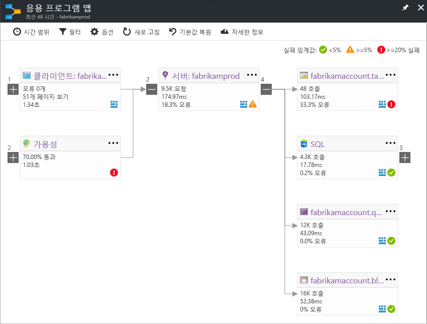

# Application Insights의 응용 프로그램 맵Application Map in Application Insights
[ Application Insights](app-insights-overview.md)에서 응용 프로그램 맵은 응용 프로그램 구성 요소의 종속성 관계를 시각적으로 레이아웃합니다.In [Azure Application Insights](app-insights-overview.md), Application Map is a visual layout of the dependency relationships of your application components. 각 구성 요소는 부하, 성능, 오류 및 경고와 같은 KPI를 보여 주어 성능 문제 또는 실패를 유발하는 모든 구성 요소를 발견할 수 있도록 합니다.Each component shows KPIs such as load, performance, failures, and alerts, to help you discover any component causing a performance issue or failure. 구성 요소부터 Application Insights 이벤트와 같은 보다 자세한 진단까지 클릭하면서 살펴볼 수 있습니다.You can click through from any component to more detailed diagnostics, such as Application Insights events. 앱에서 Azure 서비스를 사용하는 경우 SQL Database Advisor 권장 사항과 같은 Azure 진단도 살펴볼 수 있습니다.If your app uses Azure services, you can also click through to Azure diagnostics, such as SQL Database Advisor recommendations.

다른 차트와 같이 Azure 대시보드에 응용 프로그램 맵을 고정할 수 있으며 이 때 완벽하게 작동됩니다.Like other charts, you can pin an application map to the Azure dashboard, where it is fully functional. 

## 응용 프로그램 맵을 엽니다.Open the application map
응용 프로그램에 대한 개요 블레이드에서 맵을 엽니다.Open the map from the overview blade for your application:

지도에서는 다음을 보여 줍니다.The map shows:

* 가용성 테스트Availability tests
* 클라이언트 쪽 구성 요소(JavaScript SDK를 사용하여 모니터링됨)Client-side component (monitored with the JavaScript SDK)
* 서버 쪽 구성 요소Server-side component
* 클라이언트 및 서버 구성 요소의 종속성Dependencies of the client and server components

종속성 링크 그룹을 확장하고 축소할 수 있습니다.You can expand and collapse dependency link groups:

SQL, HTTP 등 한 종류의 종속성이 많은 경우 그룹화되어 표시될 수 있습니다.If you have many dependencies of one type (SQL, HTTP etc.), they may appear grouped. 

## 문제 발견Spot problems
각 노드에는 해당 구성 요소에 대한 부하, 성능 및 실패율과 같은 관련 성능 지표가 있습니다.Each node has relevant performance indicators, such as the load, performance, and failure rates for that component. 

경고 아이콘은 발생 가능한 문제를 강조 표시합니다.Warning icons highlight possible problems. 주황색 경고는 요청, 페이지 보기 또는 종속성 호출에서 오류가 발생했음을 의미합니다.An orange warning means there are failures in requests, page views or dependency calls. 빨간색 경고는 5% 이상의 실패율을 의미합니다.Red means a failure rate above 5%. 이러한 임계값을 조정하려는 경우 옵션을 엽니다.If you want to adjust these thresholds, open Options.

활성 경고도 다음과 같이 표시됩니다.Active alerts also show up: 

SQL Azure를 사용하는 경우 성능을 향상시키는 방법에 대한 권장 사항이 있는 경우 나타나는 아이콘이 있습니다.If you use SQL Azure, there's an icon that shows when there are recommendations on how you can improve performance. 

자세한 내용을 보려면 아이콘을 클릭합니다.Click any icon to get more details:

## 진단 클릭Diagnostic click through
맵의 각 노드에서 진단하기 위해 클릭할 대상을 지정합니다.Each of the nodes on the map offers targeted click through for diagnostics. 옵션은 노드 유형에 따라 다릅니다.The options vary depending on the type of the node.

Azure에서 호스팅되는 구성 요소의 경우 옵션은 직접 링크를 포함합니다.For components that are hosted in Azure, the options include direct links to them.

## 필터 및 시간 범위Filters and time range
기본적으로 맵은 선택한 시간 범위에 사용할 수 있는 모든 데이터를 요약합니다.By default, the map summarizes all the data available for the chosen time range. 하지만 특정 작업 이름 또는 종속성을 포함하도록 필터링할 수 있습니다.But you can filter it to include only specific operation names or dependencies.

* 작업 이름: 페이지 보기 및 서버 쪽 요청 형식을 모두 포함합니다.Operation name: This includes both page views and server-side request types. 이 옵션을 사용하면 맵은 선택한 작업에 대해서만 서버/클라이언트 쪽 노드의 KPI를 보여 줍니다.With this option, the map shows the KPI on the server/client-side node for the selected operations only. 특정 작업의 컨텍스트에서 호출될 종속성을 보여 줍니다.It shows the dependencies called in the context of those specific operations.
* 종속성 기본 이름: AJAX 브라우저 종속성 및 서버 쪽 종속성을 포함합니다.Dependency base name: This includes the AJAX browser dependencies and server-side dependencies. TrackDependency API를 사용하여 사용자 지정 종속성 원격 분석을 보고하는 경우 여기에도 표시됩니다.If you report custom dependency telemetry with the TrackDependency API, they also appear here. 지도에 표시되는 종속성을 선택할 수 있습니다.You can select the dependencies to show on the map. 현재 이 선택 항목은 서버 쪽 요청 또는 클라이언트 쪽 페이지 보기를 필터링하지 않습니다.Currently this selection does not filter the server-side requests, or the client-side page views.

## 필터 저장Save filters
적용한 필터를 저장하려면 필터링된 보기를 [대시보드](app-insights-dashboards.md)에 고정합니다.To save the filters you have applied, pin the filtered view onto a [dashboard](app-insights-dashboards.md).

## 오류 창Error pane
맵에서 노드를 클릭하면 오른쪽에 해당 노드에 대한 오류를 요약해서 보여 주는 오류 창이 표시됩니다.When you click a node in the map, an error pane is displayed on the right-hand side summarizing failures for that node. 먼저 오류는 작업 ID별로 그룹화된 후 문제 ID별로 그룹화됩니다.Failures are grouped first by operation ID and then grouped by problem ID.

오류를 클릭하면 해당 오류의 가장 최근 인스턴스로 이동됩니다.Clicking on a failure takes you to the most recent instance of that failure.

## 리소스 상태Resource health
일부 리소스 형식의 경우 오류 창 상단에 리소스 상태가 표시됩니다.For some resource types, resource health is displayed at the top of the error pane. 예를 들어 SQL 노드를 클릭하면 데이터베이스 상태와 발생한 경고가 표시됩니다.For example, clicking a SQL node will show the database health and any alerts that have fired.

리소스 이름을 클릭하여 해당 리소스에 대한 표준 개요 메트릭을 볼 수 있습니다.You can click the resource name to view standard overview metrics for that resource.

## 종단 간 시스템 앱 맵End-to-end system app maps

*SDK 버전 2.3 이상 필요합니다.**Requires SDK version 2.3 or higher*

응용 프로그램에 여러 구성 요소(예: 백 엔드 서비스 및 웹앱)가 있는 경우 하나의 통합된 앱 맵에 모두 표시할 수 있습니다.If your application has several components - for example, a back-end service in addition to the web app - then you can show them all on one integrated app map.

앱은 Application Insights SDK가 설치된 서버 간에 수행된 HTTP 종속성 호출을 따라 서버 노드를 찾습니다.The app map finds server nodes by following any HTTP dependency calls made between servers with the Application Insights SDK installed. 각 Application Insights 리소스는 하나의 서버를 포함하는 것으로 간주됩니다.Each Application Insights resource is assumed to contain one server.

### 다중 역할 앱 맵(미리 보기)Multi-role app map (preview)

미리 보기 다중 역할 앱 맵 기능을 사용하면 여러 서버가 같은 Application Insights 리소스/계측 키에 데이터를 전송하는 앱 맵을 사용할 수 있습니다.The preview multi-role app map feature allows you to use the app map with multiple servers sending data to the same Application Insights resource  / instrumentation key. 맵의 서버는 원격 분석 항목에 대한 cloud_RoleName 속성별로 분할됩니다.Servers in the map are segmented by the cloud_RoleName property on telemetry items. 미리 보기 블레이드에서 *다중 역할 응용 프로그램 맵*을 *설정*으로 지정하여 이 구성을 사용하도록 설정합니다.Set *Multi-role Application Map* to *On* from the Previews blade to enable this configuration.

이 접근 방법은 마이크로 서비스 응용 프로그램 또는 단일 Application Insights 리소스를 내에서 여러 서버 간에 이벤트의 상관 관계를 파악하려는 기타 시나리오에서 적절할 수 있습니다.This approach may be desired in a micro-services application, or in other scenarios where you want to correlate events across multiple servers within a single Application Insights resource.

## 비디오Video

> [!VIDEO https://channel9.msdn.com/events/Connect/2016/112/player] 

## 사용자 의견Feedback
포털 사용자 의견 옵션을 통해 피드백을 제공해주세요.Please provide feedback through the portal feedback option.

## 다음 단계Next steps

* [Azure PortalAzure portal](https://portal.azure.com)
