# DevOps용 Application Insights 개요Overview of Application Insights for DevOps

[Application Insights](app-insights-overview.md)를 사용하면 앱이 라이브 상태일 때 앱의 성능과 사용 방식을 신속하게 파악할 수 있습니다.With [Application Insights](app-insights-overview.md), you can quickly find out how your app is performing and being used when it's live. 문제가 경우 hello 영향을 평가 하는 데 도움이 됩니다. 및 hello 원인을 판별할 수를 알 수 있습니다.If there's a problem, it lets you know about it, helps you assess hello impact, and helps you determine hello cause.

웹 응용 프로그램을 개발하는 팀의 사례는 다음과 같습니다.Here's an account from a team that develops web applications:

* *"몇 일 전에 '사소한' 핫픽스가 배포되었습니다. 광범위 한 테스트 과정을 실행 하지 않은 있지만 hello 전면 포스트와 후면 끝 사이의 호환성 문제를 일으키는 hello 페이로드에 일부 예기치 않은 변경 내용이 병합 된 아쉽게도 합니다. 즉시 surged 서버 예외를 통해 경고 발생 하 고 hello 상황 인식 하 게 된 것입니다. 다른 페이지로 hello Application Insights 포털에서 몇 번의 클릭, 예외 호출 스택 toonarrow hello 문제에서 충분 한 정보를 가져온 합니다. 즉시 롤백할 하 고 hello 손상 범위가 제한 합니다. Application Insights가 만들었습니다 주기 hello devops의이 부분을 매우 간편 하 고 실행 가능한. "**"A couple of days ago, we deployed a 'minor' hotfix. We didn't run a broad test pass, but unfortunately some unexpected change got merged into hello payload, causing incompatibility between hello front and back ends. Immediately, server exceptions surged, our alert fired, and we were made aware of hello situation. A few clicks away on hello Application Insights portal, we got enough information from exception callstacks toonarrow down hello problem. We rolled back immediately and limited hello damage. Application Insights has made this part of hello devops cycle very easy and actionable."*

따릅니다 hello를 개발 하는 Fabrikam 은행에서 팀이이 문서에서 사용 하는 방법 (손잡이) 시스템 toosee 뱅킹 온라인 Application Insights tooquickly toocustomers 응답 및 업데이트를 확인 합니다.In this article we follow a team in Fabrikam Bank that develops hello online banking system (OBS) toosee how they use Application Insights tooquickly respond toocustomers and make updates.  

hello 팀 hello 다음 그림에에서 표시 된 DevOps 주기 중에 작동 합니다.hello team works on a DevOps cycle depicted in hello following illustration:

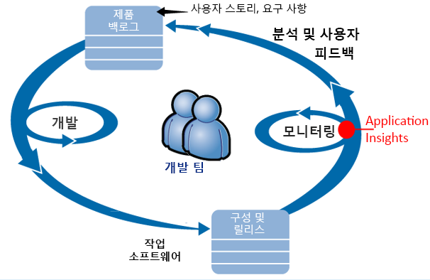

요구 사항이 개발 백로그(작업 목록)에 제공됩니다.Requirements feed into their development backlog (task list). 간단히 말해 종종 hello 개선 사항 및 확장 toohello 기존 응용 프로그램의 폼에 일반적으로 작동 하는 소프트웨어-배달 스 프린트 작동 합니다.They work in short sprints, which often deliver working software - usually in hello form of improvements and extensions toohello existing application. hello 라이브 앱이 새로운 기능으로 자주 업데이트 됩니다.hello live app is frequently updated with new features. 라이브 상태인 동안 hello 팀 성능 및 사용량을 사용 하 여 hello Application Insights에 대 한 것 모니터링 합니다.While it's live, hello team monitors it for performance and usage with hello help of Application Insights. 이 APM 데이터는 다시 팀의 개발 백로그로 전달됩니다.This APM data feeds back into their development backlog.

hello 팀 Application Insights toomonitor hello 라이브 웹 응용 프로그램에 긴밀 하 게 사용합니다.hello team uses Application Insights toomonitor hello live web application closely for:

* 성능.Performance. 요청 수가;와 응답 시간이 달라 toounderstand 원합니다 얼마나 CPU, 네트워크, 디스크 및 기타 리소스를 사용 중인 됩니다. 및 여기서는 hello 병목 상태입니다.They want toounderstand how response times vary with request count; how much CPU, network, disk, and other resources are being used; and where hello bottlenecks are.
* 오류.Failures. 예외가 있는 경우 실패 한 요청 수, 또는 성능 카운터는 모두에 범위를 벗어난 되 면 hello 팀 요구 tooknow 신속 하 게 조치를 취할 수 있도록 합니다.If there are exceptions or failed requests, or if a performance counter goes outside its comfortable range, hello team needs tooknow rapidly so that they can take action.
* 사용 현황.Usage. 새로운 기능 발표 될 때마다 hello 팀 tooknow toowhat 익스텐트를 사용 하는 및 사용자에 게 모든 문제가 있는지 여부.Whenever a new feature is released, hello team want tooknow toowhat extent it is used, and whether users have any difficulties with it.

Hello 주기의 hello 피드백 일부에 대해 중점적으로 설명 합니다.Let's focus on hello feedback part of hello cycle:

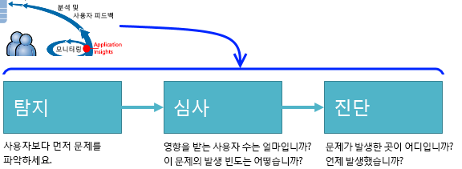

## 가용성 저하 감지Detect poor availability
Marcela Markova hello 손잡이 팀의 수석 개발자 이며 hello 리드 온라인 성능 모니터링을 사용 합니다.Marcela Markova is a senior developer on hello OBS team, and takes hello lead on monitoring online performance. 여러 [가용성 테스트](app-insights-monitor-web-app-availability.md)를 설정합니다.She sets up several [availability tests](app-insights-monitor-web-app-availability.md):

* Hello 앱에 대 한 hello 기본 방문 페이지에 대 한 단일 URL 테스트 http://fabrikambank.com/onlinebanking/ 합니다.A single-URL test for hello main landing page for hello app, http://fabrikambank.com/onlinebanking/. HTTP 코드 200 및 '시작!' 텍스트의 조건을 설정합니다.She sets criteria of HTTP code 200 and text 'Welcome!'. 이 테스트에 실패 하면 문제가 있습니다 심각 하 게 hello 네트워크 또는 hello 서버 또는 배포 문제 수도 있습니다.If this test fails, there's something seriously wrong with hello network or hello servers, or maybe a deployment issue. (또는 누군가가 hello 시작 변경 되었습니다!(Or someone has changed hello Welcome! 메시지 hello 페이지 그녀의 알 수 없습니다.)message on hello page without letting her know.)
* 각 페이지에서 몇 가지 중요한 세부 정보를 나열하고 확인하는 현재 계정에 로그인하고 가져오는 보다 심화된 다단계 테스트.A deeper multi-step test, which logs in and gets a current account listing, checking a few key details on each page. 이 테스트는 hello 링크 toohello 계정 데이터베이스가 작동을 확인 합니다.This test verifies that hello link toohello accounts database is working. Marcela는 가상 고객 ID를 사용합니다. 이 중 몇 개는 테스트 목적으로 유지 관리됩니다.She uses a fictitious customer id: a few of them are maintained for test purposes.

이러한 테스트를 설정, Marcela는 확신 해지고 hello 팀 모든 중단에 대해 알고 신속 하 게 됩니다.With these tests set up, Marcela is confident that hello team will quickly know about any outage.  

오류는 hello 웹 테스트 차트에 빨간색 점선으로 표시 합니다.Failures show up as red dots on hello web test chart:

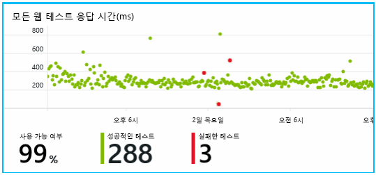

하지만 모든 오류에 대 한 경고는 toohello 개발 팀을 메일로 무엇 보다도 합니다.But more importantly, an alert about any failure is emailed toohello development team. 이러한 방법으로 알고 항목에 대 한 고객 hello 거의 모든 전에 합니다.In that way, they know about it before nearly all hello customers.

## 성능 모니터링Monitor Performance
Application Insights의 개요 페이지 hello는 다양 한 보여 주는 차트 [주요 지표](app-insights-web-monitor-performance.md)합니다.On hello overview page in Application Insights, there's a chart that shows a variety of [key metrics](app-insights-web-monitor-performance.md).

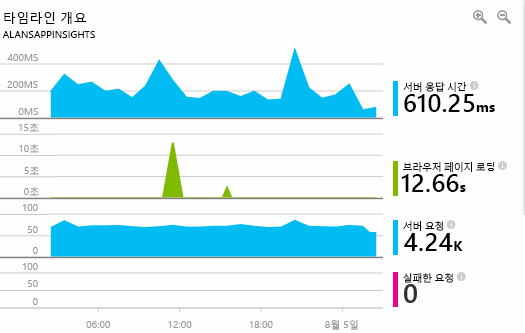

브라우저 페이지 로드 시간은 웹 페이지에서 직접 전송한 원격 분석에서 파생됩니다.Browser page load time is derived from telemetry sent directly from web pages. 서버 응답 시간, 서버 요청 수 및 실패 한 요청 수 hello 웹 서버에서 모든 측정 되며 여기에서 tooApplication Insights 전송 됩니다.Server response time, server request count, and failed request count are all measured in hello web server and sent tooApplication Insights from there.

Marcela는 hello 서버 응답 그래프 약간 관련 됩니다.Marcela is slightly concerned with hello server response graph. 이 그래프는 hello 시간 사이의 평균 간격 hello 서버는 사용자의 브라우저에서 HTTP 요청을 수신 하는 경우 및이 hello 응답을 반환 하는 경우를 보여줍니다.This graph shows hello average time between when hello server receives an HTTP request from a user's browser, and when it returns hello response. 이 차트의 변형 비정상적인 toosee hello 시스템에 부하가 변경 됨에 없습니다.It isn't unusual toosee a variation in this chart, as load on hello system varies. 하지만 경우 결과적으로 toobe 요청, 및 큰 hello 수의 작은 증가가 간의 상관 관계를 hello 응답 시간이 증가 합니다.But in this case, there seems toobe a correlation between small rises in hello count of requests, and big rises in hello response time. Hello 시스템 제한 위치나에 작동 하는 것을 나타낼 수는 있습니다.That could indicate that hello system is operating just at its limits.

Hello 서버 차트를 엽니다.She opens hello Servers charts:

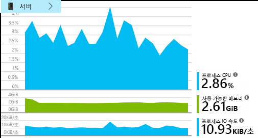

결과적으로 toobe 리소스 한계, 기미가 보이지 않습니다 하므로 maybe hello 충격 hello 서버 응답 차트에는 방금 만든 것입니다.There seems toobe no sign of resource limitation there, so maybe hello bumps in hello server response charts are just a coincidence.

## 경고 toomeet 목표 설정Set alerts toomeet goals
그럼에도 불구 하 고 눈 tookeep hello 응답 시간에 려 합니다.Nevertheless, she'd like tookeep an eye on hello response times. 너무 높음, 이동 하는 경우 항목에 대 한 tooknow 즉시 하려고 합니다.If they go too high, she wants tooknow about it immediately.

그래서 일반적인 임계값보다 큰 응답 시간에 대한 [경고](app-insights-metrics-explorer.md)를 설정합니다.So she sets an [alert](app-insights-metrics-explorer.md), for response times greater than a typical threshold. 이렇게 하면 응답 시간이 느린 경우 이에 대해 알게 된다는 확신이 생깁니다.This gives her confidence that she'll know about it if response times are slow.

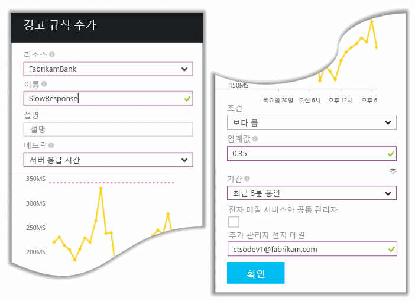

다양한 기타 메트릭에도 경고를 설정할 수 있습니다.Alerts can be set on a wide variety of other metrics. 예를 들어 hello 예외 수 높아지면 하거나 hello 사용 가능한 메모리, 낮은 경우 또는 클라이언트 요청 중인에 최고를 기록 하는 경우 전자 메일을 받을 수 있습니다.For example, you can receive emails if hello exception count becomes high, or hello available memory goes low, or if there is a peak in client requests.

## 스마트 검색 경고로 최신 정보 유지Stay informed with Smart Detection Alerts
다음 날 Application Insights에서 경고 메일이 도착합니다.Next day, an alert email does arrive from Application Insights. 것을 열면 그녀 그녀 설정 그녀 hello 응답 시간 경고 없습니다 합니다.But when she opens it, she finds it isn't hello response time alert that she set. 대신 이를 통해 실패한 요청, 즉 500개 이상의 오류 코드를 반환한 요청에서 갑자기 증가했음을 알 수 있습니다.Instead, it tells her there's been a sudden rise in failed requests - that is, requests that have returned failure codes of 500 or more.

실패 한 요청은 여기서 사용자-hello 코드에서 throw 된 예외를 일반적으로 다음 오류가 표시 됩니다.Failed requests are where users have seen an error - typically following an exception thrown in hello code. "지금은 세부 정보를 업데이트할 수 없습니다."라는 메시지가 표시될 수 있습니다.Maybe they see a message saying "Sorry we couldn't update your details right now." 또는 절대 일을 어쩌면 좋습니까 최저에서 스택 덤프 hello 웹 서버 지도 제작 hello 사용자의 화면에 나타납니다.Or, at absolute embarrassing worst, a stack dump appears on hello user's screen, courtesy of hello web server.

이 경고를 놀라게 않으므로 hello 그녀에 검토, hello 마지막으로 실패 한 요청 수가 encouragingly 낮은 되었습니다.This alert is a surprise, because hello last time she looked at it, hello failed request count was encouragingly low. 적은 수의 오류는 toobe 사용량이 많은 서버에서 예상 합니다.A small number of failures is toobe expected in a busy server.

또한 자신에 게 보안 컨텍스트로 실행 줄이려면 상당한 때문에 그녀 하지 않은 tooconfigure이이 경고 합니다.It was also a bit of a surprise for her because she didn't have tooconfigure this alert. Application Insights에는 스마트 검색이 포함되어 있습니다.Application Insights include Smart Detection. 또한 tooyour 응용 프로그램의 일반 오류 패턴 및 "가져옵니다 데" 실패 또는 높은 로드 또는 연결 된 tooother 메트릭이 특정 페이지에서 자동으로 조정합니다.It automatically adjusts tooyour app's usual failure pattern, and "gets used to" failures on a particular page, or under high load, or linked tooother metrics. 많은 한 경우에 hello 경보 발생 어떤 it 위에 tooexpect를 제공 합니다.It raises hello alarm only if there's a rise above what it comes tooexpect.

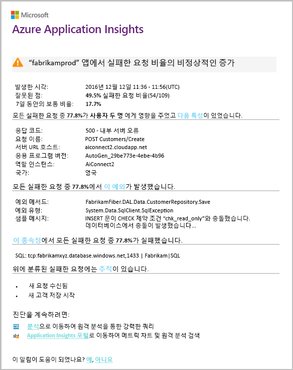

이 메일은 매우 유용합니다.This is a very useful email. 이 메일은 경고를 발생시키지 않습니다.It doesn't just raise an alarm. 너무 많은 hello 심사 및 진단 작업을 수행합니다.It does a lot of hello triage and diagnostic work, too.

얼마나 많은 고객이 영향을 받는지 어떤 웹 페이지 또는 작업이 영향을 받는지를 보여 줍니다.It shows how many customers are affected, and which web pages or operations. Marcela 훈련을으로 작업 tooget hello 전체 팀 그녀가 필요한 여부 또는 다음 주 될 때까지 무시할 수 있는지 여부를 결정할 수 있습니다.Marcela can decide whether she needs tooget hello whole team working on this as a fire drill, or whether it can be ignored until next week.

또한 hello 전자 메일에는 특정 예외가 발생 한 및-보다 흥미로운-해당 hello 실패는 실패 한 호출 tooa 특정 데이터베이스와 연결 된 보여 줍니다.hello email also shows that a particular exception occurred, and - even more interesting - that hello failure is associated with failed calls tooa particular database. 이 이유 hello 오류 갑자기 나타난 Marcela의 팀 모든 업데이트를 최근에 배포 하지 않은 경우에 설명 합니다.This explains why hello fault suddenly appeared even though Marcela's team has not deployed any updates recently.

Marcella이 전자이 메일을 기준으로 하는 hello 데이터베이스 팀 리더 hello를 ping 합니다.Marcella pings hello leader of hello database team based on this email. 그녀는 릴리스되는 핫픽스 hello에 지난 30 분입니다. 및 이런, 어쩌면 했을 수 있습니다 부 스키마 변경 중...She learns that they released a hot fix in hello past half hour; and Oops, maybe there might have been a minor schema change....

따라서 hello 문제 hello 방식으로 toobeing 고정 하기도 전에 로그를 조사 하 고 발생 하는 것의 15 분 이내입니다.So hello problem is on hello way toobeing fixed, even before investigating logs, and within 15 minutes of it arising. 그러나 Marcela hello 링크 tooopen Application Insights를 클릭합니다.However, Marcela clicks hello link tooopen Application Insights. 실패 한 요청으로 바로 열리고 호출 hello 연결된 목록이 종속성 호출에 실패 한 데이터베이스에 볼 수 있습니다.It opens straight onto a failed request, and she can see the failed database call in hello associated list of dependency calls.

## 예외 검색Detect exceptions
사용 하면 약간 설치 프로그램의 [예외](app-insights-asp-net-exceptions.md) 자동으로 보고 된 tooApplication Insights 됩니다.With a little bit of setup, [exceptions](app-insights-asp-net-exceptions.md) are reported tooApplication Insights automatically. 또한 포 명시적으로 너무 호출을 삽입 하 여[trackexception ()](app-insights-api-custom-events-metrics.md#trackexception) hello 코드로:They can also be captured explicitly by inserting calls too[TrackException()](app-insights-api-custom-events-metrics.md#trackexception) into hello code:  

    var telemetry = new TelemetryClient();
    ...
    try
    { ...
    }
    catch (Exception ex)
    {
       // Set up some properties:
       var properties = new Dictionary <string, string>
         {{"Game", currentGame.Name}};

       var measurements = new Dictionary <string, double>
         {{"Users", currentGame.Users.Count}};

       // Send hello exception telemetry:
       telemetry.TrackException(ex, properties, measurements);
    }

hello Fabrikam 은행 팀 명백한 복구가 없는 경우 원격 분석에서 예외를 항상 전송 된 hello 연습을 발전 했습니다.hello Fabrikam Bank team has evolved hello practice of always sending telemetry on an exception, unless there's an obvious recovery.  

실제로 전략은 이보다 더 큰: hello 고객은 무엇에 안 좋네요. 모든 경우에 원격 분석을 보낼 여부 hello 코드에서 tooan 예외를 동일한 지 여부를 toodo, 원했습니다.In fact, their strategy is even broader than that: They send telemetry in every case where hello customer is frustrated in what they wanted toodo, whether it corresponds tooan exception in hello code or not. 예를 들어 hello 외부 간 은행 전송 시스템 (hello 고객의 오류 없음을) operational 몇 가지 이유로 "이이 거래를 완료할 수 없습니다" 메시지를 반환 하는 경우 해당 이벤트를 추적 합니다.For example, if hello external inter-bank transfer system returns a "can't complete this transaction" message for some operational reason (no fault of hello customer) then they track that event.

    var successCode = AttemptTransfer(transferAmount, ...);
    if (successCode < 0)
    {
       var properties = new Dictionary <string, string>
            {{ "Code", returnCode, ... }};
       var measurements = new Dictionary <string, double>
         {{"Value", transferAmount}};
       telemetry.TrackEvent("transfer failed", properties, measurements);
    }

TrackException은 hello 스택의 복사본을 전송 하기 때문에 사용 되는 tooreport 예외입니다.TrackException is used tooreport exceptions because it sends a copy of hello stack. TrackEvent가 사용 되는 tooreport 다른 이벤트입니다.TrackEvent is used tooreport other events. 진단에서 유용할 수 있는 모든 속성을 연결할 수 있습니다.You can attach any properties that might be useful in diagnosis.

예외 및 이벤트에 hello 표시 [진단 검색](app-insights-diagnostic-search.md) 블레이드입니다.Exceptions and events show up in hello [Diagnostic Search](app-insights-diagnostic-search.md) blade. Toosee hello에 대 한 추가 속성을 드릴 수 있으며 스택 추적 수 있습니다.You can drill into them toosee hello additional properties and stack trace.

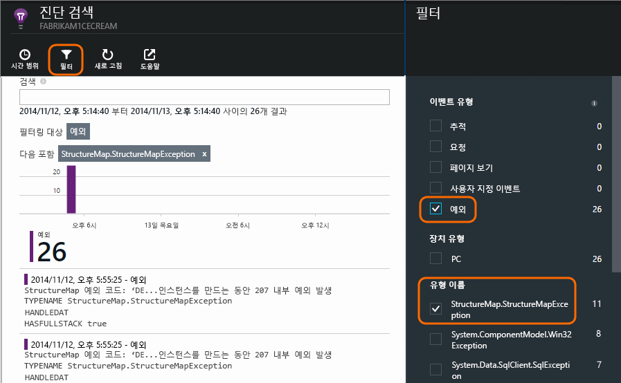

## 사전 모니터링Monitor proactively
Marcela는 가만히 앉아서 경고를 기다리고 있지는 않습니다.Marcela doesn't just sit around waiting for alerts. 모든 재배포 이후 곧 그녀에서는 [응답 시간이](app-insights-web-monitor-performance.md) -전체 그림 hello 둘 다 고 hello 테이블의 예외 뿐만 아니라 가장 느린 요청 수를 계산 합니다.Soon after every redeployment, she takes a look at [response times](app-insights-web-monitor-performance.md) - both hello overall figure and hello table of slowest requests, as well as exception counts.  

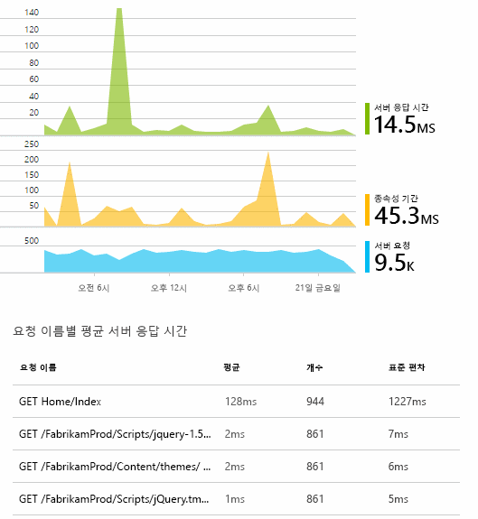

일반적으로 각 주의 hello로 마지막 비교 모든 배포의 hello 성능 효과 평가할 수 그녀.She can assess hello performance effect of every deployment, typically comparing each week with hello last. 가 갑자기 worsening 그녀 발생 하는 hello 관련 개발자와 합니다.If there's a sudden worsening, she raises that with hello relevant developers.

## 문제 심사Triage issues
심사-hello 심각도 및 문제의 범위 평가-은 검색 후 hello 첫 번째 단계입니다.Triage - assessing hello severity and extent of a problem - is hello first step after detection. 자정에 hello 팀 아웃 이라고 해야?Should we call out hello team at midnight? 또는 hello 백로그에 hello 다음 편리한 간격이 될 때까지 남아 있을 수 있습니다.Or can it be left until hello next convenient gap in hello backlog? 심사에는 몇 가지 핵심적인 질문이 있습니다.There are some key questions in triage.

얼마나 자주 이유가 무엇입니까? hello 개요 블레이드에서 hello 차트 제공 관점 tooa 문제가 발생 합니다.How often is it happening? hello charts on hello Overview blade give some perspective tooa problem. 예를 들어 hello Fabrikam 응용 프로그램 하나 밤 4 개의 웹 테스트 경고를 생성 합니다.For example, hello Fabrikam application generated four web test alerts one night. Hello 아침에 hello 차트를 보면 hello 팀 볼 수 실제로 일부 빨간 점이 했다는 것 대부분의 hello 테스트 여전히 녹색 있습니다.Looking at hello chart in hello morning, hello team could see that there were indeed some red dots, though still most of hello tests were green. 모든 이러한 간헐적인 문제 하나의 테스트 위치에서 했는지 지우기가 hello 가용성 차트를 드릴 합니다.Drilling into hello availability chart, it was clear that all of these intermittent problems were from one test location. 하나의 경로에만 영향을 미치는 명백한 네트워크 문제였으며 저절로 해결될 가능성이 큽니다.This was obviously a network issue affecting only one route, and would most likely clear itself.  

반대로 예외 수가 또는 응답 시간 그래프 hello 크고 안정적인 증가 리 분명히 toopanic에 대 한 합니다.By contrast, a dramatic and stable rise in hello graph of exception counts or response times is obviously something toopanic about.

유용한 심사 방법은 직접 해보기입니다.A useful triage tactic is Try It Yourself. Hello를 실행 하면 같은 문제를 알고 있는 것이 실제 합니다.If you run into hello same problem, you know it's real.

사용자의 어떤 비율을 사용 하는 영향을 받습니까? hello 세션 수 hello 실패율을 tooobtain 대략적인 응답 나눕니다.What fraction of users are affected? tooobtain a rough answer, divide hello failure rate by hello session count.

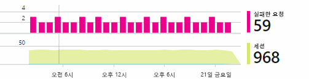

응답 속도가 느려지고 많을 때는 hello 테이블의 응답 속도가 가장 느린 요청 각 페이지의 hello 사용 빈도와 비교 합니다.When there are slow responses, compare hello table of slowest-responding requests with hello usage frequency of each page.

차단 hello 시나리오가 얼마나 중요 한지?How important is hello blocked scenario? 특정 사용자 이야기를 차단하는 기능적 문제가 있는 경우 큰 문제인가요?If this is a functional problem blocking a particular user story, does it matter much? 고객이 요금을 지불할 수 없는 경우라면 심각한 문제입니다. 고객이 화면 색상 기본 설정을 변경할 수 없는 경우라면 기다릴 수 있습니다.If customers can't pay their bills, this is serious; if they can't change their screen color preferences, maybe it can wait. hello hello 이벤트 또는 예외, detail 또는 hello 느린 페이지의 hello id, 고객 문제가 있는 위치를 알려줍니다.hello detail of hello event or exception, or hello identity of hello slow page, tells you where customers are having trouble.

## 문제 진단Diagnose issues
진단 디버깅 동일 hello 매우 되지 않습니다.Diagnosis isn't quite hello same as debugging. 대략적으로 이유, 있어야 hello 코드를 통해 추적을 시작 하기 전에 hello 문제가 발생 한 위치 및 시기.Before you start tracing through hello code, you should have a rough idea of why, where and when hello issue is occurring.

**때 발생할가?**  hello 이벤트 및 메트릭을 차트에서 제공 하는 hello 기록 보기 가능한 원인으로 쉽게 toocorrelate 효과 사용 하면 됩니다.**When does it happen?** hello historical view provided by hello event and metric charts makes it easy toocorrelate effects with possible causes. Hello 요청 수를 확인 하는 시간 또는 예외 응답률에 간헐적인 최대치 있는 경우: 그 최고 사용량이 hello 동일한 경우 리소스 문제와 같이 다음 시간입니다.If there are intermittent peaks in response time or exception rates, look at hello request count: if it peaks at hello same time, then it looks like a resource problem. 많은 CPU 또는 메모리 tooassign 필요 한가요?Do you need tooassign more CPU or memory? 또는 hello 부하에서 관리할 수 없는 종속성 입니까?Or is it a dependency that can't manage hello load?

**원인이 무엇인가요?****Is it us?**  다음은 실패할 가능성이 갑자기 드롭-예를 들어 경우 hello 고객이 원하는 계정 문-요청에는 특정 유형의 성능에 있는 경우 웹 응용 프로그램 보다는 한 외부 하위 시스템 수 있습니다.If you have a sudden drop in performance of a particular type of request - for example when hello customer wants an account statement - then there's a possibility it might be an external subsystem rather than your web application. 메트릭 탐색기에서 hello 종속성 실패율와 종속성 기간 속도 선택 하 고 몇 시간 또는 일 hello 문제 검색을 지 나 hello를 통해의 기록을 비교 합니다.In Metrics Explorer, select hello Dependency Failure rate and Dependency Duration rates and compare their histories over hello past few hours or days with hello problem you detected. 변경 된 상관 관계 지정, 하는 경우에 외부 하위 시스템 tooblame 수 있습니다.If there are correlating changes, then an external subsystem might be tooblame.  

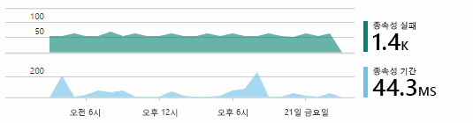

일부 느린 종속성 문제는 지리적 위치 문제입니다.Some slow dependency issues are geolocation problems. Fabrikam 은행은 Azure 가상 컴퓨터를 사용하며, 의도치 않게 다른 국가에 웹 서버 및 계정 서버가 있음을 발견했습니다.Fabrikam Bank uses Azure virtual machines, and discovered that they had inadvertently located their web server and account server in different countries. 그 중 하나를 마이그레이션하여 극적인 개선이 이루어졌습니다.A dramatic improvement was brought about by migrating one of them.

**무엇을 했나요?****What did we do?** Hello 문제에 종속성의 toobe 표시 되지 않으면 하 고 되지 있습니다 경우일 최근 변경 합니다.If hello issue doesn't appear toobe in a dependency, and if it wasn't always there, it's probably caused by a recent change. hello hello 메트릭 및 이벤트 차트에서 제공 하는 기록 큐브 뷰를 사용 하면 쉽게 toocorrelate 급격 한 변경 내용을 배포 합니다.hello historical perspective provided by hello metric and event charts makes it easy toocorrelate any sudden changes with deployments. Hello 문제에 대 한 hello 검색 범위가 좁혀집니다.That narrows down hello search for hello problem.

**무엇이 일어나고 있나요?****What's going on?** 몇 가지 문제만 거의 발생 하지 않습니다 및 오프 라인으로 테스트 하 여 어려운 tootrack 종료 될 수 있습니다.Some problems occur only rarely and can be difficult tootrack down by testing offline. 할 수 있는 옵션은 실시간 경우 tootry toocapture hello 버그입니다.All we can do is tootry toocapture hello bug when it occurs live. 예외 보고서에 hello 스택 덤프를 검사할 수 있습니다.You can inspect hello stack dumps in exception reports. 또한 자주 사용하는 로깅 프레임워크 또는 TrackTrace()나 TrackEvent()를 사용하여 추적 호출을 작성할 수 있습니다.In addition, you can write tracing calls, either with your favorite logging framework or with TrackTrace() or TrackEvent().  

Fabrikam은 계좌 간 이체에 간헐적인 문제가 있었으나 특정 계좌 유형에만 발생하지는 않았습니다.Fabrikam had an intermittent problem with inter-account transfers, but only with certain account types. toounderstand 향상 된 상황, hello 계정 유형에 대 한 속성 tooeach 호출으로 연결 하는 hello 코드에서 주요 시점의 tracktrace () 호출을 삽입 하 합니다.toounderstand better what was happening, they inserted TrackTrace() calls at key points in hello code, attaching hello account type as a property tooeach call. 아무런 상관이 해당 추적 아웃 쉽게 toofilter 진단 검색에서 합니다.That made it easy toofilter out just those traces in Diagnostic Search. 속성 및 측정값 toohello 추적 호출으로 매개 변수 값도 연결 합니다.They also attached parameter values as properties and measures toohello trace calls.

## 응답 toodiscovered 문제Respond toodiscovered issues
Hello 문제를 발견 했으므로 계획 toofix 있도록 지정할 수 있습니다 것입니다.Once you've diagnosed hello issue, you can make a plan toofix it. 어쩌면 tooroll 다시 최근 변경 또는 하 방금 고 파일을 수정 해야 합니다.Maybe you need tooroll back a recent change, or maybe you can just go ahead and fix it. Hello 수정 작업이 완료 되 면 Application Insights 성공 여부를 알려 줍니다.Once hello fix is done, Application Insights tells you whether you succeeded.  

Fabrikam 은행의 개발 팀에서 수행할 Application Insights를 사용 하는 toobefore를 사용 하는 것 보다 더 구조화 된 접근 방식을 tooperformance 측정 합니다.Fabrikam Bank's development team take a more structured approach tooperformance measurement than they used toobefore they used Application Insights.

* hello Application Insights 개요 페이지에서 특정 측정값의 관점에서 성능 목표를 설정합니다.They set performance targets in terms of specific measures in hello Application Insights overview page.
* 성능 측정 '깔대기'를 통해 사용자 진행률을 측정 하는 hello 메트릭과 같은 hello 시작부터 hello 응용 프로그램으로 디자인They design performance measures into hello application from hello start, such as hello metrics that measure user progress through 'funnels.'  

## 사용자 활동 모니터링Monitor user activity
응답 시간은 좋은 일관 되 게 하 고 몇 가지 예외 사항이 hello 개발 팀 toousability에 이동할 수 있습니다.When response time is consistently good and there are few exceptions, hello dev team can move on toousability. 어떻게 tooimprove hello 사용자 환경 및 더 많은 사용자가 tooachieve hello 원하는 하는 tooencourage 방법에 대해 생각할 수 목표입니다.They can think about how tooimprove hello users' experience, and how tooencourage more users tooachieve hello desired goals.

Application Insights 사용된 toolearn 사용자가 앱을 사용 하 여 수행할 수도 있습니다.Application Insights can also be used toolearn what users do with an app. 원활 하 게 실행 되 면 사용자가 같은 또는, 난이도 얼마나 자주 상태가 있는 hello 팀이 tooknow를 hello 가장 인기 있는 기능을 원합니다.Once it's running smoothly, hello team would like tooknow which features are hello most popular, what users like or have difficulty with, and how often they come back. 이는 예정된 작업의 우선 순위를 정하는 데 도움이 됩니다.That will help them prioritize their upcoming work. 및 각 기능의 toomeasure hello 성공 hello 개발 주기의 일환으로 계획할 수 있습니다.And they can plan toomeasure hello success of each feature as part of hello development cycle. 

예를 들어 hello 웹 사이트를 통해 일반적인 사용자 여행에 명확한 "깔때기."For example, a typical user journey through hello web site has a clear "funnel." 여러 유형의 대출 hello 속도로 많은 고객 들이 있습니다.Many customers look at hello rates of different types of loan. 더 적은 수 hello 인용 형태로 toofill 이동 합니다.A smaller number go on toofill in hello quotation form. 이러한 인용구가 몇 계속를 hello 대출 꺼내서 합니다.Of those who get a quotation, a few go ahead and take out hello loan.

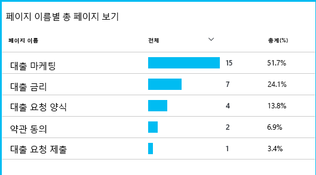

고객의 가장 큰 숫자 hello 드롭 하는 위치를 고려 하 여 hello 비즈니스 어떻게 tooget toohello 맨 hello 통해 더 많은 사용자가 깔때기 아웃 작업할 수 있습니다.By considering where hello greatest numbers of customers drop out, hello business can work out how tooget more users through toohello bottom of hello funnel. 경우에 따라 사용자 환경 (UX) 오류가 있을 수 있습니다-예를 들어 hello '다음' 단추 하드 toofind 되었거나 hello 지침이 명백한있지 않습니다.In some cases, there might be a user experience (UX) failure - for example, hello 'next' button is hard toofind, or hello instructions aren't obvious. 같게 드롭 아웃은 보다 중요 한 비즈니스 이유는: 미정 hello 대출 속도가 너무 높습니다.More likely, there are more significant business reasons for drop-outs: maybe hello loan rates are too high.

어떤 hello 이유 hello 데이터 hello 팀으로를 사용자가 수행 하는 데 도움이 됩니다.Whatever hello reasons, hello data helps hello team work out what users are doing. 자세한 내용을 toowork를 삽입 하는 자세한 추적 호출 될 수 있습니다.More tracking calls can be inserted toowork out more detail. trackevent () 사용 하는 toocount hello 자세히 살펴보려면까지에서 모든 사용자 동작 일 수 있습니다 개별 단추 클릭과 지불 같은 toosignificant 기록 합니다.TrackEvent() can be used toocount any user actions, from hello fine detail of individual button clicks, toosignificant achievements such as paying off a loan.

hello 팀 사용자 작업에 대 한 정보를 사용 하는 toohaving 들어옵니다.hello team is getting used toohaving information about user activity. 오늘날에는 새로운 기능을 디자인할 때마다 사용에 대한 피드백을 받는 방법을 생각합니다.Nowadays, whenever they design a new feature, they work out how they will get feedback about its usage. 이러한 디자인 hello 기능 hello 시작을 추적 하 여 호출 합니다.They design tracking calls into hello feature from hello start. 각 개발 주기에서 hello 피드백 tooimprove hello 기능을 사용합니다.They use hello feedback tooimprove hello feature in each development cycle.

[사용 현황 추적에 대해 자세히 읽어보세요](app-insights-usage-overview.md).[Read more about tracking usage](app-insights-usage-overview.md).

## Hello DevOps 주기를 적용 합니다.Apply hello DevOps cycle
따라서 어떻게 팀 사용 하 여 Application Insights 뿐 아니라 toofix 개별 문제, tooimprove 하지만 개발 수명입니다.So that's how one team use Application Insights not just toofix individual issues, but tooimprove their development lifecycle. Application Insights가 응용 프로그램의 성능 관리를 개선하는 데 어떻게 도움을 줄 수 있는지에 대한 아이디어를 제공했기 바랍니다.I hope it has given you some ideas about how Application Insights can help you with application performance management in your own applications.

## 비디오Video

> [!VIDEO https://channel9.msdn.com/events/Connect/2016/112/player]

## 다음 단계Next steps
응용 프로그램의 hello 특성에 따라 여러 가지 방법으로 시작할 수 있습니다.You can get started in several ways, depending on hello characteristics of your application. 가장 적합한 항목을 선택하세요.Pick what suits you best:

* [ASP.NET 웹 응용 프로그램ASP.NET web application](app-insights-asp-net.md)
* [Java 웹 응용 프로그램Java web application](app-insights-java-get-started.md)
* [Node.js 웹 응용 프로그램Node.js web application](app-insights-nodejs.md)
* [IIS](app-insights-monitor-web-app-availability.md), [J2EE](app-insights-java-live.md) 또는 [Azure](app-insights-azure.md)에서 호스트되는 이미 배포된 앱Already deployed apps, hosted on [IIS](app-insights-monitor-web-app-availability.md), [J2EE](app-insights-java-live.md), or [Azure](app-insights-azure.md).
* [웹 페이지](app-insights-javascript.md) -단일 페이지 응용 프로그램 또는 일반 웹 페이지-는 자체적으로 또는 더하기 tooany hello 서버 옵션 중에서이 하 게 사용 합니다.[Web pages](app-insights-javascript.md) - Single Page App or ordinary web page - use this on its own or in addition tooany of hello server options.
* [가용성 테스트](app-insights-monitor-web-app-availability.md) tootest에서 응용 프로그램에 공용 인터넷 hello 합니다.[Availability tests](app-insights-monitor-web-app-availability.md) tootest your app from hello public internet.
