# Application Insights란?What is Application Insights?
Application Insights는 여러 플랫폼의 웹 개발자를 위한 확장 가능한 APM(응용 프로그램 성능 관리) 서비스입니다.Application Insights is an extensible Application Performance Management (APM) service for web developers on multiple platforms. 이를 사용하여 라이브 웹 응용 프로그램을 모니터링합니다.Use it to monitor your live web application. 성능 이상을 자동으로 감지합니다.It will automatically detect performance anomalies. 사용자가 문제를 진단하고 앱을 사용하여 실제로 수행할 작업을 이해할 수 있도록 돕는 강력한 분석 도구를 포함합니다.It includes powerful analytics tools to help you diagnose issues and to understand what users actually do with your app.  성능 및 가용성을 지속적으로 향상시킬 수 있도록 설계되었습니다.It's designed to help you continuously improve  performance and usability. .NET, Node.js 및 J2EE, 호스팅된 온-프레미스 또는 클라우드의 다양한 플랫폼에서 앱과 함께 사용합니다.It works for apps on a wide variety of platforms including .NET, Node.js and J2EE, hosted on-premises or in the cloud. DevOps 프로세스와 통합되며, 다양한 개발 도구와의 연결 지점을 갖고 있습니다.It  integrates with your devOps process, and has connection points to a variety of development tools.

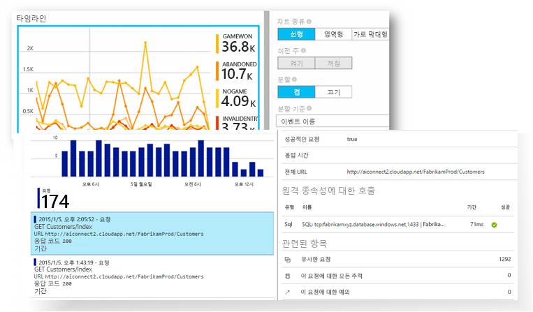

[소개 애니메이션을 살펴보겠습니다](https://www.youtube.com/watch?v=fX2NtGrh-Y0).[Take a look at the intro animation](https://www.youtube.com/watch?v=fX2NtGrh-Y0).

## Application Insights의 작동 방식How does Application Insights work?
응용 프로그램에 작은 계측 패키지를 설치하고 Microsoft Azure 포털에서 Application Insights 리소스를 설정합니다.You install a small instrumentation package in your application, and set up an Application Insights resource in the Microsoft Azure portal. 이 계측 기능이 앱을 모니터링하여 포털에 원격 분석 데이터를 보냅니다.The instrumentation monitors your app and sends telemetry data to the portal. 응용 프로그램을 어디서나 실행할 수 있습니다. Azure에 호스트할 필요가 없습니다.(The application can run anywhere - it doesn't have to be hosted in Azure.)

웹 서비스 응용 프로그램뿐 아니라 모든 백그라운드 구성 요소와 웹 페이지 자체의 JavaScript까지 계측할 수 있습니다.You can instrument not only the web service application, but also any background components, and the JavaScript in the web pages themselves. 

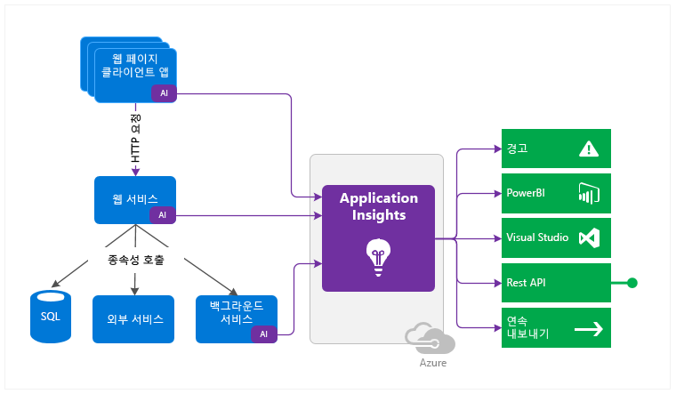

뿐만 아니라 호스트 환경에서 성능 카운터, Azure 진단, Docker 로그 등의 원격 분석을 가져올 수 있습니다.In addition, you can pull in telemetry from the host environments such as performance counters, Azure diagnostics, or Docker logs. 웹 서비스에 주기적으로 가상 요청을 보내는 웹 테스트를 설정할 수도 있습니다.You can also set up web tests that periodically send synthetic requests to your web service.

이러한 원격 분석 스트림은 강력한 분석 및 검색 도구를 원시 데이터에 적용할 수 있는 Azure Portal에 통합됩니다.All these telemetry streams are integrated in the Azure portal, where you can apply powerful analytic and search tools to the raw data.

### 오버헤드는 무엇입니까?What's the overhead?
앱 성능에 미치는 영향을 매우 작습니다.The impact on your app's performance is very small. 추적 호출은 차단되지 않으며, 별도의 스레드로 일괄 처리 및 전송합니다.Tracking calls are non-blocking, and are batched and sent in a separate thread.

## Application Insights는 무엇을 모니터링하나요?What does Application Insights monitor?

Application Insights는 응용 프로그램 팀에서 앱의 작동 방식과 사용 방식을 이해하는 데 도움을 주기 위해 고안되었습니다.Application Insights is aimed at the development team, to help you understand how your app is performing and how it's being used. 다음 사항을 모니터링합니다.It monitors:

* **요청 속도, 응답 시간 및 실패율** - 하루 중 어느 시간에 어떤 페이지를 가장 많이 방문하는지, 사용자가 어디에 있는지 확인합니다.**Request rates, response times, and failure rates** - Find out which pages are most popular, at what times of day, and where your users are. 어떤 페이지가 가장 성능이 우수한지 확인합니다.See which pages perform best. 요청이 더 있는데 응답 시간과 실패율이 높아지면 아마도 리소스 문제가 있는 것입니다.If your response times and failure rates go high when there are more requests, then perhaps you have a resourcing problem. 
* **종속성 비율, 응답 시간 및 실패율** - 외부 서비스 때문에 속도가 느려지는지 확인합니다.**Dependency rates, response times, and failure rates** - Find out whether external services are slowing you down.
* **예외** - 집계 통계를 분석하거나 특정 인스턴스를 선택하여 스택 추적 및 관련 요청을 자세히 알아봅니다.**Exceptions** - Analyse the aggregated statistics, or pick specific instances and drill into the stack trace and related requests. 서버 및 브라우저 예외가 전부 보고됩니다.Both server and browser exceptions are reported.
* **페이지 보기 및 로드 성능** - 사용자의 브라우저에서 보고합니다.**Page views and load performance** - reported by your users' browsers.
* 웹 페이지의 **AJAX 호출** - 속도, 응답 시간 및 실패율.**AJAX calls** from web pages - rates, response times, and failure rates.
* **사용자 및 세션 수**.**User and session counts**.
* Windows 또는 Linux 서버 컴퓨터의 **성능 카운터** - CPU, 메모리, 네트워크 사용량 등.**Performance counters** from your Windows or Linux server machines, such as CPU, memory, and network usage. 
* Docker 또는 Azure의 **호스트 진단**.**Host diagnostics** from Docker or Azure. 
* 앱의 **진단 추적 로그** - 추적 이벤트를 요청과 상호 연결하는 데 사용됩니다.**Diagnostic trace logs** from your app - so that you can correlate trace events with requests.
* 판매된 품목, 승리한 게임 등의 비즈니스 이벤트를 추적하기 위해 개발자가 직접 클라이언트 또는 서버 코드로 작성하는 **사용자 지정 이벤트 및 메트릭**.**Custom events and metrics** that you write yourself in the client or server code, to track business events such as items sold or games won.

## 원격 분석은 어디서 찾을 수 있나요?Where do I see my telemetry?

다양한 방법으로 데이터를 탐색할 수 있습니다.There are plenty of ways to explore your data. 다음 문서를 확인하세요.Check out these articles:

|  |  |
| --- | --- |
| [**스마트 검색 및 수동 경고****Smart detection and manual alerts**](app-insights-proactive-diagnostics.md) 자동 경고는 앱의 일반적인 원격 분석 패턴에 맞게 조정되고, 일반적인 패턴을 벗어나는 항목이 있으면 트리거합니다.Automatic alerts adapt to your app's normal patterns of telemetry and trigger when there's something outside the usual pattern. 특정 수준의 사용자 지정 또는 표준 메트릭에 대해 [경고를 설정](app-insights-alerts.md)할 수도 있습니다.You can also [set alerts](app-insights-alerts.md) on particular levels of custom or standard metrics. |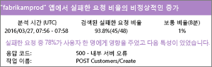 |
| [**응용 프로그램 맵****Application map**](app-insights-app-map.md) 주요 메트릭 및 경고가 포함된 앱의 구성 요소입니다.The components of your app, with key metrics and alerts. |  |
| [**프로파일러****Profiler**](app-insights-profiler.md) 샘플링된 요청의 실행 프로필을 검사합니다.Inspect the execution profiles of sampled requests. |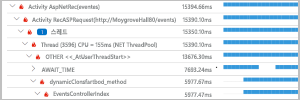 |
| [**사용 현황 분석****Usage analysis**](app-insights-usage-overview.md) 사용자 구분 및 재방문 주기를 분석합니다.Analyze user segmentation and retention.| |
| [**인스턴스 데이터에 대한 진단 검색****Diagnostic search for instance data**](app-insights-diagnostic-search.md) 요청, 예외, 종속성 호출, 로그 추적 및 페이지 보기와 같은 이벤트를 검색하고 필터링할 수 있습니다.Search and filter events such as requests, exceptions, dependency calls, log traces, and page views.  |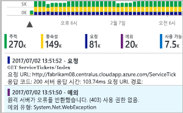 |
| [**집계된 데이터에 대한 메트릭 탐색기****Metrics Explorer for aggregated data**](app-insights-metrics-explorer.md) 요청, 오류 및 예외의 비율과 응답 시간, 페이지 로드 시간과 같은 집계된 데이터를 탐색, 필터링 및 분할할 수 있습니다.Explore, filter, and segment aggregated data such as rates of requests, failures, and exceptions; response times, page load times. | |
| [**대시보드****Dashboards**](app-insights-dashboards.md#dashboards) 여러 리소스의 데이터를 매시업한 후 다른 사용자와 공유할 수 있습니다.Mash up data from multiple resources and share with others. 다중 구성 요소 응용 프로그램에서 사용하거나 단체방에 연속으로 표시하는 데 유용합니다.Great for multi-component applications, and for continuous display in the team room. | |
| [**라이브 메트릭 스트림****Live Metrics Stream**](app-insights-live-stream.md) 새 빌드를 배포할 때 이러한 실시간에 가까운 성능 표시기를 확인하여 모든 항목이 예상대로 작동하는지 알 수 있습니다.When you deploy a new build, watch these near-real-time performance indicators to make sure everything works as expected. |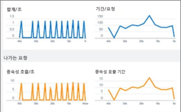 |
| [**분석****Analytics**](app-insights-analytics.md) 이 강력한 쿼리 언어를 사용하여 앱의 성능 및 사용 현황에 대한 까다로운 질문에 답변할 수 있습니다.Answer tough questions about your app's performance and usage by using this powerful query language. |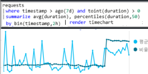 |
| [**Visual Studio****Visual Studio**](app-insights-visual-studio.md) 코드의 성능 데이터를 참조하세요.See performance data in the code. 스택 추적의 코드로 이동하세요.Go to code from stack traces.|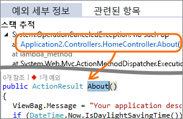 |
| [**스냅숏 디버거****Snapshot debugger**](app-insights-snapshot-debugger.md) 실시간 작업에서 샘플링된 스냅숏을 매개 변수 값으로 디버그합니다.Debug snapshots sampled from live operations, with parameter values.|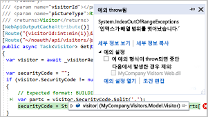 |
| [**Power BI****Power BI**](app-insights-export-power-bi.md) 사용 현황 메트릭을 다른 비즈니스 인텔리전스와 통합합니다.Integrate usage metrics with other business intelligence.| 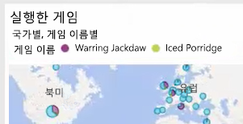|
| [**REST API****REST API**](https://dev.applicationinsights.io/) 메트릭 및 원시 데이터에 대한 쿼리를 실행하는 코드를 작성합니다.Write code to run queries over your metrics and raw data.|  |
| [**연속 내보내기****Continuous export**](app-insights-export-telemetry.md) 원시 데이터가 도착하는 즉시 저장소에 대량으로 내보냅니다.Bulk export of raw data to storage as soon as it arrives. |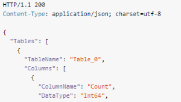 |

## Application Insights를 어떻게 사용하나요?How do I use Application Insights?

### 모니터Monitor
앱에 Application Insights를 설치하고, [가용성 웹 테스트를 설정](app-insights-monitor-web-app-availability.md)하고, 다음을 수행합니다.Install Application Insights in your app, set up [availability web tests](app-insights-monitor-web-app-availability.md), and:

* 종속성, 페이지 로드 및 AJAX 호출의 부하, 응답성 및 성능을 모니터링하기 위한 팀 공간용 [대시보드](app-insights-dashboards.md)를 설정합니다.Set up a [dashboard](app-insights-dashboards.md) for your team room to keep an eye on load, responsiveness, and the performance of your dependencies, page loads, and AJAX calls.
* 가장 느리고 대부분 실패한 요청을 검색합니다.Discover which are the slowest and most failing requests.
* 새 릴리스를 배포할 때 [라이브 스트림](app-insights-live-stream.md)을 보고 성능 저하를 즉시 인식합니다.Watch [Live Stream](app-insights-live-stream.md) when you deploy a new release, to know immediately about any degradation.

### 감지, 진단Detect, Diagnose
경고를 수신하거나 문제를 검색한 경우:When you receive an alert or discover a problem:

* 얼마나 많은 사용자가 영향을 받는지 평가합니다.Assess how many users are affected.
* 오류는 예외, 종속성 호출 및 추적과 연관이 있습니다.Correlate failures with exceptions, dependency calls and traces.
* 프로파일러, 스냅숏, 스택 덤프 및 추적 로그를 검사합니다.Examine profiler, snapshots, stack dumps, and trace logs.

### 빌드, 측정, 학습Build, Measure, Learn
배포하는 새로운 각 기능의 [효율성을 측정](app-insights-usage-overview.md)합니다.[Measure the effectiveness](app-insights-usage-overview.md) of each new feature that you deploy.

* 고객이 새 UX 또는 비즈니스 기능을 사용하는 방식을 측정하도록 계획합니다.Plan to measure how customers use new UX or business features.
* 코드에 사용자 지정 원격 분석을 작성합니다.Write custom telemetry into your code.
* 원격 분석에서 얻은 구체적인 증거를 기반으로 다음 개발 주기를 결정합니다.Base the next development cycle on hard evidence from your telemetry.

## 시작Get started
Application Insights는 Microsoft Azure에서 호스트되는 다양한 서비스 중 하나이며, 원격 분석이 분석 및 프레젠테이션을 위해 이 서비스로 전송됩니다.Application Insights is one of the many services hosted within Microsoft Azure, and telemetry is sent there for analysis and presentation. 따라서 다른 작업을 수행하기 전에 [Microsoft Azure](http://azure.com)를 구독해야 합니다.So before you do anything else, you'll need a subscription to [Microsoft Azure](http://azure.com). 등록은 무료이며 Application Insights에 대해 기본 [가격 책정 계획](https://azure.microsoft.com/pricing/details/application-insights/)을 선택하는 경우 응용 프로그램 사용량이 특정 크기로 커질 때까지 무료입니다.It's free to sign up, and if you choose the basic [pricing plan](https://azure.microsoft.com/pricing/details/application-insights/) of Application Insights, there's no charge until your application has grown to have substantial usage. 조직에 이미 구독이 있으면 해당 구독에 Microsoft 계정을 추가할 수 있습니다.If your organization already has a subscription, they could add your Microsoft account to it.

시작하는 데는 몇 가지 방법이 있습니다.There are several ways to get started. 본인에게 적합한 방법으로 시작합니다.Begin with whichever works best for you. 나중에 계정을 더 추가할 수 있습니다.You can add the others later.

* **런타임: 서버에서 웹앱을 계측합니다.****At run time: instrument your web app on the server.** 코드에 대한 업데이트를 방지합니다.Avoids any update to the code. 서버에 대한 관리자 액세스 권한이 필요합니다.You need admin access to your server.
  * [**IIS 온-프레미스 또는 VM****IIS on-premises or on a VM**](app-insights-monitor-performance-live-website-now.md)
  * [**Azure 웹앱 또는 VM****Azure web app or VM**](app-insights-monitor-performance-live-website-now.md)
  * [**J2EE****J2EE**](app-insights-java-live.md)
* **개발 타임: 코드에 Application Insights를 추가합니다.****At development time: add Application Insights to your code.** 사용자 지정 원격 분석을 작성하고 백 엔드 및 데스크톱 앱을 계측할 수 있습니다.Allows you to write custom telemetry and to instrument back-end and desktop apps.
  * [Visual Studio](app-insights-asp-net.md) 2013 업데이트 2 이상[Visual Studio](app-insights-asp-net.md) 2013 update 2 or later.
  * [Eclipse](app-insights-java-eclipse.md)의 Java 또는 [기타 도구](app-insights-java-get-started.md)Java in [Eclipse](app-insights-java-eclipse.md) or [other tools](app-insights-java-get-started.md)
  * [Node.JSNode.js](app-insights-nodejs.md)
  * [기타 플랫폼Other platforms](app-insights-platforms.md)
* 페이지 보기, AJAX 및 기타 클라이언트 쪽 원격 분석에 대해 **[웹 페이지를 계측](app-insights-javascript.md)**합니다.**[Instrument your web pages](app-insights-javascript.md)** for page view, AJAX and other client-side telemetry.
* **[가용성 테스트](app-insights-monitor-web-app-availability.md)** -서버에서 정기적으로 웹 사이트를 ping합니다.**[Availability tests](app-insights-monitor-web-app-availability.md)** - ping your website regularly from our servers.

## 다음 단계Next steps
다음을 사용하여 런타임에 시작하세요.Get started at runtime with:

* [IIS 서버IIS server](app-insights-monitor-performance-live-website-now.md)
* [J2EE 서버J2EE server](app-insights-java-live.md)

다음을 사용하여 개발 시에 시작하세요.Get started at development time with:

* [ASP.NETASP.NET](app-insights-asp-net.md)
* [JavaJava](app-insights-java-get-started.md)
* [Node.JSNode.js](app-insights-nodejs.md)

## 지원 및 피드백Support and feedback
* 질문 및 문제:Questions and Issues:
  * [문제 해결][qna][Troubleshooting][qna]
  * [MSDN 포럼MSDN Forum](https://social.msdn.microsoft.com/Forums/vstudio/home?forum=ApplicationInsights)
  * [StackOverflowStackOverflow](http://stackoverflow.com/questions/tagged/ms-application-insights)
* 사용자 제안:Your suggestions:
  * [UserVoiceUserVoice](https://visualstudio.uservoice.com/forums/357324)
* 블로그:Blog:
  * [Application Insights 블로그Application Insights blog](https://azure.microsoft.com/blog/tag/application-insights)

## 비디오Videos

[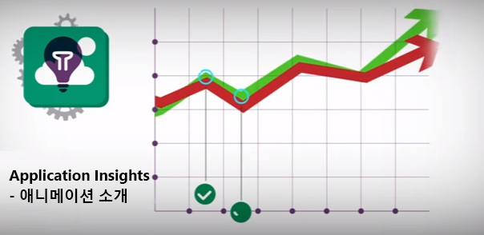](https://www.youtube.com/watch?v=fX2NtGrh-Y0)

> [!VIDEO https://channel9.msdn.com/events/Connect/2016/100/player] 

<!--Link references-->

[android]: https://github.com/Microsoft/ApplicationInsights-Android
[azure]: ../insights-perf-analytics.md
[client]: app-insights-javascript.md
[desktop]: app-insights-windows-desktop.md
[detect]: app-insights-detect-triage-diagnose.md
[greenbrown]: app-insights-asp-net.md
[ios]: https://github.com/Microsoft/ApplicationInsights-iOS
[java]: app-insights-java-get-started.md
[knowUsers]: app-insights-web-track-usage.md
[platforms]: app-insights-platforms.md
[portal]: http://portal.azure.com/
[qna]: app-insights-troubleshoot-faq.md
[redfield]: app-insights-monitor-performance-live-website-now.md
