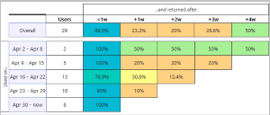

# Application Insights란?What is Application Insights?
Application Insights는 여러 플랫폼의 웹 개발자를 위한 확장 가능한 APM(응용 프로그램 성능 관리) 서비스입니다.Application Insights is an extensible Application Performance Management (APM) service for web developers on multiple platforms. Toomonitor를 사용 하 여 라이브 웹 응용 프로그램입니다.Use it toomonitor your live web application. 성능 이상을 자동으로 감지합니다.It will automatically detect performance anomalies. Toounderstand 응용 프로그램과 함께 실제로 사용자가 수행 하 고 문제를 진단 하는 강력한 분석 도구 toohelp을 포함 됩니다.It includes powerful analytics tools toohelp you diagnose issues and toounderstand what users actually do with your app.  기능은 toohelp 성능과 유용성 지속적으로 향상 됩니다.It's designed toohelp you continuously improve  performance and usability. 앱에 대 한 작동.NET, Node.js 및 J2EE 포함 하는 플랫폼은 다양 한 온-프레미스 호스팅 또는 hello 클라우드에 있습니다.It works for apps on a wide variety of platforms including .NET, Node.js and J2EE, hosted on-premises or in hello cloud. DevOps 프로세스와 통합 하 고에 연결 지점 tooa 다양 한 개발 도구입니다.It  integrates with your devOps process, and has connection points tooa variety of development tools.

[Hello 소개 애니메이션 살펴보기](https://www.youtube.com/watch?v=fX2NtGrh-Y0)합니다.[Take a look at hello intro animation](https://www.youtube.com/watch?v=fX2NtGrh-Y0).

## Application Insights의 작동 방식How does Application Insights work?
응용 프로그램에서 작은 계측 패키지를 설치 하 고 hello Microsoft Azure 포털에는 Application Insights 리소스를 설정 합니다.You install a small instrumentation package in your application, and set up an Application Insights resource in hello Microsoft Azure portal. hello 계측 응용 프로그램을 모니터링 하 고 원격 분석 데이터 toohello 포털을 보냅니다.hello instrumentation monitors your app and sends telemetry data toohello portal. (hello 응용 프로그램 원격 실행할 수-toobe Azure에서 호스트 되는 것은 아닙니다.)(hello application can run anywhere - it doesn't have toobe hosted in Azure.)

Hello 웹 서비스 응용 프로그램 뿐 아니라 모든 백그라운드 구성 요소를 계측할 수 있으며 자체 hello 웹 페이지에서 JavaScript hello 수 있습니다.You can instrument not only hello web service application, but also any background components, and hello JavaScript in hello web pages themselves. 

또한 성능 카운터, Azure 진단 또는 Docker 로그 같은 hello 호스트 환경에서 원격 분석에서 가져올 수 있습니다.In addition, you can pull in telemetry from hello host environments such as performance counters, Azure diagnostics, or Docker logs. 정기적으로 요청을 보내는 통합 tooyour 웹 서비스 웹 테스트를 설정할 수 있습니다.You can also set up web tests that periodically send synthetic requests tooyour web service.

이러한 원격 분석 스트림에에 통합 되어 모든 hello Azure 포털을 적용할 수 있는 강력한 분석 및 검색 도구 toohello 원시 데이터입니다.All these telemetry streams are integrated in hello Azure portal, where you can apply powerful analytic and search tools toohello raw data.

### Hello 오버 헤드는 무엇입니까?What's hello overhead?
앱의 성능에 미치는 영향 hello는 매우 작습니다.hello impact on your app's performance is very small. 추적 호출은 차단되지 않으며, 별도의 스레드로 일괄 처리 및 전송합니다.Tracking calls are non-blocking, and are batched and sent in a separate thread.

## Application Insights는 무엇을 모니터링하나요?What does Application Insights monitor?

Application Insights는 hello 개발 팀에서 앱이 수행 되는 방법 및 사용 되는 방식을 이해 toohelp 목표로 합니다.Application Insights is aimed at hello development team, toohelp you understand how your app is performing and how it's being used. 다음 사항을 모니터링합니다.It monitors:

* **요청 속도, 응답 시간 및 실패율** - 하루 중 어느 시간에 어떤 페이지를 가장 많이 방문하는지, 사용자가 어디에 있는지 확인합니다.**Request rates, response times, and failure rates** - Find out which pages are most popular, at what times of day, and where your users are. 어떤 페이지가 가장 성능이 우수한지 확인합니다.See which pages perform best. 요청이 더 있는데 응답 시간과 실패율이 높아지면 아마도 리소스 문제가 있는 것입니다.If your response times and failure rates go high when there are more requests, then perhaps you have a resourcing problem. 
* **종속성 비율, 응답 시간 및 실패율** - 외부 서비스 때문에 속도가 느려지는지 확인합니다.**Dependency rates, response times, and failure rates** - Find out whether external services are slowing you down.
* **예외** -hello 집계 통계를 분석 하거나 특정 인스턴스를 선택 하 고 hello 스택 추적 및 관련된 요청으로 드릴 합니다.**Exceptions** - Analyse hello aggregated statistics, or pick specific instances and drill into hello stack trace and related requests. 서버 및 브라우저 예외가 전부 보고됩니다.Both server and browser exceptions are reported.
* **페이지 보기 및 로드 성능** - 사용자의 브라우저에서 보고합니다.**Page views and load performance** - reported by your users' browsers.
* 웹 페이지의 **AJAX 호출** - 속도, 응답 시간 및 실패율.**AJAX calls** from web pages - rates, response times, and failure rates.
* **사용자 및 세션 수**.**User and session counts**.
* Windows 또는 Linux 서버 컴퓨터의 **성능 카운터** - CPU, 메모리, 네트워크 사용량 등.**Performance counters** from your Windows or Linux server machines, such as CPU, memory, and network usage. 
* Docker 또는 Azure의 **호스트 진단**.**Host diagnostics** from Docker or Azure. 
* 앱의 **진단 추적 로그** - 추적 이벤트를 요청과 상호 연결하는 데 사용됩니다.**Diagnostic trace logs** from your app - so that you can correlate trace events with requests.
* **사용자 지정 이벤트 및 메트릭을** 는 사용자가 직접 작성 hello 클라이언트 또는 서버 코드에서 tootrack 비즈니스 이벤트 항목 판매 또는 획득 게임 등입니다.**Custom events and metrics** that you write yourself in hello client or server code, tootrack business events such as items sold or games won.

## 원격 분석은 어디서 찾을 수 있나요?Where do I see my telemetry?

다양 한 방법으로 tooexplore 데이터입니다.There are plenty of ways tooexplore your data. 다음 문서를 확인하세요.Check out these articles:

|  |  |
| --- | --- |
| [**스마트 검색 및 수동 경고****Smart detection and manual alerts**](app-insights-proactive-diagnostics.md) 자동 경고 hello 일반 패턴 외부 대상이 있는 경우 원격 분석 및 트리거 tooyour 응용 프로그램의 일반 패턴을 활용 합니다.Automatic alerts adapt tooyour app's normal patterns of telemetry and trigger when there's something outside hello usual pattern. 특정 수준의 사용자 지정 또는 표준 메트릭에 대해 [경고를 설정](app-insights-alerts.md)할 수도 있습니다.You can also [set alerts](app-insights-alerts.md) on particular levels of custom or standard metrics. | |
| [**응용 프로그램 맵****Application map**](app-insights-app-map.md) 주요 메트릭 및 경고와 함께 응용 프로그램의 hello 구성 요소입니다.hello components of your app, with key metrics and alerts. |  |
| [**프로파일러****Profiler**](app-insights-profiler.md) 샘플링 된 요청의 hello 실행 프로필을 검사 합니다.Inspect hello execution profiles of sampled requests. | |
| [**사용 현황 분석****Usage analysis**](app-insights-usage-overview.md) 사용자 구분 및 재방문 주기를 분석합니다.Analyze user segmentation and retention.| |
| [**인스턴스 데이터에 대한 진단 검색****Diagnostic search for instance data**](app-insights-diagnostic-search.md) 요청, 예외, 종속성 호출, 로그 추적 및 페이지 보기와 같은 이벤트를 검색하고 필터링할 수 있습니다.Search and filter events such as requests, exceptions, dependency calls, log traces, and page views.  | |
| [**집계된 데이터에 대한 메트릭 탐색기****Metrics Explorer for aggregated data**](app-insights-metrics-explorer.md) 요청, 오류 및 예외의 비율과 응답 시간, 페이지 로드 시간과 같은 집계된 데이터를 탐색, 필터링 및 분할할 수 있습니다.Explore, filter, and segment aggregated data such as rates of requests, failures, and exceptions; response times, page load times. | |
| [**대시보드****Dashboards**](app-insights-dashboards.md#dashboards) 여러 리소스의 데이터를 매시업한 후 다른 사용자와 공유할 수 있습니다.Mash up data from multiple resources and share with others. 다중 구성 요소 응용 프로그램 및 hello 팀 대화방에 연속 표시에 유용 합니다.Great for multi-component applications, and for continuous display in hello team room. | |
| [**라이브 메트릭 스트림****Live Metrics Stream**](app-insights-live-stream.md) 새 빌드를 배포 하면 이러한 거의 실시간 성능 지표 toomake 있는지 예상 대로 작동 하는 것을 시청 합니다.When you deploy a new build, watch these near-real-time performance indicators toomake sure everything works as expected. | |
| [**분석****Analytics**](app-insights-analytics.md) 이 강력한 쿼리 언어를 사용하여 앱의 성능 및 사용 현황에 대한 까다로운 질문에 답변할 수 있습니다.Answer tough questions about your app's performance and usage by using this powerful query language. | |
| [**Visual Studio****Visual Studio**](app-insights-visual-studio.md) Hello 코드의 성능 데이터를 참조 하십시오.See performance data in hello code. 스택 추적에서 toocode를 이동 합니다.Go toocode from stack traces.| |
| [**스냅숏 디버거****Snapshot debugger**](app-insights-snapshot-debugger.md) 실시간 작업에서 샘플링된 스냅숏을 매개 변수 값으로 디버그합니다.Debug snapshots sampled from live operations, with parameter values.| |
| [**Power BI****Power BI**](app-insights-export-power-bi.md) 사용 현황 메트릭을 다른 비즈니스 인텔리전스와 통합합니다.Integrate usage metrics with other business intelligence.| |
| [**REST API****REST API**](https://dev.applicationinsights.io/) 메트릭 및 원시 데이터를 통해 코드 toorun 쿼리를 작성 합니다.Write code toorun queries over your metrics and raw data.|  |
| [**연속 내보내기****Continuous export**](app-insights-export-telemetry.md) 도착 하는 즉시 대량 원시 데이터 toostorage 내보냅니다.Bulk export of raw data toostorage as soon as it arrives. | |

## Application Insights를 어떻게 사용하나요?How do I use Application Insights?

### 모니터Monitor
앱에 Application Insights를 설치하고, [가용성 웹 테스트를 설정](app-insights-monitor-web-app-availability.md)하고, 다음을 수행합니다.Install Application Insights in your app, set up [availability web tests](app-insights-monitor-web-app-availability.md), and:

* 설정 된 [대시보드](app-insights-dashboards.md) 팀 대화방 부하, 응답 및 종속성의 hello 성능에 눈은 tookeep, 페이지 로드 및 AJAX 호출 합니다.Set up a [dashboard](app-insights-dashboards.md) for your team room tookeep an eye on load, responsiveness, and hello performance of your dependencies, page loads, and AJAX calls.
* 가장 느린 hello 되며 대부분의 실패 한 요청을 검색 합니다.Discover which are hello slowest and most failing requests.
* 조사식 [라이브 스트림을](app-insights-live-stream.md) tooknow 저하 되는 방법에 대 한 즉시 새 릴리스를 배포 하는 경우.Watch [Live Stream](app-insights-live-stream.md) when you deploy a new release, tooknow immediately about any degradation.

### 감지, 진단Detect, Diagnose
경고를 수신하거나 문제를 검색한 경우:When you receive an alert or discover a problem:

* 얼마나 많은 사용자가 영향을 받는지 평가합니다.Assess how many users are affected.
* 오류는 예외, 종속성 호출 및 추적과 연관이 있습니다.Correlate failures with exceptions, dependency calls and traces.
* 프로파일러, 스냅숏, 스택 덤프 및 추적 로그를 검사합니다.Examine profiler, snapshots, stack dumps, and trace logs.

### 빌드, 측정, 학습Build, Measure, Learn
[Hello 효율성을 측정](app-insights-usage-overview.md) 배포 하는 각 새로운 기능입니다.[Measure hello effectiveness](app-insights-usage-overview.md) of each new feature that you deploy.

* Toomeasure 계획 고객 새 UX 또는 비즈니스 기능을 사용 하는 방법입니다.Plan toomeasure how customers use new UX or business features.
* 코드에 사용자 지정 원격 분석을 작성합니다.Write custom telemetry into your code.
* 기본 hello 다음 개발에 대 한 하드 증명이 원격 분석에서 순환 합니다.Base hello next development cycle on hard evidence from your telemetry.

## 시작Get started
Application Insights 원격 분석 및 Microsoft Azure 내에서 호스트 되는 많은 서비스 분석 및 프레젠테이션에 대 한 있습니다 보내집니다 hello 중 하나입니다.Application Insights is one of hello many services hosted within Microsoft Azure, and telemetry is sent there for analysis and presentation. 까다롭기 때문에 다른 작업을 수행 하기 전에 구독을 너무[Microsoft Azure](http://azure.com)합니다.So before you do anything else, you'll need a subscription too[Microsoft Azure](http://azure.com). 무료 toosign 이며 선택 하는 경우 기본 hello [계획 가격 책정](https://azure.microsoft.com/pricing/details/application-insights/) Application insights는 무료 응용 프로그램 증가 toohave 상당한 사용 될 때까지 합니다.It's free toosign up, and if you choose hello basic [pricing plan](https://azure.microsoft.com/pricing/details/application-insights/) of Application Insights, there's no charge until your application has grown toohave substantial usage. 구독을 조직에 이미 있으면, Microsoft 계정 tooit를 추가할 수 있습니다.If your organization already has a subscription, they could add your Microsoft account tooit.

여러 가지 tooget 시작 합니다.There are several ways tooget started. 본인에게 적합한 방법으로 시작합니다.Begin with whichever works best for you. 나중에 다른 hello를 추가할 수 있습니다.You can add hello others later.

* **런타임에: hello 서버에 웹 응용 프로그램을 계측 합니다.****At run time: instrument your web app on hello server.** 모든 업데이트 toohello 코드를 방지할 수 있습니다.Avoids any update toohello code. 관리자 액세스 tooyour 서버가 필요 합니다.You need admin access tooyour server.
  * [**IIS 온-프레미스 또는 VM****IIS on-premises or on a VM**](app-insights-monitor-performance-live-website-now.md)
  * [**Azure 웹앱 또는 VM****Azure web app or VM**](app-insights-monitor-performance-live-website-now.md)
  * [**J2EE****J2EE**](app-insights-java-live.md)
* **개발 시: Application Insights tooyour 코드를 추가 합니다.****At development time: add Application Insights tooyour code.** Toowrite 사용자 지정 원격 분석 및 tooinstrument 백 엔드와 데스크톱 응용 프로그램을 있습니다.Allows you toowrite custom telemetry and tooinstrument back-end and desktop apps.
  * [Visual Studio](app-insights-asp-net.md) 2013 업데이트 2 이상[Visual Studio](app-insights-asp-net.md) 2013 update 2 or later.
  * [Eclipse](app-insights-java-eclipse.md)의 Java 또는 [기타 도구](app-insights-java-get-started.md)Java in [Eclipse](app-insights-java-eclipse.md) or [other tools](app-insights-java-get-started.md)
  * [Node.JSNode.js](app-insights-nodejs.md)
  * [기타 플랫폼Other platforms](app-insights-platforms.md)
* 페이지 보기, AJAX 및 기타 클라이언트 쪽 원격 분석에 대해 **[웹 페이지를 계측](app-insights-javascript.md)**합니다.**[Instrument your web pages](app-insights-javascript.md)** for page view, AJAX and other client-side telemetry.
* **[가용성 테스트](app-insights-monitor-web-app-availability.md)** -서버에서 정기적으로 웹 사이트를 ping합니다.**[Availability tests](app-insights-monitor-web-app-availability.md)** - ping your website regularly from our servers.

## 다음 단계Next steps
다음을 사용하여 런타임에 시작하세요.Get started at runtime with:

* [IIS 서버IIS server](app-insights-monitor-performance-live-website-now.md)
* [J2EE 서버J2EE server](app-insights-java-live.md)

다음을 사용하여 개발 시에 시작하세요.Get started at development time with:

* [ASP.NETASP.NET](app-insights-asp-net.md)
* [JavaJava](app-insights-java-get-started.md)
* [Node.JSNode.js](app-insights-nodejs.md)

## 지원 및 피드백Support and feedback
* 질문 및 문제:Questions and Issues:
  * [문제 해결][qna][Troubleshooting][qna]
  * [MSDN 포럼MSDN Forum](https://social.msdn.microsoft.com/Forums/vstudio/home?forum=ApplicationInsights)
  * [StackOverflowStackOverflow](http://stackoverflow.com/questions/tagged/ms-application-insights)
* 사용자 제안:Your suggestions:
  * [UserVoiceUserVoice](https://visualstudio.uservoice.com/forums/357324)
* 블로그:Blog:
  * [Application Insights 블로그Application Insights blog](https://azure.microsoft.com/blog/tag/application-insights)

## 비디오Videos

> [!VIDEO https://channel9.msdn.com/events/Connect/2016/100/player] 

<!--Link references-->

[android]: https://github.com/Microsoft/ApplicationInsights-Android
[azure]: ../insights-perf-analytics.md
[client]: app-insights-javascript.md
[desktop]: app-insights-windows-desktop.md
[detect]: app-insights-detect-triage-diagnose.md
[greenbrown]: app-insights-asp-net.md
[ios]: https://github.com/Microsoft/ApplicationInsights-iOS
[java]: app-insights-java-get-started.md
[knowUsers]: app-insights-web-track-usage.md
[platforms]: app-insights-platforms.md
[portal]: http://portal.azure.com/
[qna]: app-insights-troubleshoot-faq.md
[redfield]: app-insights-monitor-performance-live-website-now.md
