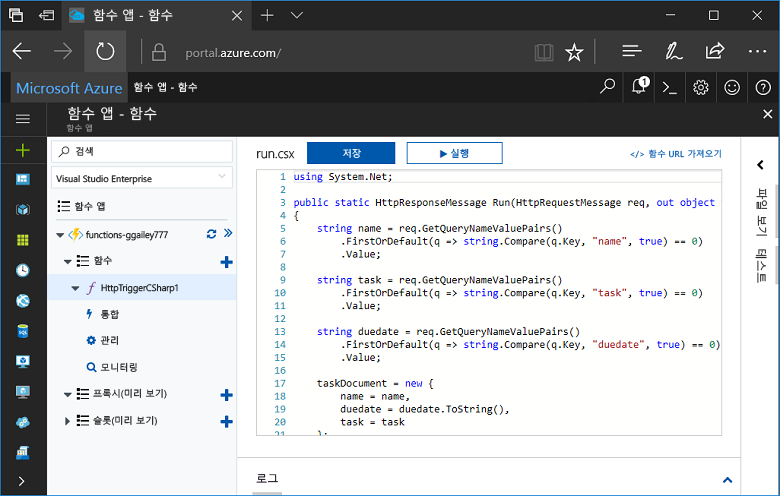
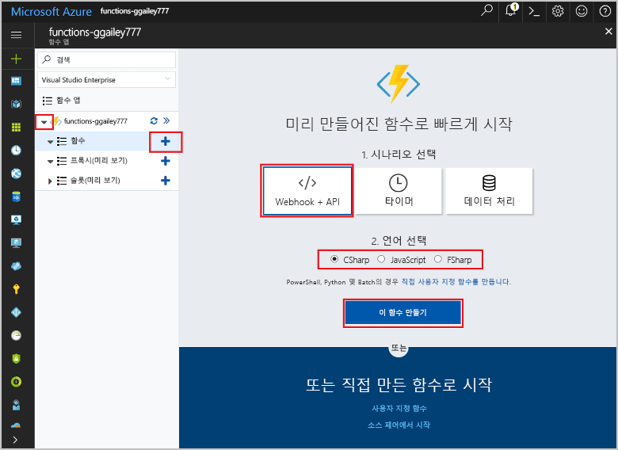
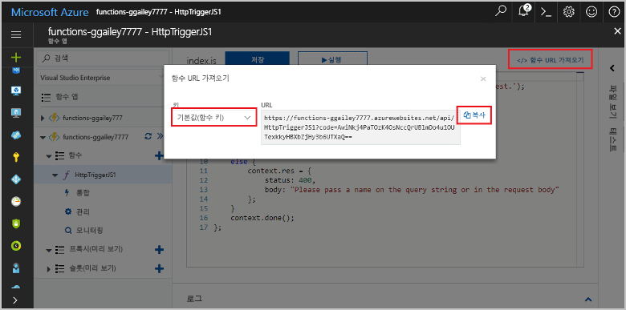
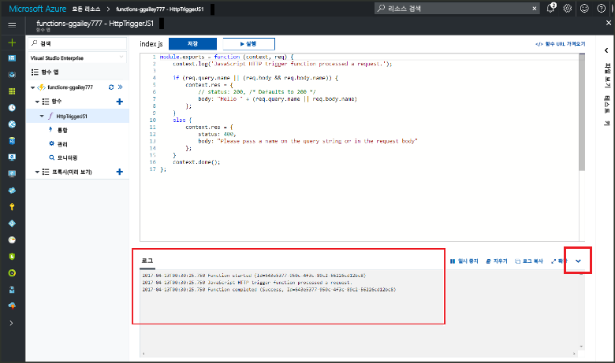

# Hello Azure 포털에서에서 첫 번째 함수 만들기

Azure 기능을 사용 하면 toofirst VM을 만들거나 웹 응용 프로그램을 게시 하지 않고도 서버가 없는 환경에서 코드를 실행 합니다. 이 항목에서는 toouse 작동 방식을 toocreate hello Azure 포털의에서 "hello world" 함수를 설명 합니다.

[!INCLUDE [quickstarts-free-trial-note](../../includes/quickstarts-free-trial-note.md)]

## TooAzure 로그인

Toohello 로그인 [Azure 포털](https://portal.azure.com/)합니다.

## 함수 앱 만들기

함수는 함수 앱 toohost hello 실행을 해야 합니다. 함수 앱을 통해 함수를 논리 단위로 그룹화하여 더욱 쉽게 관리, 배포 및 리소스 공유할 수 있습니다. 

[!INCLUDE [Create function app Azure portal](../../includes/functions-create-function-app-portal.md)]

[!INCLUDE [functions-portal-favorite-function-apps](../../includes/functions-portal-favorite-function-apps.md)]

다음으로 hello 새 함수 앱에서 함수를 만듭니다.

## HTTP 트리거 함수 만들기

1. 새 함수 응용 프로그램을 확장 한 다음 hello 클릭  **+**  너무 단추 옆**함수**합니다.

2.  Hello에 **신속 하 게 시작 하려면** 페이지에서 **WebHook + API**, **언어 선택** 함수 및 클릭에 대 한 **이 함수를 만들** . 
   
    

함수는 HTTP 트리거된 함수에 대 한 hello 템플릿을 사용 하 여 선택한 언어에 만들어집니다. HTTP 요청을 전송 하 여 hello 새 함수를 실행할 수 있습니다.

## 테스트 hello 함수

1. 새 함수에서 **</> 함수 URL 가져오기**를 클릭하고 **기본값(함수 키)**를 선택한 후 **복사**를 클릭합니다. 

    

2. Hello 함수 URL을 브라우저의 주소 표시줄에 붙여 넣습니다. 쿼리 문자열 hello 추가 `&name=<yourname>` toothis URL과 키를 눌러 hello `Enter` 키보드 tooexecute hello 요청에서 키입니다. hello 다음은 hello Edge 브라우저의 hello 함수에서 반환 하는 hello 응답의 예입니다.

    

    기본적으로 tooaccess 필요한 키를 포함 하는 URL hello 요청 HTTP 통한 함수입니다.   

3. 함수를 실행 하면 추적 정보가 toohello 로그 기록 됩니다. hello 이전 실행에서 toosee hello 추적 출력 hello 포털에서 tooyour 함수를 반환 하 고 hello hello 화면 tooexpand hello 맨 아래에 있는 화살표를 클릭 하 여 **로그**합니다. 

   

## 리소스 정리

[!INCLUDE [Clean up resources](../../includes/functions-quickstart-cleanup.md)]

## 다음 단계

간단한 HTTP 트리거 함수가 있는 함수 앱을 만들었습니다.  

[!INCLUDE [Next steps note](../../includes/functions-quickstart-next-steps.md)]

자세한 내용은 [Azure Functions HTTP 및 웹후크 바인딩](functions-bindings-http-webhook.md)을 참조하세요.

