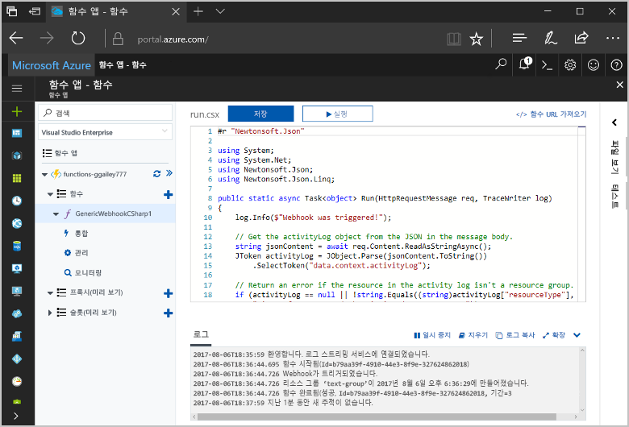
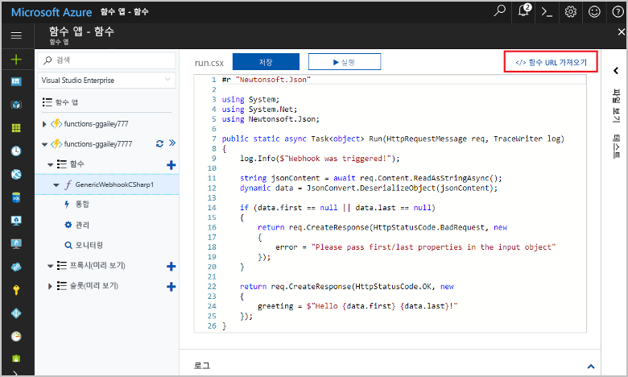
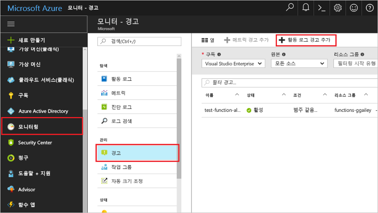
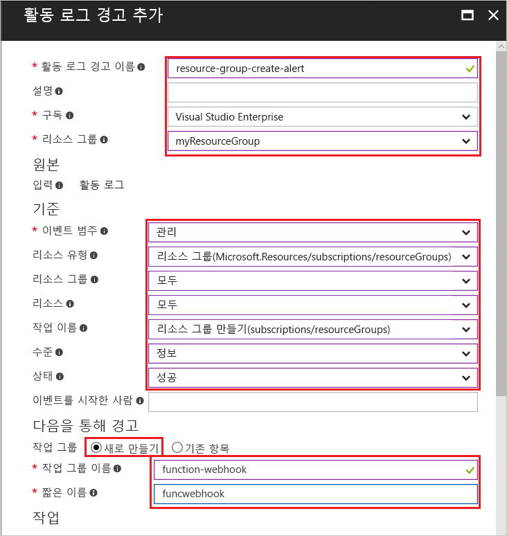
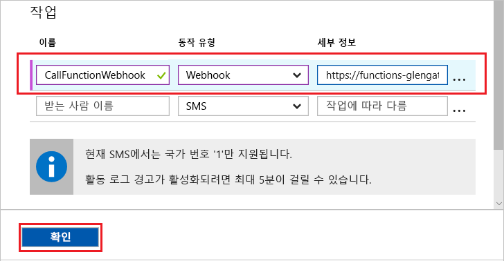
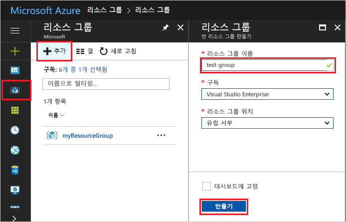
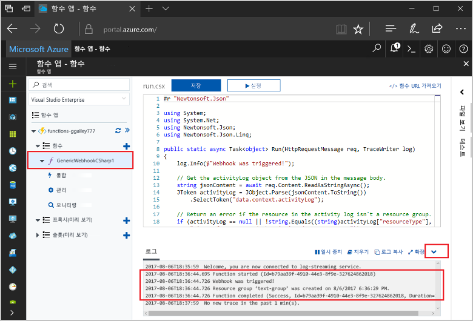

# <a name="create-a-function-triggered-by-a-generic-webhook"></a><span data-ttu-id="4267d-103">제네릭 웹후크를 통해 트리거되는 함수 만들기</span><span class="sxs-lookup"><span data-stu-id="4267d-103">Create a function triggered by a generic webhook</span></span>

<span data-ttu-id="4267d-104">Azure 기능을 사용 하면 toofirst VM을 만들거나 웹 응용 프로그램을 게시 하지 않고도 서버가 없는 환경에서 코드를 실행 합니다.</span><span class="sxs-lookup"><span data-stu-id="4267d-104">Azure Functions lets you execute your code in a serverless environment without having toofirst create a VM or publish a web application.</span></span> <span data-ttu-id="4267d-105">예를 들어 Azure 모니터에 의해 발생 된 경고가 트리거됨 함수 toobe를 구성할 수 있습니다.</span><span class="sxs-lookup"><span data-stu-id="4267d-105">For example, you can configure a function toobe triggered by an alert raised by Azure Monitor.</span></span> <span data-ttu-id="4267d-106">이 항목에서는 리소스 그룹은 때 tooexecute C# 코드 tooyour 구독을 추가 하는 방법을 보여 줍니다.</span><span class="sxs-lookup"><span data-stu-id="4267d-106">This topic shows you how tooexecute C# code when a resource group is added tooyour subscription.</span></span>   



## <a name="prerequisites"></a><span data-ttu-id="4267d-108">필수 조건</span><span class="sxs-lookup"><span data-stu-id="4267d-108">Prerequisites</span></span> 

<span data-ttu-id="4267d-109">toocomplete이이 자습서:</span><span class="sxs-lookup"><span data-stu-id="4267d-109">toocomplete this tutorial:</span></span>

+ <span data-ttu-id="4267d-110">Azure 구독이 아직 없는 경우 시작하기 전에 [무료 계정](https://azure.microsoft.com/free/?WT.mc_id=A261C142F) 을 만듭니다.</span><span class="sxs-lookup"><span data-stu-id="4267d-110">If you don't have an Azure subscription, create a [free account](https://azure.microsoft.com/free/?WT.mc_id=A261C142F) before you begin.</span></span>

[!INCLUDE [functions-portal-favorite-function-apps](../../includes/functions-portal-favorite-function-apps.md)]

## <a name="create-an-azure-function-app"></a><span data-ttu-id="4267d-111">Azure Function 앱 만들기</span><span class="sxs-lookup"><span data-stu-id="4267d-111">Create an Azure Function app</span></span>

[!INCLUDE [Create function app Azure portal](../../includes/functions-create-function-app-portal.md)]

<span data-ttu-id="4267d-112">다음으로 hello 새 함수 앱에서 함수를 만듭니다.</span><span class="sxs-lookup"><span data-stu-id="4267d-112">Next, you create a function in hello new function app.</span></span>

## <span data-ttu-id="4267d-113"><a name="create-function"></a>제네릭 웹후크를 통해 트리거되는 함수 만들기</span><span class="sxs-lookup"><span data-stu-id="4267d-113"><a name="create-function"></a>Create a generic webhook triggered function</span></span>

1. <span data-ttu-id="4267d-114">함수에서 사용 하는 앱을 확장 하 고 hello 클릭  **+**  너무 단추 옆**함수**합니다.</span><span class="sxs-lookup"><span data-stu-id="4267d-114">Expand your function app and click hello **+** button next too**Functions**.</span></span> <span data-ttu-id="4267d-115">이 함수는 함수 응용 프로그램의 첫 번째 hello는, 선택 **사용자 정의 함수**합니다.</span><span class="sxs-lookup"><span data-stu-id="4267d-115">If this function is hello first one in your function app, select **Custom function**.</span></span> <span data-ttu-id="4267d-116">이 함수 템플릿의 hello 전체 집합을 표시합니다.</span><span class="sxs-lookup"><span data-stu-id="4267d-116">This displays hello complete set of function templates.</span></span>

    

2. <span data-ttu-id="4267d-118">선택 hello **제네릭 WebHook-C#** 서식 파일입니다.</span><span class="sxs-lookup"><span data-stu-id="4267d-118">Select hello **Generic WebHook - C#** template.</span></span> <span data-ttu-id="4267d-119">C# 함수의 이름을 입력하고 **만들기**를 선택합니다.</span><span class="sxs-lookup"><span data-stu-id="4267d-119">Type a name for your C# function, then select **Create**.</span></span>

      

2. <span data-ttu-id="4267d-121">클릭 하 여 새 함수에 **<> / Get 함수 URL**, 다음 복사 하 고 hello 값을 저장 합니다.</span><span class="sxs-lookup"><span data-stu-id="4267d-121">In your new function, click **</> Get function URL**, then copy and save hello value.</span></span> <span data-ttu-id="4267d-122">이 값 tooconfigure hello webhook를 사용 합니다.</span><span class="sxs-lookup"><span data-stu-id="4267d-122">You use this value tooconfigure hello webhook.</span></span> 

    
         
<span data-ttu-id="4267d-124">다음으로 Azure Monitor의 활동 로그 경고에서 웹후크 끝점을 만듭니다.</span><span class="sxs-lookup"><span data-stu-id="4267d-124">Next, you create a webhook endpoint in an activity log alert in Azure Monitor.</span></span> 

## <a name="create-an-activity-log-alert"></a><span data-ttu-id="4267d-125">활동 로그 경고 만들기</span><span class="sxs-lookup"><span data-stu-id="4267d-125">Create an activity log alert</span></span>

1. <span data-ttu-id="4267d-126">Hello Azure 포털에서 탐색 toohello **모니터** 서비스, **경고**를 클릭 하 고 **추가 활동 로그 경고**합니다.</span><span class="sxs-lookup"><span data-stu-id="4267d-126">In hello Azure portal, navigate toohello **Monitor** service, select **Alerts**, and click **Add activity log alert**.</span></span>   

    

2. <span data-ttu-id="4267d-128">Hello 테이블에 지정 된 hello 설정을 사용 합니다.</span><span class="sxs-lookup"><span data-stu-id="4267d-128">Use hello settings as specified in hello table:</span></span>

    

    | <span data-ttu-id="4267d-130">설정</span><span class="sxs-lookup"><span data-stu-id="4267d-130">Setting</span></span>      |  <span data-ttu-id="4267d-131">제안 값</span><span class="sxs-lookup"><span data-stu-id="4267d-131">Suggested value</span></span>   | <span data-ttu-id="4267d-132">설명</span><span class="sxs-lookup"><span data-stu-id="4267d-132">Description</span></span>                              |
    | ------------ |  ------- | -------------------------------------------------- |
    | <span data-ttu-id="4267d-133">**활동 로그 경고 이름**</span><span class="sxs-lookup"><span data-stu-id="4267d-133">**Activity log alert name**</span></span> | <span data-ttu-id="4267d-134">resource-group-create-alert</span><span class="sxs-lookup"><span data-stu-id="4267d-134">resource-group-create-alert</span></span> | <span data-ttu-id="4267d-135">Hello 활동 로그 경고의 이름입니다.</span><span class="sxs-lookup"><span data-stu-id="4267d-135">Name of hello activity log alert.</span></span> |
    | <span data-ttu-id="4267d-136">**구독**</span><span class="sxs-lookup"><span data-stu-id="4267d-136">**Subscription**</span></span> | <span data-ttu-id="4267d-137">사용자의 구독</span><span class="sxs-lookup"><span data-stu-id="4267d-137">Your subscription</span></span> | <span data-ttu-id="4267d-138">이 자습서에 사용 하는 hello 구독입니다.</span><span class="sxs-lookup"><span data-stu-id="4267d-138">hello subscription you are using for this tutorial.</span></span> | 
    |  <span data-ttu-id="4267d-139">**리소스 그룹**</span><span class="sxs-lookup"><span data-stu-id="4267d-139">**Resource Group**</span></span> | <span data-ttu-id="4267d-140">myResourceGroup</span><span class="sxs-lookup"><span data-stu-id="4267d-140">myResourceGroup</span></span> | <span data-ttu-id="4267d-141">hello 리소스 그룹에 배포 된 hello 경고 리소스입니다.</span><span class="sxs-lookup"><span data-stu-id="4267d-141">hello resource group that hello alert resources are deployed to.</span></span> <span data-ttu-id="4267d-142">함수 앱 함에 따라 것 보다 쉽게 tooclean hello 자습서를 완료 한 후에 동일한 리소스 그룹을 hello를 사용 하 여 합니다.</span><span class="sxs-lookup"><span data-stu-id="4267d-142">Using hello same resource group as your function app makes it easier tooclean up after you complete hello tutorial.</span></span> |
    | <span data-ttu-id="4267d-143">**이벤트 범주**</span><span class="sxs-lookup"><span data-stu-id="4267d-143">**Event category**</span></span> | <span data-ttu-id="4267d-144">관리</span><span class="sxs-lookup"><span data-stu-id="4267d-144">Administrative</span></span> | <span data-ttu-id="4267d-145">이 범주는 변경 내용을 tooAzure 리소스를 포함 합니다.</span><span class="sxs-lookup"><span data-stu-id="4267d-145">This category includes changes made tooAzure resources.</span></span>  |
    | <span data-ttu-id="4267d-146">**리소스 종류**</span><span class="sxs-lookup"><span data-stu-id="4267d-146">**Resource type**</span></span> | <span data-ttu-id="4267d-147">리소스 그룹</span><span class="sxs-lookup"><span data-stu-id="4267d-147">Resource groups</span></span> | <span data-ttu-id="4267d-148">경고 tooresource 그룹 활동을 필터링합니다.</span><span class="sxs-lookup"><span data-stu-id="4267d-148">Filters alerts tooresource group activities.</span></span> |
    | <span data-ttu-id="4267d-149">**리소스 그룹**</span><span class="sxs-lookup"><span data-stu-id="4267d-149">**Resource Group**</span></span><br/><span data-ttu-id="4267d-150">및 **리소스**</span><span class="sxs-lookup"><span data-stu-id="4267d-150">and **Resource**</span></span> | <span data-ttu-id="4267d-151">모두</span><span class="sxs-lookup"><span data-stu-id="4267d-151">All</span></span> | <span data-ttu-id="4267d-152">모든 리소스를 모니터링합니다.</span><span class="sxs-lookup"><span data-stu-id="4267d-152">Monitor all resources.</span></span> |
    | <span data-ttu-id="4267d-153">**작업 이름**</span><span class="sxs-lookup"><span data-stu-id="4267d-153">**Operation name**</span></span> | <span data-ttu-id="4267d-154">리소스 그룹 만들기</span><span class="sxs-lookup"><span data-stu-id="4267d-154">Create Resource Group</span></span> | <span data-ttu-id="4267d-155">경고 toocreate 작업을 필터링합니다.</span><span class="sxs-lookup"><span data-stu-id="4267d-155">Filters alerts toocreate operations.</span></span> |
    | <span data-ttu-id="4267d-156">**Level**</span><span class="sxs-lookup"><span data-stu-id="4267d-156">**Level**</span></span> | <span data-ttu-id="4267d-157">정보 제공</span><span class="sxs-lookup"><span data-stu-id="4267d-157">Informational</span></span> | <span data-ttu-id="4267d-158">정보 수준 경고를 포함합니다.</span><span class="sxs-lookup"><span data-stu-id="4267d-158">Include informational level alerts.</span></span> | 
    | <span data-ttu-id="4267d-159">**상태**</span><span class="sxs-lookup"><span data-stu-id="4267d-159">**Status**</span></span> | <span data-ttu-id="4267d-160">Succeeded</span><span class="sxs-lookup"><span data-stu-id="4267d-160">Succeeded</span></span> | <span data-ttu-id="4267d-161">성공적으로 완료 된 경고 tooactions를 필터링 합니다.</span><span class="sxs-lookup"><span data-stu-id="4267d-161">Filters alerts tooactions that have completed successfully.</span></span> |
    | <span data-ttu-id="4267d-162">**작업 그룹**</span><span class="sxs-lookup"><span data-stu-id="4267d-162">**Action group**</span></span> | <span data-ttu-id="4267d-163">새로 만들기</span><span class="sxs-lookup"><span data-stu-id="4267d-163">New</span></span> | <span data-ttu-id="4267d-164">경고가 발생 하는 경우 수행 하는 hello 작업을 정의 하는 새 작업 그룹을 만듭니다.</span><span class="sxs-lookup"><span data-stu-id="4267d-164">Create a new action group, which defines hello action takes when an alert is raised.</span></span> |
    | <span data-ttu-id="4267d-165">**작업 그룹 이름**</span><span class="sxs-lookup"><span data-stu-id="4267d-165">**Action group name**</span></span> | <span data-ttu-id="4267d-166">function-webhook</span><span class="sxs-lookup"><span data-stu-id="4267d-166">function-webhook</span></span> | <span data-ttu-id="4267d-167">이름 tooidentify hello 작업 그룹입니다.</span><span class="sxs-lookup"><span data-stu-id="4267d-167">A name tooidentify hello action group.</span></span>  | 
    | <span data-ttu-id="4267d-168">**짧은 이름**</span><span class="sxs-lookup"><span data-stu-id="4267d-168">**Short name**</span></span> | <span data-ttu-id="4267d-169">funcwebhook</span><span class="sxs-lookup"><span data-stu-id="4267d-169">funcwebhook</span></span> | <span data-ttu-id="4267d-170">Hello 동작 그룹에 대 한 짧은 이름입니다.</span><span class="sxs-lookup"><span data-stu-id="4267d-170">A short name for hello action group.</span></span> |  

3. <span data-ttu-id="4267d-171">**동작**, hello 설정을 사용 하 여 hello 테이블에 지정 된 작업을 추가 합니다.</span><span class="sxs-lookup"><span data-stu-id="4267d-171">In **Actions**, add an action using hello settings as specified in hello table:</span></span> 

    

    | <span data-ttu-id="4267d-173">설정</span><span class="sxs-lookup"><span data-stu-id="4267d-173">Setting</span></span>      |  <span data-ttu-id="4267d-174">제안 값</span><span class="sxs-lookup"><span data-stu-id="4267d-174">Suggested value</span></span>   | <span data-ttu-id="4267d-175">설명</span><span class="sxs-lookup"><span data-stu-id="4267d-175">Description</span></span>                              |
    | ------------ |  ------- | -------------------------------------------------- |
    | <span data-ttu-id="4267d-176">**Name**</span><span class="sxs-lookup"><span data-stu-id="4267d-176">**Name**</span></span> | <span data-ttu-id="4267d-177">CallFunctionWebhook</span><span class="sxs-lookup"><span data-stu-id="4267d-177">CallFunctionWebhook</span></span> | <span data-ttu-id="4267d-178">Hello 동작에 대 한 이름입니다.</span><span class="sxs-lookup"><span data-stu-id="4267d-178">A name for hello action.</span></span> |
    | <span data-ttu-id="4267d-179">**작업 유형**</span><span class="sxs-lookup"><span data-stu-id="4267d-179">**Action type**</span></span> | <span data-ttu-id="4267d-180">웹후크</span><span class="sxs-lookup"><span data-stu-id="4267d-180">Webhook</span></span> | <span data-ttu-id="4267d-181">hello 응답 toohello 경고는 Webhook URL 호출 됩니다.</span><span class="sxs-lookup"><span data-stu-id="4267d-181">hello response toohello alert is that a Webhook URL is called.</span></span> |
    | <span data-ttu-id="4267d-182">**세부 정보**</span><span class="sxs-lookup"><span data-stu-id="4267d-182">**Details**</span></span> | <span data-ttu-id="4267d-183">함수 URL</span><span class="sxs-lookup"><span data-stu-id="4267d-183">Function URL</span></span> | <span data-ttu-id="4267d-184">앞에서 복사한 hello 함수 hello webhook URL에 붙여 넣습니다.</span><span class="sxs-lookup"><span data-stu-id="4267d-184">Paste in hello webhook URL of hello function that you copied earlier.</span></span> |<span data-ttu-id="4267d-185">v</span><span class="sxs-lookup"><span data-stu-id="4267d-185">v</span></span>

4. <span data-ttu-id="4267d-186">클릭 **확인** toocreate hello 경고 및 작업 그룹입니다.</span><span class="sxs-lookup"><span data-stu-id="4267d-186">Click **OK** toocreate hello alert and action group.</span></span>  

<span data-ttu-id="4267d-187">구독에서 리소스 그룹을 만들 때 이제 hello webhook 라고 합니다.</span><span class="sxs-lookup"><span data-stu-id="4267d-187">hello webhook is now called when a resource group is created in your subscription.</span></span> <span data-ttu-id="4267d-188">다음으로, 함수 toohandle hello hello hello 요청 본문의 JSON 로그 데이터의에서 hello 코드를 업데이트 합니다.</span><span class="sxs-lookup"><span data-stu-id="4267d-188">Next, you update hello code in your function toohandle hello JSON log data in hello body of hello request.</span></span>   

## <a name="update-hello-function-code"></a><span data-ttu-id="4267d-189">Hello 함수 코드를 업데이트 합니다.</span><span class="sxs-lookup"><span data-stu-id="4267d-189">Update hello function code</span></span>

1. <span data-ttu-id="4267d-190">Hello 포털에서 뒤로 tooyour 함수 응용 프로그램을 찾아서 함수를 확장 합니다.</span><span class="sxs-lookup"><span data-stu-id="4267d-190">Navigate back tooyour function app in hello portal, and expand your function.</span></span> 

2. <span data-ttu-id="4267d-191">코드 다음 hello hello 포털에서 hello 함수가 hello C# 스크립트 코드를 바꿉니다.</span><span class="sxs-lookup"><span data-stu-id="4267d-191">Replace hello C# script code in hello function in hello portal with hello following code:</span></span>

    ```csharp
    #r "Newtonsoft.Json"
    
    using System;
    using System.Net;
    using Newtonsoft.Json;
    using Newtonsoft.Json.Linq;
    
    public static async Task<object> Run(HttpRequestMessage req, TraceWriter log)
    {
        log.Info($"Webhook was triggered!");
    
        // Get hello activityLog object from hello JSON in hello message body.
        string jsonContent = await req.Content.ReadAsStringAsync();
        JToken activityLog = JObject.Parse(jsonContent.ToString())
            .SelectToken("data.context.activityLog");
    
        // Return an error if hello resource in hello activity log isn't a resource group. 
        if (activityLog == null || !string.Equals((string)activityLog["resourceType"], 
            "Microsoft.Resources/subscriptions/resourcegroups"))
        {
            log.Error("An error occured");
            return req.CreateResponse(HttpStatusCode.BadRequest, new
            {
                error = "Unexpected message payload or wrong alert received."
            });
        }
    
        // Write information about hello created resource group toohello streaming log.
        log.Info(string.Format("Resource group '{0}' was {1} on {2}.",
            (string)activityLog["resourceGroupName"],
            ((string)activityLog["subStatus"]).ToLower(), 
            (DateTime)activityLog["submissionTimestamp"]));
    
        return req.CreateResponse(HttpStatusCode.OK);    
    }
    ```

<span data-ttu-id="4267d-192">이제 구독에 새 리소스 그룹을 만들어 hello 함수를 테스트할 수 있습니다.</span><span class="sxs-lookup"><span data-stu-id="4267d-192">Now you can test hello function by creating a new resource group in your subscription.</span></span>

## <a name="test-hello-function"></a><span data-ttu-id="4267d-193">테스트 hello 함수</span><span class="sxs-lookup"><span data-stu-id="4267d-193">Test hello function</span></span>

1. <span data-ttu-id="4267d-194">Hello Azure 포털의 왼쪽 hello hello 리소스 그룹 아이콘을 클릭 **+ 추가**, 입력 **리소스 그룹 이름은**를 선택 하 고 **만들기** toocreate 빈 리소스 그룹입니다.</span><span class="sxs-lookup"><span data-stu-id="4267d-194">Click hello resource group icon in hello left of hello Azure portal, select **+ Add**, type a **Resource group name**, and select **Create** toocreate an empty resource group.</span></span>
    
    

2. <span data-ttu-id="4267d-196">Tooyour 함수 돌아가서 hello 확장 **로그** 창.</span><span class="sxs-lookup"><span data-stu-id="4267d-196">Go back tooyour function and expand hello **Logs** window.</span></span> <span data-ttu-id="4267d-197">Hello 리소스 그룹을 만든 후 hello 활동 로그 경고 트리거 hello webhook 및 hello 함수를 실행 합니다.</span><span class="sxs-lookup"><span data-stu-id="4267d-197">After hello resource group is created, hello activity log alert triggers hello webhook and hello function executes.</span></span> <span data-ttu-id="4267d-198">Toohello 로그 기록 hello 새 리소스 그룹의 hello 이름을 표시 합니다.</span><span class="sxs-lookup"><span data-stu-id="4267d-198">You see hello name of hello new resource group written toohello logs.</span></span>  

    

3. <span data-ttu-id="4267d-200">(선택 사항) 뒤로 돌아가서 만든 hello 리소스 그룹을 삭제 합니다.</span><span class="sxs-lookup"><span data-stu-id="4267d-200">(Optional) Go back and delete hello resource group that you created.</span></span> <span data-ttu-id="4267d-201">참고가이 활동 hello 함수를 트리거되지 않습니다.</span><span class="sxs-lookup"><span data-stu-id="4267d-201">Note that this activity doesn't trigger hello function.</span></span> <span data-ttu-id="4267d-202">즉, delete 작업 hello 경고에 의해 필터링 됩니다.</span><span class="sxs-lookup"><span data-stu-id="4267d-202">This is because delete operations are filtered out by hello alert.</span></span> 

## <a name="clean-up-resources"></a><span data-ttu-id="4267d-203">리소스 정리</span><span class="sxs-lookup"><span data-stu-id="4267d-203">Clean up resources</span></span>

[!INCLUDE [Next steps note](../../includes/functions-quickstart-cleanup.md)]

## <a name="next-steps"></a><span data-ttu-id="4267d-204">다음 단계</span><span class="sxs-lookup"><span data-stu-id="4267d-204">Next steps</span></span>

<span data-ttu-id="4267d-205">제네릭 웹후크에서 요청을 수신할 때 실행되는 함수를 만들었습니다.</span><span class="sxs-lookup"><span data-stu-id="4267d-205">You have created a function that runs when a request is received from a generic webhook.</span></span> 

[!INCLUDE [Next steps note](../../includes/functions-quickstart-next-steps.md)]

<span data-ttu-id="4267d-206">웹후크 트리거에 대한 자세한 내용은 [Azure Functions HTTP 및 웹후크 바인딩](functions-bindings-http-webhook.md)을 참조하세요.</span><span class="sxs-lookup"><span data-stu-id="4267d-206">For more information about webhook triggers, see [Azure Functions HTTP and webhook bindings](functions-bindings-http-webhook.md).</span></span> <span data-ttu-id="4267d-207">C#의 기능을 개발에 대해 자세히 toolearn 참조 [Azure 함수 C# 스크립트 개발자 참조](functions-reference-csharp.md)합니다.</span><span class="sxs-lookup"><span data-stu-id="4267d-207">toolearn more about developing functions in C#, see [Azure Functions C# script developer reference](functions-reference-csharp.md).</span></span>

