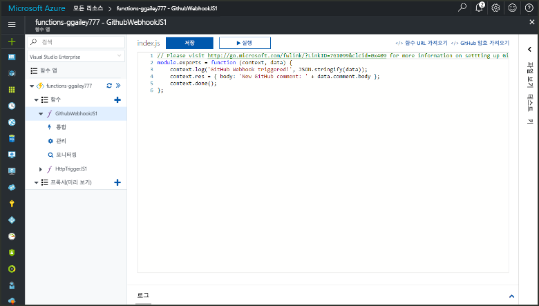
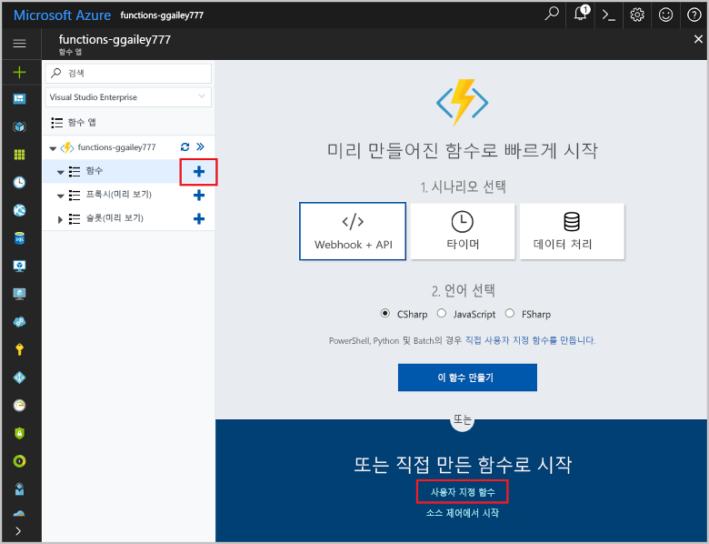
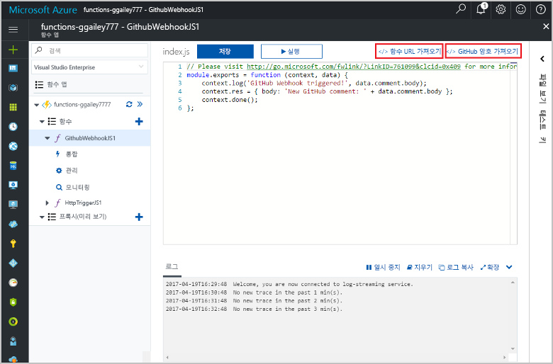
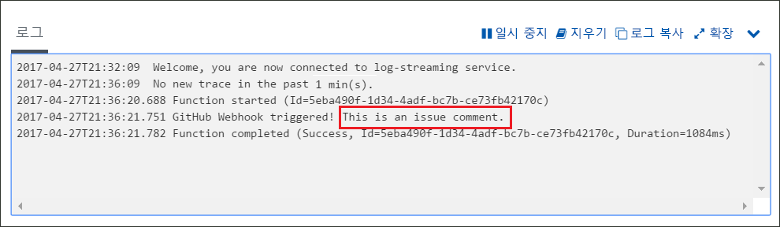

# GitHub webhook를 통해 트리거되는 함수 만들기Create a function triggered by a GitHub webhook

자세한 내용은 방법 toocreate GitHub 특정 페이로드를 사용한 HTTP webhook 요청에 의해 트리거되는 함수입니다.Learn how toocreate a function that is triggered by an HTTP webhook request with a GitHub-specific payload.

## 필수 조건Prerequisites

+ 하나 이상의 프로젝트와 함께 GitHub 계정.A GitHub account with at least one project.
+ Azure 구독.An Azure subscription. 구독이 없으면 시작하기 전에 [계정](https://azure.microsoft.com/free/?WT.mc_id=A261C142F)을 만드세요.If you don't have one, create a [free account](https://azure.microsoft.com/free/?WT.mc_id=A261C142F) before you begin.

[!INCLUDE [functions-portal-favorite-function-apps](../../includes/functions-portal-favorite-function-apps.md)]

## Azure Function 앱 만들기Create an Azure Function app

[!INCLUDE [Create function app Azure portal](../../includes/functions-create-function-app-portal.md)]

다음으로 hello 새 함수 앱에서 함수를 만듭니다.Next, you create a function in hello new function app.

## GitHub 웹후크 트리거 함수 만들기Create a GitHub webhook triggered function

1. 함수에서 사용 하는 앱을 확장 하 고 hello 클릭  **+**  너무 단추 옆**함수**합니다.Expand your function app and click hello **+** button next too**Functions**. Hello 함수 응용 프로그램에서 첫 번째 함수 이면 선택 **사용자 정의 함수**합니다.If this is hello first function in your function app, select **Custom function**. 이 함수 템플릿의 hello 전체 집합을 표시합니다.This displays hello complete set of function templates.

    

2. 선택 hello **GitHub WebHook** 원하는 언어에 대 한 서식 파일입니다.Select hello **GitHub WebHook** template for your desired language. **함수 이름을 지정한** 후 **만들기**를 선택합니다.**Name your function**, then select **Create**.

      

3. 클릭 하 여 새 함수에 **<> / Get 함수 URL**, 복사 및 hello 값을 저장 합니다.In your new function, click **</> Get function URL**, then copy and save hello values. 동일한 작업에 대 한 hello 마십시오 **<> / 가져오기 GitHub 비밀**합니다.Do hello same thing for **</> Get GitHub secret**. GitHub에서 이러한 값 tooconfigure hello webhook을 사용합니다.You use these values tooconfigure hello webhook in GitHub.

    

다음으로 GitHub 리포지토리에 webhook를 만듭니다.Next, you create a webhook in your GitHub repository.

## Hello webhook 구성Configure hello webhook

1. Github를 소유 하 고 있는 tooa 저장소를 이동 합니다.In GitHub, navigate tooa repository that you own. 분기된 모든 리포지토리를 사용할 수도 있습니다.You can also use any repository that you have forked. 사용 하 여 저장소 toofork 해야 할 경우 <https://github.com/Azure-Samples/functions-quickstart>합니다.If you need toofork a repository, use <https://github.com/Azure-Samples/functions-quickstart>.

1. **설정**, **Webhooks**, **webhook 추가**를 차례로 클릭합니다.Click **Settings**, then click **Webhooks**, and  **Add webhook**.

    

1. Hello 테이블에 지정 된 설정을 사용 하 고 클릭 **webhook 추가**합니다.Use settings as specified in hello table, then click **Add webhook**.

    

| 설정Setting | 제안 값Suggested value | 설명Description |
|---|---|---|
| **페이로드 URL****Payload URL** | 복사된 값Copied value | 반환 하는 hello 값을 사용 하 여 **<> / Get 함수 URL**합니다.Use hello value returned by  **</> Get function URL**. |
| **비밀****Secret**   | 복사된 값Copied value | 반환 하는 hello 값을 사용 하 여 **<> / 가져오기 GitHub 비밀**합니다.Use hello value returned by  **</> Get GitHub secret**. |
| **콘텐츠 형식****Content type** | application/jsonapplication/json | hello 함수는 JSON 페이로드가 필요합니다.hello function expects a JSON payload. |
| 이벤트 트리거Event triggers | 개별 이벤트를 선택하겠습니다.Let me select individual events | Tootrigger 문제 메모 이벤트에만 포함 하려고 합니다.We only want tootrigger on issue comment events.  |
| | 문제 주석Issue comment |  |

이제 webhook hello 새 문제 메모 추가 될 때 구성 된 tootrigger 함수 됩니다.Now, hello webhook is configured tootrigger your function when a new issue comment is added.

## 테스트 hello 함수Test hello function

1. GitHub 리포지토리에 hello를 열고 **문제** 새 브라우저 창에서 탭 합니다.In your GitHub repository, open hello **Issues** tab in a new browser window.

1. Hello 새 창에서 클릭 **새 문제**, 제목을 입력 하 고 클릭 **새 문제를 제출**합니다.In hello new window, click **New Issue**, type a title, and then click **Submit new issue**.

1. Hello 문제에서 설명을 입력 하 고 클릭 **주석**합니다.In hello issue, type a comment and click **Comment**.

    

1. Toohello 포털 돌아가서 hello 로그를 확인 하십시오.Go back toohello portal and view hello logs. Hello 새 주석 텍스트와 함께 추적 항목이 표시 됩니다.You should see a trace entry with hello new comment text.

     

## 리소스 정리Clean up resources

[!INCLUDE [Next steps note](../../includes/functions-quickstart-cleanup.md)]

## 다음 단계Next steps

GitHub 웹후크에서 요청을 수신할 때 실행되는 함수를 만들었습니다.You have created a function that runs when a request is received from a GitHub webhook.

[!INCLUDE [Next steps note](../../includes/functions-quickstart-next-steps.md)]

웹후크 트리거에 대한 자세한 내용은 [Azure Functions HTTP 및 웹후크 바인딩](functions-bindings-http-webhook.md)을 참조하세요.For more information about webhook triggers, see [Azure Functions HTTP and webhook bindings](functions-bindings-http-webhook.md).
