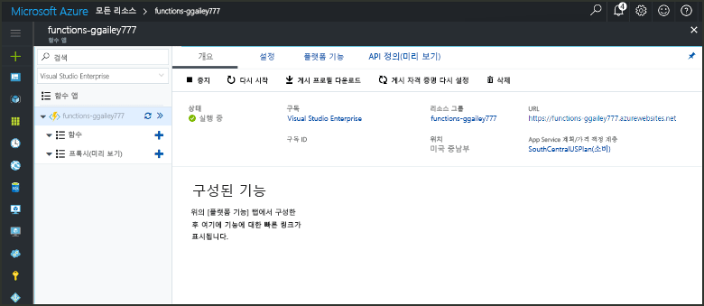

# Azure에서 타이머에 따라 트리거되는 함수 만들기

어떻게 toouse Azure 함수 toocreate를 실행 하는 함수 기반으로 사용자가 정의한 일정에 알아봅니다.

## 필수 조건

toocomplete이이 자습서:

+ Azure 구독이 아직 없는 경우 시작하기 전에 [무료 계정](https://azure.microsoft.com/free/?WT.mc_id=A261C142F) 을 만듭니다.

[!INCLUDE [functions-portal-favorite-function-apps](../../includes/functions-portal-favorite-function-apps.md)]

## Azure Function 앱 만들기

[!INCLUDE [Create function app Azure portal](../../includes/functions-create-function-app-portal.md)]

다음으로 hello 새 함수 앱에서 함수를 만듭니다.

## 타이머 트리거 함수 만들기

1. 함수에서 사용 하는 앱을 확장 하 고 hello 클릭  **+**  너무 단추 옆**함수**합니다. Hello 함수 응용 프로그램에서 첫 번째 함수 이면 선택 **사용자 정의 함수**합니다. 이 함수 템플릿의 hello 전체 집합을 표시합니다.

    

2. 선택 hello **TimerTrigger** 원하는 언어에 대 한 서식 파일입니다. 다음 hello 테이블에 지정 된 hello 설정을 사용 합니다.

    

    | 설정 | 제안 값 | 설명 |
    |---|---|---|
    | **함수 이름 지정** | TimerTriggerCSharp1 | 타이머 트리거 함수의 hello 이름을 정의합니다. |
    | **[일정](http://en.wikipedia.org/wiki/Cron#CRON_expression)** | 0 \*/1 \* \* \* \* | 6 개의 필드 [CRON 식](http://en.wikipedia.org/wiki/Cron#CRON_expression) 함수 toorun를 예약 하는 1 분 마다. |

2. **만들기**를 클릭합니다. 함수는 1분마다 실행되는 선택한 언어로 생성됩니다.

3. Toohello 로그를 기록 하는 추적 정보를 확인 하 여 실행을 확인 합니다.

    

이제 같은 시간 마다 한 번씩, 자주 실행 되도록 hello 함수 일정을 변경할 수 있습니다. 

## 업데이트 hello 타이머 일정

1. 함수를 확장하고 **통합**을 클릭합니다. 입력 정의 및 사용자가 함수에 대 한 바인딩 출력와 hello 일정을 설정할 수도 있는입니다. 

2. `0 0 */1 * * *`의 새 **일정** 값을 입력한 후 **저장**을 클릭합니다.  

함수는 이제 한 시간마다 한 번씩 실행됩니다. 

## 리소스 정리

[!INCLUDE [Next steps note](../../includes/functions-quickstart-cleanup.md)]

## 다음 단계

일정에 따라 실행되는 함수를 만들었습니다.

[!INCLUDE [Next steps note](../../includes/functions-quickstart-next-steps.md)]

타이머 트리거에 대한 자세한 내용은 [Azure Functions를 사용하여 코드 실행 예약](functions-bindings-timer.md)을 참조하세요.