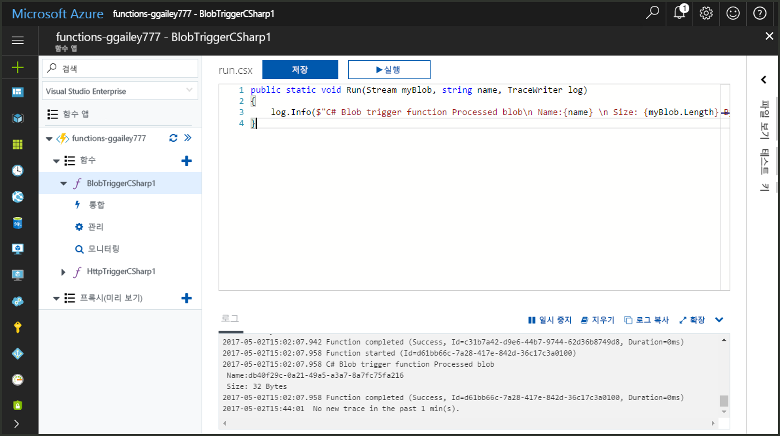
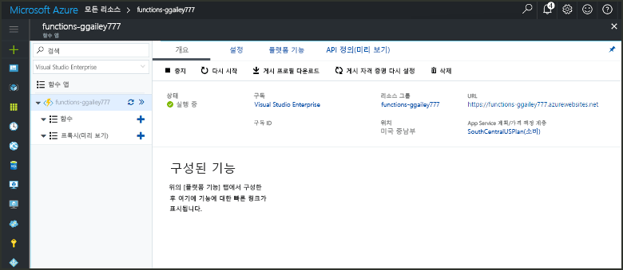
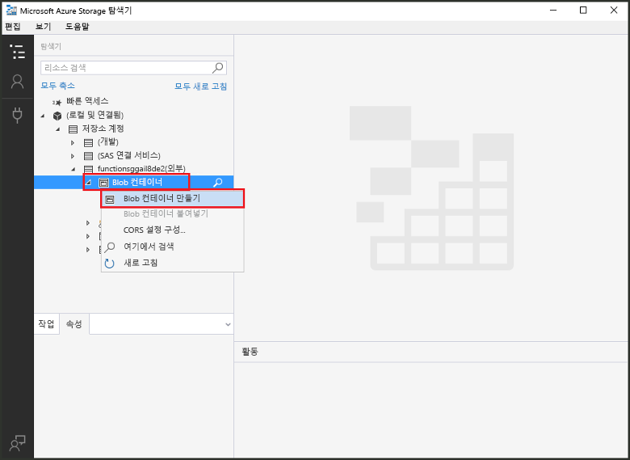
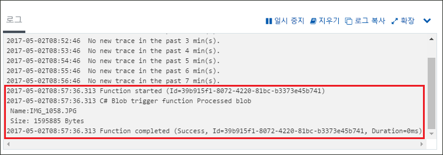

# Azure Blob Storage에 의해 트리거되는 함수 만들기Create a function triggered by Azure Blob storage

어떻게 toocreate 파일은 때 트리거되는 함수 업로드 tooor Azure Blob 저장소에서 업데이트에 대해 알아봅니다.Learn how toocreate a function triggered when files are uploaded tooor updated in Azure Blob storage.

## 필수 조건Prerequisites

+ 다운로드 및 설치 hello [Microsoft Azure 저장소 탐색기](http://storageexplorer.com/)합니다.Download and install hello [Microsoft Azure Storage Explorer](http://storageexplorer.com/).
+ Azure 구독.An Azure subscription. 구독이 없으면 시작하기 전에 [계정](https://azure.microsoft.com/free/?WT.mc_id=A261C142F)을 만드세요.If you don't have one, create a [free account](https://azure.microsoft.com/free/?WT.mc_id=A261C142F) before you begin.

[!INCLUDE [functions-portal-favorite-function-apps](../../includes/functions-portal-favorite-function-apps.md)]

## Azure Function 앱 만들기Create an Azure Function app

[!INCLUDE [Create function app Azure portal](../../includes/functions-create-function-app-portal.md)]

다음으로 hello 새 함수 앱에서 함수를 만듭니다.Next, you create a function in hello new function app.

## Blob Storage 트리거 함수 만들기Create a Blob storage triggered function

1. 함수에서 사용 하는 앱을 확장 하 고 hello 클릭  **+**  너무 단추 옆**함수**합니다.Expand your function app and click hello **+** button next too**Functions**. Hello 함수 응용 프로그램에서 첫 번째 함수 이면 선택 **사용자 정의 함수**합니다.If this is hello first function in your function app, select **Custom function**. 이 함수 템플릿의 hello 전체 집합을 표시합니다.This displays hello complete set of function templates.

    

2. 선택 hello **BlobTrigger** 원하는 언어 및 hello 테이블에 지정 된 hello 설정 사용에 대 한 서식 파일입니다.Select hello **BlobTrigger** template for your desired language, and use hello settings as specified in hello table.

    

    | 설정Setting | 제안 값Suggested value | 설명Description |
    |---|---|---|
    | **Path****Path**   | mycontainer/{name}mycontainer/{name}    | 모니터링되는 Blob Storage의 위치입니다.Location in Blob storage being monitored. hello로 hello 바인딩을 hello blob의 hello 파일 이름을 전달 _이름_ 매개 변수입니다.hello file name of hello blob is passed in hello binding as hello _name_ parameter.  |
    | **Storage 계정 연결****Storage account connection** | AzureWebJobStorageAzureWebJobStorage | Hello 함수 응용 프로그램에서 이미 사용 되는 저장소 계정 연결을 사용 하거나 새로 만들 수 있습니다.You can use hello storage account connection already being used by your function app, or create a new one.  |
    | **함수 이름 지정****Name your function** | 함수 앱에서 고유Unique in your function app | 이 Blob 트리거 함수의 이름입니다.Name of this blob triggered function. |

3. 클릭 **만들기** toocreate 함수입니다.Click **Create** toocreate your function.

다음으로 tooyour Azure 저장소 계정을 연결 하 고 hello 만들 **mycontainer** 컨테이너입니다.Next, you connect tooyour Azure Storage account and create hello **mycontainer** container.

## Hello 컨테이너 만들기Create hello container

1. 함수에서 **통합**을 클릭하고 **설명서**를 확장하여 **계정 이름** 및 **계정 키**를 모두 복사합니다.In your function, click **Integrate**, expand **Documentation**, and copy both **Account name** and **Account key**. 이러한 자격 증명 tooconnect toohello 저장소 계정을 사용합니다.You use these credentials tooconnect toohello storage account. 저장소 계정에 이미 연결한 경우 toostep 4를 건너뜁니다.If you have already connected your storage account, skip toostep 4.

    

1. Hello 실행 [Microsoft Azure 저장소 탐색기](http://storageexplorer.com/) 도구를 hello 클릭 연결 hello 왼쪽에 있는 아이콘을 선택 **저장소 계정 이름과 키를 사용 하 여**를 클릭 하 고 **다음**합니다.Run hello [Microsoft Azure Storage Explorer](http://storageexplorer.com/) tool, click hello connect icon on hello left, choose **Use a storage account name and key**, and click **Next**.

    

1. Hello 입력 **계정 이름** 및 **계정 키** 1 단계에서 클릭 **다음** 차례로 **연결**합니다.Enter hello **Account name** and **Account key** from step 1, click **Next** and then **Connect**. 

    

1. Hello 연결 된 저장소 계정, 마우스 오른쪽 단추로 클릭 **Blob 컨테이너**, 클릭 **blob 컨테이너 만들기**, 형식 `mycontainer`, enter 키를 누릅니다.Expand hello attached storage account, right-click **Blob containers**, click **Create blob container**, type `mycontainer`, and then press enter.

    

Blob 컨테이너를가지고 파일 toohello 컨테이너를 업로드 하 여 hello 함수를 테스트할 수 있습니다.Now that you have a blob container, you can test hello function by uploading a file toohello container.

## 테스트 hello 함수Test hello function

1. Hello Azure 포털에 다시 찾아보기 tooyour 함수 확장 hello **로그** hello 있는지 확인 하 고 hello 페이지 맨 아래에 해당 로그 스트리밍 없는 일시 중지 합니다.Back in hello Azure portal, browse tooyour function expand hello **Logs** at hello bottom of hello page and make sure that log streaming isn't paused.

1. Storage 탐색기에서 저장소 계정, **Blob 컨테이너** 및 **mycontainer**를 확장합니다.In Storage Explorer, expand your storage account, **Blob containers**, and **mycontainer**. **업로드**를 클릭한 후 **파일 업로드...**를 클릭합니다.Click **Upload** and then **Upload files...**.

    

1. Hello에 **파일 업로드** 대화 상자를 클릭 hello **파일** 필드입니다.In hello **Upload files** dialog box, click hello **Files** field. 이미지 파일과 같은 로컬 컴퓨터에 tooa 파일 찾아보기 선택 하 고 클릭 **열려** 차례로 **업로드**합니다.Browse tooa file on your local computer, such as an image file, select it and click **Open** and then **Upload**.

1. Tooyour 기능 로그를 다시 이동 하 고 해당 hello blob를 읽었음을 확인 합니다.Go back tooyour function logs and verify that hello blob has been read.

   

    >[!NOTE]
    > 함수 앱 hello 기본 소비 계획을 실행할 때 있을 수 있습니다 tooseveral 추가 되거나 업데이트 되 고 blob hello와 hello 간 시간 (분)을 지연 트리거된 작동 합니다.When your function app runs in hello default Consumption plan, there may be a delay of up tooseveral minutes between hello blob being added or updated and hello function being triggered. Blob 트리거 함수에서 대기 시간을 줄여야 하는 경우 App Service 계획에서 함수 앱을 실행하는 것이 좋습니다.If you need low latency in your blob triggered functions, consider running your function app in an App Service plan.

## 리소스 정리Clean up resources

[!INCLUDE [Next steps note](../../includes/functions-quickstart-cleanup.md)]

## 다음 단계Next steps

Blob 저장소에 blob가 업데이트 tooor 추가 될 때 실행 되는 함수를 만들었습니다.You have created a function that runs when a blob is added tooor updated in Blob storage. 

[!INCLUDE [Next steps note](../../includes/functions-quickstart-next-steps.md)]

Blob Storage 트리거에 대한 자세한 내용은 [Azure Functions Blob Storage 바인딩](functions-bindings-storage-blob.md)을 참조하세요.For more information about Blob storage triggers, see [Azure Functions Blob storage bindings](functions-bindings-storage-blob.md).
