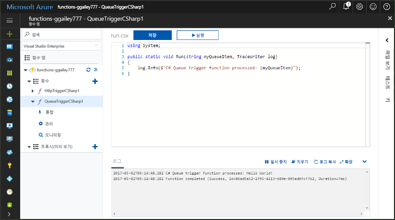
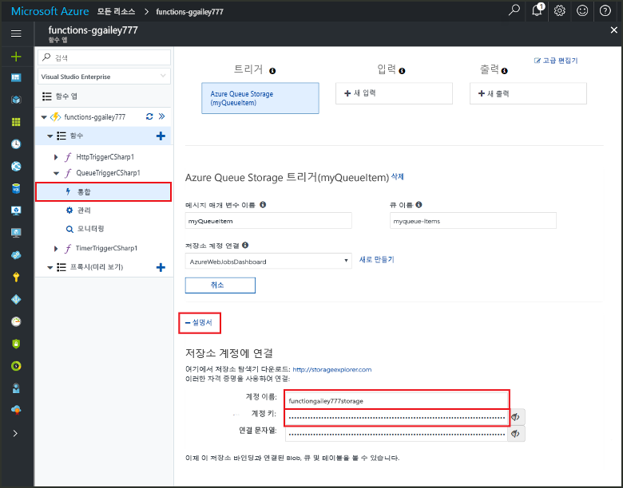
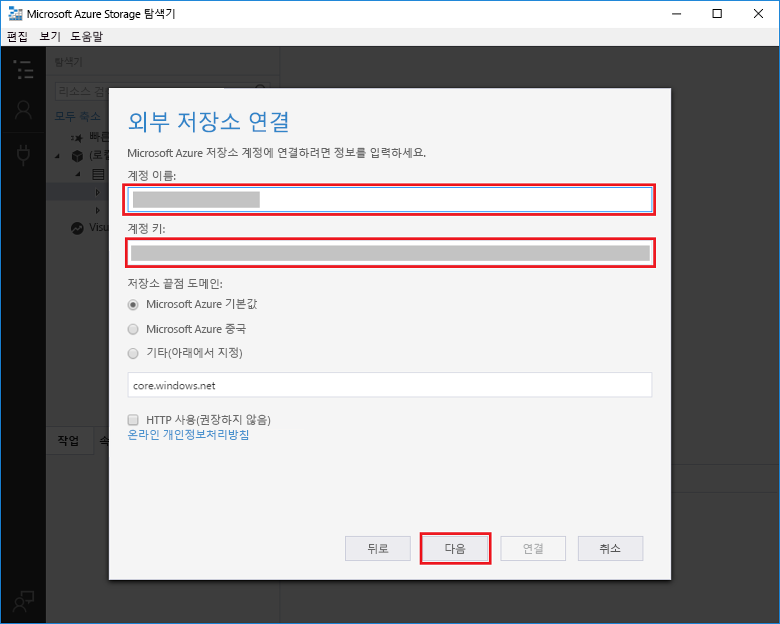
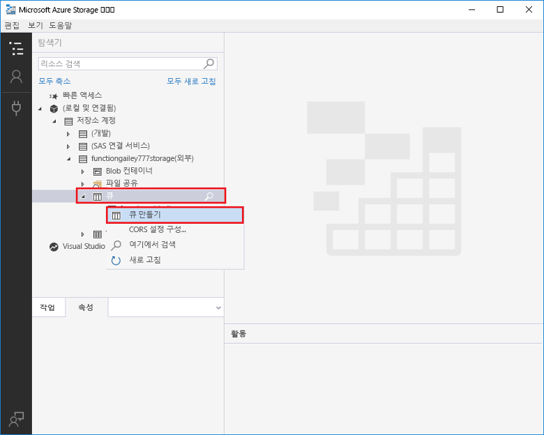
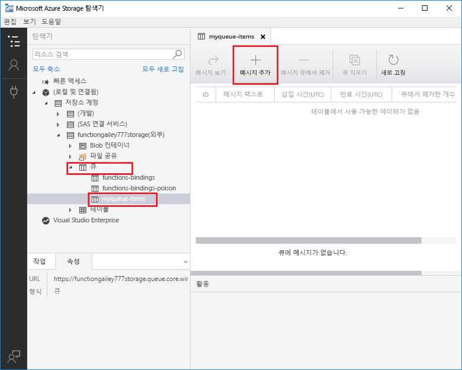
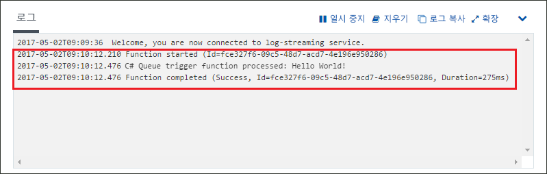

# Azure Queue Storage에 의해 트리거되는 함수 만들기Create a function triggered by Azure Queue storage

메시지는 경우에 발생 하는 함수 toocreate tooan Azure 저장소 큐를 전송 하는 방법을 알아봅니다.Learn how toocreate a function triggered when messages are submitted tooan Azure Storage queue.

## 필수 조건Prerequisites

- 다운로드 및 설치 hello [Microsoft Azure 저장소 탐색기](http://storageexplorer.com/)합니다.Download and install hello [Microsoft Azure Storage Explorer](http://storageexplorer.com/).

- Azure 구독.An Azure subscription. 구독이 없으면 시작하기 전에 [계정](https://azure.microsoft.com/free/?WT.mc_id=A261C142F)을 만드세요.If you don't have one, create a [free account](https://azure.microsoft.com/free/?WT.mc_id=A261C142F) before you begin.

[!INCLUDE [functions-portal-favorite-function-apps](../../includes/functions-portal-favorite-function-apps.md)]

## Azure Function 앱 만들기Create an Azure Function app

[!INCLUDE [Create function app Azure portal](../../includes/functions-create-function-app-portal.md)]

다음으로 hello 새 함수 앱에서 함수를 만듭니다.Next, you create a function in hello new function app.

## 큐 트리거 함수 만들기Create a Queue triggered function

1. 함수에서 사용 하는 앱을 확장 하 고 hello 클릭  **+**  너무 단추 옆**함수**합니다.Expand your function app and click hello **+** button next too**Functions**. Hello 함수 응용 프로그램에서 첫 번째 함수 이면 선택 **사용자 정의 함수**합니다.If this is hello first function in your function app, select **Custom function**. 이 함수 템플릿의 hello 전체 집합을 표시합니다.This displays hello complete set of function templates.

    

2. 선택 hello **QueueTrigger** 원하는 언어 및 hello 테이블에 지정 된 hello 설정 사용에 대 한 서식 파일입니다.Select hello **QueueTrigger** template for your desired language, and  use hello settings as specified in hello table.

    
    
    | 설정Setting | 제안 값Suggested value | 설명Description |
    |---|---|---|
    | **큐 이름****Queue name**   | myqueue-itemsmyqueue-items    | Tooconnect tooin 저장소 계정의 큐 하는 hello의 이름입니다.Name of hello queue tooconnect tooin your Storage account. |
    | **Storage 계정 연결****Storage account connection** | AzureWebJobStorageAzureWebJobStorage | Hello 함수 응용 프로그램에서 이미 사용 되는 저장소 계정 연결을 사용 하거나 새로 만들 수 있습니다.You can use hello storage account connection already being used by your function app, or create a new one.  |
    | **함수 이름 지정****Name your function** | 함수 앱에서 고유Unique in your function app | 큐 트리거 함수의 이름입니다.Name of this queue triggered function. |

3. 클릭 **만들기** toocreate 함수입니다.Click **Create** toocreate your function.

다음으로 tooyour Azure 저장소 계정을 연결 하 고 hello 만들 **myqueue 항목** 저장소 큐입니다.Next, you connect tooyour Azure Storage account and create hello **myqueue-items** storage queue.

## Hello 큐 만들기Create hello queue

1. 함수에서 **통합**을 클릭하고 **설명서**를 확장하여 **계정 이름** 및 **계정 키**를 모두 복사합니다.In your function, click **Integrate**, expand **Documentation**, and copy both **Account name** and **Account key**. 이러한 자격 증명 tooconnect toohello 저장소 계정을 사용합니다.You use these credentials tooconnect toohello storage account. 저장소 계정에 이미 연결한 경우 toostep 4를 건너뜁니다.If you have already connected your storage account, skip toostep 4.

    vv

1. Hello 실행 [Microsoft Azure 저장소 탐색기](http://storageexplorer.com/) 도구를 hello 클릭 연결 hello 왼쪽에 있는 아이콘을 선택 **저장소 계정 이름과 키를 사용 하 여**를 클릭 하 고 **다음**합니다.Run hello [Microsoft Azure Storage Explorer](http://storageexplorer.com/) tool, click hello connect icon on hello left, choose **Use a storage account name and key**, and click **Next**.

    

1. Hello 입력 **계정 이름** 및 **계정 키** 1 단계에서 클릭 **다음** 차례로 **연결**합니다.Enter hello **Account name** and **Account key** from step 1, click **Next** and then **Connect**.

    

1. Hello 연결 된 저장소 계정, 마우스 오른쪽 단추로 클릭 **큐**, 클릭 **만들기 큐**, 형식 `myqueue-items`, enter 키를 누릅니다.Expand hello attached storage account, right-click **Queues**, click **Create queue**, type `myqueue-items`, and then press enter.

    

저장소 큐를가지고 메시지 toohello 큐를 추가 하 여 hello 함수를 테스트할 수 있습니다.Now that you have a storage queue, you can test hello function by adding a message toohello queue.

## 테스트 hello 함수Test hello function

1. Hello Azure 포털에 다시 찾아보기 tooyour 함수 확장 hello **로그** hello 있는지 확인 하 고 hello 페이지 맨 아래에 해당 로그 스트리밍 없는 일시 중지 합니다.Back in hello Azure portal, browse tooyour function expand hello **Logs** at hello bottom of hello page and make sure that log streaming isn't paused.

1. Storage 탐색기에서 저장소 계정, **큐** 및 **myqueue-items**를 확장한 후 **메시지 추가**를 클릭합니다.In Storage Explorer, expand your storage account, **Queues**, and **myqueue-items**, then click **Add message**.

    

1. "Hello World!"Type your "Hello World!" 메시지를 **메시지 텍스트**에 입력하고 **확인**을 클릭합니다.message in **Message text** and click **OK**.

1. 몇 초 동안 기다립니다 다음 tooyour 기능 로그를 다시 이동 하 고 hello 큐에서 읽은 hello 새 메시지를 확인 합니다.Wait for a few seconds, then go back tooyour function logs and verify that hello new message has been read from hello queue.

    

1. 저장소 탐색기에서 다시 클릭 **새로 고침** 처리가 hello 메시지를 확인 하는 더 이상 hello 큐에 들어갑니다.Back in Storage Explorer, click **Refresh** and verify that hello message has been processed and is no longer in hello queue.

## 리소스 정리Clean up resources

[!INCLUDE [Next steps note](../../includes/functions-quickstart-cleanup.md)]

## 다음 단계Next steps

메시지가 tooa 저장소 큐 추가 될 때 실행 되는 함수를 만들었습니다.You have created a function that runs when a message is added tooa storage queue.

[!INCLUDE [Next steps note](../../includes/functions-quickstart-next-steps.md)]

Queue Storage 트리거에 대한 자세한 내용은 [Azure Functions Storage 큐 바인딩](functions-bindings-storage-queue.md)을 참조하세요.For more information about Queue storage triggers, see [Azure Functions Storage queue bindings](functions-bindings-storage-queue.md).