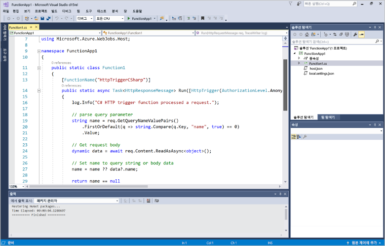
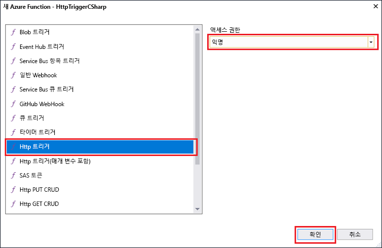

# Visual Studio를 사용하여 첫 번째 함수 만들기

Azure 기능을 사용 하면 toofirst VM을 만들거나 웹 응용 프로그램을 게시 하지 않고도 서버가 없는 환경에서 코드를 실행 합니다.

이 항목에서는 방법을 toouse toocreate Azure 함수에 대 한 Visual Studio 2017 도구 hello 함수 및 테스트 "hello world" 로컬로 설명 합니다. Hello 함수 코드 tooAzure 게시 됩니다. 이러한 도구는 이후 버전 또는 Visual Studio 2017 15.3, 버전의에서 hello Azure 개발 작업의 일부로 사용할 수 있습니다.

## 필수 조건

toocomplete이 자습서를 설치 합니다.

* [Visual Studio 2017 버전 15.3](https://www.visualstudio.com/vs/preview/), hello를 포함 하 여 **Azure 개발** 작업 합니다.

    
    
    >[!NOTE]  
    를 설치 하거나 tooVisual Studio 2017 15.3 버전을 업그레이드 한 후 Azure 함수에 대 한 toomanually 업데이트 hello Visual Studio 2017 도구 할 수도 있습니다. Hello 도구 hello에서 업데이트할 수 있습니다 **도구** 메뉴 아래 **확장명 및 업데이트 중...**   >  **업데이트** > **Visual Studio 마켓플레이스** > **Azure 함수 및 웹 작업이 도구**  >  **업데이트**합니다. 

[!INCLUDE [quickstarts-free-trial-note](../../includes/quickstarts-free-trial-note.md)] 

## Visual Studio에서 Azure Functions 프로젝트 만들기

[!INCLUDE [Create a project using hello Azure Functions template](../../includes/functions-vstools-create.md)]

Hello 프로젝트를 만든 첫 번째 함수를 만들 수 있습니다.

## Hello 함수 만들기

1. **솔루션 탐색기**에서 프로젝트 노드를 마우스 오른쪽 단추로 클릭하고 **추가** > **새 항목**을 차례로 선택합니다. **Azure 함수**를 선택하고 **추가**를 클릭합니다.

2. **HttpTrigger**를 선택하고, **함수 이름**을 입력하고, **익명**에 대한 **액세스 권한**을 선택하고, **만들기**를 클릭합니다. 만든 hello 함수는 모든 클라이언트에서 HTTP 요청에 의해 액세스 됩니다. 

    

    코드 파일을 함수 코드를 구현 하는 클래스를 포함 하는 tooyour 프로젝트에 추가 됩니다. 이 코드는 이름 값을 수신한 후 다시 에코하는 템플릿을 기준으로 합니다. hello **FunctionName** 특성 설정 hello 함수 이름입니다. hello **HttpTrigger** 특성 hello 함수를 트리거하는 hello 메시지를 나타냅니다. 

    

이제 HTTP에서 트리거한 함수를 만들었으므로 로컬 컴퓨터에서 해당 함수를 테스트할 수 있습니다.

## 로컬로 테스트 hello 함수

Azure Functions Core 도구를 사용하면 로컬 개발 컴퓨터에서 Azure Functions 프로젝트를 실행할 수 있습니다. 이러한 도구는 Visual Studio에서 함수를 시작할 처음으로 hello 메시지 표시 tooinstall 됩니다.  

1. tootest 함수를 F5 키를 누릅니다. 메시지가 표시 되 면 Visual Studio toodownload의 hello 요청을 받을 하 고 Azure 함수 코어 (CLI) 도구를 설치 합니다.  방화벽 예외를 tooenable hello 도구는 HTTP 요청을 처리할 수 있도록 할 수도 있습니다.

2. Hello Azure 함수 런타임에서 함수의 hello URL 복사를 출력합니다.  

    

3. Hello HTTP 요청에 대 한 hello URL을 브라우저의 주소 표시줄에 붙여 넣습니다. 쿼리 문자열 hello 추가 `&name=<yourname>` toothis URL hello 요청을 실행 하 고 있습니다. hello 다음 hello 브라우저 toohello 로컬 GET 요청에 hello 함수에서 반환 된 hello 응답을 보여 줍니다. 

    

4. 디버깅, toostop 클릭 hello **중지** hello Visual Studio 도구 모음에서 단추입니다.

Hello 함수 로컬 컴퓨터에서 제대로 실행 되는지 확인 한 후에 시간 toopublish hello 프로젝트 tooAzure 됩니다.

## Hello 프로젝트 tooAzure 게시

프로젝트를 게시하려면 먼저 Azure 구독에 함수 앱이 있어야 합니다. Visual Studio에서 직접 함수 앱을 만들 수 있습니다.

[!INCLUDE [Publish hello project tooAzure](../../includes/functions-vstools-publish.md)]

## Azure에서 함수 테스트

1. Hello 게시 프로필 페이지에서 hello hello 함수 응용 프로그램의 기준 URL을 복사 합니다. Hello 대체 `localhost:port` hello 새 기준 URL 사용 하 여 로컬로 hello 함수를 테스트할 때 사용 하는 hello URL의 일부입니다. 이전 처럼 있는지 tooappend hello 쿼리 문자열을 확인 `&name=<yourname>` toothis URL hello 요청을 실행 하 고 있습니다.

    HTTP를 호출 하는 hello URL 트리거할 함수는 다음과 같습니다.

        http://<functionappname>.azurewebsites.net/api/<functionname>?name=<yourname> 

2. Hello HTTP 요청에 대 한 새 URL이 브라우저의 주소 표시줄에 붙여 넣습니다. hello 다음 hello 브라우저 toohello 원격 GET 요청에 hello 함수에서 반환 된 hello 응답을 보여 줍니다. 

    
 
## 다음 단계

Visual Studio는 C# toocreate 함수 앱 간단한 HTTP 트리거된 함수와 함께 사용 했습니다. 

+ toolearn 어떻게 tooconfigure 프로젝트 toosupport 다른 종류의 트리거 및 바인딩 참조 hello [로컬 개발에 대 한 구성 hello 프로젝트](functions-develop-vs.md#configure-the-project-for-local-development) 섹션 [Azure 함수 Tools for Visual Studio](functions-develop-vs.md)합니다.
+ 로컬 테스트 및 hello Azure 함수 핵심 도구를 사용 하 여 디버깅에 대해 자세히 toolearn 참조 [코드 및 테스트 Azure 함수 로컬로](functions-run-local.md)합니다. 
+ .NET 클래스 라이브러리 기능 개발에 대 한 더 toolearn 참조 [Azure 함수와 함께 사용 하 여.NET 클래스 라이브러리](functions-dotnet-class-library.md)합니다. 

