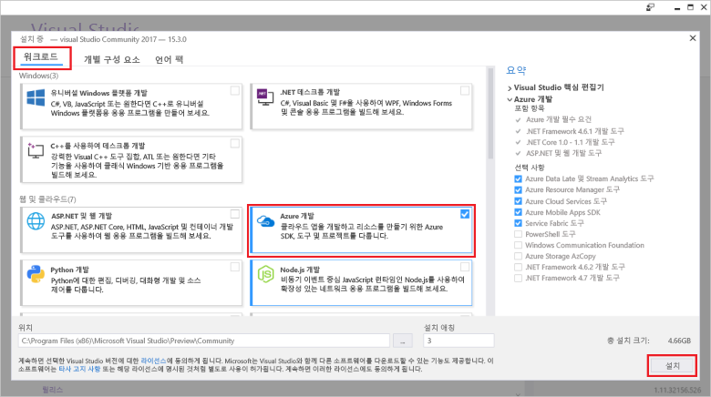

# Visual Studio를 사용하여 첫 번째 함수 만들기Create your first function using Visual Studio

Azure Functions를 사용하면 먼저 VM을 만들거나 웹 응용 프로그램을 게시하지 않고도 서버를 사용하지 않는 환경에서 코드를 실행할 수 있습니다.Azure Functions lets you execute your code in a serverless environment without having to first create a VM or publish a web application.

이 항목에서는 Visual Studio 2017 tools for Azure Functions를 사용하여 로컬에서 "hello world" 함수를 만들고 테스트하는 방법에 대해 알아봅니다.In this topic, you learn how to use the Visual Studio 2017 tools for Azure Functions to create and test a "hello world" function locally. 그런 다음 함수 코드를 Azure에 게시합니다.You will then publish the function code to Azure. 이러한 도구는 Visual Studio 2017 버전 15.3 이상에서 Azure 개발 워크로드의 일부로 제공됩니다.These tools are available as part of the Azure development workload in Visual Studio 2017 version 15.3, or a later version.

## 필수 조건Prerequisites

이 자습서를 완료하려면 다음을 설치합니다.To complete this tutorial, install:

* [Visual Studio 2017 버전 15.3](https://www.visualstudio.com/vs/preview/)(**Azure 개발** 워크로드 포함)[Visual Studio 2017 version 15.3](https://www.visualstudio.com/vs/preview/), including the **Azure development** workload.

    
    
    >[!NOTE]  
    Visual Studio 2017 버전 15.3을 설치하거나 업그레이드한 후 Visual Studio 2017 tools for Azure Functions를 수동으로 업데이트해야 할 수도 있습니다.After you install or upgrade to Visual Studio 2017 version 15.3, you might also need to manually update the Visual Studio 2017 tools for Azure Functions. **확장 및 업데이트...** > **업데이트** > **Visual Studio Marketplace** > **Azure Functions 및 Web Jobs Tools** > **업데이트** 아래의 **도구** 메뉴에서 도구를 업데이트할 수 있습니다.You can update the tools from the **Tools** menu under **Extensions and Updates...** > **Updates** > **Visual Studio Marketplace** > **Azure Functions and Web Jobs Tools** > **Update**. 

[!INCLUDE [quickstarts-free-trial-note](../../includes/quickstarts-free-trial-note.md)] 

## Visual Studio에서 Azure Functions 프로젝트 만들기Create an Azure Functions project in Visual Studio

[!INCLUDE [Create a project using the Azure Functions template](../../includes/functions-vstools-create.md)]

이제 프로젝트를 만들었으므로 첫 번째 함수를 만들 수 있습니다.Now that you have created the project, you can create your first function.

## 함수 만들기Create the function

1. **솔루션 탐색기**에서 프로젝트 노드를 마우스 오른쪽 단추로 클릭하고 **추가** > **새 항목**을 차례로 선택합니다.In **Solution Explorer**, right-click on your project node and select **Add** > **New Item**. **Azure 함수**를 선택하고 **추가**를 클릭합니다.Select **Azure Function** and click **Add**.

2. **HttpTrigger**를 선택하고, **함수 이름**을 입력하고, **익명**에 대한 **액세스 권한**을 선택하고, **만들기**를 클릭합니다.Select **HttpTrigger**, type a **Function Name**, select **Anonymous** for **Access Rights**, and click **Create**. 만든 함수는 모든 클라이언트의 HTTP 요청으로 액세스됩니다.The function created is accessed by an HTTP request from any client. 

    

    함수 코드를 구현하는 클래스가 들어 있는 프로젝트에 코드 파일이 추가됩니다.A code file is added to your project that contains a class that implements your function code. 이 코드는 이름 값을 수신한 후 다시 에코하는 템플릿을 기준으로 합니다.This code is based on a template, which receives a name value and echos it back. **FunctionName** 특성은 함수의 이름을 설정합니다.The **FunctionName** attribute sets the name of your function. **HttpTrigger** 특성은 함수를 트리거하는 메시지를 나타냅니다.The **HttpTrigger** attribute indicates the message that triggers the function. 

    

이제 HTTP에서 트리거한 함수를 만들었으므로 로컬 컴퓨터에서 해당 함수를 테스트할 수 있습니다.Now that you have created an HTTP-triggered function, you can test it on your local computer.

## 로컬에서 함수 테스트Test the function locally

Azure Functions Core 도구를 사용하면 로컬 개발 컴퓨터에서 Azure Functions 프로젝트를 실행할 수 있습니다.Azure Functions Core Tools lets you run Azure Functions project on your local development computer. Visual Studio에서 처음으로 함수를 시작할 때 이 도구를 설치하도록 요구하는 메시지가 표시됩니다.You are prompted to install these tools the first time you start a function from Visual Studio.  

1. 함수를 테스트하려면 F5 키를 누릅니다.To test your function, press F5. 메시지가 표시되면 Visual Studio에서 Azure Functions Core(CLI) 도구를 다운로드하여 설치하도록 요구하는 요청을 수락합니다.If prompted, accept the request from Visual Studio to download and install Azure Functions Core (CLI) tools.  또한 도구에서 HTTP 요청을 처리할 수 있도록 방화벽 예외를 사용하도록 설정해야 합니다.You may also need to enable a firewall exception so that the tools can handle HTTP requests.

2. Azure Functions 런타임 출력에서 함수의 URL을 복사합니다.Copy the URL of your function from the Azure Functions runtime output.  

    

3. HTTP 요청에 대한 URL을 브라우저의 주소 표시줄에 붙여 넣습니다.Paste the URL for the HTTP request into your browser's address bar. 이 URL에 쿼리 문자열 `&name=<yourname>`을 추가하고 요청을 실행합니다.Append the query string `&name=<yourname>` to this URL and execute the request. 다음은 함수에서 반환된 로컬 GET 요청에 대한 브라우저의 응답을 보여 줍니다.The following shows the response in the browser to the local GET request returned by the function: 

    

4. 디버깅을 중지하려면 Visual Studio 도구 모음에서 **중지** 단추를 클릭합니다.To stop debugging, click the **Stop** button on the Visual Studio toolbar.

함수가 로컬 컴퓨터에서 제대로 실행되는지 확인한 후에 해당 프로젝트를 Azure에 게시해야 합니다.After you have verified that the function runs correctly on your local computer, it's time to publish the project to Azure.

## Azure에 프로젝트 게시Publish the project to Azure

프로젝트를 게시하려면 먼저 Azure 구독에 함수 앱이 있어야 합니다.You must have a function app in your Azure subscription before you can publish your project. Visual Studio에서 직접 함수 앱을 만들 수 있습니다.You can create a function app right from Visual Studio.

[!INCLUDE [Publish the project to Azure](../../includes/functions-vstools-publish.md)]

## Azure에서 함수 테스트Test your function in Azure

1. 게시 프로필 페이지에서 함수 앱의 기준 URL을 복사합니다.Copy the base URL of the function app from the Publish profile page. 로컬에서 함수를 테스트할 때 사용한 URL의 `localhost:port` 부분을 새 기준 URL로 바꿉니다.Replace the `localhost:port` portion of the URL you used when testing the function locally with the new base URL. 이전처럼 이 URL에 `&name=<yourname>` 쿼리 문자열을 추가하고 요청을 실행합니다.As before, make sure to append the query string `&name=<yourname>` to this URL and execute the request.

    HTTP에서 트리거한 함수를 호출하는 URL은 다음과 같습니다.The URL that calls your HTTP triggered function looks like this:

        http://<functionappname>.azurewebsites.net/api/<functionname>?name=<yourname> 

2. HTTP 요청에 대한 이러한 새 URL을 브라우저의 주소 표시줄에 붙여넣습니다.Paste this new URL for the HTTP request into your browser's address bar. 다음은 함수에서 반환된 원격 GET 요청에 대한 브라우저의 응답을 보여 줍니다.The following shows the response in the browser to the remote GET request returned by the function: 

    
 
## 다음 단계Next steps

Visual Studio를 사용하여 간단하고 HTTP에서 트리거한 함수가 있는 C# 함수 앱을 만들었습니다.You have used Visual Studio to create a C# function app with a simple HTTP triggered function. 

+ 다른 종류의 트리거 및 바인딩을 지원하도록 프로젝트를 구성하는 방법은 [Visual Studio용 Azure Functions 도구](functions-develop-vs.md#configure-the-project-for-local-development)의 [로컬 개발에 대한 프로젝트 구성](functions-develop-vs.md) 섹션을 참조하세요.To learn how to configure your project to support other types of triggers and bindings, see the [Configure the project for local development](functions-develop-vs.md#configure-the-project-for-local-development) section in [Azure Functions Tools for Visual Studio](functions-develop-vs.md).
+ Azure Functions Core 도구를 사용하여 로컬에서 테스트하고 디버그하는 방법에 대한 자세한 내용은 [Azure Functions를 로컬로 코딩 및 테스트하는 방법](functions-run-local.md)을 참조하세요.To learn more about local testing and debugging using the Azure Functions Core Tools, see [Code and test Azure Functions locally](functions-run-local.md). 
+ .NET 클래스 라이브러리로 기능을 개발하는 방법에 대해 자세히 알아보려면 [Azure Functions에서 .NET 클래스 라이브러리 사용](functions-dotnet-class-library.md)을 참조하세요.To learn more about developing functions as .NET class libraries, see [Using .NET class libraries with Azure Functions](functions-dotnet-class-library.md). 

