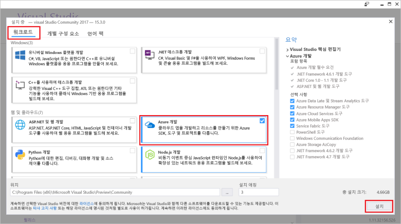

# <a name="azure-functions-tools-for-visual-studio"></a>Azure Functions Tools for Visual Studio  

Visual Studio 2017 용 azure 기능 도구는 개발, 테스트 및 C# 기능 tooAzure 배포할 수 있는 Visual Studio에 대 한 확장입니다. 첫 번째 환경과 Azure 함수 이면에서 자세히 알아볼 수 있습니다 [소개 tooAzure 함수](functions-overview.md)합니다.

hello를 Azure 함수 도구 hello를 다음 이점을 제공 합니다. 

* 로컬 개발 컴퓨터에서 함수를 편집, 빌드 및 실행합니다. 
* 게시 Azure 함수 프로젝트 tooAzure 직접 합니다. 
* WebJobs 특성 toodeclare 함수 바인딩이 hello 바인딩 정의 대 한 별도 function.json 유지 하는 대신 C# 코드에서 직접 사용 합니다.
* 미리 컴파일된 C# 함수를 개발하고 배포합니다. 미리 컴파일된 함수는 C# 스크립트 기반 함수보다 더 뛰어난 콜드 부팅 성능을 제공합니다. 
* C#에서 함수를 모두 Visual Studio 개발 hello 활용 하는 동안 코드. 

이 항목에서는 방법을 toouse hello Azure 함수 도구 Visual Studio 2017 toodevelop에 대 한 C#에서 함수를 보여 줍니다. 또한 학습 방법을 toopublish.NET 어셈블리와 프로젝트 tooAzure 프로그램.

## <a name="prerequisites"></a>필수 조건

기능 도구를 azure의 hello Azure 개발 작업에 포함 된 [Visual Studio 2017 버전 15.3](https://www.visualstudio.com/vs/), 또는 이후 버전입니다. Hello 포함 되어 있는지 확인 **Azure 개발** Visual Studio 2017 15.3 버전 설치에는 작업:



toocreate 함수 배포도 사용 해야 합니다.

* 활성 Azure 구독. Azure 구독이 아직 없는 경우 [무료 계정](https://azure.microsoft.com/free/?WT.mc_id=A261C142F)을 사용할 수 있습니다.

* Azure Storage 계정. 저장소 계정 toocreate 참조 [저장소 계정 만들기](../storage/common/storage-create-storage-account.md#create-a-storage-account)합니다.  
## <a name="create-an-azure-functions-project"></a>Azure Functions 프로젝트 만들기 

[!INCLUDE [Create a project using hello Azure Functions](../../includes/functions-vstools-create.md)]


## <a name="configure-hello-project-for-local-development"></a>로컬 개발에 대 한 hello 프로젝트 구성

Hello Azure 함수 템플릿을 사용 하 여 새 프로젝트를 만들 때 빈 C# 프로젝트 hello 다음 파일이 포함 된 가져오기:

* **host.json**: 함수 호스트를 hello 구성할 수 있습니다. 이러한 설정은 로컬 및 Azure에서 실행할 때 모두 적용됩니다. 자세한 내용은 [host.json](https://github.com/Azure/azure-webjobs-sdk-script/wiki/host.json) 참조 문서를 참조하세요.
    
* **local.settings.json**: 함수를 로컬로 실행할 때 사용되는 설정을 유지합니다. 이러한 설정은 Azure에서 사용 되지 않습니다, hello에 사용 되는 [Azure 함수 핵심 도구](functions-run-local.md)합니다. 연결 문자열 tooother Azure 같은 파일 toospecify 설정이이 사용 하 여 서비스입니다. 새 키 toohello 추가 **값** 프로젝트에서 함수에 필요한 각 연결에 대 한 배열입니다. 자세한 내용은 참조 [로컬 설정 파일](functions-run-local.md#local-settings-file) hello Azure 함수 핵심 도구 항목의 합니다.

hello 함수 런타임에서 Azure 저장소 계정을 내부적으로 사용합니다. HTTP 및 webhook 이외의 종류를 트리거할 모든 hello 설정 해야 **Values.AzureWebJobsStorage** tooa 유효한 Azure 저장소 계정 연결 문자열을 입력 합니다.

[!INCLUDE [Note toonot use local storage](../../includes/functions-local-settings-note.md)]

 tooset hello 저장소 계정 연결 문자열:

1. Visual Studio에서 열고 **클라우드 탐색기**를 확장 하 고 **저장소 계정** > **저장소 계정**을 선택한 후 **속성**및 복사 hello **기본 연결 문자열** 값입니다.   

2. 프로젝트를 hello local.settings.json 프로젝트 파일을 열고 hello의 hello 값 설정 **AzureWebJobsStorage** 복사한 toohello 연결 문자열을 입력 합니다.

3. Hello 이전 단계 tooadd 고유 키 toohello 반복 **값** 함수에 필요한 다른 연결에 대 한 배열입니다.  

## <a name="create-a-function"></a>함수 만들기

미리 컴파일된 함수 hello 함수에 의해 사용 되는 hello 바인딩은 hello 코드의 특성을 적용 하 여 정의 됩니다. Hello Azure 함수 도구 toocreate hello 제공 된 템플릿에서 함수를 사용 하면 이러한 특성을 적용 됩니다. 

1. **솔루션 탐색기**에서 프로젝트 노드를 마우스 오른쪽 단추로 클릭하고 **추가** > **새 항목**을 차례로 선택합니다. 선택 **Azure 함수**, 입력 **이름** hello 클래스 및 클릭에 대 한 **추가**합니다.

2. 사용자의 트리거를 선택 하 고, hello 바인딩 속성을 설정, 클릭 **만들기**합니다. hello 다음 예제에서는 hello 설정이 트리거되면 큐 저장소를 만드는 함수 

    
    
    명명 된 연결 문자열 키 **QueueStorage** 가 제공 된 hello local.settings.json 파일에 정의 됩니다. 
 
3. 검사 hello 새로 클래스를 추가 합니다. 정적 참조 **실행** hello 특성을 사용 하는 메서드를 **FunctionName** 특성입니다. 이 특성 hello 메서드가 hello hello 함수에 대 한 진입점을 나타냅니다. 

    예를 들어 hello C# 클래스를 다음 기본 큐 트리거되는 저장소 함수를 나타냅니다.

    ````csharp
    using System;
    using Microsoft.Azure.WebJobs;
    using Microsoft.Azure.WebJobs.Host;
    
    namespace FunctionApp1
    {
        public static class Function1
        {
            [FunctionName("QueueTriggerCSharp")]        
            public static void Run([QueueTrigger("myqueue-items", Connection = "QueueStorage")]string myQueueItem, TraceWriter log)
            {
                log.Info($"C# Queue trigger function processed: {myQueueItem}");
            }
        }
    } 
    ````
 
    바인딩 고유 특성은 적용 된 tooeach 바인딩 제공 된 매개 변수가 toohello 진입점 메서드. 매개 변수로 hello 바인딩 정보를 사용 하는 hello 특성입니다. 이전 예 hello hello 첫 번째 매개 변수는 한 **QueueTrigger** 트리거한 큐 함수를 나타내는 특성을 적용 합니다. hello 큐 이름 및 연결 문자열 설정 이름 매개 변수로 전달 됩니다.  

## <a name="testing-functions"></a>테스팅 함수

Azure Functions Core 도구를 사용하면 로컬 개발 컴퓨터에서 Azure Functions 프로젝트를 실행할 수 있습니다. 이러한 도구는 Visual Studio에서 함수를 시작할 처음으로 hello 메시지 표시 tooinstall 됩니다.  

tootest 함수를 F5 키를 누릅니다. 메시지가 표시 되 면 Visual Studio toodownload의 hello 요청을 받을 하 고 Azure 함수 코어 (CLI) 도구를 설치 합니다.  방화벽 예외를 tooenable hello 도구는 HTTP 요청을 처리할 수 있도록 할 수도 있습니다.

실행 하는 hello 프로젝트에서 배포 된 함수를 테스트할 때 코드를 테스트할 수 있습니다. 자세한 내용은 [Azure Functions에서 코드를 테스트하기 위한 전략](functions-test-a-function.md)을 참조하세요. 디버그 모드에서 실행할 때 중단점이 예상대로 Visual Studio에서 적중됩니다. 

큐 tootest 함수를 실행 하는 방법의 예를 들어 참조 hello [트리거한 큐 함수 빠른 시작 자습서](functions-create-storage-queue-triggered-function.md#test-the-function)합니다.  

hello Azure 함수 핵심 도구 사용에 대 한 더 toolearn 참조 [코드 및 Azure 함수 로컬로 테스트](functions-run-local.md)합니다.

## <a name="publish-tooazure"></a>TooAzure 게시

[!INCLUDE [Publish hello project tooAzure](../../includes/functions-vstools-publish.md)]

>[!NOTE]  
>Hello local.settings.json에서 추가한 모든 설정도 추가 해야 toohello 함수 앱 Azure에서. 이러한 설정은 자동으로 추가되지 않습니다. 다음이 방법 중 하나에 필요한 설정을 tooyour 함수 응용 프로그램을 추가할 수 있습니다.
>
>* [Azure 포털 hello를 사용 하 여](functions-how-to-use-azure-function-app-settings.md#settings)합니다.
>* [Hello를 사용 하 여 `--publish-local-settings` hello Azure 함수 핵심 도구에서에서 게시 옵션](functions-run-local.md#publish)합니다.
>* [Azure CLI hello를 사용 하 여](/cli/azure/functionapp/config/appsettings#set)합니다. 

## <a name="next-steps"></a>다음 단계

Azure 함수 도구에 대 한 자세한 내용은 참조에 대 한 일반적인 질문 섹션의 hello hello [Azure 함수에 대 한 Visual Studio 2017 도구](https://blogs.msdn.microsoft.com/webdev/2017/05/10/azure-function-tools-for-visual-studio-2017/) 블로그 게시물입니다.

hello Azure 함수 핵심 도구에 대해 자세히 toolearn 참조 [코드 및 Azure 함수 로컬로 테스트](functions-run-local.md)합니다.  
.NET 클래스 라이브러리 기능 개발에 대 한 더 toolearn 참조 [Azure 함수와 함께 사용 하 여.NET 클래스 라이브러리](functions-dotnet-class-library.md)합니다. 이 항목에서는 toouse 특성 toodeclare 다양 한 유형의 Azure 함수에서 지 원하는 바인딩 hello 하는 방법의 예를 제공 합니다.    
