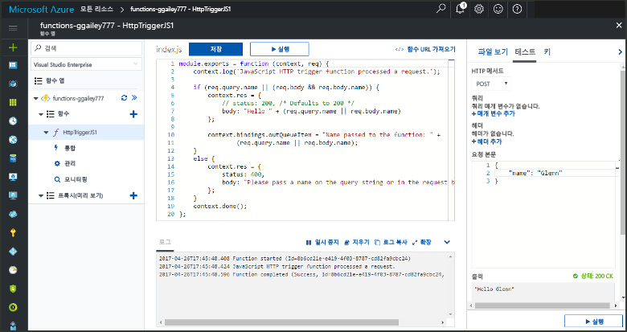
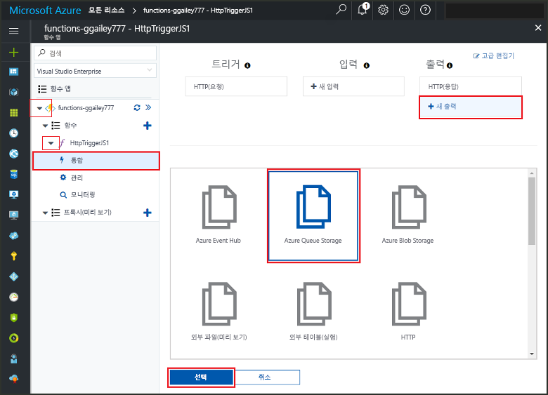
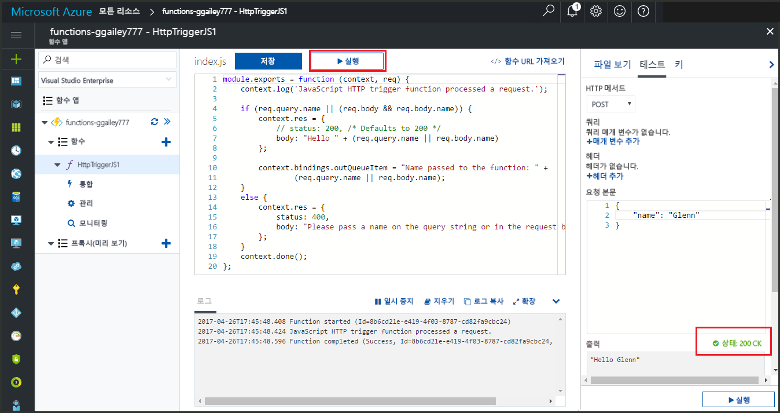
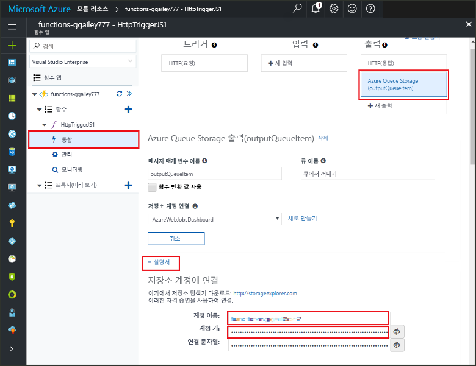
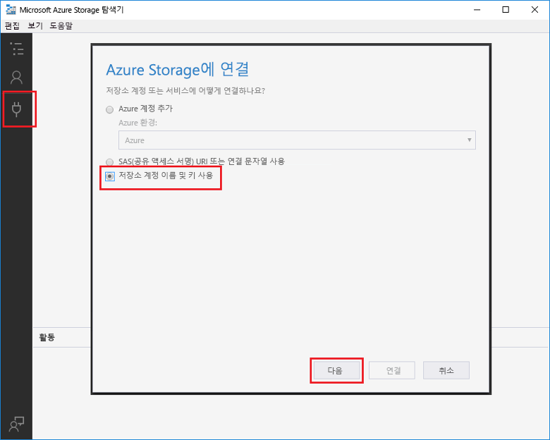

# <a name="add-messages-tooan-azure-storage-queue-using-functions"></a><span data-ttu-id="743c8-103">함수를 사용 하 여 메시지 tooan Azure 저장소 큐를 추가 합니다.</span><span class="sxs-lookup"><span data-stu-id="743c8-103">Add messages tooan Azure Storage queue using Functions</span></span>

<span data-ttu-id="743c8-104">Azure 기능 입력 및 출력 바인딩은 함수에서 선언적으로 tooconnect tooexternal 서비스 데이터를 제공합니다.</span><span class="sxs-lookup"><span data-stu-id="743c8-104">In Azure Functions, input and output bindings provide a declarative way tooconnect tooexternal service data from your function.</span></span> <span data-ttu-id="743c8-105">이 항목에서는 tooupdate 바인딩에 출력을 추가 하 여 기존 함수에서 보내는 방법을 메시지 tooAzure 큐 저장소를 설명 합니다.</span><span class="sxs-lookup"><span data-stu-id="743c8-105">In this topic, learn how tooupdate an existing function by adding an output binding that sends messages tooAzure Queue storage.</span></span>  



## <a name="prerequisites"></a><span data-ttu-id="743c8-107">필수 조건</span><span class="sxs-lookup"><span data-stu-id="743c8-107">Prerequisites</span></span> 

[!INCLUDE [Previous topics](../../includes/functions-quickstart-previous-topics.md)]

* <span data-ttu-id="743c8-108">Hello 설치 [Microsoft Azure 저장소 탐색기](http://storageexplorer.com/)합니다.</span><span class="sxs-lookup"><span data-stu-id="743c8-108">Install hello [Microsoft Azure Storage Explorer](http://storageexplorer.com/).</span></span>

## <span data-ttu-id="743c8-109"><a name="add-binding"></a>출력 바인딩 추가</span><span class="sxs-lookup"><span data-stu-id="743c8-109"><a name="add-binding"></a>Add an output binding</span></span>
 
1. <span data-ttu-id="743c8-110">함수 앱과 함수를 모두 확장합니다.</span><span class="sxs-lookup"><span data-stu-id="743c8-110">Expand both your function app and your function.</span></span>

2. <span data-ttu-id="743c8-111">**통합** 및 **+ 새 출력**을 선택한 다음 **Azure Queue Storage**, **선택**을 차례로 선택합니다.</span><span class="sxs-lookup"><span data-stu-id="743c8-111">Select **Integrate** and **+ New output**, then choose **Azure Queue storage** and choose **Select**.</span></span>
    
    

3. <span data-ttu-id="743c8-113">Hello 테이블에 지정 된 hello 설정을 사용 합니다.</span><span class="sxs-lookup"><span data-stu-id="743c8-113">Use hello settings as specified in hello table:</span></span> 

    

    | <span data-ttu-id="743c8-115">설정</span><span class="sxs-lookup"><span data-stu-id="743c8-115">Setting</span></span>      |  <span data-ttu-id="743c8-116">제안 값</span><span class="sxs-lookup"><span data-stu-id="743c8-116">Suggested value</span></span>   | <span data-ttu-id="743c8-117">설명</span><span class="sxs-lookup"><span data-stu-id="743c8-117">Description</span></span>                              |
    | ------------ |  ------- | -------------------------------------------------- |
    | <span data-ttu-id="743c8-118">**큐 이름**</span><span class="sxs-lookup"><span data-stu-id="743c8-118">**Queue name**</span></span>   | <span data-ttu-id="743c8-119">myqueue-items</span><span class="sxs-lookup"><span data-stu-id="743c8-119">myqueue-items</span></span>    | <span data-ttu-id="743c8-120">hello의 hello 이름 tooconnect tooin을 저장소 계정의 큐입니다.</span><span class="sxs-lookup"><span data-stu-id="743c8-120">hello name of hello queue tooconnect tooin your Storage account.</span></span> |
    | <span data-ttu-id="743c8-121">**Storage 계정 연결**</span><span class="sxs-lookup"><span data-stu-id="743c8-121">**Storage account connection**</span></span> | <span data-ttu-id="743c8-122">AzureWebJobStorage</span><span class="sxs-lookup"><span data-stu-id="743c8-122">AzureWebJobStorage</span></span> | <span data-ttu-id="743c8-123">Hello 함수 응용 프로그램에서 이미 사용 되는 저장소 계정 연결을 사용 하거나 새로 만들 수 있습니다.</span><span class="sxs-lookup"><span data-stu-id="743c8-123">You can use hello storage account connection already being used by your function app, or create a new one.</span></span>  |
    | <span data-ttu-id="743c8-124">**메시지 매개 변수 이름**</span><span class="sxs-lookup"><span data-stu-id="743c8-124">**Message parameter name**</span></span> | <span data-ttu-id="743c8-125">outputQueueItem</span><span class="sxs-lookup"><span data-stu-id="743c8-125">outputQueueItem</span></span> | <span data-ttu-id="743c8-126">바인딩 매개 변수를 출력 하는 hello 이름 hello입니다.</span><span class="sxs-lookup"><span data-stu-id="743c8-126">hello name of hello output binding parameter.</span></span> | 

4. <span data-ttu-id="743c8-127">클릭 **저장** tooadd hello 바인딩.</span><span class="sxs-lookup"><span data-stu-id="743c8-127">Click **Save** tooadd hello binding.</span></span>
 
<span data-ttu-id="743c8-128">출력 바인딩 정의가지고 tooupdate hello 코드 toouse hello 바인딩 tooadd 메시지 tooa 큐가 있어야 합니다.</span><span class="sxs-lookup"><span data-stu-id="743c8-128">Now that you have an output binding defined, you need tooupdate hello code toouse hello binding tooadd messages tooa queue.</span></span>  

## <a name="update-hello-function-code"></a><span data-ttu-id="743c8-129">Hello 함수 코드를 업데이트 합니다.</span><span class="sxs-lookup"><span data-stu-id="743c8-129">Update hello function code</span></span>

1. <span data-ttu-id="743c8-130">Hello 편집기 함수 toodisplay hello 함수 코드를 선택 합니다.</span><span class="sxs-lookup"><span data-stu-id="743c8-130">Select your function toodisplay hello function code in hello editor.</span></span> 

2. <span data-ttu-id="743c8-131">C# 함수에 대 한 업데이트 tooadd hello를 다음과 같이 함수 정의 **outputQueueItem** 저장소 바인딩 매개 변수입니다.</span><span class="sxs-lookup"><span data-stu-id="743c8-131">For a C# function, update your function definition as follows tooadd hello **outputQueueItem** storage binding parameter.</span></span> <span data-ttu-id="743c8-132">JavaScript 함수에 대해서는 이 단계를 건너뜁니다.</span><span class="sxs-lookup"><span data-stu-id="743c8-132">Skip this step for a JavaScript function.</span></span>

    ```cs   
    public static async Task<HttpResponseMessage> Run(HttpRequestMessage req, 
        ICollector<string> outputQueueItem, TraceWriter log)
    {
        ....
    }
    ```

3. <span data-ttu-id="743c8-133">Hello hello 메서드 반환 전에 코드 toohello 함수를 다음을 추가 합니다.</span><span class="sxs-lookup"><span data-stu-id="743c8-133">Add hello following code toohello function just before hello method returns.</span></span> <span data-ttu-id="743c8-134">함수의 hello 언어에 대 한 적절 한 코드 조각을 hello를 사용 합니다.</span><span class="sxs-lookup"><span data-stu-id="743c8-134">Use hello appropriate snippet for hello language of your function.</span></span>

    ```javascript
    context.bindings.outputQueueItem = "Name passed toohello function: " + 
                (req.query.name || req.body.name);
    ```

    ```cs
    outputQueueItem.Add("Name passed toohello function: " + name);     
    ```

4. <span data-ttu-id="743c8-135">선택 **저장** toosave 변경 합니다.</span><span class="sxs-lookup"><span data-stu-id="743c8-135">Select **Save** toosave changes.</span></span>

<span data-ttu-id="743c8-136">toohello HTTP 트리거 전달 된 값이 hello 메시지 추가 toohello 큐에 포함 됩니다.</span><span class="sxs-lookup"><span data-stu-id="743c8-136">hello value passed toohello HTTP trigger is included in a message added toohello queue.</span></span>
 
## <a name="test-hello-function"></a><span data-ttu-id="743c8-137">테스트 hello 함수</span><span class="sxs-lookup"><span data-stu-id="743c8-137">Test hello function</span></span> 

1. <span data-ttu-id="743c8-138">Hello 코드 변경 내용이 저장 된 후 선택 **실행**합니다.</span><span class="sxs-lookup"><span data-stu-id="743c8-138">After hello code changes are saved, select **Run**.</span></span> 

    

2. <span data-ttu-id="743c8-140">Hello 로그 toomake hello 함수 성공 확인을 확인 합니다.</span><span class="sxs-lookup"><span data-stu-id="743c8-140">Check hello logs toomake sure that hello function succeeded.</span></span> <span data-ttu-id="743c8-141">명명 된 새 큐 **outqueue** hello 함수 런타임 hello 출력 바인딩이 때 처음으로 사용 하 여 저장소 계정에 만들어집니다.</span><span class="sxs-lookup"><span data-stu-id="743c8-141">A new queue named **outqueue** is created in your Storage account by hello Functions runtime when hello output binding is first used.</span></span>

<span data-ttu-id="743c8-142">다음으로 tooyour 저장소 계정 tooverify hello 새 큐와 tooit 추가한 hello 메시지를 연결할 수 있습니다.</span><span class="sxs-lookup"><span data-stu-id="743c8-142">Next, you can connect tooyour storage account tooverify hello new queue and hello message you added tooit.</span></span> 

## <a name="connect-toohello-queue"></a><span data-ttu-id="743c8-143">Toohello 큐 연결</span><span class="sxs-lookup"><span data-stu-id="743c8-143">Connect toohello queue</span></span>

<span data-ttu-id="743c8-144">Skip 이미 저장소 탐색기를 설치 하 고 tooyour 저장소 계정을 연결 하는 경우 처음 3 단계를 hello 합니다.</span><span class="sxs-lookup"><span data-stu-id="743c8-144">Skip hello first three steps if you have already installed Storage Explorer and connected it tooyour storage account.</span></span>    

1. <span data-ttu-id="743c8-145">함수에서 선택 **통합** 및 새 hello **Azure 큐 저장소** 바인딩 출력 한 다음 확장 **설명서**합니다.</span><span class="sxs-lookup"><span data-stu-id="743c8-145">In your function, choose **Integrate** and hello new **Azure Queue storage** output binding, then expand **Documentation**.</span></span> <span data-ttu-id="743c8-146">**계정 이름** 및 **계정 키**를 모두 복사합니다.</span><span class="sxs-lookup"><span data-stu-id="743c8-146">Copy both **Account name** and **Account key**.</span></span> <span data-ttu-id="743c8-147">이러한 자격 증명 tooconnect toohello 저장소 계정을 사용합니다.</span><span class="sxs-lookup"><span data-stu-id="743c8-147">You use these credentials tooconnect toohello storage account.</span></span>
 
    

2. <span data-ttu-id="743c8-149">Hello 실행 [Microsoft Azure 저장소 탐색기](http://storageexplorer.com/) 도구, 선택 hello 연결 hello 왼쪽에 있는 아이콘을 선택 **저장소 계정 이름과 키를 사용 하 여**를 선택 하 고 **다음**합니다.</span><span class="sxs-lookup"><span data-stu-id="743c8-149">Run hello [Microsoft Azure Storage Explorer](http://storageexplorer.com/) tool, select hello connect icon on hello left, choose **Use a storage account name and key**, and select **Next**.</span></span>

    
    
3. <span data-ttu-id="743c8-151">붙여넣기 hello **계정 이름** 및 **계정 키** 의 해당 필드에 1 단계에서 선택한 다음 선택 **다음**, 및 **연결**합니다.</span><span class="sxs-lookup"><span data-stu-id="743c8-151">Paste hello **Account name** and **Account key** from step 1 into their corresponding fields, then select **Next**, and **Connect**.</span></span> 
  
    

4. <span data-ttu-id="743c8-153">Hello 연결 된 저장소 계정, **큐** 큐 이름이 있는지 확인 하 고 **myqueue 항목** 존재 합니다.</span><span class="sxs-lookup"><span data-stu-id="743c8-153">Expand hello attached storage account, expand **Queues** and verify that a queue named **myqueue-items** exists.</span></span> <span data-ttu-id="743c8-154">또한 메시지 hello 큐에 이미 나타납니다.</span><span class="sxs-lookup"><span data-stu-id="743c8-154">You should also see a message already in hello queue.</span></span>  
 
    
 

## <a name="clean-up-resources"></a><span data-ttu-id="743c8-156">리소스 정리</span><span class="sxs-lookup"><span data-stu-id="743c8-156">Clean up resources</span></span>

[!INCLUDE [Next steps note](../../includes/functions-quickstart-cleanup.md)]

## <a name="next-steps"></a><span data-ttu-id="743c8-157">다음 단계</span><span class="sxs-lookup"><span data-stu-id="743c8-157">Next steps</span></span>

<span data-ttu-id="743c8-158">출력 바인딩 tooan 기존 함수를 추가 했습니다.</span><span class="sxs-lookup"><span data-stu-id="743c8-158">You have added an output binding tooan existing function.</span></span> 

[!INCLUDE [Next steps note](../../includes/functions-quickstart-next-steps.md)]

<span data-ttu-id="743c8-159">바인딩 tooQueue 저장소에 대 한 자세한 내용은 참조 [Azure 함수 저장소 큐 바인딩](functions-bindings-storage-queue.md)합니다.</span><span class="sxs-lookup"><span data-stu-id="743c8-159">For more information about binding tooQueue storage, see [Azure Functions Storage queue bindings](functions-bindings-storage-queue.md).</span></span> 


