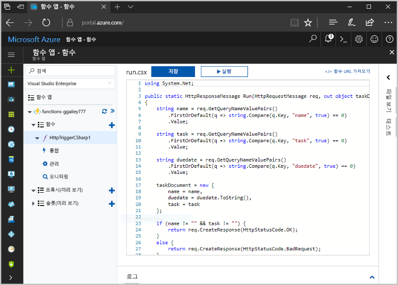
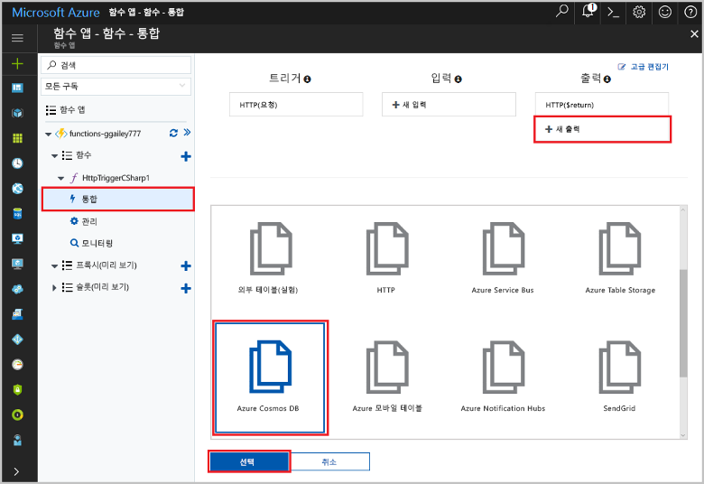
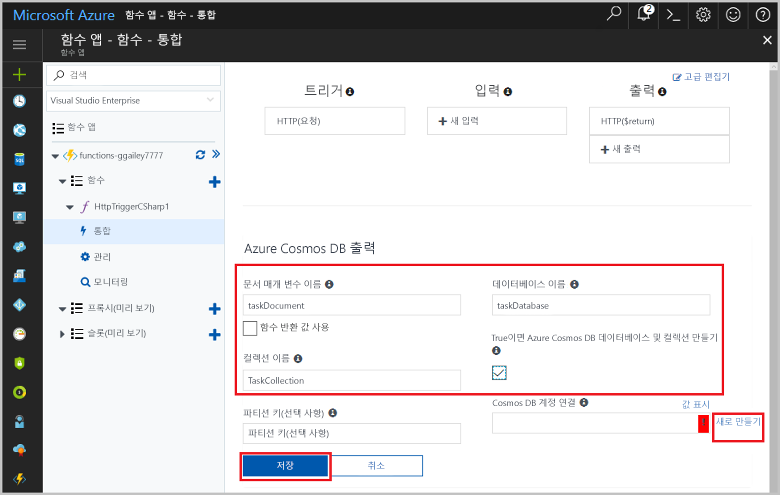
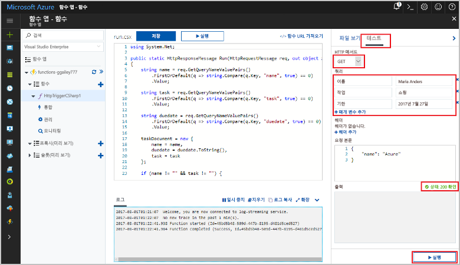
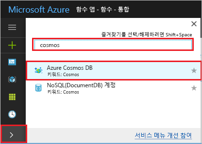
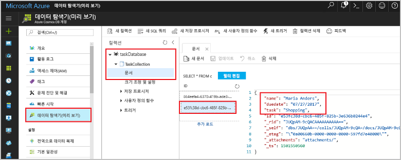

# <a name="store-unstructured-data-using-azure-functions-and-cosmos-db"></a>Azure Functions 및 Cosmos DB를 사용하여 구조화되지 않은 데이터 저장

[Azure Cosmos DB](https://azure.microsoft.com/services/cosmos-db/) 은 구조화 되지 않은 위한 훌륭한 방법 toostore 및 JSON 데이터입니다. Cosmos DB를 Azure Functions와 함께 사용하면 관계형 데이터베이스에 데이터를 저장하는 데 필요한 것보다 훨씬 적은 코드를 사용하여 쉽고 빠르게 데이터를 저장할 수 있습니다.

Azure 기능 입력 및 출력 바인딩은 함수에서 선언적으로 tooconnect tooexternal 서비스 데이터를 제공합니다. 이 항목에서는 tooupdate 하 여 기존 C# 작동 방식을 tooadd Cosmos DB 문서에 구조화 되지 않은 데이터를 저장 하는 출력 바인딩이 설명 합니다. 



## <a name="prerequisites"></a>필수 조건

toocomplete이이 자습서:

[!INCLUDE [Previous quickstart note](../../includes/functions-quickstart-previous-topics.md)]

## <a name="add-an-output-binding"></a>출력 바인딩 추가

1. 함수 앱과 함수를 모두 확장합니다.

1. 선택 **통합** 및 **+ 새 출력**, hello에 hello 페이지의 오른쪽 위에 있습니다. **Azure Cosmos DB**를 선택하고 **선택**을 클릭합니다.

    

3. 사용 하 여 hello **Azure Cosmos DB 출력** hello 테이블에 지정 된 설정: 

    

    | 설정      | 제안 값  | 설명                                |
    | ------------ | ---------------- | ------------------------------------------ |
    | **문서 매개 변수 이름** | taskDocument | 코드에서 toohello Cosmos DB 개체 참조 이름입니다. |
    | **데이터베이스 이름** | taskDatabase | 데이터베이스 toosave 문서의 이름입니다. |
    | **컬렉션 이름** | TaskCollection | Cosmos DB 데이터베이스의 컬렉션 이름. |
    | **True 이면 hello Cosmos DB 데이터베이스 및 컬렉션을 만듭니다.** | 선택 | hello 컬렉션 이미 존재, 따라서 만들 하지 않습니다. |

4. 선택 **새로** 다음 toohello **Cosmos DB 문서 연결** , 레이블 지정 및 선택 **+ 새로 만들기**합니다. 

5. 사용 하 여 hello **새 계정** hello 테이블에 지정 된 설정: 

    

    | 설정      | 제안 값  | 설명                                |
    | ------------ | ---------------- | ------------------------------------------ |
    | **ID** | 데이터베이스의 이름 | Hello Cosmos DB 데이터베이스에 대 한 고유 ID  |
    | **API** | SQL(DocumentDB) | Hello 문서 데이터베이스 API를 선택 합니다.  |
    | **구독** | Azure 구독 | Azure 구독  |
    | **리소스 그룹** | myResourceGroup |  함수에서 사용 하는 앱을 포함 하는 hello 기존 리소스 그룹을 사용 합니다. |
    | **위치**:  | WestEurope | 함수 앱 이나 hello 저장 된 문서를 사용 하는 tooother 앱 tooeither 가까운 위치를 선택 합니다.  |

6. 클릭 **확인** toocreate hello 데이터베이스입니다. 몇 분 toocreate hello 데이터베이스를 걸릴 수 있습니다. Hello 데이터베이스를 만든 후 데이터베이스 연결 문자열 hello 함수 응용 프로그램 설정으로 저장 됩니다. 이 앱 설정의 hello 이름에 삽입 됩니다 **Cosmos DB 계정 연결**합니다. 
 
8. Hello 연결 문자열을 설정한 후 선택 **저장** toocreate hello 바인딩.

## <a name="update-hello-function-code"></a>Hello 함수 코드를 업데이트 합니다.

코드를 함수 hello 기존 C# 코드 다음 hello로 바꿉니다.

```csharp
using System.Net;

public static HttpResponseMessage Run(HttpRequestMessage req, out object taskDocument, TraceWriter log)
{
    string name = req.GetQueryNameValuePairs()
        .FirstOrDefault(q => string.Compare(q.Key, "name", true) == 0)
        .Value;

    string task = req.GetQueryNameValuePairs()
        .FirstOrDefault(q => string.Compare(q.Key, "task", true) == 0)
        .Value;

    string duedate = req.GetQueryNameValuePairs()
        .FirstOrDefault(q => string.Compare(q.Key, "duedate", true) == 0)
        .Value;

    taskDocument = new {
        name = name,
        duedate = duedate.ToString(),
        task = task
    };

    if (name != "" && task != "") {
        return req.CreateResponse(HttpStatusCode.OK);
    }
    else {
        return req.CreateResponse(HttpStatusCode.BadRequest);
    }
}

```
이 코드 샘플 hello HTTP 요청 쿼리 문자열을 읽고 toofields hello에 할당 합니다 `taskDocument` 개체입니다. hello `taskDocument` 바인딩 hello 바인딩된 문서 데이터베이스에 저장 된 바인딩 매개 변수 toobe이에서 hello 개체 데이터를 보냅니다. hello 데이터베이스 hello hello 함수를 실행 하는 처음으로 생성 됩니다.

## <a name="test-hello-function-and-database"></a>테스트 hello 함수 및 데이터베이스

1. 오른쪽 창 hello를 확장 하 고 선택 **테스트**합니다. 아래 **쿼리**, 클릭 **+ 매개 변수 추가** hello toohello 쿼리 문자열 매개 변수를 다음 추가:

    + `name`
    + `task`
    + `duedate`

2. **실행**을 클릭하고 200 상태가 반환되는지 확인합니다.

    

1. Hello hello Azure 포털의 왼쪽, 확장 hello 아이콘 표시줄 형식 `cosmos` hello 검색 필드 및 선택 **Azure Cosmos DB**합니다.

    

2. 선택 hello 데이터베이스를 만든 다음 선택 **데이터 탐색기**합니다. Hello 확장 **컬렉션** 노드 hello 새 문서를 선택 하 고 몇 가지 추가 메타 데이터와 함께 하 여 쿼리 문자열 값을 포함 하는 hello 문서를 확인 합니다. 

    

Cosmos DB 데이터베이스에 구조화 되지 않은 데이터를 저장 하는 바인딩 tooyour HTTP 트리거를 추가 했습니다.

[!INCLUDE [Clean-up section](../../includes/clean-up-section-portal.md)]

## <a name="next-steps"></a>다음 단계

[!INCLUDE [functions-quickstart-next-steps](../../includes/functions-quickstart-next-steps.md)]

바인딩 tooa Cosmos DB 데이터베이스에 대 한 자세한 내용은 참조 [Azure 함수 Cosmos DB 바인딩](functions-bindings-documentdb.md)합니다.
