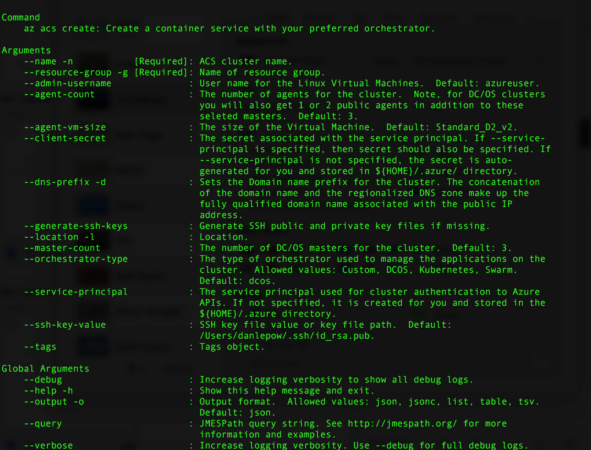

# <a name="deploy-a-docker-container-hosting-solution-using-hello-azure-cli-20"></a><span data-ttu-id="fb3e0-103">호스팅 솔루션 hello Azure CLI 2.0을 사용 하 여 Docker 컨테이너 배포</span><span class="sxs-lookup"><span data-stu-id="fb3e0-103">Deploy a Docker container hosting solution using hello Azure CLI 2.0</span></span>

<span data-ttu-id="fb3e0-104">사용 하 여 hello `az acs` hello Azure CLI 2.0 toocreate 명령과 Azure 컨테이너 서비스에서 클러스터를 관리 합니다.</span><span class="sxs-lookup"><span data-stu-id="fb3e0-104">Use hello `az acs` commands in hello Azure CLI 2.0 toocreate and manage clusters in Azure Container Service.</span></span> <span data-ttu-id="fb3e0-105">Hello를 사용 하 여 Azure 컨테이너 서비스 클러스터를 배포할 수도 [Azure 포털](container-service-deployment.md) 또는 Azure 컨테이너 서비스 Api를 환영 합니다.</span><span class="sxs-lookup"><span data-stu-id="fb3e0-105">You can also deploy an Azure Container Service cluster by using hello [Azure portal](container-service-deployment.md) or hello Azure Container Service APIs.</span></span>

<span data-ttu-id="fb3e0-106">에 대 한 도움말 `az acs` 명령을 전달 hello `-h` tooany 명령 매개 변수입니다.</span><span class="sxs-lookup"><span data-stu-id="fb3e0-106">For help on `az acs` commands, pass hello `-h` parameter tooany command.</span></span> <span data-ttu-id="fb3e0-107">예: `az acs create -h`</span><span class="sxs-lookup"><span data-stu-id="fb3e0-107">For example: `az acs create -h`.</span></span>


## <a name="prerequisites"></a><span data-ttu-id="fb3e0-108">필수 조건</span><span class="sxs-lookup"><span data-stu-id="fb3e0-108">Prerequisites</span></span>
<span data-ttu-id="fb3e0-109">사용 하 여 Azure 컨테이너 서비스 클러스터 toocreate hello Azure CLI 2.0를 수행 해야 합니다.</span><span class="sxs-lookup"><span data-stu-id="fb3e0-109">toocreate an Azure Container Service cluster using hello Azure CLI 2.0, you must:</span></span>
* <span data-ttu-id="fb3e0-110">Azure 계정([무료 평가판 받기](https://azure.microsoft.com/pricing/free-trial/))이 있어야 합니다.</span><span class="sxs-lookup"><span data-stu-id="fb3e0-110">have an Azure account ([get a free trial](https://azure.microsoft.com/pricing/free-trial/))</span></span>
* <span data-ttu-id="fb3e0-111">설치 하 고 hello 설정 [Azure CLI 2.0](/cli/azure/install-az-cli2)</span><span class="sxs-lookup"><span data-stu-id="fb3e0-111">have installed and set up hello [Azure CLI 2.0](/cli/azure/install-az-cli2)</span></span>

## <a name="get-started"></a><span data-ttu-id="fb3e0-112">시작</span><span class="sxs-lookup"><span data-stu-id="fb3e0-112">Get started</span></span> 
### <a name="log-in-tooyour-account"></a><span data-ttu-id="fb3e0-113">Tooyour 계정에 로그인</span><span class="sxs-lookup"><span data-stu-id="fb3e0-113">Log in tooyour account</span></span>
```azurecli
az login 
```

<span data-ttu-id="fb3e0-114">에 표시 되는 메시지 toolog hello를 대화형으로 수행 합니다.</span><span class="sxs-lookup"><span data-stu-id="fb3e0-114">Follow hello prompts toolog in interactively.</span></span> <span data-ttu-id="fb3e0-115">다른 메서드 toolog를 참조 하십시오. [Azure CLI 2.0 시작](/cli/azure/get-started-with-az-cli2)합니다.</span><span class="sxs-lookup"><span data-stu-id="fb3e0-115">For other methods toolog in, see [Get started with Azure CLI 2.0](/cli/azure/get-started-with-az-cli2).</span></span>

### <a name="set-your-azure-subscription"></a><span data-ttu-id="fb3e0-116">Azure 구독 설정</span><span class="sxs-lookup"><span data-stu-id="fb3e0-116">Set your Azure subscription</span></span>

<span data-ttu-id="fb3e0-117">Azure 구독이 여러 개 있는 경우 hello 기본 구독을 설정 합니다.</span><span class="sxs-lookup"><span data-stu-id="fb3e0-117">If you have more than one Azure subscription, set hello default subscription.</span></span> <span data-ttu-id="fb3e0-118">예:</span><span class="sxs-lookup"><span data-stu-id="fb3e0-118">For example:</span></span>

```
az account set --subscription "f66xxxxx-xxxx-xxxx-xxx-zgxxxx33cha5"
```


### <a name="create-a-resource-group"></a><span data-ttu-id="fb3e0-119">리소스 그룹 만들기</span><span class="sxs-lookup"><span data-stu-id="fb3e0-119">Create a resource group</span></span>
<span data-ttu-id="fb3e0-120">모든 클러스터에 대한 리소스 그룹을 만드는 것이 좋습니다.</span><span class="sxs-lookup"><span data-stu-id="fb3e0-120">We recommend that you create a resource group for every cluster.</span></span> <span data-ttu-id="fb3e0-121">Azure Container Service가 [사용 가능](https://azure.microsoft.com/en-us/regions/services/)한 Azure 지역을 지정합니다.</span><span class="sxs-lookup"><span data-stu-id="fb3e0-121">Specify an Azure region in which Azure Container Service is [available](https://azure.microsoft.com/en-us/regions/services/).</span></span> <span data-ttu-id="fb3e0-122">예:</span><span class="sxs-lookup"><span data-stu-id="fb3e0-122">For example:</span></span>

```azurecli
az group create -n acsrg1 -l "westus"
```
<span data-ttu-id="fb3e0-123">출력은 toohello 다음과 유사 합니다.</span><span class="sxs-lookup"><span data-stu-id="fb3e0-123">Output is similar toohello following:</span></span>


## <a name="create-an-azure-container-service-cluster"></a><span data-ttu-id="fb3e0-125">Azure Container Service 클러스터 만들기</span><span class="sxs-lookup"><span data-stu-id="fb3e0-125">Create an Azure Container Service cluster</span></span>

<span data-ttu-id="fb3e0-126">toocreate 클러스터를 사용 하 여 `az acs create`합니다.</span><span class="sxs-lookup"><span data-stu-id="fb3e0-126">toocreate a cluster, use `az acs create`.</span></span>
<span data-ttu-id="fb3e0-127">Hello 클러스터에 대 한 이름 및 hello 이전 단계에서 만든 hello 리소스 그룹의 hello 이름을 필수 매개 변수.</span><span class="sxs-lookup"><span data-stu-id="fb3e0-127">A name for hello cluster and hello name of hello resource group created in hello previous step are mandatory parameters.</span></span> 

<span data-ttu-id="fb3e0-128">다른 입력 집합 toodefault 값 (hello 화면에 다음 참조)은 해당 해당 스위치를 사용 하 여 덮어쓰지 않는 경우.</span><span class="sxs-lookup"><span data-stu-id="fb3e0-128">Other inputs are set toodefault values (see hello following screen) unless overwritten using their respective switches.</span></span> <span data-ttu-id="fb3e0-129">예를 들어 hello orchestrator tooDC/OS 기본으로 설정 됩니다.</span><span class="sxs-lookup"><span data-stu-id="fb3e0-129">For example, hello orchestrator is set by default tooDC/OS.</span></span> <span data-ttu-id="fb3e0-130">고 하나를 지정 하지 않으면, DNS 이름 접두사 hello 클러스터 이름에 따라 생성 됩니다.</span><span class="sxs-lookup"><span data-stu-id="fb3e0-130">And if you don't specify one, a DNS name prefix is created based on hello cluster name.</span></span>




### <a name="quick-acs-create-using-defaults"></a><span data-ttu-id="fb3e0-132">기본값을 사용하는 빠른 `acs create`</span><span class="sxs-lookup"><span data-stu-id="fb3e0-132">Quick `acs create` using defaults</span></span>
<span data-ttu-id="fb3e0-133">SSH RSA 공개 키 파일을 설정한 경우 `id_rsa.pub` hello 기본 위치에 (또는 생성에 대 한 [Osx 및 Linux](../../virtual-machines/linux/mac-create-ssh-keys.md) 또는 [Windows](../../virtual-machines/linux/ssh-from-windows.md)), hello 다음과 같은 명령을 사용 하 여:</span><span class="sxs-lookup"><span data-stu-id="fb3e0-133">If you have an SSH RSA public key file `id_rsa.pub` in hello default location (or created one for [OS X and Linux](../../virtual-machines/linux/mac-create-ssh-keys.md) or [Windows](../../virtual-machines/linux/ssh-from-windows.md)), use a command like hello following:</span></span>

```azurecli
az acs create -n acs-cluster -g acsrg1 -d applink789
```
<span data-ttu-id="fb3e0-134">SSH 공용 키가 없는 경우 다음 두 번째 명령을 사용합니다.</span><span class="sxs-lookup"><span data-stu-id="fb3e0-134">If you don't have an SSH public key, use this second command.</span></span> <span data-ttu-id="fb3e0-135">이 명령은 hello로 `--generate-ssh-keys` 스위치에서 만들어집니다.</span><span class="sxs-lookup"><span data-stu-id="fb3e0-135">This command with hello `--generate-ssh-keys` switch creates one for you.</span></span>

```azurecli
az acs create -n acs-cluster -g acsrg1 -d applink789 --generate-ssh-keys
```

<span data-ttu-id="fb3e0-136">Hello 명령을 입력 하면 hello 클러스터 toobe 생성 될 때까지 10 분 정도 기다립니다.</span><span class="sxs-lookup"><span data-stu-id="fb3e0-136">After you enter hello command, wait for about 10 minutes for hello cluster toobe created.</span></span> <span data-ttu-id="fb3e0-137">hello 명령 출력의 hello 마스터 및 에이전트 노드 및는 SSH 명령 tooconnect toohello 첫 번째 마스터 정규화 된 도메인 이름 (Fqdn)을 포함합니다.</span><span class="sxs-lookup"><span data-stu-id="fb3e0-137">hello command output includes fully qualified domain names (FQDNs) of hello master and agent nodes and an SSH command tooconnect toohello first master.</span></span> <span data-ttu-id="fb3e0-138">다음은 축약된 출력입니다.</span><span class="sxs-lookup"><span data-stu-id="fb3e0-138">Here is abbreviated output:</span></span>


> [!TIP]
> <span data-ttu-id="fb3e0-140">hello [Kubernetes 연습](../kubernetes/container-service-kubernetes-walkthrough.md) 표시 방법을 toouse `az acs create` 기본 값 toocreate는 Kubernetes 클러스터 합니다.</span><span class="sxs-lookup"><span data-stu-id="fb3e0-140">hello [Kubernetes walkthrough](../kubernetes/container-service-kubernetes-walkthrough.md) shows how toouse `az acs create` with default values toocreate a Kubernetes cluster.</span></span>
>

## <a name="manage-acs-clusters"></a><span data-ttu-id="fb3e0-141">ACS 클러스터 관리</span><span class="sxs-lookup"><span data-stu-id="fb3e0-141">Manage ACS clusters</span></span>

<span data-ttu-id="fb3e0-142">사용 하 여 추가 `az acs` toomanage 클러스터 명령입니다.</span><span class="sxs-lookup"><span data-stu-id="fb3e0-142">Use additional `az acs` commands toomanage your cluster.</span></span> <span data-ttu-id="fb3e0-143">다음은 몇 가지 예제입니다.</span><span class="sxs-lookup"><span data-stu-id="fb3e0-143">Here are some examples.</span></span>

### <a name="list-clusters-under-a-subscription"></a><span data-ttu-id="fb3e0-144">구독 아래에 클러스터 나열</span><span class="sxs-lookup"><span data-stu-id="fb3e0-144">List clusters under a subscription</span></span>

```azurecli
az acs list --output table
```

### <a name="list-clusters-in-a-resource-group"></a><span data-ttu-id="fb3e0-145">리소스 그룹의 클러스터 나열</span><span class="sxs-lookup"><span data-stu-id="fb3e0-145">List clusters in a resource group</span></span>

```azurecli
az acs list -g acsrg1 --output table
```


### <a name="display-details-of-a-container-service-cluster"></a><span data-ttu-id="fb3e0-147">컨테이너 서비스 클러스터 세부 정보 표시</span><span class="sxs-lookup"><span data-stu-id="fb3e0-147">Display details of a container service cluster</span></span>

```azurecli
az acs show -g acsrg1 -n acs-cluster --output list
```


### <a name="scale-hello-cluster"></a><span data-ttu-id="fb3e0-149">배율 hello 클러스터</span><span class="sxs-lookup"><span data-stu-id="fb3e0-149">Scale hello cluster</span></span>
<span data-ttu-id="fb3e0-150">에이전트 노드의 확장 및 축소가 모두 허용됩니다.</span><span class="sxs-lookup"><span data-stu-id="fb3e0-150">Both scaling in and scaling out of agent nodes are allowed.</span></span> <span data-ttu-id="fb3e0-151">매개 변수를 hello `new-agent-count` hello 새 hello ACS 클러스터의 에이전트 수입니다.</span><span class="sxs-lookup"><span data-stu-id="fb3e0-151">hello parameter `new-agent-count` is hello new number of agents in hello ACS cluster.</span></span>

```azurecli
az acs scale -g acsrg1 -n acs-cluster --new-agent-count 4
```


## <a name="delete-a-container-service-cluster"></a><span data-ttu-id="fb3e0-153">컨테이너 서비스 클러스터 삭제</span><span class="sxs-lookup"><span data-stu-id="fb3e0-153">Delete a container service cluster</span></span>
```azurecli
az acs delete -g acsrg1 -n acs-cluster 
```
<span data-ttu-id="fb3e0-154">이 명령은 생성 된 모든 리소스 (네트워크 및 저장소) hello 컨테이너 서비스를 만드는 동안 삭제 되지 않습니다.</span><span class="sxs-lookup"><span data-stu-id="fb3e0-154">This command does not delete all resources (network and storage) created while creating hello container service.</span></span> <span data-ttu-id="fb3e0-155">toodelete 모든 리소스를 쉽게 것이 좋습니다 고유한 리소스 그룹의 각 클러스터를 배포 합니다.</span><span class="sxs-lookup"><span data-stu-id="fb3e0-155">toodelete all resources easily, it is recommended you deploy each cluster in a distinct resource group.</span></span> <span data-ttu-id="fb3e0-156">그런 다음 hello 클러스터는 더 이상 필요 하면 hello 리소스 그룹을 삭제 합니다.</span><span class="sxs-lookup"><span data-stu-id="fb3e0-156">Then, delete hello resource group when hello cluster is no longer required.</span></span>

## <a name="next-steps"></a><span data-ttu-id="fb3e0-157">다음 단계</span><span class="sxs-lookup"><span data-stu-id="fb3e0-157">Next steps</span></span>
<span data-ttu-id="fb3e0-158">이제 클러스터가 작동하기 시작했으니 연결 및 관리 정보는 다음 문서를 참조하세요.</span><span class="sxs-lookup"><span data-stu-id="fb3e0-158">Now that you have a functioning cluster, see these documents for connection and management details:</span></span>

* [<span data-ttu-id="fb3e0-159">Tooan Azure 컨테이너 서비스 클러스터에 연결</span><span class="sxs-lookup"><span data-stu-id="fb3e0-159">Connect tooan Azure Container Service cluster</span></span>](../container-service-connect.md)
* [<span data-ttu-id="fb3e0-160">Azure 컨테이너 서비스 및 DC/OS로 작업</span><span class="sxs-lookup"><span data-stu-id="fb3e0-160">Work with Azure Container Service and DC/OS</span></span>](container-service-mesos-marathon-rest.md)
* [<span data-ttu-id="fb3e0-161">Azure 컨테이너 서비스 및 Docker Swarm으로 작업</span><span class="sxs-lookup"><span data-stu-id="fb3e0-161">Work with Azure Container Service and Docker Swarm</span></span>](container-service-docker-swarm.md)
* [<span data-ttu-id="fb3e0-162">Azure Container Service 및 Kubernetes로 작업</span><span class="sxs-lookup"><span data-stu-id="fb3e0-162">Work with Azure Container Service and Kubernetes</span></span>](../kubernetes/container-service-kubernetes-walkthrough.md)