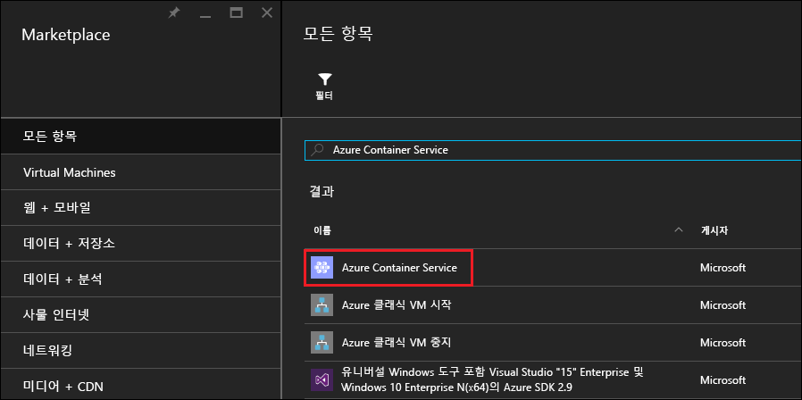
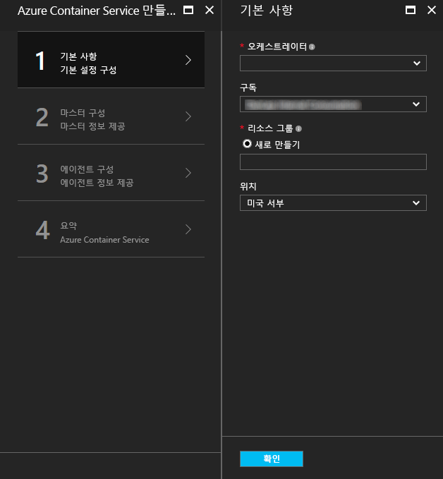
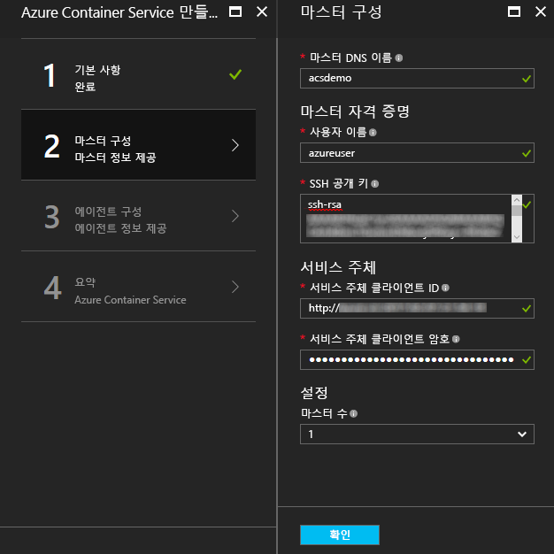
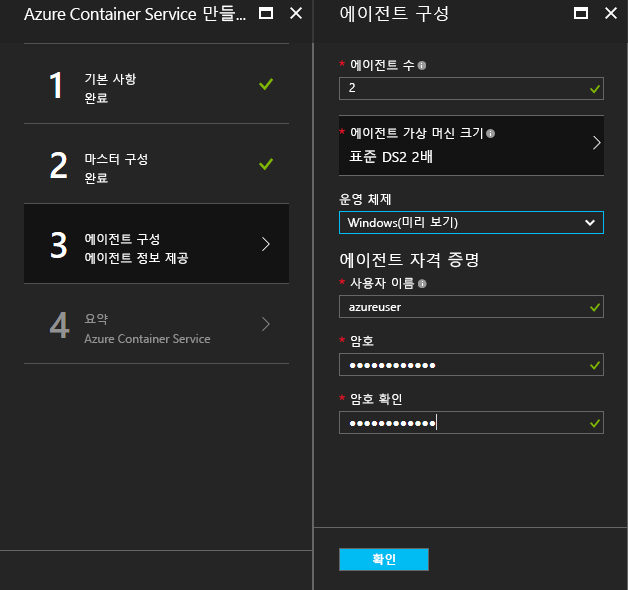
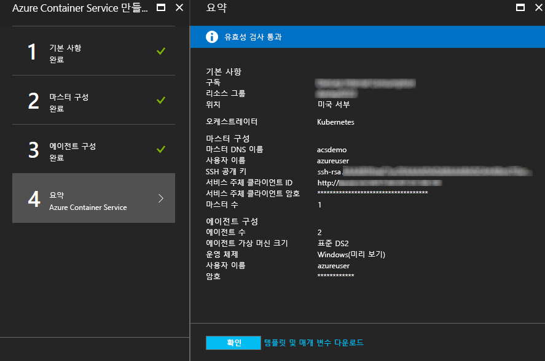
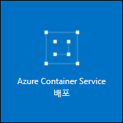

# <a name="deploy-a-docker-container-hosting-solution-using-the-azure-portal"></a><span data-ttu-id="90708-104">Azure Portal을 사용하여 Docker 컨테이너 호스팅 솔루션 배포</span><span class="sxs-lookup"><span data-stu-id="90708-104">Deploy a Docker container hosting solution using the Azure portal</span></span>


<span data-ttu-id="90708-105">Azure 컨테이너 서비스는 인기 있는 오픈 소스 컨테이너 클러스터링 및 오케스트레이션 솔루션의 신속한 배포를 제공합니다.</span><span class="sxs-lookup"><span data-stu-id="90708-105">Azure Container Service provides rapid deployment of popular open-source container clustering and orchestration solutions.</span></span> <span data-ttu-id="90708-106">이 문서에서는 Azure portal 또는 Azure Resource Manager 빠른 시작 템플릿을 사용하여 Azure Container Service 클러스터를 배포하는 방법을 안내합니다.</span><span class="sxs-lookup"><span data-stu-id="90708-106">This document walks you through deploying an Azure Container Service cluster by using the Azure portal or an Azure Resource Manager quickstart template.</span></span> 

<span data-ttu-id="90708-107">[Azure CLI 2.0](container-service-create-acs-cluster-cli.md) 또는 Azure Container Service API를 사용하여 Azure Container Service 클러스터를 배포할 수도 있습니다.</span><span class="sxs-lookup"><span data-stu-id="90708-107">You can also deploy an Azure Container Service cluster by using the [Azure CLI 2.0](container-service-create-acs-cluster-cli.md) or the Azure Container Service APIs.</span></span>

<span data-ttu-id="90708-108">배경 지식은 [Azure Container Service 소개](../container-service-intro.md)를 참조하세요.</span><span class="sxs-lookup"><span data-stu-id="90708-108">For background, see [Azure Container Service introduction](../container-service-intro.md).</span></span>


## <a name="prerequisites"></a><span data-ttu-id="90708-109">필수 조건</span><span class="sxs-lookup"><span data-stu-id="90708-109">Prerequisites</span></span>

* <span data-ttu-id="90708-110">**Azure 구독**: 없는 경우 지금 [무료 평가판](http://azure.microsoft.com/pricing/free-trial/?WT.mc_id=AA4C1C935)에 등록하세요.</span><span class="sxs-lookup"><span data-stu-id="90708-110">**Azure subscription**: If you don't have one, sign up for a [free trial](http://azure.microsoft.com/pricing/free-trial/?WT.mc_id=AA4C1C935).</span></span> <span data-ttu-id="90708-111">대규모 클러스터의 경우, 종량제 구독이나 다른 구매 옵션을 고려하세요.</span><span class="sxs-lookup"><span data-stu-id="90708-111">For a larger cluster, consider a pay-as-you go subscription or other purchase options.</span></span>

    > [!NOTE]
    > <span data-ttu-id="90708-112">Azure 구독 사용량 및 [리소스 할당량](../../azure-subscription-service-limits.md)(예: 코어 할당량)으로 배포하는 클러스터 크기를 제한할 수 있습니다.</span><span class="sxs-lookup"><span data-stu-id="90708-112">Your Azure subscription usage and [resource quotas](../../azure-subscription-service-limits.md), such as cores quotas, can limit the size of the cluster you deploy.</span></span> <span data-ttu-id="90708-113">할당량 증가를 요청하려면 추가 비용 없이 [온라인 고객 지원 요청](../../azure-supportability/how-to-create-azure-support-request.md)을 개설합니다.</span><span class="sxs-lookup"><span data-stu-id="90708-113">To request a quota increase, open an [online customer support request](../../azure-supportability/how-to-create-azure-support-request.md) at no charge.</span></span>
    >

* <span data-ttu-id="90708-114">**SSH RSA 공개 키**: 포털 또는 Azure 빠른 시작 템플릿 중 하나를 통해 배포하는 경우 Azure Container Service 가상 컴퓨터에 대한 인증을 위해 공개 키를 제공해야 합니다.</span><span class="sxs-lookup"><span data-stu-id="90708-114">**SSH RSA public key**: When deploying through the portal or one of the Azure quickstart templates, you need to provide the public key for authentication against Azure Container Service virtual machines.</span></span> <span data-ttu-id="90708-115">SSH(보안 셸) RSA 키를 만들려면 [OS X 및 Linux](../../virtual-machines/linux/mac-create-ssh-keys.md) 또는 [Windows](../../virtual-machines/linux/ssh-from-windows.md) 지침을 참조하세요.</span><span class="sxs-lookup"><span data-stu-id="90708-115">To create Secure Shell (SSH) RSA keys, see the [OS X and Linux](../../virtual-machines/linux/mac-create-ssh-keys.md) or [Windows](../../virtual-machines/linux/ssh-from-windows.md) guidance.</span></span> 

* <span data-ttu-id="90708-116">**서비스 주체 클라이언트 ID 및 비밀**(Kubernetes에만 해당): Azure Active Directory 서비스 주체 만들기에 대한 정보 및 지침은 [Kubernetes 클러스터에 대한 서비스 주체 정보](../kubernetes/container-service-kubernetes-service-principal.md)를 참조하세요.</span><span class="sxs-lookup"><span data-stu-id="90708-116">**Service principal client ID and secret** (Kubernetes only): For more information and guidance to create an Azure Active Directory service principal, see [About the service principal for a Kubernetes cluster](../kubernetes/container-service-kubernetes-service-principal.md).</span></span>


## <a name="create-a-cluster-by-using-the-azure-portal"></a><span data-ttu-id="90708-117">Azure Portal을 사용하여 클러스터 만들기</span><span class="sxs-lookup"><span data-stu-id="90708-117">Create a cluster by using the Azure portal</span></span>
1. <span data-ttu-id="90708-118">Azure Portal에 로그인하여 **새로 만들기**를 선택하고 Azure Marketplace에서 **Azure Container Service**를 검색합니다.</span><span class="sxs-lookup"><span data-stu-id="90708-118">Sign in to the Azure portal, select **New**, and search the Azure Marketplace for **Azure Container Service**.</span></span>

      <br />

2. <span data-ttu-id="90708-120">**Azure Container Service**를 클릭하고 **만들기**를 클릭합니다.</span><span class="sxs-lookup"><span data-stu-id="90708-120">Click **Azure Container Service**, and click **Create**.</span></span>

3. <span data-ttu-id="90708-121">**기본** 블레이드에서 다음 정보를 입력합니다.</span><span class="sxs-lookup"><span data-stu-id="90708-121">On the **Basics** blade, enter the following information:</span></span>

    * <span data-ttu-id="90708-122">**Orchestrator**: 클러스터에 배포할 컨테이너 또는 Orchestrator 중 하나를 선택합니다.</span><span class="sxs-lookup"><span data-stu-id="90708-122">**Orchestrator**: Select one of the container orchestrators to deploy on the cluster.</span></span>
        * <span data-ttu-id="90708-123">**DC/OS**: DC/OS 클러스터를 배포합니다.</span><span class="sxs-lookup"><span data-stu-id="90708-123">**DC/OS**: Deploys a DC/OS cluster.</span></span>
        * <span data-ttu-id="90708-124">**Swarm**: Docker Swarm 클러스터를 배포합니다.</span><span class="sxs-lookup"><span data-stu-id="90708-124">**Swarm**: Deploys a Docker Swarm cluster.</span></span>
        * <span data-ttu-id="90708-125">**Kubernetes**: Kubernetes 클러스터를 배포합니다.</span><span class="sxs-lookup"><span data-stu-id="90708-125">**Kubernetes**: Deploys a Kubernetes cluster.</span></span>
    * <span data-ttu-id="90708-126">**구독**: Azure 구독을 선택합니다.</span><span class="sxs-lookup"><span data-stu-id="90708-126">**Subscription**: Select an Azure subscription.</span></span>
    * <span data-ttu-id="90708-127">**리소스 그룹**: 배포를 위해 새 리소스 그룹의 이름을 입력합니다.</span><span class="sxs-lookup"><span data-stu-id="90708-127">**Resource group**: Enter the name of a new resource group for the deployment.</span></span>
    * <span data-ttu-id="90708-128">**위치**: Azure 컨테이너 서비스 배포를 위한 Azure 지역을 선택합니다.</span><span class="sxs-lookup"><span data-stu-id="90708-128">**Location**: Select an Azure region for the Azure Container Service deployment.</span></span> <span data-ttu-id="90708-129">가용성은 [지역별 사용 가능한 제품](https://azure.microsoft.com/regions/services/)을 참조하세요.</span><span class="sxs-lookup"><span data-stu-id="90708-129">For availability, check [Products available by region](https://azure.microsoft.com/regions/services/).</span></span>
    
      <br />
    
    <span data-ttu-id="90708-131">진행할 준비가 되면 **확인** 을 클릭합니다.</span><span class="sxs-lookup"><span data-stu-id="90708-131">Click **OK** when you're ready to proceed.</span></span>

4. <span data-ttu-id="90708-132">**마스터 구성** 블레이드에서 Linux 마스터 노드 또는 클러스터의 노드(일부 설정은 각 orchestrator만 해당됨)에 대한 다음 설정을 입력합니다.</span><span class="sxs-lookup"><span data-stu-id="90708-132">On the **Master configuration** blade, enter the following settings for the Linux master node or nodes in the cluster (some settings are specific to each orchestrator):</span></span>

    * <span data-ttu-id="90708-133">**마스터 DNS 이름**: 마스터에 대한 고유의 FQDN(정규화된 도메인 이름)을 만드는 데 사용되는 접두사입니다.</span><span class="sxs-lookup"><span data-stu-id="90708-133">**Master DNS name**: The prefix used to create a unique fully qualified domain name (FQDN) for the master.</span></span> <span data-ttu-id="90708-134">마스터 FQDN은 *prefix*mgmt.*location*.cloudapp.azure.com 형식입니다.</span><span class="sxs-lookup"><span data-stu-id="90708-134">The master FQDN is of the form *prefix*mgmt.*location*.cloudapp.azure.com.</span></span>
    * <span data-ttu-id="90708-135">**사용자 이름**: 클러스터의 각 Linux 가상 컴퓨터에 있는 계정의 사용자 이름입니다.</span><span class="sxs-lookup"><span data-stu-id="90708-135">**User name**: The user name for an account on each of the Linux virtual machines in the cluster.</span></span>
    * <span data-ttu-id="90708-136">**SSH RSA 공개 키**: Linux 가상 컴퓨터에 대한 인증에 사용할 공개 키를 추가합니다.</span><span class="sxs-lookup"><span data-stu-id="90708-136">**SSH RSA public key**: Add the public key to be used for authentication against the Linux virtual machines.</span></span> <span data-ttu-id="90708-137">키에 줄 바꿈이 없고 `ssh-rsa` 접두사를 포함해야 합니다.</span><span class="sxs-lookup"><span data-stu-id="90708-137">It is important that this key contains no line breaks, and it includes the `ssh-rsa` prefix.</span></span> <span data-ttu-id="90708-138">`username@domain` 접미사는 선택 사항입니다.</span><span class="sxs-lookup"><span data-stu-id="90708-138">The `username@domain` postfix is optional.</span></span> <span data-ttu-id="90708-139">키는 **ssh-rsa AAAAB3Nz...<...>...UcyupgH azureuser@linuxvm**와 같은 형태여야 합니다.</span><span class="sxs-lookup"><span data-stu-id="90708-139">The key should look something like the following: **ssh-rsa AAAAB3Nz...<...>...UcyupgH azureuser@linuxvm**.</span></span> 
    * <span data-ttu-id="90708-140">**서비스 주체**: Kubernetes orchestrator를 선택한 경우 Azure Active Directory **서비스 주체 클라이언트 ID**(appId라고도 함) 및 **서비스 주체 클라이언트 비밀**(암호)을 입력합니다.</span><span class="sxs-lookup"><span data-stu-id="90708-140">**Service principal**: If you selected the Kubernetes orchestrator, enter an Azure Active Directory **Service principal client ID** (also called the appId) and **Service principal client secret** (password).</span></span> <span data-ttu-id="90708-141">자세한 내용은 [Kubernetes 클러스터의 서비스 주체 정보](../kubernetes/container-service-kubernetes-service-principal.md)를 참조하세요.</span><span class="sxs-lookup"><span data-stu-id="90708-141">For more information, see [About the service principal for a Kubernetes cluster](../kubernetes/container-service-kubernetes-service-principal.md).</span></span>
    * <span data-ttu-id="90708-142">**마스터 수**: 클러스터의 마스터 수입니다.</span><span class="sxs-lookup"><span data-stu-id="90708-142">**Master count**: The number of masters in the cluster.</span></span>
    * <span data-ttu-id="90708-143">**VM 진단**: 일부 orchestrator의 경우 마스터에서 VM 진단을 활성화하도록 선택할 수 있습니다.</span><span class="sxs-lookup"><span data-stu-id="90708-143">**VM diagnostics**: For some orchestrators, you can enable VM diagnostics on the masters.</span></span>

      <br />

    <span data-ttu-id="90708-145">진행할 준비가 되면 **확인** 을 클릭합니다.</span><span class="sxs-lookup"><span data-stu-id="90708-145">Click **OK** when you're ready to proceed.</span></span>

5. <span data-ttu-id="90708-146">**에이전트 구성** 블레이드에서 다음 정보를 입력합니다.</span><span class="sxs-lookup"><span data-stu-id="90708-146">On the **Agent configuration** blade, enter the following information:</span></span>

    * <span data-ttu-id="90708-147">**에이전트 수**: Docker Swarm 및 Kubernetes의 경우, 이 값은 에이전트 크기 집합의 초기 에이전트 수입니다.</span><span class="sxs-lookup"><span data-stu-id="90708-147">**Agent count**: For Docker Swarm and Kubernetes, this value is the initial number of agents in the agent scale set.</span></span> <span data-ttu-id="90708-148">DC/OS의 경우, 사설 규모 집합의 초기 에이전트 수입니다.</span><span class="sxs-lookup"><span data-stu-id="90708-148">For DC/OS, it is the initial number of agents in a private scale set.</span></span> <span data-ttu-id="90708-149">또한, 사전에 지정된 수의 에이전트를 포함하는 DC/OS에 대한 공개 규모 집합이 생성됩니다.</span><span class="sxs-lookup"><span data-stu-id="90708-149">Additionally, a public scale set is created for DC/OS, which contains a predetermined number of agents.</span></span> <span data-ttu-id="90708-150">이 공용 크기 집합의 에이전트 수는 클러스터의 마스터 수에 의해 결정됩니다. 마스터 하나에 대해 공용 에이전트 하나이고, 마스터 셋 또는 다섯에 대해 공용 에이전트는 둘 입니다.</span><span class="sxs-lookup"><span data-stu-id="90708-150">The number of agents in this public scale set is determined by the number of masters in the cluster: one public agent for one master, and two public agents for three or five masters.</span></span>
    * <span data-ttu-id="90708-151">**에이전트 가상 컴퓨터 크기**: 에이전트 가상 컴퓨터의 크기입니다.</span><span class="sxs-lookup"><span data-stu-id="90708-151">**Agent virtual machine size**: The size of the agent virtual machines.</span></span>
    * <span data-ttu-id="90708-152">**운영 체제**: 이 설정은 현재 Kubernetes orchestrator를 선택한 경우에만 사용할 수 있습니다.</span><span class="sxs-lookup"><span data-stu-id="90708-152">**Operating system**: This setting is currently available only if you selected the Kubernetes orchestrator.</span></span> <span data-ttu-id="90708-153">에이전트에서 실행하려면 Linux 배포 또는 Windows Server 운영 체제를 선택하세요.</span><span class="sxs-lookup"><span data-stu-id="90708-153">Choose either a Linux distribution or a Windows Server operating system to run on the agents.</span></span> <span data-ttu-id="90708-154">이 설정은 클러스터가 Linux 또는 Windows 컨테이너 앱을 실행할 수 있을지 여부를 결정합니다.</span><span class="sxs-lookup"><span data-stu-id="90708-154">This setting determines whether your cluster can run Linux or Windows container apps.</span></span> 

        > [!NOTE]
        > <span data-ttu-id="90708-155">Windows 컨테이너 지원은 Kubernetes 클러스터에 대해 미리 보기 상태입니다.</span><span class="sxs-lookup"><span data-stu-id="90708-155">Windows container support is in preview for Kubernetes clusters.</span></span> <span data-ttu-id="90708-156">DC/OS 및 Swarm 클러스터의 경우 현재 Linux 에이전트만 Azure Container Service에서 지원됩니다.</span><span class="sxs-lookup"><span data-stu-id="90708-156">On DC/OS and Swarm clusters, only Linux agents are currently supported in Azure Container Service.</span></span>

    * <span data-ttu-id="90708-157">**에이전트 자격 증명**: Windows 운영 체제를 선택한 경우 에이전트 VM에 대한 관리자의 **사용자 이름** 및 **암호**를 입력합니다.</span><span class="sxs-lookup"><span data-stu-id="90708-157">**Agent credentials**: If you selected the Windows operating system, enter an administrator **User name** and **Password** for the agent VMs.</span></span> 

      <br />

    <span data-ttu-id="90708-159">진행할 준비가 되면 **확인** 을 클릭합니다.</span><span class="sxs-lookup"><span data-stu-id="90708-159">Click **OK** when you're ready to proceed.</span></span>

6. <span data-ttu-id="90708-160">서비스 유효성 검사가 완료되면 **확인**을 클릭합니다.</span><span class="sxs-lookup"><span data-stu-id="90708-160">After service validation finishes, click **OK**.</span></span>

      <br />

7. <span data-ttu-id="90708-162">약관을 검토합니다.</span><span class="sxs-lookup"><span data-stu-id="90708-162">Review the terms.</span></span> <span data-ttu-id="90708-163">배포 프로세스를 시작하려면 **만들기**를 클릭합니다.</span><span class="sxs-lookup"><span data-stu-id="90708-163">To start the deployment process, click **Create**.</span></span>

    <span data-ttu-id="90708-164">Azure 포털에 배포를 고정하도록 선택한 경우 배포 상태를 볼 수 있습니다.</span><span class="sxs-lookup"><span data-stu-id="90708-164">If you've elected to pin the deployment to the Azure portal, you can see the deployment status.</span></span>

      <br />

<span data-ttu-id="90708-166">배포를 완료하려면 몇 분이 걸립니다.</span><span class="sxs-lookup"><span data-stu-id="90708-166">The deployment takes several minutes to complete.</span></span> <span data-ttu-id="90708-167">그런 다음 Azure Container Service 클러스터를 사용할 준비가 됩니다.</span><span class="sxs-lookup"><span data-stu-id="90708-167">Then, the Azure Container Service cluster is ready for use.</span></span>


## <a name="create-a-cluster-by-using-a-quickstart-template"></a><span data-ttu-id="90708-168">빠른 시작 템플릿을 사용하여 클러스터 만들기</span><span class="sxs-lookup"><span data-stu-id="90708-168">Create a cluster by using a quickstart template</span></span>
<span data-ttu-id="90708-169">Azure Container Service에서 클러스터를 배포하는 데 Azure 빠른 시작 템플릿을 사용할 수 있습니다.</span><span class="sxs-lookup"><span data-stu-id="90708-169">Azure quickstart templates are available to deploy a cluster in Azure Container Service.</span></span> <span data-ttu-id="90708-170">추가 또는 고급 Azure 구성을 포함하도록 제공된 빠른 시작 템플릿을 수정할 수 있습니다.</span><span class="sxs-lookup"><span data-stu-id="90708-170">The provided quickstart templates can be modified to include additional or advanced Azure configuration.</span></span> <span data-ttu-id="90708-171">Azure 빠른 시작 템플릿을 사용하여 Azure Container Service 클러스터를 만들려면 Azure 구독이 필요합니다.</span><span class="sxs-lookup"><span data-stu-id="90708-171">To create an Azure Container Service cluster by using an Azure quickstart template, you need an Azure subscription.</span></span> <span data-ttu-id="90708-172">없는 경우 [무료 평가판](http://azure.microsoft.com/pricing/free-trial/?WT.mc_id=AA4C1C935)에 등록하세요.</span><span class="sxs-lookup"><span data-stu-id="90708-172">If you don't have one, then sign up for a [free trial](http://azure.microsoft.com/pricing/free-trial/?WT.mc_id=AA4C1C935).</span></span> 

<span data-ttu-id="90708-173">템플릿 및 Azure CLI 2.0을 사용하여 클러스터를 배포하려면 다음 단계를 수행합니다([설치 및 설정 지침](/cli/azure/install-az-cli2) 참조).</span><span class="sxs-lookup"><span data-stu-id="90708-173">Follow these steps to deploy a cluster using a template and the Azure CLI 2.0 (see [installation and setup instructions](/cli/azure/install-az-cli2)).</span></span>

> [!NOTE] 
> <span data-ttu-id="90708-174">Windows 시스템의 경우 Azure PowerShell을 사용하여 템플릿을 배포하는 데 비슷한 단계를 사용할 수 있습니다.</span><span class="sxs-lookup"><span data-stu-id="90708-174">If you're on a Windows system, you can use similar steps to deploy a template using Azure PowerShell.</span></span> <span data-ttu-id="90708-175">이 섹션의 뒷부분에 나오는 단계를 참조하세요.</span><span class="sxs-lookup"><span data-stu-id="90708-175">See steps later in this section.</span></span> <span data-ttu-id="90708-176">[포털](../../azure-resource-manager/resource-group-template-deploy-portal.md) 또는 다른 방법을 통해 템플릿을 배포할 수도 있습니다.</span><span class="sxs-lookup"><span data-stu-id="90708-176">You can also deploy a template through the [portal](../../azure-resource-manager/resource-group-template-deploy-portal.md) or other methods.</span></span>

1. <span data-ttu-id="90708-177">DC/OS, Docker Swarm 또는 Kubernetes 클러스터를 배포하려면 GitHub에서 사용 가능한 빠른 시작 템플릿 중 하나를 선택합니다.</span><span class="sxs-lookup"><span data-stu-id="90708-177">To deploy a DC/OS, Docker Swarm, or Kubernetes cluster, select one of the available quickstart templates from GitHub.</span></span> <span data-ttu-id="90708-178">다음은 일부 목록입니다.</span><span class="sxs-lookup"><span data-stu-id="90708-178">A partial list follows.</span></span> <span data-ttu-id="90708-179">DC/OS 및 Swarm 템플릿은 기본 Orchestrator 선택을 제외하고 동일합니다.</span><span class="sxs-lookup"><span data-stu-id="90708-179">The DC/OS and Swarm templates are the same, except for the default orchestrator selection.</span></span>

    * [<span data-ttu-id="90708-180">DC/OS 템플릿</span><span class="sxs-lookup"><span data-stu-id="90708-180">DC/OS template</span></span>](https://github.com/Azure/azure-quickstart-templates/tree/master/101-acs-dcos)
    * [<span data-ttu-id="90708-181">Swarm 템플릿</span><span class="sxs-lookup"><span data-stu-id="90708-181">Swarm template</span></span>](https://github.com/Azure/azure-quickstart-templates/tree/master/101-acs-swarm)
    * [<span data-ttu-id="90708-182">Kubernetes 템플릿</span><span class="sxs-lookup"><span data-stu-id="90708-182">Kubernetes template</span></span>](https://github.com/Azure/azure-quickstart-templates/tree/master/101-acs-kubernetes)

2. <span data-ttu-id="90708-183">Azure 계정에 로그인하고(`az login`) Azure CLI가 Azure 구독에 연결되어 있는지 확인합니다.</span><span class="sxs-lookup"><span data-stu-id="90708-183">Log in to your Azure account (`az login`), and make sure that the Azure CLI is connected to your Azure subscription.</span></span> <span data-ttu-id="90708-184">다음 명령을 사용하여 기본 구독을 확인할 수 있습니다.</span><span class="sxs-lookup"><span data-stu-id="90708-184">You can see the default subscription by using the following command:</span></span>

    ```azurecli
    az account show
    ```
    
    <span data-ttu-id="90708-185">둘 이상의 구독이 있고 다른 기본 구독을 설정해야 하는 경우 `az account set --subscription`을 실행하고 구독 ID 또는 이름을 지정합니다.</span><span class="sxs-lookup"><span data-stu-id="90708-185">If you have more than one subscription and need to set a different default subscription, run `az account set --subscription` and specify the subscription ID or name.</span></span>

3. <span data-ttu-id="90708-186">모범 사례로 배포에 새 리소스 그룹을 사용합니다.</span><span class="sxs-lookup"><span data-stu-id="90708-186">As a best practice, use a new resource group for the deployment.</span></span> <span data-ttu-id="90708-187">리소스 그룹을 만들려면 `az group create` 명령을 사용하고 리소스 그룹 이름 및 위치를 지정합니다.</span><span class="sxs-lookup"><span data-stu-id="90708-187">To create a resource group, use the `az group create` command specify a resource group name and location:</span></span> 

    ```azurecli
    az group create --name "RESOURCE_GROUP" --location "LOCATION"
    ```

4. <span data-ttu-id="90708-188">필수 템플릿 매개 변수가 포함된 JSON 파일을 만듭니다.</span><span class="sxs-lookup"><span data-stu-id="90708-188">Create a JSON file containing the required template parameters.</span></span> <span data-ttu-id="90708-189">GitHub에서 Azure Container Service 템플릿 `azuredeploy.json`과 함께 제공되는 `azuredeploy.parameters.json`이라는 매개 변수 파일을 다운로드합니다.</span><span class="sxs-lookup"><span data-stu-id="90708-189">Download the parameters file named `azuredeploy.parameters.json` that accompanies the Azure Container Service template `azuredeploy.json` in GitHub.</span></span> <span data-ttu-id="90708-190">클러스터에 대한 필수 매개 변수 값을 입력합니다.</span><span class="sxs-lookup"><span data-stu-id="90708-190">Enter required parameter values for your cluster.</span></span> 

    <span data-ttu-id="90708-191">예를 들어 [DC/OS 템플릿](https://github.com/Azure/azure-quickstart-templates/tree/master/101-acs-dcos)을 사용하려면 `dnsNamePrefix` 및 `sshRSAPublicKey`에 대한 매개 변수 값을 제공합니다.</span><span class="sxs-lookup"><span data-stu-id="90708-191">For example, to use the [DC/OS template](https://github.com/Azure/azure-quickstart-templates/tree/master/101-acs-dcos), supply parameter values for `dnsNamePrefix` and `sshRSAPublicKey`.</span></span> <span data-ttu-id="90708-192">`azuredeploy.json`의 설명 및 다른 매개 변수에 대한 옵션을 참조하세요.</span><span class="sxs-lookup"><span data-stu-id="90708-192">See the descriptions in `azuredeploy.json` and options for other parameters.</span></span>  
 

5. <span data-ttu-id="90708-193">다음 명령을 사용하여 배포 매개 변수 파일을 전달하여 컨테이너 서비스 클러스터를 만듭니다. 다음과 같습니다.</span><span class="sxs-lookup"><span data-stu-id="90708-193">Create a Container Service cluster by passing the deployment parameters file with the following command, where:</span></span>

    * <span data-ttu-id="90708-194">**RESOURCE_GROUP**은 이전 단계에서 만든 리소스 그룹의 이름입니다.</span><span class="sxs-lookup"><span data-stu-id="90708-194">**RESOURCE_GROUP** is the name of the resource group that you created in the previous step.</span></span>
    * <span data-ttu-id="90708-195">**DEPLOYMENT_NAME**(선택 사항)은 배포에 제공한 이름입니다.</span><span class="sxs-lookup"><span data-stu-id="90708-195">**DEPLOYMENT_NAME** (optional) is a name you give to the deployment.</span></span>
    * <span data-ttu-id="90708-196">**TEMPLATE_URI**는 배포 파일 `azuredeploy.json`의 위치입니다.</span><span class="sxs-lookup"><span data-stu-id="90708-196">**TEMPLATE_URI** is the location of the deployment file `azuredeploy.json`.</span></span> <span data-ttu-id="90708-197">이 URI는 GitHub UI에 대한 포인터가 아닌 원시 파일이어야 합니다.</span><span class="sxs-lookup"><span data-stu-id="90708-197">This URI must be the Raw file, not a pointer to the GitHub UI.</span></span> <span data-ttu-id="90708-198">이 URI를 찾으려면 GitHub에서 `azuredeploy.json` 파일을 선택하고 **원시** 단추를 클릭합니다.</span><span class="sxs-lookup"><span data-stu-id="90708-198">To find this URI, select the `azuredeploy.json` file in GitHub, and click the **Raw** button.</span></span>  

    ```azurecli
    az group deployment create -g RESOURCE_GROUP -n DEPLOYMENT_NAME --template-uri TEMPLATE_URI --parameters @azuredeploy.parameters.json
    ```

    <span data-ttu-id="90708-199">또한 명령줄에서 JSON 형식 문자열로 매개 변수를 제공할 수도 있습니다.</span><span class="sxs-lookup"><span data-stu-id="90708-199">You can also provide parameters as a JSON-formatted string on the command line.</span></span> <span data-ttu-id="90708-200">다음과 유사한 명령을 사용합니다.</span><span class="sxs-lookup"><span data-stu-id="90708-200">Use a command similar to the following:</span></span>

    ```azurecli
    az group deployment create -g RESOURCE_GROUP -n DEPLOYMENT_NAME --template-uri TEMPLATE_URI --parameters "{ \"param1\": {\"value1\"} … }"
    ```

    > [!NOTE]
    > <span data-ttu-id="90708-201">배포를 완료하려면 몇 분이 걸립니다.</span><span class="sxs-lookup"><span data-stu-id="90708-201">The deployment takes several minutes to complete.</span></span>
    > 

### <a name="equivalent-powershell-commands"></a><span data-ttu-id="90708-202">동일한 PowerShell 명령</span><span class="sxs-lookup"><span data-stu-id="90708-202">Equivalent PowerShell commands</span></span>
<span data-ttu-id="90708-203">PowerShell 사용하여 Azure Container Service 클러스터 템플릿을 배포할 수도 있습니다.</span><span class="sxs-lookup"><span data-stu-id="90708-203">You can also deploy an Azure Container Service cluster template with PowerShell.</span></span> <span data-ttu-id="90708-204">이 문서는 [Azure PowerShell 모듈](https://azure.microsoft.com/blog/azps-1-0/)버전 1.0을 기반으로 합니다.</span><span class="sxs-lookup"><span data-stu-id="90708-204">This document is based on the version 1.0 [Azure PowerShell module](https://azure.microsoft.com/blog/azps-1-0/).</span></span>

1. <span data-ttu-id="90708-205">DC/OS, Docker Swarm 또는 Kubernetes 클러스터를 배포하려면 GitHub에서 사용 가능한 빠른 시작 템플릿 중 하나를 선택합니다.</span><span class="sxs-lookup"><span data-stu-id="90708-205">To deploy a DC/OS, Docker Swarm, or Kubernetes cluster, select one of the available quickstart templates from GitHub.</span></span> <span data-ttu-id="90708-206">다음은 일부 목록입니다.</span><span class="sxs-lookup"><span data-stu-id="90708-206">A partial list follows.</span></span> <span data-ttu-id="90708-207">DC/OS 및 Swarm 템플릿은 기본 Orchestrator 선택을 제외하고 동일합니다.</span><span class="sxs-lookup"><span data-stu-id="90708-207">Note that the DC/OS and Swarm templates are the same, with the exception of the default orchestrator selection.</span></span>

    * [<span data-ttu-id="90708-208">DC/OS 템플릿</span><span class="sxs-lookup"><span data-stu-id="90708-208">DC/OS template</span></span>](https://github.com/Azure/azure-quickstart-templates/tree/master/101-acs-dcos)
    * [<span data-ttu-id="90708-209">Swarm 템플릿</span><span class="sxs-lookup"><span data-stu-id="90708-209">Swarm template</span></span>](https://github.com/Azure/azure-quickstart-templates/tree/master/101-acs-swarm)
    * [<span data-ttu-id="90708-210">Kubernetes 템플릿</span><span class="sxs-lookup"><span data-stu-id="90708-210">Kubernetes template</span></span>](https://github.com/Azure/azure-quickstart-templates/tree/master/101-acs-kubernetes)

2. <span data-ttu-id="90708-211">Azure 구독에서 클러스터를 만들기 전에 PowerShell 세션이 Azure에 로그인했는지 확인합니다.</span><span class="sxs-lookup"><span data-stu-id="90708-211">Before creating a cluster in your Azure subscription, verify that your PowerShell session has been signed in to Azure.</span></span> <span data-ttu-id="90708-212">이렇게 하려면 `Get-AzureRMSubscription` 명령을 사용합니다.</span><span class="sxs-lookup"><span data-stu-id="90708-212">You can do this with the `Get-AzureRMSubscription` command:</span></span>

    ```powershell
    Get-AzureRmSubscription
    ```

3. <span data-ttu-id="90708-213">Azure에 로그인해야 할 경우는 `Login-AzureRMAccount` 명령을 사용합니다.</span><span class="sxs-lookup"><span data-stu-id="90708-213">If you need to sign in to Azure, use the `Login-AzureRMAccount` command:</span></span>

    ```powershell
    Login-AzureRmAccount
    ```

4. <span data-ttu-id="90708-214">모범 사례로 배포에 새 리소스 그룹을 사용합니다.</span><span class="sxs-lookup"><span data-stu-id="90708-214">As a best practice, use a new resource group for the deployment.</span></span> <span data-ttu-id="90708-215">리소스 그룹을 만들려면 `New-AzureRmResourceGroup` 명령을 사용하고 리소스 그룹 이름 및 대상 지역을 지정합니다.</span><span class="sxs-lookup"><span data-stu-id="90708-215">To create a resource group, use the `New-AzureRmResourceGroup` command, and specify a resource group name and destination region:</span></span>

    ```powershell
    New-AzureRmResourceGroup -Name GROUP_NAME -Location REGION
    ```

5. <span data-ttu-id="90708-216">리소스 그룹을 만든 후에는 다음 명령을 사용하여 클러스터를 만들 수 있습니다.</span><span class="sxs-lookup"><span data-stu-id="90708-216">After you create a resource group, you can create your cluster with the following command.</span></span> <span data-ttu-id="90708-217">원하는 템플릿의 URI는 `-TemplateUri` 매개 변수에 지정됩니다.</span><span class="sxs-lookup"><span data-stu-id="90708-217">The URI of the desired template is specified with the `-TemplateUri` parameter.</span></span> <span data-ttu-id="90708-218">이 명령을 실행하면 PowerShell에서 배포 매개 변수 값을 묻는 메시지가 표시됩니다.</span><span class="sxs-lookup"><span data-stu-id="90708-218">When you run this command, PowerShell prompts you for deployment parameter values.</span></span>

    ```powershell
    New-AzureRmResourceGroupDeployment -Name DEPLOYMENT_NAME -ResourceGroupName RESOURCE_GROUP_NAME -TemplateUri TEMPLATE_URI
    ```

#### <a name="provide-template-parameters"></a><span data-ttu-id="90708-219">템플릿 매개 변수 제공</span><span class="sxs-lookup"><span data-stu-id="90708-219">Provide template parameters</span></span>
<span data-ttu-id="90708-220">PowerShell에 익숙한 경우 빼기 기호(-)를 입력하고 TAB 키를 눌러 Cmdlet에 사용할 수 있는 매개 변수를 순환시켜 볼 수 있습니다.</span><span class="sxs-lookup"><span data-stu-id="90708-220">If you're familiar with PowerShell, you know that you can cycle through the available parameters for a cmdlet by typing a minus sign (-) and then pressing the TAB key.</span></span> <span data-ttu-id="90708-221">이 기능은 템플릿에 정의하는 매개 변수에 대해서도 작동합니다.</span><span class="sxs-lookup"><span data-stu-id="90708-221">This same functionality also works with parameters that you define in your template.</span></span> <span data-ttu-id="90708-222">템플릿 이름을 입력하자마자 cmdlet이 템플릿을 인출하고 매개 변수의 구문을 분석한 다음 템플릿 매개 변수를 명령에 동적으로 추가합니다.</span><span class="sxs-lookup"><span data-stu-id="90708-222">As soon as you type the template name, the cmdlet fetches the template, parses the parameters, and adds the template parameters to the command dynamically.</span></span> <span data-ttu-id="90708-223">따라서 템플릿 매개 변수 값을 쉽게 지정할 수 있습니다.</span><span class="sxs-lookup"><span data-stu-id="90708-223">This makes it easy to specify the template parameter values.</span></span> <span data-ttu-id="90708-224">필수 매개 변수 값을 잊은 경우 PowerShell이 값을 묻는 메시지를 표시합니다.</span><span class="sxs-lookup"><span data-stu-id="90708-224">And, if you forget a required parameter value, PowerShell prompts you for the value.</span></span>

<span data-ttu-id="90708-225">다음은 매개 변수가 포함된 전체 명령입니다.</span><span class="sxs-lookup"><span data-stu-id="90708-225">Here is the full command, with parameters included.</span></span> <span data-ttu-id="90708-226">리소스의 이름에 대한 고유한 값을 제공하세요.</span><span class="sxs-lookup"><span data-stu-id="90708-226">Provide your own values for the names of the resources.</span></span>

```powershell
New-AzureRmResourceGroupDeployment -ResourceGroupName RESOURCE_GROUP_NAME-TemplateURI TEMPLATE_URI -adminuser value1 -adminpassword value2 ....
```

## <a name="next-steps"></a><span data-ttu-id="90708-227">다음 단계</span><span class="sxs-lookup"><span data-stu-id="90708-227">Next steps</span></span>
<span data-ttu-id="90708-228">이제 클러스터가 작동하기 시작했으니 연결 및 관리 정보는 다음 문서를 참조하세요.</span><span class="sxs-lookup"><span data-stu-id="90708-228">Now that you have a functioning cluster, see these documents for connection and management details:</span></span>

* [<span data-ttu-id="90708-229">Azure 컨테이너 서비스 클러스터에 연결</span><span class="sxs-lookup"><span data-stu-id="90708-229">Connect to an Azure Container Service cluster</span></span>](../container-service-connect.md)
* [<span data-ttu-id="90708-230">Azure 컨테이너 서비스 및 DC/OS로 작업</span><span class="sxs-lookup"><span data-stu-id="90708-230">Work with Azure Container Service and DC/OS</span></span>](container-service-mesos-marathon-rest.md)
* [<span data-ttu-id="90708-231">Azure 컨테이너 서비스 및 Docker Swarm으로 작업</span><span class="sxs-lookup"><span data-stu-id="90708-231">Work with Azure Container Service and Docker Swarm</span></span>](container-service-docker-swarm.md)
* [<span data-ttu-id="90708-232">Azure Container Service 및 Kubernetes로 작업</span><span class="sxs-lookup"><span data-stu-id="90708-232">Work with Azure Container Service and Kubernetes</span></span>](../kubernetes/container-service-kubernetes-walkthrough.md)
