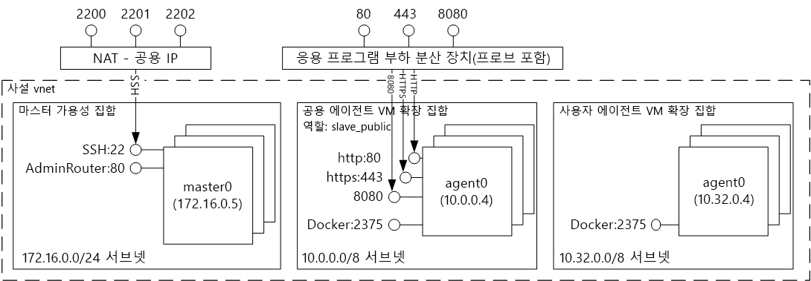
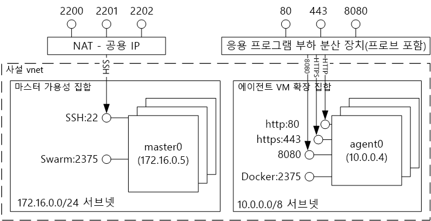
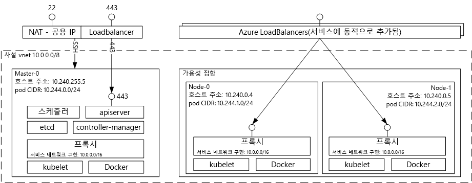

# Azure 컨테이너 서비스를 사용 하 여 솔루션을 호스팅 소개 tooDocker 컨테이너Introduction tooDocker container hosting solutions with Azure Container Service 
Azure 컨테이너 서비스 간단 하 게 드립니다 toocreate 구성 하 고 미리 구성 된 toorun 컨테이너 화 가능한 응용 프로그램이 있는 가상 컴퓨터의 클러스터를 관리 합니다.Azure Container Service makes it simpler for you toocreate, configure, and manage a cluster of virtual machines that are preconfigured toorun containerized applications. Azure 컨테이너 서비스는 일반적인 오픈 소스 예약 및 오케스트레이션 도구의 최적화된 구성을 사용합니다.It uses an optimized configuration of popular open-source scheduling and orchestration tools. Toouse 있습니다를 통해 기존 기술을 사용 하면이 커뮤니티 전문, toodeploy 크기가 크고 점점 본문에 대해 하 고 Microsoft Azure에서 컨테이너 기반 응용 프로그램을 관리 합니다.This enables you toouse your existing skills, or draw upon a large and growing body of community expertise, toodeploy and manage container-based applications on Microsoft Azure.

Azure 컨테이너 서비스는 hello Docker 컨테이너 형식 tooensure 응용 프로그램 컨테이너가 완전히 이식 가능를 활용 합니다.Azure Container Service leverages hello Docker container format tooensure that your application containers are fully portable. 또한 컨테이너의 이러한 응용 프로그램 toothousands 또는 짝수 수만 확장할 수 있도록 선택 하는 풀 마라톤 및 DC/OS, docker는 Docker Swarm 또는 Kubernetes 지원 합니다.It also supports your choice of Marathon and DC/OS, Docker Swarm, or Kubernetes so that you can scale these applications toothousands of containers, or even tens of thousands.

Azure 컨테이너 서비스를 사용 하면 응용 프로그램 이식성-hello 오케스트레이션 계층에서 이식성을 포함 하 여 그대로 유지 하면서 Azure의 엔터프라이즈급 기능을 걸릴 수 있습니다.By using Azure Container Service, you can take advantage of the enterprise-grade features of Azure, while still maintaining application portability--including portability at hello orchestration layers.

## Azure 컨테이너 서비스 사용Using Azure Container Service
Azure 컨테이너 서비스와 이러한 목표는 오픈 소스 도구와 기술을 담아 고객 사이에서 인기 오늘을 통해 tooprovide 컨테이너 호스팅 환경입니다.Our goal with Azure Container Service is tooprovide a container hosting environment by using open-source tools and technologies that are popular among our customers today. toothis 끝 (DC/OS, docker는 Docker Swarm 또는 Kubernetes) 하 여 선택한 orchestrator에 대 한 hello 표준 API 끝점 공개 했습니다.toothis end, we expose hello standard API endpoints for your chosen orchestrator (DC/OS, Docker Swarm, or Kubernetes). 이러한 끝점을 사용 하 여 toothose 끝점 통신의 대상이 될 수 있는 모든 소프트웨어를 활용할 수 있습니다.By using these endpoints, you can leverage any software that is capable of talking toothose endpoints. 예를 들어 hello docker는 Docker Swarm 끝점의 경우 hello toouse hello Docker CLI (명령줄 인터페이스)를 선택할 수 있습니다.For example, in hello case of hello Docker Swarm endpoint, you might choose toouse hello Docker command-line interface (CLI). DC/OS 용 hello DCOS CLI를 선택할 수 있습니다.For DC/OS, you might choose hello DCOS CLI. Kubernetes의 경우 `kubectl`을 선택할 수 있습니다.For Kubernetes, you might choose `kubectl`.

## Azure 컨테이너 서비스를 사용하여 Docker 클러스터 만들기Creating a Docker cluster by using Azure Container Service
Azure 컨테이너 서비스를 사용 하 여 toobegin hello 포털을 통해 Azure 컨테이너 서비스 클러스터를 배포할 (마켓플레이스 검색 hello에 대 한 **Azure 컨테이너 서비스**), Azure 리소스 관리자 템플릿을 사용 하 여 ([Docker Swarm](https://github.com/Azure/azure-quickstart-templates/tree/master/101-acs-swarm), [DC/OS](https://github.com/Azure/azure-quickstart-templates/tree/master/101-acs-dcos), 또는 [Kubernetes](https://github.com/Azure/azure-quickstart-templates/tree/master/101-acs-kubernetes)), 또는 hello로 [Azure CLI 2.0](container-service-create-acs-cluster-cli.md)합니다.toobegin using Azure Container Service, you deploy an Azure Container Service cluster via hello portal (search hello Marketplace for **Azure Container Service**), by using an Azure Resource Manager template ([Docker Swarm](https://github.com/Azure/azure-quickstart-templates/tree/master/101-acs-swarm), [DC/OS](https://github.com/Azure/azure-quickstart-templates/tree/master/101-acs-dcos), or [Kubernetes](https://github.com/Azure/azure-quickstart-templates/tree/master/101-acs-kubernetes)), or with hello [Azure CLI 2.0](container-service-create-acs-cluster-cli.md). hello 제공 퀵 스타트 서식 파일 수정된 tooinclude 추가 또는 고급 Azure 구성 될 수 있습니다.hello provided quickstart templates can be modified tooinclude additional or advanced Azure configuration. 자세한 내용은 [Azure Container Service 클러스터 배포](container-service-deployment.md)를 참조하세요.For more information, see [Deploy an Azure Container Service cluster](container-service-deployment.md).

## 응용 프로그램 배포Deploying an application
Azure Container Service는 오케스트레이션을 위해 Docker Swarm, DC/OS 또는 Kubernetes 옵션을 제공합니다.Azure Container Service provides a choice of Docker Swarm, DC/OS, or Kubernetes for orchestration. 응용 프로그램을 배포하는 방법은 선택한 Orchestrator에 따라 달라집니다.How you deploy your application depends on your choice of orchestrator.

### DC/OS 사용Using DC/OS
DC/OS는 hello Apache Mesos 분산된 시스템 커널 기반 운영 체제를 배포 합니다.DC/OS is a distributed operating system based on hello Apache Mesos distributed systems kernel. Apache Mesos hello Apache 소프트웨어 Foundation에 있는 컴퓨터의 목록과 hello 중 일부 [에서 가장 큰 이름을 IT](http://mesos.apache.org/documentation/latest/powered-by-mesos/) 사용자 및 참가자입니다.Apache Mesos is housed at hello Apache Software Foundation and lists some of hello [biggest names in IT](http://mesos.apache.org/documentation/latest/powered-by-mesos/) as users and contributors.

DC/OS 및 Apache Mesos는 다음과 같은 인상적인 기능 집합을 포함합니다.DC/OS and Apache Mesos include an impressive feature set:

* 입증된 확장성Proven scalability
* Apache ZooKeeper를 사용하는 내결함성 있는 복제된 마스터 및 슬레이브Fault-tolerant replicated master and slaves using Apache ZooKeeper
* Docker 형식의 컨테이너에 대한 지원Support for Docker-formatted containers
* Linux 컨테이너를 사용하여 작업 간에 네이티브 격리Native isolation between tasks with Linux containers
* 다중 리소스 예약(메모리, CPU, 디스크 및 포트)Multiresource scheduling (memory, CPU, disk, and ports)
* 새로운 병렬 응용 프로그램을 개발하기 위한 Java, Python 및 C++ APIJava, Python, and C++ APIs for developing new parallel applications
* 클러스터 상태를 볼 수 있는 웹 UIA web UI for viewing cluster state

Azure 컨테이너 서비스에서 실행 중인 DC/OS는 기본적으로 작업을 예약 하기 위한 hello 마라톤 오케스트레이션 플랫폼을 포함 됩니다.By default, DC/OS running on Azure Container Service includes hello Marathon orchestration platform for scheduling workloads. 그러나 hello ACS의 DC/OS 배포에 포함 된 hello Mesosphere Universe tooyour 서비스를 추가할 수 있는 서비스입니다.However, included with hello DC/OS deployment of ACS is hello Mesosphere Universe of services that can be added tooyour service. Hello Universe에서에서 서비스에는 Spark, Hadoop, Cassandra, 및 등 포함 됩니다.Services in hello Universe include Spark, Hadoop, Cassandra, and much more.

#### Marathon 사용Using Marathon
풀 마라톤은 클러스터 전체 init 및 cgroups-또는 hello 경우 Docker로 포맷 된 컨테이너 Azure 컨테이너 서비스의 서비스 제어 시스템입니다.Marathon is a cluster-wide init and control system for services in cgroups--or, in hello case of Azure Container Service, Docker-formatted containers. Marathon은 응용 프로그램을 배포할 수 있는 웹 UI를 제공합니다.Marathon provides a web UI from which you can deploy your applications. 사용자는 배포 시 DNS\_PREFIX 및 REGION이 모두 정의된 `http://DNS_PREFIX.REGION.cloudapp.azure.com`과 유사한 URL에서 웹 UI에 액세스할 수 있습니다.You can access this at a URL that looks something like `http://DNS_PREFIX.REGION.cloudapp.azure.com` where DNS\_PREFIX and REGION are both defined at deployment time. 물론, 사용자는 자체 DNS 이름을 제공할 수도 있습니다.Of course, you can also provide your own DNS name. Hello 마라톤 웹 UI를 사용 하 여 컨테이너의 실행에 대 한 자세한 내용은 참조 하십시오. [hello 마라톤 웹 UI 통해 DC/OS 컨테이너 관리](container-service-mesos-marathon-ui.md)합니다.For more information on running a container using hello Marathon web UI, see [DC/OS container management through hello Marathon web UI](container-service-mesos-marathon-ui.md).

또한 풀 마라톤와 통신 하기 위한 hello REST Api를 사용할 수 있습니다.You can also use hello REST APIs for communicating with Marathon. 각 도구에 사용할 수 있는 여러 클라이언트 라이브러리가 있습니다.There are a number of client libraries that are available for each tool. 다양 한 언어-를 포함 하 고 물론, 모든 언어에서 hello HTTP 프로토콜을 사용할 수 있습니다.They cover a variety of languages--and, of course, you can use hello HTTP protocol in any language. 또한 인기 있는 다양한 DevOps 도구는 Marathon에 대한 지원을 제공합니다.In addition, many popular DevOps tools provide support for Marathon. Azure 컨테이너 서비스 클러스터를 사용하여 작업하는 경우 운영 팀에 최대의 유연성을 제공합니다.This provides maximum flexibility for your operations team when you are working with an Azure Container Service cluster. Hello 마라톤 REST API를 사용 하 여 컨테이너의 실행에 대 한 자세한 내용은 참조 하십시오. [hello 마라톤 REST API를 통해 DC/OS 컨테이너 관리](container-service-mesos-marathon-rest.md)합니다.For more information on running a container by using hello Marathon REST API, see [DC/OS container management through hello Marathon REST API](container-service-mesos-marathon-rest.md).

### Docker Swarm 사용Using Docker Swarm
Docker Swarm은 Docker에 대한 네이티브 클러스터링을 제공합니다.Docker Swarm provides native clustering for Docker. Docker는 Docker Swarm 사용 되므로 표준 Docker API hello, 이미 Docker 디먼을와 통신 하는 모든 도구 Azure 컨테이너 서비스에서 웜 tootransparently 눈금 toomultiple 호스트를 사용할 수 있습니다.Because Docker Swarm serves hello standard Docker API, any tool that already communicates with a Docker daemon can use Swarm tootransparently scale toomultiple hosts on Azure Container Service.

[!INCLUDE [container-service-swarm-mode-note](../../../includes/container-service-swarm-mode-note.md)]

웜 클러스터에서 컨테이너 관리를 위한 지원 되는 도구를 포함 하지만 hello 다음으로 제한 되지 않습니다.Supported tools for managing containers on a Swarm cluster include, but are not limited to, hello following:

* DokkuDokku
* Docker CLI 및 Docker ComposeDocker CLI and Docker Compose
* KraneKrane
* JenkinsJenkins

### Kubernetes 사용Using Kubernetes
Kubernetes는 인기 있는 프로덕션급 오픈 소스 컨테이너 오케스트레이터 도구입니다.Kubernetes is a popular open-source, production-grade container orchestrator tool. Kubernetes는 컨테이너화된 응용 프로그램의 배포, 크기 조정 및 관리를 자동화합니다.Kubernetes automates deployment, scaling, and management of containerized applications. 있기 때문에 오픈 소스 솔루션 hello 오픈 소스 커뮤니티를 통해 생성, Azure 컨테이너 서비스에 원활 하 게 실행 되며 Azure 컨테이너 서비스에서 크기 조정에 사용 되는 toodeploy 컨테이너 될 수 있습니다.Because it is an open-source solution and is driven by hello open-source community, it runs seamlessly on Azure Container Service and can be used toodeploy containers at scale on Azure Container Service.

여기에는 다음과 같이 풍부한 기능들이 포함되어 있습니다.It has a rich set of features including:
* 수평적 크기 조정Horizontal scaling
* 서비스 검색 및 부하 분산Service discovery and load balancing
* 비밀 및 구성 관리Secrets and configuration management
* API 기반 자동화된 롤아웃 및 롤백API-based automated rollouts and rollbacks
* 자동 복구Self-healing

## 비디오Videos
Azure Container Service 시작(101):Getting started with Azure Container Service (101):  

> [!VIDEO https://channel9.msdn.com/Shows/Azure-Friday/Azure-Container-Service-101/player]
>
>

구성 응용 프로그램에서 사용 하 여 hello Azure 컨테이너 서비스 (빌드 2016)Building Applications Using hello Azure Container Service (Build 2016)

> [!VIDEO https://channel9.msdn.com/Events/Build/2016/B822/player]
>
>

## 다음 단계Next steps

Hello를 사용 하 여 컨테이너 서비스 클러스터 배포 [포털](container-service-deployment.md) 또는 [Azure CLI 2.0](container-service-create-acs-cluster-cli.md)합니다.Deploy a container service cluster using hello [portal](container-service-deployment.md) or [Azure CLI 2.0](container-service-create-acs-cluster-cli.md).
