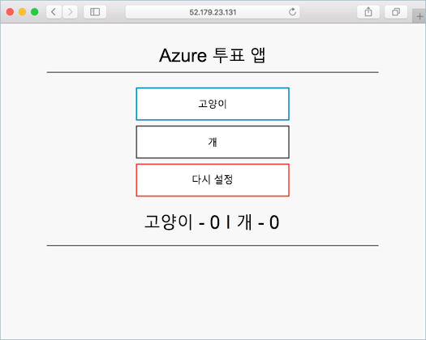

# <a name="deploy-docker-swarm-cluster"></a>Docker Swarm 클러스터 배포

이 빠른 시작에서는 docker는 Docker Swarm 클러스터 hello Azure CLI를 사용 하 여 배포 됩니다. 그런 다음 웹 프런트 엔드 및 Redis 인스턴스로 구성 된 다중 컨테이너 응용 프로그램 배포 하 고 hello 클러스터에서 실행 됩니다. Hello 응용 프로그램을 통해 액세스할 수는 완료 되 면 인터넷 hello 합니다.

Azure 구독이 아직 없는 경우 시작하기 전에 [무료 계정](https://azure.microsoft.com/free/?WT.mc_id=A261C142F) 을 만듭니다.

이 퀵 스타트의 2.0.4 hello Azure CLI 버전을 실행 되 고 있는지 필요 이상. 실행 `az --version` toofind hello 버전입니다. Tooinstall 또는 업그레이드를 보려면 참고 [Azure CLI 2.0 설치]( /cli/azure/install-azure-cli)합니다.

## <a name="create-a-resource-group"></a>리소스 그룹 만들기

Hello로 리소스 그룹 만들기 [az 그룹 만들기](/cli/azure/group#create) 명령입니다. Azure 리소스 그룹은 Azure 리소스가 배포되고 관리되는 논리 그룹입니다.

hello 다음 예제에서는 명명 된 리소스 그룹 *myResourceGroup* hello에 *westus* 위치 합니다.

```azurecli-interactive
az group create --name myResourceGroup --location westus
```

출력:

```json
{
  "id": "/subscriptions/00000000-0000-0000-0000-000000000000/resourceGroups/myResourceGroup",
  "location": "westcentralus",
  "managedBy": null,
  "name": "myResourceGroup",
  "properties": {
    "provisioningState": "Succeeded"
  },
  "tags": null
}
```

## <a name="create-docker-swarm-cluster"></a>Docker Swarm 클러스터 만들기

Hello로 Azure 컨테이너 서비스의 docker는 Docker Swarm 클러스터 만들기 [az acs 만들](/cli/azure/acs#create) 명령입니다. 

hello 다음 예제에서는 명명 된 클러스터가 *mySwarmCluster* 와 하나의 Linux 마스터 노드 및 Linux 에이전트 노드를 세 개 있습니다.

```azurecli-interactive
az acs create --name mySwarmCluster --orchestrator-type Swarm --resource-group myResourceGroup --generate-ssh-keys
```

몇 분 후 hello 명령을 완료 하 고 hello 클러스터에 대 한 json 형식 정보를 반환 합니다.

## <a name="connect-toohello-cluster"></a>Toohello 클러스터에 연결

이 빠른 시작 전체에서 hello docker는 Docker Swarm 마스터와 hello Docker 에이전트 풀의 hello IP 주소가 필요 합니다. 다음 명령 tooreturn hello IP 주소 모두를 실행 합니다.


```bash
az network public-ip list --resource-group myResourceGroup --query '[*].{Name:name,IPAddress:ipAddress}' -o table
```

출력:

```bash
Name                                                                 IPAddress
-------------------------------------------------------------------  -------------
swarmm-agent-ip-myswarmcluster-myresourcegroup-d5b9d4agent-66066781  52.179.23.131
swarmm-master-ip-myswarmcluster-myresourcegroup-d5b9d4mgmt-66066781  52.141.37.199
```

SSH 터널 toohello 웜 마스터를 만듭니다. 대체 `IPAddress` hello 웜 마스터의 hello IP 주소를 사용 합니다.

```bash
ssh -p 2200 -fNL 2375:localhost:2375 azureuser@IPAddress
```

집합 hello `DOCKER_HOST` 환경 변수입니다. 이렇게 하면 있습니다 docker는 Docker Swarm hello에 대해 toorun docker 명령을 hello 호스트의 toospecify hello 이름이 필요 없이.

```bash
export DOCKER_HOST=:2375
```

Docker는 Docker Swarm hello에서 준비 toorun Docker 서비스입니다.


## <a name="run-hello-application"></a>Hello 응용 프로그램 실행

라는 파일을 만들어 `docker-compose.yaml` 고 복사 hello에 콘텐츠를 따릅니다.

```yaml
version: '3'
services:
  azure-vote-back:
    image: redis
    container_name: azure-vote-back
    ports:
        - "6379:6379"

  azure-vote-front:
    image: microsoft/azure-vote-front:redis-v1
    container_name: azure-vote-front
    environment:
      REDIS: azure-vote-back
    ports:
        - "80:80"
```

Hello 명령 toocreate hello Azure 투표 서비스를 실행 합니다.

```bash
docker-compose up -d
```

출력:

```bash
Creating network "user_default" with hello default driver
Pulling azure-vote-front (microsoft/azure-vote-front:redis-v1)...
swarm-agent-EE873B23000005: Pulling microsoft/azure-vote-front:redis-v1...
swarm-agent-EE873B23000004: Pulling microsoft/azure-vote-front:redis-v1... : downloaded
Pulling azure-vote-back (redis:latest)...
swarm-agent-EE873B23000004: Pulling redis:latest... : downloaded
Creating azure-vote-front ... 
Creating azure-vote-back ... 
Creating azure-vote-front
Creating azure-vote-back ...
```

## <a name="test-hello-application"></a>Hello 응용 프로그램 테스트

Hello 웜 에이전트 풀 tootest hello Azure 투표 응용 프로그램으로의 toohello IP 주소를 찾습니다.



## <a name="delete-cluster"></a>클러스터 삭제
Hello hello 클러스터 필요는 더 이상 사용할 수 없습니다 [az 그룹 삭제](/cli/azure/group#delete) tooremove hello 리소스 그룹, 컨테이너 서비스와 관련 된 모든 리소스를 명령입니다.

```azurecli-interactive
az group delete --name myResourceGroup --yes --no-wait
```

## <a name="get-hello-code"></a>Hello 코드 가져오기

이 빠른 시작에서 미리 생성된 된 컨테이너 이미지 Docker 서비스가 사용 되는 toocreate 되었습니다. hello 관련 응용 프로그램 코드에서 Dockerfile 되며 Compose 파일 GitHub에서 사용할 수 있습니다.

[https://github.com/Azure-Samples/azure-voting-app-redis](https://github.com/Azure-Samples/azure-voting-app-redis.git)

## <a name="next-steps"></a>다음 단계

이 빠른 시작에서 docker는 Docker Swarm 클러스터를 배포 및 다중 컨테이너 응용 프로그램 tooit를 배포 합니다.

Docker 웜 Visual Studio Team Services와 통합 하는 방법에 대 한 toolearn toohello docker는 Docker Swarm 및 VSTS CI/CD를 계속 합니다.

> [!div class="nextstepaction"]
> [Docker Swarm 및 VSTS를 사용하는 CI/CD](./container-service-docker-swarm-setup-ci-cd.md)