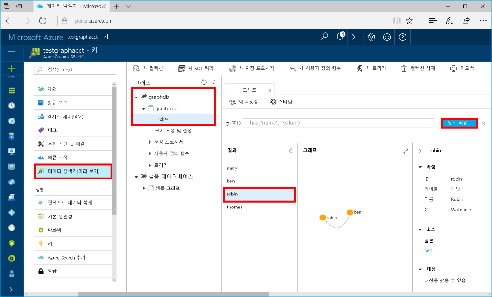

# <a name="azure-cosmos-db-build-a-net-application-using-the-graph-api"></a><span data-ttu-id="24236-103">Azure Cosmos DB: Graph API를 사용하여 .NET 응용 프로그램 빌드</span><span class="sxs-lookup"><span data-stu-id="24236-103">Azure Cosmos DB: Build a .NET application using the Graph API</span></span>

<span data-ttu-id="24236-104">Azure Cosmos DB는 전 세계에 배포된 Microsoft의 다중 모델 데이터베이스 서비스입니다.</span><span class="sxs-lookup"><span data-stu-id="24236-104">Azure Cosmos DB is Microsoft’s globally distributed multi-model database service.</span></span> <span data-ttu-id="24236-105">Azure Cosmos DB의 핵심인 전역 배포 및 수평적 크기 조정 기능의 이점을 활용하여 문서, 키/값 및 그래프 데이터베이스를 빠르게 만들고 쿼리할 수 있습니다.</span><span class="sxs-lookup"><span data-stu-id="24236-105">You can quickly create and query document, key/value, and graph databases, all of which benefit from the global distribution and horizontal scale capabilities at the core of Azure Cosmos DB.</span></span> 

<span data-ttu-id="24236-106">이 빠른 시작에서는 Azure Portal을 사용하여 Azure Cosmos DB 계정, 데이터베이스 및 그래프(컨테이너)를 만드는 방법을 보여 줍니다.</span><span class="sxs-lookup"><span data-stu-id="24236-106">This quick start demonstrates how to create an Azure Cosmos DB account, database, and graph (container) using the Azure portal.</span></span> <span data-ttu-id="24236-107">그런 다음, [Graph API](graph-sdk-dotnet.md)(미리 보기)에서 작성한 콘솔 앱을 빌드 및 실행합니다.</span><span class="sxs-lookup"><span data-stu-id="24236-107">You then build and run a console app built on the [Graph API](graph-sdk-dotnet.md) (preview).</span></span>  

## <a name="prerequisites"></a><span data-ttu-id="24236-108">필수 조건</span><span class="sxs-lookup"><span data-stu-id="24236-108">Prerequisites</span></span>

<span data-ttu-id="24236-109">Visual Studio 2017이 아직 설치되지 않은 경우 **체험판** [Visual Studio 2017 Community Edition](https://www.visualstudio.com/downloads/)을 다운로드하고 사용할 수 있습니다.</span><span class="sxs-lookup"><span data-stu-id="24236-109">If you don’t already have Visual Studio 2017 installed, you can download and use the **free** [Visual Studio 2017 Community Edition](https://www.visualstudio.com/downloads/).</span></span> <span data-ttu-id="24236-110">Visual Studio를 설정하는 동안 **Azure 개발**을 사용할 수 있는지 확인합니다.</span><span class="sxs-lookup"><span data-stu-id="24236-110">Make sure that you enable **Azure development** during the Visual Studio setup.</span></span>

[!INCLUDE [quickstarts-free-trial-note](../../includes/quickstarts-free-trial-note.md)]

## <a name="create-a-database-account"></a><span data-ttu-id="24236-111">데이터베이스 계정 만들기</span><span class="sxs-lookup"><span data-stu-id="24236-111">Create a database account</span></span>

[!INCLUDE [cosmos-db-create-dbaccount-graph](../../includes/cosmos-db-create-dbaccount-graph.md)]

## <a name="add-a-graph"></a><span data-ttu-id="24236-112">그래프 추가</span><span class="sxs-lookup"><span data-stu-id="24236-112">Add a graph</span></span>

[!INCLUDE [cosmos-db-create-graph](../../includes/cosmos-db-create-graph.md)]

## <a name="clone-the-sample-application"></a><span data-ttu-id="24236-113">샘플 응용 프로그램 복제</span><span class="sxs-lookup"><span data-stu-id="24236-113">Clone the sample application</span></span>

<span data-ttu-id="24236-114">이제 github에서 Graph API 앱을 복제하고 연결 문자열을 설정한 다음 실행해 보겠습니다.</span><span class="sxs-lookup"><span data-stu-id="24236-114">Now let's clone a Graph API app from github, set the connection string, and run it.</span></span> <span data-ttu-id="24236-115">프로그래밍 방식으로 데이터를 사용하여 얼마나 쉽게 작업할 수 있는지 알게 될 것입니다.</span><span class="sxs-lookup"><span data-stu-id="24236-115">You'll see how easy it is to work with data programmatically.</span></span> 

1. <span data-ttu-id="24236-116">git bash와 같은 git 터미널 창을 열고 `cd`를 수행하여 작업 디렉터리로 이동합니다.</span><span class="sxs-lookup"><span data-stu-id="24236-116">Open a git terminal window, such as git bash, and `cd` to a working directory.</span></span>  

2. <span data-ttu-id="24236-117">다음 명령을 실행하여 샘플 리포지토리를 복제합니다.</span><span class="sxs-lookup"><span data-stu-id="24236-117">Run the following command to clone the sample repository.</span></span> 

    ```bash
    git clone https://github.com/Azure-Samples/azure-cosmos-db-graph-dotnet-getting-started.git
    ```

3. <span data-ttu-id="24236-118">그런 다음 Visual Studio를 열고 솔루션 파일을 엽니다.</span><span class="sxs-lookup"><span data-stu-id="24236-118">Then open Visual Studio and open the solution file.</span></span> 

## <a name="review-the-code"></a><span data-ttu-id="24236-119">코드 검토</span><span class="sxs-lookup"><span data-stu-id="24236-119">Review the code</span></span>

<span data-ttu-id="24236-120">앱에서 어떤 상황이 발생하고 있는지 빠르게 살펴보겠습니다.</span><span class="sxs-lookup"><span data-stu-id="24236-120">Let's make a quick review of what's happening in the app.</span></span> <span data-ttu-id="24236-121">Program.cs 파일을 열어 보면 이러한 코드 줄에서 Azure Cosmos DB 리소스를 만드는 것을 알 수 있습니다.</span><span class="sxs-lookup"><span data-stu-id="24236-121">Open the Program.cs file and you'll find that these lines of code create the Azure Cosmos DB resources.</span></span> 

* <span data-ttu-id="24236-122">DocumentClient가 초기화됩니다.</span><span class="sxs-lookup"><span data-stu-id="24236-122">The DocumentClient is initialized.</span></span> <span data-ttu-id="24236-123">미리 보기에서는 Azure Cosmos DB 클라이언트에 그래프 확장 API를 추가했습니다.</span><span class="sxs-lookup"><span data-stu-id="24236-123">In the preview, we added a graph extension API on the Azure Cosmos DB client.</span></span> <span data-ttu-id="24236-124">Azure Cosmos DB 클라이언트 및 리소스에서 분리된 독립 실행형 그래프 클라이언트를 개발하고 있습니다.</span><span class="sxs-lookup"><span data-stu-id="24236-124">We are working on a standalone graph client decoupled from the Azure Cosmos DB client and resources.</span></span>

    ```csharp
    using (DocumentClient client = new DocumentClient(
        new Uri(endpoint),
        authKey,
        new ConnectionPolicy { ConnectionMode = ConnectionMode.Direct, ConnectionProtocol = Protocol.Tcp }))
    ```

* <span data-ttu-id="24236-125">새 데이터베이스가 만들어집니다.</span><span class="sxs-lookup"><span data-stu-id="24236-125">A new database is created.</span></span>

    ```csharp
    Database database = await client.CreateDatabaseIfNotExistsAsync(new Database { Id = "graphdb" });
    ```

* <span data-ttu-id="24236-126">새 그래프가 만들어집니다.</span><span class="sxs-lookup"><span data-stu-id="24236-126">A new graph is created.</span></span>

    ```csharp
    DocumentCollection graph = await client.CreateDocumentCollectionIfNotExistsAsync(
        UriFactory.CreateDatabaseUri("graphdb"),
        new DocumentCollection { Id = "graph" },
        new RequestOptions { OfferThroughput = 1000 });
    ```
* <span data-ttu-id="24236-127">`CreateGremlinQuery` 메서드를 사용하여 일련의 Gremlin 단계를 실행합니다.</span><span class="sxs-lookup"><span data-stu-id="24236-127">A series of Gremlin steps are executed using the `CreateGremlinQuery` method.</span></span>

    ```csharp
    // The CreateGremlinQuery method extensions allow you to execute Gremlin queries and iterate
    // results asychronously
    IDocumentQuery<dynamic> query = client.CreateGremlinQuery<dynamic>(graph, "g.V().count()");
    while (query.HasMoreResults)
    {
        foreach (dynamic result in await query.ExecuteNextAsync())
        {
            Console.WriteLine($"\t {JsonConvert.SerializeObject(result)}");
        }
    }

    ```

## <a name="update-your-connection-string"></a><span data-ttu-id="24236-128">연결 문자열 업데이트</span><span class="sxs-lookup"><span data-stu-id="24236-128">Update your connection string</span></span>

<span data-ttu-id="24236-129">이제 Azure Portal로 다시 이동하여 연결 문자열 정보를 가져와서 앱에 복사합니다.</span><span class="sxs-lookup"><span data-stu-id="24236-129">Now go back to the Azure portal to get your connection string information and copy it into the app.</span></span>

1. <span data-ttu-id="24236-130">Visual Studio 2017에서 App.config 파일을 엽니다.</span><span class="sxs-lookup"><span data-stu-id="24236-130">In Visual Studio 2017, open the App.config file.</span></span> 

2. <span data-ttu-id="24236-131">Azure Portal의 Azure Cosmos DB 계정에서 왼쪽 탐색 영역에 있는 **키**를 클릭합니다.</span><span class="sxs-lookup"><span data-stu-id="24236-131">In the Azure portal, in your Azure Cosmos DB account, click **Keys** in the left navigation.</span></span> 

    

3. <span data-ttu-id="24236-133">포털에서 **URI** 값을 복사하고 이 값을 App.config의 끝점 키 값으로 만듭니다.</span><span class="sxs-lookup"><span data-stu-id="24236-133">Copy your **URI** value from the portal and make it the value of the Endpoint key in App.config.</span></span> <span data-ttu-id="24236-134">이전 스크린샷에 표시된 것처럼 복사 단추를 사용하여 값을 복사할 수 있습니다.</span><span class="sxs-lookup"><span data-stu-id="24236-134">You can use the copy button as shown in the preceding screenshot to copy the value.</span></span>

    `<add key="Endpoint" value="https://FILLME.documents.azure.com:443" />`

4. <span data-ttu-id="24236-135">포털에서 **기본 키** 값을 복사하고 이 값을 web.config의 AuthKey 값으로 만든 후 변경 내용을 저장합니다.</span><span class="sxs-lookup"><span data-stu-id="24236-135">Copy your **PRIMARY KEY** value from the portal, and make it the value of the AuthKey key in App.config, then save your changes.</span></span> 

    `<add key="AuthKey" value="FILLME" />`

<span data-ttu-id="24236-136">이제 Azure Cosmos DB와 통신하는 데 필요한 모든 정보로 앱이 업데이트되었습니다.</span><span class="sxs-lookup"><span data-stu-id="24236-136">You've now updated your app with all the info it needs to communicate with Azure Cosmos DB.</span></span> 

## <a name="run-the-console-app"></a><span data-ttu-id="24236-137">콘솔 앱 실행</span><span class="sxs-lookup"><span data-stu-id="24236-137">Run the console app</span></span>

1. <span data-ttu-id="24236-138">Visual Studio의 **솔루션 탐색기**에서 **GraphGetStarted** 프로젝트를 마우스 오른쪽 단추로 클릭한 다음 **NuGet 패키지 관리**를 클릭합니다.</span><span class="sxs-lookup"><span data-stu-id="24236-138">In Visual Studio, right-click on the **GraphGetStarted** project in **Solution Explorer** and then click **Manage NuGet Packages**.</span></span> 

2. <span data-ttu-id="24236-139">NuGet **찾아보기** 상자에서 *Microsoft.Azure.Graphs*를 입력하고 **시험판 포함** 상자를 확인합니다.</span><span class="sxs-lookup"><span data-stu-id="24236-139">In the NuGet **Browse** box, type *Microsoft.Azure.Graphs* and check the **Includes prerelease** box.</span></span> 

3. <span data-ttu-id="24236-140">결과에서 **Microsoft.Azure.Graphs** 라이브러리를 설치합니다.</span><span class="sxs-lookup"><span data-stu-id="24236-140">From the results, install the **Microsoft.Azure.Graphs** library.</span></span> <span data-ttu-id="24236-141">그러면 Azure Cosmos DB 그래프 확장 라이브러리 패키지 및 모든 종속성이 설치됩니다.</span><span class="sxs-lookup"><span data-stu-id="24236-141">This installs the Azure Cosmos DB graph extension library package and all dependencies.</span></span>

    <span data-ttu-id="24236-142">솔루션 변경 내용을 검토하는 메시지가 표시되면 **확인**을 클릭합니다.</span><span class="sxs-lookup"><span data-stu-id="24236-142">If you get a message about reviewing changes to the solution, click **OK**.</span></span> <span data-ttu-id="24236-143">라이선스 승인에 관한 메시지가 표시되면 **동의합니다.**를 클릭합니다.</span><span class="sxs-lookup"><span data-stu-id="24236-143">If you get a message about license acceptance, click **I accept**.</span></span>

4. <span data-ttu-id="24236-144">CTRL+F5를 눌러 응용 프로그램을 실행합니다.</span><span class="sxs-lookup"><span data-stu-id="24236-144">Click CTRL + F5 to run the application.</span></span>

   <span data-ttu-id="24236-145">그래프에 추가된 꼭짓점 및 에지가 콘솔 창에 표시됩니다.</span><span class="sxs-lookup"><span data-stu-id="24236-145">The console window displays the vertexes and edges being added to the graph.</span></span> <span data-ttu-id="24236-146">스크립트가 완료되면 ENTER 키를 두 번 클릭하여 콘솔 창을 닫습니다.</span><span class="sxs-lookup"><span data-stu-id="24236-146">When the script completes, press ENTER twice to close the console window.</span></span> 

## <a name="browse-using-the-data-explorer"></a><span data-ttu-id="24236-147">데이터 탐색기를 사용하여 찾아보기</span><span class="sxs-lookup"><span data-stu-id="24236-147">Browse using the Data Explorer</span></span>

<span data-ttu-id="24236-148">이제 Azure Portal에서 데이터 탐색기로 돌아가고 새 그래프 데이터를 찾아 쿼리합니다.</span><span class="sxs-lookup"><span data-stu-id="24236-148">You can now go back to Data Explorer in the Azure portal and browse and query your new graph data.</span></span>

1. <span data-ttu-id="24236-149">[데이터 탐색기]에서 새 데이터베이스가 그래프 창에 표시됩니다.</span><span class="sxs-lookup"><span data-stu-id="24236-149">In Data Explorer, the new database appears in the Graphs pane.</span></span> <span data-ttu-id="24236-150">**graphdb**, **graphcollz**를 확장하고 **그래프**를 클릭합니다.</span><span class="sxs-lookup"><span data-stu-id="24236-150">Expand **graphdb**, **graphcollz**, and then click **Graph**.</span></span>

2. <span data-ttu-id="24236-151">**필터 적용** 단추를 클릭하고 기본 쿼리를 사용하여 그래프의 모든 꼭짓점을 봅니다.</span><span class="sxs-lookup"><span data-stu-id="24236-151">Click the **Apply Filter** button to use the default query to view all the verticies in the graph.</span></span> <span data-ttu-id="24236-152">샘플 앱에 의해 생성된 데이터는 그래프 창에 표시됩니다.</span><span class="sxs-lookup"><span data-stu-id="24236-152">The data generated by the sample app is displayed in the Graphs pane.</span></span>

    <span data-ttu-id="24236-153">그래프를 확대 및 축소하고, 그래프 표시 공간을 확장하고, 꼭짓점을 추가하고, 표시 표면에서 꼭짓점을 이동할 수 있습니다.</span><span class="sxs-lookup"><span data-stu-id="24236-153">You can zoom in and out of the graph, you can expand the graph display space, add additional verticies, and move verticies on the display surface.</span></span>

    

## <a name="review-slas-in-the-azure-portal"></a><span data-ttu-id="24236-155">Azure Portal에서 SLA 검토</span><span class="sxs-lookup"><span data-stu-id="24236-155">Review SLAs in the Azure portal</span></span>

[!INCLUDE [cosmosdb-tutorial-review-slas](../../includes/cosmos-db-tutorial-review-slas.md)]

## <a name="clean-up-resources"></a><span data-ttu-id="24236-156">리소스 정리</span><span class="sxs-lookup"><span data-stu-id="24236-156">Clean up resources</span></span>

<span data-ttu-id="24236-157">이 앱을 계속 사용하지 않으려면 Azure Portal에서 다음 단계에 따라 이 빠른 시작에서 만든 리소스를 모두 삭제합니다.</span><span class="sxs-lookup"><span data-stu-id="24236-157">If you're not going to continue to use this app, delete all resources created by this quickstart in the Azure portal with the following steps:</span></span> 

1. <span data-ttu-id="24236-158">Azure Portal의 왼쪽 메뉴에서 **리소스 그룹**을 클릭한 다음 만든 리소스의 이름을 클릭합니다.</span><span class="sxs-lookup"><span data-stu-id="24236-158">From the left-hand menu in the Azure portal, click **Resource groups** and then click the name of the resource you created.</span></span> 
2. <span data-ttu-id="24236-159">리소스 그룹 페이지에서 **삭제**를 클릭하고 텍스트 상자에서 삭제할 리소스의 이름을 입력한 다음 **삭제**를 클릭합니다.</span><span class="sxs-lookup"><span data-stu-id="24236-159">On your resource group page, click **Delete**, type the name of the resource to delete in the text box, and then click **Delete**.</span></span>

## <a name="next-steps"></a><span data-ttu-id="24236-160">다음 단계</span><span class="sxs-lookup"><span data-stu-id="24236-160">Next steps</span></span>

<span data-ttu-id="24236-161">이 빠른 시작에서, Azure Cosmos DB 계정을 만들고, 데이터 탐색기를 사용하여 그래프를 만들고, 앱을 실행하는 방법을 알아보았습니다.</span><span class="sxs-lookup"><span data-stu-id="24236-161">In this quickstart, you've learned how to create an Azure Cosmos DB account, create a graph using the Data Explorer, and run an app.</span></span> <span data-ttu-id="24236-162">이제 Gremlin을 사용하여 더 복잡한 쿼리를 작성하고 강력한 그래프 순회 논리를 구현할 수 있습니다.</span><span class="sxs-lookup"><span data-stu-id="24236-162">You can now build more complex queries and implement powerful graph traversal logic using Gremlin.</span></span> 

> [!div class="nextstepaction"]
> [<span data-ttu-id="24236-163">Gremlin을 사용하여 쿼리</span><span class="sxs-lookup"><span data-stu-id="24236-163">Query using Gremlin</span></span>](tutorial-query-graph.md)

