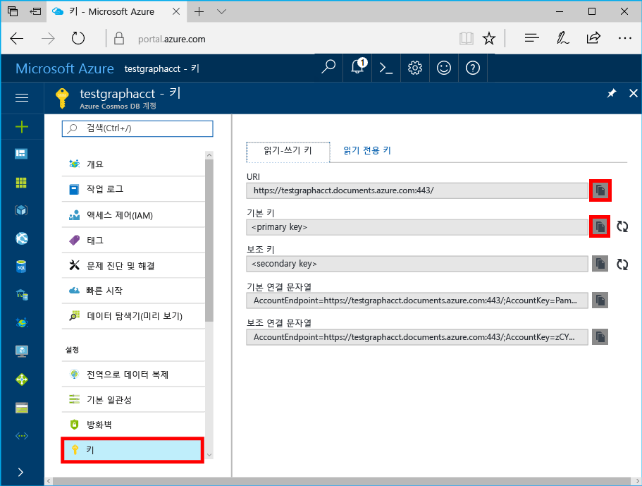

# <a name="azure-cosmos-db-create-query-and-traverse-a-graph-in-hello-gremlin-console"></a><span data-ttu-id="88c36-103">Azure Cosmos DB: 쿼리를 작성 하 고 hello Gremlin 콘솔에서 그래프를 트래버스</span><span class="sxs-lookup"><span data-stu-id="88c36-103">Azure Cosmos DB: Create, query, and traverse a graph in hello Gremlin console</span></span>

<span data-ttu-id="88c36-104">Azure Cosmos DB는 전 세계에 배포된 Microsoft의 다중 모델 데이터베이스 서비스입니다.</span><span class="sxs-lookup"><span data-stu-id="88c36-104">Azure Cosmos DB is Microsoft’s globally distributed multi-model database service.</span></span> <span data-ttu-id="88c36-105">신속 하 게 만들기 및 문서, 키/값 및 hello 글로벌 배포 및 수평 확장이 기능 Cosmos DB Azure의 hello 핵심에에서 활용 중 일부는 그래프 데이터베이스를 쿼리할 수 있습니다.</span><span class="sxs-lookup"><span data-stu-id="88c36-105">You can quickly create and query document, key/value, and graph databases, all of which benefit from hello global distribution and horizontal scale capabilities at hello core of Azure Cosmos DB.</span></span> 

<span data-ttu-id="88c36-106">이 빠른 시작 toocreate Azure Cosmos DB 계정, 데이터베이스 및 그래프 (컨테이너)를 사용 하 여 Azure 포털을 사용 하 여 hello hello 하는 방법을 보여 줍니다. [Gremlin 콘솔](https://tinkerpop.apache.org/docs/current/reference/#gremlin-console) 에서 [Apache TinkerPop](http://tinkerpop.apache.org) toowork와 그래프 API (미리 보기) 데이터입니다.</span><span class="sxs-lookup"><span data-stu-id="88c36-106">This quick start demonstrates how toocreate an Azure Cosmos DB account, database, and graph (container) using hello Azure portal and then use hello [Gremlin Console](https://tinkerpop.apache.org/docs/current/reference/#gremlin-console) from  [Apache TinkerPop](http://tinkerpop.apache.org) toowork with Graph API (preview) data.</span></span> <span data-ttu-id="88c36-107">이 자습서에서는 만들고 꼭지점을 쿼리 및 가장자리, 꼭 짓 점 속성 업데이트를 쿼리하고 꼭지점, hello 그래프를 통과 하 꼭 짓 점 삭제 합니다.</span><span class="sxs-lookup"><span data-stu-id="88c36-107">In this tutorial, you create and query vertices and edges, updating a vertex property, query vertices, traverse hello graph, and drop a vertex.</span></span>


<span data-ttu-id="88c36-109">hello Gremlin 콘솔 Groovy/Java 기반 및 Linux, Mac 및 Windows에서 실행 됩니다.</span><span class="sxs-lookup"><span data-stu-id="88c36-109">hello Gremlin console is Groovy/Java based and runs on Linux, Mac, and Windows.</span></span> <span data-ttu-id="88c36-110">Hello에서 다운로드할 수 있습니다 [Apache TinkerPop 사이트](https://www.apache.org/dyn/closer.lua/tinkerpop/3.2.5/apache-tinkerpop-gremlin-console-3.2.5-bin.zip)합니다.</span><span class="sxs-lookup"><span data-stu-id="88c36-110">You can download it from hello [Apache TinkerPop site](https://www.apache.org/dyn/closer.lua/tinkerpop/3.2.5/apache-tinkerpop-gremlin-console-3.2.5-bin.zip).</span></span>

## <a name="prerequisites"></a><span data-ttu-id="88c36-111">필수 조건</span><span class="sxs-lookup"><span data-stu-id="88c36-111">Prerequisites</span></span>

<span data-ttu-id="88c36-112">이 퀵 스타트의 toohave Azure 구독 toocreate Cosmos DB Azure 계정이 필요합니다.</span><span class="sxs-lookup"><span data-stu-id="88c36-112">You need toohave an Azure subscription toocreate an Azure Cosmos DB account for this quickstart.</span></span>

[!INCLUDE [quickstarts-free-trial-note](../../includes/quickstarts-free-trial-note.md)]

<span data-ttu-id="88c36-113">또한 tooinstall hello 해야 [Gremlin 콘솔](http://tinkerpop.apache.org/)합니다.</span><span class="sxs-lookup"><span data-stu-id="88c36-113">You also need tooinstall hello [Gremlin Console](http://tinkerpop.apache.org/).</span></span> <span data-ttu-id="88c36-114">버전 3.2.5 이상을 사용합니다.</span><span class="sxs-lookup"><span data-stu-id="88c36-114">Use version 3.2.5 or above.</span></span>

## <a name="create-a-database-account"></a><span data-ttu-id="88c36-115">데이터베이스 계정 만들기</span><span class="sxs-lookup"><span data-stu-id="88c36-115">Create a database account</span></span>

[!INCLUDE [cosmos-db-create-dbaccount-graph](../../includes/cosmos-db-create-dbaccount-graph.md)]

## <a name="add-a-graph"></a><span data-ttu-id="88c36-116">그래프 추가</span><span class="sxs-lookup"><span data-stu-id="88c36-116">Add a graph</span></span>

[!INCLUDE [cosmos-db-create-graph](../../includes/cosmos-db-create-graph.md)]

## <span data-ttu-id="88c36-117"><a id="ConnectAppService"></a>연결 tooyour 앱 서비스</span><span class="sxs-lookup"><span data-stu-id="88c36-117"><a id="ConnectAppService"></a>Connect tooyour app service</span></span>
1. <span data-ttu-id="88c36-118">시작 하기 전에 hello Gremlin 콘솔, 만들거나 hello apache-tinkerpop-gremlin-console-3.2.5/conf 디렉터리에 hello 원격 secure.yaml 구성 파일을 수정 합니다.</span><span class="sxs-lookup"><span data-stu-id="88c36-118">Before starting hello Gremlin Console, create or modify hello remote-secure.yaml configuration file in hello apache-tinkerpop-gremlin-console-3.2.5/conf directory.</span></span>
2. <span data-ttu-id="88c36-119">*호스트*, *포트*, *사용자 이름*, *암호*, *connectionPool* 및 *serializer* 구성을 입력합니다.</span><span class="sxs-lookup"><span data-stu-id="88c36-119">Fill in your *host*, *port*, *username*, *password*, *connectionPool*, and *serializer* configurations:</span></span>

    <span data-ttu-id="88c36-120">설정</span><span class="sxs-lookup"><span data-stu-id="88c36-120">Setting</span></span>|<span data-ttu-id="88c36-121">제안 값</span><span class="sxs-lookup"><span data-stu-id="88c36-121">Suggested value</span></span>|<span data-ttu-id="88c36-122">설명</span><span class="sxs-lookup"><span data-stu-id="88c36-122">Description</span></span>
    ---|---|---
    <span data-ttu-id="88c36-123">호스트</span><span class="sxs-lookup"><span data-stu-id="88c36-123">hosts</span></span>|<span data-ttu-id="88c36-124">[***.graphs.azure.com]</span><span class="sxs-lookup"><span data-stu-id="88c36-124">[***.graphs.azure.com]</span></span>|<span data-ttu-id="88c36-125">아래 스크린샷을 참조하세요.</span><span class="sxs-lookup"><span data-stu-id="88c36-125">See screenshot below.</span></span> <span data-ttu-id="88c36-126">이 hello Gremlin URI 값 hello hello 후행 대괄호에서 Azure 포털의 hello 개요 페이지에서: 443 / 제거 합니다.</span><span class="sxs-lookup"><span data-stu-id="88c36-126">This is hello Gremlin URI value on hello Overview page of hello Azure portal, in square brackets, with hello trailing :443/ removed.</span></span><br><br><span data-ttu-id="88c36-127">Https:// 제거한 문서 toographs 변경 hello 후행 제거 하 여 hello URI 값을 사용 하 여 hello 키 탭에서이 값을 검색할 수도 있습니다: 443 / 합니다.</span><span class="sxs-lookup"><span data-stu-id="88c36-127">This value can also be retrieved from hello Keys tab, using hello URI value by removing https://, changing documents toographs, and removing hello trailing :443/.</span></span>
    <span data-ttu-id="88c36-128">포트</span><span class="sxs-lookup"><span data-stu-id="88c36-128">port</span></span>|<span data-ttu-id="88c36-129">443</span><span class="sxs-lookup"><span data-stu-id="88c36-129">443</span></span>|<span data-ttu-id="88c36-130">Too443를 설정 합니다.</span><span class="sxs-lookup"><span data-stu-id="88c36-130">Set too443.</span></span>
    <span data-ttu-id="88c36-131">username</span><span class="sxs-lookup"><span data-stu-id="88c36-131">username</span></span>|<span data-ttu-id="88c36-132">*사용자 이름*</span><span class="sxs-lookup"><span data-stu-id="88c36-132">*Your username*</span></span>|<span data-ttu-id="88c36-133">hello 폼의 리소스 hello `/dbs/<db>/colls/<coll>` 여기서 `<db>` 은 데이터베이스 이름 및 `<coll>` 컬렉션 이름입니다.</span><span class="sxs-lookup"><span data-stu-id="88c36-133">hello resource of hello form `/dbs/<db>/colls/<coll>` where `<db>` is your database name and `<coll>` is your collection name.</span></span>
    <span data-ttu-id="88c36-134">암호</span><span class="sxs-lookup"><span data-stu-id="88c36-134">password</span></span>|<span data-ttu-id="88c36-135">*기본 키*</span><span class="sxs-lookup"><span data-stu-id="88c36-135">*Your primary key*</span></span>| <span data-ttu-id="88c36-136">아래에서 두 번째 스크린샷을 참조하세요.</span><span class="sxs-lookup"><span data-stu-id="88c36-136">See second screenshot below.</span></span> <span data-ttu-id="88c36-137">Hello hello 기본 키 상자에 Azure 포털의 hello 키 페이지에서 검색할 수 있는 기본 키입니다.</span><span class="sxs-lookup"><span data-stu-id="88c36-137">This is your primary key, which you can retrieve from hello Keys page of hello Azure portal, in hello Primary Key box.</span></span> <span data-ttu-id="88c36-138">Hello 복사 단추를 사용 하 여 hello hello 상자 toocopy hello 값의 왼쪽에 있습니다.</span><span class="sxs-lookup"><span data-stu-id="88c36-138">Use hello copy button on hello left side of hello box toocopy hello value.</span></span>
    <span data-ttu-id="88c36-139">connectionPool</span><span class="sxs-lookup"><span data-stu-id="88c36-139">connectionPool</span></span>|<span data-ttu-id="88c36-140">{enableSsl: true}</span><span class="sxs-lookup"><span data-stu-id="88c36-140">{enableSsl: true}</span></span>|<span data-ttu-id="88c36-141">SSL에 대한 연결 풀 설정</span><span class="sxs-lookup"><span data-stu-id="88c36-141">Your connection pool setting for SSL.</span></span>
    <span data-ttu-id="88c36-142">직렬 변환기</span><span class="sxs-lookup"><span data-stu-id="88c36-142">serializer</span></span>|<span data-ttu-id="88c36-143">{ className: org.apache.tinkerpop.gremlin.</span><span class="sxs-lookup"><span data-stu-id="88c36-143">{ className: org.apache.tinkerpop.gremlin.</span></span><br><span data-ttu-id="88c36-144">driver.ser.GraphSONMessageSerializerV1d0,</span><span class="sxs-lookup"><span data-stu-id="88c36-144">driver.ser.GraphSONMessageSerializerV1d0,</span></span><br> <span data-ttu-id="88c36-145">config: { serializeResultToString: true }}</span><span class="sxs-lookup"><span data-stu-id="88c36-145">config: { serializeResultToString: true }}</span></span>|<span data-ttu-id="88c36-146">Toothis 값을 설정 하 고 삭제 `\n` hello 값에 붙여 넣을 때 줄 바꿈 합니다.</span><span class="sxs-lookup"><span data-stu-id="88c36-146">Set toothis value and delete any `\n` line breaks when pasting in hello value.</span></span>

    <span data-ttu-id="88c36-147">Hello 호스트 값에 대 한 hello 복사 **Gremlin URI** hello에서 값 **개요** 페이지: </span><span class="sxs-lookup"><span data-stu-id="88c36-147">For hello hosts value, copy hello **Gremlin URI** value from hello **Overview** page: </span></span>

    <span data-ttu-id="88c36-148">Hello 암호 값에 대 한 hello 복사 **기본 키** hello에서 **키** 페이지: </span><span class="sxs-lookup"><span data-stu-id="88c36-148">For hello password value, copy hello **Primary key** from hello **Keys** page: </span></span>


3. <span data-ttu-id="88c36-149">실행 프로그램 터미널 `bin/gremlin.bat` 또는 `bin/gremlin.sh` toostart hello [Gremlin 콘솔](http://tinkerpop.apache.org/docs/3.2.5/tutorials/getting-started/)합니다.</span><span class="sxs-lookup"><span data-stu-id="88c36-149">In your terminal, run `bin/gremlin.bat` or `bin/gremlin.sh` toostart hello [Gremlin Console](http://tinkerpop.apache.org/docs/3.2.5/tutorials/getting-started/).</span></span>
4. <span data-ttu-id="88c36-150">실행 프로그램 터미널 `:remote connect tinkerpop.server conf/remote-secure.yaml` tooconnect tooyour 앱 서비스입니다.</span><span class="sxs-lookup"><span data-stu-id="88c36-150">In your terminal, run `:remote connect tinkerpop.server conf/remote-secure.yaml` tooconnect tooyour app service.</span></span>

    > [!TIP]
    > <span data-ttu-id="88c36-151">Hello 오류가 나타나면 `No appenders could be found for logger` 2 단계에 설명 된 대로 hello secure.yaml 원격 파일의 hello serializer 값을 업데이트 합니다.</span><span class="sxs-lookup"><span data-stu-id="88c36-151">If you receive hello error `No appenders could be found for logger` ensure that you updated hello serializer value in hello remote-secure.yaml file as described in step 2.</span></span> 

<span data-ttu-id="88c36-152">잘하셨습니다.</span><span class="sxs-lookup"><span data-stu-id="88c36-152">Great!</span></span> <span data-ttu-id="88c36-153">Hello 설치를 완료 했으므로 일부 콘솔 명령 실행 시작 하겠습니다.</span><span class="sxs-lookup"><span data-stu-id="88c36-153">Now that we finished hello setup, let's start running some console commands.</span></span>

<span data-ttu-id="88c36-154">간단한 count () 명령을 사용해 보겠습니다.</span><span class="sxs-lookup"><span data-stu-id="88c36-154">Let's try a simple count() command.</span></span> <span data-ttu-id="88c36-155">Hello 프롬프트 hello 콘솔로 hello 다음을 입력 합니다.</span><span class="sxs-lookup"><span data-stu-id="88c36-155">Type hello following into hello console at hello prompt:</span></span>
```
:> g.V().count()
```

> [!TIP]
> <span data-ttu-id="88c36-156">공지 hello `:>` hello 앞에 `g.V().count()` 텍스트?</span><span class="sxs-lookup"><span data-stu-id="88c36-156">Notice hello `:>` that precedes hello `g.V().count()` text?</span></span> 
>
> <span data-ttu-id="88c36-157">Tootype 필요한 hello 명령의 일부입니다.</span><span class="sxs-lookup"><span data-stu-id="88c36-157">This is part of hello command you need tootype.</span></span> <span data-ttu-id="88c36-158">Azure Cosmos DB와 함께 hello Gremlin 콘솔을 사용 하는 경우 반드시 합니다.</span><span class="sxs-lookup"><span data-stu-id="88c36-158">It is important when using hello Gremlin console, with Azure Cosmos DB.</span></span>  
>
> <span data-ttu-id="88c36-159">이 생략 하면 `:>` 접두사 지시 hello 콘솔 tooexecute hello 명령이 로컬에서 종종 메모리 그래프에 대 한 합니다.</span><span class="sxs-lookup"><span data-stu-id="88c36-159">Omitting this `:>` prefix instructs hello console tooexecute hello command locally, often against an in-memory graph.</span></span>
> <span data-ttu-id="88c36-160">이 사용 하 여 `:>` 지시 hello 콘솔 tooexecute 원격 명령,이 경우 Cosmos DB에 대 한 (hello localhost 에뮬레이터 중 하나 또는 > Azure 인스턴스).</span><span class="sxs-lookup"><span data-stu-id="88c36-160">Using this `:>` tells hello console tooexecute a remote command, in this case against Cosmos DB (either hello localhost emulator, or an > Azure instance).</span></span>


## <a name="create-vertices-and-edges"></a><span data-ttu-id="88c36-161">꼭짓점 및 에지 만들기</span><span class="sxs-lookup"><span data-stu-id="88c36-161">Create vertices and edges</span></span>

<span data-ttu-id="88c36-162">*Thomas*, *Mary Kay*, *Robin*, *Ben* 및 *Jack*이라는 5명의 사용자에 대한 꼭짓점을 추가함으로써 시작해 보겠습니다.</span><span class="sxs-lookup"><span data-stu-id="88c36-162">Let's begin by adding five person vertices for *Thomas*, *Mary Kay*, *Robin*, *Ben*, and *Jack*.</span></span>

<span data-ttu-id="88c36-163">입력(Thomas):</span><span class="sxs-lookup"><span data-stu-id="88c36-163">Input (Thomas):</span></span>

```
:> g.addV('person').property('firstName', 'Thomas').property('lastName', 'Andersen').property('age', 44).property('userid', 1)
```

<span data-ttu-id="88c36-164">출력:</span><span class="sxs-lookup"><span data-stu-id="88c36-164">Output:</span></span>

```
==>[id:796cdccc-2acd-4e58-a324-91d6f6f5ed6d,label:person,type:vertex,properties:[firstName:[[id:f02a749f-b67c-4016-850e-910242d68953,value:Thomas]],lastName:[[id:f5fa3126-8818-4fda-88b0-9bb55145ce5c,value:Andersen]],age:[[id:f6390f9c-e563-433e-acbf-25627628016e,value:44]],userid:[[id:796cdccc-2acd-4e58-a324-91d6f6f5ed6d|userid,value:1]]]]
```
<span data-ttu-id="88c36-165">입력(Mary Kay):</span><span class="sxs-lookup"><span data-stu-id="88c36-165">Input (Mary Kay):</span></span>

```
:> g.addV('person').property('firstName', 'Mary Kay').property('lastName', 'Andersen').property('age', 39).property('userid', 2)

```

<span data-ttu-id="88c36-166">출력:</span><span class="sxs-lookup"><span data-stu-id="88c36-166">Output:</span></span>

```
==>[id:0ac9be25-a476-4a30-8da8-e79f0119ea5e,label:person,type:vertex,properties:[firstName:[[id:ea0604f8-14ee-4513-a48a-1734a1f28dc0,value:Mary Kay]],lastName:[[id:86d3bba5-fd60-4856-9396-c195ef7d7f4b,value:Andersen]],age:[[id:bc81b78d-30c4-4e03-8f40-50f72eb5f6da,value:39]],userid:[[id:0ac9be25-a476-4a30-8da8-e79f0119ea5e|userid,value:2]]]]

```

<span data-ttu-id="88c36-167">입력(Robin):</span><span class="sxs-lookup"><span data-stu-id="88c36-167">Input (Robin):</span></span>

```
:> g.addV('person').property('firstName', 'Robin').property('lastName', 'Wakefield').property('userid', 3)
```

<span data-ttu-id="88c36-168">출력:</span><span class="sxs-lookup"><span data-stu-id="88c36-168">Output:</span></span>

```
==>[id:8dc14d6a-8683-4a54-8d74-7eef1fb43a3e,label:person,type:vertex,properties:[firstName:[[id:ec65f078-7a43-4cbe-bc06-e50f2640dc4e,value:Robin]],lastName:[[id:a3937d07-0e88-45d3-a442-26fcdfb042ce,value:Wakefield]],userid:[[id:8dc14d6a-8683-4a54-8d74-7eef1fb43a3e|userid,value:3]]]]
```

<span data-ttu-id="88c36-169">입력(Ben):</span><span class="sxs-lookup"><span data-stu-id="88c36-169">Input (Ben):</span></span>

```
:> g.addV('person').property('firstName', 'Ben').property('lastName', 'Miller').property('userid', 4)

```

<span data-ttu-id="88c36-170">출력:</span><span class="sxs-lookup"><span data-stu-id="88c36-170">Output:</span></span>

```
==>[id:ee86b670-4d24-4966-9a39-30529284b66f,label:person,type:vertex,properties:[firstName:[[id:a632469b-30fc-4157-840c-b80260871e9a,value:Ben]],lastName:[[id:4a08d307-0719-47c6-84ae-1b0b06630928,value:Miller]],userid:[[id:ee86b670-4d24-4966-9a39-30529284b66f|userid,value:4]]]]
```

<span data-ttu-id="88c36-171">입력(Jack):</span><span class="sxs-lookup"><span data-stu-id="88c36-171">Input (Jack):</span></span>

```
:> g.addV('person').property('firstName', 'Jack').property('lastName', 'Connor').property('userid', 5)
```

<span data-ttu-id="88c36-172">출력:</span><span class="sxs-lookup"><span data-stu-id="88c36-172">Output:</span></span>

```
==>[id:4c835f2a-ea5b-43bb-9b6b-215488ad8469,label:person,type:vertex,properties:[firstName:[[id:4250824e-4b72-417f-af98-8034aa15559f,value:Jack]],lastName:[[id:44c1d5e1-a831-480a-bf94-5167d133549e,value:Connor]],userid:[[id:4c835f2a-ea5b-43bb-9b6b-215488ad8469|userid,value:5]]]]
```


<span data-ttu-id="88c36-173">다음으로, 사용자 간의 관계에 에지를 추가해 보겠습니다.</span><span class="sxs-lookup"><span data-stu-id="88c36-173">Next, let's add edges for relationships between our people.</span></span>

<span data-ttu-id="88c36-174">입력(Thomas -> Mary Kay):</span><span class="sxs-lookup"><span data-stu-id="88c36-174">Input (Thomas -> Mary Kay):</span></span>

```
:> g.V().hasLabel('person').has('firstName', 'Thomas').addE('knows').to(g.V().hasLabel('person').has('firstName', 'Mary Kay'))
```

<span data-ttu-id="88c36-175">출력:</span><span class="sxs-lookup"><span data-stu-id="88c36-175">Output:</span></span>

```
==>[id:c12bf9fb-96a1-4cb7-a3f8-431e196e702f,label:knows,type:edge,inVLabel:person,outVLabel:person,inV:0d1fa428-780c-49a5-bd3a-a68d96391d5c,outV:1ce821c6-aa3d-4170-a0b7-d14d2a4d18c3]
```

<span data-ttu-id="88c36-176">입력(Thomas -> Robin):</span><span class="sxs-lookup"><span data-stu-id="88c36-176">Input (Thomas -> Robin):</span></span>

```
:> g.V().hasLabel('person').has('firstName', 'Thomas').addE('knows').to(g.V().hasLabel('person').has('firstName', 'Robin'))
```

<span data-ttu-id="88c36-177">출력:</span><span class="sxs-lookup"><span data-stu-id="88c36-177">Output:</span></span>

```
==>[id:58319bdd-1d3e-4f17-a106-0ddf18719d15,label:knows,type:edge,inVLabel:person,outVLabel:person,inV:3e324073-ccfc-4ae1-8675-d450858ca116,outV:1ce821c6-aa3d-4170-a0b7-d14d2a4d18c3]
```

<span data-ttu-id="88c36-178">입력(Robin -> Ben):</span><span class="sxs-lookup"><span data-stu-id="88c36-178">Input (Robin -> Ben):</span></span>

```
:> g.V().hasLabel('person').has('firstName', 'Robin').addE('knows').to(g.V().hasLabel('person').has('firstName', 'Ben'))
```

<span data-ttu-id="88c36-179">출력:</span><span class="sxs-lookup"><span data-stu-id="88c36-179">Output:</span></span>

```
==>[id:889c4d3c-549e-4d35-bc21-a3d1bfa11e00,label:knows,type:edge,inVLabel:person,outVLabel:person,inV:40fd641d-546e-412a-abcc-58fe53891aab,outV:3e324073-ccfc-4ae1-8675-d450858ca116]
```

## <a name="update-a-vertex"></a><span data-ttu-id="88c36-180">꼭짓점 업데이트</span><span class="sxs-lookup"><span data-stu-id="88c36-180">Update a vertex</span></span>

<span data-ttu-id="88c36-181">Hello 정보를 업데이트 *Thomas* 의 새로운 기간이 꼭 짓 점 *45*합니다.</span><span class="sxs-lookup"><span data-stu-id="88c36-181">Let's update hello *Thomas* vertex with a new age of *45*.</span></span>

<span data-ttu-id="88c36-182">입력:</span><span class="sxs-lookup"><span data-stu-id="88c36-182">Input:</span></span>
```
:> g.V().hasLabel('person').has('firstName', 'Thomas').property('age', 45)
```
<span data-ttu-id="88c36-183">출력:</span><span class="sxs-lookup"><span data-stu-id="88c36-183">Output:</span></span>

```
==>[id:ae36f938-210e-445a-92df-519f2b64c8ec,label:person,type:vertex,properties:[firstName:[[id:872090b6-6a77-456a-9a55-a59141d4ebc2,value:Thomas]],lastName:[[id:7ee7a39a-a414-4127-89b4-870bc4ef99f3,value:Andersen]],age:[[id:a2a75d5a-ae70-4095-806d-a35abcbfe71d,value:45]]]]
```

## <a name="query-your-graph"></a><span data-ttu-id="88c36-184">그래프 쿼리</span><span class="sxs-lookup"><span data-stu-id="88c36-184">Query your graph</span></span>

<span data-ttu-id="88c36-185">이제 그래프에 대한 다양한 쿼리를 실행해 보겠습니다.</span><span class="sxs-lookup"><span data-stu-id="88c36-185">Now, let's run a variety of queries against your graph.</span></span>

<span data-ttu-id="88c36-186">첫째, 40 년 보다 오래 된 하는 필터 tooreturn 유일한 사용자와 쿼리를 사용해보십시오 보겠습니다.</span><span class="sxs-lookup"><span data-stu-id="88c36-186">First, let's try a query with a filter tooreturn only people who are older than 40 years old.</span></span>

<span data-ttu-id="88c36-187">입력(필터 쿼리):</span><span class="sxs-lookup"><span data-stu-id="88c36-187">Input (filter query):</span></span>

```
:> g.V().hasLabel('person').has('age', gt(40))
```

<span data-ttu-id="88c36-188">출력:</span><span class="sxs-lookup"><span data-stu-id="88c36-188">Output:</span></span>

```
==>[id:ae36f938-210e-445a-92df-519f2b64c8ec,label:person,type:vertex,properties:[firstName:[[id:872090b6-6a77-456a-9a55-a59141d4ebc2,value:Thomas]],lastName:[[id:7ee7a39a-a414-4127-89b4-870bc4ef99f3,value:Andersen]],age:[[id:a2a75d5a-ae70-4095-806d-a35abcbfe71d,value:45]]]]
```

<span data-ttu-id="88c36-189">그런 다음, 40 년 보다 오래 된 hello 사람들에 대 한 프로젝트 hello 첫 번째 이름 보겠습니다.</span><span class="sxs-lookup"><span data-stu-id="88c36-189">Next, let's project hello first name for hello people who are older than 40 years old.</span></span>

<span data-ttu-id="88c36-190">입력(필터 + 프로젝션 쿼리):</span><span class="sxs-lookup"><span data-stu-id="88c36-190">Input (filter + projection query):</span></span>

```
:> g.V().hasLabel('person').has('age', gt(40)).values('firstName')
```

<span data-ttu-id="88c36-191">출력:</span><span class="sxs-lookup"><span data-stu-id="88c36-191">Output:</span></span>

```
==>Thomas
```

## <a name="traverse-your-graph"></a><span data-ttu-id="88c36-192">그래프 트래버스</span><span class="sxs-lookup"><span data-stu-id="88c36-192">Traverse your graph</span></span>

<span data-ttu-id="88c36-193">Hello 그래프 tooreturn 보겠습니다 트래버스 Thomas의 친구의 모든 합니다.</span><span class="sxs-lookup"><span data-stu-id="88c36-193">Let's traverse hello graph tooreturn all of Thomas's friends.</span></span>

<span data-ttu-id="88c36-194">입력(Thomas의 친구):</span><span class="sxs-lookup"><span data-stu-id="88c36-194">Input (friends of Thomas):</span></span>

```
:> g.V().hasLabel('person').has('firstName', 'Thomas').outE('knows').inV().hasLabel('person')
```

<span data-ttu-id="88c36-195">출력:</span><span class="sxs-lookup"><span data-stu-id="88c36-195">Output:</span></span> 

```
==>[id:f04bc00b-cb56-46c4-a3bb-a5870c42f7ff,label:person,type:vertex,properties:[firstName:[[id:14feedec-b070-444e-b544-62be15c7167c,value:Mary Kay]],lastName:[[id:107ab421-7208-45d4-b969-bbc54481992a,value:Andersen]],age:[[id:4b08d6e4-58f5-45df-8e69-6b790b692e0a,value:39]]]]
==>[id:91605c63-4988-4b60-9a30-5144719ae326,label:person,type:vertex,properties:[firstName:[[id:f760e0e6-652a-481a-92b0-1767d9bf372e,value:Robin]],lastName:[[id:352a4caa-bad6-47e3-a7dc-90ff342cf870,value:Wakefield]]]]
```

<span data-ttu-id="88c36-196">다음으로, 꼭 짓 점 hello 다음 계층을 살펴보겠습니다.</span><span class="sxs-lookup"><span data-stu-id="88c36-196">Next, let's get hello next layer of vertices.</span></span> <span data-ttu-id="88c36-197">Hello 그래프 tooreturn Thomas의 친구의 모든 hello 친구를 통과 합니다.</span><span class="sxs-lookup"><span data-stu-id="88c36-197">Traverse hello graph tooreturn all hello friends of Thomas's friends.</span></span>

<span data-ttu-id="88c36-198">입력(Thomas의 친구의 친구):</span><span class="sxs-lookup"><span data-stu-id="88c36-198">Input (friends of friends of Thomas):</span></span>

```
:> g.V().hasLabel('person').has('firstName', 'Thomas').outE('knows').inV().hasLabel('person').outE('knows').inV().hasLabel('person')
```
<span data-ttu-id="88c36-199">출력:</span><span class="sxs-lookup"><span data-stu-id="88c36-199">Output:</span></span>

```
==>[id:a801a0cb-ee85-44ee-a502-271685ef212e,label:person,type:vertex,properties:[firstName:[[id:b9489902-d29a-4673-8c09-c2b3fe7f8b94,value:Ben]],lastName:[[id:e084f933-9a4b-4dbc-8273-f0171265cf1d,value:Miller]]]]
```

## <a name="drop-a-vertex"></a><span data-ttu-id="88c36-200">꼭짓점 삭제</span><span class="sxs-lookup"><span data-stu-id="88c36-200">Drop a vertex</span></span>

<span data-ttu-id="88c36-201">Hello 그래프 데이터베이스에서 꼭 짓 점을 이제 삭제 하겠습니다.</span><span class="sxs-lookup"><span data-stu-id="88c36-201">Let's now delete a vertex from hello graph database.</span></span>

<span data-ttu-id="88c36-202">입력(Jack 꼭짓점 삭제):</span><span class="sxs-lookup"><span data-stu-id="88c36-202">Input (drop Jack vertex):</span></span>

```
:> g.V().hasLabel('person').has('firstName', 'Jack').drop()
```

## <a name="clear-your-graph"></a><span data-ttu-id="88c36-203">그래프 정리</span><span class="sxs-lookup"><span data-stu-id="88c36-203">Clear your graph</span></span>

<span data-ttu-id="88c36-204">마지막으로, 모든 꼭 짓 점 및 가장자리의 hello 데이터베이스를 정리 하겠습니다.</span><span class="sxs-lookup"><span data-stu-id="88c36-204">Finally, let's clear hello database of all vertices and edges.</span></span>

<span data-ttu-id="88c36-205">입력:</span><span class="sxs-lookup"><span data-stu-id="88c36-205">Input:</span></span>

```
:> g.E().drop()
:> g.V().drop()
```

<span data-ttu-id="88c36-206">축하합니다.</span><span class="sxs-lookup"><span data-stu-id="88c36-206">Congratulations!</span></span> <span data-ttu-id="88c36-207">이 Azure Cosmos DB: Graph API 자습서를 완료했습니다.</span><span class="sxs-lookup"><span data-stu-id="88c36-207">You've completed this Azure Cosmos DB: Graph API tutorial!</span></span>

## <a name="review-slas-in-hello-azure-portal"></a><span data-ttu-id="88c36-208">Sla hello Azure 포털에서에서 검토 하 고</span><span class="sxs-lookup"><span data-stu-id="88c36-208">Review SLAs in hello Azure portal</span></span>

[!INCLUDE [cosmosdb-tutorial-review-slas](../../includes/cosmos-db-tutorial-review-slas.md)]

## <a name="clean-up-resources"></a><span data-ttu-id="88c36-209">리소스 정리</span><span class="sxs-lookup"><span data-stu-id="88c36-209">Clean up resources</span></span>

<span data-ttu-id="88c36-210">것 toocontinue toouse이 응용이 프로그램을 만들이 빠른 시작 하 여 hello Azure 포털에서에서 단계를 수행 하는 hello로 리소스를 모두 삭제:</span><span class="sxs-lookup"><span data-stu-id="88c36-210">If you're not going toocontinue toouse this app, delete all resources created by this quickstart in hello Azure portal with hello following steps:</span></span>  

1. <span data-ttu-id="88c36-211">Hello Azure 포털에서에서 왼쪽 메뉴 hello에서에서 클릭 **리소스 그룹** 만든 hello 리소스의 hello 이름을 클릭 하 고 있습니다.</span><span class="sxs-lookup"><span data-stu-id="88c36-211">From hello left-hand menu in hello Azure portal, click **Resource groups** and then click hello name of hello resource you created.</span></span> 
2. <span data-ttu-id="88c36-212">리소스 그룹 페이지에서 클릭 **삭제**hello 텍스트 상자에 hello 리소스 toodelete의 hello 이름을 입력 한 다음 클릭 **삭제**합니다.</span><span class="sxs-lookup"><span data-stu-id="88c36-212">On your resource group page, click **Delete**, type hello name of hello resource toodelete in hello text box, and then click **Delete**.</span></span>

## <a name="next-steps"></a><span data-ttu-id="88c36-213">다음 단계</span><span class="sxs-lookup"><span data-stu-id="88c36-213">Next steps</span></span>

<span data-ttu-id="88c36-214">이 빠른 시작에서 어떻게 toocreate Azure Cosmos DB 계정 hello 데이터 탐색기를 사용 하 여 그래프를 만듭니다 꼭지점 및 가장자리를 만들고 hello Gremlin 콘솔을 사용 하 여 그래프를 트래버스 배웠습니다.</span><span class="sxs-lookup"><span data-stu-id="88c36-214">In this quickstart, you've learned how toocreate an Azure Cosmos DB account, create a graph using hello Data Explorer, create vertices and edges, and traverse your graph using hello Gremlin console.</span></span> <span data-ttu-id="88c36-215">이제 Gremlin을 사용하여 더 복잡한 쿼리를 작성하고 강력한 그래프 순회 논리를 구현할 수 있습니다.</span><span class="sxs-lookup"><span data-stu-id="88c36-215">You can now build more complex queries and implement powerful graph traversal logic using Gremlin.</span></span> 

> [!div class="nextstepaction"]
> [<span data-ttu-id="88c36-216">Gremlin을 사용하여 쿼리</span><span class="sxs-lookup"><span data-stu-id="88c36-216">Query using Gremlin</span></span>](tutorial-query-graph.md)
