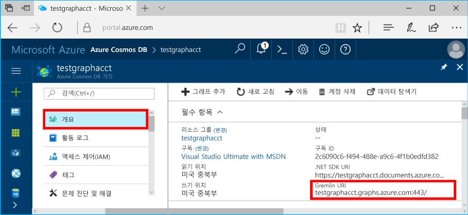
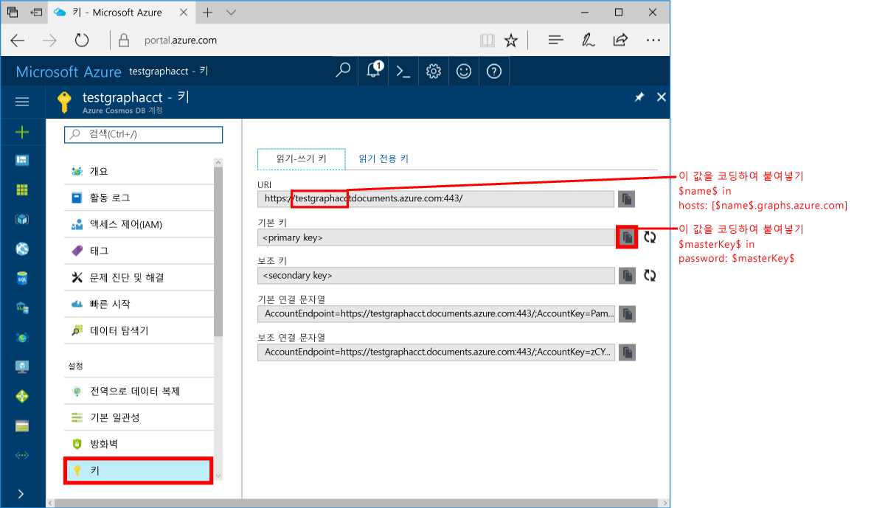
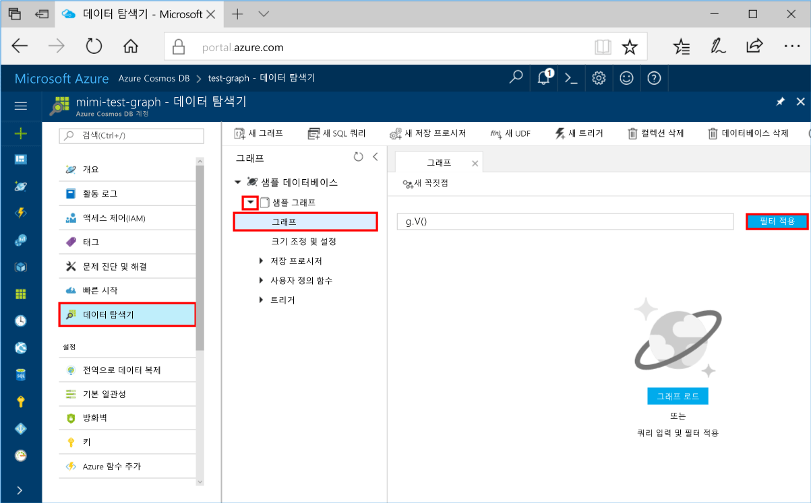
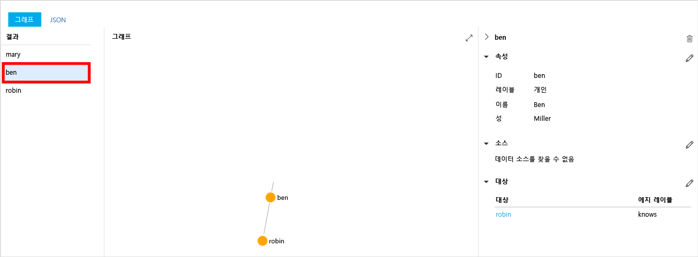
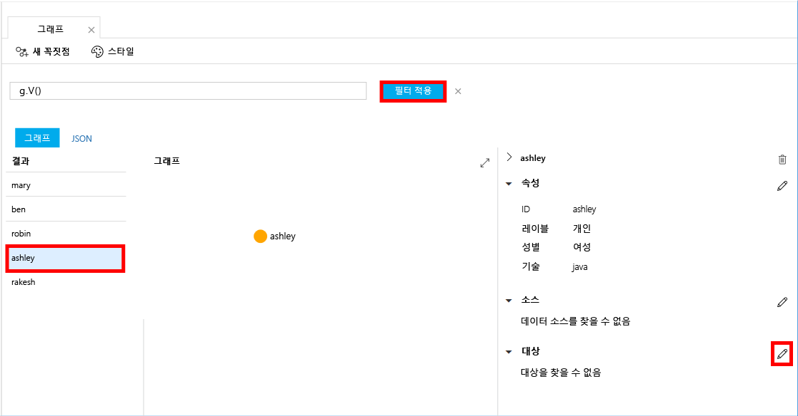
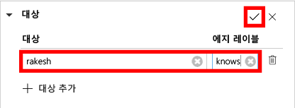
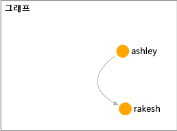

# <a name="azure-cosmos-db-create-a-graph-database-using-java-and-hello-azure-portal"></a><span data-ttu-id="91a97-103">Azure Cosmos DB: Java를 사용 하 여 그래프 데이터베이스를 만들고 Azure 포털 hello</span><span class="sxs-lookup"><span data-stu-id="91a97-103">Azure Cosmos DB: Create a graph database using Java and hello Azure portal</span></span>

<span data-ttu-id="91a97-104">Azure Cosmos DB는 전 세계에 배포된 Microsoft의 다중 모델 데이터베이스 서비스입니다.</span><span class="sxs-lookup"><span data-stu-id="91a97-104">Azure Cosmos DB is Microsoft’s globally distributed multi-model database service.</span></span> <span data-ttu-id="91a97-105">신속 하 게 만들기 및 문서, 키/값 및 hello 글로벌 배포 및 수평 확장이 기능 Cosmos DB Azure의 hello 핵심에에서 활용 중 일부는 그래프 데이터베이스를 쿼리할 수 있습니다.</span><span class="sxs-lookup"><span data-stu-id="91a97-105">You can quickly create and query document, key/value, and graph databases, all of which benefit from hello global distribution and horizontal scale capabilities at hello core of Azure Cosmos DB.</span></span> 

<span data-ttu-id="91a97-106">이 빠른 시작으로 그래프를 만듭니다 포털 Azure tools for Azure Cosmos DB hello 사용 하 여 데이터베이스입니다.</span><span class="sxs-lookup"><span data-stu-id="91a97-106">This quickstart creates a graph database using hello Azure portal tools for Azure Cosmos DB.</span></span> <span data-ttu-id="91a97-107">이 퀵 스타트의 표시 tooquickly hello OS를 사용 하 여 그래프 데이터베이스를 사용 하 여 Java 콘솔 응용 프로그램을 만드는 방법을 [Gremlin Java](https://mvnrepository.com/artifact/org.apache.tinkerpop/gremlin-driver) 드라이버입니다.</span><span class="sxs-lookup"><span data-stu-id="91a97-107">This quickstart also shows you how tooquickly create a Java console app using a graph database using hello OSS [Gremlin Java](https://mvnrepository.com/artifact/org.apache.tinkerpop/gremlin-driver) driver.</span></span> <span data-ttu-id="91a97-108">이 빠른 시작의 hello 지침 Java 실행할 수 있는 모든 운영 체제에서 수행할 수 있습니다.</span><span class="sxs-lookup"><span data-stu-id="91a97-108">hello instructions in this quickstart can be followed on any operating system that is capable of running Java.</span></span> <span data-ttu-id="91a97-109">이 빠른 시작을 작성 하 고 수정 hello UI 또는 프로그래밍 방식으로, 기본 설정을 중 더 작은 값의 그래프 리소스를 살펴봅니다.</span><span class="sxs-lookup"><span data-stu-id="91a97-109">This quickstart familiarizes you with creating and modifying graph resources in either hello UI or programmatically, whichever is your preference.</span></span> 

## <a name="prerequisites"></a><span data-ttu-id="91a97-110">필수 조건</span><span class="sxs-lookup"><span data-stu-id="91a97-110">Prerequisites</span></span>

* [<span data-ttu-id="91a97-111">JDK(Java Development Kit) 1.7+</span><span class="sxs-lookup"><span data-stu-id="91a97-111">Java Development Kit (JDK) 1.7+</span></span>](http://www.oracle.com/technetwork/java/javase/downloads/jdk8-downloads-2133151.html)
    * <span data-ttu-id="91a97-112">Ubuntu, 실행 `apt-get install default-jdk` tooinstall hello JDK.</span><span class="sxs-lookup"><span data-stu-id="91a97-112">On Ubuntu, run `apt-get install default-jdk` tooinstall hello JDK.</span></span>
    * <span data-ttu-id="91a97-113">Hello JDK 설치 되어 있는지 tooset hello JAVA_HOME 환경 변수 toopoint toohello 폴더 수 있습니다.</span><span class="sxs-lookup"><span data-stu-id="91a97-113">Be sure tooset hello JAVA_HOME environment variable toopoint toohello folder where hello JDK is installed.</span></span>
* <span data-ttu-id="91a97-114">[Maven](http://maven.apache.org/) 이진 아카이브 [다운로드](http://maven.apache.org/download.cgi) 및 [설치](http://maven.apache.org/install.html)</span><span class="sxs-lookup"><span data-stu-id="91a97-114">[Download](http://maven.apache.org/download.cgi) and [install](http://maven.apache.org/install.html) a [Maven](http://maven.apache.org/) binary archive</span></span>
    * <span data-ttu-id="91a97-115">Ubuntu, 실행할 수 있습니다 `apt-get install maven` tooinstall Maven 합니다.</span><span class="sxs-lookup"><span data-stu-id="91a97-115">On Ubuntu, you can run `apt-get install maven` tooinstall Maven.</span></span>
* [<span data-ttu-id="91a97-116">Git</span><span class="sxs-lookup"><span data-stu-id="91a97-116">Git</span></span>](https://www.git-scm.com/)
    * <span data-ttu-id="91a97-117">Ubuntu, 실행할 수 있습니다 `sudo apt-get install git` tooinstall Git 합니다.</span><span class="sxs-lookup"><span data-stu-id="91a97-117">On Ubuntu, you can run `sudo apt-get install git` tooinstall Git.</span></span>

[!INCLUDE [quickstarts-free-trial-note](../../includes/quickstarts-free-trial-note.md)]

## <a name="create-a-database-account"></a><span data-ttu-id="91a97-118">데이터베이스 계정 만들기</span><span class="sxs-lookup"><span data-stu-id="91a97-118">Create a database account</span></span>

<span data-ttu-id="91a97-119">그래프 데이터베이스를 만들 수 있습니다, 전에 toocreate Gremlin (그래프) 데이터베이스 계정을 Azure Cosmos DB와 함께 필요 합니다.</span><span class="sxs-lookup"><span data-stu-id="91a97-119">Before you can create a graph database, you need toocreate a Gremlin (Graph) database account with Azure Cosmos DB.</span></span>

[!INCLUDE [cosmos-db-create-dbaccount-graph](../../includes/cosmos-db-create-dbaccount-graph.md)]

## <a name="add-a-graph"></a><span data-ttu-id="91a97-120">그래프 추가</span><span class="sxs-lookup"><span data-stu-id="91a97-120">Add a graph</span></span>

<span data-ttu-id="91a97-121">이제 Azure 포털 toocreate 그래프 데이터베이스 hello에 hello 데이터 탐색기 도구를 사용할 수 있습니다.</span><span class="sxs-lookup"><span data-stu-id="91a97-121">You can now use hello Data Explorer tool in hello Azure portal toocreate a graph database.</span></span> 

1. <span data-ttu-id="91a97-122">Hello hello 왼쪽된 탐색 메뉴에서 Azure 포털에서에서 클릭 **데이터 탐색기 (미리 보기)**합니다.</span><span class="sxs-lookup"><span data-stu-id="91a97-122">In hello Azure portal, in hello left navigation menu, click **Data Explorer (Preview)**.</span></span> 
2. <span data-ttu-id="91a97-123">Hello에 **데이터 탐색기 (미리 보기)** 블레이드에서 클릭 **새 그래프**, hello 다음 정보를 사용 하 여 hello 페이지를 채웁니다.</span><span class="sxs-lookup"><span data-stu-id="91a97-123">In hello **Data Explorer (Preview)** blade, click **New Graph**, then fill in hello page using hello following information:</span></span>

    

    <span data-ttu-id="91a97-125">설정</span><span class="sxs-lookup"><span data-stu-id="91a97-125">Setting</span></span>|<span data-ttu-id="91a97-126">제안 값</span><span class="sxs-lookup"><span data-stu-id="91a97-126">Suggested value</span></span>|<span data-ttu-id="91a97-127">설명</span><span class="sxs-lookup"><span data-stu-id="91a97-127">Description</span></span>
    ---|---|---
    <span data-ttu-id="91a97-128">데이터베이스 ID</span><span class="sxs-lookup"><span data-stu-id="91a97-128">Database ID</span></span>|<span data-ttu-id="91a97-129">sample-database</span><span class="sxs-lookup"><span data-stu-id="91a97-129">sample-database</span></span>|<span data-ttu-id="91a97-130">새 데이터베이스에 대 한 hello ID입니다.</span><span class="sxs-lookup"><span data-stu-id="91a97-130">hello ID for your new database.</span></span> <span data-ttu-id="91a97-131">데이터베이스 이름은 1~255자 사이여야 하며 `/ \ # ?` 또는 후행 공백을 포함할 수 없습니다.</span><span class="sxs-lookup"><span data-stu-id="91a97-131">Database names must be between 1 and 255 characters, and cannot contain `/ \ # ?` or a trailing space.</span></span>
    <span data-ttu-id="91a97-132">그래프 ID</span><span class="sxs-lookup"><span data-stu-id="91a97-132">Graph ID</span></span>|<span data-ttu-id="91a97-133">sample-graph</span><span class="sxs-lookup"><span data-stu-id="91a97-133">sample-graph</span></span>|<span data-ttu-id="91a97-134">새 그래프에 대 한 hello ID입니다.</span><span class="sxs-lookup"><span data-stu-id="91a97-134">hello ID for your new graph.</span></span> <span data-ttu-id="91a97-135">그래프 이름에는 hello 요구 사항 데이터베이스 id로 문자 동일 합니다.</span><span class="sxs-lookup"><span data-stu-id="91a97-135">Graph names have hello same character requirements as database ids.</span></span>
    <span data-ttu-id="91a97-136">저장소 용량</span><span class="sxs-lookup"><span data-stu-id="91a97-136">Storage Capacity</span></span>| <span data-ttu-id="91a97-137">10 GB</span><span class="sxs-lookup"><span data-stu-id="91a97-137">10 GB</span></span>|<span data-ttu-id="91a97-138">Hello 기본값을 그대로 둡니다.</span><span class="sxs-lookup"><span data-stu-id="91a97-138">Leave hello default value.</span></span> <span data-ttu-id="91a97-139">이 hello 데이터베이스의 저장 용량 hello입니다.</span><span class="sxs-lookup"><span data-stu-id="91a97-139">This is hello storage capacity of hello database.</span></span>
    <span data-ttu-id="91a97-140">처리량</span><span class="sxs-lookup"><span data-stu-id="91a97-140">Throughput</span></span>|<span data-ttu-id="91a97-141">400RU</span><span class="sxs-lookup"><span data-stu-id="91a97-141">400 RUs</span></span>|<span data-ttu-id="91a97-142">Hello 기본값을 그대로 둡니다.</span><span class="sxs-lookup"><span data-stu-id="91a97-142">Leave hello default value.</span></span> <span data-ttu-id="91a97-143">확장할 수 있습니다 hello 처리량 나중 tooreduce 대기 시간 하려는 경우.</span><span class="sxs-lookup"><span data-stu-id="91a97-143">You can scale up hello throughput later if you want tooreduce latency.</span></span>
    <span data-ttu-id="91a97-144">파티션 키</span><span class="sxs-lookup"><span data-stu-id="91a97-144">Partition key</span></span>|<span data-ttu-id="91a97-145">비워 둠</span><span class="sxs-lookup"><span data-stu-id="91a97-145">Leave blank</span></span>|<span data-ttu-id="91a97-146">이 빠른 시작의 hello 용도로 hello 파티션 키를 비워 둡니다.</span><span class="sxs-lookup"><span data-stu-id="91a97-146">For hello purpose of this quickstart, leave hello partition key blank.</span></span>

3. <span data-ttu-id="91a97-147">Hello 양식에 입력, 클릭 **확인**합니다.</span><span class="sxs-lookup"><span data-stu-id="91a97-147">Once hello form is filled out, click **OK**.</span></span>

## <a name="clone-hello-sample-application"></a><span data-ttu-id="91a97-148">Hello 샘플 응용 프로그램 복제</span><span class="sxs-lookup"><span data-stu-id="91a97-148">Clone hello sample application</span></span>

<span data-ttu-id="91a97-149">이제 보겠습니다 hello 연결 문자열을 설정 하 고 실행 github에서 그래프 응용 프로그램을 복제 합니다.</span><span class="sxs-lookup"><span data-stu-id="91a97-149">Now let's clone a graph app from github, set hello connection string, and run it.</span></span> <span data-ttu-id="91a97-150">얼마나 쉬운지 데이터로 toowork 프로그래밍 방식으로 하는 것이 표시 됩니다.</span><span class="sxs-lookup"><span data-stu-id="91a97-150">You see how easy it is toowork with data programmatically.</span></span> 

1. <span data-ttu-id="91a97-151">예: git bash git 터미널 윈도우를 열고 및 `cd` tooa 작업 디렉터리입니다.</span><span class="sxs-lookup"><span data-stu-id="91a97-151">Open a git terminal window, such as git bash, and `cd` tooa working directory.</span></span>  

2. <span data-ttu-id="91a97-152">다음 명령은 tooclone hello 샘플 리포지토리 hello를 실행 합니다.</span><span class="sxs-lookup"><span data-stu-id="91a97-152">Run hello following command tooclone hello sample repository.</span></span> 

    ```bash
    git clone https://github.com/Azure-Samples/azure-cosmos-db-graph-java-getting-started.git
    ```

## <a name="review-hello-code"></a><span data-ttu-id="91a97-153">Hello 코드 검토</span><span class="sxs-lookup"><span data-stu-id="91a97-153">Review hello code</span></span>

<span data-ttu-id="91a97-154">Hello 앱에서 일어나는 빠르게 검토를 만들어 보겠습니다.</span><span class="sxs-lookup"><span data-stu-id="91a97-154">Let's make a quick review of what's happening in hello app.</span></span> <span data-ttu-id="91a97-155">열기 hello `Program.java` hello \src\GetStarted 폴더에서 파일을 다음 코드이 줄을 찾습니다.</span><span class="sxs-lookup"><span data-stu-id="91a97-155">Open hello `Program.java` file from hello \src\GetStarted folder and find these lines of code.</span></span> 

* <span data-ttu-id="91a97-156">hello Gremlin `Client` hello 구성에서 초기화 `src/remote.yaml`합니다.</span><span class="sxs-lookup"><span data-stu-id="91a97-156">hello Gremlin `Client` is initialized from hello configuration in `src/remote.yaml`.</span></span>

    ```java
    cluster = Cluster.build(new File("src/remote.yaml")).create();
    ...
    client = cluster.connect();
    ```

* <span data-ttu-id="91a97-157">Hello를 사용 하 여 일련의 Gremlin 단계 실행 `client.submit` 메서드.</span><span class="sxs-lookup"><span data-stu-id="91a97-157">A series of Gremlin steps are executed using hello `client.submit` method.</span></span>

    ```java
    ResultSet results = client.submit(gremlin);

    CompletableFuture<List<Result>> completableFutureResults = results.all();
    List<Result> resultList = completableFutureResults.get();

    for (Result result : resultList) {
        System.out.println(result.toString());
    }
    ```

## <a name="update-your-connection-string"></a><span data-ttu-id="91a97-158">연결 문자열 업데이트</span><span class="sxs-lookup"><span data-stu-id="91a97-158">Update your connection string</span></span>

1. <span data-ttu-id="91a97-159">열기 hello src/remote.yaml 파일입니다.</span><span class="sxs-lookup"><span data-stu-id="91a97-159">Open hello src/remote.yaml file.</span></span> 

3. <span data-ttu-id="91a97-160">입력 프로그램 *호스트*, *username*, 및 *암호* hello src/remote.yaml 파일의 값입니다.</span><span class="sxs-lookup"><span data-stu-id="91a97-160">Fill in your *hosts*, *username*, and *password* values in hello src/remote.yaml file.</span></span> <span data-ttu-id="91a97-161">hello 설정 hello 나머지 toobe 변경할 필요는 없습니다.</span><span class="sxs-lookup"><span data-stu-id="91a97-161">hello rest of hello settings do not need toobe changed.</span></span>

    <span data-ttu-id="91a97-162">설정</span><span class="sxs-lookup"><span data-stu-id="91a97-162">Setting</span></span>|<span data-ttu-id="91a97-163">제안 값</span><span class="sxs-lookup"><span data-stu-id="91a97-163">Suggested value</span></span>|<span data-ttu-id="91a97-164">설명</span><span class="sxs-lookup"><span data-stu-id="91a97-164">Description</span></span>
    ---|---|---
    <span data-ttu-id="91a97-165">호스트</span><span class="sxs-lookup"><span data-stu-id="91a97-165">Hosts</span></span>|<span data-ttu-id="91a97-166">[***.graphs.azure.com]</span><span class="sxs-lookup"><span data-stu-id="91a97-166">[***.graphs.azure.com]</span></span>|<span data-ttu-id="91a97-167">Hello 스크린 샷을 다음이 표를 참조 하십시오.</span><span class="sxs-lookup"><span data-stu-id="91a97-167">See hello screenshot following this table.</span></span> <span data-ttu-id="91a97-168">이 값은 hello Gremlin URI 값 hello hello 후행 대괄호에서 Azure 포털의 hello 개요 페이지에서: 443 / 제거 합니다.</span><span class="sxs-lookup"><span data-stu-id="91a97-168">This value is hello Gremlin URI value on hello Overview page of hello Azure portal, in square brackets, with hello trailing :443/ removed.</span></span><br><br><span data-ttu-id="91a97-169">Https:// 제거한 문서 toographs 변경 hello 후행 제거 하 여 hello URI 값을 사용 하 여 hello 키 탭에서이 값을 검색할 수도 있습니다: 443 / 합니다.</span><span class="sxs-lookup"><span data-stu-id="91a97-169">This value can also be retrieved from hello Keys tab, using hello URI value by removing https://, changing documents toographs, and removing hello trailing :443/.</span></span>
    <span data-ttu-id="91a97-170">사용자 이름</span><span class="sxs-lookup"><span data-stu-id="91a97-170">Username</span></span>|<span data-ttu-id="91a97-171">/dbs/sample-database/colls/sample-graph</span><span class="sxs-lookup"><span data-stu-id="91a97-171">/dbs/sample-database/colls/sample-graph</span></span>|<span data-ttu-id="91a97-172">hello 폼의 리소스 hello `/dbs/<db>/colls/<coll>` 여기서 `<db>` 은 기존 데이터베이스 이름 및 `<coll>` 은 기존 컬렉션 이름입니다.</span><span class="sxs-lookup"><span data-stu-id="91a97-172">hello resource of hello form `/dbs/<db>/colls/<coll>` where `<db>` is your existing database name and `<coll>` is your existing collection name.</span></span>
    <span data-ttu-id="91a97-173">암호</span><span class="sxs-lookup"><span data-stu-id="91a97-173">Password</span></span>|<span data-ttu-id="91a97-174">*기본 마스터 키*</span><span class="sxs-lookup"><span data-stu-id="91a97-174">*Your primary master key*</span></span>|<span data-ttu-id="91a97-175">Hello 두 번째 스크린 샷을 다음이 표를 참조 하십시오.</span><span class="sxs-lookup"><span data-stu-id="91a97-175">See hello second screenshot following this table.</span></span> <span data-ttu-id="91a97-176">이 값은 사용자 기본 키를 hello hello 기본 키 상자에 Azure 포털의 hello 키 페이지에서 검색할 수 있습니다.</span><span class="sxs-lookup"><span data-stu-id="91a97-176">This value is your primary key, which you can retrieve from hello Keys page of hello Azure portal, in hello Primary Key box.</span></span> <span data-ttu-id="91a97-177">Hello 값 hello 복사 단추를 사용 하 여 hello hello 상자 오른쪽에 복사 합니다.</span><span class="sxs-lookup"><span data-stu-id="91a97-177">Copy hello value using hello copy button on hello right side of hello box.</span></span>

    <span data-ttu-id="91a97-178">Hello 호스트 값에 대 한 hello 복사 **Gremlin URI** hello에서 값 **개요** 페이지.</span><span class="sxs-lookup"><span data-stu-id="91a97-178">For hello Hosts value, copy hello **Gremlin URI** value from hello **Overview** page.</span></span> <span data-ttu-id="91a97-179">가 비어 있으면 hello 호스트 행 hello hello 키 블레이드에서 hello Gremlin URI를 만드는 방법에 대해 테이블 앞에 있는 hello 지침을 참조 합니다.</span><span class="sxs-lookup"><span data-stu-id="91a97-179">If it's empty, see hello instructions in hello Hosts row in hello preceding table about creating hello Gremlin URI from hello Keys blade.</span></span>
<span data-ttu-id="91a97-180"></span><span class="sxs-lookup"><span data-stu-id="91a97-180"></span></span>

    <span data-ttu-id="91a97-181">암호 값 hello에 대 한 hello 복사 **기본 키** hello에서 **키** 블레이드: </span><span class="sxs-lookup"><span data-stu-id="91a97-181">For hello Password value, copy hello **Primary key** from hello **Keys** blade: </span></span>

## <a name="run-hello-console-app"></a><span data-ttu-id="91a97-182">Hello 콘솔 앱 실행</span><span class="sxs-lookup"><span data-stu-id="91a97-182">Run hello console app</span></span>

1. <span data-ttu-id="91a97-183">Hello git 터미널 창에서 `cd` toohello azure-cosmos-db-graph-java-getting-started 폴더입니다.</span><span class="sxs-lookup"><span data-stu-id="91a97-183">In hello git terminal window, `cd` toohello azure-cosmos-db-graph-java-getting-started folder.</span></span>

2. <span data-ttu-id="91a97-184">Hello git 터미널 창에서 입력 `mvn package` tooinstall hello Java 패키지가 필요 합니다.</span><span class="sxs-lookup"><span data-stu-id="91a97-184">In hello git terminal window, type `mvn package` tooinstall hello required Java packages.</span></span>

3. <span data-ttu-id="91a97-185">Hello git 터미널 창에서 실행 `mvn exec:java -D exec.mainClass=GetStarted.Program` 에 hello 터미널 윈도우 toostart Java 응용 프로그램입니다.</span><span class="sxs-lookup"><span data-stu-id="91a97-185">In hello git terminal window, run `mvn exec:java -D exec.mainClass=GetStarted.Program` in hello terminal window toostart your Java application.</span></span>

<span data-ttu-id="91a97-186">hello 터미널 창 hello 꼭지점 toohello 그래프 추가 되 고 표시 됩니다.</span><span class="sxs-lookup"><span data-stu-id="91a97-186">hello terminal window displays hello vertices being added toohello graph.</span></span> <span data-ttu-id="91a97-187">Hello 프로그램 완료 되 면 인터넷 브라우저에서 뒤로 toohello Azure 포털을 전환 합니다.</span><span class="sxs-lookup"><span data-stu-id="91a97-187">Once hello program completes, switch back toohello Azure portal in your internet browser.</span></span> 

<a id="add-sample-data"></a>
## <a name="review-and-add-sample-data"></a><span data-ttu-id="91a97-188">샘플 데이터 검토 및 추가</span><span class="sxs-lookup"><span data-stu-id="91a97-188">Review and add sample data</span></span>

<span data-ttu-id="91a97-189">이제 tooData 탐색기 이전 단계로 이동 하 고 hello 꼭지점 toohello 그래프를 추가 하 고 다른 데이터 요소를 추가 합니다. 확인할 수 있습니다.</span><span class="sxs-lookup"><span data-stu-id="91a97-189">You can now go back tooData Explorer and see hello vertices added toohello graph, and add additional data points.</span></span>

1. <span data-ttu-id="91a97-190">데이터 탐색기에서 hello **샘플 데이터베이스**/**샘플 그래프**, 클릭 **그래프**, 클릭 하 고 **필터 적용**.</span><span class="sxs-lookup"><span data-stu-id="91a97-190">In Data Explorer, expand hello **sample-database**/**sample-graph**, click **Graph**, and then click **Apply Filter**.</span></span> 

   

2. <span data-ttu-id="91a97-192">Hello에 **결과** 목록에서 새 사용자 hello toohello 그래프를 추가 합니다.</span><span class="sxs-lookup"><span data-stu-id="91a97-192">In hello **Results** list, notice hello new users added toohello graph.</span></span> <span data-ttu-id="91a97-193">선택 **ben** 그가 연결 toorobin 표시 되는지 확인 합니다.</span><span class="sxs-lookup"><span data-stu-id="91a97-193">Select **ben** and notice that he's connected toorobin.</span></span> <span data-ttu-id="91a97-194">Hello 꼭지점 hello 그래프 탐색기 내에서 이동, 확대 / 축소 있고 hello 그래프 탐색기 화면의 hello 크기를 확장 합니다.</span><span class="sxs-lookup"><span data-stu-id="91a97-194">You can move hello vertices around on hello graph explorer, zoom in and out, and expand hello size of hello graph explorer surface.</span></span> 

   

3. <span data-ttu-id="91a97-196">Hello 데이터 탐색기를 사용 하 여 몇 가지 새로운 사용자가 toohello 그래프를 추가 해 보겠습니다.</span><span class="sxs-lookup"><span data-stu-id="91a97-196">Let's add a few new users toohello graph using hello Data Explorer.</span></span> <span data-ttu-id="91a97-197">Hello 클릭 **새 꼭지점** 단추 tooadd 데이터 tooyour 그래프입니다.</span><span class="sxs-lookup"><span data-stu-id="91a97-197">Click hello **New Vertex** button tooadd data tooyour graph.</span></span>

   

4. <span data-ttu-id="91a97-199">레이블을 입력 *사람* hello 다음 키를 toocreate hello 첫 번째 꼭 짓 점 hello 그래프에서 값을 입력 합니다.</span><span class="sxs-lookup"><span data-stu-id="91a97-199">Enter a label of *person* then enter hello following keys and values toocreate hello first vertex in hello graph.</span></span> <span data-ttu-id="91a97-200">그래프의 각 person에 대해 고유한 속성을 만들 수 있습니다.</span><span class="sxs-lookup"><span data-stu-id="91a97-200">Notice that you can create unique properties for each person in your graph.</span></span> <span data-ttu-id="91a97-201">만 hello id 키가 필요 합니다.</span><span class="sxs-lookup"><span data-stu-id="91a97-201">Only hello id key is required.</span></span>

    <span data-ttu-id="91a97-202">key</span><span class="sxs-lookup"><span data-stu-id="91a97-202">key</span></span>|<span data-ttu-id="91a97-203">값</span><span class="sxs-lookup"><span data-stu-id="91a97-203">value</span></span>|<span data-ttu-id="91a97-204">메모</span><span class="sxs-lookup"><span data-stu-id="91a97-204">Notes</span></span>
    ----|----|----
    <span data-ttu-id="91a97-205">id</span><span class="sxs-lookup"><span data-stu-id="91a97-205">id</span></span>|<span data-ttu-id="91a97-206">ashley</span><span class="sxs-lookup"><span data-stu-id="91a97-206">ashley</span></span>|<span data-ttu-id="91a97-207">hello hello 꼭지점에 대 한 고유 식별자입니다.</span><span class="sxs-lookup"><span data-stu-id="91a97-207">hello unique identifier for hello vertex.</span></span> <span data-ttu-id="91a97-208">ID를 지정하지 않으면 사용자에 대해 하나 생성됩니다.</span><span class="sxs-lookup"><span data-stu-id="91a97-208">If you don't specify an id, one is generated for you.</span></span>
    <span data-ttu-id="91a97-209">gender</span><span class="sxs-lookup"><span data-stu-id="91a97-209">gender</span></span>|<span data-ttu-id="91a97-210">female</span><span class="sxs-lookup"><span data-stu-id="91a97-210">female</span></span>| 
    <span data-ttu-id="91a97-211">tech</span><span class="sxs-lookup"><span data-stu-id="91a97-211">tech</span></span> | <span data-ttu-id="91a97-212">java</span><span class="sxs-lookup"><span data-stu-id="91a97-212">java</span></span> | 

    > [!NOTE]
    > <span data-ttu-id="91a97-213">이 빠른 시작에서는 파티션되지 않은 컬렉션을 만듭니다.</span><span class="sxs-lookup"><span data-stu-id="91a97-213">In this quickstart we create a non-partitioned collection.</span></span> <span data-ttu-id="91a97-214">그러나 hello 컬렉션 생성 하는 동안 파티션 키를 지정 하 여 분할 된 컬렉션을 만들면 다음 해야 tooinclude hello 파티션 키에서 각 새 꼭지점 키로 합니다.</span><span class="sxs-lookup"><span data-stu-id="91a97-214">However, if you create a partitioned collection by specifying a partition key during hello collection creation, then you need tooinclude hello partition key as a key in each new vertex.</span></span> 

5. <span data-ttu-id="91a97-215">**확인**을 클릭합니다.</span><span class="sxs-lookup"><span data-stu-id="91a97-215">Click **OK**.</span></span> <span data-ttu-id="91a97-216">화면 toosee tooexpand를 할 수 있습니다 **확인** hello hello 화면 아래쪽에 있습니다.</span><span class="sxs-lookup"><span data-stu-id="91a97-216">You may need tooexpand your screen toosee **OK** on hello bottom of hello screen.</span></span>

6. <span data-ttu-id="91a97-217">**새 꼭짓점**을 다시 클릭하고 새로운 추가 사용자를 추가합니다.</span><span class="sxs-lookup"><span data-stu-id="91a97-217">Click **New Vertex** again and add an additional new user.</span></span> <span data-ttu-id="91a97-218">레이블을 입력 *사람* hello 다음을 입력 한 다음 키와 값:</span><span class="sxs-lookup"><span data-stu-id="91a97-218">Enter a label of *person* then enter hello following keys and values:</span></span>

    <span data-ttu-id="91a97-219">key</span><span class="sxs-lookup"><span data-stu-id="91a97-219">key</span></span>|<span data-ttu-id="91a97-220">값</span><span class="sxs-lookup"><span data-stu-id="91a97-220">value</span></span>|<span data-ttu-id="91a97-221">메모</span><span class="sxs-lookup"><span data-stu-id="91a97-221">Notes</span></span>
    ----|----|----
    <span data-ttu-id="91a97-222">id</span><span class="sxs-lookup"><span data-stu-id="91a97-222">id</span></span>|<span data-ttu-id="91a97-223">rakesh</span><span class="sxs-lookup"><span data-stu-id="91a97-223">rakesh</span></span>|<span data-ttu-id="91a97-224">hello hello 꼭지점에 대 한 고유 식별자입니다.</span><span class="sxs-lookup"><span data-stu-id="91a97-224">hello unique identifier for hello vertex.</span></span> <span data-ttu-id="91a97-225">ID를 지정하지 않으면 사용자에 대해 하나 생성됩니다.</span><span class="sxs-lookup"><span data-stu-id="91a97-225">If you don't specify an id, one is generated for you.</span></span>
    <span data-ttu-id="91a97-226">gender</span><span class="sxs-lookup"><span data-stu-id="91a97-226">gender</span></span>|<span data-ttu-id="91a97-227">male</span><span class="sxs-lookup"><span data-stu-id="91a97-227">male</span></span>| 
    <span data-ttu-id="91a97-228">school</span><span class="sxs-lookup"><span data-stu-id="91a97-228">school</span></span>|<span data-ttu-id="91a97-229">MIT</span><span class="sxs-lookup"><span data-stu-id="91a97-229">MIT</span></span>| 

7. <span data-ttu-id="91a97-230">**확인**을 클릭합니다.</span><span class="sxs-lookup"><span data-stu-id="91a97-230">Click **OK**.</span></span> 

8. <span data-ttu-id="91a97-231">클릭 **필터 적용** 이며 기본값은 hello `g.V()` 필터입니다.</span><span class="sxs-lookup"><span data-stu-id="91a97-231">Click **Apply Filter** with hello default `g.V()` filter.</span></span> <span data-ttu-id="91a97-232">이제 모든 hello 사용자 hello에 표시 **결과** 목록입니다.</span><span class="sxs-lookup"><span data-stu-id="91a97-232">All of hello users now show in hello **Results** list.</span></span> <span data-ttu-id="91a97-233">더 많은 데이터를 추가 하면 결과 필터 toolimit를 사용할 수 있습니다.</span><span class="sxs-lookup"><span data-stu-id="91a97-233">As you add more data, you can use filters toolimit your results.</span></span> <span data-ttu-id="91a97-234">기본적으로 데이터 탐색기 사용 `g.V()` tooretrieve는 그래프에 있는 모든 꼭 짓 점에 해당 tooa 다른 변경할 수 [그래프 쿼리](tutorial-query-graph.md)와 같은 `g.V().count()`, tooreturn JSON 형식의 hello 그래프의 모든 hello 꼭 짓 점 개수입니다.</span><span class="sxs-lookup"><span data-stu-id="91a97-234">By default, Data Explorer uses `g.V()` tooretrieve all vertices in a graph, but you can change that tooa different [graph query](tutorial-query-graph.md), such as `g.V().count()`, tooreturn a count of all hello vertices in hello graph in JSON format.</span></span>

9. <span data-ttu-id="91a97-235">이제 rakesh 및 ashley를 연결할 수 있습니다.</span><span class="sxs-lookup"><span data-stu-id="91a97-235">Now we can connect rakesh and ashley.</span></span> <span data-ttu-id="91a97-236">확인 **일부 터** hello에서 선택한 **결과** 다음 너무 hello 편집 단추를 클릭 한 다음 목록**대상** 오른쪽 아래에 있습니다.</span><span class="sxs-lookup"><span data-stu-id="91a97-236">Ensure **ashley** in selected in hello **Results** list, then click hello edit button next too**Targets** on lower right side.</span></span> <span data-ttu-id="91a97-237">창 toosee hello toowiden를 할 수 있습니다 **속성** 영역입니다.</span><span class="sxs-lookup"><span data-stu-id="91a97-237">You may need toowiden your window toosee hello **Properties** area.</span></span>

   

10. <span data-ttu-id="91a97-239">Hello에 **대상** 상자에 입력 *rakesh*, 및 hello **가장자리 레이블** 상자에 입력 *알고*, hello 확인란을 클릭 하 고 합니다.</span><span class="sxs-lookup"><span data-stu-id="91a97-239">In hello **Target** box type *rakesh*, and in hello **Edge label** box type *knows*, and then click hello check box.</span></span>

   

11. <span data-ttu-id="91a97-241">이제 템플릿을 선택할 **rakesh** hello 결과 목록에서 단위 및 rakesh 연결 되어 있는지를 참조 하십시오.</span><span class="sxs-lookup"><span data-stu-id="91a97-241">Now select **rakesh** from hello results list and see that ashley and rakesh are connected.</span></span> 

   

    <span data-ttu-id="91a97-243">데이터 탐색기 toocreate 저장 프로시저, Udf 및 트리거 tooperform 서버 쪽 비즈니스 논리도을 사용할 수도 있습니다 눈금 처리량으로 합니다.</span><span class="sxs-lookup"><span data-stu-id="91a97-243">You can also use Data Explorer toocreate stored procedures, UDFs, and triggers tooperform server-side business logic as well as scale throughput.</span></span> <span data-ttu-id="91a97-244">데이터 탐색기의 hello 프로그래밍 방식으로 기본 제공 데이터 액세스 Api, hello에서 사용할 수 있는 모든 아니라 hello Azure 포털에에서 쉽게 액세스할 수 있도록 tooyour 데이터를 제공 합니다.</span><span class="sxs-lookup"><span data-stu-id="91a97-244">Data Explorer exposes all of hello built-in programmatic data access available in hello APIs, but provides easy access tooyour data in hello Azure portal.</span></span>


## <a name="review-slas-in-hello-azure-portal"></a><span data-ttu-id="91a97-245">Sla hello Azure 포털에서에서 검토 하 고</span><span class="sxs-lookup"><span data-stu-id="91a97-245">Review SLAs in hello Azure portal</span></span>

[!INCLUDE [cosmosdb-tutorial-review-slas](../../includes/cosmos-db-tutorial-review-slas.md)]

## <a name="clean-up-resources"></a><span data-ttu-id="91a97-246">리소스 정리</span><span class="sxs-lookup"><span data-stu-id="91a97-246">Clean up resources</span></span>

<span data-ttu-id="91a97-247">것 toocontinue toouse이 응용이 프로그램을 만들이 빠른 시작 하 여 hello Azure 포털에서에서 단계를 수행 하는 hello로 리소스를 모두 삭제:</span><span class="sxs-lookup"><span data-stu-id="91a97-247">If you're not going toocontinue toouse this app, delete all resources created by this quickstart in hello Azure portal with hello following steps:</span></span> 

1. <span data-ttu-id="91a97-248">Hello Azure 포털에서에서 왼쪽 메뉴 hello에서에서 클릭 **리소스 그룹** 만든 hello 리소스의 hello 이름을 클릭 하 고 있습니다.</span><span class="sxs-lookup"><span data-stu-id="91a97-248">From hello left-hand menu in hello Azure portal, click **Resource groups** and then click hello name of hello resource you created.</span></span> 
2. <span data-ttu-id="91a97-249">리소스 그룹 페이지에서 클릭 **삭제**hello 텍스트 상자에 hello 리소스 toodelete의 hello 이름을 입력 한 다음 클릭 **삭제**합니다.</span><span class="sxs-lookup"><span data-stu-id="91a97-249">On your resource group page, click **Delete**, type hello name of hello resource toodelete in hello text box, and then click **Delete**.</span></span>

## <a name="next-steps"></a><span data-ttu-id="91a97-250">다음 단계</span><span class="sxs-lookup"><span data-stu-id="91a97-250">Next steps</span></span>

<span data-ttu-id="91a97-251">이 빠른 시작에서 Azure Cosmos DB 계정 toocreate hello 데이터 탐색기를 사용 하 여 그래프를 만듭니다 하 고 응용 프로그램을 실행 하는 방법 배웠습니다.</span><span class="sxs-lookup"><span data-stu-id="91a97-251">In this quickstart, you've learned how toocreate an Azure Cosmos DB account, create a graph using hello Data Explorer, and run an app.</span></span> <span data-ttu-id="91a97-252">이제 Gremlin을 사용하여 더 복잡한 쿼리를 작성하고 강력한 그래프 순회 논리를 구현할 수 있습니다.</span><span class="sxs-lookup"><span data-stu-id="91a97-252">You can now build more complex queries and implement powerful graph traversal logic using Gremlin.</span></span> 

> [!div class="nextstepaction"]
> [<span data-ttu-id="91a97-253">Gremlin을 사용하여 쿼리</span><span class="sxs-lookup"><span data-stu-id="91a97-253">Query using Gremlin</span></span>](tutorial-query-graph.md)

