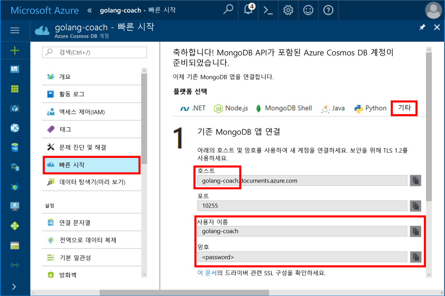
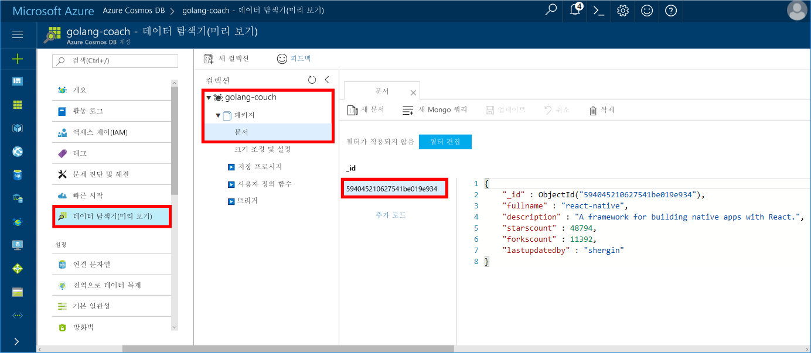

# <a name="azure-cosmos-db-build-a-mongodb-api-console-app-with-golang-and-the-azure-portal"></a><span data-ttu-id="a3f8e-103">Azure Cosmos DB: Golang 및 Azure Portal에서 MongoDB API 콘솔 앱 빌드</span><span class="sxs-lookup"><span data-stu-id="a3f8e-103">Azure Cosmos DB: Build a MongoDB API console app with Golang and the Azure portal</span></span>

<span data-ttu-id="a3f8e-104">Azure Cosmos DB는 전 세계에 배포된 Microsoft의 다중 모델 데이터베이스 서비스입니다.</span><span class="sxs-lookup"><span data-stu-id="a3f8e-104">Azure Cosmos DB is Microsoft’s globally distributed multi-model database service.</span></span> <span data-ttu-id="a3f8e-105">Azure Cosmos DB의 핵심인 전역 배포 및 수평적 크기 조정 기능의 이점을 활용하여 문서, 키/값 및 그래프 데이터베이스를 빠르게 만들고 쿼리할 수 있습니다.</span><span class="sxs-lookup"><span data-stu-id="a3f8e-105">You can quickly create and query document, key/value, and graph databases, all of which benefit from the global distribution and horizontal scale capabilities at the core of Azure Cosmos DB.</span></span>

<span data-ttu-id="a3f8e-106">이 빠른 시작은 [Golang](https://golang.org/)로 작성된 기존의 [MongoDB](https://docs.microsoft.com/en-us/azure/cosmos-db/mongodb-introduction) 앱을 사용하는 방법을 보여주고 MongoDB 클라이언트 연결을 지원하는 Azure Cosmos DB 데이터베이스에 연결합니다.</span><span class="sxs-lookup"><span data-stu-id="a3f8e-106">This quick-start demonstrates how to use an existing [MongoDB](https://docs.microsoft.com/en-us/azure/cosmos-db/mongodb-introduction) app written in [Golang](https://golang.org/) and connect it to your Azure Cosmos DB database, which supports MongoDB client connections.</span></span>

<span data-ttu-id="a3f8e-107">즉, Golang 응용 프로그램은 MongoDB API를 사용하여 데이터베이스에 연결됩니다.</span><span class="sxs-lookup"><span data-stu-id="a3f8e-107">In other words, your Golang application only knows that it's connecting to a database using MongoDB APIs.</span></span> <span data-ttu-id="a3f8e-108">Azure Cosmos DB에 데이터가 저장되는 응용 프로그램에 대해 투명합니다.</span><span class="sxs-lookup"><span data-stu-id="a3f8e-108">It is transparent to the application that the data is stored in Azure Cosmos DB.</span></span>

## <a name="prerequisites"></a><span data-ttu-id="a3f8e-109">필수 조건</span><span class="sxs-lookup"><span data-stu-id="a3f8e-109">Prerequisites</span></span>

- <span data-ttu-id="a3f8e-110">Azure 구독.</span><span class="sxs-lookup"><span data-stu-id="a3f8e-110">An Azure subscription.</span></span> <span data-ttu-id="a3f8e-111">Azure 구독이 아직 없는 경우 시작하기 전에 [무료 계정](https://azure.microsoft.com/free) 을 만듭니다.</span><span class="sxs-lookup"><span data-stu-id="a3f8e-111">If you don’t have an Azure subscription, create a [free account](https://azure.microsoft.com/free) before you begin.</span></span>
- <span data-ttu-id="a3f8e-112">[Go](https://golang.org/dl/) 및 [Go](https://golang.org/) 언어에 대한 기본 지식입니다.</span><span class="sxs-lookup"><span data-stu-id="a3f8e-112">[Go](https://golang.org/dl/) and a basic knowledge of the [Go](https://golang.org/) language.</span></span>
- <span data-ttu-id="a3f8e-113">Jetbrains의 [Gogland](https://www.jetbrains.com/go/), Microsoft의 [Visual Studio Code](https://code.visualstudio.com/) 또는 [Atom](https://atom.io/)과 같은 IDE입니다.</span><span class="sxs-lookup"><span data-stu-id="a3f8e-113">An IDE — [Gogland](https://www.jetbrains.com/go/) by Jetbrains, [Visual Studio Code](https://code.visualstudio.com/) by Microsoft, or [Atom](https://atom.io/).</span></span> <span data-ttu-id="a3f8e-114">이 자습서에서는 Goglang을 사용합니다.</span><span class="sxs-lookup"><span data-stu-id="a3f8e-114">In this tutorial, I'm using Goglang.</span></span>

<a id="create-account"></a>
## <a name="create-a-database-account"></a><span data-ttu-id="a3f8e-115">데이터베이스 계정 만들기</span><span class="sxs-lookup"><span data-stu-id="a3f8e-115">Create a database account</span></span>

[!INCLUDE [cosmos-db-create-dbaccount](../../includes/cosmos-db-create-dbaccount-mongodb.md)]

## <a name="clone-the-sample-application"></a><span data-ttu-id="a3f8e-116">샘플 응용 프로그램 복제</span><span class="sxs-lookup"><span data-stu-id="a3f8e-116">Clone the sample application</span></span>

<span data-ttu-id="a3f8e-117">응용 프로그램 예제를 복제하고 필요한 패키지를 설치합니다.</span><span class="sxs-lookup"><span data-stu-id="a3f8e-117">Clone the sample application and install the required packages.</span></span>

1. <span data-ttu-id="a3f8e-118">GOROOT\src 폴더 안에 CosmosDBSample이라는 폴더를 만듭니다(기본적으로 C:\Go\).</span><span class="sxs-lookup"><span data-stu-id="a3f8e-118">Create a folder named CosmosDBSample inside the GOROOT\src folder, which is C:\Go\ by default.</span></span>
2. <span data-ttu-id="a3f8e-119">git bash와 같은 git 터미널 창을 사용하여 CosmosDBSample 폴더에 샘플 리포지토리를 복제하는 다음 명령을 실행합니다.</span><span class="sxs-lookup"><span data-stu-id="a3f8e-119">Run the following command using a git terminal window such as git bash to clone the sample repository into the CosmosDBSample folder.</span></span> 

    ```bash
    git clone https://github.com/Azure-Samples/azure-cosmos-db-mongodb-golang-getting-started.git
    ```
3.  <span data-ttu-id="a3f8e-120">다음 명령을 실행하여 mgo 패키지를 가져옵니다.</span><span class="sxs-lookup"><span data-stu-id="a3f8e-120">Run the following command to get the mgo package.</span></span> 

    ```
    go get gopkg.in/mgo.v2
    ```

<span data-ttu-id="a3f8e-121">[mgo](http://labix.org/mgo) 드라이버(*망고*라고 읽음)는 표준 Go 코드를 따르는 매우 단순한 API하에서 풍부하고 충분한 테스트를 거쳐 엄선된 기능을 구현하는 [Go 언어](http://golang.org/)용 [MongoDB](http://www.mongodb.org/) 드라이버입니다.</span><span class="sxs-lookup"><span data-stu-id="a3f8e-121">The [mgo](http://labix.org/mgo) driver (pronounced as *mango*) is a [MongoDB](http://www.mongodb.org/) driver for the [Go language](http://golang.org/) that implements a rich and well tested selection of features under a very simple API following standard Go idioms.</span></span>

<a id="connection-string"></a>

## <a name="update-your-connection-string"></a><span data-ttu-id="a3f8e-122">연결 문자열 업데이트</span><span class="sxs-lookup"><span data-stu-id="a3f8e-122">Update your connection string</span></span>

<span data-ttu-id="a3f8e-123">이제 Azure Portal로 다시 이동하여 연결 문자열 정보를 가져와서 앱에 복사합니다.</span><span class="sxs-lookup"><span data-stu-id="a3f8e-123">Now go back to the Azure portal to get your connection string information and copy it into the app.</span></span>

1. <span data-ttu-id="a3f8e-124">왼쪽 탐색 메뉴에서 **빠른 시작**을 클릭한 후 **기타**를 클릭하여 Go 응용 프로그램에 필요한 연결 문자열 정보를 봅니다.</span><span class="sxs-lookup"><span data-stu-id="a3f8e-124">Click **Quick start** in the left navigation menu, and then click **Other** to view the connection string information required by the Go application.</span></span>

2. <span data-ttu-id="a3f8e-125">Goglang에서 GOROOT\CosmosDBSample 디렉터리의 main.go 파일을 열고 다음 스크린샷에 표시된 것처럼 Azure Portal의 연결 문자열 정보를 사용하여 코드의 다음 줄을 업데이트합니다.</span><span class="sxs-lookup"><span data-stu-id="a3f8e-125">In Goglang, open the main.go file in the GOROOT\CosmosDBSample directory and update the following lines of code using the connection string information from the Azure portal as shown in the following screenshot.</span></span> 

    <span data-ttu-id="a3f8e-126">데이터베이스 이름은 Azure Portal 연결 문자열 창의 **Host** 접두사 값입니다.</span><span class="sxs-lookup"><span data-stu-id="a3f8e-126">The Database name is the prefix of the **Host** value in the Azure portal connection string pane.</span></span> <span data-ttu-id="a3f8e-127">아래 이미지에 표시된 계정의 데이터베이스 이름은 golang-coach입니다.</span><span class="sxs-lookup"><span data-stu-id="a3f8e-127">For the account shown in the image below, the Database name is golang-coach.</span></span>

    ```go
    Database: "The prefix of the Host value in the Azure portal",
    Username: "The Username in the Azure portal",
    Password: "The Password in the Azure portal",
    ```

    

3. <span data-ttu-id="a3f8e-129">main.go 파일을 저장합니다.</span><span class="sxs-lookup"><span data-stu-id="a3f8e-129">Save the main.go file.</span></span>

## <a name="review-the-code"></a><span data-ttu-id="a3f8e-130">코드 검토</span><span class="sxs-lookup"><span data-stu-id="a3f8e-130">Review the code</span></span>

<span data-ttu-id="a3f8e-131">main.go에서 어떤 상황이 발생하고 있는지 빠르게 살펴보겠습니다.</span><span class="sxs-lookup"><span data-stu-id="a3f8e-131">Let's make a quick review of what's happening in the main.go file.</span></span> 

### <a name="connecting-the-go-app-to-azure-cosmos-db"></a><span data-ttu-id="a3f8e-132">Go 앱을 Azure Cosmos DB에 연결</span><span class="sxs-lookup"><span data-stu-id="a3f8e-132">Connecting the Go app to Azure Cosmos DB</span></span>

<span data-ttu-id="a3f8e-133">Azure Cosmos DB는 SSL 사용이 가능한 MongoDB를 지원합니다.</span><span class="sxs-lookup"><span data-stu-id="a3f8e-133">Azure Cosmos DB supports the SSL-enabled MongoDB.</span></span> <span data-ttu-id="a3f8e-134">SSL 사용이 가능한 MongoDB에 연결하려면 [mgo.DialInfo](http://gopkg.in/mgo.v2#DialInfo)에서 **DialServer** 함수를 정의하고 [tls.*Dial*](http://golang.org/pkg/crypto/tls#Dial) 함수를 사용하여 연결을 수행해야 합니다.</span><span class="sxs-lookup"><span data-stu-id="a3f8e-134">To connect to an SSL-enabled MongoDB, you need to define the **DialServer** function in [mgo.DialInfo](http://gopkg.in/mgo.v2#DialInfo), and make use of the [tls.*Dial*](http://golang.org/pkg/crypto/tls#Dial) function to perform the connection.</span></span>

<span data-ttu-id="a3f8e-135">다음 Golang 코드 조각은 Azure Cosmos DB MongoDB API와 Go 앱을 연결합니다.</span><span class="sxs-lookup"><span data-stu-id="a3f8e-135">The following Golang code snippet connects the Go app with Azure Cosmos DB MongoDB API.</span></span> <span data-ttu-id="a3f8e-136">*DialInfo* 클래스는 MongoDB 클러스터와의 세션을 설정하는 옵션을 포함합니다.</span><span class="sxs-lookup"><span data-stu-id="a3f8e-136">The *DialInfo* class holds options for establishing a session with a MongoDB cluster.</span></span>

```go
// DialInfo holds options for establishing a session with a MongoDB cluster.
dialInfo := &mgo.DialInfo{
    Addrs:    []string{"golang-couch.documents.azure.com:10255"}, // Get HOST + PORT
    Timeout:  60 * time.Second,
    Database: "database", // It can be anything
    Username: "username", // Username
    Password: "Azure database connect password from Azure Portal", // PASSWORD
    DialServer: func(addr *mgo.ServerAddr) (net.Conn, error) {
        return tls.Dial("tcp", addr.String(), &tls.Config{})
    },
}

// Create a session which maintains a pool of socket connections
// to our Azure Cosmos DB MongoDB database.
session, err := mgo.DialWithInfo(dialInfo)

if err != nil {
    fmt.Printf("Can't connect to mongo, go error %v\n", err)
    os.Exit(1)
}

defer session.Close()

// SetSafe changes the session safety mode.
// If the safe parameter is nil, the session is put in unsafe mode, 
// and writes become fire-and-forget,
// without error checking. The unsafe mode is faster since operations won't hold on waiting for a confirmation.
// 
session.SetSafe(&mgo.Safe{})
```

<span data-ttu-id="a3f8e-137">**mgo.Dial()** 메서드는 SSL 연결이 없을 때 사용됩니다.</span><span class="sxs-lookup"><span data-stu-id="a3f8e-137">The **mgo.Dial()** method is used when there is no SSL connection.</span></span> <span data-ttu-id="a3f8e-138">SSL 연결을 위해서는 **mgo.DialWithInfo()** 메서드가 필요합니다.</span><span class="sxs-lookup"><span data-stu-id="a3f8e-138">For an SSL connection, the **mgo.DialWithInfo()** method is required.</span></span>

<span data-ttu-id="a3f8e-139">**DialWIthInfo{}** 개체 인스턴스는 세션 개체를 만드는 데 사용됩니다.</span><span class="sxs-lookup"><span data-stu-id="a3f8e-139">An instance of the **DialWIthInfo{}** object is used to create the session object.</span></span> <span data-ttu-id="a3f8e-140">세션이 설정되면 다음 코드 조각을 사용하여 컬렉션에 액세스할 수 있습니다.</span><span class="sxs-lookup"><span data-stu-id="a3f8e-140">Once the session is established, you can access the collection by using the following code snippet:</span></span>

```go
collection := session.DB(“database”).C(“package”)
```

<a id="create-document"></a>

### <a name="create-a-document"></a><span data-ttu-id="a3f8e-141">문서 만들기</span><span class="sxs-lookup"><span data-stu-id="a3f8e-141">Create a document</span></span>

```go
// Model
type Package struct {
    Id bson.ObjectId  `bson:"_id,omitempty"`
    FullName      string
    Description   string
    StarsCount    int
    ForksCount    int
    LastUpdatedBy string
}

// insert Document in collection
err = collection.Insert(&Package{
    FullName:"react",
    Description:"A framework for building native apps with React.",
    ForksCount: 11392,
    StarsCount:48794,
    LastUpdatedBy:"shergin",

})

if err != nil {
    log.Fatal("Problem inserting data: ", err)
    return
}
```

### <a name="query-or-read-a-document"></a><span data-ttu-id="a3f8e-142">문서 쿼리 또는 읽기</span><span class="sxs-lookup"><span data-stu-id="a3f8e-142">Query or read a document</span></span>

<span data-ttu-id="a3f8e-143">Azure Cosmos DB는 각 컬렉션에 저장된 JSON 문서에 대해 다양한 쿼리를 지원합니다.</span><span class="sxs-lookup"><span data-stu-id="a3f8e-143">Azure Cosmos DB supports rich queries against JSON documents stored in each collection.</span></span> <span data-ttu-id="a3f8e-144">다음 샘플 코드에서는 컬렉션에는 문서에 대해 실행할 수 있는 쿼리를 보여줍니다.</span><span class="sxs-lookup"><span data-stu-id="a3f8e-144">The following sample code shows a query that you can run against the documents in your collection.</span></span>

```go
// Get a Document from the collection
result := Package{}
err = collection.Find(bson.M{"fullname": "react"}).One(&result)
if err != nil {
    log.Fatal("Error finding record: ", err)
    return
}

fmt.Println("Description:", result.Description)
```


### <a name="update-a-document"></a><span data-ttu-id="a3f8e-145">문서 업데이트</span><span class="sxs-lookup"><span data-stu-id="a3f8e-145">Update a document</span></span>

```go
// Update a document
updateQuery := bson.M{"_id": result.Id}
change := bson.M{"$set": bson.M{"fullname": "react-native"}}
err = collection.Update(updateQuery, change)
if err != nil {
    log.Fatal("Error updating record: ", err)
    return
}
```

### <a name="delete-a-document"></a><span data-ttu-id="a3f8e-146">문서 삭제</span><span class="sxs-lookup"><span data-stu-id="a3f8e-146">Delete a document</span></span>

<span data-ttu-id="a3f8e-147">Azure Cosmos DB는 JSON 문서 삭제를 지원합니다.</span><span class="sxs-lookup"><span data-stu-id="a3f8e-147">Azure Cosmos DB supports deleting JSON documents.</span></span>

```go
// Delete a document
query := bson.M{"_id": result.Id}
err = collection.Remove(query)
if err != nil {
   log.Fatal("Error deleting record: ", err)
   return
}
```
    
## <a name="run-the-app"></a><span data-ttu-id="a3f8e-148">앱 실행</span><span class="sxs-lookup"><span data-stu-id="a3f8e-148">Run the app</span></span>

1. <span data-ttu-id="a3f8e-149">Goglang에서 GOPATH(**파일**, **설정**, **Go**, **GOPATH**에 있음)에 gopkg가 설치된 위치(기본적으로 USERPROFILE\go)가 포함되어 있는지 확인합니다.</span><span class="sxs-lookup"><span data-stu-id="a3f8e-149">In Goglang, ensure that your GOPATH (available under **File**, **Settings**, **Go**, **GOPATH**) include the location in which the gopkg was installed, which is USERPROFILE\go by default.</span></span> 
2. <span data-ttu-id="a3f8e-150">앱을 실행한 후 문서를 볼 수 있도록 문서를 삭제하는 줄(91-96번 줄)을 주석으로 처리합니다.</span><span class="sxs-lookup"><span data-stu-id="a3f8e-150">Comment out the lines that delete the document, lines 91-96, so that you can see the document after running the app.</span></span>
3. <span data-ttu-id="a3f8e-151">Goglang에서 **실행**을 클릭한 후 **'main.go 빌드 및 실행' 실행**을 클릭합니다.</span><span class="sxs-lookup"><span data-stu-id="a3f8e-151">In Goglang, click **Run**, and then click **Run 'Build main.go and run'**.</span></span>

    <span data-ttu-id="a3f8e-152">앱이 종료되고 [문서 만들기](#create-document)에서 만든 문서에 대한 설명이 표시됩니다.</span><span class="sxs-lookup"><span data-stu-id="a3f8e-152">The app finishes and displays the description of the document created in [Create a document](#create-document).</span></span>
    
    ```
    Description: A framework for building native apps with React.
    
    Process finished with exit code 0
    ```

    
    
## <a name="review-your-document-in-data-explorer"></a><span data-ttu-id="a3f8e-154">데이터 탐색기에서 문서 검토</span><span class="sxs-lookup"><span data-stu-id="a3f8e-154">Review your document in Data Explorer</span></span>

<span data-ttu-id="a3f8e-155">Azure Portal로 돌아가서 데이터 탐색기에서 문서를 확인합니다.</span><span class="sxs-lookup"><span data-stu-id="a3f8e-155">Go back to the Azure portal to see your document in Data Explorer.</span></span>

1. <span data-ttu-id="a3f8e-156">왼쪽 탐색 메뉴에서 **데이터 탐색기(미리 보기)**를 클릭하고 **golang-coach**, **package**를 확장한 후 **문서**를 클릭합니다.</span><span class="sxs-lookup"><span data-stu-id="a3f8e-156">Click **Data Explorer (Preview)** in the left navigation menu, expand **golang-coach**, **package**, and then click **Documents**.</span></span> <span data-ttu-id="a3f8e-157">**문서** 탭에서 \_id를 클릭하면 오른쪽 창에 문서가 표시됩니다.</span><span class="sxs-lookup"><span data-stu-id="a3f8e-157">In the **Documents** tab, click the \_id to display the document in the right pane.</span></span> 

    
    
2. <span data-ttu-id="a3f8e-159">그러면 문서를 인라인으로 작업하고 **업데이트**를 클릭하여 저장할 수 있습니다.</span><span class="sxs-lookup"><span data-stu-id="a3f8e-159">You can then work with the document inline and click **Update** to save it.</span></span> <span data-ttu-id="a3f8e-160">또한 문서를 삭제하거나 새 문서 또는 쿼리를 만들 수 있습니다.</span><span class="sxs-lookup"><span data-stu-id="a3f8e-160">You can also delete the document, or create new documents or queries.</span></span>

## <a name="review-slas-in-the-azure-portal"></a><span data-ttu-id="a3f8e-161">Azure Portal에서 SLA 검토</span><span class="sxs-lookup"><span data-stu-id="a3f8e-161">Review SLAs in the Azure portal</span></span>

[!INCLUDE [cosmosdb-tutorial-review-slas](../../includes/cosmos-db-tutorial-review-slas.md)]

## <a name="clean-up-resources"></a><span data-ttu-id="a3f8e-162">리소스 정리</span><span class="sxs-lookup"><span data-stu-id="a3f8e-162">Clean up resources</span></span>

<span data-ttu-id="a3f8e-163">이 앱을 계속 사용하지 않으려면 Azure Portal에서 다음 단계에 따라 이 빠른 시작에서 만든 리소스를 모두 삭제합니다.</span><span class="sxs-lookup"><span data-stu-id="a3f8e-163">If you're not going to continue to use this app, delete all resources created by this quickstart in the Azure portal with the following steps:</span></span>

1. <span data-ttu-id="a3f8e-164">Azure Portal의 왼쪽 메뉴에서 **리소스 그룹**을 클릭한 다음 만든 리소스의 이름을 클릭합니다.</span><span class="sxs-lookup"><span data-stu-id="a3f8e-164">From the left-hand menu in the Azure portal, click **Resource groups** and then click the name of the resource you created.</span></span> 
2. <span data-ttu-id="a3f8e-165">리소스 그룹 페이지에서 **삭제**를 클릭하고 텍스트 상자에서 삭제할 리소스의 이름을 입력한 다음 **삭제**를 클릭합니다.</span><span class="sxs-lookup"><span data-stu-id="a3f8e-165">On your resource group page, click **Delete**, type the name of the resource to delete in the text box, and then click **Delete**.</span></span>

## <a name="next-steps"></a><span data-ttu-id="a3f8e-166">다음 단계</span><span class="sxs-lookup"><span data-stu-id="a3f8e-166">Next steps</span></span>

<span data-ttu-id="a3f8e-167">이 빠른 시작에서는 Azure Cosmos DB 계정을 만들고, MongoDB의 API를 사용하여 Golang 앱을 실행하는 방법을 알아보았습니다.</span><span class="sxs-lookup"><span data-stu-id="a3f8e-167">In this quickstart, you've learned how to create an Azure Cosmos DB account and run a Golang app using the API for MongoDB.</span></span> <span data-ttu-id="a3f8e-168">이제 사용자의 Cosmos DB 계정에 추가 데이터를 가져올 수 있습니다.</span><span class="sxs-lookup"><span data-stu-id="a3f8e-168">You can now import additional data to your Cosmos DB account.</span></span> 

> [!div class="nextstepaction"]
> [<span data-ttu-id="a3f8e-169">MongoDB API용 Azure Cosmos DB로 데이터 가져오기</span><span class="sxs-lookup"><span data-stu-id="a3f8e-169">Import data into Azure Cosmos DB for the MongoDB API</span></span>](mongodb-migrate.md)
