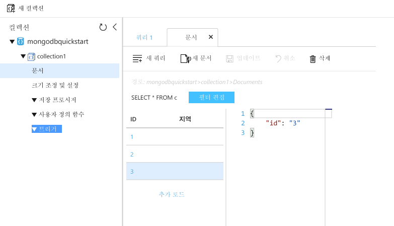

# <a name="azure-cosmos-db-migrate-an-existing-nodejs-mongodb-web-app"></a>Azure Cosmos DB: 기존 Node.js MongoDB 웹앱 마이그레이션 

Azure Cosmos DB는 전 세계에 배포된 Microsoft의 다중 모델 데이터베이스 서비스입니다. 신속 하 게 만들기 및 문서, 키/값 및 hello 글로벌 배포 및 수평 확장이 기능 Cosmos DB Azure의 hello 핵심에에서 활용 중 일부는 그래프 데이터베이스를 쿼리할 수 있습니다. 

이 빠른 시작에서는 방법을 기존 toouse [MongoDB](mongodb-introduction.md) Node.js로 작성 된 응용 MongoDB 클라이언트 연결을 지 원하는 tooyour Azure Cosmos DB 데이터베이스를 연결 합니다. 즉, Node.js 응용 프로그램 연결 하는 MongoDB Api를 사용 하 여 tooa 데이터베이스만 알고 있습니다. 투명 데이터 hello toohello 응용 Azure Cosmos DB에 저장 됩니다.

완료하고 나면 MEAN 응용 프로그램(MongoDB, Express, AngularJS 및 Node.js)이 [Azure Cosmos DB](https://azure.microsoft.com/services/cosmos-db/)에서 실행됩니다. 


[!INCLUDE [cloud-shell-try-it](../../includes/cloud-shell-try-it.md)]

Tooinstall를 선택 하 고 로컬로 hello CLI를 사용 하 여이 항목 2.0 이상에 hello Azure CLI 버전을 실행 중인 필요 합니다. 실행 `az --version` toofind hello 버전입니다. Tooinstall 또는 업그레이드를 보려면 참고 [Azure CLI 2.0 설치]( /cli/azure/install-azure-cli)합니다. 

## <a name="prerequisites"></a>필수 조건 
또한 CLI tooAzure 필요 [Node.js](https://nodejs.org/) 및 [Git](http://www.git-scm.com/downloads) toorun 로컬로 설치 `npm` 및 `git` 명령입니다.

Node.js에 대한 실무 지식이 있어야 합니다. 이 퀵 스타트의 의도 한 toohelp 일반적 Node.js 응용 프로그램을 개발 있습니다.

## <a name="clone-hello-sample-application"></a>Hello 샘플 응용 프로그램 복제

예: git bash git 터미널 윈도우를 열고 및 `cd` tooa 작업 디렉터리입니다.  

다음 명령을 tooclone hello 샘플 리포지토리 hello를 실행 합니다. 이 샘플 리포지토리 포함 hello 기본 [MEAN.js](http://meanjs.org/) 응용 프로그램입니다. 

```bash
git clone https://github.com/prashanthmadi/mean
```

## <a name="run-hello-application"></a>Hello 응용 프로그램 실행

Hello 필요한 패키지를 설치 하 고 hello 응용 프로그램을 시작 합니다.

```bash
cd mean
npm install
npm start
```

## <a name="log-in-tooazure"></a>TooAzure 로그인

Tooyour hello로 Azure 구독에에서는 설치 된 Azure CLI를 사용 하는 경우 로그인 [az 로그인](/cli/azure/#login) 명령 열고 지시를 따른 hello 화면에 표시 합니다. Azure 클라우드 셸 hello를 사용 하 여이 단계를 건너뛸 수 있습니다.

```azurecli
az login 
``` 
   
## <a name="add-hello-azure-cosmos-db-module"></a>Hello Azure Cosmos DB 모듈 추가

설치 된 Azure CLI를 사용 하는 경우 확인 toosee 경우 hello `cosmosdb` hello를 실행 하 여 구성 요소가 이미 설치 되어 `az` 명령입니다. 경우 `cosmosdb` 에 기본 명령 목록이 hello, toohello 다음 명령을 진행 합니다. Azure 클라우드 셸 hello를 사용 하 여이 단계를 건너뛸 수 있습니다.

경우 `cosmosdb` 기본 명령 목록이 hello를 다시 설치에 없으면 [Azure CLI 2.0]( /cli/azure/install-azure-cli)합니다.

## <a name="create-a-resource-group"></a>리소스 그룹 만들기

만들기는 [리소스 그룹](../azure-resource-manager/resource-group-overview.md) hello로 [az 그룹 만들기](/cli/azure/group#create)합니다. Azure 리소스 그룹은 웹앱, 데이터베이스, 저장소 계정이 관리되었는지 등 Azure 리소스가 배포 및 관리되는 논리적 컨테이너입니다. 

hello 다음 예제에서는 리소스 그룹 hello 서 부 유럽 지역에서 Hello 리소스 그룹에 대 한 고유한 이름을 선택 합니다.

Azure 클라우드 셸을 사용 하는 경우 클릭 **시도**를 hello 화면에 나타나는 메시지 toologin에 따라 다음 hello 명령을 hello 명령 프롬프트에 복사 합니다.

```azurecli-interactive
az group create --name myResourceGroup --location "West Europe"
```

## <a name="create-an-azure-cosmos-db-account"></a>Azure Cosmos DB 계정 만들기

Hello Azure Cosmos DB 계정을 만들고 [az cosmosdb 만들](/cli/azure/cosmosdb#create) 명령입니다.

Hello에 다음 명령을, 하십시오 직접 고유한 Azure Cosmos DB 계정 이름을 대체 hello 나타나는 `<cosmosdb-name>` 자리 표시자입니다. 이 고유 이름이 Azure Cosmos DB 끝점의 일부로 사용될지 (`https://<cosmosdb-name>.documents.azure.com/`) hello 이름 해야 toobe 고유 Azure의 모든 Azure Cosmos DB 계정에서 합니다. 

```azurecli-interactive
az cosmosdb create --name <cosmosdb-name> --resource-group myResourceGroup --kind MongoDB
```

hello `--kind MongoDB` MongoDB 클라이언트 연결 매개 변수를 사용 합니다.

Hello Azure Cosmos DB 계정이 만들어지면 hello Azure CLI 정보 비슷한 toohello 다음 예제에 표시 됩니다. 

> [!NOTE]
> 이 예제에서는 hello 기본 설정인 hello Azure CLI 출력 형식으로 JSON을 사용 합니다. 다른 출력 toouse, 참조 형식 [출력 Azure CLI 2.0 명령에 대 한 형식](https://docs.microsoft.com/cli/azure/format-output-azure-cli)합니다.

```json
{
  "databaseAccountOfferType": "Standard",
  "documentEndpoint": "https://<cosmosdb-name>.documents.azure.com:443/",
  "id": "/subscriptions/00000000-0000-0000-0000-000000000000/resourceGroups/myResourceGroup/providers/Microsoft.Document
DB/databaseAccounts/<cosmosdb-name>",
  "kind": "MongoDB",
  "location": "West Europe",
  "name": "<cosmosdb-name>",
  "readLocations": [
    {
      "documentEndpoint": "https://<cosmosdb-name>-westeurope.documents.azure.com:443/",
      "failoverPriority": 0,
      "id": "<cosmosdb-name>-westeurope",
      "locationName": "West Europe",
      "provisioningState": "Succeeded"
    }
  ],
  "resourceGroup": "myResourceGroup",
  "type": "Microsoft.DocumentDB/databaseAccounts",
  "writeLocations": [
    {
      "documentEndpoint": "https://<cosmosdb-name>-westeurope.documents.azure.com:443/",
      "failoverPriority": 0,
      "id": "<cosmosdb-name>-westeurope",
      "locationName": "West Europe",
      "provisioningState": "Succeeded"
    }
  ]
} 
```

## <a name="connect-your-nodejs-application-toohello-database"></a>Node.js 응용 프로그램 toohello 데이터베이스 연결

이 단계에서는 방금 만든 MongoDB 연결 문자열을 사용 하 여 MEAN.js 샘플 응용 프로그램 tooan Azure Cosmos DB 데이터베이스를 연결 합니다. 

<a name="devconfig"></a>
## <a name="configure-hello-connection-string-in-your-nodejs-application"></a>Node.js 응용 프로그램에서 hello 연결 문자열을 구성 합니다.

MEAN.js 리포지토리에서 `config/env/local-development.js`를 엽니다.

이 파일의 내용을 hello 코드 다음 hello로 대체 합니다. Tooalso hello 2를 대체 해야 `<cosmosdb-name>` Azure Cosmos DB 계정 이름의 자리 표시자입니다.

```javascript
'use strict';

module.exports = {
  db: {
    uri: 'mongodb://<cosmosdb-name>:<primary_master_key>@<cosmosdb-name>.documents.azure.com:10255/mean-dev?ssl=true&sslverifycertificate=false'
  }
};
```

## <a name="retrieve-hello-key"></a>Hello 키 검색

주문 tooconnect tooan Azure Cosmos DB 데이터베이스 hello 데이터베이스 키가 필요 합니다. 사용 하 여 hello [키 나열 az cosmosdb](/cli/azure/cosmosdb#list-keys) 명령 tooretrieve hello에 대 한 기본 키입니다.

```azurecli-interactive
az cosmosdb list-keys --name <cosmosdb-name> --resource-group myResourceGroup --query "primaryMasterKey"
```

hello Azure CLI 정보 비슷한 toohello 다음 예제를 출력 합니다. 

```json
"RUayjYjixJDWG5xTqIiXjC..."
```

hello 값을 복사 `primaryMasterKey`합니다. Hello이 붙여 `<primary_master_key>` 에서 `local-development.js`합니다.

변경 내용을 저장합니다.

### <a name="run-hello-application-again"></a>Hello 응용 프로그램을 다시 실행 합니다.

`npm start`을 다시 실행합니다. 

```bash
npm start
```

콘솔 메시지 이제 알려 주어 야 해당 hello 개발 환경에서 실행 되 고 있습니다. 

너무 이동`http://localhost:3000` 브라우저에서 합니다. 클릭 **등록** hello 최상위 메뉴와 시도 toocreate에 사용자가 더미 두 합니다. 

hello MEAN.js 샘플 응용 프로그램 hello 데이터베이스에 사용자 데이터를 저장합니다. 성공한 MEAN.js에 자동으로 로그인 할 hello 사용자를 만든 경우 Azure Cosmos DB 연결이 작동 합니다. 


## <a name="view-data-in-data-explorer"></a>데이터 탐색기에서 데이터 보기

Azure Cosmos DB에서 저장 된 데이터를 사용할 수 있는 tooview, 쿼리 및 비즈니스 논리 실행된에서 켜져 hello Azure 포털.

tooview, 쿼리 및 로그인 toohello hello 이전 단계에서 만든 hello 사용자 데이터로 작업 [Azure 포털](https://portal.azure.com) 웹 브라우저에서 합니다.

Hello 최상위 검색 상자에 Azure Cosmos DB를 입력 합니다. Cosmos DB 계정 블레이드가 열리면 Cosmos DB 계정을 선택합니다. 왼쪽 탐색 hello, 데이터 탐색기를 클릭 합니다. Hello 모음 창에서 컬렉션을 확장 한 다음 수 hello 컬렉션, 쿼리 hello 데이터의에서 hello 문서를 표시 하 고도 만들고 저장된 프로시저, 트리거 및 Udf를 실행 합니다. 




## <a name="deploy-hello-nodejs-application-tooazure"></a>Hello Node.js 응용 프로그램 tooAzure 배포

이 단계에서는 Node.js MongoDB에 연결 된 응용 프로그램 tooAzure Cosmos DB 배포할 수 있습니다.

Hello 개발 환경에 대 한 이전 변경 된 hello 구성 파일은 단어로 (`/config/env/local-development.js`). 사용자 응용 프로그램 tooApp 서비스를 배포 하면 기본적으로 hello 프로덕션 환경에서 실행 됩니다. 이제 toomake hello 필요한 동일 toohello 각 구성 파일을 변경 합니다.

MEAN.js 리포지토리에서 `config/env/production.js`를 엽니다.

Hello에 `db` 개체, hello 값의 대체 `uri` 같이 다음 예에서는 hello 합니다. 있는지 tooreplace hello 자리 표시자로 전에 수 있습니다.

```javascript
'mongodb://<cosmosdb-name>:<primary_master_key>@<cosmosdb-name>.documents.azure.com:10255/mean?ssl=true&sslverifycertificate=false',
```

> [!NOTE] 
> hello `ssl=true` 옵션은 중요 하기 때문에 [Azure Cosmos DB에 SSL이 필요한](connect-mongodb-account.md#connection-string-requirements)합니다. 
>
>

Hello 터미널, Git에 모든 변경 내용을 커밋하십시오. 두 명령 toorun 복사할 수는 있지만 함께 합니다.

```bash
git add .
git commit -m "configured MongoDB connection string"
```
## <a name="clean-up-resources"></a>리소스 정리

것 toocontinue toouse이 응용이 프로그램을 만들이 빠른 시작 하 여 hello Azure 포털에서에서 단계를 수행 하는 hello로 리소스를 모두 삭제:

1. Hello Azure 포털에서에서 왼쪽 메뉴 hello에서에서 클릭 **리소스 그룹** 만든 hello 리소스의 hello 이름을 클릭 하 고 있습니다. 
2. 리소스 그룹 페이지에서 클릭 **삭제**hello 텍스트 상자에 hello 리소스 toodelete의 hello 이름을 입력 한 다음 클릭 **삭제**합니다.

## <a name="next-steps"></a>다음 단계

이 빠른 시작에서 배운 어떻게 toocreate Azure Cosmos DB 계정 및 hello 데이터 탐색기를 사용 하 여 MongoDB 컬렉션을 만듭니다. 이제 MongoDB 데이터 tooAzure Cosmos DB를 마이그레이션할 수 있습니다.  

> [!div class="nextstepaction"]
> [Azure Cosmos DB로 MongoDB 데이터 가져오기](mongodb-migrate.md)
