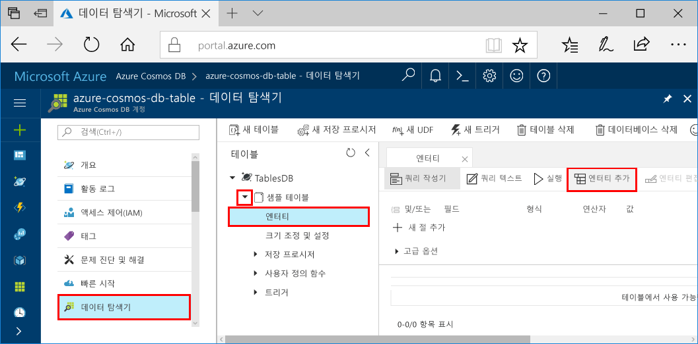

# <a name="azure-cosmos-db-build-a-net-application-using-hello-table-api"></a><span data-ttu-id="a5d25-103">Azure Cosmos DB: hello 테이블 API를 사용 하 여.NET 응용 프로그램 빌드</span><span class="sxs-lookup"><span data-stu-id="a5d25-103">Azure Cosmos DB: Build a .NET application using hello Table API</span></span>

<span data-ttu-id="a5d25-104">Azure Cosmos DB는 전 세계에 배포된 Microsoft의 다중 모델 데이터베이스 서비스입니다.</span><span class="sxs-lookup"><span data-stu-id="a5d25-104">Azure Cosmos DB is Microsoft’s globally distributed multi-model database service.</span></span> <span data-ttu-id="a5d25-105">신속 하 게 만들기 및 문서, 키/값 및 hello 글로벌 배포 및 수평 확장이 기능 Cosmos DB Azure의 hello 핵심에에서 활용 중 일부는 그래프 데이터베이스를 쿼리할 수 있습니다.</span><span class="sxs-lookup"><span data-stu-id="a5d25-105">You can quickly create and query document, key/value, and graph databases, all of which benefit from hello global distribution and horizontal scale capabilities at hello core of Azure Cosmos DB.</span></span> 

<span data-ttu-id="a5d25-106">이 빠른 시작에서는 방법을 toocreate Azure Cosmos DB 계정을 한 hello Azure 포털을 사용 하 여 해당 계정 내에서 테이블을 만듭니다.</span><span class="sxs-lookup"><span data-stu-id="a5d25-106">This quick start demonstrates how toocreate an Azure Cosmos DB account, and create a table within that account using hello Azure portal.</span></span> <span data-ttu-id="a5d25-107">그런 다음 코드 tooinsert, update 및 delete 엔터티를 작성 하 고 새 hello를 사용 하 여 일부 쿼리를 실행 합니다 [Windows Azure 저장소 프리미엄 테이블](https://aka.ms/premiumtablenuget) 에서 NuGet 패키지 (미리 보기).</span><span class="sxs-lookup"><span data-stu-id="a5d25-107">You'll then write code tooinsert, update, and delete entities, and run some queries using hello new [Windows Azure Storage Premium Table](https://aka.ms/premiumtablenuget) (preview) package from NuGet.</span></span> <span data-ttu-id="a5d25-108">이 라이브러리에 hello 동일한 클래스와 메서드 시그니처에 hello 공용으로 [Windows Azure 저장소 SDK](https://www.nuget.org/packages/WindowsAzure.Storage), 하지만 또한 hello를 사용 하 여 hello 기능 tooconnect tooAzure Cosmos DB 계정을 [테이블 API](table-introduction.md) (미리 보기).</span><span class="sxs-lookup"><span data-stu-id="a5d25-108">This library has hello same classes and method signatures as hello public [Windows Azure Storage SDK](https://www.nuget.org/packages/WindowsAzure.Storage), but also has hello ability tooconnect tooAzure Cosmos DB accounts using hello [Table API](table-introduction.md) (preview).</span></span> 

## <a name="prerequisites"></a><span data-ttu-id="a5d25-109">필수 조건</span><span class="sxs-lookup"><span data-stu-id="a5d25-109">Prerequisites</span></span>

<span data-ttu-id="a5d25-110">설치 된 Visual Studio 2017 없는 경우 다운로드 하 고 hello를 사용 하 여 수 **무료** [Visual Studio 2017 Community Edition](https://www.visualstudio.com/downloads/)합니다.</span><span class="sxs-lookup"><span data-stu-id="a5d25-110">If you don’t already have Visual Studio 2017 installed, you can download and use hello **free** [Visual Studio 2017 Community Edition](https://www.visualstudio.com/downloads/).</span></span> <span data-ttu-id="a5d25-111">사용할 수 있는지 확인 **Azure 개발** hello Visual Studio 설정 중입니다.</span><span class="sxs-lookup"><span data-stu-id="a5d25-111">Make sure that you enable **Azure development** during hello Visual Studio setup.</span></span>

[!INCLUDE [quickstarts-free-trial-note](../../includes/quickstarts-free-trial-note.md)]

## <a name="create-a-database-account"></a><span data-ttu-id="a5d25-112">데이터베이스 계정 만들기</span><span class="sxs-lookup"><span data-stu-id="a5d25-112">Create a database account</span></span>

[!INCLUDE [cosmos-db-create-dbaccount-table](../../includes/cosmos-db-create-dbaccount-table.md)]

## <a name="add-a-table"></a><span data-ttu-id="a5d25-113">테이블 추가</span><span class="sxs-lookup"><span data-stu-id="a5d25-113">Add a table</span></span>

[!INCLUDE [cosmos-db-create-table](../../includes/cosmos-db-create-table.md)]

## <a name="add-sample-data"></a><span data-ttu-id="a5d25-114">샘플 데이터 추가</span><span class="sxs-lookup"><span data-stu-id="a5d25-114">Add sample data</span></span>

<span data-ttu-id="a5d25-115">이제 데이터 탐색기 (미리 보기)를 사용 하 여 데이터 tooyour 새 테이블을 추가할 수 있습니다.</span><span class="sxs-lookup"><span data-stu-id="a5d25-115">You can now add data tooyour new table using Data Explorer (Preview).</span></span>

1. <span data-ttu-id="a5d25-116">데이터 탐색기에서 **sample-table**, **엔터티**를 클릭한 다음 **엔터티 추가**를 클릭합니다.</span><span class="sxs-lookup"><span data-stu-id="a5d25-116">In Data Explorer, expand **sample-table**, click **Entities**, and then click **Add Entity**.</span></span>

   
2. <span data-ttu-id="a5d25-118">이제 데이터 toohello PartitionKey 값 상자 및 RowKey 값 상자에 추가 하 고 클릭 **엔터티 추가**합니다.</span><span class="sxs-lookup"><span data-stu-id="a5d25-118">Now add data toohello PartitionKey value box and RowKey value box, and click **Add Entity**.</span></span>

   
  
    <span data-ttu-id="a5d25-120">있습니다 수 이제 더 많은 엔터티 tooyour 테이블 추가, 엔터티를 편집 하거나 데이터 탐색기에서 데이터를 쿼리 합니다.</span><span class="sxs-lookup"><span data-stu-id="a5d25-120">You can now add more entities tooyour table, edit your entities, or query your data in Data Explorer.</span></span> <span data-ttu-id="a5d25-121">데이터 탐색기 처리량의 크기를 조정 하 고 저장된 프로시저, 사용자 정의 함수 및 트리거 tooyour 테이블을 추가할 수 있는 이기도 합니다.</span><span class="sxs-lookup"><span data-stu-id="a5d25-121">Data Explorer is also where you can scale your throughput and add stored procedures, user defined functions, and triggers tooyour table.</span></span>

## <a name="clone-hello-sample-application"></a><span data-ttu-id="a5d25-122">Hello 샘플 응용 프로그램 복제</span><span class="sxs-lookup"><span data-stu-id="a5d25-122">Clone hello sample application</span></span>

<span data-ttu-id="a5d25-123">이제 보겠습니다 테이블 앱 github hello 연결 문자열을 설정 하 고 실행을 복제 합니다.</span><span class="sxs-lookup"><span data-stu-id="a5d25-123">Now let's clone a Table app from github, set hello connection string, and run it.</span></span> <span data-ttu-id="a5d25-124">얼마나 쉬운지 데이터로 toowork 프로그래밍 방식으로 표시 됩니다.</span><span class="sxs-lookup"><span data-stu-id="a5d25-124">You'll see how easy it is toowork with data programmatically.</span></span> 

1. <span data-ttu-id="a5d25-125">예: git bash git 터미널 윈도우를 열고 및 `cd` tooa 작업 디렉터리입니다.</span><span class="sxs-lookup"><span data-stu-id="a5d25-125">Open a git terminal window, such as git bash, and `cd` tooa working directory.</span></span>  

2. <span data-ttu-id="a5d25-126">다음 명령은 tooclone hello 샘플 리포지토리 hello를 실행 합니다.</span><span class="sxs-lookup"><span data-stu-id="a5d25-126">Run hello following command tooclone hello sample repository.</span></span> 

    ```bash
    git clone https://github.com/Azure-Samples/azure-cosmos-db-table-dotnet-getting-started.git
    ```

3. <span data-ttu-id="a5d25-127">그런 다음 Visual Studio에서 hello 솔루션 파일을 엽니다.</span><span class="sxs-lookup"><span data-stu-id="a5d25-127">Then open hello solution file in Visual Studio.</span></span> 

## <a name="review-hello-code"></a><span data-ttu-id="a5d25-128">Hello 코드 검토</span><span class="sxs-lookup"><span data-stu-id="a5d25-128">Review hello code</span></span>

<span data-ttu-id="a5d25-129">Hello 앱에서 일어나는 빠르게 검토를 만들어 보겠습니다.</span><span class="sxs-lookup"><span data-stu-id="a5d25-129">Let's make a quick review of what's happening in hello app.</span></span> <span data-ttu-id="a5d25-130">다음 코드이 줄을 만든다고 hello Azure Cosmos DB 리소스 열기 hello Program.cs 파일을 찾을 수입니다.</span><span class="sxs-lookup"><span data-stu-id="a5d25-130">Open hello Program.cs file and you'll find that these lines of code create hello Azure Cosmos DB resources.</span></span> 

* <span data-ttu-id="a5d25-131">hello CloudTableClient 초기화 됩니다.</span><span class="sxs-lookup"><span data-stu-id="a5d25-131">hello CloudTableClient is initialized.</span></span>

    ```csharp
    CloudStorageAccount storageAccount = CloudStorageAccount.Parse(connectionString); 
    CloudTableClient tableClient = storageAccount.CreateCloudTableClient();
    ```

* <span data-ttu-id="a5d25-132">새 테이블이 존재하지 않는 경우 만들어집니다.</span><span class="sxs-lookup"><span data-stu-id="a5d25-132">A new table is created if it does not exist.</span></span>

    ```csharp
    CloudTable table = tableClient.GetTableReference("people");
    table.CreateIfNotExists();
    ```

* <span data-ttu-id="a5d25-133">새 테이블 컨테이너가 만들어집니다.</span><span class="sxs-lookup"><span data-stu-id="a5d25-133">A new Table container is created.</span></span> <span data-ttu-id="a5d25-134">이 코드와 매우 유사 tooregular Azure 테이블 저장소 SDK 확인할 수 있습니다.</span><span class="sxs-lookup"><span data-stu-id="a5d25-134">You will notice this code very similar tooregular Azure Table storage SDK.</span></span> 

    ```csharp
    CustomerEntity item = new CustomerEntity()
                {
                    PartitionKey = Guid.NewGuid().ToString(),
                    RowKey = Guid.NewGuid().ToString(),
                    Email = $"{GetRandomString(6)}@contoso.com",
                    PhoneNumber = "425-555-0102",
                    Bio = GetRandomString(1000)
                };
    ```

## <a name="update-your-connection-string"></a><span data-ttu-id="a5d25-135">연결 문자열 업데이트</span><span class="sxs-lookup"><span data-stu-id="a5d25-135">Update your connection string</span></span>

<span data-ttu-id="a5d25-136">이제 앱 tooAzure Cosmos DB 서로 연결할 수 있도록 hello 연결 문자열 정보 업데이트.</span><span class="sxs-lookup"><span data-stu-id="a5d25-136">Now we'll update hello connection string information so your app can talk tooAzure Cosmos DB.</span></span> 

1. <span data-ttu-id="a5d25-137">Visual Studio에서 hello app.config 파일을 엽니다.</span><span class="sxs-lookup"><span data-stu-id="a5d25-137">In Visual Studio, open hello app.config file.</span></span> 

2. <span data-ttu-id="a5d25-138">Hello에 [Azure 포털](http://portal.azure.com/)hello에 Azure Cosmos DB 왼쪽 탐색 메뉴를 마우스 오른쪽 클릭 **연결 문자열**합니다.</span><span class="sxs-lookup"><span data-stu-id="a5d25-138">In hello [Azure portal](http://portal.azure.com/), in hello Azure Cosmos DB left navigation menu, click **Connection String**.</span></span> <span data-ttu-id="a5d25-139">그런 다음 hello 새 창에서 hello 연결 문자열에 대 한 hello 복사 단추를 클릭 합니다.</span><span class="sxs-lookup"><span data-stu-id="a5d25-139">Then in hello new pane click hello copy button for hello connection string.</span></span> 

    

3. <span data-ttu-id="a5d25-141">Hello PremiumStorageConnectionString의 hello 값으로 hello 값을 hello app.config 파일에 붙여 넣습니다.</span><span class="sxs-lookup"><span data-stu-id="a5d25-141">Paste hello value into hello app.config file as hello value of hello PremiumStorageConnectionString.</span></span> 

    `<add key="PremiumStorageConnectionString" 
        value="DefaultEndpointsProtocol=https;AccountName=MYSTORAGEACCOUNT;AccountKey=AUTHKEY;TableEndpoint=https://COSMOSDB.documents.azure.com" />`    

    <span data-ttu-id="a5d25-142">Hello StandardStorageConnectionString 그대로 둘 수 있습니다.</span><span class="sxs-lookup"><span data-stu-id="a5d25-142">You can leave hello StandardStorageConnectionString as is.</span></span>

<span data-ttu-id="a5d25-143">이제 앱을 업데이트 한 toocommunicate Azure Cosmos DB와 함께 필요한 모든 hello 정보 인 합니다.</span><span class="sxs-lookup"><span data-stu-id="a5d25-143">You've now updated your app with all hello info it needs toocommunicate with Azure Cosmos DB.</span></span> 

## <a name="run-hello-web-app"></a><span data-ttu-id="a5d25-144">Hello 웹 앱 실행</span><span class="sxs-lookup"><span data-stu-id="a5d25-144">Run hello web app</span></span>

1. <span data-ttu-id="a5d25-145">Visual Studio에서 마우스 오른쪽 단추로 클릭 hello **PremiumTableGetStarted** 프로젝트에서 **솔루션 탐색기** 클릭 하 고 **NuGet 패키지 관리**합니다.</span><span class="sxs-lookup"><span data-stu-id="a5d25-145">In Visual Studio, right-click on hello **PremiumTableGetStarted** project in **Solution Explorer** and then click **Manage NuGet Packages**.</span></span> 

2. <span data-ttu-id="a5d25-146">Hello NuGet에서에서 **찾아보기** 상자에서 입력 *WindowsAzure.Storage PremiumTable*합니다.</span><span class="sxs-lookup"><span data-stu-id="a5d25-146">In hello NuGet **Browse** box, type *WindowsAzure.Storage-PremiumTable*.</span></span>

3. <span data-ttu-id="a5d25-147">Hello 확인 **시험판 포함** 상자입니다.</span><span class="sxs-lookup"><span data-stu-id="a5d25-147">Check hello **Include prerelease** box.</span></span> 

4. <span data-ttu-id="a5d25-148">Hello 결과 통해 설치 hello **WindowsAzure.Storage PremiumTable** 라이브러리입니다.</span><span class="sxs-lookup"><span data-stu-id="a5d25-148">From hello results, install hello **WindowsAzure.Storage-PremiumTable** library.</span></span> <span data-ttu-id="a5d25-149">모든 종속성 뿐 아니라 hello 미리 보기 패키지 Azure Cosmos DB 테이블 API가 설치 됩니다.</span><span class="sxs-lookup"><span data-stu-id="a5d25-149">This installs hello preview Azure Cosmos DB Table API package as well as all dependencies.</span></span> <span data-ttu-id="a5d25-150">Azure 테이블 저장소에서 사용 하는 hello Windows Azure 저장소 패키지 보다 다른 NuGet 패키지 인지 note 합니다.</span><span class="sxs-lookup"><span data-stu-id="a5d25-150">Note that this is a different NuGet package than hello Windows Azure Storage package used by Azure Table storage.</span></span> 

5. <span data-ttu-id="a5d25-151">CTRL + f 5를 클릭 toorun hello 응용 프로그램입니다.</span><span class="sxs-lookup"><span data-stu-id="a5d25-151">Click CTRL + F5 toorun hello application.</span></span>

    <span data-ttu-id="a5d25-152">hello 콘솔 창에는 추가, 검색, 쿼리, 대체 및 중인 hello 테이블에서 삭제 된 hello 데이터가 표시 됩니다.</span><span class="sxs-lookup"><span data-stu-id="a5d25-152">hello console window displays hello data being added, retrieved, queried, replaced and deleted from hello table.</span></span> <span data-ttu-id="a5d25-153">Hello 스크립트가 완료 되 면 아무 키 tooclose hello 콘솔 창 키를 누릅니다.</span><span class="sxs-lookup"><span data-stu-id="a5d25-153">When hello script completes, press any key tooclose hello console window.</span></span> 
    
    

6. <span data-ttu-id="a5d25-155">Hello toosee 정당한 주석 줄 188 208 삭제 되지 않습니다 있으므로 program.cs에 있는 데이터 탐색기에서 새 엔터티를 원하는 경우 다음 hello 샘플 다시 실행 합니다.</span><span class="sxs-lookup"><span data-stu-id="a5d25-155">If you want toosee hello new entities in Data Explorer, just comment out lines 188-208 in program.cs so they aren't deleted, then run hello sample again.</span></span> 

    <span data-ttu-id="a5d25-156">이제 다시 할 수 있습니다 tooData 탐색기 클릭 **새로 고침**, hello 확장 **사람** 테이블 마우스 클릭 **엔터티**, 한 다음이 새 데이터를 사용 합니다.</span><span class="sxs-lookup"><span data-stu-id="a5d25-156">You can now go back tooData Explorer, click **Refresh**, expand hello **people** table and click **Entities**, and then work with this new data.</span></span> 

    

## <a name="review-slas-in-hello-azure-portal"></a><span data-ttu-id="a5d25-158">Sla hello Azure 포털에서에서 검토 하 고</span><span class="sxs-lookup"><span data-stu-id="a5d25-158">Review SLAs in hello Azure portal</span></span>

[!INCLUDE [cosmosdb-tutorial-review-slas](../../includes/cosmos-db-tutorial-review-slas.md)]

## <a name="clean-up-resources"></a><span data-ttu-id="a5d25-159">리소스 정리</span><span class="sxs-lookup"><span data-stu-id="a5d25-159">Clean up resources</span></span>

<span data-ttu-id="a5d25-160">것 toocontinue toouse이 응용이 프로그램을 만들이 빠른 시작 하 여 hello Azure 포털에서에서 단계를 수행 하는 hello로 리소스를 모두 삭제:</span><span class="sxs-lookup"><span data-stu-id="a5d25-160">If you're not going toocontinue toouse this app, delete all resources created by this quickstart in hello Azure portal with hello following steps:</span></span> 

1. <span data-ttu-id="a5d25-161">Hello Azure 포털에서에서 왼쪽 메뉴 hello에서에서 클릭 **리소스 그룹** 만든 hello 리소스의 hello 이름을 클릭 하 고 있습니다.</span><span class="sxs-lookup"><span data-stu-id="a5d25-161">From hello left-hand menu in hello Azure portal, click **Resource groups** and then click hello name of hello resource you created.</span></span> 
2. <span data-ttu-id="a5d25-162">리소스 그룹 페이지에서 클릭 **삭제**hello 텍스트 상자에 hello 리소스 toodelete의 hello 이름을 입력 한 다음 클릭 **삭제**합니다.</span><span class="sxs-lookup"><span data-stu-id="a5d25-162">On your resource group page, click **Delete**, type hello name of hello resource toodelete in hello text box, and then click **Delete**.</span></span>

## <a name="next-steps"></a><span data-ttu-id="a5d25-163">다음 단계</span><span class="sxs-lookup"><span data-stu-id="a5d25-163">Next steps</span></span>

<span data-ttu-id="a5d25-164">이 빠른 시작에서 toocreate Azure Cosmos DB 계정 hello 데이터 탐색기를 사용 하 여 테이블을 만듭니다 하 고 응용 프로그램을 실행 하는 방법을 배웠습니다.</span><span class="sxs-lookup"><span data-stu-id="a5d25-164">In this quickstart, you've learned how toocreate an Azure Cosmos DB account, create a table using hello Data Explorer, and run an app.</span></span>  <span data-ttu-id="a5d25-165">이제 hello 테이블 API를 사용 하 여 데이터를 쿼리할 수 있습니다.</span><span class="sxs-lookup"><span data-stu-id="a5d25-165">Now you can query your data using hello Table API.</span></span>  

> [!div class="nextstepaction"]
> [<span data-ttu-id="a5d25-166">Hello 테이블 API를 사용 하 여 쿼리</span><span class="sxs-lookup"><span data-stu-id="a5d25-166">Query using hello Table API</span></span>](tutorial-query-table.md)

