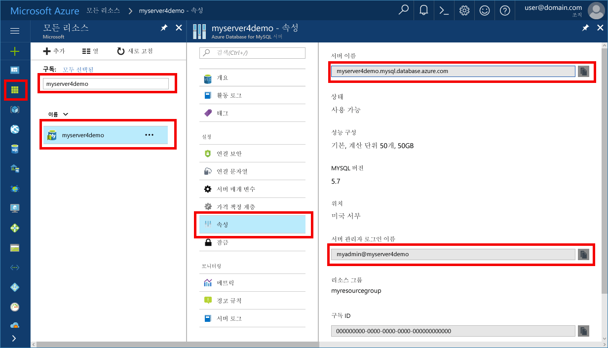

# <a name="azure-database-for-mysql-use-connectorc-tooconnect-and-query-data"></a>MySQL에 대 한 azure 데이터베이스: tooconnect 및 쿼리 데이터를 사용 하 여 커넥터/c + +
이 빠른 시작에서는 tooconnect tooan Azure 데이터베이스는 c + + 응용 프로그램을 사용 하 여 MySQL에 대 한 방법입니다. Toouse SQL 문 tooquery를 삽입, 업데이트 및 hello 데이터베이스의 데이터를 삭제 방법을 보여 줍니다. hello이 문서의 단계 c + +를 사용 하 여 개발 된 익숙한 고 가정 MySQL에 대 한 Azure 데이터베이스와 새 tooworking 한다고 합니다.

## <a name="prerequisites"></a>필수 조건
이 퀵 스타트의 시작 지점으로이 가이드의 중 하나에서 만든 hello 리소스를 사용 합니다.
- [Azure Portal을 사용한 MySQL용 Azure Database 서버 만들기](./quickstart-create-mysql-server-database-using-azure-portal.md)
- [Azure CLI를 사용한 MySQL용 Azure Database 서버 만들기](./quickstart-create-mysql-server-database-using-azure-cli.md)

다음과 같은 작업도 필요합니다.
- [.NET Framework](https://www.microsoft.com/net/download) 설치
- [Visual Studio](https://www.visualstudio.com/downloads/)
- [MySQL Connector/C++](https://dev.mysql.com/downloads/connector/cpp/) 설치 
- [부스트](http://www.boost.org/) 설치

## <a name="install-visual-studio-and-net"></a>Visual Studio 및 .NET 설치
이 섹션의 hello 단계.NET을 사용 하 여 개발에 익숙한 한다고 가정 합니다.

### <a name="windows"></a>**Windows**
1. Android, iOS, Windows뿐만 아니라 웹 및 데이터베이스 응용 프로그램, 클라우드 서비스를 위한 최신 응용 프로그램을 만들기 위해 완전한 기능을 갖춘 확장 가능한 평가판 IDE인 Visual Studio 2017 Community를 설치합니다. Hello 전체.NET Framework 또는.NET Core만 설치할 수 있습니다. hello 빠른 시작에서에서 hello 코드 조각을 사용 하 여 작동합니다. 이미 Visual Studio 컴퓨터에 설치 되어 있으면 hello 다음 두 단계를 건너뜁니다.
   - Hello 다운로드 [Visual Studio 2017 installer](https://www.visualstudio.com/thank-you-downloading-visual-studio/?sku=Community&rel=15)합니다. 
   - Hello 설치 관리자를 실행 하 고 hello 설치 프롬프트 toocomplete hello 설치를 수행 합니다.

### <a name="configure-visual-studio"></a>**Visual Studio 구성**
1. Visual Studio에서 프로젝트 속성 > 구성 속성 > C/c + + > 링커 > 일반 > hello lib\opt 디렉터리를 추가 하는 추가 라이브러리 디렉터리 (예:: C:\Program Files (x86) \MySQL\MySQL 커넥터 c + + 1.1.9\lib\opt) hello c + +의 커넥터입니다.
2. Visual Studio, 프로젝트 속성 > 구성 속성 > C/C++ > 일반 > 추가 포함 디렉터리
   - c++ 커넥터의 include/ 디렉터리(예: C:\Program Files (x86)\MySQL\MySQL Connector C++ 1.1.9\include\)를 추가합니다.
   - Boost 라이브러리의 루트 디렉터리(예: C:\boost_1_64_0\) 추가
3. Visual Studio에서 프로젝트 속성 > 구성 속성 > C/c + + > 링커 > 입력 >는 추가 종속성 hello 텍스트 필드에 mysqlcppconn.lib 추가
4. 두 복사 mysqlcppconn.dll hello c + + 커넥터 라이브러리 폴더에서 3 단계 toohello hello 응용 프로그램 실행 파일과 같은 디렉터리 또는 응용 프로그램에서 찾을 수 있도록 toohello 환경 변수에 추가 합니다.

## <a name="get-connection-information"></a>연결 정보 가져오기
MySQL 용 hello 연결 필요한 정보 tooconnect toohello를 Azure 데이터베이스를 가져옵니다. 정규화 된 서버 이름 및 로그인 자격 증명 hello 필요 합니다.

1. Toohello 로그인 [Azure 포털](https://portal.azure.com/)합니다.
2. Azure 포털에서 왼쪽 메뉴 hello에서에서 클릭 **모든 리소스** 등 생성 한 hello 서버에 대 한 검색 **myserver4demo**합니다.
3. Hello 서버 이름을 클릭 합니다.
4. 선택 hello 서버 **속성** 페이지. Hello 메모 **서버 이름** 및 **서버 관리자 로그인 이름**합니다.
 
5. 서버 로그인 정보를 잊은 경우 탐색 toohello **개요** tooview hello 서버 관리자 로그인 이름 페이지 하 고 필요한 경우 다시 설정 hello 암호입니다.

## <a name="connect-create-table-and-insert-data"></a>테이블 연결, 생성 및 데이터 삽입
사용 하 여 hello 다음 tooconnect 코드을 사용 하 여 hello 데이터 로드 **CREATE TABLE** 및 **INSERT INTO** SQL 문입니다. hello 코드 hello connect () 메서드 tooestablish 연결 tooMySQL 인 sql::Driver 클래스를 사용합니다. 그런 다음 hello 코드 메서드 createStatement() 및 execute () toorun hello 데이터베이스 명령을 사용합니다. 

Hello 서버 및 데이터베이스를 만들 때 지정한 hello 값으로 hello 호스트, DBName, 사용자 및 암호 매개 변수를 대체 합니다. 

```c++
#include <stdlib.h>
#include <iostream>
#include "stdafx.h"

#include "mysql_connection.h"
#include <cppconn/driver.h>
#include <cppconn/exception.h>
#include <cppconn/prepared_statement.h>
using namespace std;

int main()
{
    sql::Driver *driver;
    sql::Connection *con;
    sql::Statement *stmt;
    sql::PreparedStatement *pstmt;

    try
    {
        driver = get_driver_instance();
        //for demonstration only. never save password in hello code!
        con = driver>connect("tcp://myserver4demo.mysql.database.azure.com:3306/quickstartdb", "myadmin@myserver4demo", "server_admin_password");
    }
    catch (sql::SQLException e)
    {
        cout << "Could not connect toodatabase. Error message: " << e.what() << endl;
        system("pause");
        exit(1);
    }

    stmt = con>createStatement();
    stmt>execute("DROP TABLE IF EXISTS inventory");
    cout << "Finished dropping table (if existed)" << endl;
    stmt>execute("CREATE TABLE inventory (id serial PRIMARY KEY, name VARCHAR(50), quantity INTEGER);");
    cout << "Finished creating table" << endl;
    delete stmt;

    pstmt = con>prepareStatement("INSERT INTO inventory(name, quantity) VALUES(?,?)");
    pstmt>setString(1, "banana");
    pstmt>setInt(2, 150);
    pstmt>execute();
    cout << "One row inserted." << endl;

    pstmt>setString(1, "orange");
    pstmt>setInt(2, 154);
    pstmt>execute();
    cout << "One row inserted." << endl;

    pstmt>setString(1, "apple");
    pstmt>setInt(2, 100);
    pstmt>execute();
    cout << "One row inserted." << endl;
    
    delete pstmt;   
    delete con;
    system("pause");
    return 0;

```

## <a name="read-data"></a>데이터 읽기

사용 하 여 hello 다음 tooconnect 코드을 사용 하 여 hello 데이터 읽기는 **선택** SQL 문입니다. hello 코드 hello connect () 메서드 tooestablish 연결 tooMySQL 인 sql::Driver 클래스를 사용합니다. 그런 다음 hello 코드 prepareStatement() 메서드를 사용 하 여 선택한 executeQuery() toorun hello에 명령 합니다. 마지막으로 hello 코드 hello 결과에 next () tooadvance toohello 레코드를 사용합니다. 그런 다음 hello 코드 hello 레코드의 getInt() 및 getString() tooparse hello 값을 사용합니다.

Hello 서버 및 데이터베이스를 만들 때 지정한 hello 값으로 hello 호스트, DBName, 사용자 및 암호 매개 변수를 대체 합니다. 

```csharp
#include <stdlib.h>
#include <iostream>
#include "stdafx.h"

#include "mysql_connection.h"
#include <cppconn/driver.h>
#include <cppconn/exception.h>
#include <cppconn/resultset.h>
#include <cppconn/prepared_statement.h>
using namespace std;

int main()
{
    sql::Driver *driver;
    sql::Connection *con;
    sql::PreparedStatement *pstmt;
    sql::ResultSet *result;

    try
    {
        driver = get_driver_instance();
        //for demonstration only. never save password in hello code!
        con = driver>connect("tcp://myserver4demo.mysql.database.azure.com:3306/quickstartdb", "myadmin@myserver4demo", "server_admin_password");
    }
    catch (sql::SQLException e)
    {
        cout << "Could not connect toodatabase. Error message: " << e.what() << endl;
        system("pause");
        exit(1);
    }   

//  select  
    pstmt = con>prepareStatement("SELECT * FROM inventory;");
    result = pstmt>executeQuery();  
    
    while (result>next())
        printf("Reading from table=(%d, %s, %d)\n", result>getInt(1), result>getString(2).c_str(), result>getInt(3));   
    
    delete result;
    delete pstmt;   
    delete con;
    system("pause");
    return 0;
}
```

## <a name="update-data"></a>데이터 업데이트
사용 하 여 hello 다음 tooconnect 코드을 사용 하 여 hello 데이터 읽기는 **업데이트** SQL 문입니다. hello 코드 hello connect () 메서드 tooestablish 연결 tooMySQL 인 sql::Driver 클래스를 사용합니다. 그런 다음 hello 코드 메서드 prepareStatement() 및 executeQuery() toorun hello 업데이트 명령을 사용합니다. 

Hello 서버 및 데이터베이스를 만들 때 지정한 hello 값으로 hello 호스트, DBName, 사용자 및 암호 매개 변수를 대체 합니다. 

```csharp
#include <stdlib.h>
#include <iostream>
#include "stdafx.h"

#include "mysql_connection.h"
#include <cppconn/driver.h>
#include <cppconn/exception.h>
#include <cppconn/prepared_statement.h>
using namespace std;

int main()
{
    sql::Driver *driver;
    sql::Connection *con;
    sql::PreparedStatement *pstmt;

    try
    {
        driver = get_driver_instance();
        //for demonstration only. never save password in hello code!
        con = driver>connect("tcp://myserver4demo.mysql.database.azure.com:3306/quickstartdb", "myadmin@myserver4demo", "server_admin_password");
    }
    catch (sql::SQLException e)
    {
        cout << "Could not connect toodatabase. Error message: " << e.what() << endl;
        system("pause");
        exit(1);
    }   

    //update
    pstmt = con>prepareStatement("UPDATE inventory SET quantity = ? WHERE name = ?");
    pstmt>setInt(1, 200);
    pstmt>setString(2, "banana");
    pstmt>executeQuery();
    printf("Row updated\n");
    
    delete con;
    delete pstmt;
    system("pause");
    return 0;
}
```


## <a name="delete-data"></a>데이터 삭제
사용 하 여 hello 다음 tooconnect 코드을 사용 하 여 hello 데이터 읽기는 **삭제** SQL 문입니다. hello 코드 hello connect () 메서드 tooestablish 연결 tooMySQL 인 sql::Driver 클래스를 사용합니다. Hello 코드 prepareStatement() 메서드를 사용 하 여 다음 및 executeQuery() toorun hello 명령을 삭제 합니다.

Hello 서버 및 데이터베이스를 만들 때 지정한 hello 값으로 hello 호스트, DBName, 사용자 및 암호 매개 변수를 대체 합니다. 

```csharp
#include <stdlib.h>
#include <iostream>
#include "stdafx.h"

#include "mysql_connection.h"
#include <cppconn/driver.h>
#include <cppconn/exception.h>
#include <cppconn/resultset.h>
#include <cppconn/prepared_statement.h>
using namespace std;

int main()
{
    sql::Driver *driver;
    sql::Connection *con;
    sql::PreparedStatement *pstmt;
    sql::ResultSet *result;

    try
    {
        driver = get_driver_instance();
        //for demonstration only. never save password in hello code!
        con = driver>connect("tcp://myserver4demo.mysql.database.azure.com:3306/quickstartdb", "myadmin@myserver4demo", "server_admin_password");
    }
    catch (sql::SQLException e)
    {
        cout << "Could not connect toodatabase. Error message: " << e.what() << endl;
        system("pause");
        exit(1);
    }
        
    //delete
    pstmt = con>prepareStatement("DELETE FROM inventory WHERE name = ?");
    pstmt>setString(1, "orange");
    result = pstmt>executeQuery();
    printf("Row deleted\n");    
    
    delete pstmt;
    delete con;
    delete result;
    system("pause");
    return 0;
}
```

## <a name="next-steps"></a>다음 단계
> [!div class="nextstepaction"]
> [덤프 및 복원을 사용 하는 MySQL에 대 한 MySQL 데이터베이스 tooAzure 데이터베이스 마이그레이션](concepts-migrate-dump-restore.md)
