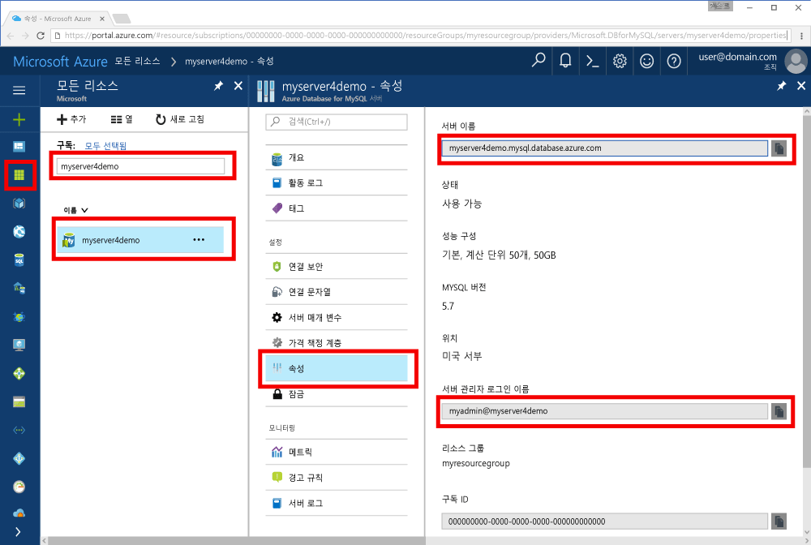

# <a name="azure-database-for-mysql-use-go-language-tooconnect-and-query-data"></a>MySQL에 대 한 azure 데이터베이스: 언어 tooconnect 및 쿼리 데이터 사용 하 여 이동
이 빠른 시작에서는 tooconnect tooan Azure 데이터베이스를 사용 하 여 MySQL에 대 한 코드에서 작성 된 hello [이동](https://golang.org/) 창, Ubuntu Linux 및 Apple macOS 플랫폼에서 언어입니다. Toouse SQL 문 tooquery를 삽입, 업데이트 및 hello 데이터베이스의 데이터를 삭제 방법을 보여 줍니다. 이 문서에서는 하지만 새 tooworking MySQL에 대 한 Azure 데이터베이스는 Go를 사용 하 여 개발에 잘 알고 있다면 가정 합니다.

## <a name="prerequisites"></a>필수 조건
이 퀵 스타트의 시작 지점으로이 가이드의 중 하나에서 만든 hello 리소스를 사용 합니다.
- [Azure Portal을 사용한 MySQL용 Azure Database 서버 만들기](./quickstart-create-mysql-server-database-using-azure-portal.md)
- [Azure CLI를 사용한 MySQL용 Azure 데이터베이스 서버 만들기](./quickstart-create-mysql-server-database-using-azure-cli.md)

## <a name="install-go-and-mysql-connector"></a>Go 및 MySQL 커넥터 설치
설치 [이동](https://golang.org/doc/install) 및 hello [MySQL에 대 한 드라이버-go-sql](https://github.com/go-sql-driver/mysql#installation) 사용자의 컴퓨터에 있습니다. 플랫폼에 따라 hello 단계를 수행 합니다.

### <a name="windows"></a>Windows
1. [다운로드](https://golang.org/dl/) Go toohello에 따라 Microsoft Windows 용 설치 [설치 지침](https://golang.org/doc/install)합니다.
2. Hello 시작 메뉴에서 hello 명령 프롬프트를 시작 합니다.
3. 다음과 같이 프로젝트 폴더를 만듭니다. `mkdir  %USERPROFILE%\go\src\mysqlgo`
4. 와 같은 hello 프로젝트 폴더로 디렉터리를 변경 `cd %USERPROFILE%\go\src\mysqlgo`합니다.
5. GOPATH toopoint toohello 소스 코드 디렉터리에 대 한 hello 환경 변수를 설정 합니다. `set GOPATH=%USERPROFILE%\go`
6. Hello 설치 [mysql에 대 한 드라이버-go-sql](https://github.com/go-sql-driver/mysql#installation) hello를 실행 하 여 `go get github.com/go-sql-driver/mysql` 명령입니다.

   요약 하자면, Go 설치 후 hello 명령 프롬프트에서 다음이 명령을 실행 합니다.
   ```cmd
   mkdir  %USERPROFILE%\go\src\mysqlgo
   cd %USERPROFILE%\go\src\mysqlgo
   set GOPATH=%USERPROFILE%\go
   go get github.com/go-sql-driver/mysql
   ```

### <a name="linux-ubuntu"></a>Linux(Ubuntu)
1. Hello Bash 셸의 시작 합니다. 
2. `sudo apt-get install golang-go`를 실행하여 Go를 설치합니다.
3. 홈 디렉터리에서 프로젝트 폴더를 만듭니다(예: `mkdir -p ~/go/src/mysqlgo/`).
4. 와 같은 hello 폴더로 디렉터리를 변경 `cd ~/go/src/mysqlgo/`합니다.
5. 집합 hello GOPATH 환경 변수 toopoint tooa 유효한 소스와 같은 디렉터리에 현재 홈 디렉터리의 폴더를 이동 합니다. Hello bash 셸의 실행 `export GOPATH=~/go` tooadd hello GOPATH hello 현재 셸 세션에 대 한 hello으로 디렉터리를 이동 합니다.
6. Hello 설치 [mysql에 대 한 드라이버-go-sql](https://github.com/go-sql-driver/mysql#installation) hello를 실행 하 여 `go get github.com/go-sql-driver/mysql` 명령입니다.

   요약하자면, 다음과 같은 Bash 명령을 실행합니다.
   ```bash
   sudo apt-get install golang-go
   mkdir -p ~/go/src/mysqlgo/
   cd ~/go/src/mysqlgo/
   export GOPATH=~/go/
   go get github.com/go-sql-driver/mysql
   ```

### <a name="apple-macos"></a>Apple macOS
1. 다운로드 및 설치 toohello를 따라 이동 [설치 지침](https://golang.org/doc/install) 플랫폼에 일치 합니다. 
2. Hello Bash 셸의 시작 합니다. 
3. 홈 디렉터리에서 프로젝트 폴더를 만듭니다(예: `mkdir -p ~/go/src/mysqlgo/`).
4. 와 같은 hello 폴더로 디렉터리를 변경 `cd ~/go/src/mysqlgo/`합니다.
5. 집합 hello GOPATH 환경 변수 toopoint tooa 유효한 소스와 같은 디렉터리에 현재 홈 디렉터리의 폴더를 이동 합니다. Hello bash 셸의 실행 `export GOPATH=~/go` tooadd hello GOPATH hello 현재 셸 세션에 대 한 hello으로 디렉터리를 이동 합니다.
6. Hello 설치 [mysql에 대 한 드라이버-go-sql](https://github.com/go-sql-driver/mysql#installation) hello를 실행 하 여 `go get github.com/go-sql-driver/mysql` 명령입니다.

   요약하자면, Go 설치 후 다음 bash 명령을 실행합니다.
   ```bash
   mkdir -p ~/go/src/mysqlgo/
   cd ~/go/src/mysqlgo/
   export GOPATH=~/go/
   go get github.com/go-sql-driver/mysql
   ```

## <a name="get-connection-information"></a>연결 정보 가져오기
MySQL 용 hello 연결 필요한 정보 tooconnect toohello를 Azure 데이터베이스를 가져옵니다. 정규화 된 서버 이름 및 로그인 자격 증명 hello 필요 합니다.

1. Toohello 로그인 [Azure 포털](https://portal.azure.com/)합니다.
2. Azure 포털에서 왼쪽 메뉴 hello에서에서 클릭 **모든 리소스** 같은 creased 한 hello 서버에 대 한 검색 **myserver4demo**합니다.
3. Hello 서버 이름을 클릭 **myserver4demo**합니다.
4. 선택 hello 서버 **속성** 페이지. Hello 메모 **서버 이름** 및 **서버 관리자 로그인 이름**합니다.
 
5. 서버 로그인 정보를 잊은 경우 탐색 toohello **개요** tooview hello 서버 관리자 로그인 이름 페이지 하 고 필요한 경우 다시 설정 hello 암호입니다.
   

## <a name="build-and-run-go-code"></a>Go 코드 작성 및 실행 
1. toowrite Golang 코드, Microsoft Windows의 메모장과 같은 간단한 텍스트 편집기를 사용할 수 있습니다 [vi](http://manpages.ubuntu.com/manpages/xenial/man1/nvi.1.html#contenttoc5) 또는 [Nano](https://www.nano-editor.org/) Ubuntu, 또는 macOS에서 TextEdit 합니다. 보다 풍부한 IDE(대화형 개발 환경)를 선호하는 경우 Jetbrains의 [Gogland](https://www.jetbrains.com/go/), Microsoft의 [Visual Studio Code](https://code.visualstudio.com/) 또는 [Atom](https://atom.io/)을 사용해 보세요.
2. 텍스트 파일에 hello 아래 hello 섹션에서 Go 코드를 붙여 넣고 파일 확장명으로 프로젝트 폴더에 저장할 \*Windows 경로 같은.go `%USERPROFILE%\go\src\mysqlgo\createtable.go` 또는 Linux 경로 `~/go/src/mysqlgo/createtable.go`합니다.
3. Hello 찾습니다 `HOST`, `DATABASE`, `USER`, 및 `PASSWORD` hello 코드 및 고유한 값으로 바꾸기 hello 예제 값에는 상수입니다. 
4. Hello 명령 프롬프트를 시작 하거나 bash 셸은 합니다. 디렉터리를 프로젝트 폴더로 변경합니다. 예를 들어 Windows에서는 `cd %USERPROFILE%\go\src\mysqlgo\`이고, Linux에서는 `cd ~/go/src/mysqlgo/`입니다.  언급 된 hello IDE 편집기의 일부 셸 명령이 필요 없이 디버그 및 런타임 기능을 제공 합니다.
5. Hello 명령을 입력 하 여 hello 코드 실행 `go run createtable.go` toocompile hello 응용 프로그램을 실행 합니다. 
6. 네이티브 응용 프로그램에 hello 코드 또는 toobuild `go build createtable.go`, 다음 실행 `createtable.exe` toorun hello 응용 프로그램입니다.

## <a name="connect-create-table-and-insert-data"></a>테이블 연결, 생성 및 데이터 삽입
사용 하 여 hello 다음 tooconnect toohello 서버 코드, 테이블을 만들고 및 사용 하 여 hello 데이터 로드는 **삽입** SQL 문입니다. 

hello 코드는 세 가지 패키지를 가져옵니다: hello [sql 패키지](https://golang.org/pkg/database/sql/), hello [mysql에 대 한 이동 sql 드라이버](https://github.com/go-sql-driver/mysql#installation) hello MySQL에 대 한 Azure 데이터베이스와 hello 드라이버 toocommunicate로 [fmt 패키지](https://golang.org/pkg/fmt/)인쇄 된 입력 및 hello 명령줄에 출력 합니다.

메서드를 호출 하는 hello 코드 [sql 합니다. Open ()](http://go-database-sql.org/accessing.html) tooconnect tooAzure MySQL 및 메서드를 사용 하 여 검사 hello 연결에 대 한 데이터베이스 [db입니다. Ping()](https://golang.org/pkg/database/sql/#DB.Ping)합니다. A [데이터베이스 핸들](https://golang.org/pkg/database/sql/#DB) hello 데이터베이스 서버에 대 한 hello 연결 풀을 보유, 전체에서 사용 됩니다. hello 코드 호출 hello [exec ()](https://golang.org/pkg/database/sql/#DB.Exec) 메서드가 여러 번 toorun 여러 개의 DDL 명령이 있습니다. 또한 사용 하 여 hello hello 코드 [Prepare()](http://go-database-sql.org/prepared.html) 및 준비 된 문을 다른 매개 변수와 함께 tooinsert 세 행 toorun exec (). 될 때마다 사용자 지정 checkError() 메서드 이면 사용된 toocheck에서 오류가 발생 했으며 tooexit 상관 없습니다.

Hello 대체 `host`, `database`, `user`, 및 `password` 를 원하는 값으로는 상수입니다. 

```Go
package main

import (
    "database/sql"
    "fmt"

    _ "github.com/go-sql-driver/mysql"
)

const (
    host     = "myserver4demo.mysql.database.azure.com"
    database = "quickstartdb"
    user     = "myadmin@myserver4demo"
    password = "yourpassword"
)

func checkError(err error) {
    if err != nil {
        panic(err)
    }
}

func main() {

    // Initialize connection string.
    var connectionString = fmt.Sprintf("%s:%s@tcp(%s:3306)/%s?allowNativePasswords=true", user, password, host, database)

    // Initialize connection object.
    db, err := sql.Open("mysql", connectionString)
    checkError(err)
    defer db.Close()

    err = db.Ping()
    checkError(err)
    fmt.Println("Successfully created connection toodatabase.")

    // Drop previous table of same name if one exists.
    _, err = db.Exec("DROP TABLE IF EXISTS inventory;")
    checkError(err)
    fmt.Println("Finished dropping table (if existed).")

    // Create table.
    _, err = db.Exec("CREATE TABLE inventory (id serial PRIMARY KEY, name VARCHAR(50), quantity INTEGER);")
    checkError(err)
    fmt.Println("Finished creating table.")

    // Insert some data into table.
    sqlStatement, err := db.Prepare("INSERT INTO inventory (name, quantity) VALUES (?, ?);")
    res, err := sqlStatement.Exec("banana", 150)
    checkError(err)
    rowCount, err := res.RowsAffected()
    fmt.Printf("Inserted %d row(s) of data.\n", rowCount)

    res, err = sqlStatement.Exec("orange", 154)
    checkError(err)
    rowCount, err = res.RowsAffected()
    fmt.Printf("Inserted %d row(s) of data.\n", rowCount)

    res, err = sqlStatement.Exec("apple", 100)
    checkError(err)
    rowCount, err = res.RowsAffected()
    fmt.Printf("Inserted %d row(s) of data.\n", rowCount)
    fmt.Println("Done.")
}

```

## <a name="read-data"></a>데이터 읽기
사용 하 여 hello 다음 tooconnect 코드을 사용 하 여 hello 데이터 읽기는 **선택** SQL 문입니다. 

hello 코드는 세 가지 패키지를 가져옵니다: hello [sql 패키지](https://golang.org/pkg/database/sql/), hello [mysql에 대 한 이동 sql 드라이버](https://github.com/go-sql-driver/mysql#installation) hello MySQL에 대 한 Azure 데이터베이스와 hello 드라이버 toocommunicate로 [fmt 패키지](https://golang.org/pkg/fmt/)인쇄 된 입력 및 hello 명령줄에 출력 합니다.

메서드를 호출 하는 hello 코드 [sql 합니다. Open ()](http://go-database-sql.org/accessing.html) tooconnect tooAzure MySQL 및 메서드를 사용 하 여 검사 hello 연결에 대 한 데이터베이스 [db입니다. Ping()](https://golang.org/pkg/database/sql/#DB.Ping)합니다. A [데이터베이스 핸들](https://golang.org/pkg/database/sql/#DB) hello 데이터베이스 서버에 대 한 hello 연결 풀을 보유, 전체에서 사용 됩니다. hello 코드 호출 hello [query ()](https://golang.org/pkg/database/sql/#DB.Query) 메서드 toorun hello select 명령입니다. 실행 한 다음 [next ()](https://golang.org/pkg/database/sql/#Rows.Next) tooiterate hello 결과 집합 및 [Scan()](https://golang.org/pkg/database/sql/#Rows.Scan) tooparse hello 열 값을 hello 값을 변수에 저장 합니다. 될 때마다 사용자 지정 checkError() 메서드 이면 사용된 toocheck에서 오류가 발생 했으며 tooexit 상관 없습니다.

Hello 대체 `host`, `database`, `user`, 및 `password` 를 원하는 값으로는 상수입니다. 

```Go
package main

import (
    "database/sql"
    "fmt"

    _ "github.com/go-sql-driver/mysql"
)

const (
    host     = "myserver4demo.mysql.database.azure.com"
    database = "quickstartdb"
    user     = "myadmin@myserver4demo"
    password = "yourpassword"
)

func checkError(err error) {
    if err != nil {
        panic(err)
    }
}

func main() {

    // Initialize connection string.
    var connectionString = fmt.Sprintf("%s:%s@tcp(%s:3306)/%s?allowNativePasswords=true", user, password, host, database)

    // Initialize connection object.
    db, err := sql.Open("mysql", connectionString)
    checkError(err)
    defer db.Close()

    err = db.Ping()
    checkError(err)
    fmt.Println("Successfully created connection toodatabase.")

    // Variables for printing column data when scanned.
    var (
        id       int
        name     string
        quantity int
    )

    // Read some data from hello table.
    rows, err := db.Query("SELECT id, name, quantity from inventory;")
    checkError(err)
    defer rows.Close()
    fmt.Println("Reading data:")
    for rows.Next() {
        err := rows.Scan(&id, &name, &quantity)
        checkError(err)
        fmt.Printf("Data row = (%d, %s, %d)\n", id, name, quantity)
    }
    err = rows.Err()
    checkError(err)
    fmt.Println("Done.")
}
```

## <a name="update-data"></a>데이터 업데이트
사용 하 여 hello 다음 tooconnect 코드을 사용 하 여 hello 데이터 업데이트는 **업데이트** SQL 문입니다. 

hello 코드는 세 가지 패키지를 가져옵니다: hello [sql 패키지](https://golang.org/pkg/database/sql/), hello [mysql에 대 한 이동 sql 드라이버](https://github.com/go-sql-driver/mysql#installation) hello MySQL에 대 한 Azure 데이터베이스와 hello 드라이버 toocommunicate로 [fmt 패키지](https://golang.org/pkg/fmt/)인쇄 된 입력 및 hello 명령줄에 출력 합니다.

메서드를 호출 하는 hello 코드 [sql 합니다. Open ()](http://go-database-sql.org/accessing.html) tooconnect tooAzure MySQL 및 메서드를 사용 하 여 검사 hello 연결에 대 한 데이터베이스 [db입니다. Ping()](https://golang.org/pkg/database/sql/#DB.Ping)합니다. A [데이터베이스 핸들](https://golang.org/pkg/database/sql/#DB) hello 데이터베이스 서버에 대 한 hello 연결 풀을 보유, 전체에서 사용 됩니다. hello 코드 호출 hello [exec ()](https://golang.org/pkg/database/sql/#DB.Exec) 메서드 toorun hello update 명령입니다. 될 때마다 사용자 지정 checkError() 메서드 이면 사용된 toocheck에서 오류가 발생 했으며 tooexit 상관 없습니다.

Hello 대체 `host`, `database`, `user`, 및 `password` 를 원하는 값으로는 상수입니다. 

```Go
package main

import (
    "database/sql"
    "fmt"

    _ "github.com/go-sql-driver/mysql"
)

const (
    host     = "myserver4demo.mysql.database.azure.com"
    database = "quickstartdb"
    user     = "myadmin@myserver4demo"
    password = "yourpassword"
)

func checkError(err error) {
    if err != nil {
        panic(err)
    }
}

func main() {

    // Initialize connection string.
    var connectionString = fmt.Sprintf("%s:%s@tcp(%s:3306)/%s?allowNativePasswords=true", user, password, host, database)

    // Initialize connection object.
    db, err := sql.Open("mysql", connectionString)
    checkError(err)
    defer db.Close()

    err = db.Ping()
    checkError(err)
    fmt.Println("Successfully created connection toodatabase.")

    // Modify some data in table.
    rows, err := db.Exec("UPDATE inventory SET quantity = ? WHERE name = ?", 200, "banana")
    checkError(err)
    rowCount, err := rows.RowsAffected()
    fmt.Printf("Deleted %d row(s) of data.\n", rowCount)
    fmt.Println("Done.")
}
```

## <a name="delete-data"></a>데이터 삭제
사용 하 여 hello 다음 tooconnect 코드을 사용 하 여 데이터를 제거는 **삭제** SQL 문입니다. 

hello 코드는 세 가지 패키지를 가져옵니다: hello [sql 패키지](https://golang.org/pkg/database/sql/), hello [mysql에 대 한 이동 sql 드라이버](https://github.com/go-sql-driver/mysql#installation) hello MySQL에 대 한 Azure 데이터베이스와 hello 드라이버 toocommunicate로 [fmt 패키지](https://golang.org/pkg/fmt/)인쇄 된 입력 및 hello 명령줄에 출력 합니다.

메서드를 호출 하는 hello 코드 [sql 합니다. Open ()](http://go-database-sql.org/accessing.html) tooconnect tooAzure MySQL 및 메서드를 사용 하 여 검사 hello 연결에 대 한 데이터베이스 [db입니다. Ping()](https://golang.org/pkg/database/sql/#DB.Ping)합니다. A [데이터베이스 핸들](https://golang.org/pkg/database/sql/#DB) hello 데이터베이스 서버에 대 한 hello 연결 풀을 보유, 전체에서 사용 됩니다. hello 코드 호출 hello [exec ()](https://golang.org/pkg/database/sql/#DB.Exec) 메서드 toorun hello 명령을 삭제 합니다. 될 때마다 사용자 지정 checkError() 메서드 이면 사용된 toocheck에서 오류가 발생 했으며 tooexit 상관 없습니다.

Hello 대체 `host`, `database`, `user`, 및 `password` 를 원하는 값으로는 상수입니다. 

```Go
package main

import (
    "database/sql"
    "fmt"
    _ "github.com/go-sql-driver/mysql"
)

const (
    host     = "myserver4demo.mysql.database.azure.com"
    database = "quickstartdb"
    user     = "myadmin@myserver4demo"
    password = "yourpassword"
)

func checkError(err error) {
    if err != nil {
        panic(err)
    }
}

func main() {

    // Initialize connection string.
    var connectionString = fmt.Sprintf("%s:%s@tcp(%s:3306)/%s?allowNativePasswords=true", user, password, host, database)

    // Initialize connection object.
    db, err := sql.Open("mysql", connectionString)
    checkError(err)
    defer db.Close()

    err = db.Ping()
    checkError(err)
    fmt.Println("Successfully created connection toodatabase.")

    // Modify some data in table.
    rows, err := db.Exec("DELETE FROM inventory WHERE name = ?", "orange")
    checkError(err)
    rowCount, err := rows.RowsAffected()
    fmt.Printf("Deleted %d row(s) of data.\n", rowCount)
    fmt.Println("Done.")
}
```

## <a name="next-steps"></a>다음 단계
> [!div class="nextstepaction"]
> [내보내기 및 가져오기를 사용하여 데이터베이스 마이그레이션](./concepts-migrate-import-export.md)
