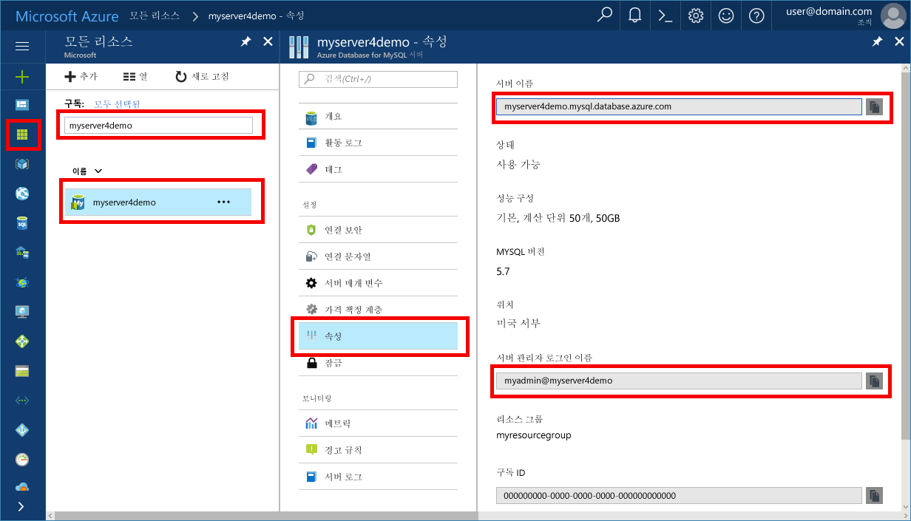

# <a name="design-your-first-azure-database-for-mysql-database"></a><span data-ttu-id="a1d9c-103">첫 번째 Azure Database for MySQL 데이터베이스 디자인</span><span class="sxs-lookup"><span data-stu-id="a1d9c-103">Design your first Azure Database for MySQL database</span></span>
<span data-ttu-id="a1d9c-104">Azure에 대 한 MySQL 데이터베이스가 toorun 수 있는 관리 되는 서비스, 관리 하 고 hello 클라우드에서 MySQL 데이터베이스를 항상 사용 가능한 크기를 조정 합니다.</span><span class="sxs-lookup"><span data-stu-id="a1d9c-104">Azure Database for MySQL is a managed service that enables you toorun, manage, and scale highly available MySQL databases in hello cloud.</span></span> <span data-ttu-id="a1d9c-105">Hello Azure 포털을 사용 하 여 쉽게 서버를 관리 하 고 수 데이터베이스 디자인 합니다.</span><span class="sxs-lookup"><span data-stu-id="a1d9c-105">Using hello Azure portal, you can easily manage your server and design a database.</span></span>

<span data-ttu-id="a1d9c-106">이 자습서를 사용 하 여 Azure 포털 toolearn hello 어떻게에:</span><span class="sxs-lookup"><span data-stu-id="a1d9c-106">In this tutorial, you use hello Azure portal toolearn how to:</span></span>

> [!div class="checklist"]
> * <span data-ttu-id="a1d9c-107">Azure Database for MySQL 만들기</span><span class="sxs-lookup"><span data-stu-id="a1d9c-107">Create an Azure Database for MySQL</span></span>
> * <span data-ttu-id="a1d9c-108">Hello 서버 방화벽을 구성</span><span class="sxs-lookup"><span data-stu-id="a1d9c-108">Configure hello server firewall</span></span>
> * <span data-ttu-id="a1d9c-109">Mysql 명령줄 도구 toocreate 데이터베이스를 사용 하 여</span><span class="sxs-lookup"><span data-stu-id="a1d9c-109">Use mysql command-line tool toocreate a database</span></span>
> * <span data-ttu-id="a1d9c-110">샘플 데이터 로드</span><span class="sxs-lookup"><span data-stu-id="a1d9c-110">Load sample data</span></span>
> * <span data-ttu-id="a1d9c-111">쿼리 데이터</span><span class="sxs-lookup"><span data-stu-id="a1d9c-111">Query data</span></span>
> * <span data-ttu-id="a1d9c-112">데이터 업데이트</span><span class="sxs-lookup"><span data-stu-id="a1d9c-112">Update data</span></span>
> * <span data-ttu-id="a1d9c-113">데이터 복원</span><span class="sxs-lookup"><span data-stu-id="a1d9c-113">Restore data</span></span>

## <a name="sign-in-toohello-azure-portal"></a><span data-ttu-id="a1d9c-114">Azure 포털 toohello에 로그인</span><span class="sxs-lookup"><span data-stu-id="a1d9c-114">Sign in toohello Azure portal</span></span>
<span data-ttu-id="a1d9c-115">즐겨 찾는 웹 브라우저를 열고 hello 방문 [Microsoft Azure 포털](https://portal.azure.com/)합니다.</span><span class="sxs-lookup"><span data-stu-id="a1d9c-115">Open your favorite web browser, and visit hello [Microsoft Azure portal](https://portal.azure.com/).</span></span> <span data-ttu-id="a1d9c-116">자격 증명 toosign toohello 포털에 입력 합니다.</span><span class="sxs-lookup"><span data-stu-id="a1d9c-116">Enter your credentials toosign in toohello portal.</span></span> <span data-ttu-id="a1d9c-117">hello 기본 보기는 서비스 대시보드에.</span><span class="sxs-lookup"><span data-stu-id="a1d9c-117">hello default view is your service dashboard.</span></span>

## <a name="create-an-azure-database-for-mysql-server"></a><span data-ttu-id="a1d9c-118">Azure Database for MySQL 서버 만들기</span><span class="sxs-lookup"><span data-stu-id="a1d9c-118">Create an Azure Database for MySQL server</span></span>
<span data-ttu-id="a1d9c-119">Azure Database for MySQL 서버는 정의된 [계산 및 저장소 리소스](./concepts-compute-unit-and-storage.md) 집합을 사용하여 만들어집니다.</span><span class="sxs-lookup"><span data-stu-id="a1d9c-119">An Azure Database for MySQL server is created with a defined set of [compute and storage resources](./concepts-compute-unit-and-storage.md).</span></span> <span data-ttu-id="a1d9c-120">hello 서버 내에서 만든는 [Azure 리소스 그룹](https://docs.microsoft.com/en-us/azure/azure-resource-manager/resource-group-overview)합니다.</span><span class="sxs-lookup"><span data-stu-id="a1d9c-120">hello server is created within an [Azure resource group](https://docs.microsoft.com/en-us/azure/azure-resource-manager/resource-group-overview).</span></span>

1. <span data-ttu-id="a1d9c-121">너무 이동**데이터베이스** > **MySQL에 대 한 Azure 데이터베이스**합니다.</span><span class="sxs-lookup"><span data-stu-id="a1d9c-121">Navigate too**Databases** > **Azure Database for MySQL**.</span></span> <span data-ttu-id="a1d9c-122">MySQL 서버를 찾을 수 없는 경우 **데이터베이스** 범주를 클릭 하 여 **스크롤하게** tooshow 사용 가능한 모든 데이터베이스 서비스입니다.</span><span class="sxs-lookup"><span data-stu-id="a1d9c-122">If you cannot find MySQL Server under **Databases** category, click **See all** tooshow all available database services.</span></span> <span data-ttu-id="a1d9c-123">입력할 수도 있습니다 **MySQL에 대 한 Azure 데이터베이스** hello 검색 상자 tooquickly에서 hello 서비스를 찾습니다.</span><span class="sxs-lookup"><span data-stu-id="a1d9c-123">You can also type **Azure Database for MySQL** in hello search box tooquickly find hello service.</span></span>
<span data-ttu-id="a1d9c-124"></span><span class="sxs-lookup"><span data-stu-id="a1d9c-124"></span></span>

2. <span data-ttu-id="a1d9c-125">**MySQL용 Azure Database** 타일을 클릭한 다음 **만들기**를 클릭합니다.</span><span class="sxs-lookup"><span data-stu-id="a1d9c-125">Click **Azure Database for MySQL** tile, and then click **Create**.</span></span>

<span data-ttu-id="a1d9c-126">예제에서는 다음 정보는 hello로 MySQL 폼에 대 한 hello Azure 데이터베이스를 입력 합니다.</span><span class="sxs-lookup"><span data-stu-id="a1d9c-126">In our example, fill out hello Azure Database for MySQL form with hello following information:</span></span>

| <span data-ttu-id="a1d9c-127">**설정**</span><span class="sxs-lookup"><span data-stu-id="a1d9c-127">**Setting**</span></span> | <span data-ttu-id="a1d9c-128">**제안 값**</span><span class="sxs-lookup"><span data-stu-id="a1d9c-128">**Suggested value**</span></span> | <span data-ttu-id="a1d9c-129">**필드 설명**</span><span class="sxs-lookup"><span data-stu-id="a1d9c-129">**Field Description**</span></span> |
|---|---|---|
| <span data-ttu-id="a1d9c-130">*서버 이름*</span><span class="sxs-lookup"><span data-stu-id="a1d9c-130">*Server name*</span></span> | <span data-ttu-id="a1d9c-131">myserver4demo</span><span class="sxs-lookup"><span data-stu-id="a1d9c-131">myserver4demo</span></span>  | <span data-ttu-id="a1d9c-132">서버 이름에 toobe 전역적으로 고유 합니다.</span><span class="sxs-lookup"><span data-stu-id="a1d9c-132">Server name has toobe globally unique.</span></span> |
| <span data-ttu-id="a1d9c-133">*구독*</span><span class="sxs-lookup"><span data-stu-id="a1d9c-133">*Subscription*</span></span> | <span data-ttu-id="a1d9c-134">mysubscription</span><span class="sxs-lookup"><span data-stu-id="a1d9c-134">mysubscription</span></span> | <span data-ttu-id="a1d9c-135">Hello 드롭다운 목록에서 구독을 선택 합니다.</span><span class="sxs-lookup"><span data-stu-id="a1d9c-135">Select your subscription from hello drop-down.</span></span> |
| <span data-ttu-id="a1d9c-136">*리소스 그룹*</span><span class="sxs-lookup"><span data-stu-id="a1d9c-136">*Resource group*</span></span> | <span data-ttu-id="a1d9c-137">myresourcegroup</span><span class="sxs-lookup"><span data-stu-id="a1d9c-137">myresourcegroup</span></span> | <span data-ttu-id="a1d9c-138">리소스 그룹을 만들거나 기존 그룹을 사용합니다.</span><span class="sxs-lookup"><span data-stu-id="a1d9c-138">Create a resource group or use an existing one.</span></span> |
| <span data-ttu-id="a1d9c-139">*서버 관리자 로그인*</span><span class="sxs-lookup"><span data-stu-id="a1d9c-139">*Server admin login*</span></span> | <span data-ttu-id="a1d9c-140">myadmin</span><span class="sxs-lookup"><span data-stu-id="a1d9c-140">myadmin</span></span> | <span data-ttu-id="a1d9c-141">관리자 계정 이름을 설정합니다.</span><span class="sxs-lookup"><span data-stu-id="a1d9c-141">Setup admin account name.</span></span> |
| <span data-ttu-id="a1d9c-142">*암호*</span><span class="sxs-lookup"><span data-stu-id="a1d9c-142">*Password*</span></span> |  | <span data-ttu-id="a1d9c-143">강력한 관리자 계정 암호를 설정합니다.</span><span class="sxs-lookup"><span data-stu-id="a1d9c-143">Set a strong admin account password.</span></span> |
| <span data-ttu-id="a1d9c-144">*암호 확인*</span><span class="sxs-lookup"><span data-stu-id="a1d9c-144">*Confirm password*</span></span> |  | <span data-ttu-id="a1d9c-145">Hello 관리자 계정 암호를 확인 합니다.</span><span class="sxs-lookup"><span data-stu-id="a1d9c-145">Confirm hello admin account password.</span></span> |
| <span data-ttu-id="a1d9c-146">*위치*</span><span class="sxs-lookup"><span data-stu-id="a1d9c-146">*Location*</span></span> |  | <span data-ttu-id="a1d9c-147">사용 가능한 지역을 선택합니다.</span><span class="sxs-lookup"><span data-stu-id="a1d9c-147">Select an available region.</span></span> |
| <span data-ttu-id="a1d9c-148">*버전*</span><span class="sxs-lookup"><span data-stu-id="a1d9c-148">*Version*</span></span> | <span data-ttu-id="a1d9c-149">5.7</span><span class="sxs-lookup"><span data-stu-id="a1d9c-149">5.7</span></span> | <span data-ttu-id="a1d9c-150">Hello 최신 버전을 선택 합니다.</span><span class="sxs-lookup"><span data-stu-id="a1d9c-150">Choose hello latest version.</span></span> |
| <span data-ttu-id="a1d9c-151">*성능 구성*</span><span class="sxs-lookup"><span data-stu-id="a1d9c-151">*Configure performance*</span></span> | <span data-ttu-id="a1d9c-152">기본, 50 계산 단위, 50GB</span><span class="sxs-lookup"><span data-stu-id="a1d9c-152">Basic, 50 compute units, 50 GB</span></span>  | <span data-ttu-id="a1d9c-153">**가격 책정 계층**, **계산 단위**, **저장소(GB)**를 선택한 다음 **확인**을 클릭합니다.</span><span class="sxs-lookup"><span data-stu-id="a1d9c-153">Choose **Pricing tier**, **Compute Units**, **Storage (GB)**, and then click **OK**.</span></span> |
| <span data-ttu-id="a1d9c-154">*Pin tooDashboard*</span><span class="sxs-lookup"><span data-stu-id="a1d9c-154">*Pin tooDashboard*</span></span> | <span data-ttu-id="a1d9c-155">확인</span><span class="sxs-lookup"><span data-stu-id="a1d9c-155">Check</span></span> | <span data-ttu-id="a1d9c-156">나중에 쉽게 hello 서버를 찾을 수 있도록이 상자 toocheck 권장</span><span class="sxs-lookup"><span data-stu-id="a1d9c-156">Recommended toocheck this box so you may find hello server easily later on</span></span> |
<span data-ttu-id="a1d9c-157">그런 다음에 **만들기**를 클릭합니다.</span><span class="sxs-lookup"><span data-stu-id="a1d9c-157">Then, click **Create**.</span></span> <span data-ttu-id="a1d9c-158">2 분 정도로에서 MySQL server에 대 한 새 Azure 데이터베이스 hello 클라우드에서 제거할 수 없습니다.</span><span class="sxs-lookup"><span data-stu-id="a1d9c-158">In a minute or two, a new Azure Database for MySQL server is running in hello cloud.</span></span> <span data-ttu-id="a1d9c-159">클릭할 수 있는 **알림** hello 도구 모음 toomonitor hello 배포 프로세스에는 단추입니다.</span><span class="sxs-lookup"><span data-stu-id="a1d9c-159">You can click **Notifications** button on hello toolbar toomonitor hello deployment process.</span></span>

## <a name="configure-firewall"></a><span data-ttu-id="a1d9c-160">방화벽 구성</span><span class="sxs-lookup"><span data-stu-id="a1d9c-160">Configure firewall</span></span>
<span data-ttu-id="a1d9c-161">Azure Databases for MySQL은 방화벽으로 보호됩니다.</span><span class="sxs-lookup"><span data-stu-id="a1d9c-161">Azure Databases for MySQL are protected by a firewall.</span></span> <span data-ttu-id="a1d9c-162">기본적으로 모든 연결 toohello 서버와 hello 데이터베이스 hello 서버 내부에서 거부 됩니다.</span><span class="sxs-lookup"><span data-stu-id="a1d9c-162">By default, all connections toohello server and hello databases inside hello server are rejected.</span></span> <span data-ttu-id="a1d9c-163">데이터베이스 tooAzure MySQL hello에 대 한 처음으로 연결 하기 전에 hello 방화벽 tooadd hello 클라이언트 컴퓨터의 공용 네트워크 IP 주소 (또는 IP 주소 범위)를 구성 합니다.</span><span class="sxs-lookup"><span data-stu-id="a1d9c-163">Before connecting tooAzure Database for MySQL for hello first time, configure hello firewall tooadd hello client machine's public network IP address (or IP address range).</span></span>

1. <span data-ttu-id="a1d9c-164">새로 만든 서버를 클릭한 다음 **연결 보안**을 클릭합니다.</span><span class="sxs-lookup"><span data-stu-id="a1d9c-164">Click your newly created server, and then click **Connection security**.</span></span>
   <span data-ttu-id="a1d9c-165"></span><span class="sxs-lookup"><span data-stu-id="a1d9c-165"></span></span>
2. <span data-ttu-id="a1d9c-166">**내 IP를 추가**하거나 여기서 방화벽 규칙을 구성할 수 있습니다.</span><span class="sxs-lookup"><span data-stu-id="a1d9c-166">You can **Add My IP**, or configure firewall rules here.</span></span> <span data-ttu-id="a1d9c-167">Tooclick 기억 **저장** hello 규칙을 만든 후 합니다.</span><span class="sxs-lookup"><span data-stu-id="a1d9c-167">Remember tooclick **Save** after you have created hello rules.</span></span>
<span data-ttu-id="a1d9c-168">Mysql 명령줄 도구 또는 MySQL 워크 벤치 GUI 도구를 사용 하 여 toohello 서버를 연결할 수 있습니다.</span><span class="sxs-lookup"><span data-stu-id="a1d9c-168">You can now connect toohello server using mysql command-line tool or MySQL Workbench GUI tool.</span></span>

> [!TIP]
> <span data-ttu-id="a1d9c-169">Azure Databases for MySQL 서버는 3306 포트를 통해 통신합니다.</span><span class="sxs-lookup"><span data-stu-id="a1d9c-169">Azure Database for MySQL server communicates over port 3306.</span></span> <span data-ttu-id="a1d9c-170">회사 네트워크 내부에서 tooconnect을 시도 하는 포트 3306 통한 아웃 바운드 트래픽 네트워크의 방화벽에서 허용 되지 않을 수 있습니다.</span><span class="sxs-lookup"><span data-stu-id="a1d9c-170">If you are trying tooconnect from within a corporate network, outbound traffic over port 3306 may not be allowed by your network's firewall.</span></span> <span data-ttu-id="a1d9c-171">이 경우에 IT 부서 3306 포트를 엽니다. 하지 않는 한 tooAzure MySQL 서버를 연결할 수 없습니다.</span><span class="sxs-lookup"><span data-stu-id="a1d9c-171">If so, you cannot connect tooAzure MySQL server unless your IT department opens port 3306.</span></span>

## <a name="get-connection-information"></a><span data-ttu-id="a1d9c-172">연결 정보 가져오기</span><span class="sxs-lookup"><span data-stu-id="a1d9c-172">Get connection information</span></span>
<span data-ttu-id="a1d9c-173">정규화 된 get hello **서버 이름** 및 **서버 관리자 로그인 이름** hello Azure 포털에서에서 MySQL 서버에 대 한 Azure 데이터베이스에 대 한 합니다.</span><span class="sxs-lookup"><span data-stu-id="a1d9c-173">Get hello fully qualified **Server name** and **Server admin login name** for your Azure Database for MySQL server from hello Azure portal.</span></span> <span data-ttu-id="a1d9c-174">Mysql 명령줄 도구를 사용 하 여 hello 정규화 된 서버 이름 tooconnect tooyour 서버를 사용 합니다.</span><span class="sxs-lookup"><span data-stu-id="a1d9c-174">You use hello fully qualified server name tooconnect tooyour server using mysql command-line tool.</span></span> 

1. <span data-ttu-id="a1d9c-175">[Azure 포털](https://portal.azure.com/), 클릭 **모든 리소스** hello 왼쪽 메뉴, 형식 hello 이름 및 MySQL 서버에 대 한 Azure 데이터베이스에 대 한 검색 합니다.</span><span class="sxs-lookup"><span data-stu-id="a1d9c-175">In [Azure portal](https://portal.azure.com/), click **All resources** from hello left-hand menu, type hello name, and search for your Azure Database for MySQL server.</span></span> <span data-ttu-id="a1d9c-176">Hello 서버 이름 tooview hello 세부 정보를 선택 합니다.</span><span class="sxs-lookup"><span data-stu-id="a1d9c-176">Select hello server name tooview hello details.</span></span>

2. <span data-ttu-id="a1d9c-177">Hello 설정에서 머리글을 클릭 하 여 **속성**합니다.</span><span class="sxs-lookup"><span data-stu-id="a1d9c-177">Under hello Settings heading, click **Properties**.</span></span> <span data-ttu-id="a1d9c-178">**서버 이름** 및 **서버 관리자 로그인 이름**을 기록해 둡니다.</span><span class="sxs-lookup"><span data-stu-id="a1d9c-178">Note down **SERVER NAME** and **SERVER ADMIN LOGIN NAME**.</span></span> <span data-ttu-id="a1d9c-179">Hello 단추 다음 tooeach 필드 toocopy toohello 클립보드로 복사를 클릭할 수 있습니다.</span><span class="sxs-lookup"><span data-stu-id="a1d9c-179">You may click hello copy button next tooeach field toocopy toohello clipboard.</span></span>
   <span data-ttu-id="a1d9c-180"></span><span class="sxs-lookup"><span data-stu-id="a1d9c-180"></span></span>

<span data-ttu-id="a1d9c-181">이 예제에서는 hello 서버 이름은 *myserver4demo.mysql.database.azure.com*, hello 서버 관리자 로그인이 고  *myadmin@myserver4demo* 합니다.</span><span class="sxs-lookup"><span data-stu-id="a1d9c-181">In this example, hello server name is *myserver4demo.mysql.database.azure.com*, and hello server admin login is *myadmin@myserver4demo*.</span></span>

## <a name="connect-toohello-server-using-mysql"></a><span data-ttu-id="a1d9c-182">Mysql을 사용 하 여 toohello 서버 연결</span><span class="sxs-lookup"><span data-stu-id="a1d9c-182">Connect toohello server using mysql</span></span>
<span data-ttu-id="a1d9c-183">사용 하 여 [mysql 명령줄 도구](https://dev.mysql.com/doc/refman/5.7/en/mysql.html) tooestablish MySQL server에 대 한 연결 tooyour Azure 데이터베이스입니다.</span><span class="sxs-lookup"><span data-stu-id="a1d9c-183">Use [mysql command-line tool](https://dev.mysql.com/doc/refman/5.7/en/mysql.html) tooestablish a connection tooyour Azure Database for MySQL server.</span></span> <span data-ttu-id="a1d9c-184">Hello 브라우저에서 Azure 클라우드 셸 hello 또는 로컬로 설치 된 mysql 도구를 사용 하 여 사용자의 컴퓨터에서 hello mysql 명령줄 도구를 실행할 수 있습니다.</span><span class="sxs-lookup"><span data-stu-id="a1d9c-184">You can run hello mysql command-line tool from hello Azure Cloud Shell in hello browser or from your own machine using mysql tools installed locally.</span></span> <span data-ttu-id="a1d9c-185">toolaunch hello Azure 클라우드 셸 클릭 hello `Try It` 이 문서에 있는 코드 블록에 단추 또는 hello Azure 포털을 방문 하 고 hello 클릭 `>_` hello 맨 위의 오른쪽 도구 모음에서 아이콘입니다.</span><span class="sxs-lookup"><span data-stu-id="a1d9c-185">toolaunch hello Azure Cloud Shell, click hello `Try It` button on a code block in this article, or visit hello Azure portal and click hello `>_` icon in hello top right toolbar.</span></span> 

<span data-ttu-id="a1d9c-186">Hello 명령 tooconnect를 입력 합니다.</span><span class="sxs-lookup"><span data-stu-id="a1d9c-186">Type hello command tooconnect:</span></span>
```azurecli-interactive
mysql -h myserver4demo.mysql.database.azure.com -u myadmin@myserver4demo -p
```

## <a name="create-a-blank-database"></a><span data-ttu-id="a1d9c-187">빈 데이터베이스 만들기</span><span class="sxs-lookup"><span data-stu-id="a1d9c-187">Create a blank database</span></span>
<span data-ttu-id="a1d9c-188">을 사용 하는 연결 된 toohello 서버와 새 데이터베이스 toowork 만들.</span><span class="sxs-lookup"><span data-stu-id="a1d9c-188">Once you’re connected toohello server, create a blank database toowork with.</span></span>
```sql
CREATE DATABASE mysampledb;
```

<span data-ttu-id="a1d9c-189">Hello 프롬프트 hello 명령 tooswitch 연결 toothis 새로 만든 데이터베이스를 다음을 실행 합니다.</span><span class="sxs-lookup"><span data-stu-id="a1d9c-189">At hello prompt, run hello following command tooswitch connection toothis newly created database:</span></span>
```sql
USE mysampledb;
```

## <a name="create-tables-in-hello-database"></a><span data-ttu-id="a1d9c-190">Hello 데이터베이스에서 테이블 만들기</span><span class="sxs-lookup"><span data-stu-id="a1d9c-190">Create tables in hello database</span></span>
<span data-ttu-id="a1d9c-191">배웠으므로 어떻게 tooconnect toohello MySQL 데이터베이스에 대 한 Azure 데이터베이스, 해 볼 수 있습니다 방법을 보다 toocomplete 몇 가지 기본적인 작업 합니다.</span><span class="sxs-lookup"><span data-stu-id="a1d9c-191">Now that you know how tooconnect toohello Azure Database for MySQL database, we can go over how toocomplete some basic tasks.</span></span>

<span data-ttu-id="a1d9c-192">먼저 테이블을 만들고 일부 데이터와 함께 로드할 수 있습니다.</span><span class="sxs-lookup"><span data-stu-id="a1d9c-192">First, we can create a table and load it with some data.</span></span> <span data-ttu-id="a1d9c-193">인벤토리 정보를 저장하는 테이블을 만들어 보겠습니다.</span><span class="sxs-lookup"><span data-stu-id="a1d9c-193">Let's create a table that stores inventory information.</span></span>
```sql
CREATE TABLE inventory (
    id serial PRIMARY KEY, 
    name VARCHAR(50), 
    quantity INTEGER
);
```

## <a name="load-data-into-hello-tables"></a><span data-ttu-id="a1d9c-194">Hello 테이블로 데이터를 로드 합니다.</span><span class="sxs-lookup"><span data-stu-id="a1d9c-194">Load data into hello tables</span></span>
<span data-ttu-id="a1d9c-195">이제 테이블을 만들었으므로 이 테이블에 일부 데이터를 삽입할 수 있습니다.</span><span class="sxs-lookup"><span data-stu-id="a1d9c-195">Now that we have a table, we can insert some data into it.</span></span> <span data-ttu-id="a1d9c-196">Hello open 명령 프롬프트 창에서 데이터의 일부 행 hello 쿼리 tooinsert 다음 실행 합니다.</span><span class="sxs-lookup"><span data-stu-id="a1d9c-196">At hello open command prompt window, run hello following query tooinsert some rows of data.</span></span>
```sql
INSERT INTO inventory (id, name, quantity) VALUES (1, 'banana', 150); 
INSERT INTO inventory (id, name, quantity) VALUES (2, 'orange', 154);
```

<span data-ttu-id="a1d9c-197">이제 두 개의 행 앞에서 만든 hello 테이블에 샘플 데이터의 해야 합니다.</span><span class="sxs-lookup"><span data-stu-id="a1d9c-197">Now you have two rows of sample data into hello table you created earlier.</span></span>

## <a name="query-and-update-hello-data-in-hello-tables"></a><span data-ttu-id="a1d9c-198">Hello 테이블의 hello 데이터 쿼리 및 업데이트</span><span class="sxs-lookup"><span data-stu-id="a1d9c-198">Query and update hello data in hello tables</span></span>
<span data-ttu-id="a1d9c-199">Hello 쿼리 tooretrieve 정보 hello 데이터베이스 테이블에서 다음을 실행 합니다.</span><span class="sxs-lookup"><span data-stu-id="a1d9c-199">Execute hello following query tooretrieve information from hello database table.</span></span>
```sql
SELECT * FROM inventory;
```

<span data-ttu-id="a1d9c-200">Hello 테이블의 hello 데이터를 업데이트할 수 있습니다.</span><span class="sxs-lookup"><span data-stu-id="a1d9c-200">You can also update hello data in hello tables.</span></span>
```sql
UPDATE inventory SET quantity = 200 WHERE name = 'banana';
```

<span data-ttu-id="a1d9c-201">hello 행이 데이터를 검색 하는 경우 그에 따라 업데이트를 가져옵니다.</span><span class="sxs-lookup"><span data-stu-id="a1d9c-201">hello row gets updated accordingly when you retrieve data.</span></span>
```sql
SELECT * FROM inventory;
```

## <a name="restore-a-database-tooa-previous-point-in-time"></a><span data-ttu-id="a1d9c-202">데이터베이스 tooa 이전 시점으로 복원</span><span class="sxs-lookup"><span data-stu-id="a1d9c-202">Restore a database tooa previous point in time</span></span>
<span data-ttu-id="a1d9c-203">실수로 중요 한 데이터베이스 테이블을 삭제 하 고 hello 데이터를 쉽게 복구할 수 없습니다 가정해 보세요.</span><span class="sxs-lookup"><span data-stu-id="a1d9c-203">Imagine you have accidentally deleted an important database table, and cannot recover hello data easily.</span></span> <span data-ttu-id="a1d9c-204">Azure 데이터베이스 MySQL에 대 한를 통해 toorestore hello 서버 tooa 지점 시간 내에 새 서버에 hello 데이터베이스의 복사본을 만들어야 합니다.</span><span class="sxs-lookup"><span data-stu-id="a1d9c-204">Azure Database for MySQL allows you toorestore hello server tooa point in time, creating a copy of hello databases into new server.</span></span> <span data-ttu-id="a1d9c-205">이 새 서버 toorecover 삭제 된 데이터를 사용할 수 있습니다.</span><span class="sxs-lookup"><span data-stu-id="a1d9c-205">You can use this new server toorecover your deleted data.</span></span> <span data-ttu-id="a1d9c-206">hello 표를 추가 하기 전에 단계 복원 hello 샘플 서버 tooa 지점 뒤 번호입니다.</span><span class="sxs-lookup"><span data-stu-id="a1d9c-206">hello following steps restore hello sample server tooa point before hello table was added.</span></span>

1. <span data-ttu-id="a1d9c-207">Hello Azure 포털에서에서 MySQL에 대 한 Azure 데이터베이스를 찾습니다.</span><span class="sxs-lookup"><span data-stu-id="a1d9c-207">In hello Azure portal, locate your Azure Database for MySQL.</span></span> <span data-ttu-id="a1d9c-208">Hello에 **개요** 페이지 **복원** hello 도구 모음입니다.</span><span class="sxs-lookup"><span data-stu-id="a1d9c-208">On hello **Overview** page, click **Restore** on hello toolbar.</span></span> <span data-ttu-id="a1d9c-209">hello 복원 페이지가 열립니다.</span><span class="sxs-lookup"><span data-stu-id="a1d9c-209">hello Restore page opens.</span></span>

   

2. <span data-ttu-id="a1d9c-211">Hello 채울 **복원** hello 필요한 정보가 포함 된 폼입니다.</span><span class="sxs-lookup"><span data-stu-id="a1d9c-211">Fill out hello **Restore** form with hello required information.</span></span>
   
   
   
   - <span data-ttu-id="a1d9c-213">**복원 지점**:에-시간, 나열 된 hello 정해진 toorestore 한다는 것을 선택 합니다.</span><span class="sxs-lookup"><span data-stu-id="a1d9c-213">**Restore point**: Select a point-in-time that you want toorestore to, within hello timeframe listed.</span></span> <span data-ttu-id="a1d9c-214">현지 표준 시간대 tooUTC tooconvert 있는지를 확인 합니다.</span><span class="sxs-lookup"><span data-stu-id="a1d9c-214">Make sure tooconvert your local timezone tooUTC.</span></span>
   - <span data-ttu-id="a1d9c-215">**Toonew 서버 복원**: toorestore을 원하는 새 서버 이름을 제공 합니다.</span><span class="sxs-lookup"><span data-stu-id="a1d9c-215">**Restore toonew server**: Provide a new server name you want toorestore to.</span></span>
   - <span data-ttu-id="a1d9c-216">**위치**: hello 영역이 hello 원본 서버와 동일한 되 고 변경할 수 없습니다.</span><span class="sxs-lookup"><span data-stu-id="a1d9c-216">**Location**: hello region is same as hello source server, and cannot be changed.</span></span>
   - <span data-ttu-id="a1d9c-217">**가격 책정 계층**: 가격 책정 계층 hello는 hello 원본 서버를 hello와 동일 하며 변경할 수 없습니다.</span><span class="sxs-lookup"><span data-stu-id="a1d9c-217">**Pricing tier**: hello pricing tier is hello same as hello source server, and cannot be changed.</span></span>
   
3. <span data-ttu-id="a1d9c-218">클릭 **확인** toorestore hello 서버 너무[복원 tooa 지정 시간으로](./howto-restore-server-portal.md) 전에 hello 테이블을 삭제 합니다.</span><span class="sxs-lookup"><span data-stu-id="a1d9c-218">Click **OK** toorestore hello server too[restore tooa point in time](./howto-restore-server-portal.md) before hello table was deleted.</span></span> <span data-ttu-id="a1d9c-219">서버 복원의 hello 서버 hello 시간 기준으로 지정한 새 복사본을 만듭니다.</span><span class="sxs-lookup"><span data-stu-id="a1d9c-219">Restoring a server creates a new copy of hello server, as of hello point in time you specify.</span></span> 

## <a name="next-steps"></a><span data-ttu-id="a1d9c-220">다음 단계</span><span class="sxs-lookup"><span data-stu-id="a1d9c-220">Next steps</span></span>
<span data-ttu-id="a1d9c-221">이 자습서를 사용 하 여 Azure 포털 toolearned hello 어떻게에:</span><span class="sxs-lookup"><span data-stu-id="a1d9c-221">In this tutorial, you use hello Azure portal toolearned how to:</span></span>

> [!div class="checklist"]
> * <span data-ttu-id="a1d9c-222">Azure Database for MySQL 만들기</span><span class="sxs-lookup"><span data-stu-id="a1d9c-222">Create an Azure Database for MySQL</span></span>
> * <span data-ttu-id="a1d9c-223">Hello 서버 방화벽을 구성</span><span class="sxs-lookup"><span data-stu-id="a1d9c-223">Configure hello server firewall</span></span>
> * <span data-ttu-id="a1d9c-224">Mysql 명령줄 도구 toocreate 데이터베이스를 사용 하 여</span><span class="sxs-lookup"><span data-stu-id="a1d9c-224">Use mysql command-line tool toocreate a database</span></span>
> * <span data-ttu-id="a1d9c-225">샘플 데이터 로드</span><span class="sxs-lookup"><span data-stu-id="a1d9c-225">Load sample data</span></span>
> * <span data-ttu-id="a1d9c-226">쿼리 데이터</span><span class="sxs-lookup"><span data-stu-id="a1d9c-226">Query data</span></span>
> * <span data-ttu-id="a1d9c-227">데이터 업데이트</span><span class="sxs-lookup"><span data-stu-id="a1d9c-227">Update data</span></span>
> * <span data-ttu-id="a1d9c-228">데이터 복원</span><span class="sxs-lookup"><span data-stu-id="a1d9c-228">Restore data</span></span>

> [!div class="nextstepaction"]
> [<span data-ttu-id="a1d9c-229">MySQL에 대 한 응용 프로그램 tooAzure tooconnect 데이터베이스 하는 방법</span><span class="sxs-lookup"><span data-stu-id="a1d9c-229">How tooconnect applications tooAzure Database for MySQL</span></span>](./howto-connection-string.md)
