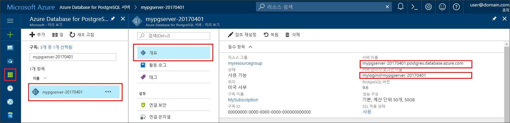

# <a name="azure-database-for-postgresql-use-go-language-to-connect-and-query-data"></a><span data-ttu-id="dc279-103">PostgreSQL용 Azure Database: Go 언어를 사용하여 데이터 연결 및 쿼리</span><span class="sxs-lookup"><span data-stu-id="dc279-103">Azure Database for PostgreSQL: Use Go language to connect and query data</span></span>
<span data-ttu-id="dc279-104">이 빠른 시작에서는 [Go](https://golang.org/) 언어(golang)로 작성된 코드를 사용하여 PostgreSQL용 Azure Database에 연결하는 방법을 보여줍니다.</span><span class="sxs-lookup"><span data-stu-id="dc279-104">This quickstart demonstrates how to connect to an Azure Database for PostgreSQL using code written in the [Go](https://golang.org/) language (golang).</span></span> <span data-ttu-id="dc279-105">SQL 문을 사용하여 데이터베이스의 데이터를 쿼리, 삽입, 업데이트 및 삭제하는 방법을 보여 줍니다.</span><span class="sxs-lookup"><span data-stu-id="dc279-105">It shows how to use SQL statements to query, insert, update, and delete data in the database.</span></span> <span data-ttu-id="dc279-106">이 문서에서는 개발자가 Go를 사용하여 개발하는 것에 익숙하고 PostgreSQL용 Azure Database 작업에 익숙하지 않다고 가정합니다.</span><span class="sxs-lookup"><span data-stu-id="dc279-106">This article assumes you are familiar with development using Go, but that you are new to working with Azure Database for PostgreSQL.</span></span>

## <a name="prerequisites"></a><span data-ttu-id="dc279-107">필수 조건</span><span class="sxs-lookup"><span data-stu-id="dc279-107">Prerequisites</span></span>
<span data-ttu-id="dc279-108">이 빠른 시작에서는 다음과 같은 가이드 중 하나에서 만들어진 리소스를 시작 지점으로 사용합니다.</span><span class="sxs-lookup"><span data-stu-id="dc279-108">This quickstart uses the resources created in either of these guides as a starting point:</span></span>
- [<span data-ttu-id="dc279-109">DB 만들기 - 포털</span><span class="sxs-lookup"><span data-stu-id="dc279-109">Create DB - Portal</span></span>](quickstart-create-server-database-portal.md)
- [<span data-ttu-id="dc279-110">DB 만들기 - Azure CLI</span><span class="sxs-lookup"><span data-stu-id="dc279-110">Create DB - Azure CLI</span></span>](quickstart-create-server-database-azure-cli.md)

## <a name="install-go-and-pq-connector"></a><span data-ttu-id="dc279-111">Go 및 pq 커넥터 설치</span><span class="sxs-lookup"><span data-stu-id="dc279-111">Install Go and pq connector</span></span>
<span data-ttu-id="dc279-112">사용자 컴퓨터에 [Go](https://golang.org/doc/install) 및 [Pure Go Postgres 드라이버(pq)](https://github.com/lib/pq)를 설치합니다.</span><span class="sxs-lookup"><span data-stu-id="dc279-112">Install [Go](https://golang.org/doc/install) and the [Pure Go Postgres driver (pq)](https://github.com/lib/pq) on your own machine.</span></span> <span data-ttu-id="dc279-113">플랫폼에 따라 단계를 따르세요.</span><span class="sxs-lookup"><span data-stu-id="dc279-113">Depending on your platform, follow the steps:</span></span>

### <a name="windows"></a><span data-ttu-id="dc279-114">Windows</span><span class="sxs-lookup"><span data-stu-id="dc279-114">Windows</span></span>
1. <span data-ttu-id="dc279-115">[설치 지침](https://golang.org/doc/install)에 따라 Microsoft Windows용 Go를 [다운로드](https://golang.org/dl/)하고 설치합니다.</span><span class="sxs-lookup"><span data-stu-id="dc279-115">[Download](https://golang.org/dl/) and install Go for Microsoft Windows according to the [installation instructions](https://golang.org/doc/install).</span></span>
2. <span data-ttu-id="dc279-116">[시작] 메뉴에서 [명령 프롬프트]를 선택합니다.</span><span class="sxs-lookup"><span data-stu-id="dc279-116">Launch the command prompt from the start menu.</span></span>
3. <span data-ttu-id="dc279-117">다음과 같이 프로젝트 폴더를 만듭니다.</span><span class="sxs-lookup"><span data-stu-id="dc279-117">Make a folder for your project such.</span></span> <span data-ttu-id="dc279-118">`mkdir  %USERPROFILE%\go\src\postgresqlgo`.</span><span class="sxs-lookup"><span data-stu-id="dc279-118">`mkdir  %USERPROFILE%\go\src\postgresqlgo`.</span></span>
4. <span data-ttu-id="dc279-119">디렉터리를 프로젝트 폴더로 변경합니다(예: `cd %USERPROFILE%\go\src\postgresqlgo`).</span><span class="sxs-lookup"><span data-stu-id="dc279-119">Change directory into the project folder, such as `cd %USERPROFILE%\go\src\postgresqlgo`.</span></span>
5. <span data-ttu-id="dc279-120">소스 코드 디렉터리를 가리키도록 GOPATH에 대한 환경 변수를 설정합니다.</span><span class="sxs-lookup"><span data-stu-id="dc279-120">Set the environment variable for GOPATH to point to the source code directory.</span></span> <span data-ttu-id="dc279-121">`set GOPATH=%USERPROFILE%\go`.</span><span class="sxs-lookup"><span data-stu-id="dc279-121">`set GOPATH=%USERPROFILE%\go`.</span></span>
6. <span data-ttu-id="dc279-122">`go get github.com/lib/pq` 명령을 실행하여 [Pure Go Postgres 드라이버(pq)](https://github.com/lib/pq)를 설치합니다.</span><span class="sxs-lookup"><span data-stu-id="dc279-122">Install the [Pure Go Postgres driver (pq)](https://github.com/lib/pq) by running the `go get github.com/lib/pq` command.</span></span>

   <span data-ttu-id="dc279-123">요약하자면, Go 설치 후 명령 프롬프트에서 다음이 명령을 실행합니다.</span><span class="sxs-lookup"><span data-stu-id="dc279-123">In summary, install Go, then run these commands in the command prompt:</span></span>
   ```cmd
   mkdir  %USERPROFILE%\go\src\postgresqlgo
   cd %USERPROFILE%\go\src\postgresqlgo
   set GOPATH=%USERPROFILE%\go
   go get github.com/lib/pq
   ```

### <a name="linux-ubuntu"></a><span data-ttu-id="dc279-124">Linux(Ubuntu)</span><span class="sxs-lookup"><span data-stu-id="dc279-124">Linux (Ubuntu)</span></span>
1. <span data-ttu-id="dc279-125">Bash 셸을 시작합니다.</span><span class="sxs-lookup"><span data-stu-id="dc279-125">Launch the Bash shell.</span></span> 
2. <span data-ttu-id="dc279-126">`sudo apt-get install golang-go`를 실행하여 Go를 설치합니다.</span><span class="sxs-lookup"><span data-stu-id="dc279-126">Install Go by running `sudo apt-get install golang-go`.</span></span>
3. <span data-ttu-id="dc279-127">홈 디렉터리에서 프로젝트 폴더를 만듭니다(예: `mkdir -p ~/go/src/postgresqlgo/`).</span><span class="sxs-lookup"><span data-stu-id="dc279-127">Make a folder for your project in your home directory, such as `mkdir -p ~/go/src/postgresqlgo/`.</span></span>
4. <span data-ttu-id="dc279-128">디렉터리를 폴더로 변경합니다(예: `cd ~/go/src/postgresqlgo/`).</span><span class="sxs-lookup"><span data-stu-id="dc279-128">Change directory into the folder, such as `cd ~/go/src/postgresqlgo/`.</span></span>
5. <span data-ttu-id="dc279-129">현재 홈 디렉터리의 go 폴더와 같이 유효한 소스 디렉터리를 가리키도록 GOPATH 환경 변수를 설정합니다.</span><span class="sxs-lookup"><span data-stu-id="dc279-129">Set the GOPATH environment variable to point to a valid source directory, such as your current home directory's go folder.</span></span> <span data-ttu-id="dc279-130">Bash 셸에서 `export GOPATH=~/go`를 실행하여 go 디렉터리를 현재 셸 세션에 대한 GOPATH로 추가합니다.</span><span class="sxs-lookup"><span data-stu-id="dc279-130">At the bash shell, run `export GOPATH=~/go` to add the go directory as the GOPATH for the current shell session.</span></span>
6. <span data-ttu-id="dc279-131">`go get github.com/lib/pq` 명령을 실행하여 [Pure Go Postgres 드라이버(pq)](https://github.com/lib/pq)를 설치합니다.</span><span class="sxs-lookup"><span data-stu-id="dc279-131">Install the [Pure Go Postgres driver (pq)](https://github.com/lib/pq) by running the `go get github.com/lib/pq` command.</span></span>

   <span data-ttu-id="dc279-132">요약하자면, 다음과 같은 Bash 명령을 실행합니다.</span><span class="sxs-lookup"><span data-stu-id="dc279-132">In summary, run these bash commands:</span></span>
   ```bash
   sudo apt-get install golang-go
   mkdir -p ~/go/src/postgresqlgo/
   cd ~/go/src/postgresqlgo/
   export GOPATH=~/go/
   go get github.com/lib/pq
   ```

### <a name="apple-macos"></a><span data-ttu-id="dc279-133">Apple macOS</span><span class="sxs-lookup"><span data-stu-id="dc279-133">Apple macOS</span></span>
1. <span data-ttu-id="dc279-134">해당 플랫폼과 일치하는 [설치 지침](https://golang.org/doc/install)에 따라 Go를 다운로드하고 설치합니다.</span><span class="sxs-lookup"><span data-stu-id="dc279-134">Download and install Go according to the [installation instructions](https://golang.org/doc/install)  matching your platform.</span></span> 
2. <span data-ttu-id="dc279-135">Bash 셸을 시작합니다.</span><span class="sxs-lookup"><span data-stu-id="dc279-135">Launch the Bash shell.</span></span> 
3. <span data-ttu-id="dc279-136">홈 디렉터리에서 프로젝트 폴더를 만듭니다(예: `mkdir -p ~/go/src/postgresqlgo/`).</span><span class="sxs-lookup"><span data-stu-id="dc279-136">Make a folder for your project in your home directory, such as `mkdir -p ~/go/src/postgresqlgo/`.</span></span>
4. <span data-ttu-id="dc279-137">디렉터리를 폴더로 변경합니다(예: `cd ~/go/src/postgresqlgo/`).</span><span class="sxs-lookup"><span data-stu-id="dc279-137">Change directory into the folder, such as `cd ~/go/src/postgresqlgo/`.</span></span>
5. <span data-ttu-id="dc279-138">현재 홈 디렉터리의 go 폴더와 같이 유효한 소스 디렉터리를 가리키도록 GOPATH 환경 변수를 설정합니다.</span><span class="sxs-lookup"><span data-stu-id="dc279-138">Set the GOPATH environment variable to point to a valid source directory, such as your current home directory's go folder.</span></span> <span data-ttu-id="dc279-139">Bash 셸에서 `export GOPATH=~/go`를 실행하여 go 디렉터리를 현재 셸 세션에 대한 GOPATH로 추가합니다.</span><span class="sxs-lookup"><span data-stu-id="dc279-139">At the bash shell, run `export GOPATH=~/go` to add the go directory as the GOPATH for the current shell session.</span></span>
6. <span data-ttu-id="dc279-140">`go get github.com/lib/pq` 명령을 실행하여 [Pure Go Postgres 드라이버(pq)](https://github.com/lib/pq)를 설치합니다.</span><span class="sxs-lookup"><span data-stu-id="dc279-140">Install the [Pure Go Postgres driver (pq)](https://github.com/lib/pq) by running the `go get github.com/lib/pq` command.</span></span>

   <span data-ttu-id="dc279-141">요약하자면, Go 설치 후 다음 bash 명령을 실행합니다.</span><span class="sxs-lookup"><span data-stu-id="dc279-141">In summary, install Go, then run these bash commands:</span></span>
   ```bash
   mkdir -p ~/go/src/postgresqlgo/
   cd ~/go/src/postgresqlgo/
   export GOPATH=~/go/
   go get github.com/lib/pq
   ```

## <a name="get-connection-information"></a><span data-ttu-id="dc279-142">연결 정보 가져오기</span><span class="sxs-lookup"><span data-stu-id="dc279-142">Get connection information</span></span>
<span data-ttu-id="dc279-143">PostgreSQL용 Azure Database에 연결하는 데 필요한 연결 정보를 가져옵니다.</span><span class="sxs-lookup"><span data-stu-id="dc279-143">Get the connection information needed to connect to the Azure Database for PostgreSQL.</span></span> <span data-ttu-id="dc279-144">정규화된 서버 이름 및 로그인 자격 증명이 필요합니다.</span><span class="sxs-lookup"><span data-stu-id="dc279-144">You need the fully qualified server name and login credentials.</span></span>

1. <span data-ttu-id="dc279-145">[Azure Portal](https://portal.azure.com/)에 로그인합니다.</span><span class="sxs-lookup"><span data-stu-id="dc279-145">Log in to the [Azure portal](https://portal.azure.com/).</span></span>
2. <span data-ttu-id="dc279-146">Azure Portal의 왼쪽 메뉴에서 **모든 리소스**를 클릭하고 방금 만든 서버를 검색합니다(예: **mypgserver-20170401**).</span><span class="sxs-lookup"><span data-stu-id="dc279-146">From the left-hand menu in Azure portal, click **All resources** and search for the server you have created, such as **mypgserver-20170401**.</span></span>
3. <span data-ttu-id="dc279-147">**mypgserver-20170401**서버 이름을 클릭합니다.</span><span class="sxs-lookup"><span data-stu-id="dc279-147">Click the server name **mypgserver-20170401**.</span></span>
4. <span data-ttu-id="dc279-148">서버의 **개요** 페이지를 선택합니다.</span><span class="sxs-lookup"><span data-stu-id="dc279-148">Select the server's **Overview** page.</span></span> <span data-ttu-id="dc279-149">**서버 이름** 및 **서버 관리자 로그인 이름**을 기록해 둡니다.</span><span class="sxs-lookup"><span data-stu-id="dc279-149">Make a note of the **Server name** and **Server admin login name**.</span></span>
 <span data-ttu-id="dc279-150"></span><span class="sxs-lookup"><span data-stu-id="dc279-150"></span></span>
5. <span data-ttu-id="dc279-151">서버 로그인 정보를 잊어버린 경우 **개요** 페이지로 이동하여 서버 관리자 로그인 이름을 확인합니다.</span><span class="sxs-lookup"><span data-stu-id="dc279-151">If you forget your server login information, navigate to the **Overview** page, and view the Server admin login name.</span></span> <span data-ttu-id="dc279-152">필요한 경우 암호를 다시 설정합니다.</span><span class="sxs-lookup"><span data-stu-id="dc279-152">If necessary, reset the password.</span></span>

## <a name="build-and-run-go-code"></a><span data-ttu-id="dc279-153">Go 코드 작성 및 실행</span><span class="sxs-lookup"><span data-stu-id="dc279-153">Build and run Go code</span></span> 
1. <span data-ttu-id="dc279-154">Golang 코드를 작성하려면 Microsoft Windows의 메모장, Ubuntu의 [vi](http://manpages.ubuntu.com/manpages/xenial/man1/nvi.1.html#contenttoc5) 또는 [Nano](https://www.nano-editor.org/), macOS의 TextEdit과 같은 간단한 텍스트 편집기를 사용할 수 있습니다.</span><span class="sxs-lookup"><span data-stu-id="dc279-154">To write Golang code, you can use a simple text editor, such as Notepad in Microsoft Windows, [vi](http://manpages.ubuntu.com/manpages/xenial/man1/nvi.1.html#contenttoc5) or [Nano](https://www.nano-editor.org/) in Ubuntu, or TextEdit in macOS.</span></span> <span data-ttu-id="dc279-155">보다 풍부한 IDE(대화형 개발 환경)를 선호하는 경우 Jetbrains의 [Gogland](https://www.jetbrains.com/go/), Microsoft의 [Visual Studio Code](https://code.visualstudio.com/) 또는 [Atom](https://atom.io/)을 사용해 보세요.</span><span class="sxs-lookup"><span data-stu-id="dc279-155">If you prefer a richer Interactive Development Environment (IDE) try [Gogland](https://www.jetbrains.com/go/) by Jetbrains, [Visual Studio Code](https://code.visualstudio.com/) by Microsoft, or [Atom](https://atom.io/).</span></span>
2. <span data-ttu-id="dc279-156">아래 섹션에서 Golang 코드를 텍스트 파일에 붙여넣고 파일 확장명 \*.go로 프로젝트 폴더에 저장합니다(예: Windows 경로 `%USERPROFILE%\go\src\postgresqlgo\createtable.go` 또는 Linux 경로 `~/go/src/postgresqlgo/createtable.go`).</span><span class="sxs-lookup"><span data-stu-id="dc279-156">Paste the Golang code from the sections below into text files, and save into your project folder with file extension \*.go, such as Windows path `%USERPROFILE%\go\src\postgresqlgo\createtable.go` or Linux path `~/go/src/postgresqlgo/createtable.go`.</span></span>
3. <span data-ttu-id="dc279-157">코드에서 `HOST`, `DATABASE`, `USER` 및 `PASSWORD` 상수를 찾아 예제 값을 사용자 고유의 값으로 바꿉니다.</span><span class="sxs-lookup"><span data-stu-id="dc279-157">Locate the `HOST`, `DATABASE`, `USER`, and `PASSWORD` constants in the code, and replace the example values with your own values.</span></span>  
4. <span data-ttu-id="dc279-158">명령 프롬프트 또는 Bash 셸을 시작합니다.</span><span class="sxs-lookup"><span data-stu-id="dc279-158">Launch the command prompt or bash shell.</span></span> <span data-ttu-id="dc279-159">디렉터리를 프로젝트 폴더로 변경합니다.</span><span class="sxs-lookup"><span data-stu-id="dc279-159">Change directory into your project folder.</span></span> <span data-ttu-id="dc279-160">예를 들어 Windows에서는 `cd %USERPROFILE%\go\src\postgresqlgo\`이고,</span><span class="sxs-lookup"><span data-stu-id="dc279-160">For example, on Windows `cd %USERPROFILE%\go\src\postgresqlgo\`.</span></span> <span data-ttu-id="dc279-161">Linux에서는 `cd ~/go/src/postgresqlgo/`를 실행합니다.</span><span class="sxs-lookup"><span data-stu-id="dc279-161">On Linux `cd ~/go/src/postgresqlgo/`.</span></span> <span data-ttu-id="dc279-162">언급된 일부 IDE 환경에서는 셸 명령 없이 디버그 및 런타임 기능을 제공합니다.</span><span class="sxs-lookup"><span data-stu-id="dc279-162">Some of the IDE environments mentioned offer debug and runtime capabilities without requiring shell commands.</span></span>
5. <span data-ttu-id="dc279-163">`go run createtable.go` 명령을 입력하여 코드를 실행하고 응용 프로그램을 컴파일한 후 실행합니다.</span><span class="sxs-lookup"><span data-stu-id="dc279-163">Run the code by typing the command `go run createtable.go` to compile the application and run it.</span></span> 
6. <span data-ttu-id="dc279-164">또는 원시 응용 프로그램 `go build createtable.go`에 코드를 빌드하려면 `createtable.exe`를 시작하여 응용 프로그램을 실행합니다.</span><span class="sxs-lookup"><span data-stu-id="dc279-164">Alternatively, to build the code into a native application, `go build createtable.go`, then launch `createtable.exe` to run the application.</span></span>

## <a name="connect-and-create-a-table"></a><span data-ttu-id="dc279-165">테이블 연결 및 생성</span><span class="sxs-lookup"><span data-stu-id="dc279-165">Connect and create a table</span></span>
<span data-ttu-id="dc279-166">**CREATE TABLE** SQL 문 다음에 테이블에 행을 추가하는 **INSERT INTO** SQL 문을 사용하여 테이블을 연결 및 생성하려면 다음 코드를 사용합니다.</span><span class="sxs-lookup"><span data-stu-id="dc279-166">Use the following code to connect and create a table using **CREATE TABLE** SQL statement, followed by **INSERT INTO** SQL statements to add rows into the table.</span></span>

<span data-ttu-id="dc279-167">이 코드는 [sql package](https://golang.org/pkg/database/sql/), Postgres 서버와 통신할 때 드라이버로 사용되는 [pq package](http://godoc.org/github.com/lib/pq), 명령줄에 인쇄된 입력 및 출력을 위한 [fmt package](https://golang.org/pkg/fmt/) 등 세 개의 패키지를 가져옵니다.</span><span class="sxs-lookup"><span data-stu-id="dc279-167">The code imports three packages: the [sql package](https://golang.org/pkg/database/sql/), the [pq package](http://godoc.org/github.com/lib/pq) as a driver to communicate with the Postgres server, and the [fmt package](https://golang.org/pkg/fmt/) for printed input and output on the command line.</span></span>

<span data-ttu-id="dc279-168">이 코드는 [sql.Open()](http://godoc.org/github.com/lib/pq#Open) 메서드를 호출하여 PostgreSQL용 Azure Database에 연결하고 [db.Ping()](https://golang.org/pkg/database/sql/#DB.Ping) 메서드를 사용하여 연결을 확인합니다.</span><span class="sxs-lookup"><span data-stu-id="dc279-168">The code calls method [sql.Open()](http://godoc.org/github.com/lib/pq#Open) to connect to Azure Database for PostgreSQL, and checks the connection using method [db.Ping()](https://golang.org/pkg/database/sql/#DB.Ping).</span></span> <span data-ttu-id="dc279-169">[데이터베이스 핸들](https://golang.org/pkg/database/sql/#DB)은 이러한 과정 내내 사용되며 데이터베이스 서버에 대한 연결 풀을 보유합니다.</span><span class="sxs-lookup"><span data-stu-id="dc279-169">A [database handle](https://golang.org/pkg/database/sql/#DB) is used throughout, holding the connection pool for the database server.</span></span> <span data-ttu-id="dc279-170">이 코드는 [Exec()](https://golang.org/pkg/database/sql/#DB.Exec) 메서드를 여러 번 호출하여 여러 SQL 명령을 실행합니다.</span><span class="sxs-lookup"><span data-stu-id="dc279-170">The code calls the [Exec()](https://golang.org/pkg/database/sql/#DB.Exec) method several times to run several SQL commands.</span></span> <span data-ttu-id="dc279-171">매번 사용자 지정 checkError() 메서드가 오류 발생 여부를 확인하고 오류가 발생하면 서둘러 종료합니다.</span><span class="sxs-lookup"><span data-stu-id="dc279-171">Each time a custom checkError() method to check if an error occurred and panic to exit if an error occurs.</span></span>

<span data-ttu-id="dc279-172">`HOST`, `DATABASE`, `USER` 및 `PASSWORD` 매개 변수는 원하는 값으로 바꾸세요.</span><span class="sxs-lookup"><span data-stu-id="dc279-172">Replace the `HOST`, `DATABASE`, `USER`, and `PASSWORD` parameters with your own values.</span></span> 

```go
package main

import (
    "database/sql"
    "fmt"
    _ "github.com/lib/pq"
)

const (
    // Initialize connection constants.
    HOST     = "mypgserver-20170401.postgres.database.azure.com"
    DATABASE = "mypgsqldb"
    USER     = "mylogin@mypgserver-20170401"
    PASSWORD = "<server_admin_password>"
)

func checkError(err error) {
    if err != nil {
        panic(err)
    }
}

func main() {
    // Initialize connection string.
    var connectionString string = fmt.Sprintf("host=%s user=%s password=%s dbname=%s sslmode=require", HOST, USER, PASSWORD, DATABASE)

    // Initialize connection object.
    db, err := sql.Open("postgres", connectionString)
    checkError(err)

    err = db.Ping()
    checkError(err)
    fmt.Println("Successfully created connection to database")

    // Drop previous table of same name if one exists.
    _, err = db.Exec("DROP TABLE IF EXISTS inventory;")
    checkError(err)
    fmt.Println("Finished dropping table (if existed)")

    // Create table.
    _, err = db.Exec("CREATE TABLE inventory (id serial PRIMARY KEY, name VARCHAR(50), quantity INTEGER);")
    checkError(err)
    fmt.Println("Finished creating table")

    // Insert some data into table.
    sql_statement := "INSERT INTO inventory (name, quantity) VALUES ($1, $2);"
    _, err = db.Exec(sql_statement, "banana", 150)
    checkError(err)
    _, err = db.Exec(sql_statement, "orange", 154)
    checkError(err)
    _, err = db.Exec(sql_statement, "apple", 100)
    checkError(err)
    fmt.Println("Inserted 3 rows of data")
}
```

## <a name="read-data"></a><span data-ttu-id="dc279-173">데이터 읽기</span><span class="sxs-lookup"><span data-stu-id="dc279-173">Read data</span></span>
<span data-ttu-id="dc279-174">**SELECT** SQL 문을 사용하여 데이터를 연결하고 읽으려면 다음 코드를 사용하세요.</span><span class="sxs-lookup"><span data-stu-id="dc279-174">Use the following code to connect and read the data using a **SELECT** SQL statement.</span></span> 

<span data-ttu-id="dc279-175">이 코드는 [sql package](https://golang.org/pkg/database/sql/), Postgres 서버와 통신할 때 드라이버로 사용되는 [pq package](http://godoc.org/github.com/lib/pq), 명령줄에 인쇄된 입력 및 출력을 위한 [fmt package](https://golang.org/pkg/fmt/) 등 세 개의 패키지를 가져옵니다.</span><span class="sxs-lookup"><span data-stu-id="dc279-175">The code imports three packages: the [sql package](https://golang.org/pkg/database/sql/), the [pq package](http://godoc.org/github.com/lib/pq) as a driver to communicate with the Postgres server, and the [fmt package](https://golang.org/pkg/fmt/) for printed input and output on the command line.</span></span>

<span data-ttu-id="dc279-176">이 코드는 [sql.Open()](http://godoc.org/github.com/lib/pq#Open) 메서드를 호출하여 PostgreSQL용 Azure Database에 연결하고 [db.Ping()](https://golang.org/pkg/database/sql/#DB.Ping) 메서드를 사용하여 연결을 확인합니다.</span><span class="sxs-lookup"><span data-stu-id="dc279-176">The code calls method [sql.Open()](http://godoc.org/github.com/lib/pq#Open) to connect to Azure Database for PostgreSQL, and checks the connection using method [db.Ping()](https://golang.org/pkg/database/sql/#DB.Ping).</span></span> <span data-ttu-id="dc279-177">[데이터베이스 핸들](https://golang.org/pkg/database/sql/#DB)은 이러한 과정 내내 사용되며 데이터베이스 서버에 대한 연결 풀을 보유합니다.</span><span class="sxs-lookup"><span data-stu-id="dc279-177">A [database handle](https://golang.org/pkg/database/sql/#DB) is used throughout, holding the connection pool for the database server.</span></span> <span data-ttu-id="dc279-178">Select 쿼리는 [db.Query()](https://golang.org/pkg/database/sql/#DB.Query) 메서드를 호출하여 실행되고, 결과 행은 [rows](https://golang.org/pkg/database/sql/#Rows) 유형의 변수에 보관됩니다.</span><span class="sxs-lookup"><span data-stu-id="dc279-178">The select query is run by calling method [db.Query()](https://golang.org/pkg/database/sql/#DB.Query), and the resulting rows is kept in a variable of type [rows](https://golang.org/pkg/database/sql/#Rows).</span></span> <span data-ttu-id="dc279-179">코드는 [rows.Scan()](https://golang.org/pkg/database/sql/#Rows.Scan) 메서드를 사용하여 현재 행의 열 데이터 값을 읽고, 더 이상 행이 존재하지 않을 때까지 [rows.Next()](https://golang.org/pkg/database/sql/#Rows.Next) 반복기를 사용하여 행에 대해 반복됩니다.</span><span class="sxs-lookup"><span data-stu-id="dc279-179">The code reads the column data values in the current row using method [rows.Scan()](https://golang.org/pkg/database/sql/#Rows.Scan) and loops over the rows using the iterator [rows.Next()](https://golang.org/pkg/database/sql/#Rows.Next) until no more rows exist.</span></span> <span data-ttu-id="dc279-180">각 행의 열 값은 콘솔에 출력됩니다. 매번 사용자 지정 checkError() 메서드가 오류 발생 여부를 확인하고 오류가 발생하면 서둘러 종료합니다.</span><span class="sxs-lookup"><span data-stu-id="dc279-180">Each row's column values are printed to the console out. Each time a custom checkError() method to check if an error occurred and panic to exit if an error occurs.</span></span>

<span data-ttu-id="dc279-181">`HOST`, `DATABASE`, `USER` 및 `PASSWORD` 매개 변수는 원하는 값으로 바꾸세요.</span><span class="sxs-lookup"><span data-stu-id="dc279-181">Replace the `HOST`, `DATABASE`, `USER`, and `PASSWORD` parameters with your own values.</span></span> 

```go
package main

import (
    "database/sql"
    "fmt"
    _ "github.com/lib/pq"
)

const (
    // Initialize connection constants.
    HOST     = "mypgserver-20170401.postgres.database.azure.com"
    DATABASE = "mypgsqldb"
    USER     = "mylogin@mypgserver-20170401"
    PASSWORD = "<server_admin_password>"
)

func checkError(err error) {
    if err != nil {
        panic(err)
    }
}

func main() {

    // Initialize connection string.
    var connectionString string = fmt.Sprintf("host=%s user=%s password=%s dbname=%s sslmode=require", HOST, USER, PASSWORD, DATABASE)

    // Initialize connection object.
    db, err := sql.Open("postgres", connectionString)
    checkError(err)

    err = db.Ping()
    checkError(err)
    fmt.Println("Successfully created connection to database")

    // Read rows from table.
    var id int
    var name string
    var quantity int

    sql_statement := "SELECT * from inventory;"
    rows, err := db.Query(sql_statement)
    checkError(err)

    for rows.Next() {
        switch err := rows.Scan(&id, &name, &quantity); err {
        case sql.ErrNoRows:
            fmt.Println("No rows were returned")
        case nil:
            fmt.Printf("Data row = (%d, %s, %d)\n", id, name, quantity)
        default:
            checkError(err)
        }
    }
}
```

## <a name="update-data"></a><span data-ttu-id="dc279-182">데이터 업데이트</span><span class="sxs-lookup"><span data-stu-id="dc279-182">Update data</span></span>
<span data-ttu-id="dc279-183">**UPDATE** SQL 문을 사용하여 데이터를 연결하고 업데이트하려면 다음 코드를 사용하세요.</span><span class="sxs-lookup"><span data-stu-id="dc279-183">Use the following code to connect and update the data using a **UPDATE** SQL statement.</span></span>

<span data-ttu-id="dc279-184">이 코드는 [sql package](https://golang.org/pkg/database/sql/), Postgres 서버와 통신할 때 드라이버로 사용되는 [pq package](http://godoc.org/github.com/lib/pq), 명령줄에 인쇄된 입력 및 출력을 위한 [fmt package](https://golang.org/pkg/fmt/) 등 세 개의 패키지를 가져옵니다.</span><span class="sxs-lookup"><span data-stu-id="dc279-184">The code imports three packages: the [sql package](https://golang.org/pkg/database/sql/), the [pq package](http://godoc.org/github.com/lib/pq) as a driver to communicate with the Postgres server, and the [fmt package](https://golang.org/pkg/fmt/) for printed input and output on the command line.</span></span>

<span data-ttu-id="dc279-185">이 코드는 [sql.Open()](http://godoc.org/github.com/lib/pq#Open) 메서드를 호출하여 PostgreSQL용 Azure Database에 연결하고 [db.Ping()](https://golang.org/pkg/database/sql/#DB.Ping) 메서드를 사용하여 연결을 확인합니다.</span><span class="sxs-lookup"><span data-stu-id="dc279-185">The code calls method [sql.Open()](http://godoc.org/github.com/lib/pq#Open) to connect to Azure Database for PostgreSQL, and checks the connection using method [db.Ping()](https://golang.org/pkg/database/sql/#DB.Ping).</span></span> <span data-ttu-id="dc279-186">[데이터베이스 핸들](https://golang.org/pkg/database/sql/#DB)은 이러한 과정 내내 사용되며 데이터베이스 서버에 대한 연결 풀을 보유합니다.</span><span class="sxs-lookup"><span data-stu-id="dc279-186">A [database handle](https://golang.org/pkg/database/sql/#DB) is used throughout, holding the connection pool for the database server.</span></span> <span data-ttu-id="dc279-187">코드는 [Exec()](https://golang.org/pkg/database/sql/#DB.Exec) 메서드를 호출하여 테이블을 업데이트하는 SQL 문을 실행합니다.</span><span class="sxs-lookup"><span data-stu-id="dc279-187">The code calls the [Exec()](https://golang.org/pkg/database/sql/#DB.Exec) method to run the SQL statement that updates the table.</span></span> <span data-ttu-id="dc279-188">사용자 지정 checkError() 메서드가 오류 발생 여부를 확인하고 오류가 발생하면 서둘러 종료합니다.</span><span class="sxs-lookup"><span data-stu-id="dc279-188">A custom checkError() method to check if an error occurred and panic to exit if an error occurs.</span></span>

<span data-ttu-id="dc279-189">`HOST`, `DATABASE`, `USER` 및 `PASSWORD` 매개 변수는 원하는 값으로 바꾸세요.</span><span class="sxs-lookup"><span data-stu-id="dc279-189">Replace the `HOST`, `DATABASE`, `USER`, and `PASSWORD` parameters with your own values.</span></span> 
```go
package main

import (
  "database/sql"
  _ "github.com/lib/pq"
  "fmt"
)

const (
    // Initialize connection constants.
    HOST     = "mypgserver-20170401.postgres.database.azure.com"
    DATABASE = "mypgsqldb"
    USER     = "mylogin@mypgserver-20170401"
    PASSWORD = "<server_admin_password>"
)

func checkError(err error) {
    if err != nil {
        panic(err)
    }
}

func main() {
    
    // Initialize connection string.
    var connectionString string = 
        fmt.Sprintf("host=%s user=%s password=%s dbname=%s sslmode=require", HOST, USER, PASSWORD, DATABASE)

    // Initialize connection object.
    db, err := sql.Open("postgres", connectionString)
    checkError(err)

    err = db.Ping()
    checkError(err)
    fmt.Println("Successfully created connection to database")

    // Modify some data in table.
    sql_statement := "UPDATE inventory SET quantity = $2 WHERE name = $1;"
    _, err = db.Exec(sql_statement, "banana", 200)
    checkError(err)
    fmt.Println("Updated 1 row of data")
}
```

## <a name="delete-data"></a><span data-ttu-id="dc279-190">데이터 삭제</span><span class="sxs-lookup"><span data-stu-id="dc279-190">Delete data</span></span>
<span data-ttu-id="dc279-191">**DELETE** SQL 문을 사용하여 데이터를 연결하고 읽으려면 다음 코드를 사용하세요.</span><span class="sxs-lookup"><span data-stu-id="dc279-191">Use the following code to connect and read the data using a **DELETE** SQL statement.</span></span> 

<span data-ttu-id="dc279-192">이 코드는 [sql package](https://golang.org/pkg/database/sql/), Postgres 서버와 통신할 때 드라이버로 사용되는 [pq package](http://godoc.org/github.com/lib/pq), 명령줄에 인쇄된 입력 및 출력을 위한 [fmt package](https://golang.org/pkg/fmt/) 등 세 개의 패키지를 가져옵니다.</span><span class="sxs-lookup"><span data-stu-id="dc279-192">The code imports three packages: the [sql package](https://golang.org/pkg/database/sql/), the [pq package](http://godoc.org/github.com/lib/pq) as a driver to communicate with the Postgres server, and the [fmt package](https://golang.org/pkg/fmt/) for printed input and output on the command line.</span></span>

<span data-ttu-id="dc279-193">이 코드는 [sql.Open()](http://godoc.org/github.com/lib/pq#Open) 메서드를 호출하여 PostgreSQL용 Azure Database에 연결하고 [db.Ping()](https://golang.org/pkg/database/sql/#DB.Ping) 메서드를 사용하여 연결을 확인합니다.</span><span class="sxs-lookup"><span data-stu-id="dc279-193">The code calls method [sql.Open()](http://godoc.org/github.com/lib/pq#Open) to connect to Azure Database for PostgreSQL, and checks the connection using method [db.Ping()](https://golang.org/pkg/database/sql/#DB.Ping).</span></span> <span data-ttu-id="dc279-194">[데이터베이스 핸들](https://golang.org/pkg/database/sql/#DB)은 이러한 과정 내내 사용되며 데이터베이스 서버에 대한 연결 풀을 보유합니다.</span><span class="sxs-lookup"><span data-stu-id="dc279-194">A [database handle](https://golang.org/pkg/database/sql/#DB) is used throughout, holding the connection pool for the database server.</span></span> <span data-ttu-id="dc279-195">코드는 [Exec()](https://golang.org/pkg/database/sql/#DB.Exec) 메서드를 호출하여 테이블을 업데이트하는 SQL 문을 실행합니다.</span><span class="sxs-lookup"><span data-stu-id="dc279-195">The code calls the [Exec()](https://golang.org/pkg/database/sql/#DB.Exec) method to run the SQL statement that updates the table.</span></span> <span data-ttu-id="dc279-196">사용자 지정 checkError() 메서드가 오류 발생 여부를 확인하고 오류가 발생하면 서둘러 종료합니다.</span><span class="sxs-lookup"><span data-stu-id="dc279-196">A custom checkError() method to check if an error occurred and panic to exit if an error occurs.</span></span>

<span data-ttu-id="dc279-197">`HOST`, `DATABASE`, `USER` 및 `PASSWORD` 매개 변수는 원하는 값으로 바꾸세요.</span><span class="sxs-lookup"><span data-stu-id="dc279-197">Replace the `HOST`, `DATABASE`, `USER`, and `PASSWORD` parameters with your own values.</span></span> 
```go
package main

import (
  "database/sql"
  _ "github.com/lib/pq"
  "fmt"
)

const (
    // Initialize connection constants.
    HOST     = "mypgserver-20170401.postgres.database.azure.com"
    DATABASE = "mypgsqldb"
    USER     = "mylogin@mypgserver-20170401"
    PASSWORD = "<server_admin_password>"
)

func checkError(err error) {
    if err != nil {
        panic(err)
    }
}

func main() {
    
    // Initialize connection string.
    var connectionString string = 
        fmt.Sprintf("host=%s user=%s password=%s dbname=%s sslmode=require", HOST, USER, PASSWORD, DATABASE)

    // Initialize connection object.
    db, err := sql.Open("postgres", connectionString)
    checkError(err)

    err = db.Ping()
    checkError(err)
    fmt.Println("Successfully created connection to database")

    // Delete some data from table.
    sql_statement := "DELETE FROM inventory WHERE name = $1;"
    _, err = db.Exec(sql_statement, "orange")
    checkError(err)
    fmt.Println("Deleted 1 row of data")
}
```

## <a name="next-steps"></a><span data-ttu-id="dc279-198">다음 단계</span><span class="sxs-lookup"><span data-stu-id="dc279-198">Next steps</span></span>
> [!div class="nextstepaction"]
> [<span data-ttu-id="dc279-199">내보내기 및 가져오기를 사용하여 데이터베이스 마이그레이션</span><span class="sxs-lookup"><span data-stu-id="dc279-199">Migrate your database using Export and Import</span></span>](./howto-migrate-using-export-and-import.md)
