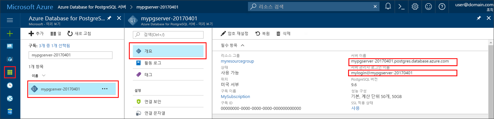

# <a name="azure-database-for-postgresql-use-nodejs-tooconnect-and-query-data"></a><span data-ttu-id="b9442-103">Azure 데이터베이스에 대 한 PostgreSQL: 사용 하 여 Node.js tooconnect 및 쿼리 데이터</span><span class="sxs-lookup"><span data-stu-id="b9442-103">Azure Database for PostgreSQL: Use Node.js tooconnect and query data</span></span>
<span data-ttu-id="b9442-104">이 빠른 시작에서는 tooconnect tooan Azure PostgreSQL 사용에 대 한 데이터베이스 방법을 [Node.js](https://nodejs.org/)합니다.</span><span class="sxs-lookup"><span data-stu-id="b9442-104">This quickstart demonstrates how tooconnect tooan Azure Database for PostgreSQL using [Node.js](https://nodejs.org/).</span></span> <span data-ttu-id="b9442-105">Toouse SQL 문 tooquery를 삽입, 업데이트 및 hello 데이터베이스의 데이터를 삭제 방법을 보여 줍니다.</span><span class="sxs-lookup"><span data-stu-id="b9442-105">It shows how toouse SQL statements tooquery, insert, update, and delete data in hello database.</span></span> <span data-ttu-id="b9442-106">hello이 문서의 단계 Node.js를 사용 하 여 개발 된 익숙한 고 가정 PostgreSQL에 대 한 Azure 데이터베이스와 새 tooworking 한다고 합니다.</span><span class="sxs-lookup"><span data-stu-id="b9442-106">hello steps in this article assume that you are familiar with developing using Node.js, and that you are new tooworking with Azure Database for PostgreSQL.</span></span>

## <a name="prerequisites"></a><span data-ttu-id="b9442-107">필수 조건</span><span class="sxs-lookup"><span data-stu-id="b9442-107">Prerequisites</span></span>
<span data-ttu-id="b9442-108">이 퀵 스타트의 시작 지점으로이 가이드의 중 하나에서 만든 hello 리소스를 사용 합니다.</span><span class="sxs-lookup"><span data-stu-id="b9442-108">This quickstart uses hello resources created in either of these guides as a starting point:</span></span>
- [<span data-ttu-id="b9442-109">DB 만들기 - 포털</span><span class="sxs-lookup"><span data-stu-id="b9442-109">Create DB - Portal</span></span>](quickstart-create-server-database-portal.md)
- [<span data-ttu-id="b9442-110">DB 만들기 - CLI</span><span class="sxs-lookup"><span data-stu-id="b9442-110">Create DB - CLI</span></span>](quickstart-create-server-database-azure-cli.md)

<span data-ttu-id="b9442-111">다음과 같은 작업도 필요합니다.</span><span class="sxs-lookup"><span data-stu-id="b9442-111">You also need to:</span></span>
- <span data-ttu-id="b9442-112">[Node.js](https://nodejs.org)</span><span class="sxs-lookup"><span data-stu-id="b9442-112">Install [Node.js](https://nodejs.org)</span></span>

## <a name="install-pg-client"></a><span data-ttu-id="b9442-113">Pg 클라이언트 설치</span><span class="sxs-lookup"><span data-stu-id="b9442-113">Install pg client</span></span>
<span data-ttu-id="b9442-114">Node.js용 PostgreSQL 클라이언트인 [pg](https://www.npmjs.com/package/pg)를 설치합니다.</span><span class="sxs-lookup"><span data-stu-id="b9442-114">Install [pg](https://www.npmjs.com/package/pg), which is a PostgreSQL client for Node.js.</span></span>

<span data-ttu-id="b9442-115">따라서 toodo 명령줄 tooinstall hello pg 클라이언트에서 hello 노드 패키지 관리자 (npm) javascript 실행 합니다.</span><span class="sxs-lookup"><span data-stu-id="b9442-115">toodo so, run hello node package manager (npm) for JavaScript from your command line tooinstall hello pg client.</span></span>
```bash
npm install pg
```

<span data-ttu-id="b9442-116">설치 된 hello 패키지를 나열 하 여 hello 설치를 확인 합니다.</span><span class="sxs-lookup"><span data-stu-id="b9442-116">Verify hello installation by listing hello packages installed.</span></span>
```bash
npm list
```

## <a name="get-connection-information"></a><span data-ttu-id="b9442-117">연결 정보 가져오기</span><span class="sxs-lookup"><span data-stu-id="b9442-117">Get connection information</span></span>
<span data-ttu-id="b9442-118">PostgreSQL를 hello 연결 필요한 정보 tooconnect toohello를 Azure 데이터베이스를 가져옵니다.</span><span class="sxs-lookup"><span data-stu-id="b9442-118">Get hello connection information needed tooconnect toohello Azure Database for PostgreSQL.</span></span> <span data-ttu-id="b9442-119">정규화 된 서버 이름 및 로그인 자격 증명 hello 필요 합니다.</span><span class="sxs-lookup"><span data-stu-id="b9442-119">You need hello fully qualified server name and login credentials.</span></span>

1. <span data-ttu-id="b9442-120">Toohello 로그인 [Azure 포털](https://portal.azure.com/)합니다.</span><span class="sxs-lookup"><span data-stu-id="b9442-120">Log in toohello [Azure portal](https://portal.azure.com/).</span></span>
2. <span data-ttu-id="b9442-121">Azure 포털에서 왼쪽 메뉴 hello에서에서 클릭 **모든 리소스** 방금 만든 hello 서버에 대 한 검색 합니다.</span><span class="sxs-lookup"><span data-stu-id="b9442-121">From hello left-hand menu in Azure portal, click **All resources** and search for hello server you just created.</span></span>
3. <span data-ttu-id="b9442-122">Hello 서버 이름을 클릭 합니다.</span><span class="sxs-lookup"><span data-stu-id="b9442-122">Click hello server name.</span></span>
4. <span data-ttu-id="b9442-123">선택 hello 서버 **개요** 페이지.</span><span class="sxs-lookup"><span data-stu-id="b9442-123">Select hello server's **Overview** page.</span></span> <span data-ttu-id="b9442-124">Hello 메모 **서버 이름** 및 **서버 관리자 로그인 이름**합니다.</span><span class="sxs-lookup"><span data-stu-id="b9442-124">Make a note of hello **Server name** and **Server admin login name**.</span></span>
 <span data-ttu-id="b9442-125"></span><span class="sxs-lookup"><span data-stu-id="b9442-125"></span></span>
5. <span data-ttu-id="b9442-126">서버 로그인 정보를 잊은 경우 탐색 toohello **개요** tooview hello 서버 관리자 로그인 이름 페이지 하 고 필요한 경우 다시 설정 hello 암호입니다.</span><span class="sxs-lookup"><span data-stu-id="b9442-126">If you forget your server login information, navigate toohello **Overview** page tooview hello Server admin login name and, if necessary, reset hello password.</span></span>

## <a name="running-hello-javascript-code-in-nodejs"></a><span data-ttu-id="b9442-127">Node.js에 hello JavaScript 코드를 실행합니다.</span><span class="sxs-lookup"><span data-stu-id="b9442-127">Running hello JavaScript code in Node.js</span></span>
<span data-ttu-id="b9442-128">입력 하 여 hello bash 셸 또는 windows 명령 프롬프트에서 Node.js를 시작할 수 있습니다 `node`, 다음 복사 하 여 hello 예제 JavaScript 코드를 대화형으로 실행 및 hello 프롬프트에 붙여 넣는 것입니다.</span><span class="sxs-lookup"><span data-stu-id="b9442-128">You may launch Node.js from hello bash shell or windows command prompt by typing `node`, then run hello example JavaScript code interactively by copy and pasting it onto hello prompt.</span></span> <span data-ttu-id="b9442-129">또는 hello JavaScript 코드 실행 및 텍스트 파일에 저장할 수 있습니다 있습니다 `node filename.js` hello 파일 이름으로 매개 변수 toorun 것입니다.</span><span class="sxs-lookup"><span data-stu-id="b9442-129">Alternatively, you may save hello JavaScript code into a text file and launch `node filename.js` with hello file name as a parameter toorun it.</span></span>

## <a name="connect-create-table-and-insert-data"></a><span data-ttu-id="b9442-130">테이블 연결, 생성 및 데이터 삽입</span><span class="sxs-lookup"><span data-stu-id="b9442-130">Connect, create table, and insert data</span></span>
<span data-ttu-id="b9442-131">사용 하 여 hello 다음 tooconnect 코드을 사용 하 여 hello 데이터 로드 **CREATE TABLE** 및 **INSERT INTO** SQL 문입니다.</span><span class="sxs-lookup"><span data-stu-id="b9442-131">Use hello following code tooconnect and load hello data using **CREATE TABLE** and  **INSERT INTO** SQL statements.</span></span>
<span data-ttu-id="b9442-132">hello [pg 합니다. 클라이언트](https://github.com/brianc/node-postgres/wiki/Client) 개체는 사용 되는 toointerface hello PostgreSQL 서버와 합니다.</span><span class="sxs-lookup"><span data-stu-id="b9442-132">hello [pg.Client](https://github.com/brianc/node-postgres/wiki/Client) object is used toointerface with hello PostgreSQL server.</span></span> <span data-ttu-id="b9442-133">hello [pg 합니다. Client.connect()](https://github.com/brianc/node-postgres/wiki/Client#method-connect) 함수는 사용 되는 tooestablish hello 연결 toohello 서버입니다.</span><span class="sxs-lookup"><span data-stu-id="b9442-133">hello [pg.Client.connect()](https://github.com/brianc/node-postgres/wiki/Client#method-connect) function is used tooestablish hello connection toohello server.</span></span> <span data-ttu-id="b9442-134">hello [pg 합니다. Client.query()](https://github.com/brianc/node-postgres/wiki/Query) 함수는 PostgreSQL 데이터베이스에 대해 사용 되는 tooexecute hello SQL 쿼리 합니다.</span><span class="sxs-lookup"><span data-stu-id="b9442-134">hello [pg.Client.query()](https://github.com/brianc/node-postgres/wiki/Query) function is used tooexecute hello SQL query against PostgreSQL database.</span></span> 

<span data-ttu-id="b9442-135">Hello 서버 및 데이터베이스를 만들 때 지정한 hello 값이 있는 hello 호스트, dbname, 사용자 및 암호 매개 변수를 대체 합니다.</span><span class="sxs-lookup"><span data-stu-id="b9442-135">Replace hello host, dbname, user, and password parameters with hello values that you specified when you created hello server and database.</span></span>

```javascript
const pg = require('pg');

const config = {
    host: '<your-db-server-name>.postgres.database.azure.com',
    // Do not hard code your username and password.
    // Consider using Node environment variables.
    user: '<your-db-username>',     
    password: '<your-password>',
    database: '<name-of-database>',
    port: 5432,
    ssl: true
};

const client = new pg.Client(config);

client.connect(err => {
    if (err) throw err;
    else {
        queryDatabase();
    }
});

function queryDatabase() {
    const query = `
        DROP TABLE IF EXISTS inventory;
        CREATE TABLE inventory (id serial PRIMARY KEY, name VARCHAR(50), quantity INTEGER);
        INSERT INTO inventory (name, quantity) VALUES ('banana', 150);
        INSERT INTO inventory (name, quantity) VALUES ('orange', 154);
        INSERT INTO inventory (name, quantity) VALUES ('apple', 100);
    `;

    client
        .query(query)
        .then(() => {
            console.log('Table created successfully!');
            client.end(console.log('Closed client connection'));
        })
        .catch(err => console.log(err))
        .then(() => {
            console.log('Finished execution, exiting now');
            process.exit();
        });
}
```

## <a name="read-data"></a><span data-ttu-id="b9442-136">데이터 읽기</span><span class="sxs-lookup"><span data-stu-id="b9442-136">Read data</span></span>
<span data-ttu-id="b9442-137">사용 하 여 hello 다음 tooconnect 코드을 사용 하 여 hello 데이터 읽기는 **선택** SQL 문입니다.</span><span class="sxs-lookup"><span data-stu-id="b9442-137">Use hello following code tooconnect and read hello data using a **SELECT** SQL statement.</span></span> <span data-ttu-id="b9442-138">hello [pg 합니다. 클라이언트](https://github.com/brianc/node-postgres/wiki/Client) 개체는 사용 되는 toointerface hello PostgreSQL 서버와 합니다.</span><span class="sxs-lookup"><span data-stu-id="b9442-138">hello [pg.Client](https://github.com/brianc/node-postgres/wiki/Client) object is used toointerface with hello PostgreSQL server.</span></span> <span data-ttu-id="b9442-139">hello [pg 합니다. Client.connect()](https://github.com/brianc/node-postgres/wiki/Client#method-connect) 함수는 사용 되는 tooestablish hello 연결 toohello 서버입니다.</span><span class="sxs-lookup"><span data-stu-id="b9442-139">hello [pg.Client.connect()](https://github.com/brianc/node-postgres/wiki/Client#method-connect) function is used tooestablish hello connection toohello server.</span></span> <span data-ttu-id="b9442-140">hello [pg 합니다. Client.query()](https://github.com/brianc/node-postgres/wiki/Query) 함수는 PostgreSQL 데이터베이스에 대해 사용 되는 tooexecute hello SQL 쿼리 합니다.</span><span class="sxs-lookup"><span data-stu-id="b9442-140">hello [pg.Client.query()](https://github.com/brianc/node-postgres/wiki/Query) function is used tooexecute hello SQL query against PostgreSQL database.</span></span> 

<span data-ttu-id="b9442-141">Hello 서버 및 데이터베이스를 만들 때 지정한 hello 값이 있는 hello 호스트, dbname, 사용자 및 암호 매개 변수를 대체 합니다.</span><span class="sxs-lookup"><span data-stu-id="b9442-141">Replace hello host, dbname, user, and password parameters with hello values that you specified when you created hello server and database.</span></span> 

```javascript
const pg = require('pg');

const config = {
    host: '<your-db-server-name>.postgres.database.azure.com',
    // Do not hard code your username and password.
    // Consider using Node environment variables.
    user: '<your-db-username>',     
    password: '<your-password>',
    database: '<name-of-database>',
    port: 5432,
    ssl: true
};

const client = new pg.Client(config);

client.connect(err => {
    if (err) throw err;
    else { queryDatabase(); }
});

function queryDatabase() {
  
    console.log(`Running query tooPostgreSQL server: ${config.host}`);

    const query = 'SELECT * FROM inventory;';

    client.query(query)
        .then(res => {
            const rows = res.rows;

            rows.map(row => {
                console.log(`Read: ${JSON.stringify(row)}`);
            });

            process.exit();
        })
        .catch(err => {
            console.log(err);
        });
}
```

## <a name="update-data"></a><span data-ttu-id="b9442-142">데이터 업데이트</span><span class="sxs-lookup"><span data-stu-id="b9442-142">Update data</span></span>
<span data-ttu-id="b9442-143">사용 하 여 hello 다음 tooconnect 코드을 사용 하 여 hello 데이터 읽기는 **업데이트** SQL 문입니다.</span><span class="sxs-lookup"><span data-stu-id="b9442-143">Use hello following code tooconnect and read hello data using a **UPDATE** SQL statement.</span></span> <span data-ttu-id="b9442-144">hello [pg 합니다. 클라이언트](https://github.com/brianc/node-postgres/wiki/Client) 개체는 사용 되는 toointerface hello PostgreSQL 서버와 합니다.</span><span class="sxs-lookup"><span data-stu-id="b9442-144">hello [pg.Client](https://github.com/brianc/node-postgres/wiki/Client) object is used toointerface with hello PostgreSQL server.</span></span> <span data-ttu-id="b9442-145">hello [pg 합니다. Client.connect()](https://github.com/brianc/node-postgres/wiki/Client#method-connect) 함수는 사용 되는 tooestablish hello 연결 toohello 서버입니다.</span><span class="sxs-lookup"><span data-stu-id="b9442-145">hello [pg.Client.connect()](https://github.com/brianc/node-postgres/wiki/Client#method-connect) function is used tooestablish hello connection toohello server.</span></span> <span data-ttu-id="b9442-146">hello [pg 합니다. Client.query()](https://github.com/brianc/node-postgres/wiki/Query) 함수는 PostgreSQL 데이터베이스에 대해 사용 되는 tooexecute hello SQL 쿼리 합니다.</span><span class="sxs-lookup"><span data-stu-id="b9442-146">hello [pg.Client.query()](https://github.com/brianc/node-postgres/wiki/Query) function is used tooexecute hello SQL query against PostgreSQL database.</span></span> 

<span data-ttu-id="b9442-147">Hello 서버 및 데이터베이스를 만들 때 지정한 hello 값이 있는 hello 호스트, dbname, 사용자 및 암호 매개 변수를 대체 합니다.</span><span class="sxs-lookup"><span data-stu-id="b9442-147">Replace hello host, dbname, user, and password parameters with hello values that you specified when you created hello server and database.</span></span> 

```javascript
const pg = require('pg');

const config = {
    host: '<your-db-server-name>.postgres.database.azure.com',
    // Do not hard code your username and password.
    // Consider using Node environment variables.
    user: '<your-db-username>',     
    password: '<your-password>',
    database: '<name-of-database>',
    port: 5432,
    ssl: true
};

const client = new pg.Client(config);

client.connect(err => {
    if (err) throw err;
    else {
        queryDatabase();
    }
});

function queryDatabase() {
    const query = `
        UPDATE inventory 
        SET quantity= 1000 WHERE name='banana';
    `;

    client
        .query(query)
        .then(result => {
            console.log('Update completed');
            console.log(`Rows affected: ${result.rowCount}`);
        })
        .catch(err => {
            console.log(err);
            throw err;
        });
}
```

## <a name="delete-data"></a><span data-ttu-id="b9442-148">데이터 삭제</span><span class="sxs-lookup"><span data-stu-id="b9442-148">Delete data</span></span>
<span data-ttu-id="b9442-149">사용 하 여 hello 다음 tooconnect 코드을 사용 하 여 hello 데이터 읽기는 **삭제** SQL 문입니다.</span><span class="sxs-lookup"><span data-stu-id="b9442-149">Use hello following code tooconnect and read hello data using a **DELETE** SQL statement.</span></span> <span data-ttu-id="b9442-150">hello [pg 합니다. 클라이언트](https://github.com/brianc/node-postgres/wiki/Client) 개체는 사용 되는 toointerface hello PostgreSQL 서버와 합니다.</span><span class="sxs-lookup"><span data-stu-id="b9442-150">hello [pg.Client](https://github.com/brianc/node-postgres/wiki/Client) object is used toointerface with hello PostgreSQL server.</span></span> <span data-ttu-id="b9442-151">hello [pg 합니다. Client.connect()](https://github.com/brianc/node-postgres/wiki/Client#method-connect) 함수는 사용 되는 tooestablish hello 연결 toohello 서버입니다.</span><span class="sxs-lookup"><span data-stu-id="b9442-151">hello [pg.Client.connect()](https://github.com/brianc/node-postgres/wiki/Client#method-connect) function is used tooestablish hello connection toohello server.</span></span> <span data-ttu-id="b9442-152">hello [pg 합니다. Client.query()](https://github.com/brianc/node-postgres/wiki/Query) 함수는 PostgreSQL 데이터베이스에 대해 사용 되는 tooexecute hello SQL 쿼리 합니다.</span><span class="sxs-lookup"><span data-stu-id="b9442-152">hello [pg.Client.query()](https://github.com/brianc/node-postgres/wiki/Query) function is used tooexecute hello SQL query against PostgreSQL database.</span></span> 

<span data-ttu-id="b9442-153">Hello 서버 및 데이터베이스를 만들 때 지정한 hello 값이 있는 hello 호스트, dbname, 사용자 및 암호 매개 변수를 대체 합니다.</span><span class="sxs-lookup"><span data-stu-id="b9442-153">Replace hello host, dbname, user, and password parameters with hello values that you specified when you created hello server and database.</span></span> 

```javascript
const pg = require('pg');

const config = {
    host: '<your-db-server-name>.postgres.database.azure.com',
    // Do not hard code your username and password.
    // Consider using Node environment variables.
    user: '<your-db-username>',     
    password: '<your-password>',
    database: '<name-of-database>',
    port: 5432,
    ssl: true
};

const client = new pg.Client(config);

client.connect(err => {
    if (err) {
        throw err;
    } else {
        queryDatabase();
    }
});

function queryDatabase() {
    const query = `
        DELETE FROM inventory 
        WHERE name = 'apple';
    `;

    client
        .query(query)
        .then(result => {
            console.log('Delete completed');
            console.log(`Rows affected: ${result.rowCount}`);
        })
        .catch(err => {
            console.log(err);
            throw err;
        });
}
```

## <a name="next-steps"></a><span data-ttu-id="b9442-154">다음 단계</span><span class="sxs-lookup"><span data-stu-id="b9442-154">Next steps</span></span>
> [!div class="nextstepaction"]
> [<span data-ttu-id="b9442-155">내보내기 및 가져오기를 사용하여 데이터베이스 마이그레이션</span><span class="sxs-lookup"><span data-stu-id="b9442-155">Migrate your database using Export and Import</span></span>](./howto-migrate-using-export-and-import.md)
