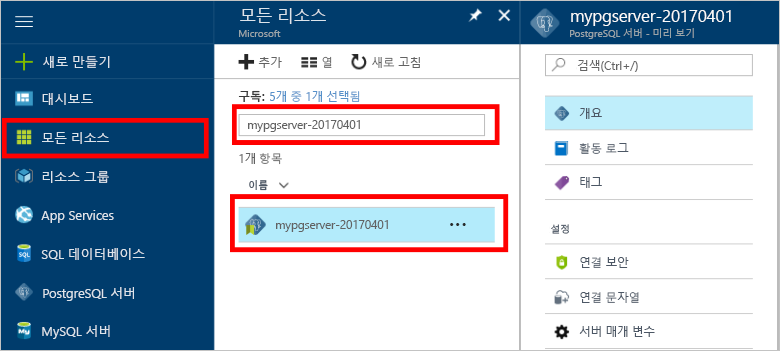

# Azure Portal을 사용하여 PostgreSQL용 Azure 데이터베이스에서 서버를 백업 및 복원하는 방법How To Backup and Restore a server in Azure Database for PostgreSQL using the Azure portal

## 자동으로 수행되는 백업Backup happens Automatically
PostgreSQL용 Azure Database를 사용할 경우 데이터베이스 서비스가 자동으로 5분마다 서비스 백업을 수행합니다.When using Azure Database for PostgreSQL, the database service automatically makes a backup of the service every 5 minutes. 

백업은 기본 계층을 사용하는 경우 7일, 표준 계층을 사용하는 경우 35일 동안 사용할 수 있습니다.The backups are available for 7 days when using Basic Tier, and 35 days when using Standard Tier. 자세한 내용은 [PostgreSQL용 Azure Database 서비스 계층](concepts-service-tiers.md)을 참조하세요.For more information, see [Azure Database for PostgreSQL service tiers](concepts-service-tiers.md)

이 자동 백업 기능을 사용하면 서버 및 모든 데이터베이스를 새 서버에 이전 특정 시점으로 복원할 수도 있습니다.Using this automatic backup feature you may restore the server and all its databases into a new server to an earlier point-in-time.

## Azure Portal에서 복원Restore in the Azure portal
PostgreSQL용 Azure Database를 사용하면 서버를 다시 특정 시점으로 서버의 새 복사본에 복원할 수 있습니다.Azure Database for PostgreSQL allows you to restore the server back to a point in time and into to a new copy of the server. 이 새 서버를 사용하여 데이터를 복구할 수 있습니다.You can use this new server to recover your data. 

예를 들어 오늘 정오에 실수로 테이블을 삭제한 경우 정오 바로 전으로 복원하고 누락된 테이블과 데이터를 서버의 새로운 복사본에서 검색할 수 있습니다.For example, if a table was accidentally dropped at noon today, you could restore to the time just before noon and retrieve the missing table and data from that new copy of the server.

다음 단계는 샘플 서버를 특정 시점으로 복원합니다.The following steps restore the sample server to a point in time:
1. [Azure Portal](https://portal.azure.com/)에 로그인합니다.Sign into the [Azure portal](https://portal.azure.com/)
2. PostgreSQL용 Azure 데이터베이스 서버를 찾습니다.Locate your Azure Database for PostgreSQL server. Azure Portal에서 왼쪽 메뉴의 **모든 리소스**를 클릭하고 **mypgserver-20170401**과 같은 이름을 입력하여 기존 서버를 검색합니다.In the Azure portal, click **All Resources** from the left-hand menu and type in the name, such as **mypgserver-20170401**, to search for your existing server. 검색 결과에 나열된 서버 이름을 클릭합니다.Click the server name listed in the search result. 서버에 대한 **개요** 페이지가 열리고 추가 구성을 위한 옵션이 제공됩니다.The **Overview** page for your server opens and provides options for further configuration.

   

3. 서버 개요 블레이드 맨 위에서 도구 모음에 있는 **복원**을 클릭합니다.On the top of the server overview blade, click **Restore** on the toolbar. 복원 블레이드가 열립니다.The Restore blade opens.

   

4. 필요한 정보로 복원 양식을 채웁니다.Fill out the Restore form with the required information:

   
  - **복원 지점**: 서버를 변경하기 전 발생한 특정 시점을 선택합니다.**Restore point**: Select a point-in-time that occurs before the server was changed
  - **대상 서버**: 복원하려는 새 서버의 이름을 제공합니다.**Target server**: Provide a new server name you want to restore to
  - **위치**: 지역은 선택할 수 없으며, 기본적으로 원본 서버와 동일합니다.**Location**: You cannot select the region, by default it is same as the source server
  - **가격 책정 계층**: 이 값은 서버를 복원할 때 변경할 수 없습니다.**Pricing tier**: You cannot change this value when restoring a server. 원본 서버와 동일합니다.It is same as the source server. 

5. **확인**을 클릭하여 특정 시점으로 복원할 서버를 복원합니다.Click **OK** to restore the server to restore to a point in time. 

6. 복원이 완료되면 예상대로 데이터가 복원되었는지 확인하기 위해 생성하였던 새 서버를 찾습니다.Once the restore finishes, locate the new server that is created to verify the data was restored as expected.

## 다음 단계Next steps
- [PostgreSQL용 Azure Database에 대한 연결 라이브러리Connection libraries for Azure Database for PostgreSQL](concepts-connection-libraries.md)
