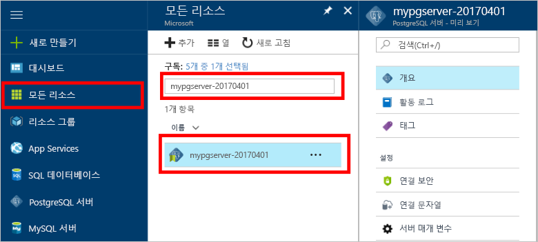

# <a name="create-an-azure-database-for-postgresql-in-hello-azure-portal"></a><span data-ttu-id="2b7d9-103">Hello Azure 포털에서에서 PostgreSQL에 대 한 Azure 데이터베이스 만들기</span><span class="sxs-lookup"><span data-stu-id="2b7d9-103">Create an Azure Database for PostgreSQL in hello Azure portal</span></span>

<span data-ttu-id="2b7d9-104">Azure에 대 한 PostgreSQL 데이터베이스가 toorun 수 있는 관리 되는 서비스, 관리 하 고 hello 클라우드에서 항상 사용 가능한 PostgreSQL 데이터베이스의 크기를 조정 합니다.</span><span class="sxs-lookup"><span data-stu-id="2b7d9-104">Azure Database for PostgreSQL is a managed service that enables you toorun, manage, and scale highly available PostgreSQL databases in hello cloud.</span></span> <span data-ttu-id="2b7d9-105">이 퀵 스타트의 toocreate Azure 데이터베이스 방법 PostgreSQL 서버 hello Azure 포털을 사용 하 여 약 5 분 내에 표시 됩니다.</span><span class="sxs-lookup"><span data-stu-id="2b7d9-105">This quickstart shows you how toocreate an Azure Database for PostgreSQL server using hello Azure portal in about five minutes.</span></span>

<span data-ttu-id="2b7d9-106">Azure 구독이 아직 없는 경우 시작하기 전에 [체험](https://azure.microsoft.com/free/) 계정을 만듭니다.</span><span class="sxs-lookup"><span data-stu-id="2b7d9-106">If you don't have an Azure subscription, create a [free](https://azure.microsoft.com/free/) account before you begin.</span></span>

## <a name="log-in-toohello-azure-portal"></a><span data-ttu-id="2b7d9-107">Azure 포털 toohello에 로그인</span><span class="sxs-lookup"><span data-stu-id="2b7d9-107">Log in toohello Azure portal</span></span>
<span data-ttu-id="2b7d9-108">웹 브라우저를 열고 toohello [Microsoft Azure 포털](https://portal.azure.com/)합니다.</span><span class="sxs-lookup"><span data-stu-id="2b7d9-108">Open your web browser, and navigate toohello [Microsoft Azure portal](https://portal.azure.com/).</span></span> <span data-ttu-id="2b7d9-109">자격 증명 toosign toohello 포털에 입력 합니다.</span><span class="sxs-lookup"><span data-stu-id="2b7d9-109">Enter your credentials toosign in toohello portal.</span></span> <span data-ttu-id="2b7d9-110">hello 기본 보기는 서비스 대시보드에.</span><span class="sxs-lookup"><span data-stu-id="2b7d9-110">hello default view is your service dashboard.</span></span>

## <a name="create-an-azure-database-for-postgresql"></a><span data-ttu-id="2b7d9-111">PostgreSQL용 Azure Database 만들기</span><span class="sxs-lookup"><span data-stu-id="2b7d9-111">Create an Azure Database for PostgreSQL</span></span>

<span data-ttu-id="2b7d9-112">Azure Database for PostgreSQL 서버는 정의된 [계산 및 저장소 리소스](./concepts-compute-unit-and-storage.md) 집합으로 만들어집니다.</span><span class="sxs-lookup"><span data-stu-id="2b7d9-112">An Azure Database for PostgreSQL server is created with a defined set of [compute and storage resources](./concepts-compute-unit-and-storage.md).</span></span> <span data-ttu-id="2b7d9-113">hello 서버 내에서 만든는 [Azure 리소스 그룹](../azure-resource-manager/resource-group-overview.md)합니다.</span><span class="sxs-lookup"><span data-stu-id="2b7d9-113">hello server is created within an [Azure resource group](../azure-resource-manager/resource-group-overview.md).</span></span>

<span data-ttu-id="2b7d9-114">이러한 단계 toocreate PostgreSQL 서버에 대 한 Azure 데이터베이스를 수행 합니다.</span><span class="sxs-lookup"><span data-stu-id="2b7d9-114">Follow these steps toocreate an Azure Database for PostgreSQL server:</span></span>
1.  <span data-ttu-id="2b7d9-115">Hello 클릭 **새로** 단추 (+) hello 왼쪽 위 모서리의 hello Azure 포털에서 찾을 수 있습니다.</span><span class="sxs-lookup"><span data-stu-id="2b7d9-115">Click hello **New** button (+) found on hello upper left-hand corner of hello Azure portal.</span></span>
2.  <span data-ttu-id="2b7d9-116">선택 **데이터베이스** hello에서 **새로** 선택한 페이지 **Azure PostgreSQL 데이터베이스** hello에서 **데이터베이스** 페이지.</span><span class="sxs-lookup"><span data-stu-id="2b7d9-116">Select **Databases** from hello **New** page, and select **Azure Database for PostgreSQL** from hello **Databases** page.</span></span>
 <span data-ttu-id="2b7d9-117"></span><span class="sxs-lookup"><span data-stu-id="2b7d9-117"></span></span>

3.  <span data-ttu-id="2b7d9-118">Hello 이미지 앞에 표시 된 대로 hello 새 서버 세부 정보 양식을 사용 hello 다음 정보를 입력 합니다.</span><span class="sxs-lookup"><span data-stu-id="2b7d9-118">Fill out hello new server details form with hello following information, as shown on hello preceding image:</span></span>

    <span data-ttu-id="2b7d9-119">설정</span><span class="sxs-lookup"><span data-stu-id="2b7d9-119">Setting</span></span>|<span data-ttu-id="2b7d9-120">제안 값</span><span class="sxs-lookup"><span data-stu-id="2b7d9-120">Suggested value</span></span>|<span data-ttu-id="2b7d9-121">설명</span><span class="sxs-lookup"><span data-stu-id="2b7d9-121">Description</span></span>
    ---|---|---
    <span data-ttu-id="2b7d9-122">서버 이름</span><span class="sxs-lookup"><span data-stu-id="2b7d9-122">Server name</span></span> |<span data-ttu-id="2b7d9-123">*mypgserver-20170401*</span><span class="sxs-lookup"><span data-stu-id="2b7d9-123">*mypgserver-20170401*</span></span>|<span data-ttu-id="2b7d9-124">Azure Database for PostgreSQL 서버를 식별하는 고유한 이름을 선택합니다.</span><span class="sxs-lookup"><span data-stu-id="2b7d9-124">Choose a unique name that identifies your Azure Database for PostgreSQL server.</span></span> <span data-ttu-id="2b7d9-125">hello 도메인 이름 *postgres.database.azure.com* 를 tooconnect 응용 프로그램에 대해 제공한 추가 toohello 서버 이름입니다.</span><span class="sxs-lookup"><span data-stu-id="2b7d9-125">hello domain name *postgres.database.azure.com* is appended toohello server name you provide for applications tooconnect to.</span></span> <span data-ttu-id="2b7d9-126">hello 서버 이름에는 소문자, 숫자 및 hello 하이픈 (-) 문자를 포함 될 수 있습니다 및 3에서 63 자 사이 포함 해야 합니다.</span><span class="sxs-lookup"><span data-stu-id="2b7d9-126">hello server name can contain only lowercase letters, numbers, and hello hyphen (-) character, and it must contain from 3 through 63 characters.</span></span>
    <span data-ttu-id="2b7d9-127">구독</span><span class="sxs-lookup"><span data-stu-id="2b7d9-127">Subscription</span></span>|<span data-ttu-id="2b7d9-128">*사용자의 구독*</span><span class="sxs-lookup"><span data-stu-id="2b7d9-128">*Your subscription*</span></span>|<span data-ttu-id="2b7d9-129">hello 서버에 대 한 toouse 되도록 Azure 구독.</span><span class="sxs-lookup"><span data-stu-id="2b7d9-129">hello Azure subscription that you want toouse for your server.</span></span> <span data-ttu-id="2b7d9-130">여러 구독이 있는 경우는 hello 리소스에 대 한 요금이 청구 됩니다 hello 적절 한 구독을 선택 합니다.</span><span class="sxs-lookup"><span data-stu-id="2b7d9-130">If you have multiple subscriptions, choose hello appropriate subscription in which hello resource is billed for.</span></span>
    <span data-ttu-id="2b7d9-131">리소스 그룹</span><span class="sxs-lookup"><span data-stu-id="2b7d9-131">Resource Group</span></span>|<span data-ttu-id="2b7d9-132">*myresourcegroup*</span><span class="sxs-lookup"><span data-stu-id="2b7d9-132">*myresourcegroup*</span></span>| <span data-ttu-id="2b7d9-133">새 리소스 그룹 이름을 만들거나, 구독에서 기존 이름을 사용할 수 있습니다.</span><span class="sxs-lookup"><span data-stu-id="2b7d9-133">You may make a new resource group name, or use an existing one from your subscription.</span></span>
    <span data-ttu-id="2b7d9-134">서버 관리자 로그인</span><span class="sxs-lookup"><span data-stu-id="2b7d9-134">Server admin login</span></span> |<span data-ttu-id="2b7d9-135">*mylogin*</span><span class="sxs-lookup"><span data-stu-id="2b7d9-135">*mylogin*</span></span>| <span data-ttu-id="2b7d9-136">Toohello 서버에 연결 하는 경우 직접 로그인 계정 toouse를 확인 합니다.</span><span class="sxs-lookup"><span data-stu-id="2b7d9-136">Make your own login account toouse when connecting toohello server.</span></span> <span data-ttu-id="2b7d9-137">hello 관리자 로그인 이름 'azure_superuser', 'azure_pg_admin', '관리', '관리자', '루트', 'guest' 또는 'public' 일 수 없습니다 및 'pg_'로 시작할 수 없습니다.</span><span class="sxs-lookup"><span data-stu-id="2b7d9-137">hello admin login name cannot be 'azure_superuser', 'azure_pg_admin', 'admin', 'administrator', 'root', 'guest', or 'public', and cannot start with 'pg_'.</span></span>
    <span data-ttu-id="2b7d9-138">암호</span><span class="sxs-lookup"><span data-stu-id="2b7d9-138">Password</span></span> |<span data-ttu-id="2b7d9-139">*사용자 선택*</span><span class="sxs-lookup"><span data-stu-id="2b7d9-139">*Your choice*</span></span> | <span data-ttu-id="2b7d9-140">서버 관리자 계정은 hello에 대 한 새 암호를 만듭니다.</span><span class="sxs-lookup"><span data-stu-id="2b7d9-140">Create a new password for hello server admin account.</span></span> <span data-ttu-id="2b7d9-141">8 too128 문자를 포함 해야 합니다.</span><span class="sxs-lookup"><span data-stu-id="2b7d9-141">Must contain from 8 too128 characters.</span></span> <span data-ttu-id="2b7d9-142">암호는 hello 다음 범주 중 세 범주의 문자를 포함 해야-영어 대문자 문자, 영어 소문자, 숫자 (0-9) 및 영숫자가 아닌 문자 (!, $, #, % 등.).</span><span class="sxs-lookup"><span data-stu-id="2b7d9-142">Your password must contain characters from three of hello following categories – English uppercase letters, English lowercase letters, numbers (0-9), and non-alphanumeric characters (!, $, #, %, etc.).</span></span>
    <span data-ttu-id="2b7d9-143">위치</span><span class="sxs-lookup"><span data-stu-id="2b7d9-143">Location</span></span>|<span data-ttu-id="2b7d9-144">*hello 지역 가장 가까운 tooyour 사용자*</span><span class="sxs-lookup"><span data-stu-id="2b7d9-144">*hello region closest tooyour users*</span></span>| <span data-ttu-id="2b7d9-145">가장 가까운 tooyour 사용자 hello 위치를 선택 합니다.</span><span class="sxs-lookup"><span data-stu-id="2b7d9-145">Choose hello location that's closest tooyour users.</span></span>
    <span data-ttu-id="2b7d9-146">PostgreSQL 버전</span><span class="sxs-lookup"><span data-stu-id="2b7d9-146">PostgreSQL Version</span></span>|<span data-ttu-id="2b7d9-147">*Hello 최신 버전을 선택*</span><span class="sxs-lookup"><span data-stu-id="2b7d9-147">*Choose hello latest version*</span></span>| <span data-ttu-id="2b7d9-148">특정 요구 사항이 있는 경우가 아니면 hello 최신 버전을 선택 합니다.</span><span class="sxs-lookup"><span data-stu-id="2b7d9-148">Choose hello latest version unless you have specific requirements.</span></span>
    <span data-ttu-id="2b7d9-149">가격 책정 계층</span><span class="sxs-lookup"><span data-stu-id="2b7d9-149">Pricing Tier</span></span> | <span data-ttu-id="2b7d9-150">**기본**, **50 Compute 단위** **50 GB**</span><span class="sxs-lookup"><span data-stu-id="2b7d9-150">**Basic**, **50 Compute Units** **50 GB**</span></span> | <span data-ttu-id="2b7d9-151">클릭 **가격 책정 계층** toospecify hello 서비스 계층과 성능 수준을 새 데이터베이스에 대 한 합니다.</span><span class="sxs-lookup"><span data-stu-id="2b7d9-151">Click **Pricing tier** toospecify hello service tier and performance level for your new database.</span></span> <span data-ttu-id="2b7d9-152">Hello 위쪽 hello 탭에서 기본 계층을 선택 합니다.</span><span class="sxs-lookup"><span data-stu-id="2b7d9-152">Choose Basic tier in hello tab at hello top.</span></span> <span data-ttu-id="2b7d9-153">Hello 단위 계산 슬라이더 tooadjust hello 값 toohello의 왼쪽된 끝 hello 클릭이 빠른 시작에 사용할 수 있는 최소 크기입니다.</span><span class="sxs-lookup"><span data-stu-id="2b7d9-153">Click hello left end of hello Compute Units slider tooadjust hello value toohello least amount available for this quickstart.</span></span> <span data-ttu-id="2b7d9-154">클릭 **확인** toosave hello 가격 계층 선택 합니다.</span><span class="sxs-lookup"><span data-stu-id="2b7d9-154">Click **Ok** toosave hello pricing tier selection.</span></span> <span data-ttu-id="2b7d9-155">다음 스크린 샷 hello를 참조 하십시오.</span><span class="sxs-lookup"><span data-stu-id="2b7d9-155">See hello following screenshot.</span></span>
    | <span data-ttu-id="2b7d9-156">Pin toodashboard</span><span class="sxs-lookup"><span data-stu-id="2b7d9-156">Pin toodashboard</span></span> | <span data-ttu-id="2b7d9-157">확인</span><span class="sxs-lookup"><span data-stu-id="2b7d9-157">Check</span></span> | <span data-ttu-id="2b7d9-158">Hello 확인 **Pin toodashboard** 옵션 tooallow 간편한 추적 서버의 Azure 포털의 hello 프런트 대시보드 페이지에 있습니다.</span><span class="sxs-lookup"><span data-stu-id="2b7d9-158">Check hello **Pin toodashboard** option tooallow easy tracking of your server on hello front dashboard page of your Azure portal.</span></span>

  > [!IMPORTANT]
  > <span data-ttu-id="2b7d9-159">여기서 지정 하는 hello 서버 관리자 로그인 및 암호는 toohello 서버에서 필요한 toolog와이 빠른 시작의 뒷부분에 나오는 해당 데이터베이스.</span><span class="sxs-lookup"><span data-stu-id="2b7d9-159">hello server admin login and password that you specify here are required toolog in toohello server and its databases later in this quick start.</span></span> <span data-ttu-id="2b7d9-160">나중에 사용하기 위해 이 정보를 기억하거나 기록합니다.</span><span class="sxs-lookup"><span data-stu-id="2b7d9-160">Remember or record this information for later use.</span></span>

    

4.  <span data-ttu-id="2b7d9-162">클릭 **만들기** tooprovision hello 서버입니다.</span><span class="sxs-lookup"><span data-stu-id="2b7d9-162">Click **Create** tooprovision hello server.</span></span> <span data-ttu-id="2b7d9-163">최대 too20 분을 몇 분이 걸립니다 프로 비전.</span><span class="sxs-lookup"><span data-stu-id="2b7d9-163">Provisioning takes a few minutes, up too20 minutes maximum.</span></span>

5.  <span data-ttu-id="2b7d9-164">Hello 도구 모음에서 **알림** toomonitor hello 배포 프로세스입니다.</span><span class="sxs-lookup"><span data-stu-id="2b7d9-164">On hello toolbar, click **Notifications** toomonitor hello deployment process.</span></span>
 <span data-ttu-id="2b7d9-165"></span><span class="sxs-lookup"><span data-stu-id="2b7d9-165"></span></span>
   
  <span data-ttu-id="2b7d9-166">기본적으로 **postgres** 데이터베이스가 서버 아래에 만들어집니다.</span><span class="sxs-lookup"><span data-stu-id="2b7d9-166">By default, **postgres** database gets created under your server.</span></span> <span data-ttu-id="2b7d9-167">hello [postgres](https://www.postgresql.org/docs/9.6/static/app-initdb.html) 데이터베이스는 사용자, 유틸리티 및 타사 응용 프로그램에서 사용 하기 위해 의미 하는 기본 데이터베이스입니다.</span><span class="sxs-lookup"><span data-stu-id="2b7d9-167">hello [postgres](https://www.postgresql.org/docs/9.6/static/app-initdb.html) database is a default database meant for use by users, utilities, and third-party applications.</span></span> 

## <a name="configure-a-server-level-firewall-rule"></a><span data-ttu-id="2b7d9-168">서버 수준 방화벽 규칙 구성</span><span class="sxs-lookup"><span data-stu-id="2b7d9-168">Configure a server-level firewall rule</span></span>

<span data-ttu-id="2b7d9-169">hello Azure 데이터베이스 PostgreSQL 서비스에 대 한 hello 서버 수준 방화벽을 만듭니다.</span><span class="sxs-lookup"><span data-stu-id="2b7d9-169">hello Azure Database for PostgreSQL service creates a firewall at hello server-level.</span></span> <span data-ttu-id="2b7d9-170">이 방화벽 방화벽 규칙은 특정 IP 주소에 대 한 tooopen hello 방화벽을 만들지 않은 toohello 서버 및 모든 데이터베이스 hello 서버에 연결 하지 못하도록 외부 응용 프로그램 및 도구 방지 합니다.</span><span class="sxs-lookup"><span data-stu-id="2b7d9-170">This firewall prevents external applications and tools from connecting toohello server and any databases on hello server, unless a firewall rule is created tooopen hello firewall for specific IP addresses.</span></span> 

1.  <span data-ttu-id="2b7d9-171">Hello 배포가 완료 된 후 서버를 찾습니다.</span><span class="sxs-lookup"><span data-stu-id="2b7d9-171">Locate your server after hello deployment completes.</span></span> <span data-ttu-id="2b7d9-172">필요한 경우 검색할 수 있습니다.</span><span class="sxs-lookup"><span data-stu-id="2b7d9-172">If needed, you can search for it.</span></span> <span data-ttu-id="2b7d9-173">예를 들어 클릭 **모든 리소스** hello 왼쪽 메뉴 및 hello 서버 이름에는 형식에서 (hello 예제와 같은 *mypgserver 20170401*) toosearch 새로 만든된 서버에 대 한 합니다.</span><span class="sxs-lookup"><span data-stu-id="2b7d9-173">For example, click **All Resources** from hello left-hand menu and type in hello server name (such as hello example *mypgserver-20170401*) toosearch for your newly created server.</span></span> <span data-ttu-id="2b7d9-174">Hello 검색 결과에 나열 된 서버 이름을 클릭 합니다.</span><span class="sxs-lookup"><span data-stu-id="2b7d9-174">Click on your server name listed in hello search result.</span></span> <span data-ttu-id="2b7d9-175">hello **개요** 페이지 서버 열리고 더 이상의 구성에 대 한 옵션을 제공 합니다.</span><span class="sxs-lookup"><span data-stu-id="2b7d9-175">hello **Overview** page for your server opens and provides options for further configuration.</span></span>
 
    

2.  <span data-ttu-id="2b7d9-177">Hello 서버 페이지에서 선택 **연결 보안**합니다.</span><span class="sxs-lookup"><span data-stu-id="2b7d9-177">On hello server page, select **Connection security**.</span></span> 
    <span data-ttu-id="2b7d9-178"></span><span class="sxs-lookup"><span data-stu-id="2b7d9-178"></span></span>

3.  <span data-ttu-id="2b7d9-179">Hello에서 **방화벽 규칙** hello hello 빈 텍스트 상자에 머리글을 클릭 하 여 **규칙 이름** hello 방화벽 규칙을 만드는 열 toobegin 합니다.</span><span class="sxs-lookup"><span data-stu-id="2b7d9-179">Under hello **Firewall rules** heading, click in hello blank text box in hello **Rule Name** column toobegin creating hello firewall rule.</span></span> 

    <span data-ttu-id="2b7d9-180">이 빠른 시작 해 보겠습니다 hello 서버에 다음 값에는 hello로 각 열에 hello 텍스트 상자에 입력 하 여 모든 IP 주소를 허용 합니다.</span><span class="sxs-lookup"><span data-stu-id="2b7d9-180">For this quick start, let's allow all IP addresses into hello server by filling in hello text box in each column with hello following values:</span></span>

    <span data-ttu-id="2b7d9-181">규칙 이름</span><span class="sxs-lookup"><span data-stu-id="2b7d9-181">Rule Name</span></span> | <span data-ttu-id="2b7d9-182">시작 IP</span><span class="sxs-lookup"><span data-stu-id="2b7d9-182">Start IP</span></span> | <span data-ttu-id="2b7d9-183">종료 IP</span><span class="sxs-lookup"><span data-stu-id="2b7d9-183">End IP</span></span> 
    ---|---|---
    <span data-ttu-id="2b7d9-184">AllowAllIps</span><span class="sxs-lookup"><span data-stu-id="2b7d9-184">AllowAllIps</span></span> |  <span data-ttu-id="2b7d9-185">0.0.0.0</span><span class="sxs-lookup"><span data-stu-id="2b7d9-185">0.0.0.0</span></span> | <span data-ttu-id="2b7d9-186">255.255.255.255</span><span class="sxs-lookup"><span data-stu-id="2b7d9-186">255.255.255.255</span></span>

4. <span data-ttu-id="2b7d9-187">Hello hello 연결 보안 페이지의 위쪽 도구 모음에서 클릭 **저장**합니다.</span><span class="sxs-lookup"><span data-stu-id="2b7d9-187">On hello upper toolbar of hello Connection security page, click **Save**.</span></span> <span data-ttu-id="2b7d9-188">몇 분을 알리는 hello 알림을 계속 하기 전에 연결 보안 업데이트 성공적으로 완료가 표시를 기다립니다.</span><span class="sxs-lookup"><span data-stu-id="2b7d9-188">Wait for a few moments and notice hello notification showing that updating connection security has finished successfully before continuing.</span></span>

    > [!NOTE]
    > <span data-ttu-id="2b7d9-189">PostgreSQL 서버에 대 한 Azure 데이터베이스 연결 tooyour 5432 포트를 통해 통신 합니다.</span><span class="sxs-lookup"><span data-stu-id="2b7d9-189">Connections tooyour Azure Database for PostgreSQL server communicate over port 5432.</span></span> <span data-ttu-id="2b7d9-190">회사 네트워크 내부에서 tooconnect을 시도 하는 포트 5432 통한 아웃 바운드 트래픽 네트워크의 방화벽에서 허용 되지 않을 수 있습니다.</span><span class="sxs-lookup"><span data-stu-id="2b7d9-190">If you are trying tooconnect from within a corporate network, outbound traffic over port 5432 may not be allowed by your network's firewall.</span></span> <span data-ttu-id="2b7d9-191">이 경우 됩니다 수 tooconnect tooyour 서버 않으면 IT 부서 5432 포트를 엽니다.</span><span class="sxs-lookup"><span data-stu-id="2b7d9-191">If so, you will not be able tooconnect tooyour server unless your IT department opens port 5432.</span></span>
    >

## <a name="get-hello-connection-information"></a><span data-ttu-id="2b7d9-192">Hello 연결 정보를 가져옵니다</span><span class="sxs-lookup"><span data-stu-id="2b7d9-192">Get hello connection information</span></span>

<span data-ttu-id="2b7d9-193">Azure Database for PostgreSQL 서버를 만들 때 **postgres**라는 기본 데이터베이스도 만들어집니다.</span><span class="sxs-lookup"><span data-stu-id="2b7d9-193">When we created our Azure Database for PostgreSQL server, a default database named **postgres** gets created.</span></span> <span data-ttu-id="2b7d9-194">tooconnect tooyour 데이터베이스 서버 tooremember hello 전체 서버 이름 및 관리자 로그인 자격 증명이 필요 합니다.</span><span class="sxs-lookup"><span data-stu-id="2b7d9-194">tooconnect tooyour database server, you need tooremember hello full server name and admin login credentials.</span></span> <span data-ttu-id="2b7d9-195">Hello 퀵 스타트 문서의 앞부분에 나오는 값 기록한 수 있습니다.</span><span class="sxs-lookup"><span data-stu-id="2b7d9-195">You may have noted those values earlier in hello quick start article.</span></span> <span data-ttu-id="2b7d9-196">설치 하지 않은 경우 hello Azure 포털에서에서 hello 서버 개요 페이지에서 hello 서버 이름 및 로그인 정보를 쉽게 찾을 수 있습니다.</span><span class="sxs-lookup"><span data-stu-id="2b7d9-196">In case you did not, you can easily find hello server name and login information from hello server Overview page in hello Azure portal.</span></span>

1. <span data-ttu-id="2b7d9-197">서버의 **개요** 페이지를 엽니다.</span><span class="sxs-lookup"><span data-stu-id="2b7d9-197">Open your server's **Overview** page.</span></span> <span data-ttu-id="2b7d9-198">Hello 메모 **서버 이름** 및 **서버 관리자 로그인 이름**합니다.</span><span class="sxs-lookup"><span data-stu-id="2b7d9-198">Make a note of hello **Server name** and **Server admin login name**.</span></span>
    <span data-ttu-id="2b7d9-199">각 필드 위에 커서를 올려서 및 hello 복사 아이콘 toohello 오른쪽 hello 텍스트에 나타납니다.</span><span class="sxs-lookup"><span data-stu-id="2b7d9-199">Hover your cursor over each field, and hello copy icon appears toohello right of hello text.</span></span> <span data-ttu-id="2b7d9-200">필요한 toocopy hello 값으로 hello 복사 아이콘을 클릭 합니다.</span><span class="sxs-lookup"><span data-stu-id="2b7d9-200">Click hello copy icon as needed toocopy hello values.</span></span>

 

## <a name="connect-toopostgresql-database-using-psql-in-cloud-shell"></a><span data-ttu-id="2b7d9-202">Psql를 사용 하 여 클라우드 셸에서 tooPostgreSQL 데이터베이스 연결</span><span class="sxs-lookup"><span data-stu-id="2b7d9-202">Connect tooPostgreSQL database using psql in Cloud Shell</span></span>

<span data-ttu-id="2b7d9-203">여러 가지 응용 프로그램의 PostgreSQL 서버에 대 한 tooconnect tooyour Azure 데이터베이스를 사용할 수 있습니다.</span><span class="sxs-lookup"><span data-stu-id="2b7d9-203">There are a number of applications you can use tooconnect tooyour Azure Database for PostgreSQL server.</span></span> <span data-ttu-id="2b7d9-204">먼저 사용 hello psql 명령줄 유틸리티 tooillustrate 어떻게 tooconnect toohello 서버입니다.</span><span class="sxs-lookup"><span data-stu-id="2b7d9-204">Let's first use hello psql command-line utility tooillustrate how tooconnect toohello server.</span></span>  <span data-ttu-id="2b7d9-205">웹 브라우저를 사용할 수 있습니다 및 hello hello 없이 여기에 설명 된 대로 Azure 클라우드 셸 tooinstall를 모든 추가 소프트웨어가 필요 합니다.</span><span class="sxs-lookup"><span data-stu-id="2b7d9-205">You can use a web browser and hello Azure Cloud Shell as described here without hello need tooinstall any additional software.</span></span> <span data-ttu-id="2b7d9-206">사용자의 컴퓨터에 로컬로 설치 하는 hello psql 유틸리티를 사용 하도록 설정한 경우 여기 에서도 연결할 수 있습니다.</span><span class="sxs-lookup"><span data-stu-id="2b7d9-206">If you have hello psql utility installed locally on your own machine, you can connect from there as well.</span></span>

1. <span data-ttu-id="2b7d9-207">Hello 위쪽 탐색 창에서 hello 터미널 아이콘을 통해 Azure 클라우드 셸 hello를 시작 합니다.</span><span class="sxs-lookup"><span data-stu-id="2b7d9-207">Launch hello Azure Cloud Shell via hello terminal icon on hello top navigation pane.</span></span>

   

2. <span data-ttu-id="2b7d9-209">Azure 클라우드 셸 hello tootype bash 셸 명령을 사용 하면 브라우저에서 열립니다.</span><span class="sxs-lookup"><span data-stu-id="2b7d9-209">hello Azure Cloud Shell opens in your browser, enabling you tootype bash shell commands.</span></span>

   

3. <span data-ttu-id="2b7d9-211">Hello 클라우드 셸 프롬프트에서 녹색 hello 프롬프트 hello psql 명령줄을 입력 하 여 PostgreSQL 서버에 대 한 Azure 데이터베이스에 tooa 데이터베이스를 연결 합니다.</span><span class="sxs-lookup"><span data-stu-id="2b7d9-211">At hello Cloud Shell prompt, connect tooa database in your Azure Database for PostgreSQL server by typing hello psql command line at hello green prompt.</span></span>

    <span data-ttu-id="2b7d9-212">hello 다음 형식이 사용 되는 tooconnect tooan Azure 데이터베이스 hello로 PostgreSQL 서버에 대 한 [psql](https://www.postgresql.org/docs/9.6/static/app-psql.html) 유틸리티:</span><span class="sxs-lookup"><span data-stu-id="2b7d9-212">hello following format is used tooconnect tooan Azure Database for PostgreSQL server with hello [psql](https://www.postgresql.org/docs/9.6/static/app-psql.html) utility:</span></span>
    ```bash
    psql --host=<yourserver> --port=<port> --username=<server admin login> --dbname=<database name>
    ```

    <span data-ttu-id="2b7d9-213">예를 들어 다음 명령을 hello tooan 예제 서버를 연결 합니다.</span><span class="sxs-lookup"><span data-stu-id="2b7d9-213">For example, hello following command connects tooan example server:</span></span>

    ```bash
    psql --host=mypgserver-20170401.postgres.database.azure.com --port=5432 --username=mylogin@mypgserver-20170401 --dbname=postgres
    ```

    <span data-ttu-id="2b7d9-214">psql parameter</span><span class="sxs-lookup"><span data-stu-id="2b7d9-214">psql parameter</span></span> |<span data-ttu-id="2b7d9-215">제안 값</span><span class="sxs-lookup"><span data-stu-id="2b7d9-215">Suggested value</span></span>|<span data-ttu-id="2b7d9-216">설명</span><span class="sxs-lookup"><span data-stu-id="2b7d9-216">Description</span></span>
    ---|---|---
    <span data-ttu-id="2b7d9-217">--host</span><span class="sxs-lookup"><span data-stu-id="2b7d9-217">--host</span></span> | <span data-ttu-id="2b7d9-218">*서버 이름*</span><span class="sxs-lookup"><span data-stu-id="2b7d9-218">*server name*</span></span> | <span data-ttu-id="2b7d9-219">이전 PostgreSQL에 대 한 hello Azure 데이터베이스를 만들 때 사용 된 hello 서버 이름 값을 지정 합니다.</span><span class="sxs-lookup"><span data-stu-id="2b7d9-219">Specify hello server name value that was used when you created hello Azure Database for PostgreSQL earlier.</span></span> <span data-ttu-id="2b7d9-220">표시된 예제 서버는 mypgserver-20170401.postgres.database.azure.com입니다. Hello 정규화 된 도메인 이름 사용 (\*. postgres.database.azure.com) hello 예제에 나와 있는 것 처럼 합니다.</span><span class="sxs-lookup"><span data-stu-id="2b7d9-220">Our example server shown is mypgserver-20170401.postgres.database.azure.com. Use hello fully qualified domain name (\*.postgres.database.azure.com) as shown in hello example.</span></span> <span data-ttu-id="2b7d9-221">서버 이름을 기억 하지 못하는 경우에 hello 이전 섹션 tooget hello 연결 정보에 hello 단계를 수행 합니다.</span><span class="sxs-lookup"><span data-stu-id="2b7d9-221">Follow hello steps in hello previous section tooget hello connection information if you do not remember your server name.</span></span> 
    <span data-ttu-id="2b7d9-222">--port</span><span class="sxs-lookup"><span data-stu-id="2b7d9-222">--port</span></span> | <span data-ttu-id="2b7d9-223">**5432**</span><span class="sxs-lookup"><span data-stu-id="2b7d9-223">**5432**</span></span> | <span data-ttu-id="2b7d9-224">항상 5432 PostgreSQL에 대 한 tooAzure 데이터베이스를 연결할 때 포트를 사용 합니다.</span><span class="sxs-lookup"><span data-stu-id="2b7d9-224">Always use port 5432 when connecting tooAzure Database for PostgreSQL.</span></span> 
    <span data-ttu-id="2b7d9-225">--username</span><span class="sxs-lookup"><span data-stu-id="2b7d9-225">--username</span></span> | <span data-ttu-id="2b7d9-226">*서버 관리자 로그인 이름*</span><span class="sxs-lookup"><span data-stu-id="2b7d9-226">*server admin login name*</span></span> |<span data-ttu-id="2b7d9-227">Hello 서버 관리자 로그인 사용자 이름 앞 PostgreSQL에 대 한 hello Azure 데이터베이스를 만들 때 제공 된 입력 합니다.</span><span class="sxs-lookup"><span data-stu-id="2b7d9-227">Type in hello  server admin login username supplied when you created hello Azure Database for PostgreSQL earlier.</span></span> <span data-ttu-id="2b7d9-228">Hello username 기억 하지 못하는 경우에 hello 이전 섹션 tooget hello 연결 정보에 hello 단계를 수행 합니다.</span><span class="sxs-lookup"><span data-stu-id="2b7d9-228">Follow hello steps in hello previous section tooget hello connection information if you do not remember hello username.</span></span>  <span data-ttu-id="2b7d9-229">hello 형식은  *username@servername* 합니다.</span><span class="sxs-lookup"><span data-stu-id="2b7d9-229">hello format is *username@servername*.</span></span>
    <span data-ttu-id="2b7d9-230">--dbname</span><span class="sxs-lookup"><span data-stu-id="2b7d9-230">--dbname</span></span> | <span data-ttu-id="2b7d9-231">**postgres**</span><span class="sxs-lookup"><span data-stu-id="2b7d9-231">**postgres**</span></span> | <span data-ttu-id="2b7d9-232">사용 하 여 hello 기본 생성 된 시스템 데이터베이스 이름은 *postgres* hello 첫 번째 연결에 대 한 합니다.</span><span class="sxs-lookup"><span data-stu-id="2b7d9-232">Use hello default system generated database name *postgres* for hello first connection.</span></span> <span data-ttu-id="2b7d9-233">나중에 데이터베이스를 직접 만듭니다.</span><span class="sxs-lookup"><span data-stu-id="2b7d9-233">Later you create your own database.</span></span>

    <span data-ttu-id="2b7d9-234">Hello psql 명령을 실행 한 후 매개 변수 값을 사용 하 여 직접 됩니다 증명된 tootype hello 서버 관리자 암호.</span><span class="sxs-lookup"><span data-stu-id="2b7d9-234">After running hello psql command, with your own parameter values, you are prompted tootype hello server admin password.</span></span> <span data-ttu-id="2b7d9-235">이 암호는 hello 서버를 만들 때 제공한 동일한 hello 됩니다.</span><span class="sxs-lookup"><span data-stu-id="2b7d9-235">This password is hello same that you provided when you created hello server.</span></span> 

    <span data-ttu-id="2b7d9-236">psql parameter</span><span class="sxs-lookup"><span data-stu-id="2b7d9-236">psql parameter</span></span> |<span data-ttu-id="2b7d9-237">제안 값</span><span class="sxs-lookup"><span data-stu-id="2b7d9-237">Suggested value</span></span>|<span data-ttu-id="2b7d9-238">설명</span><span class="sxs-lookup"><span data-stu-id="2b7d9-238">Description</span></span>
    ---|---|---
    <span data-ttu-id="2b7d9-239">암호</span><span class="sxs-lookup"><span data-stu-id="2b7d9-239">password</span></span> | <span data-ttu-id="2b7d9-240">*관리자 암호*</span><span class="sxs-lookup"><span data-stu-id="2b7d9-240">*your admin password*</span></span> | <span data-ttu-id="2b7d9-241">입력 한 암호 문자에 표시 되지 않는 hello bash 프롬프트 hello 하십시오.</span><span class="sxs-lookup"><span data-stu-id="2b7d9-241">Note, hello typed password characters are not shown on hello bash prompt.</span></span> <span data-ttu-id="2b7d9-242">연결 하 고 모든 hello 문자 tooauthenticate를 입력 한 후 enter 키를 누릅니다.</span><span class="sxs-lookup"><span data-stu-id="2b7d9-242">Press enter after you have typed all hello characters tooauthenticate and connect.</span></span>

    <span data-ttu-id="2b7d9-243">연결 되 면 hello psql 유틸리티는 sql 명령을 입력할 postgres 프롬프트를 표시 합니다.</span><span class="sxs-lookup"><span data-stu-id="2b7d9-243">Once connected, hello psql utility displays a postgres prompt where you type sql commands.</span></span> <span data-ttu-id="2b7d9-244">Hello 초기 연결 출력에 hello psql hello Azure 클라우드 Shell에서에서 서로 다른 버전인 PostgreSQL 서버 버전에 대 한 hello Azure 데이터베이스 일 수 있으므로 경고가 표시 될 수 있습니다.</span><span class="sxs-lookup"><span data-stu-id="2b7d9-244">In hello initial connection output, a warning may be displayed since hello psql in hello Azure Cloud Shell may be a different  version than hello Azure Database for PostgreSQL server version.</span></span> 
    
    <span data-ttu-id="2b7d9-245">psql 출력의 예:</span><span class="sxs-lookup"><span data-stu-id="2b7d9-245">Example psql output:</span></span>
    ```bash
    psql (9.5.7, server 9.6.2)
    WARNING: psql major version 9.5, server major version 9.6.
        Some psql features might not work.
    SSL connection (protocol: TLSv1.2, cipher: ECDHE-RSA-AES256-SHA384, bits: 256, compression: off)
    Type "help" for help.
   
    postgres=> 
    ```

    > [!TIP]
    > <span data-ttu-id="2b7d9-246">Hello 방화벽을 해제 하는 경우 구성의 hello Azure 클라우드 셸 tooallow hello IP 주소 hello 다음 오류가 발생 합니다.</span><span class="sxs-lookup"><span data-stu-id="2b7d9-246">If hello firewall is not configured tooallow hello IP address of hello Azure Cloud Shell, hello following error occurs:</span></span>
    > 
    > <span data-ttu-id="2b7d9-247">"psql: FATAL:  no pg_hba.conf entry for host "138.91.195.82", user "mylogin", database "postgres", SSL on FATAL:  SSL connection is required.</span><span class="sxs-lookup"><span data-stu-id="2b7d9-247">"psql: FATAL:  no pg_hba.conf entry for host "138.91.195.82", user "mylogin", database "postgres", SSL on FATAL:  SSL connection is required.</span></span> <span data-ttu-id="2b7d9-248">SSL 옵션을 지정하고 다시 시도하십시오.</span><span class="sxs-lookup"><span data-stu-id="2b7d9-248">Please specify SSL options and retry.</span></span>
    > 
    > <span data-ttu-id="2b7d9-249">tooresolve hello 오류를 확인 하는지 hello 서버 구성 일치 hello hello에서 단계 *서버 수준 방화벽 규칙 구성* hello 문서의 섹션.</span><span class="sxs-lookup"><span data-stu-id="2b7d9-249">tooresolve hello error, make sure hello server configuration matches hello steps in hello *Configure a server-level firewall rule* section of hello article.</span></span>

4.  <span data-ttu-id="2b7d9-250">빈 데이터베이스를 만듭니다 hello에 프롬프트 hello 다음 명령을 입력 하 여:</span><span class="sxs-lookup"><span data-stu-id="2b7d9-250">Create a blank database at hello prompt by typing hello following command:</span></span>
    ```bash
    CREATE DATABASE mypgsqldb;
    ```
    <span data-ttu-id="2b7d9-251">hello 명령에는 몇 분 정도의 toocomplete를 걸릴 수 있습니다.</span><span class="sxs-lookup"><span data-stu-id="2b7d9-251">hello command may take a few moments toocomplete.</span></span> 

5.  <span data-ttu-id="2b7d9-252">Hello 프롬프트에서 실행 명령을 tooswitch 연결 toohello 새로 만든 데이터베이스를 다음 hello **mypgsqldb**합니다.</span><span class="sxs-lookup"><span data-stu-id="2b7d9-252">At hello prompt, execute hello following command tooswitch connection toohello newly created database **mypgsqldb**.</span></span>
    ```bash
    \c mypgsqldb
    ```

6.  <span data-ttu-id="2b7d9-253">\Q를 입력 하 고 tooquit psql ENTER 키를 누릅니다.</span><span class="sxs-lookup"><span data-stu-id="2b7d9-253">Type \q and then press ENTER tooquit psql.</span></span> <span data-ttu-id="2b7d9-254">완료 한 후 Azure 클라우드 셸 hello를 닫을 수 있습니다.</span><span class="sxs-lookup"><span data-stu-id="2b7d9-254">You can close hello Azure Cloud Shell after you are done.</span></span>

<span data-ttu-id="2b7d9-255">이제 PostgreSQL 위해 toohello Azure 데이터베이스를 연결 하 고 빈 사용자 데이터베이스를 만들었습니다. 보았습니다.</span><span class="sxs-lookup"><span data-stu-id="2b7d9-255">Now you have connected toohello Azure Database for PostgreSQL and created a blank user database.</span></span> <span data-ttu-id="2b7d9-256">Toohello 다음 섹션 tooconnect pgAdmin 다른 일반적인 도구를 사용 하 여 계속 합니다.</span><span class="sxs-lookup"><span data-stu-id="2b7d9-256">Continue toohello next section tooconnect using another common tool, pgAdmin.</span></span>

## <a name="connect-toopostgresql-database-using-pgadmin"></a><span data-ttu-id="2b7d9-257">PgAdmin를 사용 하 여 tooPostgreSQL 데이터베이스 연결</span><span class="sxs-lookup"><span data-stu-id="2b7d9-257">Connect tooPostgreSQL database using pgAdmin</span></span>

<span data-ttu-id="2b7d9-258">hello GUI 도구를 사용 하 여 tooconnect tooAzure PostgreSQL 서버 _pgAdmin_</span><span class="sxs-lookup"><span data-stu-id="2b7d9-258">tooconnect tooAzure PostgreSQL server using hello GUI tool _pgAdmin_</span></span>
1.  <span data-ttu-id="2b7d9-259">Hello 시작 _pgAdmin_ 클라이언트 컴퓨터에 응용 프로그램입니다.</span><span class="sxs-lookup"><span data-stu-id="2b7d9-259">Launch hello _pgAdmin_ application on your client computer.</span></span> <span data-ttu-id="2b7d9-260">_pgAdmin_은 http://www.pgadmin.org/에서 설치할 수 있습니다.</span><span class="sxs-lookup"><span data-stu-id="2b7d9-260">You can install _pgAdmin_ from http://www.pgadmin.org/.</span></span>
2.  <span data-ttu-id="2b7d9-261">Hello 클릭 **새 서버 추가** hello에서 아이콘 **빠른 링크** hello 센터 hello 대시보드 페이지의 섹션입니다.</span><span class="sxs-lookup"><span data-stu-id="2b7d9-261">Click hello **Add New Server** icon from hello **Quick Links** section in hello center of hello Dashboard page.</span></span>
3.  <span data-ttu-id="2b7d9-262">Hello에 **서버 만들기-** 대화 상자 **일반** 탭에서 같은 hello 서버에 대 한 고유 이름을 입력 **Azure PostgreSQL 서버**합니다.</span><span class="sxs-lookup"><span data-stu-id="2b7d9-262">In hello **Create - Server** dialog box **General** tab, enter a unique friendly Name for hello server, such as **Azure PostgreSQL Server**.</span></span>
<span data-ttu-id="2b7d9-263"></span><span class="sxs-lookup"><span data-stu-id="2b7d9-263"></span></span>
4.  <span data-ttu-id="2b7d9-264">Hello에 **서버 만들기-** 대화 상자, **연결** hello 설정을 사용 하 여 지정 된 대로 탭을 클릭 **저장**합니다.</span><span class="sxs-lookup"><span data-stu-id="2b7d9-264">In hello **Create - Server** dialog box, **Connection** tab, use hello settings as specified and click **Save**.</span></span>
   <span data-ttu-id="2b7d9-265"></span><span class="sxs-lookup"><span data-stu-id="2b7d9-265"></span></span>

    <span data-ttu-id="2b7d9-266">pgAdmin 매개 변수</span><span class="sxs-lookup"><span data-stu-id="2b7d9-266">pgAdmin parameter</span></span> |<span data-ttu-id="2b7d9-267">제안 값</span><span class="sxs-lookup"><span data-stu-id="2b7d9-267">Suggested value</span></span>|<span data-ttu-id="2b7d9-268">설명</span><span class="sxs-lookup"><span data-stu-id="2b7d9-268">Description</span></span>
    ---|---|---
    <span data-ttu-id="2b7d9-269">호스트 이름/주소</span><span class="sxs-lookup"><span data-stu-id="2b7d9-269">Host Name/Address</span></span> | <span data-ttu-id="2b7d9-270">*서버 이름*</span><span class="sxs-lookup"><span data-stu-id="2b7d9-270">*server name*</span></span> | <span data-ttu-id="2b7d9-271">이전 PostgreSQL에 대 한 hello Azure 데이터베이스를 만들 때 사용 된 hello 서버 이름 값을 지정 합니다.</span><span class="sxs-lookup"><span data-stu-id="2b7d9-271">Specify hello server name value that was used when you created hello Azure Database for PostgreSQL earlier.</span></span> <span data-ttu-id="2b7d9-272">표시된 예제 서버는 mypgserver-20170401.postgres.database.azure.com입니다. Hello 정규화 된 도메인 이름 사용 (\*. postgres.database.azure.com) hello 예제에 나와 있는 것 처럼 합니다.</span><span class="sxs-lookup"><span data-stu-id="2b7d9-272">Our example server shown is mypgserver-20170401.postgres.database.azure.com. Use hello fully qualified domain name (\*.postgres.database.azure.com) as shown in hello example.</span></span> <span data-ttu-id="2b7d9-273">서버 이름을 기억 하지 못하는 경우에 hello 이전 섹션 tooget hello 연결 정보에 hello 단계를 수행 합니다.</span><span class="sxs-lookup"><span data-stu-id="2b7d9-273">Follow hello steps in hello previous section tooget hello connection information if you do not remember your server name.</span></span> 
    <span data-ttu-id="2b7d9-274">포트</span><span class="sxs-lookup"><span data-stu-id="2b7d9-274">Port</span></span> | <span data-ttu-id="2b7d9-275">**5432**</span><span class="sxs-lookup"><span data-stu-id="2b7d9-275">**5432**</span></span> | <span data-ttu-id="2b7d9-276">항상 5432 PostgreSQL에 대 한 tooAzure 데이터베이스를 연결할 때 포트를 사용 합니다.</span><span class="sxs-lookup"><span data-stu-id="2b7d9-276">Always use port 5432 when connecting tooAzure Database for PostgreSQL.</span></span>  
    <span data-ttu-id="2b7d9-277">데이터베이스 유지 관리</span><span class="sxs-lookup"><span data-stu-id="2b7d9-277">Maintenance Database</span></span> | <span data-ttu-id="2b7d9-278">**postgres**</span><span class="sxs-lookup"><span data-stu-id="2b7d9-278">**postgres**</span></span> | <span data-ttu-id="2b7d9-279">사용 하 여 hello 기본 생성 된 시스템 데이터베이스 이름은 *postgres*합니다.</span><span class="sxs-lookup"><span data-stu-id="2b7d9-279">Use hello default system generated database name *postgres*.</span></span>
    <span data-ttu-id="2b7d9-280">사용자 이름</span><span class="sxs-lookup"><span data-stu-id="2b7d9-280">User Name</span></span> | <span data-ttu-id="2b7d9-281">*서버 관리자 로그인 이름*</span><span class="sxs-lookup"><span data-stu-id="2b7d9-281">*server admin login name*</span></span> | <span data-ttu-id="2b7d9-282">Hello 서버 관리자 로그인 사용자 이름 앞 PostgreSQL에 대 한 hello Azure 데이터베이스를 만들 때 제공 된 입력 합니다.</span><span class="sxs-lookup"><span data-stu-id="2b7d9-282">Type in hello server admin login username supplied when you created hello Azure Database for PostgreSQL earlier.</span></span> <span data-ttu-id="2b7d9-283">Hello username 기억 하지 못하는 경우에 hello 이전 섹션 tooget hello 연결 정보에 hello 단계를 수행 합니다.</span><span class="sxs-lookup"><span data-stu-id="2b7d9-283">Follow hello steps in hello previous section tooget hello connection information if you do not remember hello username.</span></span> <span data-ttu-id="2b7d9-284">hello 형식은  *username@servername* 합니다.</span><span class="sxs-lookup"><span data-stu-id="2b7d9-284">hello format is *username@servername*.</span></span>
    <span data-ttu-id="2b7d9-285">암호</span><span class="sxs-lookup"><span data-stu-id="2b7d9-285">Password</span></span> | <span data-ttu-id="2b7d9-286">*관리자 암호*</span><span class="sxs-lookup"><span data-stu-id="2b7d9-286">*your admin password*</span></span> |  <span data-ttu-id="2b7d9-287">hello 암호가 빠른이 시작의 앞부분에 나오는 hello 서버를 만들 때 선택한 있습니다.</span><span class="sxs-lookup"><span data-stu-id="2b7d9-287">hello password you chose when you created hello server earlier in this quickstart.</span></span>
    <span data-ttu-id="2b7d9-288">역할</span><span class="sxs-lookup"><span data-stu-id="2b7d9-288">Role</span></span> | <span data-ttu-id="2b7d9-289">*비워 둠*</span><span class="sxs-lookup"><span data-stu-id="2b7d9-289">*leave blank*</span></span> | <span data-ttu-id="2b7d9-290">더 필요 tooprovide 역할 이름을 시점에서 합니다.</span><span class="sxs-lookup"><span data-stu-id="2b7d9-290">No need tooprovide a role name at this point.</span></span> <span data-ttu-id="2b7d9-291">Hello 필드를 비워 둡니다.</span><span class="sxs-lookup"><span data-stu-id="2b7d9-291">Leave hello field blank.</span></span>
    <span data-ttu-id="2b7d9-292">SSL 모드</span><span class="sxs-lookup"><span data-stu-id="2b7d9-292">SSL Mode</span></span> | <span data-ttu-id="2b7d9-293">필요</span><span class="sxs-lookup"><span data-stu-id="2b7d9-293">Require</span></span> | <span data-ttu-id="2b7d9-294">기본적으로 모든 Azure PostgreSQL 서버는 SSL을 실행한 상태에서 만들어집니다. </span><span class="sxs-lookup"><span data-stu-id="2b7d9-294">By default, all Azure PostgreSQL servers are created with SSL enforcing turned ON.</span></span> <span data-ttu-id="2b7d9-295">SSL 적용 해제 tooturn 세부 사항을 볼 [적용 SSL](./concepts-ssl-connection-security.md)합니다.</span><span class="sxs-lookup"><span data-stu-id="2b7d9-295">tooturn OFF SSL enforcing, see details in [Enforcing SSL](./concepts-ssl-connection-security.md).</span></span>
    
5.  <span data-ttu-id="2b7d9-296">**Save**를 클릭합니다.</span><span class="sxs-lookup"><span data-stu-id="2b7d9-296">Click **Save**.</span></span>
6.  <span data-ttu-id="2b7d9-297">Hello 브라우저 왼쪽된 창에서 확장 hello **서버** 노드.</span><span class="sxs-lookup"><span data-stu-id="2b7d9-297">In hello Browser left pane, expand hello **Servers** node.</span></span> <span data-ttu-id="2b7d9-298">예를 들어 서버를 선택 **Azure PostgreSQL 서버** tooconnect tooit를 클릭 합니다.</span><span class="sxs-lookup"><span data-stu-id="2b7d9-298">Choose your server, for example **Azure PostgreSQL Server** and click tooconnect tooit.</span></span>
7. <span data-ttu-id="2b7d9-299">Hello 서버 노드를 확장 한 다음 확장 **데이터베이스** 그 아래에서 합니다.</span><span class="sxs-lookup"><span data-stu-id="2b7d9-299">Expand hello server node, and then expand **Databases** under it.</span></span> <span data-ttu-id="2b7d9-300">hello 목록에 포함 되어야 기존 *postgres* 데이터베이스와 새로 만든된 모든 사용자 데이터베이스와 같은 *mypgsqldb*, hello 이전 섹션에서 만든 합니다.</span><span class="sxs-lookup"><span data-stu-id="2b7d9-300">hello list should include your existing *postgres* database, and any newly created user database, such as *mypgsqldb*, that we created in hello previous section.</span></span> <span data-ttu-id="2b7d9-301">Azure Database for PostgreSQL에서는 서버당 여러 데이터베이스를 만들 수 있습니다.</span><span class="sxs-lookup"><span data-stu-id="2b7d9-301">Notice that you may create multiple databases per server with Azure Database for PostgreSQL.</span></span>
8. <span data-ttu-id="2b7d9-302">마우스 오른쪽 단추로 클릭 **데이터베이스**, hello 선택 **만들기** 메뉴를 **데이터베이스**합니다.</span><span class="sxs-lookup"><span data-stu-id="2b7d9-302">Right-click on **Databases**, choose hello **Create** menu, and click **Database**.</span></span>
9.  <span data-ttu-id="2b7d9-303">Hello에 선택한 데이터베이스 이름을 입력 **데이터베이스** 필드와 같은 *mypgsqldb* hello 예제에 나와 있습니다.</span><span class="sxs-lookup"><span data-stu-id="2b7d9-303">Type a database name of your choice in hello **Database** field, such as *mypgsqldb* shown in hello example.</span></span> 
10. <span data-ttu-id="2b7d9-304">선택 hello **소유자** hello 드롭다운 목록 상자에서 hello 데이터베이스에 대 한 합니다.</span><span class="sxs-lookup"><span data-stu-id="2b7d9-304">Select hello **Owner** for hello database from hello drop-down box.</span></span> <span data-ttu-id="2b7d9-305">서버 관리자 로그인 이름(예: *mylogin*)을 선택합니다.</span><span class="sxs-lookup"><span data-stu-id="2b7d9-305">Choose your server admin login name, such as our example *mylogin*.</span></span>
10. <span data-ttu-id="2b7d9-306">클릭 **저장** toocreate 새 데이터베이스를 합니다.</span><span class="sxs-lookup"><span data-stu-id="2b7d9-306">Click **Save** toocreate a new blank database.</span></span>
11. <span data-ttu-id="2b7d9-307">Hello에 **브라우저** 창 hello에서 만든 데이터베이스를 데이터베이스 목록이 hello 서버 이름 아래를 참조 하십시오.</span><span class="sxs-lookup"><span data-stu-id="2b7d9-307">In hello **Browser** pane, see hello database you created in hello list of Databases under your server name.</span></span>
 <span data-ttu-id="2b7d9-308"></span><span class="sxs-lookup"><span data-stu-id="2b7d9-308"></span></span>


## <a name="clean-up-resources"></a><span data-ttu-id="2b7d9-309">리소스 정리</span><span class="sxs-lookup"><span data-stu-id="2b7d9-309">Clean up resources</span></span>
<span data-ttu-id="2b7d9-310">Hello 빠른 시작에서 만든 hello 리소스를 정리 하거나 삭제 하 여 hello [Azure 리소스 그룹](../azure-resource-manager/resource-group-overview.md), 모든 hello 리소스 hello 리소스 그룹에 포함 된 또는 tookeep hello를 원하는 경우 hello 한 서버 리소스를 삭제 합니다. 기타 리소스 그대로 유지 합니다.</span><span class="sxs-lookup"><span data-stu-id="2b7d9-310">Clean up hello resources you created in hello quickstart either by deleting hello [Azure resource group](../azure-resource-manager/resource-group-overview.md), which includes all hello resources in hello resource group, or by deleting hello one server resource if you want tookeep hello other resources intact.</span></span>

> [!TIP]
> <span data-ttu-id="2b7d9-311">이 컬렉션의 다른 빠른 시작은 이 빠른 시작을 기반으로 구성됩니다.</span><span class="sxs-lookup"><span data-stu-id="2b7d9-311">Other quickstarts in this collection build upon this quick start.</span></span> <span data-ttu-id="2b7d9-312">Toocontinue toowork 후속 사용 하려는 경우 퀵 스타트를 정리 하지 않습니다는이 빠른 시작에서 만든 리소스 hello 합니다.</span><span class="sxs-lookup"><span data-stu-id="2b7d9-312">If you plan toocontinue on toowork with subsequent quickstarts, do not clean up hello resources created in this quickstart.</span></span> <span data-ttu-id="2b7d9-313">Toocontinue 않으려는 경우 다음이 퀵 스타트의 hello Azure 포털에에서 의해 생성 된 단계 toodelete 리소스 hello를 사용 합니다.</span><span class="sxs-lookup"><span data-stu-id="2b7d9-313">If you do not plan toocontinue, use hello following steps toodelete resources created by this quickstart in hello Azure portal.</span></span>

<span data-ttu-id="2b7d9-314">새로 만든 hello 서버 뿐 아니라 toodelete hello 전체 리소스 그룹:</span><span class="sxs-lookup"><span data-stu-id="2b7d9-314">toodelete hello entire resource group including hello newly created server:</span></span>
1.  <span data-ttu-id="2b7d9-315">Hello Azure 포털에서에서 리소스 그룹을 찾습니다.</span><span class="sxs-lookup"><span data-stu-id="2b7d9-315">Locate your resource group in hello Azure portal.</span></span> <span data-ttu-id="2b7d9-316">Hello Azure 포털에서에서 왼쪽 메뉴 hello에서에서 클릭 **리소스 그룹** 다음 예에서 같은 리소스 그룹의 hello 이름을 클릭 하 고 **myresourcegroup**합니다.</span><span class="sxs-lookup"><span data-stu-id="2b7d9-316">From hello left-hand menu in hello Azure portal, click **Resource groups** and then click hello name of your resource group, such as our example **myresourcegroup**.</span></span>
2.  <span data-ttu-id="2b7d9-317">리소스 그룹 페이지에서 **삭제**를 클릭합니다.</span><span class="sxs-lookup"><span data-stu-id="2b7d9-317">On your resource group page, click **Delete**.</span></span> <span data-ttu-id="2b7d9-318">예제와 같은 리소스 그룹의 다음 유형 hello 이름을 **myresourcegroup**를 hello 텍스트 상자 tooconfirm 삭제 한 다음 클릭 **삭제**합니다.</span><span class="sxs-lookup"><span data-stu-id="2b7d9-318">Then type hello name of your resource group, such as our example **myresourcegroup**, in hello text box tooconfirm deletion, and then click **Delete**.</span></span>

<span data-ttu-id="2b7d9-319">또는 대신 toodelete hello 서버를 새로 만듭니다.</span><span class="sxs-lookup"><span data-stu-id="2b7d9-319">Or instead, toodelete hello newly created server:</span></span>
1.  <span data-ttu-id="2b7d9-320">하지 않은 경우 열었기 hello Azure 포털에서에서 서버를 찾습니다.</span><span class="sxs-lookup"><span data-stu-id="2b7d9-320">Locate your server in hello Azure portal, if you do not have it open.</span></span> <span data-ttu-id="2b7d9-321">Azure 포털에서 왼쪽 메뉴 hello에서에서 클릭 **모든 리소스**, 한 hello 서버를 만든 다음 검색 합니다.</span><span class="sxs-lookup"><span data-stu-id="2b7d9-321">From hello left-hand menu in Azure portal, click **All resources**, and then search for hello server you created.</span></span>
2.  <span data-ttu-id="2b7d9-322">Hello에 **개요** 페이지에서 hello **삭제** hello 위쪽 창에서 단추입니다.</span><span class="sxs-lookup"><span data-stu-id="2b7d9-322">On hello **Overview** page, click hello **Delete** button on hello top pane.</span></span>
<span data-ttu-id="2b7d9-323"></span><span class="sxs-lookup"><span data-stu-id="2b7d9-323"></span></span>
3.  <span data-ttu-id="2b7d9-324">영향을 받는 것에서 hello 데이터베이스 쿼리와 toodelete, 원하는 hello 서버 이름을 확인 합니다.</span><span class="sxs-lookup"><span data-stu-id="2b7d9-324">Confirm hello server name you want toodelete, and show hello databases under it that are affected.</span></span> <span data-ttu-id="2b7d9-325">이 예제와 같은 hello 텍스트 상자에 서버 이름을 입력 **mypgserver 20170401**, 클릭 하 고 **삭제**합니다.</span><span class="sxs-lookup"><span data-stu-id="2b7d9-325">Type your server name in hello text box, such as our example **mypgserver-20170401**, and then click **Delete**.</span></span>

## <a name="next-steps"></a><span data-ttu-id="2b7d9-326">다음 단계</span><span class="sxs-lookup"><span data-stu-id="2b7d9-326">Next steps</span></span>
> [!div class="nextstepaction"]
> [<span data-ttu-id="2b7d9-327">내보내기 및 가져오기를 사용하여 데이터베이스 마이그레이션</span><span class="sxs-lookup"><span data-stu-id="2b7d9-327">Migrate your database using Export and Import</span></span>](./howto-migrate-using-export-and-import.md)
