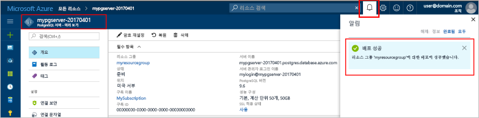
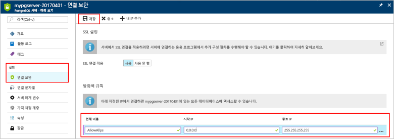

# <a name="design-your-first-azure-database-for-postgresql-using-hello-azure-portal"></a>PostgreSQL hello Azure 포털을 사용 하 여에 대 한 첫 번째 Azure 데이터베이스 디자인

Azure에 대 한 PostgreSQL 데이터베이스가 toorun 수 있는 관리 되는 서비스, 관리 하 고 hello 클라우드에서 항상 사용 가능한 PostgreSQL 데이터베이스의 크기를 조정 합니다. Hello Azure 포털을 사용 하 여 쉽게 서버를 관리 하 고 수 데이터베이스 디자인 합니다.

이 자습서를 사용 하 여 Azure 포털 toolearn hello 어떻게에:
> [!div class="checklist"]
> * PostgreSQL용 Azure Database 만들기
> * Hello 서버 방화벽을 구성
> * 사용 하 여 [ **psql** ](https://www.postgresql.org/docs/9.6/static/app-psql.html) 유틸리티 toocreate 데이터베이스
> * 샘플 데이터 로드
> * 쿼리 데이터
> * 데이터 업데이트
> * 데이터 복원

## <a name="prerequisites"></a>필수 조건
Azure 구독이 아직 없는 경우 시작하기 전에 [체험](https://azure.microsoft.com/free/) 계정을 만듭니다.

## <a name="log-in-toohello-azure-portal"></a>Azure 포털 toohello에 로그인
Toohello 로그인 [Azure 포털](https://portal.azure.com)합니다.

## <a name="create-an-azure-database-for-postgresql"></a>PostgreSQL용 Azure Database 만들기

Azure Database for PostgreSQL 서버는 정의된 [계산 및 저장소 리소스](./concepts-compute-unit-and-storage.md) 집합으로 만들어집니다. hello 서버 내에서 만든는 [Azure 리소스 그룹](../azure-resource-manager/resource-group-overview.md)합니다.

이러한 단계 toocreate PostgreSQL 서버에 대 한 Azure 데이터베이스를 수행 합니다.
1.  Hello 클릭 **+ 새로 만들기** 단추 hello 왼쪽 위 모서리의 hello Azure 포털에서 찾을 수 있습니다.
2.  선택 **데이터베이스** hello에서 **새로** 선택한 페이지 **Azure PostgreSQL 데이터베이스** hello에서 **데이터베이스** 페이지.
 

3.  Hello 이미지 앞에 표시 된 대로 hello 새 서버 세부 정보 양식을 사용 hello 다음 정보를 입력 합니다.
    - 서버 이름: **mypgserver 20170401** (서버 이름 tooDNS 이름을 매핑합니다 및 필요한 toobe 전역적으로 고유 되므로) 
    - 구독: 여러 구독이 있는 경우 구독을 선택 hello 적절 한 hello 리소스 존재 하거나에 대 한 요금이 청구 됩니다.
    - 리소스 그룹: **myresourcegroup**
    - 서버 관리자 로그인 및 선택한 암호
    - 위치
    - PostgreSQL 버전

  > [!IMPORTANT]
  > 여기서 지정 하는 hello 서버 관리자 로그인 및 암호는 toohello 서버에서 필요한 toolog와이 빠른 시작의 뒷부분에 나오는 해당 데이터베이스. 나중에 사용하기 위해 이 정보를 기억하거나 기록합니다.

4.  클릭 **가격 책정 계층** toospecify hello 서비스 계층과 성능 수준을 새 데이터베이스에 대 한 합니다. 이 빠른 시작을 위해 **기본** 계층, **50개 계산 단위** 및 **50GB**의 포함된 저장소를 선택합니다.
 
5.  **Ok**를 클릭합니다.
6.  클릭 **만들기** tooprovision hello 서버입니다. 프로비전하는 데 몇 분이 걸립니다.

  > [!TIP]
  > Hello 확인 **Pin toodashboard** 배포 옵션 tooallow 간편한 추적 합니다.

7.  Hello 도구 모음에서 **알림** toomonitor hello 배포 프로세스입니다.
 
   
  기본적으로 **postgres** 데이터베이스가 서버 아래에 만들어집니다. hello [postgres](https://www.postgresql.org/docs/9.6/static/app-initdb.html) 데이터베이스는 사용자, 유틸리티 및 타사 응용 프로그램에서 사용 하기 위해 의미 하는 기본 데이터베이스입니다. 

## <a name="configure-a-server-level-firewall-rule"></a>서버 수준 방화벽 규칙 구성

hello Azure 데이터베이스 PostgreSQL 서비스에 대 한 hello 서버 수준 방화벽을 만듭니다. 이 방화벽 외부 응용 프로그램 및 도구는 방화벽 규칙은 특정 IP 주소에 대 한 tooopen hello 방화벽을 만들지 않은 toohello 서버와 서버 hello에 있는 모든 데이터베이스를 연결 하지 못하도록 방지 합니다. 

1.  Hello 배포가 완료 된 후 클릭 **모든 리소스** hello 왼쪽 메뉴 및 hello 이름에는 형식에서 **mypgserver 20170401** toosearch 새로 만든된 서버에 대 한 합니다. Hello 검색 결과에 나열 된 hello 서버 이름을 클릭 합니다. hello **개요** 페이지 서버 열리고 더 이상의 구성에 대 한 옵션을 제공 합니다.
 
 

2.  Hello 서버 블레이드에서 선택 **연결 보안**합니다. 
3.  hello 텍스트 상자에 클릭 **규칙 이름** 하 고 새 방화벽 규칙 toowhitelist hello IP 범위에 대 한 연결을 추가 합니다. 이 자습서에서는 **규칙 이름 = AllowAllIps**, **시작 IP = 0.0.0.0** 및 **종료 IP = 255.255.255.255**를 입력하여 모든 IP를 허용한 다음 **저장**을 클릭하겠습니다. IP 범위 toobe 수 tooconnect 네트워크에서에 대해 설명 하는 방화벽 규칙을 설정할 수 있습니다.
 
 

4.  클릭 **저장** hello를 클릭 한 다음 **X** tooclose hello **연결 보안** 페이지.

  > [!NOTE]
  > Azure PostgreSQL 서버는 5432 포트를 통해 통신합니다. 회사 네트워크 내부에서 tooconnect을 시도 하는 포트 5432 통한 아웃 바운드 트래픽 네트워크의 방화벽에서 허용 되지 않을 수 있습니다. 이 경우 됩니다 수 tooconnect tooyour Azure SQL 데이터베이스 서버 않으면 IT 부서 5432 포트를 엽니다.
  >


## <a name="get-hello-connection-information"></a>Hello 연결 정보를 가져옵니다

PostgreSQL 서버에 대 한 Azure 데이터베이스를 만들 때 기본 hello **postgres** 데이터베이스도 생성 합니다. tooconnect tooyour 데이터베이스 서버 tooprovide 호스트 정보 및 액세스 자격 증명이 필요 합니다.

1. Azure 포털에서 왼쪽 메뉴 hello에서에서 클릭 **모든 리소스** 방금 만든 hello 서버에 대 한 검색 **mypgserver 20170401**합니다.

  

3. Hello 서버 이름을 클릭 **mypgserver 20170401**합니다.
4. 선택 hello 서버 **개요** 페이지. Hello 메모 **서버 이름** 및 **서버 관리자 로그인 이름**합니다.

 


## <a name="connect-toopostgresql-database-using-psql-in-cloud-shell"></a>Psql를 사용 하 여 클라우드 셸에서 tooPostgreSQL 데이터베이스 연결

PostgreSQL 서버에 대 한 hello psql 명령줄 유틸리티 tooconnect toohello Azure 데이터베이스를 지금 사용해 보겠습니다. 
1. Hello 위쪽 탐색 창에서 hello 터미널 아이콘을 통해 Azure 클라우드 셸 hello를 시작 합니다.

   

2. Azure 클라우드 셸 hello tootype bash 명령을 사용 하면 브라우저에서 열립니다.

   

3. Hello 클라우드 셸 프롬프트 hello psql 명령을 사용 하 여 PostgreSQL 서버용 tooyour Azure 데이터베이스를 연결 합니다. hello 다음 형식이 사용 되는 tooconnect tooan Azure 데이터베이스 hello로 PostgreSQL 서버에 대 한 [psql](https://www.postgresql.org/docs/9.6/static/app-psql.html) 유틸리티:
   ```bash
   psql --host=<myserver> --port=<port> --username=<server admin login> --dbname=<database name>
   ```

   다음 명령을 hello 라는 toohello 기본 데이터베이스를 연결 하는 예를 들어 **postgres** PostgreSQL 서버의 **mypgserver 20170401.postgres.database.azure.com** 액세스 자격 증명을 사용 하 여 합니다. 메시지가 표시되면 서버 관리자 암호를 입력합니다.

   ```bash
   psql --host=mypgserver-20170401.postgres.database.azure.com --port=5432 --username=mylogin@mypgserver-20170401 --dbname=postgres
   ```

## <a name="create-a-new-database"></a>새 데이터베이스 만들기
을 사용 하는 연결 된 toohello 서버 되 면 hello 프롬프트에서 새 데이터베이스를 만듭니다.
```bash
CREATE DATABASE mypgsqldb;
```

Hello 프롬프트에서 실행 명령을 tooswitch 연결 toohello 새로 만든 데이터베이스를 다음 hello **mypgsqldb**합니다.
```bash
\c mypgsqldb
```
## <a name="create-tables-in-hello-database"></a>Hello 데이터베이스에서 테이블 만들기
배웠으므로 어떻게 tooconnect toohello Azure PostgreSQL 데이터베이스 해 볼 수 있습니다 방법을 보다 toocomplete 몇 가지 기본적인 작업 합니다.

먼저 테이블을 만들고 일부 데이터와 함께 로드할 수 있습니다. 인벤토리 정보를 추적하는 테이블을 만들어 보겠습니다.
```sql
CREATE TABLE inventory (
    id serial PRIMARY KEY, 
    name VARCHAR(50), 
    quantity INTEGER
);
```

새로 만든 테이블의 hello 목록이 tabvles 지금 입력 하 여 hello를 확인할 수 있습니다.
```sql
\dt
```

## <a name="load-data-into-hello-tables"></a>Hello 테이블로 데이터를 로드 합니다.
이제 테이블을 만들었으므로 이 테이블에 일부 데이터를 삽입할 수 있습니다. Hello open 명령 프롬프트 창에서 실행 hello 쿼리 tooinsert 다음 데이터의 일부 행
```sql
INSERT INTO inventory (id, name, quantity) VALUES (1, 'banana', 150); 
INSERT INTO inventory (id, name, quantity) VALUES (2, 'orange', 154);
```

이제 두 개의 행 앞에서 만든 hello 테이블에 샘플 데이터의 해야 합니다.

## <a name="query-and-update-hello-data-in-hello-tables"></a>Hello 테이블의 hello 데이터 쿼리 및 업데이트
Hello 쿼리 tooretrieve 정보 hello 데이터베이스 테이블에서 다음을 실행 합니다. 
```sql
SELECT * FROM inventory;
```

Hello 테이블의 hello 데이터를 업데이트할 수도 있습니다.
```sql
UPDATE inventory SET quantity = 200 WHERE name = 'banana';
```

hello 행이 데이터를 검색 하는 경우 그에 따라 업데이트를 가져옵니다.
```sql
SELECT * FROM inventory;
```

## <a name="restore-data-tooa-previous-point-in-time"></a>데이터 tooa 이전 시점으로 복원
실수로 이 테이블을 삭제했다고 가정해 보겠습니다. 이 상황은 쉽게 복구할 수 있는 것이 아닙니다. PostgreSQL에 대 한 azure 데이터베이스 toogo 백 tooany-시점 (마지막 too7 일 (기본) 위쪽과 35 일 (표준) hello)에 있으며이 시점에서 tooa 새 서버를 복원 합니다. 이 새 서버 toorecover 삭제 된 데이터를 사용할 수 있습니다. hello 표를 추가 하기 전에 단계 복원 hello 샘플 서버 tooa 지점 뒤 번호입니다.

1.  Azure 데이터베이스 서버에 대 한 PostgreSQL 페이지에 대 한 hello, 클릭 **복원** hello 도구 모음입니다. hello **복원** 페이지가 열립니다.
  
2.  Hello 채울 **복원** 폼 hello 필요한 정보로:

  
  - **복원 지점**:에-시간 hello 서버 변경 되기 전에 발생 하는 선택
  - **대상 서버**: toorestore에 사용할 새 서버 이름을 제공 합니다.
  - **위치**: hello 영역을 선택할 수 없습니다, 기본적으로 hello 원본 서버와 동일한은
  - **가격 책정 계층**: 이 값은 서버를 복원할 때 변경할 수 없습니다. Hello 원본 서버와 같습니다. 
3.  클릭 **확인** toorestore hello 서버 너무[tooa 시점에 복원](./howto-restore-server-portal.md) hello 테이블이 삭제 되기 전에 합니다. 서버 tooa 다른 지정 시간으로 복원 중복 새 서버를 만듭니다 hello, 원래 서버 hello 지정 시간을 지정 하면, hello 보존 기간 내에 않은 경우 프로그램 [서비스 계층](./concepts-service-tiers.md)합니다.

## <a name="next-steps"></a>다음 단계
이 자습서에서는 Azure 포털 및 기타 유틸리티를 toouse hello 하는 방법을 배웠습니다.
> [!div class="checklist"]
> * PostgreSQL용 Azure Database 만들기
> * Hello 서버 방화벽을 구성
> * 사용 하 여 [ **psql** ](https://www.postgresql.org/docs/9.6/static/app-psql.html) 유틸리티 toocreate 데이터베이스
> * 샘플 데이터 로드
> * 쿼리 데이터
> * 데이터 업데이트
> * 데이터 복원

배우는 것이 toouse Azure CLI toodo 비슷한 작업을이 자습서를 검토 하는 방법: [PostgreSQL Azure CLI를 사용 하 여에 대 한 첫 번째 Azure 데이터베이스 디자인](tutorial-design-database-using-azure-cli.md)
