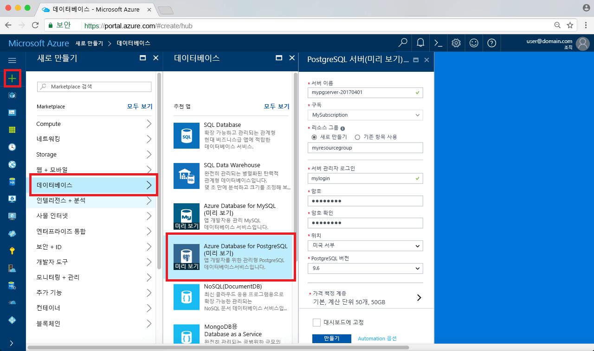

# <a name="design-your-first-azure-database-for-postgresql-using-hello-azure-portal"></a><span data-ttu-id="1af7f-103">PostgreSQL hello Azure 포털을 사용 하 여에 대 한 첫 번째 Azure 데이터베이스 디자인</span><span class="sxs-lookup"><span data-stu-id="1af7f-103">Design your first Azure Database for PostgreSQL using hello Azure portal</span></span>

<span data-ttu-id="1af7f-104">Azure에 대 한 PostgreSQL 데이터베이스가 toorun 수 있는 관리 되는 서비스, 관리 하 고 hello 클라우드에서 항상 사용 가능한 PostgreSQL 데이터베이스의 크기를 조정 합니다.</span><span class="sxs-lookup"><span data-stu-id="1af7f-104">Azure Database for PostgreSQL is a managed service that enables you toorun, manage, and scale highly available PostgreSQL databases in hello cloud.</span></span> <span data-ttu-id="1af7f-105">Hello Azure 포털을 사용 하 여 쉽게 서버를 관리 하 고 수 데이터베이스 디자인 합니다.</span><span class="sxs-lookup"><span data-stu-id="1af7f-105">Using hello Azure portal, you can easily manage your server and design a database.</span></span>

<span data-ttu-id="1af7f-106">이 자습서를 사용 하 여 Azure 포털 toolearn hello 어떻게에:</span><span class="sxs-lookup"><span data-stu-id="1af7f-106">In this tutorial, you use hello Azure portal toolearn how to:</span></span>
> [!div class="checklist"]
> * <span data-ttu-id="1af7f-107">PostgreSQL용 Azure Database 만들기</span><span class="sxs-lookup"><span data-stu-id="1af7f-107">Create an Azure Database for PostgreSQL</span></span>
> * <span data-ttu-id="1af7f-108">Hello 서버 방화벽을 구성</span><span class="sxs-lookup"><span data-stu-id="1af7f-108">Configure hello server firewall</span></span>
> * <span data-ttu-id="1af7f-109">사용 하 여 [ **psql** ](https://www.postgresql.org/docs/9.6/static/app-psql.html) 유틸리티 toocreate 데이터베이스</span><span class="sxs-lookup"><span data-stu-id="1af7f-109">Use [**psql**](https://www.postgresql.org/docs/9.6/static/app-psql.html) utility toocreate a database</span></span>
> * <span data-ttu-id="1af7f-110">샘플 데이터 로드</span><span class="sxs-lookup"><span data-stu-id="1af7f-110">Load sample data</span></span>
> * <span data-ttu-id="1af7f-111">쿼리 데이터</span><span class="sxs-lookup"><span data-stu-id="1af7f-111">Query data</span></span>
> * <span data-ttu-id="1af7f-112">데이터 업데이트</span><span class="sxs-lookup"><span data-stu-id="1af7f-112">Update data</span></span>
> * <span data-ttu-id="1af7f-113">데이터 복원</span><span class="sxs-lookup"><span data-stu-id="1af7f-113">Restore data</span></span>

## <a name="prerequisites"></a><span data-ttu-id="1af7f-114">필수 조건</span><span class="sxs-lookup"><span data-stu-id="1af7f-114">Prerequisites</span></span>
<span data-ttu-id="1af7f-115">Azure 구독이 아직 없는 경우 시작하기 전에 [체험](https://azure.microsoft.com/free/) 계정을 만듭니다.</span><span class="sxs-lookup"><span data-stu-id="1af7f-115">If you don't have an Azure subscription, create a [free](https://azure.microsoft.com/free/) account before you begin.</span></span>

## <a name="log-in-toohello-azure-portal"></a><span data-ttu-id="1af7f-116">Azure 포털 toohello에 로그인</span><span class="sxs-lookup"><span data-stu-id="1af7f-116">Log in toohello Azure portal</span></span>
<span data-ttu-id="1af7f-117">Toohello 로그인 [Azure 포털](https://portal.azure.com)합니다.</span><span class="sxs-lookup"><span data-stu-id="1af7f-117">Log in toohello [Azure portal](https://portal.azure.com).</span></span>

## <a name="create-an-azure-database-for-postgresql"></a><span data-ttu-id="1af7f-118">PostgreSQL용 Azure Database 만들기</span><span class="sxs-lookup"><span data-stu-id="1af7f-118">Create an Azure Database for PostgreSQL</span></span>

<span data-ttu-id="1af7f-119">Azure Database for PostgreSQL 서버는 정의된 [계산 및 저장소 리소스](./concepts-compute-unit-and-storage.md) 집합으로 만들어집니다.</span><span class="sxs-lookup"><span data-stu-id="1af7f-119">An Azure Database for PostgreSQL server is created with a defined set of [compute and storage resources](./concepts-compute-unit-and-storage.md).</span></span> <span data-ttu-id="1af7f-120">hello 서버 내에서 만든는 [Azure 리소스 그룹](../azure-resource-manager/resource-group-overview.md)합니다.</span><span class="sxs-lookup"><span data-stu-id="1af7f-120">hello server is created within an [Azure resource group](../azure-resource-manager/resource-group-overview.md).</span></span>

<span data-ttu-id="1af7f-121">이러한 단계 toocreate PostgreSQL 서버에 대 한 Azure 데이터베이스를 수행 합니다.</span><span class="sxs-lookup"><span data-stu-id="1af7f-121">Follow these steps toocreate an Azure Database for PostgreSQL server:</span></span>
1.  <span data-ttu-id="1af7f-122">Hello 클릭 **+ 새로 만들기** 단추 hello 왼쪽 위 모서리의 hello Azure 포털에서 찾을 수 있습니다.</span><span class="sxs-lookup"><span data-stu-id="1af7f-122">Click hello **+ New**  button found on hello upper left-hand corner of hello Azure portal.</span></span>
2.  <span data-ttu-id="1af7f-123">선택 **데이터베이스** hello에서 **새로** 선택한 페이지 **Azure PostgreSQL 데이터베이스** hello에서 **데이터베이스** 페이지.</span><span class="sxs-lookup"><span data-stu-id="1af7f-123">Select **Databases** from hello **New** page, and select **Azure Database for PostgreSQL** from hello **Databases** page.</span></span>
 <span data-ttu-id="1af7f-124"></span><span class="sxs-lookup"><span data-stu-id="1af7f-124"></span></span>

3.  <span data-ttu-id="1af7f-125">Hello 이미지 앞에 표시 된 대로 hello 새 서버 세부 정보 양식을 사용 hello 다음 정보를 입력 합니다.</span><span class="sxs-lookup"><span data-stu-id="1af7f-125">Fill out hello new server details form with hello following information, as shown on hello preceding image:</span></span>
    - <span data-ttu-id="1af7f-126">서버 이름: **mypgserver 20170401** (서버 이름 tooDNS 이름을 매핑합니다 및 필요한 toobe 전역적으로 고유 되므로)</span><span class="sxs-lookup"><span data-stu-id="1af7f-126">Server name: **mypgserver-20170401** (name of a server maps tooDNS name and is thus required toobe globally unique)</span></span> 
    - <span data-ttu-id="1af7f-127">구독: 여러 구독이 있는 경우 구독을 선택 hello 적절 한 hello 리소스 존재 하거나에 대 한 요금이 청구 됩니다.</span><span class="sxs-lookup"><span data-stu-id="1af7f-127">Subscription: If you have multiple subscriptions, choose hello appropriate subscription in which hello resource exists or is billed for.</span></span>
    - <span data-ttu-id="1af7f-128">리소스 그룹: **myresourcegroup**</span><span class="sxs-lookup"><span data-stu-id="1af7f-128">Resource group: **myresourcegroup**</span></span>
    - <span data-ttu-id="1af7f-129">서버 관리자 로그인 및 선택한 암호</span><span class="sxs-lookup"><span data-stu-id="1af7f-129">Server admin login and password of your choice</span></span>
    - <span data-ttu-id="1af7f-130">위치</span><span class="sxs-lookup"><span data-stu-id="1af7f-130">Location</span></span>
    - <span data-ttu-id="1af7f-131">PostgreSQL 버전</span><span class="sxs-lookup"><span data-stu-id="1af7f-131">PostgreSQL Version</span></span>

  > [!IMPORTANT]
  > <span data-ttu-id="1af7f-132">여기서 지정 하는 hello 서버 관리자 로그인 및 암호는 toohello 서버에서 필요한 toolog와이 빠른 시작의 뒷부분에 나오는 해당 데이터베이스.</span><span class="sxs-lookup"><span data-stu-id="1af7f-132">hello server admin login and password that you specify here are required toolog in toohello server and its databases later in this quick start.</span></span> <span data-ttu-id="1af7f-133">나중에 사용하기 위해 이 정보를 기억하거나 기록합니다.</span><span class="sxs-lookup"><span data-stu-id="1af7f-133">Remember or record this information for later use.</span></span>

4.  <span data-ttu-id="1af7f-134">클릭 **가격 책정 계층** toospecify hello 서비스 계층과 성능 수준을 새 데이터베이스에 대 한 합니다.</span><span class="sxs-lookup"><span data-stu-id="1af7f-134">Click **Pricing tier** toospecify hello service tier and performance level for your new database.</span></span> <span data-ttu-id="1af7f-135">이 빠른 시작을 위해 **기본** 계층, **50개 계산 단위** 및 **50GB**의 포함된 저장소를 선택합니다.</span><span class="sxs-lookup"><span data-stu-id="1af7f-135">For this quick start, select **Basic** Tier, **50 Compute Units** and **50 GB** of included storage.</span></span>
 <span data-ttu-id="1af7f-136"></span><span class="sxs-lookup"><span data-stu-id="1af7f-136"></span></span>
5.  <span data-ttu-id="1af7f-137">**Ok**를 클릭합니다.</span><span class="sxs-lookup"><span data-stu-id="1af7f-137">Click **Ok**.</span></span>
6.  <span data-ttu-id="1af7f-138">클릭 **만들기** tooprovision hello 서버입니다.</span><span class="sxs-lookup"><span data-stu-id="1af7f-138">Click **Create** tooprovision hello server.</span></span> <span data-ttu-id="1af7f-139">프로비전하는 데 몇 분이 걸립니다.</span><span class="sxs-lookup"><span data-stu-id="1af7f-139">Provisioning takes a few minutes.</span></span>

  > [!TIP]
  > <span data-ttu-id="1af7f-140">Hello 확인 **Pin toodashboard** 배포 옵션 tooallow 간편한 추적 합니다.</span><span class="sxs-lookup"><span data-stu-id="1af7f-140">Check hello **Pin toodashboard** option tooallow easy tracking of your deployments.</span></span>

7.  <span data-ttu-id="1af7f-141">Hello 도구 모음에서 **알림** toomonitor hello 배포 프로세스입니다.</span><span class="sxs-lookup"><span data-stu-id="1af7f-141">On hello toolbar, click **Notifications** toomonitor hello deployment process.</span></span>
 <span data-ttu-id="1af7f-142"></span><span class="sxs-lookup"><span data-stu-id="1af7f-142"></span></span>
   
  <span data-ttu-id="1af7f-143">기본적으로 **postgres** 데이터베이스가 서버 아래에 만들어집니다.</span><span class="sxs-lookup"><span data-stu-id="1af7f-143">By default, **postgres** database gets created under your server.</span></span> <span data-ttu-id="1af7f-144">hello [postgres](https://www.postgresql.org/docs/9.6/static/app-initdb.html) 데이터베이스는 사용자, 유틸리티 및 타사 응용 프로그램에서 사용 하기 위해 의미 하는 기본 데이터베이스입니다.</span><span class="sxs-lookup"><span data-stu-id="1af7f-144">hello [postgres](https://www.postgresql.org/docs/9.6/static/app-initdb.html) database is a default database meant for use by users, utilities, and third-party applications.</span></span> 

## <a name="configure-a-server-level-firewall-rule"></a><span data-ttu-id="1af7f-145">서버 수준 방화벽 규칙 구성</span><span class="sxs-lookup"><span data-stu-id="1af7f-145">Configure a server-level firewall rule</span></span>

<span data-ttu-id="1af7f-146">hello Azure 데이터베이스 PostgreSQL 서비스에 대 한 hello 서버 수준 방화벽을 만듭니다.</span><span class="sxs-lookup"><span data-stu-id="1af7f-146">hello Azure Database for PostgreSQL service creates a firewall at hello server-level.</span></span> <span data-ttu-id="1af7f-147">이 방화벽 외부 응용 프로그램 및 도구는 방화벽 규칙은 특정 IP 주소에 대 한 tooopen hello 방화벽을 만들지 않은 toohello 서버와 서버 hello에 있는 모든 데이터베이스를 연결 하지 못하도록 방지 합니다.</span><span class="sxs-lookup"><span data-stu-id="1af7f-147">This firewall prevents external applications and tools from connecting toohello server and any databases on hello server unless a firewall rule is created tooopen hello firewall for specific IP addresses.</span></span> 

1.  <span data-ttu-id="1af7f-148">Hello 배포가 완료 된 후 클릭 **모든 리소스** hello 왼쪽 메뉴 및 hello 이름에는 형식에서 **mypgserver 20170401** toosearch 새로 만든된 서버에 대 한 합니다.</span><span class="sxs-lookup"><span data-stu-id="1af7f-148">After hello deployment completes, click **All Resources** from hello left-hand menu and type in hello name **mypgserver-20170401** toosearch for your newly created server.</span></span> <span data-ttu-id="1af7f-149">Hello 검색 결과에 나열 된 hello 서버 이름을 클릭 합니다.</span><span class="sxs-lookup"><span data-stu-id="1af7f-149">Click hello server name listed in hello search result.</span></span> <span data-ttu-id="1af7f-150">hello **개요** 페이지 서버 열리고 더 이상의 구성에 대 한 옵션을 제공 합니다.</span><span class="sxs-lookup"><span data-stu-id="1af7f-150">hello **Overview** page for your server opens and provides options for further configuration.</span></span>
 
 

2.  <span data-ttu-id="1af7f-152">Hello 서버 블레이드에서 선택 **연결 보안**합니다.</span><span class="sxs-lookup"><span data-stu-id="1af7f-152">In hello server blade, select **Connection Security**.</span></span> 
3.  <span data-ttu-id="1af7f-153">hello 텍스트 상자에 클릭 **규칙 이름** 하 고 새 방화벽 규칙 toowhitelist hello IP 범위에 대 한 연결을 추가 합니다.</span><span class="sxs-lookup"><span data-stu-id="1af7f-153">Click in hello text box under **Rule Name,** and add a new firewall rule toowhitelist hello IP range for connectivity.</span></span> <span data-ttu-id="1af7f-154">이 자습서에서는 **규칙 이름 = AllowAllIps**, **시작 IP = 0.0.0.0** 및 **종료 IP = 255.255.255.255**를 입력하여 모든 IP를 허용한 다음 **저장**을 클릭하겠습니다.</span><span class="sxs-lookup"><span data-stu-id="1af7f-154">For this tutorial, let's allow all IPs by typing in **Rule Name = AllowAllIps**, **Start IP = 0.0.0.0** and **End IP = 255.255.255.255** and then click **Save**.</span></span> <span data-ttu-id="1af7f-155">IP 범위 toobe 수 tooconnect 네트워크에서에 대해 설명 하는 방화벽 규칙을 설정할 수 있습니다.</span><span class="sxs-lookup"><span data-stu-id="1af7f-155">You can set a firewall rule that covers an IP range toobe able tooconnect from your network.</span></span>
 
 

4.  <span data-ttu-id="1af7f-157">클릭 **저장** hello를 클릭 한 다음 **X** tooclose hello **연결 보안** 페이지.</span><span class="sxs-lookup"><span data-stu-id="1af7f-157">Click **Save** and then click hello **X** tooclose hello **Connections Security** page.</span></span>

  > [!NOTE]
  > <span data-ttu-id="1af7f-158">Azure PostgreSQL 서버는 5432 포트를 통해 통신합니다.</span><span class="sxs-lookup"><span data-stu-id="1af7f-158">Azure PostgreSQL server communicates over port 5432.</span></span> <span data-ttu-id="1af7f-159">회사 네트워크 내부에서 tooconnect을 시도 하는 포트 5432 통한 아웃 바운드 트래픽 네트워크의 방화벽에서 허용 되지 않을 수 있습니다.</span><span class="sxs-lookup"><span data-stu-id="1af7f-159">If you are trying tooconnect from within a corporate network, outbound traffic over port 5432 may not be allowed by your network's firewall.</span></span> <span data-ttu-id="1af7f-160">이 경우 됩니다 수 tooconnect tooyour Azure SQL 데이터베이스 서버 않으면 IT 부서 5432 포트를 엽니다.</span><span class="sxs-lookup"><span data-stu-id="1af7f-160">If so, you will not be able tooconnect tooyour Azure SQL Database server unless your IT department opens port 5432.</span></span>
  >


## <a name="get-hello-connection-information"></a><span data-ttu-id="1af7f-161">Hello 연결 정보를 가져옵니다</span><span class="sxs-lookup"><span data-stu-id="1af7f-161">Get hello connection information</span></span>

<span data-ttu-id="1af7f-162">PostgreSQL 서버에 대 한 Azure 데이터베이스를 만들 때 기본 hello **postgres** 데이터베이스도 생성 합니다.</span><span class="sxs-lookup"><span data-stu-id="1af7f-162">When we created our Azure Database for PostgreSQL server, hello default **postgres** database also gets created.</span></span> <span data-ttu-id="1af7f-163">tooconnect tooyour 데이터베이스 서버 tooprovide 호스트 정보 및 액세스 자격 증명이 필요 합니다.</span><span class="sxs-lookup"><span data-stu-id="1af7f-163">tooconnect tooyour database server, you need tooprovide host information and access credentials.</span></span>

1. <span data-ttu-id="1af7f-164">Azure 포털에서 왼쪽 메뉴 hello에서에서 클릭 **모든 리소스** 방금 만든 hello 서버에 대 한 검색 **mypgserver 20170401**합니다.</span><span class="sxs-lookup"><span data-stu-id="1af7f-164">From hello left-hand menu in Azure portal, click **All resources** and search for hello server you just created **mypgserver-20170401**.</span></span>

  

3. <span data-ttu-id="1af7f-166">Hello 서버 이름을 클릭 **mypgserver 20170401**합니다.</span><span class="sxs-lookup"><span data-stu-id="1af7f-166">Click hello server name **mypgserver-20170401**.</span></span>
4. <span data-ttu-id="1af7f-167">선택 hello 서버 **개요** 페이지.</span><span class="sxs-lookup"><span data-stu-id="1af7f-167">Select hello server's **Overview** page.</span></span> <span data-ttu-id="1af7f-168">Hello 메모 **서버 이름** 및 **서버 관리자 로그인 이름**합니다.</span><span class="sxs-lookup"><span data-stu-id="1af7f-168">Make a note of hello **Server name** and **Server admin login name**.</span></span>

 


## <a name="connect-toopostgresql-database-using-psql-in-cloud-shell"></a><span data-ttu-id="1af7f-170">Psql를 사용 하 여 클라우드 셸에서 tooPostgreSQL 데이터베이스 연결</span><span class="sxs-lookup"><span data-stu-id="1af7f-170">Connect tooPostgreSQL database using psql in Cloud Shell</span></span>

<span data-ttu-id="1af7f-171">PostgreSQL 서버에 대 한 hello psql 명령줄 유틸리티 tooconnect toohello Azure 데이터베이스를 지금 사용해 보겠습니다.</span><span class="sxs-lookup"><span data-stu-id="1af7f-171">Let's now use hello psql command-line utility tooconnect toohello Azure Database for PostgreSQL server.</span></span> 
1. <span data-ttu-id="1af7f-172">Hello 위쪽 탐색 창에서 hello 터미널 아이콘을 통해 Azure 클라우드 셸 hello를 시작 합니다.</span><span class="sxs-lookup"><span data-stu-id="1af7f-172">Launch hello Azure Cloud Shell via hello terminal icon on hello top navigation pane.</span></span>

   

2. <span data-ttu-id="1af7f-174">Azure 클라우드 셸 hello tootype bash 명령을 사용 하면 브라우저에서 열립니다.</span><span class="sxs-lookup"><span data-stu-id="1af7f-174">hello Azure Cloud Shell opens in your browser, enabling you tootype bash commands.</span></span>

   

3. <span data-ttu-id="1af7f-176">Hello 클라우드 셸 프롬프트 hello psql 명령을 사용 하 여 PostgreSQL 서버용 tooyour Azure 데이터베이스를 연결 합니다.</span><span class="sxs-lookup"><span data-stu-id="1af7f-176">At hello Cloud Shell prompt, connect tooyour Azure Database for PostgreSQL server using hello psql commands.</span></span> <span data-ttu-id="1af7f-177">hello 다음 형식이 사용 되는 tooconnect tooan Azure 데이터베이스 hello로 PostgreSQL 서버에 대 한 [psql](https://www.postgresql.org/docs/9.6/static/app-psql.html) 유틸리티:</span><span class="sxs-lookup"><span data-stu-id="1af7f-177">hello following format is used tooconnect tooan Azure Database for PostgreSQL server with hello [psql](https://www.postgresql.org/docs/9.6/static/app-psql.html) utility:</span></span>
   ```bash
   psql --host=<myserver> --port=<port> --username=<server admin login> --dbname=<database name>
   ```

   <span data-ttu-id="1af7f-178">다음 명령을 hello 라는 toohello 기본 데이터베이스를 연결 하는 예를 들어 **postgres** PostgreSQL 서버의 **mypgserver 20170401.postgres.database.azure.com** 액세스 자격 증명을 사용 하 여 합니다.</span><span class="sxs-lookup"><span data-stu-id="1af7f-178">For example, hello following command connects toohello default database called **postgres** on your PostgreSQL server **mypgserver-20170401.postgres.database.azure.com** using access credentials.</span></span> <span data-ttu-id="1af7f-179">메시지가 표시되면 서버 관리자 암호를 입력합니다.</span><span class="sxs-lookup"><span data-stu-id="1af7f-179">Enter your server admin password when prompted.</span></span>

   ```bash
   psql --host=mypgserver-20170401.postgres.database.azure.com --port=5432 --username=mylogin@mypgserver-20170401 --dbname=postgres
   ```

## <a name="create-a-new-database"></a><span data-ttu-id="1af7f-180">새 데이터베이스 만들기</span><span class="sxs-lookup"><span data-stu-id="1af7f-180">Create a New Database</span></span>
<span data-ttu-id="1af7f-181">을 사용 하는 연결 된 toohello 서버 되 면 hello 프롬프트에서 새 데이터베이스를 만듭니다.</span><span class="sxs-lookup"><span data-stu-id="1af7f-181">Once you're connected toohello server, create a blank database at hello prompt.</span></span>
```bash
CREATE DATABASE mypgsqldb;
```

<span data-ttu-id="1af7f-182">Hello 프롬프트에서 실행 명령을 tooswitch 연결 toohello 새로 만든 데이터베이스를 다음 hello **mypgsqldb**합니다.</span><span class="sxs-lookup"><span data-stu-id="1af7f-182">At hello prompt, execute hello following command tooswitch connection toohello newly created database **mypgsqldb**.</span></span>
```bash
\c mypgsqldb
```
## <a name="create-tables-in-hello-database"></a><span data-ttu-id="1af7f-183">Hello 데이터베이스에서 테이블 만들기</span><span class="sxs-lookup"><span data-stu-id="1af7f-183">Create tables in hello database</span></span>
<span data-ttu-id="1af7f-184">배웠으므로 어떻게 tooconnect toohello Azure PostgreSQL 데이터베이스 해 볼 수 있습니다 방법을 보다 toocomplete 몇 가지 기본적인 작업 합니다.</span><span class="sxs-lookup"><span data-stu-id="1af7f-184">Now that you know how tooconnect toohello Azure Database for PostgreSQL, we can go over how toocomplete some basic tasks.</span></span>

<span data-ttu-id="1af7f-185">먼저 테이블을 만들고 일부 데이터와 함께 로드할 수 있습니다.</span><span class="sxs-lookup"><span data-stu-id="1af7f-185">First, we can create a table and load it with some data.</span></span> <span data-ttu-id="1af7f-186">인벤토리 정보를 추적하는 테이블을 만들어 보겠습니다.</span><span class="sxs-lookup"><span data-stu-id="1af7f-186">Let's create a table that tracks inventory information.</span></span>
```sql
CREATE TABLE inventory (
    id serial PRIMARY KEY, 
    name VARCHAR(50), 
    quantity INTEGER
);
```

<span data-ttu-id="1af7f-187">새로 만든 테이블의 hello 목록이 tabvles 지금 입력 하 여 hello를 확인할 수 있습니다.</span><span class="sxs-lookup"><span data-stu-id="1af7f-187">You can see hello newly created table in hello list of tabvles now by typing:</span></span>
```sql
\dt
```

## <a name="load-data-into-hello-tables"></a><span data-ttu-id="1af7f-188">Hello 테이블로 데이터를 로드 합니다.</span><span class="sxs-lookup"><span data-stu-id="1af7f-188">Load data into hello tables</span></span>
<span data-ttu-id="1af7f-189">이제 테이블을 만들었으므로 이 테이블에 일부 데이터를 삽입할 수 있습니다.</span><span class="sxs-lookup"><span data-stu-id="1af7f-189">Now that we have a table, we can insert some data into it.</span></span> <span data-ttu-id="1af7f-190">Hello open 명령 프롬프트 창에서 실행 hello 쿼리 tooinsert 다음 데이터의 일부 행</span><span class="sxs-lookup"><span data-stu-id="1af7f-190">At hello open command prompt window, run hello following query tooinsert some rows of data</span></span>
```sql
INSERT INTO inventory (id, name, quantity) VALUES (1, 'banana', 150); 
INSERT INTO inventory (id, name, quantity) VALUES (2, 'orange', 154);
```

<span data-ttu-id="1af7f-191">이제 두 개의 행 앞에서 만든 hello 테이블에 샘플 데이터의 해야 합니다.</span><span class="sxs-lookup"><span data-stu-id="1af7f-191">You have now two rows of sample data into hello table you created earlier.</span></span>

## <a name="query-and-update-hello-data-in-hello-tables"></a><span data-ttu-id="1af7f-192">Hello 테이블의 hello 데이터 쿼리 및 업데이트</span><span class="sxs-lookup"><span data-stu-id="1af7f-192">Query and update hello data in hello tables</span></span>
<span data-ttu-id="1af7f-193">Hello 쿼리 tooretrieve 정보 hello 데이터베이스 테이블에서 다음을 실행 합니다.</span><span class="sxs-lookup"><span data-stu-id="1af7f-193">Execute hello following query tooretrieve information from hello database table.</span></span> 
```sql
SELECT * FROM inventory;
```

<span data-ttu-id="1af7f-194">Hello 테이블의 hello 데이터를 업데이트할 수도 있습니다.</span><span class="sxs-lookup"><span data-stu-id="1af7f-194">You can also update hello data in hello tables</span></span>
```sql
UPDATE inventory SET quantity = 200 WHERE name = 'banana';
```

<span data-ttu-id="1af7f-195">hello 행이 데이터를 검색 하는 경우 그에 따라 업데이트를 가져옵니다.</span><span class="sxs-lookup"><span data-stu-id="1af7f-195">hello row gets updated accordingly when you retrieve data.</span></span>
```sql
SELECT * FROM inventory;
```

## <a name="restore-data-tooa-previous-point-in-time"></a><span data-ttu-id="1af7f-196">데이터 tooa 이전 시점으로 복원</span><span class="sxs-lookup"><span data-stu-id="1af7f-196">Restore data tooa previous point in time</span></span>
<span data-ttu-id="1af7f-197">실수로 이 테이블을 삭제했다고 가정해 보겠습니다.</span><span class="sxs-lookup"><span data-stu-id="1af7f-197">Imagine you have accidentally deleted this table.</span></span> <span data-ttu-id="1af7f-198">이 상황은 쉽게 복구할 수 있는 것이 아닙니다.</span><span class="sxs-lookup"><span data-stu-id="1af7f-198">This situation is something you cannot easily recover from.</span></span> <span data-ttu-id="1af7f-199">PostgreSQL에 대 한 azure 데이터베이스 toogo 백 tooany-시점 (마지막 too7 일 (기본) 위쪽과 35 일 (표준) hello)에 있으며이 시점에서 tooa 새 서버를 복원 합니다.</span><span class="sxs-lookup"><span data-stu-id="1af7f-199">Azure Database for PostgreSQL allows you toogo back tooany point-in-time (in hello last up too7 days (Basic) and 35 days (Standard)) and restore this point-in-time tooa new server.</span></span> <span data-ttu-id="1af7f-200">이 새 서버 toorecover 삭제 된 데이터를 사용할 수 있습니다.</span><span class="sxs-lookup"><span data-stu-id="1af7f-200">You can use this new server toorecover your deleted data.</span></span> <span data-ttu-id="1af7f-201">hello 표를 추가 하기 전에 단계 복원 hello 샘플 서버 tooa 지점 뒤 번호입니다.</span><span class="sxs-lookup"><span data-stu-id="1af7f-201">hello following steps restore hello sample server tooa point before hello table was added.</span></span>

1.  <span data-ttu-id="1af7f-202">Azure 데이터베이스 서버에 대 한 PostgreSQL 페이지에 대 한 hello, 클릭 **복원** hello 도구 모음입니다.</span><span class="sxs-lookup"><span data-stu-id="1af7f-202">On hello Azure Database for PostgreSQL page for your server, click **Restore** on hello toolbar.</span></span> <span data-ttu-id="1af7f-203">hello **복원** 페이지가 열립니다.</span><span class="sxs-lookup"><span data-stu-id="1af7f-203">hello **Restore** page opens.</span></span>
  <span data-ttu-id="1af7f-204"></span><span class="sxs-lookup"><span data-stu-id="1af7f-204"></span></span>
2.  <span data-ttu-id="1af7f-205">Hello 채울 **복원** 폼 hello 필요한 정보로:</span><span class="sxs-lookup"><span data-stu-id="1af7f-205">Fill out hello **Restore** form with hello required information:</span></span>

  
  - <span data-ttu-id="1af7f-207">**복원 지점**:에-시간 hello 서버 변경 되기 전에 발생 하는 선택</span><span class="sxs-lookup"><span data-stu-id="1af7f-207">**Restore point**: Select a point-in-time that occurs before hello server was changed</span></span>
  - <span data-ttu-id="1af7f-208">**대상 서버**: toorestore에 사용할 새 서버 이름을 제공 합니다.</span><span class="sxs-lookup"><span data-stu-id="1af7f-208">**Target server**: Provide a new server name you want toorestore to</span></span>
  - <span data-ttu-id="1af7f-209">**위치**: hello 영역을 선택할 수 없습니다, 기본적으로 hello 원본 서버와 동일한은</span><span class="sxs-lookup"><span data-stu-id="1af7f-209">**Location**: You cannot select hello region, by default it is same as hello source server</span></span>
  - <span data-ttu-id="1af7f-210">**가격 책정 계층**: 이 값은 서버를 복원할 때 변경할 수 없습니다.</span><span class="sxs-lookup"><span data-stu-id="1af7f-210">**Pricing tier**: You cannot change this value when restoring a server.</span></span> <span data-ttu-id="1af7f-211">Hello 원본 서버와 같습니다.</span><span class="sxs-lookup"><span data-stu-id="1af7f-211">It is same as hello source server.</span></span> 
3.  <span data-ttu-id="1af7f-212">클릭 **확인** toorestore hello 서버 너무[tooa 시점에 복원](./howto-restore-server-portal.md) hello 테이블이 삭제 되기 전에 합니다.</span><span class="sxs-lookup"><span data-stu-id="1af7f-212">Click **OK** toorestore hello server too[restore tooa point-in-time](./howto-restore-server-portal.md) before hello tables was deleted.</span></span> <span data-ttu-id="1af7f-213">서버 tooa 다른 지정 시간으로 복원 중복 새 서버를 만듭니다 hello, 원래 서버 hello 지정 시간을 지정 하면, hello 보존 기간 내에 않은 경우 프로그램 [서비스 계층](./concepts-service-tiers.md)합니다.</span><span class="sxs-lookup"><span data-stu-id="1af7f-213">Restoring a server tooa different point in time creates a duplicate new server as hello original server as of hello point in time you specify, provided that it is within hello retention period for your [service tier](./concepts-service-tiers.md).</span></span>

## <a name="next-steps"></a><span data-ttu-id="1af7f-214">다음 단계</span><span class="sxs-lookup"><span data-stu-id="1af7f-214">Next Steps</span></span>
<span data-ttu-id="1af7f-215">이 자습서에서는 Azure 포털 및 기타 유틸리티를 toouse hello 하는 방법을 배웠습니다.</span><span class="sxs-lookup"><span data-stu-id="1af7f-215">In this tutorial, you learned how toouse hello Azure portal and other utilities to:</span></span>
> [!div class="checklist"]
> * <span data-ttu-id="1af7f-216">PostgreSQL용 Azure Database 만들기</span><span class="sxs-lookup"><span data-stu-id="1af7f-216">Create an Azure Database for PostgreSQL</span></span>
> * <span data-ttu-id="1af7f-217">Hello 서버 방화벽을 구성</span><span class="sxs-lookup"><span data-stu-id="1af7f-217">Configure hello server firewall</span></span>
> * <span data-ttu-id="1af7f-218">사용 하 여 [ **psql** ](https://www.postgresql.org/docs/9.6/static/app-psql.html) 유틸리티 toocreate 데이터베이스</span><span class="sxs-lookup"><span data-stu-id="1af7f-218">Use [**psql**](https://www.postgresql.org/docs/9.6/static/app-psql.html) utility toocreate a database</span></span>
> * <span data-ttu-id="1af7f-219">샘플 데이터 로드</span><span class="sxs-lookup"><span data-stu-id="1af7f-219">Load sample data</span></span>
> * <span data-ttu-id="1af7f-220">쿼리 데이터</span><span class="sxs-lookup"><span data-stu-id="1af7f-220">Query data</span></span>
> * <span data-ttu-id="1af7f-221">데이터 업데이트</span><span class="sxs-lookup"><span data-stu-id="1af7f-221">Update data</span></span>
> * <span data-ttu-id="1af7f-222">데이터 복원</span><span class="sxs-lookup"><span data-stu-id="1af7f-222">Restore data</span></span>

<span data-ttu-id="1af7f-223">배우는 것이 toouse Azure CLI toodo 비슷한 작업을이 자습서를 검토 하는 방법: [PostgreSQL Azure CLI를 사용 하 여에 대 한 첫 번째 Azure 데이터베이스 디자인](tutorial-design-database-using-azure-cli.md)</span><span class="sxs-lookup"><span data-stu-id="1af7f-223">Next, learn how toouse Azure CLI toodo similar tasks, review this tutorial: [Design your first Azure Database for PostgreSQL using Azure CLI](tutorial-design-database-using-azure-cli.md)</span></span>
