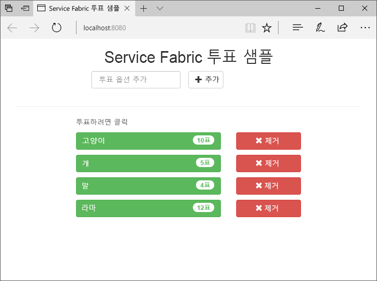
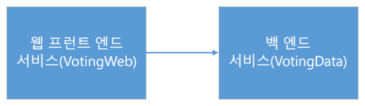
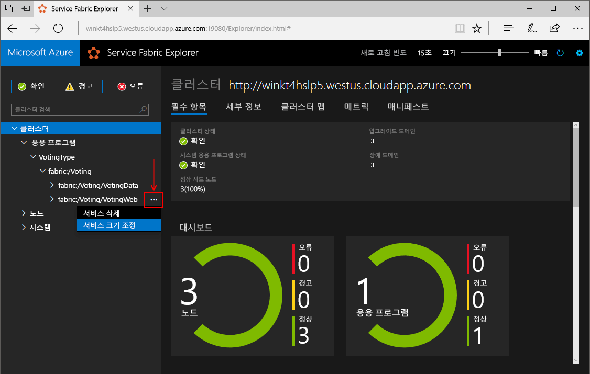
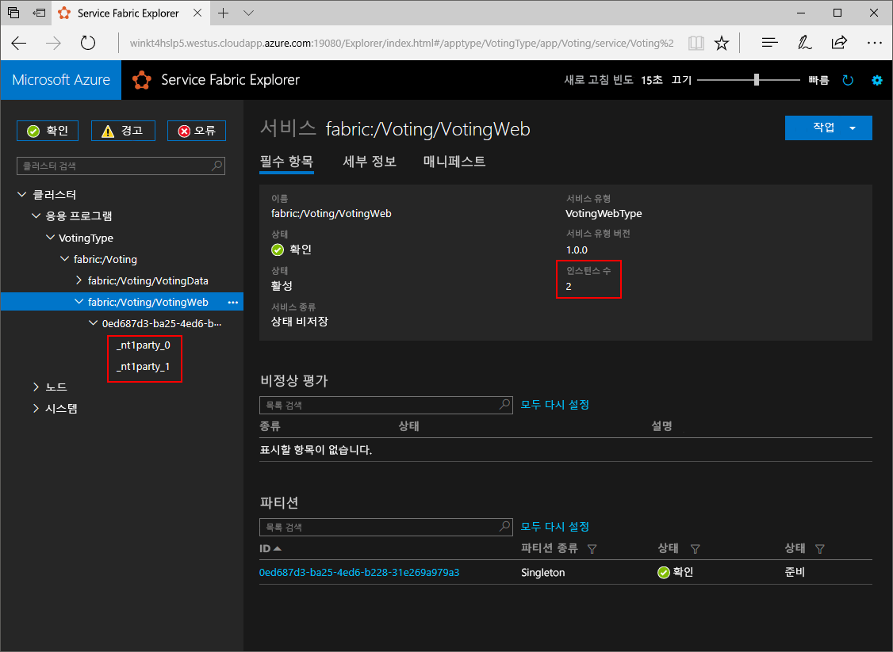
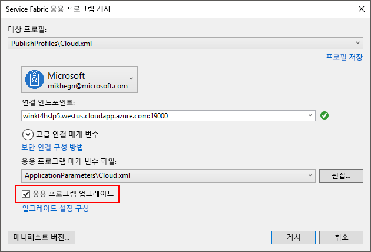
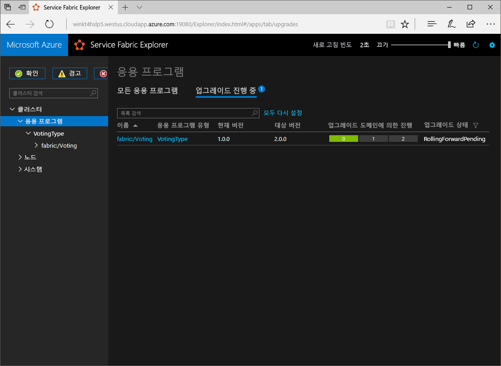

# <a name="create-a-net-service-fabric-application-in-azure"></a><span data-ttu-id="535c4-103">Azure에서 .NET Service Fabric 응용 프로그램 만들기</span><span class="sxs-lookup"><span data-stu-id="535c4-103">Create a .NET Service Fabric application in Azure</span></span>
<span data-ttu-id="535c4-104">Azure Service Fabric은 확장성 있고 안정성이 뛰어난 마이크로 서비스 및 컨테이너를 배포 및 관리하기 위한 분산 시스템 플랫폼입니다.</span><span class="sxs-lookup"><span data-stu-id="535c4-104">Azure Service Fabric is a distributed systems platform for deploying and managing scalable and reliable microservices and containers.</span></span> 

<span data-ttu-id="535c4-105">이 퀵 스타트의 표시 방법을 toodeploy 프로그램 첫 번째.NET 응용 프로그램 tooService 패브릭 합니다.</span><span class="sxs-lookup"><span data-stu-id="535c4-105">This quickstart shows how toodeploy your first .NET application tooService Fabric.</span></span> <span data-ttu-id="535c4-106">완료 되 면 hello 클러스터에서 상태 저장 백 엔드 서비스의 응답 결과 저장 하는 프런트 엔드는 ASP.NET Core 웹 응용 프로그램을 응답 해야 합니다.</span><span class="sxs-lookup"><span data-stu-id="535c4-106">When you're finished, you have a voting application with an ASP.NET Core web front-end that saves voting results in a stateful back-end service in hello cluster.</span></span>



<span data-ttu-id="535c4-108">이 응용 프로그램을 사용하여 다음 방법에 대해 알아봅니다.</span><span class="sxs-lookup"><span data-stu-id="535c4-108">Using this application you learn how to:</span></span>
> [!div class="checklist"]
> * <span data-ttu-id="535c4-109">.NET 및 Service Fabric을 사용하여 응용 프로그램 만들기</span><span class="sxs-lookup"><span data-stu-id="535c4-109">Create an application using .NET and Service Fabric</span></span>
> * <span data-ttu-id="535c4-110">웹 프런트 엔드로 ASP.NET core 사용</span><span class="sxs-lookup"><span data-stu-id="535c4-110">Use ASP.NET core as a web front-end</span></span>
> * <span data-ttu-id="535c4-111">상태 저장 서비스에 응용 프로그램 데이터 저장</span><span class="sxs-lookup"><span data-stu-id="535c4-111">Store application data in a stateful service</span></span>
> * <span data-ttu-id="535c4-112">로컬에서 응용 프로그램 디버그</span><span class="sxs-lookup"><span data-stu-id="535c4-112">Debug your application locally</span></span>
> * <span data-ttu-id="535c4-113">Azure의 hello 응용 프로그램 tooa 클러스터 배포</span><span class="sxs-lookup"><span data-stu-id="535c4-113">Deploy hello application tooa cluster in Azure</span></span>
> * <span data-ttu-id="535c4-114">여러 노드에 걸쳐 확장 hello 응용 프로그램</span><span class="sxs-lookup"><span data-stu-id="535c4-114">Scale-out hello application across multiple nodes</span></span>
> * <span data-ttu-id="535c4-115">응용 프로그램 롤링 업그레이드 수행</span><span class="sxs-lookup"><span data-stu-id="535c4-115">Perform a rolling application upgrade</span></span>

## <a name="prerequisites"></a><span data-ttu-id="535c4-116">필수 조건</span><span class="sxs-lookup"><span data-stu-id="535c4-116">Prerequisites</span></span>
<span data-ttu-id="535c4-117">toocomplete이 빠른이 시작:</span><span class="sxs-lookup"><span data-stu-id="535c4-117">toocomplete this quickstart:</span></span>
1. <span data-ttu-id="535c4-118">[Visual Studio 2017 설치](https://www.visualstudio.com/) hello로 **Azure 개발** 및 **ASP.NET 및 웹 개발** 작업 합니다.</span><span class="sxs-lookup"><span data-stu-id="535c4-118">[Install Visual Studio 2017](https://www.visualstudio.com/) with hello **Azure development** and **ASP.NET and web development** workloads.</span></span>
2. [<span data-ttu-id="535c4-119">Git 설치</span><span class="sxs-lookup"><span data-stu-id="535c4-119">Install Git</span></span>](https://git-scm.com/)
3. [<span data-ttu-id="535c4-120">Hello Microsoft Azure Service Fabric SDK 설치</span><span class="sxs-lookup"><span data-stu-id="535c4-120">Install hello Microsoft Azure Service Fabric SDK</span></span>](http://www.microsoft.com/web/handlers/webpi.ashx?command=getinstallerredirect&appid=MicrosoftAzure-ServiceFabric-CoreSDK)
4. <span data-ttu-id="535c4-121">Hello 명령 tooenable Visual Studio toodeploy toohello 로컬 서비스 패브릭 클러스터를 다음을 실행 합니다.</span><span class="sxs-lookup"><span data-stu-id="535c4-121">Run hello following command tooenable Visual Studio toodeploy toohello local Service Fabric cluster:</span></span>
    ```powershell
    Set-ExecutionPolicy -ExecutionPolicy Unrestricted -Force -Scope CurrentUser
    ```

## <a name="download-hello-sample"></a><span data-ttu-id="535c4-122">Hello 샘플 다운로드</span><span class="sxs-lookup"><span data-stu-id="535c4-122">Download hello sample</span></span>
<span data-ttu-id="535c4-123">명령 창에서 hello 명령 tooclone hello 샘플 응용 프로그램 저장소 tooyour 로컬 컴퓨터에 다음을 실행 합니다.</span><span class="sxs-lookup"><span data-stu-id="535c4-123">In a command window, run hello following command tooclone hello sample app repository tooyour local machine.</span></span>
```
git clone https://github.com/Azure-Samples/service-fabric-dotnet-quickstart
```

## <a name="run-hello-application-locally"></a><span data-ttu-id="535c4-124">Hello 응용 프로그램을 로컬로 실행</span><span class="sxs-lookup"><span data-stu-id="535c4-124">Run hello application locally</span></span>
<span data-ttu-id="535c4-125">Hello 시작 메뉴에서에서 hello Visual Studio 아이콘을 마우스 오른쪽 단추로 클릭 하 고 선택 **관리자 권한으로 실행**합니다.</span><span class="sxs-lookup"><span data-stu-id="535c4-125">Right-click hello Visual Studio icon in hello Start Menu and choose **Run as administrator**.</span></span> <span data-ttu-id="535c4-126">순서 tooattach hello 디버거 tooyour 서비스를 관리자 권한으로 Visual Studio toorun이 필요합니다.</span><span class="sxs-lookup"><span data-stu-id="535c4-126">In order tooattach hello debugger tooyour services, you need toorun Visual Studio as administrator.</span></span>

<span data-ttu-id="535c4-127">열기 hello **Voting.sln** hello 리포지토리를 복제에서 Visual Studio 솔루션입니다.</span><span class="sxs-lookup"><span data-stu-id="535c4-127">Open hello **Voting.sln** Visual Studio solution from hello repository you cloned.</span></span>

<span data-ttu-id="535c4-128">toodeploy hello 응용 프로그램 키를 눌러 **F5**합니다.</span><span class="sxs-lookup"><span data-stu-id="535c4-128">toodeploy hello application, press **F5**.</span></span>

> [!NOTE]
> <span data-ttu-id="535c4-129">hello 처음으로 실행 하 고 배포 hello 응용 프로그램을 Visual Studio 디버깅에 대 한 로컬 클러스터를 만듭니다.</span><span class="sxs-lookup"><span data-stu-id="535c4-129">hello first time you run and deploy hello application, Visual Studio creates a local cluster for debugging.</span></span> <span data-ttu-id="535c4-130">이 작업에는 다소 시간이 걸릴 수 있습니다.</span><span class="sxs-lookup"><span data-stu-id="535c4-130">This operation may take some time.</span></span> <span data-ttu-id="535c4-131">hello 클러스터 만들기 상태 hello Visual Studio 출력 창에 표시 됩니다.</span><span class="sxs-lookup"><span data-stu-id="535c4-131">hello cluster creation status is displayed in hello Visual Studio output window.</span></span>

<span data-ttu-id="535c4-132">Hello 배포 완료 되 면 브라우저를 시작 하 고이 페이지를 열려면: `http://localhost:8080` -hello의 웹 프런트 엔드 hello 응용 프로그램입니다.</span><span class="sxs-lookup"><span data-stu-id="535c4-132">When hello deployment is complete, launch a browser and open this page: `http://localhost:8080` - hello web front-end of hello application.</span></span>


<span data-ttu-id="535c4-134">이제 투표 옵션 집합을 추가하고 투표 하기를 시작할 수 있습니다.</span><span class="sxs-lookup"><span data-stu-id="535c4-134">You can now add a set of voting options, and start taking votes.</span></span> <span data-ttu-id="535c4-135">hello 응용 프로그램 실행 하 고 별도 데이터베이스에 대 한 hello 필요 없이 서비스 패브릭 클러스터의 모든 데이터를 저장 합니다.</span><span class="sxs-lookup"><span data-stu-id="535c4-135">hello application runs and stores all data in your Service Fabric cluster, without hello need for a separate database.</span></span>

## <a name="walk-through-hello-voting-sample-application"></a><span data-ttu-id="535c4-136">샘플 응용 프로그램 투표 hello 안내</span><span class="sxs-lookup"><span data-stu-id="535c4-136">Walk through hello voting sample application</span></span>
<span data-ttu-id="535c4-137">두 서비스의 응용 프로그램 투표 hello 구성 됩니다.</span><span class="sxs-lookup"><span data-stu-id="535c4-137">hello voting application consists of two services:</span></span>
- <span data-ttu-id="535c4-138">웹 프런트 엔드 서비스 (VotingWeb)-An ASP.NET Core 웹 hello 웹 페이지를 사용 되는 프런트 엔드 서비스 및 노출 웹 Api toocommunicate hello 백 엔드 서비스와 함께 합니다.</span><span class="sxs-lookup"><span data-stu-id="535c4-138">Web front-end service (VotingWeb)- An ASP.NET Core web front-end service, which serves hello web page and exposes web APIs toocommunicate with hello backend service.</span></span>
- <span data-ttu-id="535c4-139">백 엔드 서비스 (VotingData)-노출 API toostore hello 투표를 신뢰할 수 있는 사전으로 인해 디스크에 저장 되는 ASP.NET Core 웹 서비스입니다.</span><span class="sxs-lookup"><span data-stu-id="535c4-139">Back-end service (VotingData)- An ASP.NET Core web service, which exposes an API toostore hello vote results in a reliable dictionary persisted on disk.</span></span>



<span data-ttu-id="535c4-141">다음 hello 응용 프로그램 hello에 투표 이벤트가 발생 합니다.</span><span class="sxs-lookup"><span data-stu-id="535c4-141">When you vote in hello application hello following events occur:</span></span>
1. <span data-ttu-id="535c4-142">JavaScript은 hello 웹 프런트 엔드 서비스 hello 투표 요청 toohello web을 API HTTP PUT 요청으로 보냅니다.</span><span class="sxs-lookup"><span data-stu-id="535c4-142">A JavaScript sends hello vote request toohello web API in hello web front-end service as an HTTP PUT request.</span></span>

2. <span data-ttu-id="535c4-143">hello 웹 프런트 엔드 서비스 프록시 toolocate를 사용 하 여 하 고는 HTTP PUT 요청 toohello 백 엔드 서비스에 전달 합니다.</span><span class="sxs-lookup"><span data-stu-id="535c4-143">hello web front-end service uses a proxy toolocate and forward an HTTP PUT request toohello back-end service.</span></span>

3. <span data-ttu-id="535c4-144">hello 백 엔드 서비스는 hello 들어오는 요청을 사용 하 고 저장소 hello hello 클러스터 내에서 복제 된 toomultiple 노드를 가져오고 디스크에 저장 하는 신뢰할 수 있는 사전에서 결과 업데이트 합니다.</span><span class="sxs-lookup"><span data-stu-id="535c4-144">hello back-end service takes hello incoming request, and stores hello updated result in a reliable dictionary, which gets replicated toomultiple nodes within hello cluster and persisted on disk.</span></span> <span data-ttu-id="535c4-145">모든 hello 응용 프로그램의 데이터는 데이터베이스가 필요 하므로 hello 클러스터에 저장 됩니다.</span><span class="sxs-lookup"><span data-stu-id="535c4-145">All hello application's data is stored in hello cluster, so no database is needed.</span></span>

## <a name="debug-in-visual-studio"></a><span data-ttu-id="535c4-146">Visual Studio에서 디버그</span><span class="sxs-lookup"><span data-stu-id="535c4-146">Debug in Visual Studio</span></span>
<span data-ttu-id="535c4-147">Visual Studio에서 응용 프로그램을 디버깅할 때 로컬 Service Fabric 개발 클러스터를 사용합니다.</span><span class="sxs-lookup"><span data-stu-id="535c4-147">When debugging application in Visual Studio, you are using a local Service Fabric development cluster.</span></span> <span data-ttu-id="535c4-148">Hello 옵션 tooadjust 디버깅 환경을 tooyour 시나리오를 해야합니다.</span><span class="sxs-lookup"><span data-stu-id="535c4-148">You have hello option tooadjust your debugging experience tooyour scenario.</span></span> <span data-ttu-id="535c4-149">이 응용 프로그램에서는 신뢰할 수 있는 사전을 사용하여 데이터를 백 엔드 서비스에 저장합니다.</span><span class="sxs-lookup"><span data-stu-id="535c4-149">In this application, we store data in our back-end service, using a reliable dictionary.</span></span> <span data-ttu-id="535c4-150">Visual Studio hello 디버거를 중지 하는 경우 기본 당 hello 응용 프로그램을 제거 합니다.</span><span class="sxs-lookup"><span data-stu-id="535c4-150">Visual Studio removes hello application per default when you stop hello debugger.</span></span> <span data-ttu-id="535c4-151">Hello 백 엔드에 hello 데이터 hello 응용 프로그램을 제거 하면 서비스 tooalso 제거할 수 있습니다.</span><span class="sxs-lookup"><span data-stu-id="535c4-151">Removing hello application causes hello data in hello back-end service tooalso be removed.</span></span> <span data-ttu-id="535c4-152">디버깅 세션 간에 toopersist hello 데이터를 hello 변경할 수 있습니다 **응용 프로그램 디버그 모드** hello 속성으로 **응답** Visual Studio에서 프로젝트.</span><span class="sxs-lookup"><span data-stu-id="535c4-152">toopersist hello data between debugging sessions, you can change hello **Application Debug Mode** as a property on hello **Voting** project in Visual Studio.</span></span>

<span data-ttu-id="535c4-153">hello 코드에서는 다음 단계 완료 hello toolook에 어떤 상황이 발생 합니다.</span><span class="sxs-lookup"><span data-stu-id="535c4-153">toolook at what happens in hello code, complete hello following steps:</span></span>
1. <span data-ttu-id="535c4-154">열기 hello **VotesController.cs** hello 웹 API에에서 중단점을 설정 하 고 파일 **배치** 메서드 (47 선)-hello Visual Studio의 솔루션 탐색기에서에서 hello 파일을 검색할 수 있습니다.</span><span class="sxs-lookup"><span data-stu-id="535c4-154">Open hello **VotesController.cs** file and set a breakpoint in hello web API's **Put** method (line 47) - You can search for hello file in hello Solution Explorer in Visual Studio.</span></span>

2. <span data-ttu-id="535c4-155">열기 hello **VoteDataController.cs** 파일을 웹 API이 중단점을 설정할 **배치** 메서드 (라인 50).</span><span class="sxs-lookup"><span data-stu-id="535c4-155">Open hello **VoteDataController.cs** file and set a breakpoint in this web API's **Put** method (line 50).</span></span>

3. <span data-ttu-id="535c4-156">Toohello 브라우저 돌아가서 투표 옵션을 클릭 하거나 새 응답 옵션을 추가 합니다.</span><span class="sxs-lookup"><span data-stu-id="535c4-156">Go back toohello browser and click a voting option or add a new voting option.</span></span> <span data-ttu-id="535c4-157">Hello hello 웹 프런트 엔드에서 api 컨트롤러의 첫 번째 중단점을 누르면 있습니다.</span><span class="sxs-lookup"><span data-stu-id="535c4-157">You hit hello first breakpoint in hello web front-end's api controller.</span></span>
    - <span data-ttu-id="535c4-158">이 hello 브라우저에서 JavaScript hello hello 프런트 엔드 서비스에 요청 toohello web API 컨트롤러를 보냅니다.</span><span class="sxs-lookup"><span data-stu-id="535c4-158">This is where hello JavaScript in hello browser sends a request toohello web API controller in hello front-end service.</span></span>
    
    

    - <span data-ttu-id="535c4-160">백 엔드 서비스에 대 한 hello URL toohello ReverseProxy 생성 먼저 **(1)**합니다.</span><span class="sxs-lookup"><span data-stu-id="535c4-160">First we construct hello URL toohello ReverseProxy for our back-end service **(1)**.</span></span>
    - <span data-ttu-id="535c4-161">म ध hello HTTP PUT 요청 toohello ReverseProxy 다음 **(2)**합니다.</span><span class="sxs-lookup"><span data-stu-id="535c4-161">Then we send hello HTTP PUT Request toohello ReverseProxy **(2)**.</span></span>
    - <span data-ttu-id="535c4-162">마지막으로 hello 반환 hello 응답 hello 백 엔드 서비스 toohello 클라이언트로부터 **(3)**합니다.</span><span class="sxs-lookup"><span data-stu-id="535c4-162">Finally hello we return hello response from hello back-end service toohello client **(3)**.</span></span>

4. <span data-ttu-id="535c4-163">키를 눌러 **F5** toocontinue</span><span class="sxs-lookup"><span data-stu-id="535c4-163">Press **F5** toocontinue</span></span>
    - <span data-ttu-id="535c4-164">현재 위치는 hello 중단점의 hello 백 엔드 서비스입니다.</span><span class="sxs-lookup"><span data-stu-id="535c4-164">You are now at hello break point in hello back-end service.</span></span>
    
    

    - <span data-ttu-id="535c4-166">Hello hello 메서드 첫 번째 줄에 **(1)** hello 사용 하 여 `StateManager` tooget 라는 신뢰할 수 있는 사전 추가 또는 `counts`합니다.</span><span class="sxs-lookup"><span data-stu-id="535c4-166">In hello first line in hello method **(1)** we are using hello `StateManager` tooget or add a reliable dictionary called `counts`.</span></span>
    - <span data-ttu-id="535c4-167">신뢰할 수 있는 사전에 있는 값과의 모든 상호 작용에는 트랜잭션이 필요하며 using 문**(2)**으로 트랜잭션이 만들어집니다.</span><span class="sxs-lookup"><span data-stu-id="535c4-167">All interactions with values in a reliable dictionary require a transaction, this using statement **(2)** creates that transaction.</span></span>
    - <span data-ttu-id="535c4-168">Hello 트랜잭션에서 다음 업데이트 옵션 투표 hello에 대 한 hello 관련 키의 hello 값 및 커밋 작업 hello **(3)**합니다.</span><span class="sxs-lookup"><span data-stu-id="535c4-168">In hello transaction, we then update hello value of hello relevant key for hello voting option and commits hello operation **(3)**.</span></span> <span data-ttu-id="535c4-169">Hello 커밋하면 메서드가 반환 hello 데이터 hello 사전에서 업데이트 되 고 tooother hello 클러스터 노드를 복제 합니다.</span><span class="sxs-lookup"><span data-stu-id="535c4-169">Once hello commit method returns, hello data is updated in hello dictionary and replicated tooother nodes in hello cluster.</span></span> <span data-ttu-id="535c4-170">이제 hello 데이터는 hello 클러스터에 안전 하 게 저장 하 고 hello 백 엔드 서비스 데 계속 사용할 수 있는 hello 데이터 tooother 노드를 장애 조치할 수 있습니다.</span><span class="sxs-lookup"><span data-stu-id="535c4-170">hello data is now safely stored in hello cluster, and hello back-end service can fail over tooother nodes, still having hello data available.</span></span>
5. <span data-ttu-id="535c4-171">키를 눌러 **F5** toocontinue</span><span class="sxs-lookup"><span data-stu-id="535c4-171">Press **F5** toocontinue</span></span>

<span data-ttu-id="535c4-172">세션 키를 눌러 디버깅 toostop hello **Shift + f 5**합니다.</span><span class="sxs-lookup"><span data-stu-id="535c4-172">toostop hello debugging session, press **Shift+F5**.</span></span>

## <a name="deploy-hello-application-tooazure"></a><span data-ttu-id="535c4-173">Hello 응용 프로그램 tooAzure 배포</span><span class="sxs-lookup"><span data-stu-id="535c4-173">Deploy hello application tooAzure</span></span>
<span data-ttu-id="535c4-174">toodeploy hello 응용 프로그램 tooa Azure의 클러스터, 클러스터 또는 타사 클러스터를 사용 하 여 사용자 고유의 toocreate 선택할 수 있습니다.</span><span class="sxs-lookup"><span data-stu-id="535c4-174">toodeploy hello application tooa cluster in Azure, you can either choose toocreate your own cluster, or use a Party Cluster.</span></span>

<span data-ttu-id="535c4-175">파티 클러스터는 무료, 제한 시간 서비스 패브릭 클러스터 Azure에서 호스트 및 누구 든 지 수 응용 프로그램을 배포 하 고 hello 플랫폼에 대 한 자세한 내용은 hello 서비스 패브릭 팀에서 실행 합니다.</span><span class="sxs-lookup"><span data-stu-id="535c4-175">Party clusters are free, limited-time Service Fabric clusters hosted on Azure and run by hello Service Fabric team where anyone can deploy applications and learn about hello platform.</span></span> <span data-ttu-id="535c4-176">tooget 액세스 tooa 파티 클러스터 [hello 지침에 따라](http://aka.ms/tryservicefabric)합니다.</span><span class="sxs-lookup"><span data-stu-id="535c4-176">tooget access tooa Party Cluster, [follow hello instructions](http://aka.ms/tryservicefabric).</span></span> 

<span data-ttu-id="535c4-177">사용자 고유의 클러스터를 만드는 방법은 [Azure에서 첫 번째 Service Fabric 클러스터 만들기](service-fabric-get-started-azure-cluster.md)를 참조하세요.</span><span class="sxs-lookup"><span data-stu-id="535c4-177">For information about creating your own cluster, see [Create your first Service Fabric cluster on Azure](service-fabric-get-started-azure-cluster.md).</span></span>

> [!Note]
> <span data-ttu-id="535c4-178">hello 웹 프런트 엔드 서비스는 들어오는 트래픽에 대해 포트 8080에서 구성 된 toolisten 합니다.</span><span class="sxs-lookup"><span data-stu-id="535c4-178">hello web front-end service is configured toolisten on port 8080 for incoming traffic.</span></span> <span data-ttu-id="535c4-179">클러스터에 대해 포트가 열려 있는지 확인합니다.</span><span class="sxs-lookup"><span data-stu-id="535c4-179">Make sure that port is open in your cluster.</span></span> <span data-ttu-id="535c4-180">Hello 파티 클러스터를 사용 하는 경우이 포트가 열려 있습니다.</span><span class="sxs-lookup"><span data-stu-id="535c4-180">If you are using hello Party Cluster, this port is open.</span></span>
>

### <a name="deploy-hello-application-using-visual-studio"></a><span data-ttu-id="535c4-181">Visual Studio를 사용 하 여 hello 응용 프로그램 배포</span><span class="sxs-lookup"><span data-stu-id="535c4-181">Deploy hello application using Visual Studio</span></span>
<span data-ttu-id="535c4-182">Hello 응용 프로그램 준비 되 면 했으므로 tooa 클러스터 Visual Studio에서 직접 배포할 수 있습니다.</span><span class="sxs-lookup"><span data-stu-id="535c4-182">Now that hello application is ready, you can deploy it tooa cluster directly from Visual Studio.</span></span>

1. <span data-ttu-id="535c4-183">마우스 오른쪽 단추로 클릭 **응답** hello 솔루션 탐색기에서 선택한 **게시**합니다.</span><span class="sxs-lookup"><span data-stu-id="535c4-183">Right-click **Voting** in hello Solution Explorer and choose **Publish**.</span></span> <span data-ttu-id="535c4-184">hello 게시 대화 상자가 나타납니다.</span><span class="sxs-lookup"><span data-stu-id="535c4-184">hello Publish dialog appears.</span></span>

    ![[게시] 대화 상자](./media/service-fabric-quickstart-dotnet/publish-app.png)

2. <span data-ttu-id="535c4-186">Hello에 hello 클러스터의 hello 연결 끝점을 입력 **연결 끝점** 필드를 클릭 **게시**합니다.</span><span class="sxs-lookup"><span data-stu-id="535c4-186">Type in hello Connection Endpoint of hello cluster in hello **Connection Endpoint** field and click **Publish**.</span></span> <span data-ttu-id="535c4-187">Hello 클러스터 파티, 등록할 때 hello 연결 끝점 hello 브라우저에서 제공 됩니다.</span><span class="sxs-lookup"><span data-stu-id="535c4-187">When signing up for hello Party Cluster, hello Connection Endpoint is provided in hello browser.</span></span> <span data-ttu-id="535c4-188">- 예를 들면 `winh1x87d1d.westus.cloudapp.azure.com:19000`입니다.</span><span class="sxs-lookup"><span data-stu-id="535c4-188">- for example, `winh1x87d1d.westus.cloudapp.azure.com:19000`.</span></span>

3. <span data-ttu-id="535c4-189">브라우저를 형식 hello 클러스터 주소-예를 들어 열고 `http://winh1x87d1d.westus.cloudapp.azure.com`합니다.</span><span class="sxs-lookup"><span data-stu-id="535c4-189">Open a browser and type in hello cluster address - for example, `http://winh1x87d1d.westus.cloudapp.azure.com`.</span></span> <span data-ttu-id="535c4-190">이제 Azure의 hello 클러스터에서 실행 되는 hello 응용 프로그램을 표시 됩니다.</span><span class="sxs-lookup"><span data-stu-id="535c4-190">You should now see hello application running in hello cluster in Azure.</span></span>


## <a name="scale-applications-and-services-in-a-cluster"></a><span data-ttu-id="535c4-192">클러스터에서 응용 프로그램 및 서비스 크기 조정</span><span class="sxs-lookup"><span data-stu-id="535c4-192">Scale applications and services in a cluster</span></span>
<span data-ttu-id="535c4-193">서비스 패브릭 서비스는 hello 서비스에서 hello 부하가 변경에 대 한 클러스터 tooaccommodate 쉽게 확장할 수 있습니다.</span><span class="sxs-lookup"><span data-stu-id="535c4-193">Service Fabric services can easily be scaled across a cluster tooaccommodate for a change in hello load on hello services.</span></span> <span data-ttu-id="535c4-194">Hello hello 클러스터에서 실행 되는 인스턴스 수를 변경 하 여 서비스를 확장 합니다.</span><span class="sxs-lookup"><span data-stu-id="535c4-194">You scale a service by changing hello number of instances running in hello cluster.</span></span> <span data-ttu-id="535c4-195">서비스의 크기를 조정하는 여러 가지 방법이 있으며 PowerShell 또는 Service Fabric CLI(sfctl)의 스크립트 또는 명령을 사용할 수 있습니다.</span><span class="sxs-lookup"><span data-stu-id="535c4-195">You have multiple ways of scaling your services, you can use scripts or commands from PowerShell or Service Fabric CLI (sfctl).</span></span> <span data-ttu-id="535c4-196">이 예제에서는 Service Fabric Explorer를 사용합니다.</span><span class="sxs-lookup"><span data-stu-id="535c4-196">In this example, we are using Service Fabric Explorer.</span></span>

<span data-ttu-id="535c4-197">서비스 패브릭 탐색기 모든 서비스 패브릭 클러스터에서 실행 되 고 예를 들어 toohello HTTP 클러스터 관리 포트 (19080)를 검색 하 여 브라우저에서 액세스할 수 `http://winh1x87d1d.westus.cloudapp.azure.com:19080`합니다.</span><span class="sxs-lookup"><span data-stu-id="535c4-197">Service Fabric Explorer runs in all Service Fabric clusters and can be accessed from a browser, by browsing toohello clusters HTTP management port (19080), for example, `http://winh1x87d1d.westus.cloudapp.azure.com:19080`.</span></span>

<span data-ttu-id="535c4-198">tooscale hello 웹 프런트 엔드 서비스, 다음 단계 hello지 않습니다.</span><span class="sxs-lookup"><span data-stu-id="535c4-198">tooscale hello web front-end service, do hello following steps:</span></span>

1. <span data-ttu-id="535c4-199">클러스터에서 Service Fabric Explorer를 엽니다(예: `http://winh1x87d1d.westus.cloudapp.azure.com:19080`).</span><span class="sxs-lookup"><span data-stu-id="535c4-199">Open Service Fabric Explorer in your cluster - for example,`http://winh1x87d1d.westus.cloudapp.azure.com:19080`.</span></span>
2. <span data-ttu-id="535c4-200">Hello 줄임표 (...) 다음 toohello 클릭 **패브릭: / 응답/VotingWeb** 노드 treeview hello와 선택 **배율 서비스**합니다.</span><span class="sxs-lookup"><span data-stu-id="535c4-200">Click on hello ellipsis (three dots) next toohello **fabric:/Voting/VotingWeb** node in hello treeview and choose **Scale Service**.</span></span>

    

    <span data-ttu-id="535c4-202">이제 tooscale hello hello 웹 프런트 엔드 서비스의 인스턴스 수를 선택할 수 있습니다.</span><span class="sxs-lookup"><span data-stu-id="535c4-202">You can now choose tooscale hello number of instances of hello web front-end service.</span></span>

3. <span data-ttu-id="535c4-203">Hello 번호를 너무 변경**2** 클릭 **배율 서비스**합니다.</span><span class="sxs-lookup"><span data-stu-id="535c4-203">Change hello number too**2** and click **Scale Service**.</span></span>
4. <span data-ttu-id="535c4-204">Hello 클릭 **패브릭: / 응답/VotingWeb** 의 노드 트리 뷰 hello 고 hello 파티션 노드 (GUID로 표현 됨)를 확장 합니다.</span><span class="sxs-lookup"><span data-stu-id="535c4-204">Click on hello **fabric:/Voting/VotingWeb** node in hello tree-view and expand hello partition node (represented by a GUID).</span></span>

    

    <span data-ttu-id="535c4-206">이제 hello 서비스에는 두 개의 인스턴스에 및 hello 인스턴스가에서 실행 하는 노드를 확인 하면 hello 트리 보기에서 볼 수 있습니다.</span><span class="sxs-lookup"><span data-stu-id="535c4-206">You can now see that hello service has two instances, and in hello tree view you see which nodes hello instances run on.</span></span>

<span data-ttu-id="535c4-207">이 간단한 관리 작업에 의해 우리의 프런트 엔드 서비스 tooprocess 사용자 부하에 대해 사용할 수 있는 hello 리소스 배가.</span><span class="sxs-lookup"><span data-stu-id="535c4-207">By this simple management task, we doubled hello resources available for our front-end service tooprocess user load.</span></span> <span data-ttu-id="535c4-208">이것은 안정적으로 실행 하는 서비스 toohave의 여러 인스턴스가 필요 하지 않은 중요 한 toounderstand 것 합니다.</span><span class="sxs-lookup"><span data-stu-id="535c4-208">It's important toounderstand that you do not need multiple instances of a service toohave it run reliably.</span></span> <span data-ttu-id="535c4-209">서비스가 실패 하면 서비스 패브릭 되도록 hello 클러스터에서 새 서비스 인스턴스를 실행 합니다.</span><span class="sxs-lookup"><span data-stu-id="535c4-209">If a service fails, Service Fabric makes sure a new service instance runs in hello cluster.</span></span>

## <a name="perform-a-rolling-application-upgrade"></a><span data-ttu-id="535c4-210">응용 프로그램 롤링 업그레이드 수행</span><span class="sxs-lookup"><span data-stu-id="535c4-210">Perform a rolling application upgrade</span></span>
<span data-ttu-id="535c4-211">새 업데이트 tooyour 응용 프로그램을 배포할 때는 안전한 방식으로 서비스 패브릭 hello 업데이트 롤업 합니다.</span><span class="sxs-lookup"><span data-stu-id="535c4-211">When deploying new updates tooyour application, Service Fabric rolls out hello update in a safe way.</span></span> <span data-ttu-id="535c4-212">롤링 업그레이드를 사용하면 업그레이드하는 동안 가동 중지 시간이 없으며 오류가 발생하면 자동화된 롤백을 수행합니다.</span><span class="sxs-lookup"><span data-stu-id="535c4-212">Rolling upgrades gives you no downtime while upgrading as well as automated rollback should errors occur.</span></span>

<span data-ttu-id="535c4-213">tooupgrade hello 응용 프로그램, 다음 hello지 않습니다.</span><span class="sxs-lookup"><span data-stu-id="535c4-213">tooupgrade hello application, do hello following:</span></span>

1. <span data-ttu-id="535c4-214">열기 hello **Index.cshtml** 파일에서 Visual Studio-hello Visual Studio의 솔루션 탐색기에서에서 hello 파일을 검색 합니다.</span><span class="sxs-lookup"><span data-stu-id="535c4-214">Open hello **Index.cshtml** file in Visual Studio - You can search for hello file in hello Solution Explorer in Visual Studio.</span></span>
2. <span data-ttu-id="535c4-215">예를 들어-일부 텍스트를 추가 하 여 hello 페이지 hello 머리글을 변경 합니다.</span><span class="sxs-lookup"><span data-stu-id="535c4-215">Change hello heading on hello page by adding some text - for example.</span></span>
    ```html
        <div class="col-xs-8 col-xs-offset-2 text-center">
            <h2>Service Fabric Voting Sample v2</h2>
        </div>
    ```
3. <span data-ttu-id="535c4-216">Hello 파일을 저장 합니다.</span><span class="sxs-lookup"><span data-stu-id="535c4-216">Save hello file.</span></span>
4. <span data-ttu-id="535c4-217">마우스 오른쪽 단추로 클릭 **응답** hello 솔루션 탐색기에서 선택한 **게시**합니다.</span><span class="sxs-lookup"><span data-stu-id="535c4-217">Right-click **Voting** in hello Solution Explorer and choose **Publish**.</span></span> <span data-ttu-id="535c4-218">hello 게시 대화 상자가 나타납니다.</span><span class="sxs-lookup"><span data-stu-id="535c4-218">hello Publish dialog appears.</span></span>
5. <span data-ttu-id="535c4-219">Hello 클릭 **매니페스트 버전** hello 서비스와 응용 프로그램 단추 toochange hello 버전입니다.</span><span class="sxs-lookup"><span data-stu-id="535c4-219">Click hello **Manifest Version** button toochange hello version of hello service and application.</span></span>
6. <span data-ttu-id="535c4-220">변경 hello 버전의 hello **코드** 요소 아래의 **VotingWebPkg** 너무 "2.0.0" 예를 들어 클릭 **저장**합니다.</span><span class="sxs-lookup"><span data-stu-id="535c4-220">Change hello version of hello **Code** element under **VotingWebPkg** too"2.0.0", for example, and click **Save**.</span></span>

    ![[버전 변경] 대화 상자](./media/service-fabric-quickstart-dotnet/change-version.png)
7. <span data-ttu-id="535c4-222">Hello에 **서비스 패브릭 응용 프로그램 게시** 대화 상자, 확인 hello 업그레이드 hello 응용 프로그램 확인란 및 클릭 **게시**합니다.</span><span class="sxs-lookup"><span data-stu-id="535c4-222">In hello **Publish Service Fabric Application** dialog, check hello Upgrade hello Application checkbox, and click **Publish**.</span></span>

    
8. <span data-ttu-id="535c4-224">브라우저를 열고 toohello 클러스터 주소에 포트 19080-예를 들어 찾아보기 `http://winh1x87d1d.westus.cloudapp.azure.com:19080`합니다.</span><span class="sxs-lookup"><span data-stu-id="535c4-224">Open your browser and browse toohello cluster address on port 19080 - for example, `http://winh1x87d1d.westus.cloudapp.azure.com:19080`.</span></span>
9. <span data-ttu-id="535c4-225">Hello 클릭 **응용 프로그램** hello 트리 뷰에서 노드 차례로 **진행 중인 업그레이드** hello 오른쪽 창에서.</span><span class="sxs-lookup"><span data-stu-id="535c4-225">Click on hello **Applications** node in hello tree view, and then **Upgrades in Progress** in hello right-hand pane.</span></span> <span data-ttu-id="535c4-226">사용자 표시 계산 방법 hello 업그레이드 12 hello 업그레이드 도메인을 통해 클러스터의 각 도메인 정상 인지 toohello 계속 진행 하기 전에 다음 있습니다.</span><span class="sxs-lookup"><span data-stu-id="535c4-226">You see how hello upgrade rolls through hello upgrade domains in your cluster, making sure each domain is healthy before proceeding toohello next.</span></span>
    <span data-ttu-id="535c4-227"></span><span class="sxs-lookup"><span data-stu-id="535c4-227"></span></span>

    <span data-ttu-id="535c4-228">서비스 패브릭 업그레이드에 안전 하 게 대기 hello 클러스터의 각 노드에서 hello 서비스를 업그레이드 한 후 2 분 여 합니다.</span><span class="sxs-lookup"><span data-stu-id="535c4-228">Service Fabric makes upgrades safe by waiting two minutes after upgrading hello service on each node in hello cluster.</span></span> <span data-ttu-id="535c4-229">Hello 전체 update tootake 약 8 분을 기대 합니다.</span><span class="sxs-lookup"><span data-stu-id="535c4-229">Expect hello entire update tootake approximately eight minutes.</span></span>

10. <span data-ttu-id="535c4-230">Hello 업그레이드가 실행 되는 동안에 hello 응용 프로그램을 여전히 사용할 수 있습니다.</span><span class="sxs-lookup"><span data-stu-id="535c4-230">While hello upgrade is running, you can still use hello application.</span></span> <span data-ttu-id="535c4-231">Hello 클러스터에서 실행 되는 hello 서비스의 두 인스턴스를 가지기 때문에 여전히 hello 이전 버전을 가져올 수 있습니다 다른 동안 업그레이드 된 버전의 hello 응용 프로그램 발생할 수 일부 사용자의 요청.</span><span class="sxs-lookup"><span data-stu-id="535c4-231">Because you have two instances of hello service running in hello cluster, some of your requests may get an upgraded version of hello application, while others may still get hello old version.</span></span>

## <a name="next-steps"></a><span data-ttu-id="535c4-232">다음 단계</span><span class="sxs-lookup"><span data-stu-id="535c4-232">Next steps</span></span>
<span data-ttu-id="535c4-233">이 빠른 시작에서는 다음을 수행하는 방법을 알아보았습니다.</span><span class="sxs-lookup"><span data-stu-id="535c4-233">In this quickstart, you learned how to:</span></span>

> [!div class="checklist"]
> * <span data-ttu-id="535c4-234">.NET 및 Service Fabric을 사용하여 응용 프로그램 만들기</span><span class="sxs-lookup"><span data-stu-id="535c4-234">Create an application using .NET and Service Fabric</span></span>
> * <span data-ttu-id="535c4-235">웹 프런트 엔드로 ASP.NET core 사용</span><span class="sxs-lookup"><span data-stu-id="535c4-235">Use ASP.NET core as a web front-end</span></span>
> * <span data-ttu-id="535c4-236">상태 저장 서비스에 응용 프로그램 데이터 저장</span><span class="sxs-lookup"><span data-stu-id="535c4-236">Store application data in a stateful service</span></span>
> * <span data-ttu-id="535c4-237">로컬에서 응용 프로그램 디버그</span><span class="sxs-lookup"><span data-stu-id="535c4-237">Debug your application locally</span></span>
> * <span data-ttu-id="535c4-238">Azure의 hello 응용 프로그램 tooa 클러스터 배포</span><span class="sxs-lookup"><span data-stu-id="535c4-238">Deploy hello application tooa cluster in Azure</span></span>
> * <span data-ttu-id="535c4-239">여러 노드에 걸쳐 확장 hello 응용 프로그램</span><span class="sxs-lookup"><span data-stu-id="535c4-239">Scale-out hello application across multiple nodes</span></span>
> * <span data-ttu-id="535c4-240">응용 프로그램 롤링 업그레이드 수행</span><span class="sxs-lookup"><span data-stu-id="535c4-240">Perform a rolling application upgrade</span></span>

<span data-ttu-id="535c4-241">서비스 패브릭 및.NET에 대해 자세히 toolearn이이 자습서에서 살펴보겠습니다.</span><span class="sxs-lookup"><span data-stu-id="535c4-241">toolearn more about Service Fabric and .NET, take a look at this tutorial:</span></span>
> [!div class="nextstepaction"]
> [<span data-ttu-id="535c4-242">Service Fabric에서 .NET 응용 프로그램</span><span class="sxs-lookup"><span data-stu-id="535c4-242">.NET application on Service Fabric</span></span>](service-fabric-tutorial-create-dotnet-app.md)