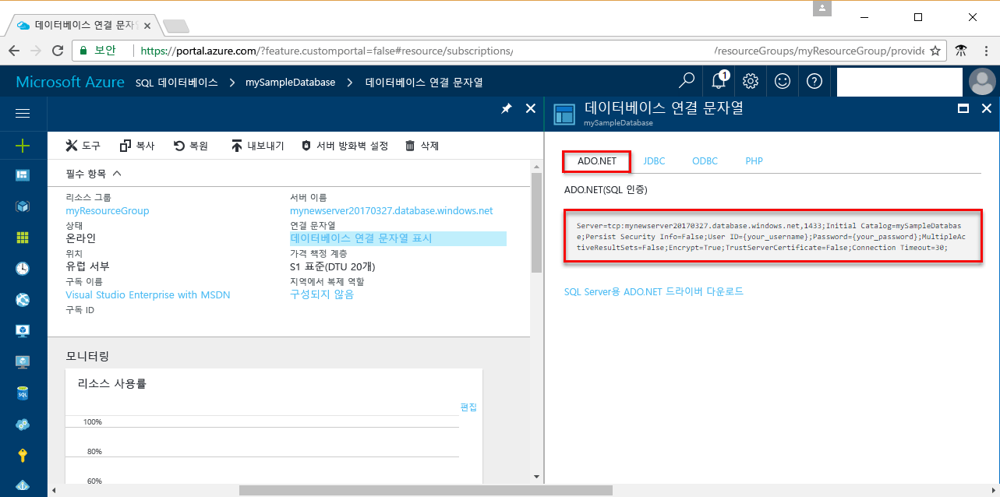

# <a name="use-net-c-with-visual-studio-tooconnect-and-query-an-azure-sql-database"></a>Visual Studio tooconnect와.NET (C#)를 사용 하 고 Azure SQL 데이터베이스를 쿼리 합니다.

이 빠른 시작 자습서에서는 설명 방법을 toouse hello [.NET framework](https://www.microsoft.com/net/) toocreate C# Visual Studio tooconnect tooan Azure SQL 데이터베이스를 사용 하 여 프로그래밍 하 고 TRANSACT-SQL 문을 tooquery 데이터를 사용 합니다.

## <a name="prerequisites"></a>필수 조건

toocomplete이 빠른 시작 자습서 hello 다음 항목이 있는지 확인 합니다.

- Azure SQL 데이터베이스입니다. 이러한 빠른 시작 중 하나에서 만들어진 hello 리소스를 사용 하는이 빠른 시작: 

   - [DB 만들기 - 포털](sql-database-get-started-portal.md)
   - [DB 만들기 - CLI](sql-database-get-started-cli.md)
   - [DB 만들기 - PowerShell](sql-database-get-started-powershell.md)

- A [서버 수준 방화벽 규칙](sql-database-get-started-portal.md#create-a-server-level-firewall-rule) hello hello 컴퓨터의 공용 IP 주소에 대 한이 빠른 시작 자습서에 사용 합니다.
- 설치된 [Visual Studio Community 2017, Visual Studio Professional 2017 또는 Visual Studio Enterprise 2017](https://www.visualstudio.com/downloads/)

## <a name="sql-server-connection-information"></a>SQL 서버 연결 정보

Hello 연결 필요한 정보 tooconnect toohello Azure SQL 데이터베이스를 가져옵니다. Hello 정규화 된 서버 이름, 데이터베이스 이름 및 로그인 정보 hello 다음 절차에 필요 합니다.

1. Toohello 로그인 [Azure 포털](https://portal.azure.com/)합니다.
2. 선택 **SQL 데이터베이스** hello 왼쪽 메뉴에서 hello에 데이터베이스를 클릭 하 고 **SQL 데이터베이스** 페이지. 
3. Hello에 **개요** 페이지 검토 hello 데이터베이스에 대 한 정규화 된 서버 이름 hello 다음 이미지와 같이 합니다. Hello 서버 이름 toobring hello 가리키면 **toocopy 클릭** 옵션입니다. 

    

4. Azure SQL 데이터베이스 서버 로그인 정보를 잊은 경우 toohello SQL 데이터베이스 서버 페이지 tooview hello 서버 관리자 이름을 이동 합니다. 필요한 경우 hello 암호를 재설정할 수 있습니다.

5. **연결 문자열 표시**를 클릭합니다.

6. 전체 검토 hello **ADO.NET** 연결 문자열입니다.

    

> [!IMPORTANT]
> 방화벽 규칙에는이 자습서를 수행 하는 hello 컴퓨터의 공용 IP 주소를 hello에 대 한 위치에 있어야 합니다. 다른 공용 IP 주소가 있어야 하거나 다른 컴퓨터에는 경우 만들기는 [Azure 포털 hello 사용 하 여 서버 수준 방화벽 규칙](sql-database-get-started-portal.md#create-a-server-level-firewall-rule)합니다. 
>
  
## <a name="create-a-new-visual-studio-project"></a>새 Visual Studio 프로젝트 만들기

1. Visual Studio에서 **파일**, **새로 만들기**, **프로젝트**를 차례로 선택합니다. 
2. Hello에 **새 프로젝트** 대화 상자에서 확장 **Visual C#**합니다.
3. 선택 **콘솔 응용 프로그램** 입력 *sqltest* hello 프로젝트 이름에 대 한 합니다.
4. 클릭 **확인** toocreate 및 Visual Studio에서 새 프로젝트를 열고 hello
4. [솔루션 탐색기]에서 **sqltest**를 마우스 오른쪽 단추로 클릭하고 **NuGet 패키지 관리**를 클릭합니다. 
5. Hello에 **찾아보기**, 검색할 ```System.Data.SqlClient``` 는 시점과, 찾은 컨트롤을 선택 합니다.
6. Hello에 **System.Data.SqlClient** 페이지 **설치**합니다.
7. Hello 설치가 완료 되 면 hello 변경 내용을 검토 한 다음 클릭 **확인** tooclose hello **미리 보기** 창. 
8. **라이선스 승인** 창이 표시되면 **동의**를 클릭합니다.

## <a name="insert-code-tooquery-sql-database"></a>코드 tooquery SQL 데이터베이스를 삽입 합니다.
1. 너무 전환 (또는 필요에 따라 열기) **Program.cs**

2. Hello 내용 바꾸기 **Program.cs** 다음 코드로 바꾸고 hello 서버, 데이터베이스, 사용자 및 암호에 대 한 적절 한 값을 추가 하는 hello로 합니다.

```csharp
using System;
using System.Data.SqlClient;
using System.Text;

namespace sqltest
{
    class Program
    {
        static void Main(string[] args)
        {
            try 
            { 
                SqlConnectionStringBuilder builder = new SqlConnectionStringBuilder();
                builder.DataSource = "your_server.database.windows.net"; 
                builder.UserID = "your_user";            
                builder.Password = "your_password";     
                builder.InitialCatalog = "your_database";

                using (SqlConnection connection = new SqlConnection(builder.ConnectionString))
                {
                    Console.WriteLine("\nQuery data example:");
                    Console.WriteLine("=========================================\n");
                    
                    connection.Open();       
                    StringBuilder sb = new StringBuilder();
                    sb.Append("SELECT TOP 20 pc.Name as CategoryName, p.name as ProductName ");
                    sb.Append("FROM [SalesLT].[ProductCategory] pc ");
                    sb.Append("JOIN [SalesLT].[Product] p ");
                    sb.Append("ON pc.productcategoryid = p.productcategoryid;");
                    String sql = sb.ToString();

                    using (SqlCommand command = new SqlCommand(sql, connection))
                    {
                        using (SqlDataReader reader = command.ExecuteReader())
                        {
                            while (reader.Read())
                            {
                                Console.WriteLine("{0} {1}", reader.GetString(0), reader.GetString(1));
                            }
                        }
                    }                    
                }
            }
            catch (SqlException e)
            {
                Console.WriteLine(e.ToString());
            }
            Console.ReadLine();
        }
    }
}
```

## <a name="run-hello-code"></a>Hello 코드 실행

1. 키를 눌러 **F5** toorun hello 응용 프로그램입니다.
2. 확인 hello 상위 20 개의 행이 반환 됩니다 한 hello 응용 프로그램 창을 닫습니다.

## <a name="next-steps"></a>다음 단계

- 너무 방법에 대해 알아봅니다[연결 및.NET core를 사용 하 여 Azure SQL 데이터베이스 쿼리](sql-database-connect-query-dotnet-core.md) macOS/Windows/Linux에 있습니다.  
- 에 대 한 자세한 내용은 [Windows/Linux/macOS hello 명령줄을 사용 하 여에서.NET Core 시작](/dotnet/core/tutorials/using-with-xplat-cli)합니다.
- 너무 방법에 대해 알아봅니다[SSMS를 사용 하 여 첫 번째 Azure SQL 데이터베이스 디자인](sql-database-design-first-database.md) 또는 [.NET을 사용 하 여 첫 번째 Azure SQL 데이터베이스 디자인](sql-database-design-first-database-csharp.md)합니다.
- .NET에 대한 자세한 내용은 [.NET 설명서](https://docs.microsoft.com/dotnet/)를 참조하세요.
