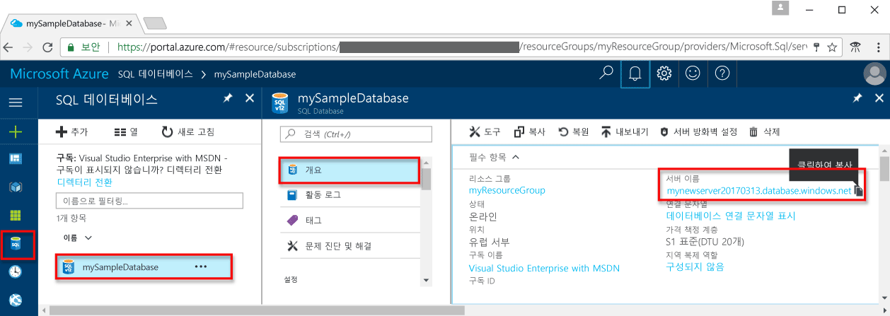

# <a name="use-java-tooquery-an-azure-sql-database"></a><span data-ttu-id="1fe8e-103">Java tooquery Azure SQL 데이터베이스를 사용 하 여</span><span class="sxs-lookup"><span data-stu-id="1fe8e-103">Use Java tooquery an Azure SQL database</span></span>

<span data-ttu-id="1fe8e-104">이 빠른 시작에서는 방법을 toouse [Java](https://docs.microsoft.com/sql/connect/jdbc/microsoft-jdbc-driver-for-sql-server) tooconnect tooan Azure SQL 데이터베이스에 있으며 다음 TRANSACT-SQL 문을 tooquery 데이터를 사용 합니다.</span><span class="sxs-lookup"><span data-stu-id="1fe8e-104">This quick start demonstrates how toouse [Java](https://docs.microsoft.com/sql/connect/jdbc/microsoft-jdbc-driver-for-sql-server) tooconnect tooan Azure SQL database and then use Transact-SQL statements tooquery data.</span></span>

## <a name="prerequisites"></a><span data-ttu-id="1fe8e-105">필수 조건</span><span class="sxs-lookup"><span data-stu-id="1fe8e-105">Prerequisites</span></span>

<span data-ttu-id="1fe8e-106">toocomplete이 빠른 시작 자습서, hello 필수 구성 요소를 수행 했는지 확인 합니다.</span><span class="sxs-lookup"><span data-stu-id="1fe8e-106">toocomplete this quick start tutorial, make sure you have hello following prerequisites:</span></span>

- <span data-ttu-id="1fe8e-107">Azure SQL 데이터베이스입니다.</span><span class="sxs-lookup"><span data-stu-id="1fe8e-107">An Azure SQL database.</span></span> <span data-ttu-id="1fe8e-108">이러한 빠른 시작 중 하나에서 만들어진 hello 리소스를 사용 하는이 빠른 시작:</span><span class="sxs-lookup"><span data-stu-id="1fe8e-108">This quick start uses hello resources created in one of these quick starts:</span></span> 

   - [<span data-ttu-id="1fe8e-109">DB 만들기 - 포털</span><span class="sxs-lookup"><span data-stu-id="1fe8e-109">Create DB - Portal</span></span>](sql-database-get-started-portal.md)
   - [<span data-ttu-id="1fe8e-110">DB 만들기 - CLI</span><span class="sxs-lookup"><span data-stu-id="1fe8e-110">Create DB - CLI</span></span>](sql-database-get-started-cli.md)
   - [<span data-ttu-id="1fe8e-111">DB 만들기 - PowerShell</span><span class="sxs-lookup"><span data-stu-id="1fe8e-111">Create DB - PowerShell</span></span>](sql-database-get-started-powershell.md)

- <span data-ttu-id="1fe8e-112">A [서버 수준 방화벽 규칙](sql-database-get-started-portal.md#create-a-server-level-firewall-rule) hello hello 컴퓨터의 공용 IP 주소에 대 한이 빠른 시작 자습서에 사용 합니다.</span><span class="sxs-lookup"><span data-stu-id="1fe8e-112">A [server-level firewall rule](sql-database-get-started-portal.md#create-a-server-level-firewall-rule) for hello public IP address of hello computer you use for this quick start tutorial.</span></span>

- <span data-ttu-id="1fe8e-113">운영 체제에 맞게 설치된 Java 및 관련 소프트웨어</span><span class="sxs-lookup"><span data-stu-id="1fe8e-113">You have installed Java and related software for your operating system.</span></span>

    - <span data-ttu-id="1fe8e-114">**MacOS**: Homebrew와 Java를 설치한 다음 Maven을 설치합니다.</span><span class="sxs-lookup"><span data-stu-id="1fe8e-114">**MacOS**: Install Homebrew and Java, and then install Maven.</span></span> <span data-ttu-id="1fe8e-115">[1.2 및 1.3 단계](https://www.microsoft.com/sql-server/developer-get-started/java/mac/) 참조</span><span class="sxs-lookup"><span data-stu-id="1fe8e-115">See [Step 1.2 and 1.3](https://www.microsoft.com/sql-server/developer-get-started/java/mac/).</span></span>
    - <span data-ttu-id="1fe8e-116">**Ubuntu**: Maven 설치 하 고 hello Java 개발 키트를 설치 합니다.</span><span class="sxs-lookup"><span data-stu-id="1fe8e-116">**Ubuntu**:  Install hello Java Development Kit, and install Maven.</span></span> <span data-ttu-id="1fe8e-117">[1.2, 1.3 및 1.4 단계](https://www.microsoft.com/sql-server/developer-get-started/java/ubuntu/) 참조</span><span class="sxs-lookup"><span data-stu-id="1fe8e-117">See [Step 1.2, 1.3, and 1.4](https://www.microsoft.com/sql-server/developer-get-started/java/ubuntu/).</span></span>
    - <span data-ttu-id="1fe8e-118">**Windows**: Java Development Kit hello 및 Maven 설치 합니다.</span><span class="sxs-lookup"><span data-stu-id="1fe8e-118">**Windows**: Install hello Java Development Kit, and Maven.</span></span> <span data-ttu-id="1fe8e-119">[1.2 및 1.3 단계](https://www.microsoft.com/sql-server/developer-get-started/java/windows/) 참조</span><span class="sxs-lookup"><span data-stu-id="1fe8e-119">See [Step 1.2 and 1.3](https://www.microsoft.com/sql-server/developer-get-started/java/windows/).</span></span>    

## <a name="sql-server-connection-information"></a><span data-ttu-id="1fe8e-120">SQL 서버 연결 정보</span><span class="sxs-lookup"><span data-stu-id="1fe8e-120">SQL server connection information</span></span>

<span data-ttu-id="1fe8e-121">Hello 연결 필요한 정보 tooconnect toohello Azure SQL 데이터베이스를 가져옵니다.</span><span class="sxs-lookup"><span data-stu-id="1fe8e-121">Get hello connection information needed tooconnect toohello Azure SQL database.</span></span> <span data-ttu-id="1fe8e-122">Hello 정규화 된 서버 이름, 데이터베이스 이름 및 로그인 정보 hello 다음 절차에 필요 합니다.</span><span class="sxs-lookup"><span data-stu-id="1fe8e-122">You will need hello fully qualified server name, database name, and login information in hello next procedures.</span></span>

1. <span data-ttu-id="1fe8e-123">Toohello 로그인 [Azure 포털](https://portal.azure.com/)합니다.</span><span class="sxs-lookup"><span data-stu-id="1fe8e-123">Log in toohello [Azure portal](https://portal.azure.com/).</span></span>
2. <span data-ttu-id="1fe8e-124">선택 **SQL 데이터베이스** hello 왼쪽 메뉴에서 hello에 데이터베이스를 클릭 하 고 **SQL 데이터베이스** 페이지.</span><span class="sxs-lookup"><span data-stu-id="1fe8e-124">Select **SQL Databases** from hello left-hand menu, and click your database on hello **SQL databases** page.</span></span> 
3. <span data-ttu-id="1fe8e-125">Hello에 **개요** 데이터베이스 페이지에서 hello 다음 이미지와 같이 hello 정규화 된 서버 이름을 검토: hello 서버 이름 toobring hello 가리키면 **toocopy 클릭** 옵션입니다.</span><span class="sxs-lookup"><span data-stu-id="1fe8e-125">On hello **Overview** page for your database, review hello fully qualified server name as shown in hello following image: You can hover over hello server name toobring up hello **Click toocopy** option.</span></span>  

    

4. <span data-ttu-id="1fe8e-127">서버 로그인 정보를 잊은 경우 toohello SQL 데이터베이스 서버 페이지 tooview hello 서버 관리자 이름을 이동 합니다.</span><span class="sxs-lookup"><span data-stu-id="1fe8e-127">If you forget your server login information, navigate toohello SQL Database server page tooview hello server admin name.</span></span>  <span data-ttu-id="1fe8e-128">필요한 경우 hello 암호를 재설정 합니다.</span><span class="sxs-lookup"><span data-stu-id="1fe8e-128">If necessary, reset hello password.</span></span>     

## <a name="create-maven-project-and-dependencies"></a><span data-ttu-id="1fe8e-129">**Maven 프로젝트 및 종속성 만들기**</span><span class="sxs-lookup"><span data-stu-id="1fe8e-129">**Create Maven project and dependencies**</span></span>
1. <span data-ttu-id="1fe8e-130">Hello 터미널에서 라는 새 Maven 프로젝트를 만들 **sqltest**합니다.</span><span class="sxs-lookup"><span data-stu-id="1fe8e-130">From hello terminal, create a new Maven project called **sqltest**.</span></span> 

   ```bash
   mvn archetype:generate "-DgroupId=com.sqldbsamples" "-DartifactId=sqltest" "-DarchetypeArtifactId=maven-archetype-quickstart" "-Dversion=1.0.0"
   ```

2. <span data-ttu-id="1fe8e-131">메시지가 표시되면 **Y**를 입력합니다.</span><span class="sxs-lookup"><span data-stu-id="1fe8e-131">Enter **Y** when prompted.</span></span>
3. <span data-ttu-id="1fe8e-132">디렉터리도 변경**sqltest** 엽니다 ***pom.xml*** 원하는 텍스트 편집기를 사용 합니다.</span><span class="sxs-lookup"><span data-stu-id="1fe8e-132">Change directory too**sqltest** and open ***pom.xml*** with your favorite text editor.</span></span>  <span data-ttu-id="1fe8e-133">Hello 추가 **SQL Server 용 Microsoft JDBC Driver** 다음 코드를 사용 하 여 tooyour 프로젝트 종속성 hello:</span><span class="sxs-lookup"><span data-stu-id="1fe8e-133">Add hello **Microsoft JDBC Driver for SQL Server** tooyour project's dependencies using hello following code:</span></span>

   ```xml
   <dependency>
       <groupId>com.microsoft.sqlserver</groupId>
       <artifactId>mssql-jdbc</artifactId>
       <version>6.2.1.jre8</version>
   </dependency>
   ```

4. <span data-ttu-id="1fe8e-134">또한 ***pom.xml***, hello 다음 tooyour 프로젝트 속성을 추가 합니다.</span><span class="sxs-lookup"><span data-stu-id="1fe8e-134">Also in ***pom.xml***, add hello following properties tooyour project.</span></span>  <span data-ttu-id="1fe8e-135">속성 섹션을 설정 하지 않은 경우에 hello 종속성 후 추가할 수 있습니다.</span><span class="sxs-lookup"><span data-stu-id="1fe8e-135">If you don't have a properties section, you can add it after hello dependencies.</span></span>

   ```xml
   <properties>
       <maven.compiler.source>1.8</maven.compiler.source>
       <maven.compiler.target>1.8</maven.compiler.target>
   </properties>
   ```

5. <span data-ttu-id="1fe8e-136">***pom.xml***을 저장하고 닫습니다.</span><span class="sxs-lookup"><span data-stu-id="1fe8e-136">Save and close ***pom.xml***.</span></span>

## <a name="insert-code-tooquery-sql-database"></a><span data-ttu-id="1fe8e-137">코드 tooquery SQL 데이터베이스를 삽입 합니다.</span><span class="sxs-lookup"><span data-stu-id="1fe8e-137">Insert code tooquery SQL database</span></span>

1. <span data-ttu-id="1fe8e-138">\sqltest\src\main\java\com\sqlsamples\App.java에 있는 Maven 프로젝트에 이미 ***App.java***라는 파일이 있어야 합니다.</span><span class="sxs-lookup"><span data-stu-id="1fe8e-138">You should already have a file called ***App.java*** in your Maven project located at:  ..\sqltest\src\main\java\com\sqlsamples\App.java</span></span>

2. <span data-ttu-id="1fe8e-139">파일을 열고 hello을 바꾸기 hello 다음 그 내용을 코드 한 hello 서버, 데이터베이스, 사용자 및 암호에 대 한 적절 한 값을 추가 합니다.</span><span class="sxs-lookup"><span data-stu-id="1fe8e-139">Open hello file and replace its contents with hello following code and add hello appropriate values for your server, database, user, and password.</span></span>

   ```java
   package com.sqldbsamples;

   import java.sql.Connection;
   import java.sql.Statement;
   import java.sql.PreparedStatement;
   import java.sql.ResultSet;
   import java.sql.DriverManager;

   public class App {

    public static void main(String[] args) {
    
        // Connect toodatabase
           String hostName = "your_server.database.windows.net";
           String dbName = "your_database";
           String user = "your_username";
           String password = "your_password";
           String url = String.format("jdbc:sqlserver://%s:1433;database=%s;user=%s;password=%s;encrypt=true;hostNameInCertificate=*.database.windows.net;loginTimeout=30;", hostName, dbName, user, password);
           Connection connection = null;

           try {
                   connection = DriverManager.getConnection(url);
                   String schema = connection.getSchema();
                   System.out.println("Successful connection - Schema: " + schema);

                   System.out.println("Query data example:");
                   System.out.println("=========================================");

                   // Create and execute a SELECT SQL statement.
                   String selectSql = "SELECT TOP 20 pc.Name as CategoryName, p.name as ProductName " 
                       + "FROM [SalesLT].[ProductCategory] pc "  
                       + "JOIN [SalesLT].[Product] p ON pc.productcategoryid = p.productcategoryid";
                
                   try (Statement statement = connection.createStatement();
                       ResultSet resultSet = statement.executeQuery(selectSql)) {

                           // Print results from select statement
                           System.out.println("Top 20 categories:");
                           while (resultSet.next())
                           {
                               System.out.println(resultSet.getString(1) + " "
                                   + resultSet.getString(2));
                           }
                    connection.close();
                   }                   
           }
           catch (Exception e) {
                   e.printStackTrace();
           }
       }
   }
   ```

## <a name="run-hello-code"></a><span data-ttu-id="1fe8e-140">Hello 코드 실행</span><span class="sxs-lookup"><span data-stu-id="1fe8e-140">Run hello code</span></span>

1. <span data-ttu-id="1fe8e-141">Hello 명령 프롬프트에서 다음 명령을 hello를 실행 합니다.</span><span class="sxs-lookup"><span data-stu-id="1fe8e-141">At hello command prompt, run hello following commands:</span></span>

   ```bash
   mvn package
   mvn -q exec:java "-Dexec.mainClass=com.sqldbsamples.App"
   ```

2. <span data-ttu-id="1fe8e-142">확인 hello 상위 20 개의 행이 반환 됩니다 한 hello 응용 프로그램 창을 닫습니다.</span><span class="sxs-lookup"><span data-stu-id="1fe8e-142">Verify that hello top 20 rows are returned and then close hello application window.</span></span>


## <a name="next-steps"></a><span data-ttu-id="1fe8e-143">다음 단계</span><span class="sxs-lookup"><span data-stu-id="1fe8e-143">Next steps</span></span>
- [<span data-ttu-id="1fe8e-144">첫 번째 Azure SQL Database 디자인</span><span class="sxs-lookup"><span data-stu-id="1fe8e-144">Design your first Azure SQL database</span></span>](sql-database-design-first-database.md)
- [<span data-ttu-id="1fe8e-145">SQL Server용 Microsoft JDBC Driver</span><span class="sxs-lookup"><span data-stu-id="1fe8e-145">Microsoft JDBC Driver for SQL Server</span></span>](https://github.com/microsoft/mssql-jdbc)
- [<span data-ttu-id="1fe8e-146">문제/질문 보고</span><span class="sxs-lookup"><span data-stu-id="1fe8e-146">Report issues/ask questions</span></span>](https://github.com/microsoft/mssql-jdbc/issues)

