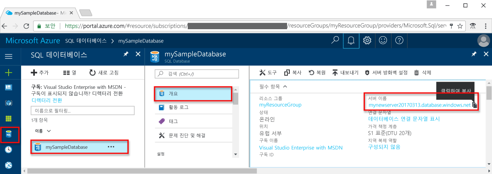

# <a name="use-php-to-query-an-azure-sql-database"></a><span data-ttu-id="5e0fd-103">PHP를 사용하여 Azure SQL Database 쿼리</span><span class="sxs-lookup"><span data-stu-id="5e0fd-103">Use PHP to query an Azure SQL database</span></span>

<span data-ttu-id="5e0fd-104">이 빠른 시작 자습서에서는 [PHP](http://php.net/manual/en/intro-whatis.php)를 통해 Azure SQL Database에 연결하고 Transact-SQL 문을 사용하여 데이터를 쿼리하는 프로그램을 만드는 방법을 보여 줍니다.</span><span class="sxs-lookup"><span data-stu-id="5e0fd-104">This quick start tutorial demonstrates how to use [PHP](http://php.net/manual/en/intro-whatis.php) to create a program to connect to an Azure SQL database and use Transact-SQL statements to query data.</span></span>

## <a name="prerequisites"></a><span data-ttu-id="5e0fd-105">필수 조건</span><span class="sxs-lookup"><span data-stu-id="5e0fd-105">Prerequisites</span></span>

<span data-ttu-id="5e0fd-106">이 빠른 시작 자습서를 완료하려면 다음 항목이 있어야 합니다.</span><span class="sxs-lookup"><span data-stu-id="5e0fd-106">To complete this quick start tutorial, make sure you have the following:</span></span>

- <span data-ttu-id="5e0fd-107">Azure SQL 데이터베이스입니다.</span><span class="sxs-lookup"><span data-stu-id="5e0fd-107">An Azure SQL database.</span></span> <span data-ttu-id="5e0fd-108">이 빠른 시작에서는 다음과 같은 빠른 시작 중 하나에서 만든 리소스를 사용합니다.</span><span class="sxs-lookup"><span data-stu-id="5e0fd-108">This quick start uses the resources created in one of these quick starts:</span></span> 

   - [<span data-ttu-id="5e0fd-109">DB 만들기 - 포털</span><span class="sxs-lookup"><span data-stu-id="5e0fd-109">Create DB - Portal</span></span>](sql-database-get-started-portal.md)
   - [<span data-ttu-id="5e0fd-110">DB 만들기 - CLI</span><span class="sxs-lookup"><span data-stu-id="5e0fd-110">Create DB - CLI</span></span>](sql-database-get-started-cli.md)
   - [<span data-ttu-id="5e0fd-111">DB 만들기 - PowerShell</span><span class="sxs-lookup"><span data-stu-id="5e0fd-111">Create DB - PowerShell</span></span>](sql-database-get-started-powershell.md)

- <span data-ttu-id="5e0fd-112">이 빠른 시작 자습서에서 사용하는 컴퓨터의 공용 IP 주소에 대한 [서버 수준 방화벽 규칙](sql-database-get-started-portal.md#create-a-server-level-firewall-rule)</span><span class="sxs-lookup"><span data-stu-id="5e0fd-112">A [server-level firewall rule](sql-database-get-started-portal.md#create-a-server-level-firewall-rule) for the public IP address of the computer you use for this quick start tutorial.</span></span>

- <span data-ttu-id="5e0fd-113">운영 체제에 맞게 설치된 PHP 및 관련 소프트웨어</span><span class="sxs-lookup"><span data-stu-id="5e0fd-113">You have installed PHP and related software for your operating system.</span></span>

    - <span data-ttu-id="5e0fd-114">**MacOS**: Homebrew와 PHP를 설치하고, ODBC 드라이버와 SQLCMD를 설치한 다음, SQL Server용 PHP Driver를 설치합니다.</span><span class="sxs-lookup"><span data-stu-id="5e0fd-114">**MacOS**: Install Homebrew and PHP, install the ODBC driver and SQLCMD, and then install the PHP Driver for SQL Server.</span></span> <span data-ttu-id="5e0fd-115">[1.2, 1.3 및 2.1단계](https://www.microsoft.com/en-us/sql-server/developer-get-started/php/mac/)를 참조하세요.</span><span class="sxs-lookup"><span data-stu-id="5e0fd-115">See [Steps 1.2, 1.3, and 2.1](https://www.microsoft.com/en-us/sql-server/developer-get-started/php/mac/).</span></span>
    - <span data-ttu-id="5e0fd-116">**Ubuntu**: PHP 및 기타 필요한 패키지를 설치한 다음, SQL Server용 PHP Driver를 설치합니다.</span><span class="sxs-lookup"><span data-stu-id="5e0fd-116">**Ubuntu**:  Install PHP and other required packages, and then install the PHP Driver for SQL Server.</span></span> <span data-ttu-id="5e0fd-117">[1.2 및 2.1단계](https://www.microsoft.com/sql-server/developer-get-started/php/ubuntu/)를 참조하세요.</span><span class="sxs-lookup"><span data-stu-id="5e0fd-117">See [Steps 1.2 and 2.1](https://www.microsoft.com/sql-server/developer-get-started/php/ubuntu/).</span></span>
    - <span data-ttu-id="5e0fd-118">**Windows**: IIS Express용 PHP 최신 버전, IIS Express의 SQL Server용 Microsoft 드라이버 최신 버전, Chocolatey, ODBC 드라이버 및 SQLCMD를 설치합니다.</span><span class="sxs-lookup"><span data-stu-id="5e0fd-118">**Windows**: Install the newest version of PHP for IIS Express, the newest version of Microsoft Drivers for SQL Server in IIS Express, Chocolatey, the ODBC driver, and SQLCMD.</span></span> <span data-ttu-id="5e0fd-119">[1.2 및 1.3단계](https://www.microsoft.com/sql-server/developer-get-started/php/windows/)를 참조하세요.</span><span class="sxs-lookup"><span data-stu-id="5e0fd-119">See [Steps 1.2 and 1.3](https://www.microsoft.com/sql-server/developer-get-started/php/windows/).</span></span>    

## <a name="sql-server-connection-information"></a><span data-ttu-id="5e0fd-120">SQL 서버 연결 정보</span><span class="sxs-lookup"><span data-stu-id="5e0fd-120">SQL server connection information</span></span>

<span data-ttu-id="5e0fd-121">Azure SQL Database에 연결하는 데 필요한 연결 정보를 가져옵니다.</span><span class="sxs-lookup"><span data-stu-id="5e0fd-121">Get the connection information needed to connect to the Azure SQL database.</span></span> <span data-ttu-id="5e0fd-122">다음 절차에는 정규화된 서버 이름, 데이터베이스 이름 및 로그인 정보가 필요합니다.</span><span class="sxs-lookup"><span data-stu-id="5e0fd-122">You will need the fully qualified server name, database name, and login information in the next procedures.</span></span>

1. <span data-ttu-id="5e0fd-123">[Azure Portal](https://portal.azure.com/)에 로그인합니다.</span><span class="sxs-lookup"><span data-stu-id="5e0fd-123">Log in to the [Azure portal](https://portal.azure.com/).</span></span>
2. <span data-ttu-id="5e0fd-124">왼쪽 메뉴에서 **SQL Database**를 선택하고 **SQL Database** 페이지에서 데이터베이스를 클릭합니다.</span><span class="sxs-lookup"><span data-stu-id="5e0fd-124">Select **SQL Databases** from the left-hand menu, and click your database on the **SQL databases** page.</span></span> 
3. <span data-ttu-id="5e0fd-125">데이터베이스의 **개요** 페이지에서 다음 이미지와 같이 정규화된 서버 이름을 검토합니다.</span><span class="sxs-lookup"><span data-stu-id="5e0fd-125">On the **Overview** page for your database, review the fully qualified server name as shown in the following image.</span></span> <span data-ttu-id="5e0fd-126">서버 이름 위로 마우스를 가져가면 **복사하려면 클릭** 옵션이 표시됩니다.</span><span class="sxs-lookup"><span data-stu-id="5e0fd-126">You can hover over the server name to bring up the **Click to copy** option.</span></span>  

    

4. <span data-ttu-id="5e0fd-128">서버 로그인 정보를 잊어버린 경우 SQL Database 서버 페이지로 이동하여 서버 관리자 이름을 확인하고 필요한 경우 암호를 다시 설정합니다.</span><span class="sxs-lookup"><span data-stu-id="5e0fd-128">If you forget your server login information, navigate to the SQL Database server page to view the server admin name and, if necessary, reset the password.</span></span>     
    
## <a name="insert-code-to-query-sql-database"></a><span data-ttu-id="5e0fd-129">SQL 데이터베이스 쿼리 코드 삽입</span><span class="sxs-lookup"><span data-stu-id="5e0fd-129">Insert code to query SQL database</span></span>

1. <span data-ttu-id="5e0fd-130">원하는 텍스트 편집기에서 **sqltest.php** 파일을 새로 만듭니다.</span><span class="sxs-lookup"><span data-stu-id="5e0fd-130">In your favorite text editor, create a new file, **sqltest.php**.</span></span>  

2. <span data-ttu-id="5e0fd-131">내용을 다음 코드로 바꾸고, 서버, 데이터베이스, 사용자 및 암호에 대해 적절한 값을 추가합니다.</span><span class="sxs-lookup"><span data-stu-id="5e0fd-131">Replace the contents with the following code and add the appropriate values for your server, database, user, and password.</span></span>

   ```PHP
   <?php
   $serverName = "your_server.database.windows.net";
   $connectionOptions = array(
       "Database" => "your_database",
       "Uid" => "your_username",
       "PWD" => "your_password"
   );
   //Establishes the connection
   $conn = sqlsrv_connect($serverName, $connectionOptions);
   $tsql= "SELECT TOP 20 pc.Name as CategoryName, p.name as ProductName
           FROM [SalesLT].[ProductCategory] pc
           JOIN [SalesLT].[Product] p
        ON pc.productcategoryid = p.productcategoryid";
   $getResults= sqlsrv_query($conn, $tsql);
   echo ("Reading data from table" . PHP_EOL);
   if ($getResults == FALSE)
       echo (sqlsrv_errors());
   while ($row = sqlsrv_fetch_array($getResults, SQLSRV_FETCH_ASSOC)) {
    echo ($row['CategoryName'] . " " . $row['ProductName'] . PHP_EOL);
   }
   sqlsrv_free_stmt($getResults);
   ?>
   ```

## <a name="run-the-code"></a><span data-ttu-id="5e0fd-132">코드 실행</span><span class="sxs-lookup"><span data-stu-id="5e0fd-132">Run the code</span></span>

1. <span data-ttu-id="5e0fd-133">명령 프롬프트에서 다음 명령을 실행합니다.</span><span class="sxs-lookup"><span data-stu-id="5e0fd-133">At the command prompt, run the following commands:</span></span>

   ```php
   php sqltest.php
   ```

2. <span data-ttu-id="5e0fd-134">상위 20개 행이 반환되는지 확인한 다음 응용 프로그램 창을 닫습니다.</span><span class="sxs-lookup"><span data-stu-id="5e0fd-134">Verify that the top 20 rows are returned and then close the application window.</span></span>

## <a name="next-steps"></a><span data-ttu-id="5e0fd-135">다음 단계</span><span class="sxs-lookup"><span data-stu-id="5e0fd-135">Next steps</span></span>
- [<span data-ttu-id="5e0fd-136">첫 번째 Azure SQL Database 디자인</span><span class="sxs-lookup"><span data-stu-id="5e0fd-136">Design your first Azure SQL database</span></span>](sql-database-design-first-database.md)
- [<span data-ttu-id="5e0fd-137">SQL Server용 Microsoft PHP 드라이버</span><span class="sxs-lookup"><span data-stu-id="5e0fd-137">Microsoft PHP Drivers for SQL Server</span></span>](https://github.com/Microsoft/msphpsql/)
- [<span data-ttu-id="5e0fd-138">문제 보고 또는 질문(영문)</span><span class="sxs-lookup"><span data-stu-id="5e0fd-138">Report issues or ask questions</span></span>](https://github.com/Microsoft/msphpsql/issues)
