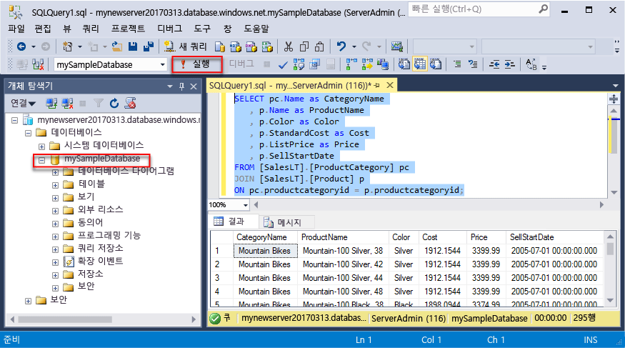
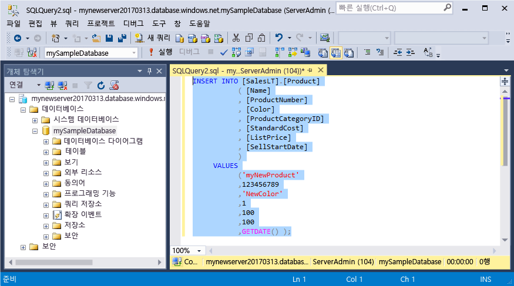
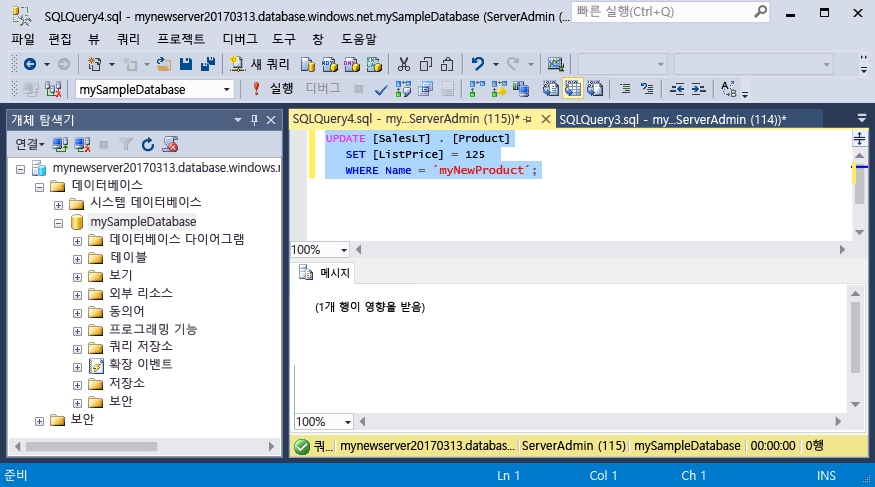
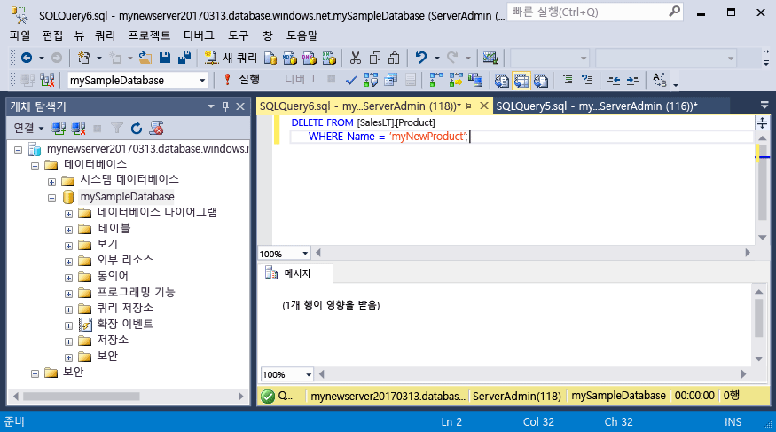

# <a name="azure-sql-database-use-sql-server-management-studio-tooconnect-and-query-data"></a>SQL Server Management Studio를 사용 하 여 tooconnect 및 쿼리 데이터를 azure SQL 데이터베이스:

[SQL Server Management Studio](https://msdn.microsoft.com/library/ms174173.aspx) (SSMS)는 SQL Server tooSQL Microsoft Windows에 대 한 데이터베이스에서에서 모든 SQL 인프라를 관리 하기 위한 통합된 환경입니다. 이 빠른 시작 방법을 toouse SSMS tooconnect tooan Azure SQL 데이터베이스 및 사용 하 여 Transact SQL 문 tooquery 삽입, 업데이트 및 삭제 hello 데이터베이스의에서 데이터를 보여 줍니다. 

## <a name="prerequisites"></a>필수 조건

이 빠른 시작이 빠른 시작 중 하나에서 만들어진의 시작 지점 hello 자원으로 사용 합니다.

- [DB 만들기 - 포털](sql-database-get-started-portal.md)
- [DB 만들기 - CLI](sql-database-get-started-cli.md)
- [DB 만들기 - PowerShell](sql-database-get-started-powershell.md)

시작 하기 전에 최신 버전의 hello를 설치 했는지 확인 [SSMS](https://msdn.microsoft.com/library/mt238290.aspx)합니다. 

## <a name="sql-server-connection-information"></a>SQL 서버 연결 정보

Hello 연결 필요한 정보 tooconnect toohello Azure SQL 데이터베이스를 가져옵니다. Hello 정규화 된 서버 이름, 데이터베이스 이름 및 로그인 정보 hello 다음 절차에 필요 합니다.

1. Toohello 로그인 [Azure 포털](https://portal.azure.com/)합니다.
2. 선택 **SQL 데이터베이스** hello 왼쪽 메뉴에서 hello에 데이터베이스를 클릭 하 고 **SQL 데이터베이스** 페이지. 
3. Hello에 **개요** 데이터베이스에 대 한 페이지 hello 이미지 아래에 나와 있는 것 처럼 hello 정규화 된 서버 이름을 검토 합니다. Hello 서버 이름 toobring hello 가리키면 **toocopy 클릭** 옵션입니다.

    

4. Azure SQL 데이터베이스 서버에 대 한 hello 로그인 정보를 잊은 경우 toohello SQL 데이터베이스 서버 페이지 tooview hello 서버 관리자 이름을 탐색 하 고, 필요한 경우 다시 설정 hello 암호입니다. 

## <a name="connect-tooyour-database"></a>Tooyour 데이터베이스 연결

SQL Server Management Studio tooestablish 연결 tooyour Azure SQL 데이터베이스 서버를 사용 합니다. 

> [!IMPORTANT]
> Azure SQL Database 논리 서버는 포트 1433에서 수신 대기합니다. Tooconnect tooan Azure SQL 데이터베이스 논리 서버에서 회사 방화벽 내에서 시도 하는 경우 있습니다 toosuccessfully 연결을 위해이 포트 hello 회사 방화벽에서 열려 있는 여야 합니다.
>

1. SQL Server Management Studio를 엽니다.

2. Hello에 **tooServer 연결** 대화 상자에 hello 다음 정보를 입력 합니다.

   | 설정       | 제안 값 | 설명 | 
   | ------------ | ------------------ | ------------------------------------------------- | 
   | **서버 유형** | 데이터베이스 엔진 | 이 값은 필수입니다. |
   | **서버 이름** | hello 정규화 된 서버 이름 | hello 이름은 해야 다음과 같이: **mynewserver20170313.database.windows.net**합니다. |
   | **인증** | SQL Server 인증 | SQL 인증에는이 자습서에서는 구성 hello 유일한 인증 유형입니다. |
   | **로그인** | hello 서버 관리자 계정 | Hello 서버를 만들 때 지정한 hello 계정입니다. |
   | **암호** | 서버 관리자 계정에 대 한 hello 암호 | 이 hello 암호 hello 서버를 만들 때 지정한입니다. |

     

3. 클릭 **옵션** hello에 **tooserver 연결** 대화 상자. Hello에 **toodatabase 연결** 섹션에서 입력 **mySampleDatabase** tooconnect toothis 데이터베이스입니다.

     

4. **Connect**를 클릭합니다. SSMS에서 hello 개체 탐색기 창이 열립니다. 

     

5. 개체 탐색기에서 확장 **데이터베이스** 펼친 다음 **mySampleDatabase** hello 샘플 데이터베이스의 tooview hello 개체입니다.

## <a name="query-data"></a>쿼리 데이터

사용 하 여 hello 다음 hello를 사용 하 여 범주별으로 tooquery hello 상위 20 제품에 대 한 코드 [선택](https://msdn.microsoft.com/library/ms189499.aspx) Transact SQL 문입니다.

1. 개체 탐색기에서 **mySampleDatabase**를 마우스 오른쪽 단추로 클릭하고 **새 쿼리**를 클릭합니다. 빈 쿼리 창이 열립니다 tooyour 연결 된 데이터베이스입니다.
2. Hello 쿼리 창에서 다음 쿼리는 hello를 입력 합니다.

   ```sql
   SELECT pc.Name as CategoryName, p.name as ProductName
   FROM [SalesLT].[ProductCategory] pc
   JOIN [SalesLT].[Product] p
   ON pc.productcategoryid = p.productcategoryid;
   ```

3. Hello 도구 모음에서 **Execute** hello Product 및 ProductCategory 테이블의 tooretrieve 데이터입니다.

    

## <a name="insert-data"></a>데이터 삽입

사용 하 여 hello 다음 코드 tooinsert 신제품 hello를 사용 하 여 hello s a l 테이블로 [삽입](https://msdn.microsoft.com/library/ms174335.aspx) Transact SQL 문입니다.

1. Hello 쿼리 창에서 hello 이전 쿼리에서를 다음 쿼리에서 hello로 바꿉니다.

   ```sql
   INSERT INTO [SalesLT].[Product]
           ( [Name]
           , [ProductNumber]
           , [Color]
           , [ProductCategoryID]
           , [StandardCost]
           , [ListPrice]
           , [SellStartDate]
           )
     VALUES
           ('myNewProduct'
           ,123456789
           ,'NewColor'
           ,1
           ,100
           ,100
           ,GETDATE() );
   ```

2. Hello 도구 모음에서 **Execute** tooinsert hello Product 테이블에 새 행입니다.

    

## <a name="update-data"></a>데이터 업데이트

사용 하 여 hello 다음 코드를 이전에 추가한 hello를 사용 하 여 tooupdate hello 새 제품 [업데이트](https://msdn.microsoft.com/library/ms177523.aspx) Transact SQL 문입니다.

1. Hello 쿼리 창에서 hello 이전 쿼리에서를 다음 쿼리에서 hello로 바꿉니다.

   ```sql
   UPDATE [SalesLT].[Product]
   SET [ListPrice] = 125
   WHERE Name = 'myNewProduct';
   ```

2. Hello 도구 모음에서 **Execute** tooupdate hello hello Product 테이블에서 지정 된 행입니다.

    

## <a name="delete-data"></a>데이터 삭제

사용 하 여 hello 다음 코드를 이전에 추가한 hello를 사용 하 여 toodelete hello 새 제품 [삭제](https://msdn.microsoft.com/library/ms189835.aspx) Transact SQL 문입니다.

1. Hello 쿼리 창에서 hello 이전 쿼리에서를 다음 쿼리에서 hello로 바꿉니다.

   ```sql
   DELETE FROM [SalesLT].[Product]
   WHERE Name = 'myNewProduct';
   ```

2. Hello 도구 모음에서 **Execute** toodelete hello hello Product 테이블에서 지정 된 행입니다.

    

## <a name="next-steps"></a>다음 단계

- 서버 및 TRANSACT-SQL을 사용 하 여 데이터베이스 만들기 및 관리 하는 방법에 대 한 toolearn 참조 [Azure SQL 데이터베이스 서버 및 데이터베이스에 알아보기](sql-database-servers-databases.md)합니다.
- SSMS에 대한 자세한 내용은 [SQL Server Management Studio 사용](https://msdn.microsoft.com/library/ms174173.aspx)을 참조하세요.
- tooconnect 및 Visual Studio 코드를 사용 하 여 쿼리 참조 [연결 및 Visual Studio 코드 쿼리](sql-database-connect-query-vscode.md)합니다.
- tooconnect 및.NET을 사용 하 여 쿼리 참조 [연결 및 쿼리.net](sql-database-connect-query-dotnet.md)합니다.
- tooconnect 및 PHP를 사용 하 여 쿼리 참조 [연결 및 PHP 사용 하 여 쿼리](sql-database-connect-query-php.md)합니다.
- Node.js를 사용 하 여 쿼리 및 tooconnect 참조 [연결 및 Node.js와 함께 쿼리](sql-database-connect-query-nodejs.md)합니다.
- tooconnect 및 Java를 사용 하 여 쿼리 참조 [연결 및 Java 사용 하 여 쿼리](sql-database-connect-query-java.md)합니다.
- tooconnect 및 Python을 사용 하 여 쿼리 참조 [연결 및 쿼리 python](sql-database-connect-query-python.md)합니다.
- tooconnect 및 Ruby를 사용 하 여 쿼리 참조 [연결 및 Ruby 사용 하 여 쿼리](sql-database-connect-query-ruby.md)합니다.
