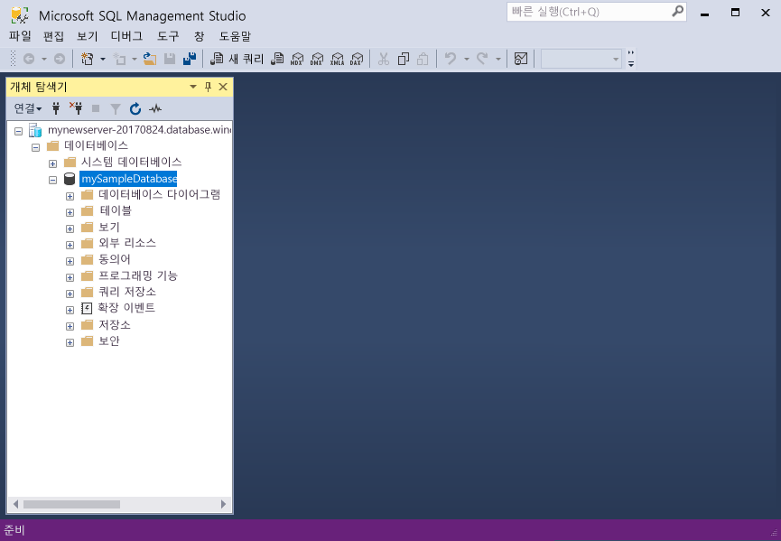

# <a name="azure-sql-database-use-sql-server-management-studio-tooconnect-and-query-data"></a><span data-ttu-id="a03a0-105">SQL Server Management Studio를 사용 하 여 tooconnect 및 쿼리 데이터를 azure SQL 데이터베이스:</span><span class="sxs-lookup"><span data-stu-id="a03a0-105">Azure SQL Database: Use SQL Server Management Studio tooconnect and query data</span></span>

<span data-ttu-id="a03a0-106">[SQL Server Management Studio](https://msdn.microsoft.com/library/ms174173.aspx) (SSMS)는 SQL Server tooSQL Microsoft Windows에 대 한 데이터베이스에서에서 모든 SQL 인프라를 관리 하기 위한 통합된 환경입니다.</span><span class="sxs-lookup"><span data-stu-id="a03a0-106">[SQL Server Management Studio](https://msdn.microsoft.com/library/ms174173.aspx) (SSMS) is an integrated environment for managing any SQL infrastructure, from SQL Server tooSQL Database for Microsoft Windows.</span></span> <span data-ttu-id="a03a0-107">이 빠른 시작 방법을 toouse SSMS tooconnect tooan Azure SQL 데이터베이스 및 사용 하 여 Transact SQL 문 tooquery 삽입, 업데이트 및 삭제 hello 데이터베이스의에서 데이터를 보여 줍니다.</span><span class="sxs-lookup"><span data-stu-id="a03a0-107">This quick start demonstrates how toouse SSMS tooconnect tooan Azure SQL database, and then use Transact-SQL statements tooquery, insert, update, and delete data in hello database.</span></span> 

## <a name="prerequisites"></a><span data-ttu-id="a03a0-108">필수 조건</span><span class="sxs-lookup"><span data-stu-id="a03a0-108">Prerequisites</span></span>

<span data-ttu-id="a03a0-109">이 빠른 시작이 빠른 시작 중 하나에서 만들어진의 시작 지점 hello 자원으로 사용 합니다.</span><span class="sxs-lookup"><span data-stu-id="a03a0-109">This quick start uses as its starting point hello resources created in one of these quick starts:</span></span>

- [<span data-ttu-id="a03a0-110">DB 만들기 - 포털</span><span class="sxs-lookup"><span data-stu-id="a03a0-110">Create DB - Portal</span></span>](sql-database-get-started-portal.md)
- [<span data-ttu-id="a03a0-111">DB 만들기 - CLI</span><span class="sxs-lookup"><span data-stu-id="a03a0-111">Create DB - CLI</span></span>](sql-database-get-started-cli.md)
- [<span data-ttu-id="a03a0-112">DB 만들기 - PowerShell</span><span class="sxs-lookup"><span data-stu-id="a03a0-112">Create DB - PowerShell</span></span>](sql-database-get-started-powershell.md)

<span data-ttu-id="a03a0-113">시작 하기 전에 최신 버전의 hello를 설치 했는지 확인 [SSMS](https://msdn.microsoft.com/library/mt238290.aspx)합니다.</span><span class="sxs-lookup"><span data-stu-id="a03a0-113">Before you start, make sure you have installed hello newest version of [SSMS](https://msdn.microsoft.com/library/mt238290.aspx).</span></span> 

## <a name="sql-server-connection-information"></a><span data-ttu-id="a03a0-114">SQL 서버 연결 정보</span><span class="sxs-lookup"><span data-stu-id="a03a0-114">SQL server connection information</span></span>

<span data-ttu-id="a03a0-115">Hello 연결 필요한 정보 tooconnect toohello Azure SQL 데이터베이스를 가져옵니다.</span><span class="sxs-lookup"><span data-stu-id="a03a0-115">Get hello connection information needed tooconnect toohello Azure SQL database.</span></span> <span data-ttu-id="a03a0-116">Hello 정규화 된 서버 이름, 데이터베이스 이름 및 로그인 정보 hello 다음 절차에 필요 합니다.</span><span class="sxs-lookup"><span data-stu-id="a03a0-116">You will need hello fully qualified server name, database name, and login information in hello next procedures.</span></span>

1. <span data-ttu-id="a03a0-117">Toohello 로그인 [Azure 포털](https://portal.azure.com/)합니다.</span><span class="sxs-lookup"><span data-stu-id="a03a0-117">Log in toohello [Azure portal](https://portal.azure.com/).</span></span>
2. <span data-ttu-id="a03a0-118">선택 **SQL 데이터베이스** hello 왼쪽 메뉴에서 hello에 데이터베이스를 클릭 하 고 **SQL 데이터베이스** 페이지.</span><span class="sxs-lookup"><span data-stu-id="a03a0-118">Select **SQL Databases** from hello left-hand menu, and click your database on hello **SQL databases** page.</span></span> 
3. <span data-ttu-id="a03a0-119">Hello에 **개요** 데이터베이스에 대 한 페이지 hello 이미지 아래에 나와 있는 것 처럼 hello 정규화 된 서버 이름을 검토 합니다.</span><span class="sxs-lookup"><span data-stu-id="a03a0-119">On hello **Overview** page for your database, review hello fully qualified server name as shown in hello image below.</span></span> <span data-ttu-id="a03a0-120">Hello 서버 이름 toobring hello 가리키면 **toocopy 클릭** 옵션입니다.</span><span class="sxs-lookup"><span data-stu-id="a03a0-120">You can hover over hello server name toobring up hello **Click toocopy** option.</span></span>

    

4. <span data-ttu-id="a03a0-122">Azure SQL 데이터베이스 서버에 대 한 hello 로그인 정보를 잊은 경우 toohello SQL 데이터베이스 서버 페이지 tooview hello 서버 관리자 이름을 탐색 하 고, 필요한 경우 다시 설정 hello 암호입니다.</span><span class="sxs-lookup"><span data-stu-id="a03a0-122">If you have forgotten hello login information for your Azure SQL Database server, navigate toohello SQL Database server page tooview hello server admin name and, if necessary, reset hello password.</span></span> 

## <a name="connect-tooyour-database"></a><span data-ttu-id="a03a0-123">Tooyour 데이터베이스 연결</span><span class="sxs-lookup"><span data-stu-id="a03a0-123">Connect tooyour database</span></span>

<span data-ttu-id="a03a0-124">SQL Server Management Studio tooestablish 연결 tooyour Azure SQL 데이터베이스 서버를 사용 합니다.</span><span class="sxs-lookup"><span data-stu-id="a03a0-124">Use SQL Server Management Studio tooestablish a connection tooyour Azure SQL Database server.</span></span> 

> [!IMPORTANT]
> <span data-ttu-id="a03a0-125">Azure SQL Database 논리 서버는 포트 1433에서 수신 대기합니다.</span><span class="sxs-lookup"><span data-stu-id="a03a0-125">An Azure SQL Database logical server listens on port 1433.</span></span> <span data-ttu-id="a03a0-126">Tooconnect tooan Azure SQL 데이터베이스 논리 서버에서 회사 방화벽 내에서 시도 하는 경우 있습니다 toosuccessfully 연결을 위해이 포트 hello 회사 방화벽에서 열려 있는 여야 합니다.</span><span class="sxs-lookup"><span data-stu-id="a03a0-126">If you are attempting tooconnect tooan Azure SQL Database logical server from within a corporate firewall, this port must be open in hello corporate firewall for you toosuccessfully connect.</span></span>
>

1. <span data-ttu-id="a03a0-127">SQL Server Management Studio를 엽니다.</span><span class="sxs-lookup"><span data-stu-id="a03a0-127">Open SQL Server Management Studio.</span></span>

2. <span data-ttu-id="a03a0-128">Hello에 **tooServer 연결** 대화 상자에 hello 다음 정보를 입력 합니다.</span><span class="sxs-lookup"><span data-stu-id="a03a0-128">In hello **Connect tooServer** dialog box, enter hello following information:</span></span>

   | <span data-ttu-id="a03a0-129">설정</span><span class="sxs-lookup"><span data-stu-id="a03a0-129">Setting</span></span>       | <span data-ttu-id="a03a0-130">제안 값</span><span class="sxs-lookup"><span data-stu-id="a03a0-130">Suggested value</span></span> | <span data-ttu-id="a03a0-131">설명</span><span class="sxs-lookup"><span data-stu-id="a03a0-131">Description</span></span> | 
   | ------------ | ------------------ | ------------------------------------------------- | 
   | <span data-ttu-id="a03a0-132">**서버 유형**</span><span class="sxs-lookup"><span data-stu-id="a03a0-132">**Server type**</span></span> | <span data-ttu-id="a03a0-133">데이터베이스 엔진</span><span class="sxs-lookup"><span data-stu-id="a03a0-133">Database engine</span></span> | <span data-ttu-id="a03a0-134">이 값은 필수입니다.</span><span class="sxs-lookup"><span data-stu-id="a03a0-134">This value is required.</span></span> |
   | <span data-ttu-id="a03a0-135">**서버 이름**</span><span class="sxs-lookup"><span data-stu-id="a03a0-135">**Server name**</span></span> | <span data-ttu-id="a03a0-136">hello 정규화 된 서버 이름</span><span class="sxs-lookup"><span data-stu-id="a03a0-136">hello fully qualified server name</span></span> | <span data-ttu-id="a03a0-137">hello 이름은 해야 다음과 같이: **mynewserver20170313.database.windows.net**합니다.</span><span class="sxs-lookup"><span data-stu-id="a03a0-137">hello name should be something like this: **mynewserver20170313.database.windows.net**.</span></span> |
   | <span data-ttu-id="a03a0-138">**인증**</span><span class="sxs-lookup"><span data-stu-id="a03a0-138">**Authentication**</span></span> | <span data-ttu-id="a03a0-139">SQL Server 인증</span><span class="sxs-lookup"><span data-stu-id="a03a0-139">SQL Server Authentication</span></span> | <span data-ttu-id="a03a0-140">SQL 인증에는이 자습서에서는 구성 hello 유일한 인증 유형입니다.</span><span class="sxs-lookup"><span data-stu-id="a03a0-140">SQL Authentication is hello only authentication type that we have configured in this tutorial.</span></span> |
   | <span data-ttu-id="a03a0-141">**로그인**</span><span class="sxs-lookup"><span data-stu-id="a03a0-141">**Login**</span></span> | <span data-ttu-id="a03a0-142">hello 서버 관리자 계정</span><span class="sxs-lookup"><span data-stu-id="a03a0-142">hello server admin account</span></span> | <span data-ttu-id="a03a0-143">Hello 서버를 만들 때 지정한 hello 계정입니다.</span><span class="sxs-lookup"><span data-stu-id="a03a0-143">This is hello account that you specified when you created hello server.</span></span> |
   | <span data-ttu-id="a03a0-144">**암호**</span><span class="sxs-lookup"><span data-stu-id="a03a0-144">**Password**</span></span> | <span data-ttu-id="a03a0-145">서버 관리자 계정에 대 한 hello 암호</span><span class="sxs-lookup"><span data-stu-id="a03a0-145">hello password for your server admin account</span></span> | <span data-ttu-id="a03a0-146">이 hello 암호 hello 서버를 만들 때 지정한입니다.</span><span class="sxs-lookup"><span data-stu-id="a03a0-146">This is hello password that you specified when you created hello server.</span></span> |

     

3. <span data-ttu-id="a03a0-148">클릭 **옵션** hello에 **tooserver 연결** 대화 상자.</span><span class="sxs-lookup"><span data-stu-id="a03a0-148">Click **Options** in hello **Connect tooserver** dialog box.</span></span> <span data-ttu-id="a03a0-149">Hello에 **toodatabase 연결** 섹션에서 입력 **mySampleDatabase** tooconnect toothis 데이터베이스입니다.</span><span class="sxs-lookup"><span data-stu-id="a03a0-149">In hello **Connect toodatabase** section, enter **mySampleDatabase** tooconnect toothis database.</span></span>

     

4. <span data-ttu-id="a03a0-151">**Connect**를 클릭합니다.</span><span class="sxs-lookup"><span data-stu-id="a03a0-151">Click **Connect**.</span></span> <span data-ttu-id="a03a0-152">SSMS에서 hello 개체 탐색기 창이 열립니다.</span><span class="sxs-lookup"><span data-stu-id="a03a0-152">hello Object Explorer window opens in SSMS.</span></span> 

     

5. <span data-ttu-id="a03a0-154">개체 탐색기에서 확장 **데이터베이스** 펼친 다음 **mySampleDatabase** hello 샘플 데이터베이스의 tooview hello 개체입니다.</span><span class="sxs-lookup"><span data-stu-id="a03a0-154">In Object Explorer, expand **Databases** and then expand **mySampleDatabase** tooview hello objects in hello sample database.</span></span>

## <a name="query-data"></a><span data-ttu-id="a03a0-155">쿼리 데이터</span><span class="sxs-lookup"><span data-stu-id="a03a0-155">Query data</span></span>

<span data-ttu-id="a03a0-156">사용 하 여 hello 다음 hello를 사용 하 여 범주별으로 tooquery hello 상위 20 제품에 대 한 코드 [선택](https://msdn.microsoft.com/library/ms189499.aspx) Transact SQL 문입니다.</span><span class="sxs-lookup"><span data-stu-id="a03a0-156">Use hello following code tooquery for hello top 20 products by category using hello [SELECT](https://msdn.microsoft.com/library/ms189499.aspx) Transact-SQL statement.</span></span>

1. <span data-ttu-id="a03a0-157">개체 탐색기에서 **mySampleDatabase**를 마우스 오른쪽 단추로 클릭하고 **새 쿼리**를 클릭합니다.</span><span class="sxs-lookup"><span data-stu-id="a03a0-157">In Object Explorer, right-click **mySampleDatabase** and click **New Query**.</span></span> <span data-ttu-id="a03a0-158">빈 쿼리 창이 열립니다 tooyour 연결 된 데이터베이스입니다.</span><span class="sxs-lookup"><span data-stu-id="a03a0-158">A blank query window opens that is connected tooyour database.</span></span>
2. <span data-ttu-id="a03a0-159">Hello 쿼리 창에서 다음 쿼리는 hello를 입력 합니다.</span><span class="sxs-lookup"><span data-stu-id="a03a0-159">In hello query window, enter hello following query:</span></span>

   ```sql
   SELECT pc.Name as CategoryName, p.name as ProductName
   FROM [SalesLT].[ProductCategory] pc
   JOIN [SalesLT].[Product] p
   ON pc.productcategoryid = p.productcategoryid;
   ```

3. <span data-ttu-id="a03a0-160">Hello 도구 모음에서 **Execute** hello Product 및 ProductCategory 테이블의 tooretrieve 데이터입니다.</span><span class="sxs-lookup"><span data-stu-id="a03a0-160">On hello toolbar, click **Execute** tooretrieve data from hello Product and ProductCategory tables.</span></span>

    

## <a name="insert-data"></a><span data-ttu-id="a03a0-162">데이터 삽입</span><span class="sxs-lookup"><span data-stu-id="a03a0-162">Insert data</span></span>

<span data-ttu-id="a03a0-163">사용 하 여 hello 다음 코드 tooinsert 신제품 hello를 사용 하 여 hello s a l 테이블로 [삽입](https://msdn.microsoft.com/library/ms174335.aspx) Transact SQL 문입니다.</span><span class="sxs-lookup"><span data-stu-id="a03a0-163">Use hello following code tooinsert a new product into hello SalesLT.Product table using hello [INSERT](https://msdn.microsoft.com/library/ms174335.aspx) Transact-SQL statement.</span></span>

1. <span data-ttu-id="a03a0-164">Hello 쿼리 창에서 hello 이전 쿼리에서를 다음 쿼리에서 hello로 바꿉니다.</span><span class="sxs-lookup"><span data-stu-id="a03a0-164">In hello query window, replace hello previous query with hello following query:</span></span>

   ```sql
   INSERT INTO [SalesLT].[Product]
           ( [Name]
           , [ProductNumber]
           , [Color]
           , [ProductCategoryID]
           , [StandardCost]
           , [ListPrice]
           , [SellStartDate]
           )
     VALUES
           ('myNewProduct'
           ,123456789
           ,'NewColor'
           ,1
           ,100
           ,100
           ,GETDATE() );
   ```

2. <span data-ttu-id="a03a0-165">Hello 도구 모음에서 **Execute** tooinsert hello Product 테이블에 새 행입니다.</span><span class="sxs-lookup"><span data-stu-id="a03a0-165">On hello toolbar, click **Execute**  tooinsert a new row in hello Product table.</span></span>

    

## <a name="update-data"></a><span data-ttu-id="a03a0-166">데이터 업데이트</span><span class="sxs-lookup"><span data-stu-id="a03a0-166">Update data</span></span>

<span data-ttu-id="a03a0-167">사용 하 여 hello 다음 코드를 이전에 추가한 hello를 사용 하 여 tooupdate hello 새 제품 [업데이트](https://msdn.microsoft.com/library/ms177523.aspx) Transact SQL 문입니다.</span><span class="sxs-lookup"><span data-stu-id="a03a0-167">Use hello following code tooupdate hello new product that you previously added using hello [UPDATE](https://msdn.microsoft.com/library/ms177523.aspx) Transact-SQL statement.</span></span>

1. <span data-ttu-id="a03a0-168">Hello 쿼리 창에서 hello 이전 쿼리에서를 다음 쿼리에서 hello로 바꿉니다.</span><span class="sxs-lookup"><span data-stu-id="a03a0-168">In hello query window, replace hello previous query with hello following query:</span></span>

   ```sql
   UPDATE [SalesLT].[Product]
   SET [ListPrice] = 125
   WHERE Name = 'myNewProduct';
   ```

2. <span data-ttu-id="a03a0-169">Hello 도구 모음에서 **Execute** tooupdate hello hello Product 테이블에서 지정 된 행입니다.</span><span class="sxs-lookup"><span data-stu-id="a03a0-169">On hello toolbar, click **Execute** tooupdate hello specified row in hello Product table.</span></span>

    

## <a name="delete-data"></a><span data-ttu-id="a03a0-170">데이터 삭제</span><span class="sxs-lookup"><span data-stu-id="a03a0-170">Delete data</span></span>

<span data-ttu-id="a03a0-171">사용 하 여 hello 다음 코드를 이전에 추가한 hello를 사용 하 여 toodelete hello 새 제품 [삭제](https://msdn.microsoft.com/library/ms189835.aspx) Transact SQL 문입니다.</span><span class="sxs-lookup"><span data-stu-id="a03a0-171">Use hello following code toodelete hello new product that you previously added using hello [DELETE](https://msdn.microsoft.com/library/ms189835.aspx) Transact-SQL statement.</span></span>

1. <span data-ttu-id="a03a0-172">Hello 쿼리 창에서 hello 이전 쿼리에서를 다음 쿼리에서 hello로 바꿉니다.</span><span class="sxs-lookup"><span data-stu-id="a03a0-172">In hello query window, replace hello previous query with hello following query:</span></span>

   ```sql
   DELETE FROM [SalesLT].[Product]
   WHERE Name = 'myNewProduct';
   ```

2. <span data-ttu-id="a03a0-173">Hello 도구 모음에서 **Execute** toodelete hello hello Product 테이블에서 지정 된 행입니다.</span><span class="sxs-lookup"><span data-stu-id="a03a0-173">On hello toolbar, click **Execute** toodelete hello specified row in hello Product table.</span></span>

    

## <a name="next-steps"></a><span data-ttu-id="a03a0-174">다음 단계</span><span class="sxs-lookup"><span data-stu-id="a03a0-174">Next steps</span></span>

- <span data-ttu-id="a03a0-175">서버 및 TRANSACT-SQL을 사용 하 여 데이터베이스 만들기 및 관리 하는 방법에 대 한 toolearn 참조 [Azure SQL 데이터베이스 서버 및 데이터베이스에 알아보기](sql-database-servers-databases.md)합니다.</span><span class="sxs-lookup"><span data-stu-id="a03a0-175">toolearn about creating and managing servers and databases with Transact-SQL, see [Learn about Azure SQL Database servers and databases](sql-database-servers-databases.md).</span></span>
- <span data-ttu-id="a03a0-176">SSMS에 대한 자세한 내용은 [SQL Server Management Studio 사용](https://msdn.microsoft.com/library/ms174173.aspx)을 참조하세요.</span><span class="sxs-lookup"><span data-stu-id="a03a0-176">For information about SSMS, see [Use SQL Server Management Studio](https://msdn.microsoft.com/library/ms174173.aspx).</span></span>
- <span data-ttu-id="a03a0-177">tooconnect 및 Visual Studio 코드를 사용 하 여 쿼리 참조 [연결 및 Visual Studio 코드 쿼리](sql-database-connect-query-vscode.md)합니다.</span><span class="sxs-lookup"><span data-stu-id="a03a0-177">tooconnect and query using Visual Studio Code, see [Connect and query with Visual Studio Code](sql-database-connect-query-vscode.md).</span></span>
- <span data-ttu-id="a03a0-178">tooconnect 및.NET을 사용 하 여 쿼리 참조 [연결 및 쿼리.net](sql-database-connect-query-dotnet.md)합니다.</span><span class="sxs-lookup"><span data-stu-id="a03a0-178">tooconnect and query using .NET, see [Connect and query with .NET](sql-database-connect-query-dotnet.md).</span></span>
- <span data-ttu-id="a03a0-179">tooconnect 및 PHP를 사용 하 여 쿼리 참조 [연결 및 PHP 사용 하 여 쿼리](sql-database-connect-query-php.md)합니다.</span><span class="sxs-lookup"><span data-stu-id="a03a0-179">tooconnect and query using PHP, see [Connect and query with PHP](sql-database-connect-query-php.md).</span></span>
- <span data-ttu-id="a03a0-180">Node.js를 사용 하 여 쿼리 및 tooconnect 참조 [연결 및 Node.js와 함께 쿼리](sql-database-connect-query-nodejs.md)합니다.</span><span class="sxs-lookup"><span data-stu-id="a03a0-180">tooconnect and query using Node.js, see [Connect and query with Node.js](sql-database-connect-query-nodejs.md).</span></span>
- <span data-ttu-id="a03a0-181">tooconnect 및 Java를 사용 하 여 쿼리 참조 [연결 및 Java 사용 하 여 쿼리](sql-database-connect-query-java.md)합니다.</span><span class="sxs-lookup"><span data-stu-id="a03a0-181">tooconnect and query using Java, see [Connect and query with Java](sql-database-connect-query-java.md).</span></span>
- <span data-ttu-id="a03a0-182">tooconnect 및 Python을 사용 하 여 쿼리 참조 [연결 및 쿼리 python](sql-database-connect-query-python.md)합니다.</span><span class="sxs-lookup"><span data-stu-id="a03a0-182">tooconnect and query using Python, see [Connect and query with Python](sql-database-connect-query-python.md).</span></span>
- <span data-ttu-id="a03a0-183">tooconnect 및 Ruby를 사용 하 여 쿼리 참조 [연결 및 Ruby 사용 하 여 쿼리](sql-database-connect-query-ruby.md)합니다.</span><span class="sxs-lookup"><span data-stu-id="a03a0-183">tooconnect and query using Ruby, see [Connect and query with Ruby](sql-database-connect-query-ruby.md).</span></span>
