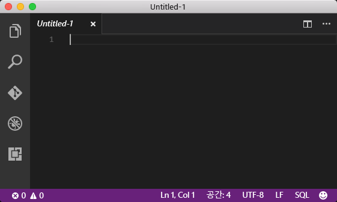
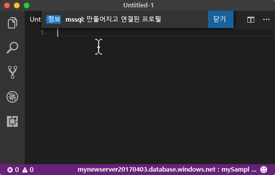
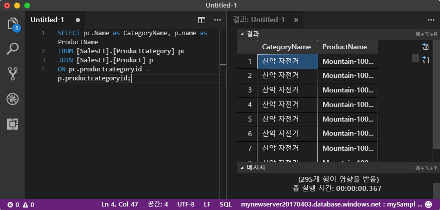

# <a name="azure-sql-database-use-visual-studio-code-to-connect-and-query-data"></a><span data-ttu-id="90691-105">Azure SQL Database: Visual Studio Code를 사용하여 데이터에 연결 및 쿼리</span><span class="sxs-lookup"><span data-stu-id="90691-105">Azure SQL Database: Use Visual Studio Code to connect and query data</span></span>

<span data-ttu-id="90691-106">[Visual Studio Code](https://code.visualstudio.com/docs)는 Microsoft SQL Server, Azure SQL Database 및 SQL Data Warehouse를 쿼리하는 [mssql 확장](https://aka.ms/mssql-marketplace)을 비롯한 여러 확장을 지원하는 Linux, macOS, Windows용 그래픽 코드 편집기입니다.</span><span class="sxs-lookup"><span data-stu-id="90691-106">[Visual Studio Code](https://code.visualstudio.com/docs) is a graphical code editor for Linux, macOS, and Windows that supports extensions, including the [mssql extension](https://aka.ms/mssql-marketplace) for querying Microsoft SQL Server, Azure SQL Database, and SQL Data Warehouse.</span></span> <span data-ttu-id="90691-107">이 빠른 시작은 Visual Studio 코드를 사용하여 Azure SQL Database에 연결한 후 Transact-SQL 문을 사용하여 데이터베이스에서 데이터를 쿼리, 삽입, 업데이트 및 삭제하는 방법을 보여 줍니다.</span><span class="sxs-lookup"><span data-stu-id="90691-107">This quick start demonstrates how to use Visual Studio Code to connect to an Azure SQL database, and then use Transact-SQL statements to query, insert, update, and delete data in the database.</span></span>

## <a name="prerequisites"></a><span data-ttu-id="90691-108">필수 조건</span><span class="sxs-lookup"><span data-stu-id="90691-108">Prerequisites</span></span>

<span data-ttu-id="90691-109">이 빠른 시작은 다음과 같은 빠른 시작 중 하나에서 만들어진 리소스를 시작 지점으로 사용합니다.</span><span class="sxs-lookup"><span data-stu-id="90691-109">This quick start uses as its starting point the resources created in one of these quick starts:</span></span>

- [<span data-ttu-id="90691-110">DB 만들기 - 포털</span><span class="sxs-lookup"><span data-stu-id="90691-110">Create DB - Portal</span></span>](sql-database-get-started-portal.md)
- [<span data-ttu-id="90691-111">DB 만들기 - CLI</span><span class="sxs-lookup"><span data-stu-id="90691-111">Create DB - CLI</span></span>](sql-database-get-started-cli.md)
- [<span data-ttu-id="90691-112">DB 만들기 - PowerShell</span><span class="sxs-lookup"><span data-stu-id="90691-112">Create DB - PowerShell</span></span>](sql-database-get-started-powershell.md)

<span data-ttu-id="90691-113">시작하기 전에 최신 버전의 [Visual Studio Code](https://code.visualstudio.com/Download)를 설치하고 했는지 [mssql 확장](https://aka.ms/mssql-marketplace)을 로드했는지 확인합니다.</span><span class="sxs-lookup"><span data-stu-id="90691-113">Before you start, make sure you have installed the newest version of [Visual Studio Code](https://code.visualstudio.com/Download) and loaded the [mssql extension](https://aka.ms/mssql-marketplace).</span></span> <span data-ttu-id="90691-114">mssql 확장에 대한 설치 지침은 [VS Code 설치](https://docs.microsoft.com/sql/linux/sql-server-linux-develop-use-vscode#install-vs-code) 및 [Visual Studio Code용 mssql](https://marketplace.visualstudio.com/items?itemName=ms-mssql.mssql)을 참조하세요.</span><span class="sxs-lookup"><span data-stu-id="90691-114">For installation guidance for the mssql extension, see [Install VS Code](https://docs.microsoft.com/sql/linux/sql-server-linux-develop-use-vscode#install-vs-code) and see [mssql for Visual Studio Code](https://marketplace.visualstudio.com/items?itemName=ms-mssql.mssql).</span></span> 

## <a name="configure-vs-code"></a><span data-ttu-id="90691-115">VS 코드 구성</span><span class="sxs-lookup"><span data-stu-id="90691-115">Configure VS Code</span></span> 

### <a name="mac-os"></a><span data-ttu-id="90691-116">**Mac OS**</span><span class="sxs-lookup"><span data-stu-id="90691-116">**Mac OS**</span></span>
<span data-ttu-id="90691-117">macOS의 경우 mssql 확장에서 사용하는 DotNet Core에 대한 필수 구성 요소인 OpenSSL을 설치해야 합니다.</span><span class="sxs-lookup"><span data-stu-id="90691-117">For macOS, you need to install OpenSSL which is a prerequiste for DotNet Core that mssql extention uses.</span></span> <span data-ttu-id="90691-118">터미널을 열고 다음 명령을 입력하여 **brew** 및 **OpenSSL**을 설치합니다.</span><span class="sxs-lookup"><span data-stu-id="90691-118">Open your terminal and enter the following commands to install **brew** and **OpenSSL**.</span></span> 

```bash
ruby -e "$(curl -fsSL https://raw.githubusercontent.com/Homebrew/install/master/install)"
brew update
brew install openssl
mkdir -p /usr/local/lib
ln -s /usr/local/opt/openssl/lib/libcrypto.1.0.0.dylib /usr/local/lib/
ln -s /usr/local/opt/openssl/lib/libssl.1.0.0.dylib /usr/local/lib/
```

### <a name="linux-ubuntu"></a><span data-ttu-id="90691-119">**Linux(Ubuntu)**</span><span class="sxs-lookup"><span data-stu-id="90691-119">**Linux (Ubuntu)**</span></span>

<span data-ttu-id="90691-120">특별한 구성이 필요 없습니다.</span><span class="sxs-lookup"><span data-stu-id="90691-120">No special configuration needed.</span></span>

### <a name="windows"></a><span data-ttu-id="90691-121">**Windows**</span><span class="sxs-lookup"><span data-stu-id="90691-121">**Windows**</span></span>

<span data-ttu-id="90691-122">특별한 구성이 필요 없습니다.</span><span class="sxs-lookup"><span data-stu-id="90691-122">No special configuration needed.</span></span>

## <a name="sql-server-connection-information"></a><span data-ttu-id="90691-123">SQL 서버 연결 정보</span><span class="sxs-lookup"><span data-stu-id="90691-123">SQL server connection information</span></span>

<span data-ttu-id="90691-124">Azure SQL Database에 연결하는 데 필요한 연결 정보를 가져옵니다.</span><span class="sxs-lookup"><span data-stu-id="90691-124">Get the connection information needed to connect to the Azure SQL database.</span></span> <span data-ttu-id="90691-125">다음 절차에는 정규화된 서버 이름, 데이터베이스 이름 및 로그인 정보가 필요합니다.</span><span class="sxs-lookup"><span data-stu-id="90691-125">You will need the fully qualified server name, database name, and login information in the next procedures.</span></span>

1. <span data-ttu-id="90691-126">[Azure Portal](https://portal.azure.com/)에 로그인합니다.</span><span class="sxs-lookup"><span data-stu-id="90691-126">Log in to the [Azure portal](https://portal.azure.com/).</span></span>
2. <span data-ttu-id="90691-127">왼쪽 메뉴에서 **SQL Database**를 선택하고 **SQL Database** 페이지에서 데이터베이스를 클릭합니다.</span><span class="sxs-lookup"><span data-stu-id="90691-127">Select **SQL Databases** from the left-hand menu, and click your database on the **SQL databases** page.</span></span> 
3. <span data-ttu-id="90691-128">데이터베이스의 **개요** 페이지에서 다음 이미지와 같이 정규화된 서버 이름을 검토합니다.</span><span class="sxs-lookup"><span data-stu-id="90691-128">On the **Overview** page for your database, review the fully qualified server name as shown in the following image.</span></span> <span data-ttu-id="90691-129">서버 이름 위로 마우스를 가져가면 **복사하려면 클릭** 옵션이 표시됩니다.</span><span class="sxs-lookup"><span data-stu-id="90691-129">You can hover over the server name to bring up the **Click to copy** option.</span></span>

    

4. <span data-ttu-id="90691-131">Azure SQL Database 서버의 로그인 정보를 잊어버린 경우 SQL Database 서버 페이지로 이동하여 서버 관리자 이름을 확인하고 필요한 경우 암호를 다시 설정합니다.</span><span class="sxs-lookup"><span data-stu-id="90691-131">If you have forgotten the login information for your Azure SQL Database server, navigate to the SQL Database server page to view the server admin name and, if necessary, reset the password.</span></span> 

## <a name="set-language-mode-to-sql"></a><span data-ttu-id="90691-132">언어 모드를 SQL로 설정</span><span class="sxs-lookup"><span data-stu-id="90691-132">Set language mode to SQL</span></span>

<span data-ttu-id="90691-133">Visual Studio Code에서 언어 모드를 **SQL**로 설정하여 mssql 명령 및 T-SQL IntelliSense를 사용하도록 설정합니다.</span><span class="sxs-lookup"><span data-stu-id="90691-133">Set the language mode is set to **SQL** in Visual Studio Code to enable mssql commands and T-SQL IntelliSense.</span></span>

1. <span data-ttu-id="90691-134">새 Visual Studio Code 창을 엽니다.</span><span class="sxs-lookup"><span data-stu-id="90691-134">Open a new Visual Studio Code window.</span></span> 

2. <span data-ttu-id="90691-135">상태 표시줄의 오른쪽 아래 모서리에서 **일반 텍스트**를 클릭합니다.</span><span class="sxs-lookup"><span data-stu-id="90691-135">Click **Plain Text** in the lower right-hand corner of the status bar.</span></span>
3. <span data-ttu-id="90691-136">열린 **언어 선택 모드** 드롭 다운 메뉴에서 **SQL**을 입력한 다음 **ENTER** 키를 눌러서 언어 모드를 SQL로 설정합니다.</span><span class="sxs-lookup"><span data-stu-id="90691-136">In the **Select language mode** drop-down menu that opens, type **SQL**, and then press **ENTER** to set the language mode to SQL.</span></span> 

   

## <a name="connect-to-your-database"></a><span data-ttu-id="90691-138">데이터베이스 연결</span><span class="sxs-lookup"><span data-stu-id="90691-138">Connect to your database</span></span>

<span data-ttu-id="90691-139">Visual Studio Code를 사용하여 Azure SQL Database 서버에 연결합니다.</span><span class="sxs-lookup"><span data-stu-id="90691-139">Use Visual Studio Code to establish a connection to your Azure SQL Database server.</span></span>

> [!IMPORTANT]
> <span data-ttu-id="90691-140">계속하기 전에 서버, 데이터베이스 및 로그인 정보를 준비했는지 확인합니다.</span><span class="sxs-lookup"><span data-stu-id="90691-140">Before continuing, make sure that you have your server, database, and login information ready.</span></span> <span data-ttu-id="90691-141">연결 프로필 정보를 입력하기 시작하면 Visual Studio Code에서 포커스를 변경하는 경우 연결 프로필 만들기를 다시 시작해야 합니다.</span><span class="sxs-lookup"><span data-stu-id="90691-141">Once you begin entering the connection profile information, if you change your focus from Visual Studio Code, you have to restart creating the connection profile.</span></span>
>

1. <span data-ttu-id="90691-142">VS Code에서 **CTRL+SHIFT+P**(또는 **F1** 키)를 눌러서 명령 팔레트를 엽니다.</span><span class="sxs-lookup"><span data-stu-id="90691-142">In VS Code, press **CTRL+SHIFT+P** (or **F1**) to open the Command Palette.</span></span>

2. <span data-ttu-id="90691-143">**sqlcon**을 입력하고 **ENTER** 키를 누릅니다.</span><span class="sxs-lookup"><span data-stu-id="90691-143">Type **sqlcon** and press **ENTER**.</span></span>

3. <span data-ttu-id="90691-144">**ENTER** 키를 눌러서 **연결 프로필 만들기**를 선택합니다.</span><span class="sxs-lookup"><span data-stu-id="90691-144">Press **ENTER** to select **Create Connection Profile**.</span></span> <span data-ttu-id="90691-145">그러면 SQL Server 인스턴스의 연결 프로필을 만듭니다.</span><span class="sxs-lookup"><span data-stu-id="90691-145">This creates a connection profile for your SQL Server instance.</span></span>

4. <span data-ttu-id="90691-146">프롬프트에 따라 새 연결 프로필의 연결 속성을 지정합니다.</span><span class="sxs-lookup"><span data-stu-id="90691-146">Follow the prompts to specify the connection properties for the new connection profile.</span></span> <span data-ttu-id="90691-147">각 값을 지정한 후에 **ENTER** 키를 눌러서 계속합니다.</span><span class="sxs-lookup"><span data-stu-id="90691-147">After specifying each value, press **ENTER** to continue.</span></span> 

   | <span data-ttu-id="90691-148">설정</span><span class="sxs-lookup"><span data-stu-id="90691-148">Setting</span></span>       | <span data-ttu-id="90691-149">제안 값</span><span class="sxs-lookup"><span data-stu-id="90691-149">Suggested value</span></span> | <span data-ttu-id="90691-150">설명</span><span class="sxs-lookup"><span data-stu-id="90691-150">Description</span></span> |
   | ------------ | ------------------ | ------------------------------------------------- | 
   | <span data-ttu-id="90691-151">**서버 이름</span><span class="sxs-lookup"><span data-stu-id="90691-151">**Server name</span></span> | <span data-ttu-id="90691-152">정규화된 서버 이름</span><span class="sxs-lookup"><span data-stu-id="90691-152">The fully qualified server name</span></span> | <span data-ttu-id="90691-153">이름은 **mynewserver20170313.database.windows.net**과 같아야 합니다.</span><span class="sxs-lookup"><span data-stu-id="90691-153">The name should be something like this: **mynewserver20170313.database.windows.net**.</span></span> |
   | <span data-ttu-id="90691-154">**데이터베이스 이름**</span><span class="sxs-lookup"><span data-stu-id="90691-154">**Database name**</span></span> | <span data-ttu-id="90691-155">mySampleDatabase</span><span class="sxs-lookup"><span data-stu-id="90691-155">mySampleDatabase</span></span> | <span data-ttu-id="90691-156">연결할 데이터베이스의 이름입니다.</span><span class="sxs-lookup"><span data-stu-id="90691-156">The name of the database to which to connect.</span></span> |
   | <span data-ttu-id="90691-157">**인증**</span><span class="sxs-lookup"><span data-stu-id="90691-157">**Authentication**</span></span> | <span data-ttu-id="90691-158">SQL 로그인</span><span class="sxs-lookup"><span data-stu-id="90691-158">SQL Login</span></span>| <span data-ttu-id="90691-159">SQL 인증은 이 자습서에서 구성한 유일한 인증 유형입니다.</span><span class="sxs-lookup"><span data-stu-id="90691-159">SQL Authentication is the only authentication type that we have configured in this tutorial.</span></span> |
   | <span data-ttu-id="90691-160">**사용자 이름**</span><span class="sxs-lookup"><span data-stu-id="90691-160">**User name**</span></span> | <span data-ttu-id="90691-161">서버 관리자 계정</span><span class="sxs-lookup"><span data-stu-id="90691-161">The server admin account</span></span> | <span data-ttu-id="90691-162">서버를 만들 때 지정한 계정입니다.</span><span class="sxs-lookup"><span data-stu-id="90691-162">This is the account that you specified when you created the server.</span></span> |
   | <span data-ttu-id="90691-163">**암호(SQL 로그인)**</span><span class="sxs-lookup"><span data-stu-id="90691-163">**Password (SQL Login)**</span></span> | <span data-ttu-id="90691-164">서버 관리자 계정의 암호</span><span class="sxs-lookup"><span data-stu-id="90691-164">The password for your server admin account</span></span> | <span data-ttu-id="90691-165">서버를 만들 때 지정한 암호입니다.</span><span class="sxs-lookup"><span data-stu-id="90691-165">This is the password that you specified when you created the server.</span></span> |
   | <span data-ttu-id="90691-166">**암호를 저장하시겠습니까?**</span><span class="sxs-lookup"><span data-stu-id="90691-166">**Save Password?**</span></span> | <span data-ttu-id="90691-167">예 또는 아니요</span><span class="sxs-lookup"><span data-stu-id="90691-167">Yes or No</span></span> | <span data-ttu-id="90691-168">매번 암호를 입력하지 않으려면 예를 선택합니다.</span><span class="sxs-lookup"><span data-stu-id="90691-168">Select Yes if you do not want to enter the password each time.</span></span> |
   | <span data-ttu-id="90691-169">**이 프로필의 이름 입력**</span><span class="sxs-lookup"><span data-stu-id="90691-169">**Enter a name for this profile**</span></span> | <span data-ttu-id="90691-170">**mySampleDatabase**와 같은 프로필 이름</span><span class="sxs-lookup"><span data-stu-id="90691-170">A profile name, such as **mySampleDatabase**</span></span> | <span data-ttu-id="90691-171">프로필 이름을 저장할 경우 후속 로그인의 연결 속도가 빨라집니다.</span><span class="sxs-lookup"><span data-stu-id="90691-171">A saved profile name speeds your connection on subsequent logins.</span></span> | 

5. <span data-ttu-id="90691-172">**ESC** 키를 누르면 프로필을 만들고 연결하도록 사용자에게 알려 주는 정보 메시지가 닫힙니다.</span><span class="sxs-lookup"><span data-stu-id="90691-172">Press the **ESC** key to close the info message that informs you that the profile is created and connected.</span></span>

6. <span data-ttu-id="90691-173">상태 표시줄에서 연결을 확인합니다.</span><span class="sxs-lookup"><span data-stu-id="90691-173">Verify your connection in the status bar.</span></span>

   

## <a name="query-data"></a><span data-ttu-id="90691-175">쿼리 데이터</span><span class="sxs-lookup"><span data-stu-id="90691-175">Query data</span></span>

<span data-ttu-id="90691-176">다음 코드를 사용하여 [SELECT](https://msdn.microsoft.com/library/ms189499.aspx) Transact-SQL 문을 통해 범주별 상위 20개 제품을 쿼리합니다.</span><span class="sxs-lookup"><span data-stu-id="90691-176">Use the following code to query for the top 20 products by category using the [SELECT](https://msdn.microsoft.com/library/ms189499.aspx) Transact-SQL statement.</span></span>

1. <span data-ttu-id="90691-177">**편집기** 창의 빈 쿼리 창에서 다음 쿼리를 입력합니다.</span><span class="sxs-lookup"><span data-stu-id="90691-177">In the **Editor** window, enter the following query in the empty query window:</span></span>

   ```sql
   SELECT pc.Name as CategoryName, p.name as ProductName
   FROM [SalesLT].[ProductCategory] pc
   JOIN [SalesLT].[Product] p
   ON pc.productcategoryid = p.productcategoryid;
   ```

2. <span data-ttu-id="90691-178">**CTRL+SHIFT+E**를 눌러서 Product 및 ProductCategory 테이블에서 데이터를 검색합니다.</span><span class="sxs-lookup"><span data-stu-id="90691-178">Press **CTRL+SHIFT+E** to retrieve data from the Product and ProductCategory tables.</span></span>

    

## <a name="insert-data"></a><span data-ttu-id="90691-180">데이터 삽입</span><span class="sxs-lookup"><span data-stu-id="90691-180">Insert data</span></span>

<span data-ttu-id="90691-181">[INSERT](https://msdn.microsoft.com/library/ms174335.aspx) Transact-SQL 문을 사용하여 SalesLT.Product 테이블에 새 제품을 삽입하려면 다음 코드를 사용합니다.</span><span class="sxs-lookup"><span data-stu-id="90691-181">Use the following code to insert a new product into the SalesLT.Product table using the [INSERT](https://msdn.microsoft.com/library/ms174335.aspx) Transact-SQL statement.</span></span>

1. <span data-ttu-id="90691-182">**편집기** 창에서 이전 쿼리를 삭제하고 다음 쿼리를 입력합니다.</span><span class="sxs-lookup"><span data-stu-id="90691-182">In the **Editor** window, delete the previous query and enter the following query:</span></span>

   ```sql
   INSERT INTO [SalesLT].[Product]
           ( [Name]
           , [ProductNumber]
           , [Color]
           , [ProductCategoryID]
           , [StandardCost]
           , [ListPrice]
           , [SellStartDate]
           )
     VALUES
           ('myNewProduct'
           ,123456789
           ,'NewColor'
           ,1
           ,100
           ,100
           ,GETDATE() );
   ```

2. <span data-ttu-id="90691-183">**CTRL+SHIFT+E**를 눌러서 Product 테이블에서 새 행을 삽입합니다.</span><span class="sxs-lookup"><span data-stu-id="90691-183">Press **CTRL+SHIFT+E** to insert a new row in the Product table.</span></span>

## <a name="update-data"></a><span data-ttu-id="90691-184">데이터 업데이트</span><span class="sxs-lookup"><span data-stu-id="90691-184">Update data</span></span>

<span data-ttu-id="90691-185">이전에 추가한 새 제품을 [UPDATE](https://msdn.microsoft.com/library/ms177523.aspx) Transact-SQL 문을 사용하여 업데이트하려면 다음 코드를 사용합니다.</span><span class="sxs-lookup"><span data-stu-id="90691-185">Use the following code to update the new product that you previously added using the [UPDATE](https://msdn.microsoft.com/library/ms177523.aspx) Transact-SQL statement.</span></span>

1.  <span data-ttu-id="90691-186">**편집기** 창에서 이전 쿼리를 삭제하고 다음 쿼리를 입력합니다.</span><span class="sxs-lookup"><span data-stu-id="90691-186">In the **Editor** window, delete the previous query and enter the following query:</span></span>

   ```sql
   UPDATE [SalesLT].[Product]
   SET [ListPrice] = 125
   WHERE Name = 'myNewProduct';
   ```

2. <span data-ttu-id="90691-187">**CTRL+SHIFT+E**를 눌러서 Product 테이블에서 지정된 행을 업데이트합니다.</span><span class="sxs-lookup"><span data-stu-id="90691-187">Press **CTRL+SHIFT+E** to update the specified row in the Product table.</span></span>

## <a name="delete-data"></a><span data-ttu-id="90691-188">데이터 삭제</span><span class="sxs-lookup"><span data-stu-id="90691-188">Delete data</span></span>

<span data-ttu-id="90691-189">이전에 추가한 새 제품을 [DELETE](https://msdn.microsoft.com/library/ms189835.aspx) Transact-SQL 문을 사용하여 삭제하려면 다음 코드를 사용합니다.</span><span class="sxs-lookup"><span data-stu-id="90691-189">Use the following code to delete the new product that you previously added using the [DELETE](https://msdn.microsoft.com/library/ms189835.aspx) Transact-SQL statement.</span></span>

1. <span data-ttu-id="90691-190">**편집기** 창에서 이전 쿼리를 삭제하고 다음 쿼리를 입력합니다.</span><span class="sxs-lookup"><span data-stu-id="90691-190">In the **Editor** window, delete the previous query and enter the following query:</span></span>

   ```sql
   DELETE FROM [SalesLT].[Product]
   WHERE Name = 'myNewProduct';
   ```

2. <span data-ttu-id="90691-191">**CTRL+SHIFT+E**를 눌러서 Product 테이블에서 지정된 행을 삭제합니다.</span><span class="sxs-lookup"><span data-stu-id="90691-191">Press **CTRL+SHIFT+E** to delete the specified row in the Product table.</span></span>

## <a name="next-steps"></a><span data-ttu-id="90691-192">다음 단계</span><span class="sxs-lookup"><span data-stu-id="90691-192">Next steps</span></span>

- <span data-ttu-id="90691-193">SQL Server Management Studio를 사용하여 연결 및 쿼리하려면 [SSMS를 사용하여 연결 및 쿼리](sql-database-connect-query-ssms.md)를 참조하세요.</span><span class="sxs-lookup"><span data-stu-id="90691-193">To connect and query using SQL Server Management Studio, see [Connect and query with SSMS](sql-database-connect-query-ssms.md).</span></span>
- <span data-ttu-id="90691-194">Visual Studio Code를 사용하는 MSDN 잡지 문서는 [MSSQL 확장을 사용하여 데이터베이스 IDE 만들기 블로그 게시물](https://msdn.microsoft.com/magazine/mt809115)을 참조하세요.</span><span class="sxs-lookup"><span data-stu-id="90691-194">For an MSDN magazine article on using Visual Studio Code, see [Create a database IDE with MSSQL extension blog post](https://msdn.microsoft.com/magazine/mt809115).</span></span>
