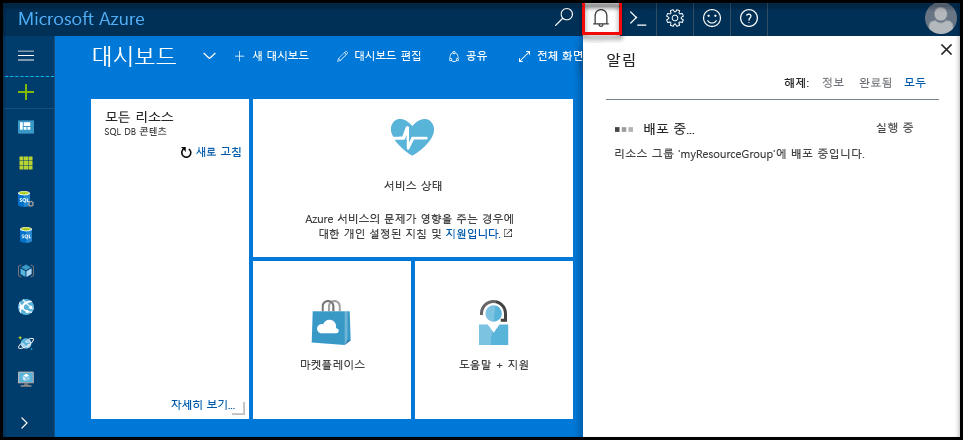
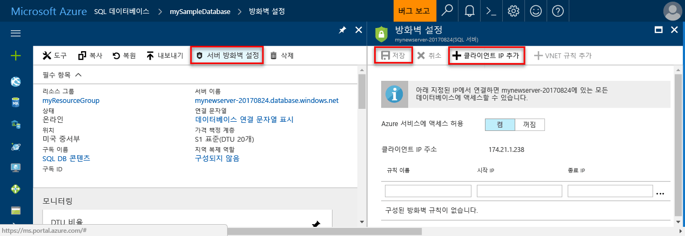
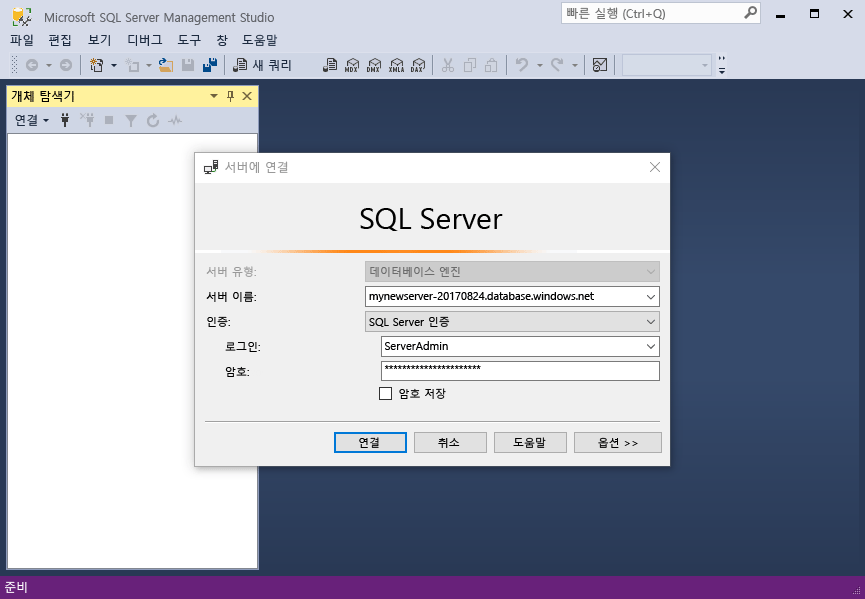
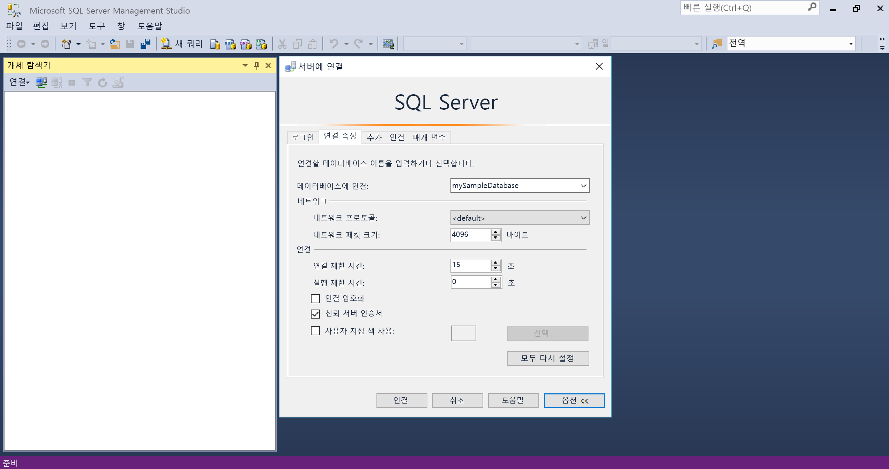
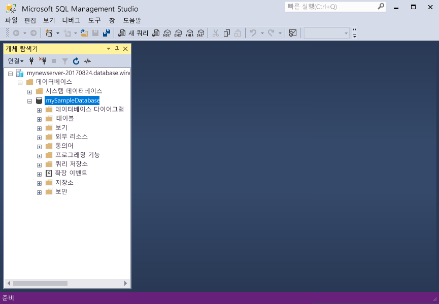

# <a name="design-your-first-azure-sql-database"></a><span data-ttu-id="57684-103">첫 번째 Azure SQL Database 디자인</span><span class="sxs-lookup"><span data-stu-id="57684-103">Design your first Azure SQL database</span></span>

<span data-ttu-id="57684-104">Azure SQL 데이터베이스는 관계형 데이터베이스-으로-a (DBaaS)의 서비스 hello Microsoft 클라우드 ("Azure").</span><span class="sxs-lookup"><span data-stu-id="57684-104">Azure SQL Database is a relational database-as-a service (DBaaS) in hello Microsoft Cloud ("Azure").</span></span> <span data-ttu-id="57684-105">이 자습서에 알아봅니다 방법을 toouse hello Azure 포털 및 [SQL Server Management Studio](https://msdn.microsoft.com/library/ms174173.aspx) (SSMS)를:</span><span class="sxs-lookup"><span data-stu-id="57684-105">In this tutorial, you learn how toouse hello Azure portal and [SQL Server Management Studio](https://msdn.microsoft.com/library/ms174173.aspx) (SSMS) to:</span></span> 

> [!div class="checklist"]
> * <span data-ttu-id="57684-106">Hello Azure 포털에서에서 데이터베이스 만들기</span><span class="sxs-lookup"><span data-stu-id="57684-106">Create a database in hello Azure portal</span></span>
> * <span data-ttu-id="57684-107">Hello Azure 포털에서에서 서버 수준 방화벽 규칙 설정</span><span class="sxs-lookup"><span data-stu-id="57684-107">Set up a server-level firewall rule in hello Azure portal</span></span>
> * <span data-ttu-id="57684-108">SSMS를 사용 하 여 toohello 데이터베이스 연결</span><span class="sxs-lookup"><span data-stu-id="57684-108">Connect toohello database with SSMS</span></span>
> * <span data-ttu-id="57684-109">SSMS를 사용하여 테이블 만들기</span><span class="sxs-lookup"><span data-stu-id="57684-109">Create tables with SSMS</span></span>
> * <span data-ttu-id="57684-110">BCP를 사용하여 데이터 대량 로드</span><span class="sxs-lookup"><span data-stu-id="57684-110">Bulk load data with BCP</span></span>
> * <span data-ttu-id="57684-111">SSMS를 사용하여 해당 데이터 쿼리</span><span class="sxs-lookup"><span data-stu-id="57684-111">Query that data with SSMS</span></span>
> * <span data-ttu-id="57684-112">이전 hello 데이터베이스 tooa 복원 [지정 시간 복원](sql-database-recovery-using-backups.md#point-in-time-restore) hello Azure 포털에서</span><span class="sxs-lookup"><span data-stu-id="57684-112">Restore hello database tooa previous [point in time restore](sql-database-recovery-using-backups.md#point-in-time-restore) in hello Azure portal</span></span>

<span data-ttu-id="57684-113">Azure 구독이 아직 없는 경우 시작하기 전에 [체험](https://azure.microsoft.com/free/) 계정을 만듭니다.</span><span class="sxs-lookup"><span data-stu-id="57684-113">If you don't have an Azure subscription, [create a free account](https://azure.microsoft.com/free/) before you begin.</span></span>

## <a name="prerequisites"></a><span data-ttu-id="57684-114">필수 조건</span><span class="sxs-lookup"><span data-stu-id="57684-114">Prerequisites</span></span>

<span data-ttu-id="57684-115">toocomplete이 자습서를 확인 되었는지 설치:</span><span class="sxs-lookup"><span data-stu-id="57684-115">toocomplete this tutorial, make sure you have installed:</span></span>
- <span data-ttu-id="57684-116">최신 버전의 hello [SQL Server Management Studio](https://msdn.microsoft.com/library/ms174173.aspx) (SSMS).</span><span class="sxs-lookup"><span data-stu-id="57684-116">hello newest version of [SQL Server Management Studio](https://msdn.microsoft.com/library/ms174173.aspx) (SSMS).</span></span>
- <span data-ttu-id="57684-117">최신 버전의 hello [BCP 및 SQLCMD](https://www.microsoft.com/download/details.aspx?id=36433)합니다.</span><span class="sxs-lookup"><span data-stu-id="57684-117">hello newest version of [BCP and SQLCMD](https://www.microsoft.com/download/details.aspx?id=36433).</span></span>

## <a name="log-in-toohello-azure-portal"></a><span data-ttu-id="57684-118">Azure 포털 toohello에 로그인</span><span class="sxs-lookup"><span data-stu-id="57684-118">Log in toohello Azure portal</span></span>

<span data-ttu-id="57684-119">Toohello 로그인 [Azure 포털](https://portal.azure.com/)합니다.</span><span class="sxs-lookup"><span data-stu-id="57684-119">Log in toohello [Azure portal](https://portal.azure.com/).</span></span>

## <a name="create-a-blank-sql-database"></a><span data-ttu-id="57684-120">빈 SQL 데이터베이스 만들기</span><span class="sxs-lookup"><span data-stu-id="57684-120">Create a blank SQL database</span></span>

<span data-ttu-id="57684-121">Azure SQL Database는 일련의 정의된 [계산 및 저장소 리소스](sql-database-service-tiers.md)를 사용하여 만들어집니다.</span><span class="sxs-lookup"><span data-stu-id="57684-121">An Azure SQL database is created with a defined set of [compute and storage resources](sql-database-service-tiers.md).</span></span> <span data-ttu-id="57684-122">hello 데이터베이스 내에서 만들어집니다는 [Azure 리소스 그룹](../azure-resource-manager/resource-group-overview.md) 및는 [Azure SQL 데이터베이스 논리 서버](sql-database-features.md)합니다.</span><span class="sxs-lookup"><span data-stu-id="57684-122">hello database is created within an [Azure resource group](../azure-resource-manager/resource-group-overview.md) and in an [Azure SQL Database logical server](sql-database-features.md).</span></span> 

<span data-ttu-id="57684-123">이러한 단계 toocreate 빈 SQL 데이터베이스를 따릅니다.</span><span class="sxs-lookup"><span data-stu-id="57684-123">Follow these steps toocreate a blank SQL database.</span></span> 

1. <span data-ttu-id="57684-124">Hello 클릭 **새로** 단추 hello 왼쪽 위 모서리의 hello Azure 포털에서 찾을 수 있습니다.</span><span class="sxs-lookup"><span data-stu-id="57684-124">Click hello **New** button found on hello upper left-hand corner of hello Azure portal.</span></span>

2. <span data-ttu-id="57684-125">선택 **데이터베이스** hello에서 **새로** 선택한 페이지 **SQL 데이터베이스** hello에서 **데이터베이스** 페이지.</span><span class="sxs-lookup"><span data-stu-id="57684-125">Select **Databases** from hello **New** page, and select **SQL Database** from hello **Databases** page.</span></span> 

   

3. <span data-ttu-id="57684-127">Hello 이미지 앞에 표시 된 대로 hello SQL 데이터베이스에 대 한 양식을 사용 hello 다음 정보를 입력 합니다.</span><span class="sxs-lookup"><span data-stu-id="57684-127">Fill out hello SQL Database form with hello following information, as shown on hello preceding image:</span></span>   

   | <span data-ttu-id="57684-128">설정</span><span class="sxs-lookup"><span data-stu-id="57684-128">Setting</span></span>       | <span data-ttu-id="57684-129">제안 값</span><span class="sxs-lookup"><span data-stu-id="57684-129">Suggested value</span></span> | <span data-ttu-id="57684-130">설명</span><span class="sxs-lookup"><span data-stu-id="57684-130">Description</span></span> | 
   | ------------ | ------------------ | ------------------------------------------------- | 
   | <span data-ttu-id="57684-131">**데이터베이스 이름**</span><span class="sxs-lookup"><span data-stu-id="57684-131">**Database name**</span></span> | <span data-ttu-id="57684-132">mySampleDatabase</span><span class="sxs-lookup"><span data-stu-id="57684-132">mySampleDatabase</span></span> | <span data-ttu-id="57684-133">유효한 데이터베이스 이름은 [데이터베이스 식별자](https://docs.microsoft.com/sql/relational-databases/databases/database-identifiers)를 참조하세요.</span><span class="sxs-lookup"><span data-stu-id="57684-133">For valid database names, see [Database Identifiers](https://docs.microsoft.com/sql/relational-databases/databases/database-identifiers).</span></span> | 
   | <span data-ttu-id="57684-134">**구독**</span><span class="sxs-lookup"><span data-stu-id="57684-134">**Subscription**</span></span> | <span data-ttu-id="57684-135">사용자의 구독</span><span class="sxs-lookup"><span data-stu-id="57684-135">Your subscription</span></span>  | <span data-ttu-id="57684-136">구독에 대한 자세한 내용은 [구독](https://account.windowsazure.com/Subscriptions)을 참조하세요.</span><span class="sxs-lookup"><span data-stu-id="57684-136">For details about your subscriptions, see [Subscriptions](https://account.windowsazure.com/Subscriptions).</span></span> |
   | <span data-ttu-id="57684-137">**리소스 그룹**</span><span class="sxs-lookup"><span data-stu-id="57684-137">**Resource group**</span></span> | <span data-ttu-id="57684-138">myResourceGroup</span><span class="sxs-lookup"><span data-stu-id="57684-138">myResourceGroup</span></span> | <span data-ttu-id="57684-139">유효한 리소스 그룹 이름은 [명명 규칙 및 제한 사항](https://docs.microsoft.com/azure/architecture/best-practices/naming-conventions)을 참조하세요.</span><span class="sxs-lookup"><span data-stu-id="57684-139">For valid resource group names, see [Naming rules and restrictions](https://docs.microsoft.com/azure/architecture/best-practices/naming-conventions).</span></span> |
   | <span data-ttu-id="57684-140">**원본 선택**</span><span class="sxs-lookup"><span data-stu-id="57684-140">**Select source**</span></span> | <span data-ttu-id="57684-141">빈 데이터베이스</span><span class="sxs-lookup"><span data-stu-id="57684-141">Blank database</span></span> | <span data-ttu-id="57684-142">빈 데이터베이스를 만들도록 지정합니다.</span><span class="sxs-lookup"><span data-stu-id="57684-142">Specifies that a blank database should be created.</span></span> |

4. <span data-ttu-id="57684-143">클릭 **서버** toocreate 하 고 새 데이터베이스에 대 한 새 서버를 구성 합니다.</span><span class="sxs-lookup"><span data-stu-id="57684-143">Click **Server** toocreate and configure a new server for your new database.</span></span> <span data-ttu-id="57684-144">Hello 채울 **새 폼 서버** hello 다음 정보로:</span><span class="sxs-lookup"><span data-stu-id="57684-144">Fill out hello **New server form** with hello following information:</span></span> 

   | <span data-ttu-id="57684-145">설정</span><span class="sxs-lookup"><span data-stu-id="57684-145">Setting</span></span>       | <span data-ttu-id="57684-146">제안 값</span><span class="sxs-lookup"><span data-stu-id="57684-146">Suggested value</span></span> | <span data-ttu-id="57684-147">설명</span><span class="sxs-lookup"><span data-stu-id="57684-147">Description</span></span> | 
   | ------------ | ------------------ | ------------------------------------------------- | 
   | <span data-ttu-id="57684-148">**서버 이름**</span><span class="sxs-lookup"><span data-stu-id="57684-148">**Server name**</span></span> | <span data-ttu-id="57684-149">전역적으로 고유한 이름</span><span class="sxs-lookup"><span data-stu-id="57684-149">Any globally unique name</span></span> | <span data-ttu-id="57684-150">유효한 서버 이름은 [명명 규칙 및 제한 사항](https://docs.microsoft.com/azure/architecture/best-practices/naming-conventions)을 참조하세요.</span><span class="sxs-lookup"><span data-stu-id="57684-150">For valid server names, see [Naming rules and restrictions](https://docs.microsoft.com/azure/architecture/best-practices/naming-conventions).</span></span> | 
   | <span data-ttu-id="57684-151">**서버 관리자 로그인**</span><span class="sxs-lookup"><span data-stu-id="57684-151">**Server admin login**</span></span> | <span data-ttu-id="57684-152">모든 유효한 이름</span><span class="sxs-lookup"><span data-stu-id="57684-152">Any valid name</span></span> | <span data-ttu-id="57684-153">유효한 로그인 이름은 [데이터베이스 식별자](https://docs.microsoft.com/sql/relational-databases/databases/database-identifiers)를 참조하세요.</span><span class="sxs-lookup"><span data-stu-id="57684-153">For valid login names, see [Database Identifiers](https://docs.microsoft.com/sql/relational-databases/databases/database-identifiers).</span></span>|
   | <span data-ttu-id="57684-154">**암호**</span><span class="sxs-lookup"><span data-stu-id="57684-154">**Password**</span></span> | <span data-ttu-id="57684-155">유효한 암호</span><span class="sxs-lookup"><span data-stu-id="57684-155">Any valid password</span></span> | <span data-ttu-id="57684-156">암호가 8 자 이상 있어야 하며 hello 다음 범주 중 세 범주의 문자를 포함 해야 합니다: 대문자, 소문자, 숫자 및 영숫자가 아닌 문자.</span><span class="sxs-lookup"><span data-stu-id="57684-156">Your password must have at least 8 characters and must contain characters from three of hello following categories: upper case characters, lower case characters, numbers, and non-alphanumeric characters.</span></span> |
   | <span data-ttu-id="57684-157">**위치**:</span><span class="sxs-lookup"><span data-stu-id="57684-157">**Location**</span></span> | <span data-ttu-id="57684-158">모든 유효한 위치</span><span class="sxs-lookup"><span data-stu-id="57684-158">Any valid location</span></span> | <span data-ttu-id="57684-159">지역에 대한 자세한 내용은 [Azure 지역](https://azure.microsoft.com/regions/)을 참조하세요.</span><span class="sxs-lookup"><span data-stu-id="57684-159">For information about regions, see [Azure Regions](https://azure.microsoft.com/regions/).</span></span> |

   

5. <span data-ttu-id="57684-161">**선택**을 클릭합니다.</span><span class="sxs-lookup"><span data-stu-id="57684-161">Click **Select**.</span></span>

6. <span data-ttu-id="57684-162">클릭 **가격 책정 계층** toospecify hello 서비스 계층과 성능 수준을 새 데이터베이스에 대 한 합니다.</span><span class="sxs-lookup"><span data-stu-id="57684-162">Click **Pricing tier** toospecify hello service tier and performance level for your new database.</span></span> <span data-ttu-id="57684-163">이 자습서에서는 **20 DTU** 및 **250**GB의 저장소를 선택합니다.</span><span class="sxs-lookup"><span data-stu-id="57684-163">For this tutorial, select **20 DTUs** and **250** GB of storage.</span></span>

   

7. <span data-ttu-id="57684-165">**Apply**를 클릭합니다.</span><span class="sxs-lookup"><span data-stu-id="57684-165">Click **Apply**.</span></span>  

8. <span data-ttu-id="57684-166">선택 된 **데이터 정렬** hello 빈 데이터베이스에 대 한 (이 자습서에서는 hello 기본값 사용).</span><span class="sxs-lookup"><span data-stu-id="57684-166">Select a **collation** for hello blank database (for this tutorial, use hello default value).</span></span> <span data-ttu-id="57684-167">데이터 정렬에 대한 자세한 내용은 [데이터 정렬](https://docs.microsoft.com/sql/t-sql/statements/collations)을 참조하세요.</span><span class="sxs-lookup"><span data-stu-id="57684-167">For more information about collations, see [Collations](https://docs.microsoft.com/sql/t-sql/statements/collations)</span></span>

9. <span data-ttu-id="57684-168">클릭 **만들기** tooprovision hello 데이터베이스입니다.</span><span class="sxs-lookup"><span data-stu-id="57684-168">Click **Create** tooprovision hello database.</span></span> <span data-ttu-id="57684-169">하나 있으며 toocomplete에 대 한 프로 비전 합니다.</span><span class="sxs-lookup"><span data-stu-id="57684-169">Provisioning takes about a minute and a half toocomplete.</span></span> 

10. <span data-ttu-id="57684-170">Hello 도구 모음에서 **알림** toomonitor hello 배포 프로세스입니다.</span><span class="sxs-lookup"><span data-stu-id="57684-170">On hello toolbar, click **Notifications** toomonitor hello deployment process.</span></span>

   

## <a name="create-a-server-level-firewall-rule"></a><span data-ttu-id="57684-172">서버 수준 방화벽 규칙 만들기</span><span class="sxs-lookup"><span data-stu-id="57684-172">Create a server-level firewall rule</span></span>

<span data-ttu-id="57684-173">hello SQL 데이터베이스 서비스는 hello 서버 수준 방화벽 규칙은 특정 IP 주소에 대 한 tooopen hello 방화벽을 만들지 않은 toohello 서버나 hello 서버에 있는 모든 데이터베이스를 연결 하지 못하도록 외부 응용 프로그램 및 도구를 방지 하에 방화벽을 만듭니다.</span><span class="sxs-lookup"><span data-stu-id="57684-173">hello SQL Database service creates a firewall at hello server-level that prevents external applications and tools from connecting toohello server or any databases on hello server unless a firewall rule is created tooopen hello firewall for specific IP addresses.</span></span> <span data-ttu-id="57684-174">이러한 단계 toocreate에 따라 한 [SQL 데이터베이스 서버 수준 방화벽 규칙](sql-database-firewall-configure.md) 클라이언트의 IP 주소에 대 한 사용자만 IP 주소에 대 한 hello SQL 데이터베이스 방화벽을 통해 외부 연결을 사용 하도록 설정 합니다.</span><span class="sxs-lookup"><span data-stu-id="57684-174">Follow these steps toocreate a [SQL Database server-level firewall rule](sql-database-firewall-configure.md) for your client's IP address and enable external connectivity through hello SQL Database firewall for your IP address only.</span></span> 

> [!NOTE]
> <span data-ttu-id="57684-175">SQL Database는 포트 1433을 통해 통신합니다.</span><span class="sxs-lookup"><span data-stu-id="57684-175">SQL Database communicates over port 1433.</span></span> <span data-ttu-id="57684-176">회사 네트워크 내부에서 tooconnect을 시도 하는 포트 1433 통한 아웃 바운드 트래픽 네트워크의 방화벽에서 허용 되지 않을 수 있습니다.</span><span class="sxs-lookup"><span data-stu-id="57684-176">If you are trying tooconnect from within a corporate network, outbound traffic over port 1433 may not be allowed by your network's firewall.</span></span> <span data-ttu-id="57684-177">이 경우에 IT 부서는 포트 1433을 엽니다 하지 않는 한 tooyour Azure SQL 데이터베이스 서버를 연결할 수 없습니다.</span><span class="sxs-lookup"><span data-stu-id="57684-177">If so, you cannot connect tooyour Azure SQL Database server unless your IT department opens port 1433.</span></span>
>

1. <span data-ttu-id="57684-178">Hello 배포가 완료 된 후 클릭 **SQL 데이터베이스** hello 왼쪽 메뉴에서 **mySampleDatabase** hello에 **SQL 데이터베이스** 페이지.</span><span class="sxs-lookup"><span data-stu-id="57684-178">After hello deployment completes, click **SQL databases** from hello left-hand menu and then click **mySampleDatabase** on hello **SQL databases** page.</span></span> <span data-ttu-id="57684-179">hello 완벽 하 게 hello 보여 주는 데이터베이스 열리면 프로그램에 대 한 개요 페이지에 정규화 된 서버 이름 (예: **mynewserver20170313.database.windows.net**) 하 고 더 이상의 구성에 대 한 옵션을 제공 합니다.</span><span class="sxs-lookup"><span data-stu-id="57684-179">hello overview page for your database opens, showing you hello fully qualified server name (such as **mynewserver20170313.database.windows.net**) and provides options for further configuration.</span></span> <span data-ttu-id="57684-180">나중에 사용하기 위해 이 정규화된 서버 이름을 복사합니다.</span><span class="sxs-lookup"><span data-stu-id="57684-180">Copy this fully qualified server name for use later.</span></span>

   > [!IMPORTANT]
   > <span data-ttu-id="57684-181">이 정규화 된 서버 이름 tooconnect tooyour 서버와 데이터베이스의 후속 빠른 시작 해야합니다.</span><span class="sxs-lookup"><span data-stu-id="57684-181">You need this fully qualified server name tooconnect tooyour server and its databases in subsequent quick starts.</span></span>
   > 

    

2. <span data-ttu-id="57684-183">클릭 **서버 방화벽 설정** hello 이전 그림에 나와 있는 것 처럼 hello 도구 모음입니다.</span><span class="sxs-lookup"><span data-stu-id="57684-183">Click **Set server firewall** on hello toolbar as shown in hello previous image.</span></span> <span data-ttu-id="57684-184">hello **방화벽 설정** hello SQL 데이터베이스 서버에 대 한 페이지가 열립니다.</span><span class="sxs-lookup"><span data-stu-id="57684-184">hello **Firewall settings** page for hello SQL Database server opens.</span></span> 

    


3. <span data-ttu-id="57684-186">클릭 **클라이언트 IP 추가** hello 도구 모음 tooadd에 현재 IP 주소 tooa 새 방화벽 규칙입니다.</span><span class="sxs-lookup"><span data-stu-id="57684-186">Click **Add client IP** on hello toolbar tooadd your current IP address tooa new firewall rule.</span></span> <span data-ttu-id="57684-187">방화벽 규칙은 단일 IP 주소 또는 IP 주소의 범위에 1433 포트를 열 수 있습니다.</span><span class="sxs-lookup"><span data-stu-id="57684-187">A firewall rule can open port 1433 for a single IP address or a range of IP addresses.</span></span>

4. <span data-ttu-id="57684-188">**Save**를 클릭합니다.</span><span class="sxs-lookup"><span data-stu-id="57684-188">Click **Save**.</span></span> <span data-ttu-id="57684-189">서버 수준 방화벽 규칙 hello 논리 서버에 포트 1433을 열지 현재 IP 주소에 대해 만들어집니다.</span><span class="sxs-lookup"><span data-stu-id="57684-189">A server-level firewall rule is created for your current IP address opening port 1433 on hello logical server.</span></span>

    

4. <span data-ttu-id="57684-191">클릭 **확인** hello 다음 닫고 **방화벽 설정** 페이지.</span><span class="sxs-lookup"><span data-stu-id="57684-191">Click **OK** and then close hello **Firewall settings** page.</span></span>

<span data-ttu-id="57684-192">Toohello SQL 데이터베이스 서버와 SQL Server Management Studio 또는 이전에 만든 hello 서버 관리자 계정을 사용 하 여이 IP 주소에서 선택한 다른 도구를 사용 하 여 데이터베이스를 연결할 수 있습니다.</span><span class="sxs-lookup"><span data-stu-id="57684-192">You can now connect toohello SQL Database server and its databases using SQL Server Management Studio or another tool of your choice from this IP address using hello server admin account created previously.</span></span>

> [!IMPORTANT]
> <span data-ttu-id="57684-193">기본적으로 액세스 hello SQL 데이터베이스 방화벽을 통해 모든 Azure 서비스에 대해 사용 됩니다.</span><span class="sxs-lookup"><span data-stu-id="57684-193">By default, access through hello SQL Database firewall is enabled for all Azure services.</span></span> <span data-ttu-id="57684-194">클릭 **OFF** 모든 Azure 서비스에 대 한이 페이지 toodisable에 있습니다.</span><span class="sxs-lookup"><span data-stu-id="57684-194">Click **OFF** on this page toodisable for all Azure services.</span></span>

## <a name="sql-server-connection-information"></a><span data-ttu-id="57684-195">SQL 서버 연결 정보</span><span class="sxs-lookup"><span data-stu-id="57684-195">SQL server connection information</span></span>

<span data-ttu-id="57684-196">Hello Azure 포털에서에서 Azure SQL 데이터베이스 서버에 대 한 정규화 된 서버 이름을 hello를 가져옵니다.</span><span class="sxs-lookup"><span data-stu-id="57684-196">Get hello fully qualified server name for your Azure SQL Database server in hello Azure portal.</span></span> <span data-ttu-id="57684-197">SQL Server Management Studio를 사용 하 여 hello 정규화 된 서버 이름 tooconnect tooyour 서버를 사용 합니다.</span><span class="sxs-lookup"><span data-stu-id="57684-197">You use hello fully qualified server name tooconnect tooyour server using SQL Server Management Studio.</span></span>

1. <span data-ttu-id="57684-198">Toohello 로그인 [Azure 포털](https://portal.azure.com/)합니다.</span><span class="sxs-lookup"><span data-stu-id="57684-198">Log in toohello [Azure portal](https://portal.azure.com/).</span></span>
2. <span data-ttu-id="57684-199">선택 **SQL 데이터베이스** hello 왼쪽 메뉴에서 hello에 데이터베이스를 클릭 하 고 **SQL 데이터베이스** 페이지.</span><span class="sxs-lookup"><span data-stu-id="57684-199">Select **SQL Databases** from hello left-hand menu, and click your database on hello **SQL databases** page.</span></span> 
3. <span data-ttu-id="57684-200">Hello에 **Essentials** hello 프로그램 데이터베이스에 대 한 Azure 포털 페이지의에서 창 찾아 다음 hello 복사 **서버 이름**합니다.</span><span class="sxs-lookup"><span data-stu-id="57684-200">In hello **Essentials** pane in hello Azure portal page for your database, locate and then copy hello **Server name**.</span></span>

   

## <a name="connect-toohello-database-with-ssms"></a><span data-ttu-id="57684-202">SSMS를 사용 하 여 toohello 데이터베이스 연결</span><span class="sxs-lookup"><span data-stu-id="57684-202">Connect toohello database with SSMS</span></span>

<span data-ttu-id="57684-203">사용 하 여 [SQL Server Management Studio](https://docs.microsoft.com/sql/ssms/sql-server-management-studio-ssms) tooestablish 연결 tooyour Azure SQL 데이터베이스 서버입니다.</span><span class="sxs-lookup"><span data-stu-id="57684-203">Use [SQL Server Management Studio](https://docs.microsoft.com/sql/ssms/sql-server-management-studio-ssms) tooestablish a connection tooyour Azure SQL Database server.</span></span>

1. <span data-ttu-id="57684-204">SQL Server Management Studio를 엽니다.</span><span class="sxs-lookup"><span data-stu-id="57684-204">Open SQL Server Management Studio.</span></span>

2. <span data-ttu-id="57684-205">Hello에 **tooServer 연결** 대화 상자에 hello 다음 정보를 입력 합니다.</span><span class="sxs-lookup"><span data-stu-id="57684-205">In hello **Connect tooServer** dialog box, enter hello following information:</span></span>

   | <span data-ttu-id="57684-206">설정</span><span class="sxs-lookup"><span data-stu-id="57684-206">Setting</span></span>       | <span data-ttu-id="57684-207">제안 값</span><span class="sxs-lookup"><span data-stu-id="57684-207">Suggested value</span></span> | <span data-ttu-id="57684-208">설명</span><span class="sxs-lookup"><span data-stu-id="57684-208">Description</span></span> | 
   | ------------ | ------------------ | ------------------------------------------------- | 
   | <span data-ttu-id="57684-209">서버 유형</span><span class="sxs-lookup"><span data-stu-id="57684-209">Server type</span></span> | <span data-ttu-id="57684-210">데이터베이스 엔진</span><span class="sxs-lookup"><span data-stu-id="57684-210">Database engine</span></span> | <span data-ttu-id="57684-211">이 값은 필수입니다.</span><span class="sxs-lookup"><span data-stu-id="57684-211">This value is required</span></span> |
   | <span data-ttu-id="57684-212">서버 이름</span><span class="sxs-lookup"><span data-stu-id="57684-212">Server name</span></span> | <span data-ttu-id="57684-213">hello 정규화 된 서버 이름</span><span class="sxs-lookup"><span data-stu-id="57684-213">hello fully qualified server name</span></span> | <span data-ttu-id="57684-214">hello 이름은 해야 다음과 같이: **mynewserver20170313.database.windows.net**합니다.</span><span class="sxs-lookup"><span data-stu-id="57684-214">hello name should be something like this: **mynewserver20170313.database.windows.net**.</span></span> |
   | <span data-ttu-id="57684-215">인증</span><span class="sxs-lookup"><span data-stu-id="57684-215">Authentication</span></span> | <span data-ttu-id="57684-216">SQL Server 인증</span><span class="sxs-lookup"><span data-stu-id="57684-216">SQL Server Authentication</span></span> | <span data-ttu-id="57684-217">SQL 인증에는이 자습서에서는 구성 hello 유일한 인증 유형입니다.</span><span class="sxs-lookup"><span data-stu-id="57684-217">SQL Authentication is hello only authentication type that we have configured in this tutorial.</span></span> |
   | <span data-ttu-id="57684-218">로그인</span><span class="sxs-lookup"><span data-stu-id="57684-218">Login</span></span> | <span data-ttu-id="57684-219">hello 서버 관리자 계정</span><span class="sxs-lookup"><span data-stu-id="57684-219">hello server admin account</span></span> | <span data-ttu-id="57684-220">Hello 서버를 만들 때 지정한 hello 계정입니다.</span><span class="sxs-lookup"><span data-stu-id="57684-220">This is hello account that you specified when you created hello server.</span></span> |
   | <span data-ttu-id="57684-221">암호</span><span class="sxs-lookup"><span data-stu-id="57684-221">Password</span></span> | <span data-ttu-id="57684-222">서버 관리자 계정에 대 한 hello 암호</span><span class="sxs-lookup"><span data-stu-id="57684-222">hello password for your server admin account</span></span> | <span data-ttu-id="57684-223">이 hello 암호 hello 서버를 만들 때 지정한입니다.</span><span class="sxs-lookup"><span data-stu-id="57684-223">This is hello password that you specified when you created hello server.</span></span> |

   

3. <span data-ttu-id="57684-225">클릭 **옵션** hello에 **tooserver 연결** 대화 상자.</span><span class="sxs-lookup"><span data-stu-id="57684-225">Click **Options** in hello **Connect tooserver** dialog box.</span></span> <span data-ttu-id="57684-226">Hello에 **toodatabase 연결** 섹션에서 입력 **mySampleDatabase** tooconnect toothis 데이터베이스입니다.</span><span class="sxs-lookup"><span data-stu-id="57684-226">In hello **Connect toodatabase** section, enter **mySampleDatabase** tooconnect toothis database.</span></span>

     

4. <span data-ttu-id="57684-228">**Connect**를 클릭합니다.</span><span class="sxs-lookup"><span data-stu-id="57684-228">Click **Connect**.</span></span> <span data-ttu-id="57684-229">SSMS에서 hello 개체 탐색기 창이 열립니다.</span><span class="sxs-lookup"><span data-stu-id="57684-229">hello Object Explorer window opens in SSMS.</span></span> 

5. <span data-ttu-id="57684-230">개체 탐색기에서 확장 **데이터베이스** 펼친 다음 **mySampleDatabase** hello 샘플 데이터베이스의 tooview hello 개체입니다.</span><span class="sxs-lookup"><span data-stu-id="57684-230">In Object Explorer, expand **Databases** and then expand **mySampleDatabase** tooview hello objects in hello sample database.</span></span>

     

## <a name="create-tables-in-hello-database"></a><span data-ttu-id="57684-232">Hello 데이터베이스에서 테이블 만들기</span><span class="sxs-lookup"><span data-stu-id="57684-232">Create tables in hello database</span></span> 

<span data-ttu-id="57684-233">[Transact-SQL](https://docs.microsoft.com/sql/t-sql/language-reference)을 사용하여 대학의 학생 관리 시스템을 모델링하는 네 개의 테이블이 있는 데이터베이스 스키마 만들기</span><span class="sxs-lookup"><span data-stu-id="57684-233">Create a database schema with four tables that model a student management system for universities using [Transact-SQL](https://docs.microsoft.com/sql/t-sql/language-reference):</span></span>

- <span data-ttu-id="57684-234">사람</span><span class="sxs-lookup"><span data-stu-id="57684-234">Person</span></span>
- <span data-ttu-id="57684-235">과정</span><span class="sxs-lookup"><span data-stu-id="57684-235">Course</span></span>
- <span data-ttu-id="57684-236">학생</span><span class="sxs-lookup"><span data-stu-id="57684-236">Student</span></span>
- <span data-ttu-id="57684-237">대학의 학생 관리 시스템을 모델링하는 크레딧</span><span class="sxs-lookup"><span data-stu-id="57684-237">Credit that model a student management system for universities</span></span>

<span data-ttu-id="57684-238">hello 다음 그림에 어떻게 이러한 테이블은 다른 관련된 tooeach 합니다.</span><span class="sxs-lookup"><span data-stu-id="57684-238">hello following diagram shows how these tables are related tooeach other.</span></span> <span data-ttu-id="57684-239">이러한 테이블 중 일부는 다른 테이블의 열을 참조합니다.</span><span class="sxs-lookup"><span data-stu-id="57684-239">Some of these tables reference columns in other tables.</span></span> <span data-ttu-id="57684-240">예를 들어 hello Student 테이블 참조 hello **PersonId** hello의 열 **사람** 테이블입니다.</span><span class="sxs-lookup"><span data-stu-id="57684-240">For example, hello Student table references hello **PersonId** column of hello **Person** table.</span></span> <span data-ttu-id="57684-241">이 자습서에서는 hello 테이블 어떻게 연구 hello 다이어그램 toounderstand는 관련된 tooone 다른 합니다.</span><span class="sxs-lookup"><span data-stu-id="57684-241">Study hello diagram toounderstand how hello tables in this tutorial are related tooone another.</span></span> <span data-ttu-id="57684-242">방법을 자세히 배우려면 toocreate 효과적인 데이터베이스 테이블, 참조 [효과적인 데이터베이스 테이블을 만들](https://msdn.microsoft.com/library/cc505842.aspx)합니다.</span><span class="sxs-lookup"><span data-stu-id="57684-242">For an in-depth look at how toocreate effective database tables, see [Create effective database tables](https://msdn.microsoft.com/library/cc505842.aspx).</span></span> <span data-ttu-id="57684-243">데이터 형식을 선택하는 방법은 [데이터 형식](https://docs.microsoft.com/sql/t-sql/data-types/data-types-transact-sql)을 참조하세요.</span><span class="sxs-lookup"><span data-stu-id="57684-243">For information about choosing data types, see [Data types](https://docs.microsoft.com/sql/t-sql/data-types/data-types-transact-sql).</span></span>

> [!NOTE]
> <span data-ttu-id="57684-244">Hello를 사용할 수도 있습니다 [SQL Server Management Studio의 테이블 디자이너](https://msdn.microsoft.com/library/hh272695.aspx) toocreate 및 테이블을 디자인 합니다.</span><span class="sxs-lookup"><span data-stu-id="57684-244">You can also use hello [table designer in SQL Server Management Studio](https://msdn.microsoft.com/library/hh272695.aspx) toocreate and design your tables.</span></span> 


1. <span data-ttu-id="57684-246">개체 탐색기에서 **mySampleDatabase**를 마우스 오른쪽 단추로 클릭하고 **새 쿼리**를 클릭합니다.</span><span class="sxs-lookup"><span data-stu-id="57684-246">In Object Explorer, right-click **mySampleDatabase** and click **New Query**.</span></span> <span data-ttu-id="57684-247">빈 쿼리 창이 열립니다 tooyour 연결 된 데이터베이스입니다.</span><span class="sxs-lookup"><span data-stu-id="57684-247">A blank query window opens that is connected tooyour database.</span></span>

2. <span data-ttu-id="57684-248">Hello 쿼리 창에서 다음 데이터베이스의 쿼리 toocreate 4 개의 표 hello를 실행 합니다.</span><span class="sxs-lookup"><span data-stu-id="57684-248">In hello query window, execute hello following query toocreate four tables in your database:</span></span> 

   ```sql 
   -- Create Person table

   CREATE TABLE Person
   (
   PersonId   INT IDENTITY PRIMARY KEY,
   FirstName   NVARCHAR(128) NOT NULL,
   MiddelInitial NVARCHAR(10),
   LastName   NVARCHAR(128) NOT NULL,
   DateOfBirth   DATE NOT NULL
   )
   
   -- Create Student table
 
   CREATE TABLE Student
   (
   StudentId INT IDENTITY PRIMARY KEY,
   PersonId  INT REFERENCES Person (PersonId),
   Email   NVARCHAR(256)
   )
   
   -- Create Course table
 
   CREATE TABLE Course
   (
   CourseId  INT IDENTITY PRIMARY KEY,
   Name   NVARCHAR(50) NOT NULL,
   Teacher   NVARCHAR(256) NOT NULL
   ) 

   -- Create Credit table
 
   CREATE TABLE Credit
   (
   StudentId   INT REFERENCES Student (StudentId),
   CourseId   INT REFERENCES Course (CourseId),
   Grade   DECIMAL(5,2) CHECK (Grade <= 100.00),
   Attempt   TINYINT,
   CONSTRAINT  [UQ_studentgrades] UNIQUE CLUSTERED
   (
   StudentId, CourseId, Grade, Attempt
   )
   )
   ```

   

3. <span data-ttu-id="57684-250">사용자가 만든 hello SQL Server Management Studio 개체 탐색기 toosee hello 테이블에서 hello '테이블' 노드를 확장 합니다.</span><span class="sxs-lookup"><span data-stu-id="57684-250">Expand hello 'tables' node in hello SQL Server Management Studio Object explorer toosee hello tables you created.</span></span>

   

## <a name="load-data-into-hello-tables"></a><span data-ttu-id="57684-252">Hello 테이블로 데이터를 로드 합니다.</span><span class="sxs-lookup"><span data-stu-id="57684-252">Load data into hello tables</span></span>

1. <span data-ttu-id="57684-253">라는 폴더를 만들어 **SampleTableData** 다운로드 폴더 toostore 예제 데이터가 데이터베이스에 있습니다.</span><span class="sxs-lookup"><span data-stu-id="57684-253">Create a folder called **SampleTableData** in your Downloads folder toostore sample data for your database.</span></span> 

2. <span data-ttu-id="57684-254">마우스 오른쪽 단추로 클릭 hello 다음 연결을 hello에 저장해 **SampleTableData** 폴더입니다.</span><span class="sxs-lookup"><span data-stu-id="57684-254">Right-click hello following links and save them into hello **SampleTableData** folder.</span></span> 

   - [<span data-ttu-id="57684-255">SampleCourseData</span><span class="sxs-lookup"><span data-stu-id="57684-255">SampleCourseData</span></span>](https://sqldbtutorial.blob.core.windows.net/tutorials/SampleCourseData)
   - [<span data-ttu-id="57684-256">SamplePersonData</span><span class="sxs-lookup"><span data-stu-id="57684-256">SamplePersonData</span></span>](https://sqldbtutorial.blob.core.windows.net/tutorials/SamplePersonData)
   - [<span data-ttu-id="57684-257">SampleStudentData</span><span class="sxs-lookup"><span data-stu-id="57684-257">SampleStudentData</span></span>](https://sqldbtutorial.blob.core.windows.net/tutorials/SampleStudentData)
   - [<span data-ttu-id="57684-258">SampleCreditData</span><span class="sxs-lookup"><span data-stu-id="57684-258">SampleCreditData</span></span>](https://sqldbtutorial.blob.core.windows.net/tutorials/SampleCreditData)

3. <span data-ttu-id="57684-259">명령 프롬프트 창을 열고 toohello SampleTableData 폴더를 이동 합니다.</span><span class="sxs-lookup"><span data-stu-id="57684-259">Open a command prompt window and navigate toohello SampleTableData folder.</span></span>

4. <span data-ttu-id="57684-260">같은 명령 tooinsert 샘플 데이터가 hello 값에 대 한 대체 hello 테이블로 hello 실행 **ServerName**, **DatabaseName**, **UserName**, 및 **암호** hello 값이 사용자 환경에 대 한 합니다.</span><span class="sxs-lookup"><span data-stu-id="57684-260">Execute hello following commands tooinsert sample data into hello tables replacing hello values for **ServerName**, **DatabaseName**, **UserName**, and **Password** with hello values for your environment.</span></span>
  
   ```bcp
   bcp Course in SampleCourseData -S <ServerName>.database.windows.net -d <DatabaseName> -U <Username> -P <password> -q -c -t ","
   bcp Person in SamplePersonData -S <ServerName>.database.windows.net -d <DatabaseName> -U <Username> -P <password> -q -c -t ","
   bcp Student in SampleStudentData -S <ServerName>.database.windows.net -d <DatabaseName> -U <Username> -P <password> -q -c -t ","
   bcp Credit in SampleCreditData -S <ServerName>.database.windows.net -d <DatabaseName> -U <Username> -P <password> -q -c -t ","
   ```

<span data-ttu-id="57684-261">이제 이전에 만든 hello 테이블에 샘플 데이터를 로드 해야 합니다.</span><span class="sxs-lookup"><span data-stu-id="57684-261">You have now loaded sample data into hello tables you created earlier.</span></span>

## <a name="query-data"></a><span data-ttu-id="57684-262">쿼리 데이터</span><span class="sxs-lookup"><span data-stu-id="57684-262">Query data</span></span>

<span data-ttu-id="57684-263">Hello 쿼리 tooretrieve 정보 hello 데이터베이스 테이블에서 다음을 실행 합니다.</span><span class="sxs-lookup"><span data-stu-id="57684-263">Execute hello following queries tooretrieve information from hello database tables.</span></span> <span data-ttu-id="57684-264">참조 [SQL 쿼리 작성](https://technet.microsoft.com/library/bb264565.aspx) toolearn SQL 쿼리를 작성 하는 방법에 대 한 자세한 합니다.</span><span class="sxs-lookup"><span data-stu-id="57684-264">See [Writing SQL Queries](https://technet.microsoft.com/library/bb264565.aspx) toolearn more about writing SQL queries.</span></span> <span data-ttu-id="57684-265">hello 첫 번째 쿼리는 모든 4 개의 테이블 toofind 모든 hello 학생 알게 하 여 ' Dominick 서 ' 75% 보다 높은 성적이 클래스에 있는 조인 합니다.</span><span class="sxs-lookup"><span data-stu-id="57684-265">hello first query joins all four tables toofind all hello students taught by 'Dominick Pope' who have a grade higher than 75% in his class.</span></span> <span data-ttu-id="57684-266">hello 두 번째 쿼리는 모든 4 개의 테이블을 조인 하 고 ' Noe 콜맨 ' 등록 되지 않은 모든 과정을 찾습니다.</span><span class="sxs-lookup"><span data-stu-id="57684-266">hello second query joins all four tables and finds all courses in which 'Noe Coleman' has ever enrolled.</span></span>

1. <span data-ttu-id="57684-267">SQL Server Management Studio 쿼리 창에서 다음 쿼리는 hello를 실행 합니다.</span><span class="sxs-lookup"><span data-stu-id="57684-267">In a SQL Server Management Studio query window, execute hello following query:</span></span>

   ```sql 
   -- Find hello students taught by Dominick Pope who have a grade higher than 75%

   SELECT  person.FirstName,
   person.LastName,
   course.Name,
   credit.Grade
   FROM  Person AS person
   INNER JOIN Student AS student ON person.PersonId = student.PersonId
   INNER JOIN Credit AS credit ON student.StudentId = credit.StudentId
   INNER JOIN Course AS course ON credit.CourseId = course.courseId
   WHERE course.Teacher = 'Dominick Pope' 
   AND Grade > 75
   ```

2. <span data-ttu-id="57684-268">SQL Server Management Studio 쿼리 창에서 다음 쿼리를 실행합니다.</span><span class="sxs-lookup"><span data-stu-id="57684-268">In a SQL Server Management Studio query window, execute following query:</span></span>

   ```sql
   -- Find all hello courses in which Noe Coleman has ever enrolled

   SELECT  course.Name,
   course.Teacher,
   credit.Grade
   FROM  Course AS course
   INNER JOIN Credit AS credit ON credit.CourseId = course.CourseId
   INNER JOIN Student AS student ON student.StudentId = credit.StudentId
   INNER JOIN Person AS person ON person.PersonId = student.PersonId
   WHERE person.FirstName = 'Noe'
   AND person.LastName = 'Coleman'
   ```

## <a name="restore-a-database-tooa-previous-point-in-time"></a><span data-ttu-id="57684-269">데이터베이스 tooa 이전 시점으로 복원</span><span class="sxs-lookup"><span data-stu-id="57684-269">Restore a database tooa previous point in time</span></span>

<span data-ttu-id="57684-270">실수로 테이블을 삭제한 경우를 가정해 보겠습니다.</span><span class="sxs-lookup"><span data-stu-id="57684-270">Imagine you have accidentally deleted a table.</span></span> <span data-ttu-id="57684-271">이런 경우는 쉽게 복구할 수 없는 경우입니다.</span><span class="sxs-lookup"><span data-stu-id="57684-271">This is something you cannot easily recover from.</span></span> <span data-ttu-id="57684-272">Azure SQL 데이터베이스 toogo 백 tooany 지점 hello의 지정 시간으로 마지막 too35 일을 있으며 시간 tooa 새 데이터베이스의 지정 된이 위치에 복원 합니다.</span><span class="sxs-lookup"><span data-stu-id="57684-272">Azure SQL Database allows you toogo back tooany point in time in hello last up too35 days and restore this point in time tooa new database.</span></span> <span data-ttu-id="57684-273">수 있습니다.이 데이터베이스 toorecover 삭제 된 데이터.</span><span class="sxs-lookup"><span data-stu-id="57684-273">You can you this database toorecover your deleted data.</span></span> <span data-ttu-id="57684-274">hello 다음 단계 hello 샘플 데이터베이스 tooa 지점 전에 복원 hello 테이블이 추가 되었습니다.</span><span class="sxs-lookup"><span data-stu-id="57684-274">hello following steps restore hello sample database tooa point before hello tables were added.</span></span>

1. <span data-ttu-id="57684-275">데이터베이스에 대 한 hello SQL 데이터베이스 페이지에서 클릭 **복원** hello 도구 모음입니다.</span><span class="sxs-lookup"><span data-stu-id="57684-275">On hello SQL Database page for your database, click **Restore** on hello toolbar.</span></span> <span data-ttu-id="57684-276">hello **복원** 페이지가 열립니다.</span><span class="sxs-lookup"><span data-stu-id="57684-276">hello **Restore** page opens.</span></span>

   

2. <span data-ttu-id="57684-278">Hello 채울 **복원** 폼 hello 필요한 정보로:</span><span class="sxs-lookup"><span data-stu-id="57684-278">Fill out hello **Restore** form with hello required information:</span></span>
    * <span data-ttu-id="57684-279">데이터베이스 이름: 데이터베이스 이름을 입력합니다.</span><span class="sxs-lookup"><span data-stu-id="57684-279">Database name: Provide a database name</span></span> 
    * <span data-ttu-id="57684-280">시점: 선택 hello **시점에서** hello 복원 양식에 탭</span><span class="sxs-lookup"><span data-stu-id="57684-280">Point-in-time: Select hello **Point-in-time** tab on hello Restore form</span></span> 
    * <span data-ttu-id="57684-281">복원 지점을: hello 데이터베이스를 변경 하기 전에 발생 하는 시간을 선택 합니다.</span><span class="sxs-lookup"><span data-stu-id="57684-281">Restore point: Select a time that occurs before hello database was changed</span></span>
    * <span data-ttu-id="57684-282">대상 서버: 데이터베이스를 복원할 때는 이 값을 변경할 수 없습니다.</span><span class="sxs-lookup"><span data-stu-id="57684-282">Target server: You cannot change this value when restoring a database</span></span> 
    * <span data-ttu-id="57684-283">탄력적 데이터베이스 풀: **없음** 선택</span><span class="sxs-lookup"><span data-stu-id="57684-283">Elastic database pool: Select **None**</span></span>  
    * <span data-ttu-id="57684-284">가격 책정 계층: **20DTU** 및 **250**GB의 저장소를 선택합니다.</span><span class="sxs-lookup"><span data-stu-id="57684-284">Pricing tier: Select **20 DTUs** and **250 GB** of storage.</span></span>

   

3. <span data-ttu-id="57684-286">클릭 **확인** toorestore hello 데이터베이스 너무[복원 tooa 지정 시간으로](sql-database-recovery-using-backups.md#point-in-time-restore) hello 테이블 추가 되기 전에 합니다.</span><span class="sxs-lookup"><span data-stu-id="57684-286">Click **OK** toorestore hello database too[restore tooa point in time](sql-database-recovery-using-backups.md#point-in-time-restore) before hello tables were added.</span></span> <span data-ttu-id="57684-287">Hello에 중복 된 데이터베이스를 만듭니다 데이터베이스 tooa 다른 지정 시간으로 복원 하면가 지정 하는 hello 지정 시간 기준 hello 원래 데이터베이스와 같은 서버에 대 한 hello 보존 기간 내으로 프로그램 [서비스 계층](sql-database-service-tiers.md)합니다.</span><span class="sxs-lookup"><span data-stu-id="57684-287">Restoring a database tooa different point in time creates a duplicate database in hello same server as hello original database as of hello point in time you specify, as long as it is within hello retention period for your [service tier](sql-database-service-tiers.md).</span></span>

## <a name="next-steps"></a><span data-ttu-id="57684-288">다음 단계</span><span class="sxs-lookup"><span data-stu-id="57684-288">Next Steps</span></span> 
<span data-ttu-id="57684-289">이 자습서에서는 기본적인 데이터베이스 작업 같은 데이터베이스와 테이블을 만들 배운, 로드 및 데이터를 쿼리하고 hello 데이터베이스 tooa 이전 지정 시간으로 복원 합니다.</span><span class="sxs-lookup"><span data-stu-id="57684-289">In this tutorial, you learned basic database tasks such as create a database and tables, load and query data, and restore hello database tooa previous point in time.</span></span> <span data-ttu-id="57684-290">다음 방법에 대해 알아보았습니다.</span><span class="sxs-lookup"><span data-stu-id="57684-290">You learned how to:</span></span>
> [!div class="checklist"]
> * <span data-ttu-id="57684-291">데이터베이스 만들기</span><span class="sxs-lookup"><span data-stu-id="57684-291">Create a database</span></span>
> * <span data-ttu-id="57684-292">방화벽 규칙 설정</span><span class="sxs-lookup"><span data-stu-id="57684-292">Set up a firewall rule</span></span>
> * <span data-ttu-id="57684-293">사용 하 여 toohello 데이터베이스 연결 [SQL Server Management Studio](https://msdn.microsoft.com/library/ms174173.aspx) (SSMS)</span><span class="sxs-lookup"><span data-stu-id="57684-293">Connect toohello database with [SQL Server Management Studio](https://msdn.microsoft.com/library/ms174173.aspx) (SSMS)</span></span>
> * <span data-ttu-id="57684-294">테이블 만들기</span><span class="sxs-lookup"><span data-stu-id="57684-294">Create tables</span></span>
> * <span data-ttu-id="57684-295">데이터 대량 로드</span><span class="sxs-lookup"><span data-stu-id="57684-295">Bulk load data</span></span>
> * <span data-ttu-id="57684-296">해당 데이터 쿼리</span><span class="sxs-lookup"><span data-stu-id="57684-296">Query that data</span></span>
> * <span data-ttu-id="57684-297">SQL 데이터베이스를 사용 하 여 hello 데이터베이스 tooa 이전 특정 시점 복원 [지정 시간 복원](sql-database-recovery-using-backups.md#point-in-time-restore) 기능</span><span class="sxs-lookup"><span data-stu-id="57684-297">Restore hello database tooa previous point in time using SQL Database [point in time restore](sql-database-recovery-using-backups.md#point-in-time-restore) capabilities</span></span>

<span data-ttu-id="57684-298">Visual Studio 및 C#을 사용 하 여 데이터베이스를 디자인 하는 방법에 대 한 다음 자습서 toolearn toohello를 진행 합니다.</span><span class="sxs-lookup"><span data-stu-id="57684-298">Advance toohello next tutorial toolearn about designing a database using Visual Studio and C#.</span></span>

> [!div class="nextstepaction"]
>[<span data-ttu-id="57684-299">Azure SQL Database 설계 및 C#과 ADO.NET에 연결T</span><span class="sxs-lookup"><span data-stu-id="57684-299">Design an Azure SQL database and connect with C# and ADO.NET</span></span>](sql-database-design-first-database-csharp.md)
