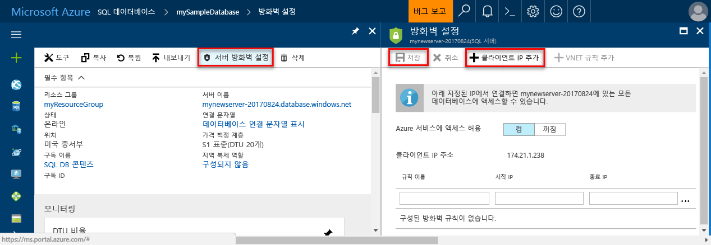

# <a name="create-an-azure-sql-database-in-hello-azure-portal"></a>Hello Azure 포털에서에서 Azure SQL 데이터베이스 만들기

이 빠른 시작 자습서는 Azure에서 SQL toocreate 데이터베이스 방법 안내 합니다. Azure SQL 데이터베이스는는 "데이터베이스-as a Service" 수 있게 해 주는 hello 클라우드에서 toorun와 소수 자릿수 항상 사용 가능한 SQL Server 데이터베이스를 제공 합니다. 이 빠른 시작에서는 tooget hello Azure 포털을 사용 하 여 SQL 데이터베이스를 만들고 시작 하는 방법을 보여 줍니다.

Azure 구독이 아직 없는 경우 시작하기 전에 [체험](https://azure.microsoft.com/free/) 계정을 만듭니다.

## <a name="log-in-toohello-azure-portal"></a>Azure 포털 toohello에 로그인

Toohello 로그인 [Azure 포털](https://portal.azure.com/)합니다.

## <a name="create-a-sql-database"></a>SQL 데이터베이스 만들기

Azure SQL Database는 일련의 정의된 [계산 및 저장소 리소스](sql-database-service-tiers.md)를 사용하여 만들어집니다. hello 데이터베이스 내에서 만들어집니다는 [Azure 리소스 그룹](../azure-resource-manager/resource-group-overview.md) 및는 [Azure SQL 데이터베이스 논리 서버](sql-database-features.md)합니다. 

이러한 단계 toocreate hello Adventure Works LT 예제 데이터를 포함 하는 SQL 데이터베이스를 따릅니다. 

1. Hello 클릭 **새로** 단추 hello 왼쪽 위 모서리의 hello Azure 포털에서 찾을 수 있습니다.

2. 선택 **데이터베이스** hello에서 **새로** 선택한 페이지 **SQL 데이터베이스** hello에서 **데이터베이스** 페이지.

   

3. Hello 이미지 앞에 표시 된 대로 hello SQL 데이터베이스에 대 한 양식을 사용 hello 다음 정보를 입력 합니다.   

   | 설정       | 제안 값 | 설명 | 
   | ------------ | ------------------ | ------------------------------------------------- | 
   | **데이터베이스 이름** | mySampleDatabase | 유효한 데이터베이스 이름은 [데이터베이스 식별자](https://docs.microsoft.com/en-us/sql/relational-databases/databases/database-identifiers)를 참조하세요. | 
   | **구독** | 사용자의 구독  | 구독에 대한 자세한 내용은 [구독](https://account.windowsazure.com/Subscriptions)을 참조하세요. |
   | **리소스 그룹**  | myResourceGroup | 유효한 리소스 그룹 이름은 [명명 규칙 및 제한 사항](https://docs.microsoft.com/azure/architecture/best-practices/naming-conventions)을 참조하세요. |
   | **원본 소스** | 샘플(AdventureWorksLT) | 새 데이터베이스를 hello AdventureWorksLT 스키마와 데이터 로드 |

   > [!IMPORTANT]
   > 이 빠른 시작의 hello 나머지 부분에 사용 되므로이 양식에 hello 예제 데이터베이스를 선택 해야 합니다.
   > 

4. 아래 **서버**, 클릭 **필요한 설정 구성** hello 다음 이미지에 표시 된 것과 같이 hello로 SQL server (논리 서버) 형식 hello 사용자에 게 다음 정보를 및:   

   | 설정       | 제안 값 | 설명 | 
   | ------------ | ------------------ | ------------------------------------------------- | 
   | **서버 이름** | 전역적으로 고유한 이름 | 유효한 서버 이름은 [명명 규칙 및 제한 사항](https://docs.microsoft.com/azure/architecture/best-practices/naming-conventions)을 참조하세요. | 
   | **서버 관리자 로그인** | 모든 유효한 이름 | 유효한 로그인 이름은 [데이터베이스 식별자](https://docs.microsoft.com/en-us/sql/relational-databases/databases/database-identifiers)를 참조하세요. |
   | **암호** | 유효한 암호 | 암호가 8 자 이상 있어야 하며 hello 다음 범주 중 세 범주의 문자를 포함 해야 합니다: 대문자, 소문자, 숫자 및 및 영숫자가 아닌 문자. |
   | **구독** | 사용자의 구독 | 구독에 대한 자세한 내용은 [구독](https://account.windowsazure.com/Subscriptions)을 참조하세요. |
   | **리소스 그룹** | myResourceGroup | 유효한 리소스 그룹 이름은 [명명 규칙 및 제한 사항](https://docs.microsoft.com/azure/architecture/best-practices/naming-conventions)을 참조하세요. |
   | **위치**: | 모든 유효한 위치 | 지역에 대한 자세한 내용은 [Azure 지역](https://azure.microsoft.com/regions/)을 참조하세요. |

   > [!IMPORTANT]
   > 여기서 지정 하는 hello 서버 관리자 로그인 및 암호는 toohello 서버에서 필요한 toolog와이 빠른 시작의 뒷부분에 나오는 해당 데이터베이스. 나중에 사용하기 위해 이 정보를 기억하거나 기록합니다. 
   >  

   

5. Hello 폼을 완료 했으면 클릭 **선택**합니다.

6. 클릭 **가격 책정 계층** toospecify hello 서비스 계층과 성능 수준을 새 데이터베이스에 대 한 합니다. 슬라이더 tooselect hello를 사용 하 여 **20 Dtu** 및 **250** g B의 저장소가 됩니다. DTU에 대한 자세한 내용은 [DTU란?](sql-database-what-is-a-dtu.md)을 참조하세요.

   

7. Dtu 선택한 hello 지나면 클릭 **적용**합니다.  

8. 이제 SQL 데이터베이스 폼 hello를 완료 했으면 클릭 **만들기** tooprovision hello 데이터베이스입니다. 프로비전하는 데 몇 분이 걸립니다. 

9. Hello 도구 모음에서 **알림** toomonitor hello 배포 프로세스입니다.

   

## <a name="create-a-server-level-firewall-rule"></a>서버 수준 방화벽 규칙 만들기

hello SQL 데이터베이스 서비스는 hello 서버 수준 방화벽 규칙은 특정 IP 주소에 대 한 tooopen hello 방화벽을 만들지 않은 toohello 서버나 hello 서버에 있는 모든 데이터베이스를 연결 하지 못하도록 외부 응용 프로그램 및 도구를 방지 하에 방화벽을 만듭니다. 이러한 단계 toocreate에 따라 한 [SQL 데이터베이스 서버 수준 방화벽 규칙](sql-database-firewall-configure.md) 클라이언트의 IP 주소에 대 한 사용자만 IP 주소에 대 한 hello SQL 데이터베이스 방화벽을 통해 외부 연결을 사용 하도록 설정 합니다. 

> [!NOTE]
> SQL Database는 포트 1433을 통해 통신합니다. 회사 네트워크 내부에서 tooconnect을 시도 하는 포트 1433 통한 아웃 바운드 트래픽 네트워크의 방화벽에서 허용 되지 않을 수 있습니다. 이 경우에 IT 부서는 포트 1433을 엽니다 하지 않는 한 tooyour Azure SQL 데이터베이스 서버를 연결할 수 없습니다.
>

1. Hello 배포가 완료 된 후 클릭 **SQL 데이터베이스** hello 왼쪽 메뉴에서 **mySampleDatabase** hello에 **SQL 데이터베이스** 페이지. hello 완벽 하 게 hello 보여 주는 데이터베이스 열리면 프로그램에 대 한 개요 페이지에 정규화 된 서버 이름 (예: **mynewserver20170313.database.windows.net**) 하 고 더 이상의 구성에 대 한 옵션을 제공 합니다. 나중에 사용하기 위해 이 정규화된 서버 이름을 복사합니다.

   > [!IMPORTANT]
   > 이 정규화 된 서버 이름 tooconnect tooyour 서버와 데이터베이스의 후속 빠른 시작 해야합니다.
   > 

    

2. 클릭 **서버 방화벽 설정** hello 이전 그림에 나와 있는 것 처럼 hello 도구 모음입니다. hello **방화벽 설정** hello SQL 데이터베이스 서버에 대 한 페이지가 열립니다. 

    

3. 클릭 **클라이언트 IP 추가** hello 도구 모음 tooadd에 현재 IP 주소 tooa 새 방화벽 규칙입니다. 방화벽 규칙은 단일 IP 주소 또는 IP 주소의 범위에 1433 포트를 열 수 있습니다.

4. **Save**를 클릭합니다. 서버 수준 방화벽 규칙 hello 논리 서버에 포트 1433을 열지 현재 IP 주소에 대해 만들어집니다.

    

4. 클릭 **확인** hello 다음 닫고 **방화벽 설정** 페이지.

Toohello SQL 데이터베이스 서버와 SQL Server Management Studio 또는 이전에 만든 hello 서버 관리자 계정을 사용 하 여이 IP 주소에서 선택한 다른 도구를 사용 하 여 데이터베이스를 연결할 수 있습니다.

> [!IMPORTANT]
> 기본적으로 액세스 hello SQL 데이터베이스 방화벽을 통해 모든 Azure 서비스에 대해 사용 됩니다. 클릭 **OFF** 모든 Azure 서비스에 대 한이 페이지 toodisable에 있습니다.
>

## <a name="query-hello-sql-database"></a>Hello SQL 데이터베이스 쿼리

Azure에서 예제 데이터베이스를 만든 hello Azure 포털 tooconfirm toohello 데이터베이스 데이터 및 쿼리 hello를 연결할 수 있는지 내 hello 기본 제공 쿼리 도구를 사용 하겠습니다. 

1. 데이터베이스에 대 한 hello SQL 데이터베이스 페이지에서 클릭 **도구** hello 도구 모음입니다. hello **도구** 페이지가 열립니다.

    

2. 클릭 **쿼리 편집기 (미리 보기)**, hello 클릭 **용어를 미리 볼** 확인란을 클릭 하 고 **확인**합니다. hello 쿼리 편집기 페이지가 열립니다.

3. 클릭 **로그인** 대화 상자가 나타나면 다음을 선택 하 고 **SQL server 인증** hello 서버 관리자 로그인과 이전에 만든 암호를 제공 합니다.

    

4. 클릭 **확인** toolog에 있습니다.

5. 인증 된 후 hello 다음 hello 쿼리 편집기 창에서 쿼리를 입력 합니다.

   ```sql
   SELECT TOP 20 pc.Name as CategoryName, p.name as ProductName
   FROM SalesLT.ProductCategory pc
   JOIN SalesLT.Product p
   ON pc.productcategoryid = p.productcategoryid;
   ```

6. 클릭 **실행** hello에 hello 쿼리 결과 검토 한 다음 **결과** 창.

   

7. 닫기 hello **쿼리 편집기** 페이지와 hello **도구** 페이지.

## <a name="clean-up-resources"></a>리소스 정리

빠른 시작/자습서에 대 한이 리소스인 경우 필요 하지 않습니다 (참조 [다음 단계](#next-steps)), hello 다음을 수행 하 여 삭제할 수 있습니다.


1. Hello Azure 포털에서에서 왼쪽 메뉴 hello에서에서 클릭 **리소스 그룹** 클릭 하 고 **myResourceGroup**합니다. 
2. 리소스 그룹 페이지에서 클릭 **삭제**, 형식 **myResourceGroup** hello 텍스트 상자와 클릭 **삭제**합니다.

## <a name="next-steps"></a>다음 단계

이제 데이터베이스가 생겼으니 자주 사용하는 도구를 사용하여 데이터베이스에 연결하고 쿼리할 수 있습니다. 아래에서 도구를 선택하여 자세한 내용을 알아보세요.

- [SQL Server Management Studio](sql-database-connect-query-ssms.md)
- [Contact.java](sql-database-connect-query-vscode.md)
- [.NET](sql-database-connect-query-dotnet.md)
- [PHP](sql-database-connect-query-php.md)
- [Node.JS](sql-database-connect-query-nodejs.md)
- [Java](sql-database-connect-query-java.md)
- [Python](sql-database-connect-query-python.md)
- [Ruby](sql-database-connect-query-ruby.md)
