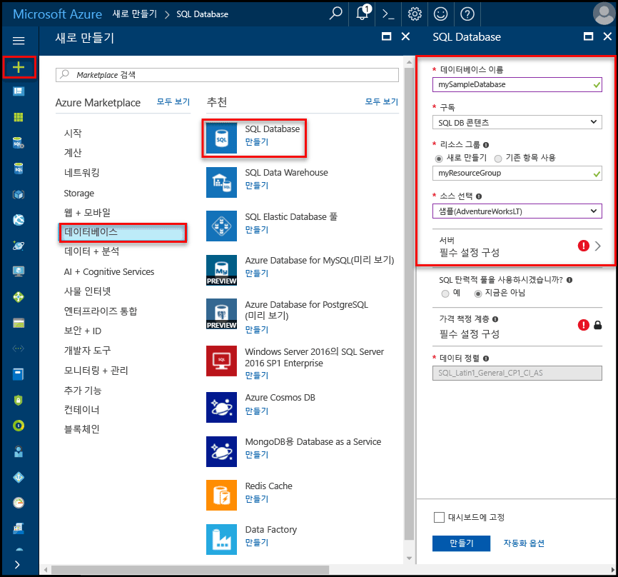

# Azure SQL Database 서버 및 데이터베이스 만들기 및 관리Create and manage Azure SQL Database servers and databases

Azure SQL Database는 [다양한 워크로드에 대한 계산 및 저장소 리소스](sql-database-service-tiers.md)를 정의한 집합을 사용하여 [Azure 리소스 그룹](../azure-resource-manager/resource-group-overview.md) 내에서 만든 Microsoft Azure의 관리되는 데이터베이스입니다.An Azure SQL database is a managed database in Microsoft Azure that is created within an [Azure resource group](../azure-resource-manager/resource-group-overview.md) with a defined set of [compute and storage resources for different workloads](sql-database-service-tiers.md). Azure SQL Database는 Azure SQL Database 논리 서버와 연결되어 있으며 특정 Azure 지역에서 만들어집니다.An Azure SQL database is associated with an Azure SQL Database logical server, which is created within a specific Azure region. 

## Azure SQL Database는 풀되거나 분할된 단일 데이터베이스일 수 있습니다.An Azure SQL database can be a single, pooled, or partitioned database

Azure SQL Database는 다음과 같을 수 있습니다.An Azure SQL database can be:

- [고유한 리소스 집합](sql-database-what-is-a-dtu.md#what-are-database-transaction-units-dtus)(DTU)이 있는 단일 데이터베이스A single database with its [own set of resources](sql-database-what-is-a-dtu.md#what-are-database-transaction-units-dtus) (DTUs)
- [리소스 집합을 공유](sql-database-what-is-a-dtu.md#what-are-elastic-database-transaction-units-edtus)(eDTU)하는 [SQL 탄력적 풀](sql-database-elastic-pool.md)의 일부Part of a [SQL elastic pool](sql-database-elastic-pool.md) that [shares a set of resources](sql-database-what-is-a-dtu.md#what-are-elastic-database-transaction-units-edtus) (eDTUs)
- 일부 [분할 데이터베이스의 확장된 집합](sql-database-elastic-scale-introduction.md#horizontal-and-vertical-scaling)은 단일 또는 풀링된 데이터베이스Part of a [scaled-out set of sharded databases](sql-database-elastic-scale-introduction.md#horizontal-and-vertical-scaling), which can be either single or pooled databases
- [다중 테넌트 SaaS 디자인 패턴](sql-database-design-patterns-multi-tenancy-saas-applications.md)에 속한 데이터베이스 집합의 일부 및 해당 데이터베이스는 단일 또는 풀링된 데이터베이스 또는 둘 다일 수 있습니다.Part of a set of databases participating in a [multitenant SaaS design pattern](sql-database-design-patterns-multi-tenancy-saas-applications.md), and whose databases can either be single or pooled databases (or both) 

> [!TIP]
> 유효한 데이터베이스 이름은 [데이터베이스 식별자](https://docs.microsoft.com/en-us/sql/relational-databases/databases/database-identifiers)를 참조하세요.For valid database names, see [Database Identifiers](https://docs.microsoft.com/en-us/sql/relational-databases/databases/database-identifiers). 
>
 
- hello 기본 데이터베이스 데이터 정렬이 Microsoft Azure SQL 데이터베이스에서 사용 하는 **SQL_LATIN1_GENERAL_CP1_CI_AS**여기서 **LATIN1_GENERAL** 영어 (미국) **CP1** 코드 페이지 1252 **CI** 대/소문자가 및 **AS** 사전이 악센트를 구분 합니다.hello default database collation used by Microsoft Azure SQL Database is **SQL_LATIN1_GENERAL_CP1_CI_AS**, where **LATIN1_GENERAL** is English (United States), **CP1** is code page 1252, **CI** is case-insensitive, and **AS** is accent-sensitive. 어떻게 tooset hello 데이터 정렬에 대 한 자세한 내용은 참조 [COLLATE (TRANSACT-SQL)](https://msdn.microsoft.com/library/ms184391.aspx)합니다.For more information about how tooset hello collation, see [COLLATE (Transact-SQL)](https://msdn.microsoft.com/library/ms184391.aspx).
- Microsoft Azure SQL 데이터베이스는 TDS(Tabular Data Stream) 프로토콜 클라이언트 버전 7.3 이상을 지원합니다.Microsoft Azure SQL Database supports tabular data stream (TDS) protocol client version 7.3 or later.
- TCP/IP 연결만 허용됩니다.Only TCP/IP connections are allowed.

## Azure SQL 논리 서버란?What is an Azure SQL logical server?

논리 서버는 [SQL 탄력적 풀](sql-database-elastic-pool.md) [로그인](sql-database-manage-logins.md), [방화벽 규칙](sql-database-firewall-configure.md), [감사 규칙](sql-database-auditing.md), [위협 검색 정책](sql-database-threat-detection.md) 및 [장애 조치 그룹](sql-database-geo-replication-overview.md)을 포함하여 여러 데이터베이스에 대한 중앙 관리 지점의 역할을 담당합니다.A logical server acts as a central administrative point for multiple databases, including [SQL elastic pools](sql-database-elastic-pool.md) [logins](sql-database-manage-logins.md), [firewall rules](sql-database-firewall-configure.md), [auditing rules](sql-database-auditing.md), [threat detection policies](sql-database-threat-detection.md), and [failover groups](sql-database-geo-replication-overview.md). 논리 서버는 리소스 그룹과 다른 지역에 위치할 수 있습니다.A logical server can be in a different region than its resource group. hello 논리 서버 hello Azure SQL 데이터베이스를 만들려면 먼저 존재 해야 합니다.hello logical server must exist before you can create hello Azure SQL database. 서버에 있는 모든 데이터베이스 내에서 만들어집니다 hello 동일한 논리 서버 hello와 지역입니다.All databases on a server are created within hello same region as hello logical server. 

> [!IMPORTANT]
> SQL 데이터베이스에는 서버는 수에 대해 잘 알고 hello 온-프레미스 환경에서 SQL Server 인스턴스를 구별 되는 논리적 구문입니다.In SQL Database, a server is a logical construct that is distinct from a SQL Server instance that you may be familiar with in hello on-premises world. 특히, hello SQL 데이터베이스 서비스 hello 데이터베이스의 위치에 대 한 보장은 없습니다 관계에서 tootheir 논리 서버를 만들고 없는 인스턴스 수준의 액세스 나 기능을 노출 합니다.Specifically, hello SQL Database service makes no guarantees regarding location of hello databases in relation tootheir logical servers, and exposes no instance-level access or features.
> 

논리 서버를 만들 때 로그인 계정 및 암호에 해당 서버에 대 한 관리 권한 toohello master 데이터베이스와 해당 서버에서 생성 된 모든 데이터베이스 서버를 제공 합니다.When you create a logical server, you provide a server login account and password that has administrative rights toohello master database on that server and all databases created on that server. 이 초기 계정이 SQL 로그인 계정입니다.This initial account is a SQL login account. Azure SQL Database는 인증을 위해 SQL 인증 및 Azure Active Directory 인증을 지원합니다.Azure SQL Database supports SQL authentication and Azure Active Directory Authentication for authentication. 로그인 및 인증에 대한 내용은 [Azure SQL Database에서 데이터베이스 및 로그인 관리](sql-database-manage-logins.md)를 참조하세요.For information about logins and authentication, see [Managing Databases and Logins in Azure SQL Database](sql-database-manage-logins.md). Windows 인증은 지원되지 않습니다.Windows Authentication is not supported. 

> [!TIP]
> 유효한 리소스 그룹 및 서버 이름은 [명명 규칙 및 제한 사항](https://docs.microsoft.com/azure/architecture/best-practices/naming-conventions)을 참조하세요.For valid resource group and server names, see [Naming rules and restrictions](https://docs.microsoft.com/azure/architecture/best-practices/naming-conventions).
>

Azure 데이터베이스 논리 서버는 다음과 같습니다.An Azure Database logical server:

- Azure 구독 내에서 생성 되지만 해당 포함 된 리소스 tooanother 구독과 이동할 수 있습니다Is created within an Azure subscription, but can be moved with its contained resources tooanother subscription
- 데이터베이스, 탄력적 풀, 및 데이터 웨어하우스에 hello 부모 리소스Is hello parent resource for databases, elastic pools, and data warehouses
- 데이터베이스, 탄력적 풀 및 데이터 웨어하우스의 네임스페이스를 제공합니다.Provides a namespace for databases, elastic pools, and data warehouses
- 강력한 수명 의미 체계가-하며 서버를 삭제 하는 delete 있는 논리적 컨테이너 hello 포함 된 데이터베이스, 탄력적 풀, 및 데이터 웨어하우스Is a logical container with strong lifetime semantics - delete a server and it deletes hello contained databases, elastic pools, and data warehouses
- 에 참여 [Azure 역할 기반 액세스 제어 (RBAC)](/active-directory/role-based-access-control-what-is) -데이터베이스, 탄력적 풀, 및 데이터 웨어하우스 서버 내에서 액세스 권한을 hello 서버에서 상속Participates in [Azure role-based access control (RBAC)](/active-directory/role-based-access-control-what-is) - databases, elastic pools, and data warehouses within a server inherit access rights from hello server
- 데이터베이스, 탄력적 풀 및 Azure 리소스에 대 한 데이터 웨어하우스 hello id의 상위 요소 관리 목적으로 (hello URL 참조 데이터베이스 및 풀에 대 한 구성표)Is a high-order element of hello identity of databases, elastic pools, and data warehouses for Azure resource management purposes (see hello URL scheme for databases and pools)
- 지역에 리소스 배치Collocates resources in a region
- 데이터베이스 액세스에 대한 연결 끝점을 제공합니다(<serverName>.database.windows.net).Provides a connection endpoint for database access (<serverName>.database.windows.net)
- Tooa master 데이터베이스를 연결 하 여 Dmv 통해 포함 된 리소스에 대 한 액세스 toometadata를 제공합니다.Provides access toometadata regarding contained resources via DMVs by connecting tooa master database 
- Tooits 데이터베이스-로그인 적용, 방화벽, 감사, 검색 등을 위협 하는 관리 정책에 대 한 hello 범위를 제공 합니다.Provides hello scope for management policies that apply tooits databases - logins, firewall, audit, threat detection, etc. 
- Hello 부모 구독 내에서 할당량으로 제한 됩니다 (기본적으로-는 구독 당 6 대의 서버 [구독 제한 여기 참조](../azure-subscription-service-limits.md))Is restricted by a quota within hello parent subscription (six servers per subscription by default - [see Subscription limits here](../azure-subscription-service-limits.md))
- (예: 45,000 DTU) 포함 된 hello 리소스에 대 한 데이터베이스 할당량 및 DTU 할당량에 대 한 hello 범위를 제공 합니다.Provides hello scope for database quota and DTU quota for hello resources it contains (such as 45,000 DTU)
- 포함 된 리소스에서 사용 하도록 설정 하는 기능에 대 한 hello 버전 관리 범위는Is hello versioning scope for capabilities enabled on contained resources 
- 서버 수준 주체 로그인은 서버에 있는 모든 데이터베이스를 관리할 수 있습니다.Server-level principal logins can manage all databases on a server
- 로그인을 포함할 수 제한 된 관리 권한만 부여 된 액세스 tooone 또는 hello 서버에 데이터베이스를 추가로 허용 되는 수 귀하의 구내 SQL Server 인스턴스에 있는 비슷한 toothose 합니다.Can contain logins similar toothose in instances of SQL Server on your premises that are granted access tooone or more databases on hello server, and can be granted limited administrative rights. 자세한 내용은 [로그인](sql-database-manage-logins.md)을 참조하세요.For more information, see [Logins](sql-database-manage-logins.md).

## Azure SQL Database는 SQL Database 방화벽으로 보호됩니다.Azure SQL databases protected by SQL Database firewall

toohelp 데이터를 보호 한 [SQL 데이터베이스 방화벽](sql-database-firewall-configure.md) 모든 액세스 tooyour 데이터베이스 서버 또는 Azure 구독 연결을 통해 직접 연결 toohello 서버 외부에서 데이터베이스를 방지 합니다.toohelp protect your data, a [SQL Database firewall](sql-database-firewall-configure.md) prevents all access tooyour database server or any of its databases from outside of your connection toohello server directly through your Azure subscription connection. tooenable 추가 연결을 수행 해야 [하나 이상의 방화벽 규칙을 만들](sql-database-firewall-configure.md#creating-and-managing-firewall-rules)합니다.tooenable additional connectivity, you must [create one or more firewall rules](sql-database-firewall-configure.md#creating-and-managing-firewall-rules). SQL 탄력적 풀 만들기 및 관리에 대해서는 [탄력적 풀](sql-database-elastic-pool.md)을 참조하세요.For creating and managing SQL elastic pools, see [Elastic pools](sql-database-elastic-pool.md).

## Azure SQL 서버, 데이터베이스 그리고 hello Azure 포털을 사용 하는 방화벽 관리Manage Azure SQL servers, databases, and firewalls using hello Azure portal

Hello 서버 자체를 만드는 동안 또는 미리 hello Azure SQL 데이터베이스의 리소스 그룹을 만들 수 있습니다.You can create hello Azure SQL database's resource group ahead of time or while creating hello server itself. 새 SQL server를 만들어 또는 새 데이터베이스 만들기의 일부로 tooa 새 SQL server 폼을 가져오기 위한는 방법은 여러 가지가 있습니다.There are multiple methods for getting tooa new SQL server form, either by creating a new SQL server or as part of creating a new database. 

### 비어 있는 SQL Server(논리 서버) 만들기Create a blank SQL server (logical server)

사용 하 여 Azure SQL 데이터베이스 서버 (데이터베이스) 없음 toocreate hello [Azure 포털](https://portal.azure.com), tooa 빈 SQL server (논리 서버) 양식 이동 합니다.toocreate an Azure SQL Database server (without a database) using hello [Azure portal](https://portal.azure.com), navigate tooa blank SQL server (logical server) form. hello 다음 스크린샷은 폼 toocreate를 열기 위한 한 가지 방법은 빈 논리 SQL server.hello following screenshot shows one method for opening a form toocreate a blank logical SQL server. 

   

다른 방법을 사용 하 여 toothis 형식 발생 하는 경우에 hello 양식의 hello 정보는 동일 합니다.If you get toothis form using another method, hello information on hello form is identical.

### 비어 있거나 샘플인 SQL Database 만들기Create a blank or sample SQL database

사용 하 여 Azure SQL 데이터베이스 toocreate hello [Azure 포털](https://portal.azure.com)tooa 빈 SQL 데이터베이스 폼을 탐색 하 고, 요청 된 정보를 hello 합니다.toocreate an Azure SQL database using hello [Azure portal](https://portal.azure.com), navigate tooa blank SQL Database form and provide hello requested information. Hello Azure SQL 데이터베이스의 리소스 그룹 및 논리 서버 hello 데이터베이스 자체를 만드는 동안 또는 미리 만들 수 있습니다.You can create hello Azure SQL database's resource group and logical server ahead of time or while creating hello database itself. 비어 있는 데이터베이스를 만들거나 Adventure Works LT에 따라 샘플 데이터베이스를 만들 수 있습니다.You can create a blank database or create a sample database based on Adventure Works LT. 

  

> [중요] 가격 책정 계층 데이터베이스에 대 한 hello 선택에 대 한 자세한 내용은 참조 하십시오. [서비스 계층](sql-database-service-tiers.md)합니다.[IMPORTANT] For information on selecting hello pricing tier for your database, see [Service tiers](sql-database-service-tiers.md).
>

### 기존 SQL Server 관리Manage an existing SQL server

toomanage는 기존 서버를 사용 하 여 다양 한 메서드-특정 SQL 데이터베이스 페이지와 같은 hello toohello 서버 이동 **SQL server** 페이지 또는 hello **모든 리소스** 페이지.toomanage an existing server, navigate toohello server using a number of methods - such as from specific SQL database page, hello **SQL servers** page, or hello **All resources** page. 스크린 샷에 표시 방법을 따르는 hello hello에서 서버 수준 방화벽 설정 toobegin **개요** 는 서버에 대 한 페이지입니다.hello following screenshot shows how toobegin setting a server-level firewall from hello **Overview** page for a server. 

   

toomanage 기존 데이터베이스를 이동 toohello **SQL 데이터베이스** 페이지 고 toomanage hello 데이터베이스를 클릭 합니다.toomanage an existing database, navigate toohello **SQL databases** page and click hello database you wish toomanage. 스크린 샷에 표시 방법을 따르는 hello hello에서 데이터베이스에 대 한 서버 수준 방화벽 설정 toobegin **개요** 데이터베이스에 대 한 페이지입니다.hello following screenshot shows how toobegin setting a server-level firewall for a database from hello **Overview** page for a database. 

    

> [!IMPORTANT]
> 데이터베이스에 대 한 성능 속성 tooconfigure 참조 [서비스 계층](sql-database-service-tiers.md)합니다.tooconfigure performance properties for a database, see [Service tiers](sql-database-service-tiers.md).
>

> [!TIP]
> Azure 포털 빠른 시작 자습서를 참조 하십시오. [hello Azure 포털에서에서 Azure SQL 데이터베이스를 만들](sql-database-get-started-portal.md)합니다.For an Azure portal quick start tutorial, see [Create an Azure SQL database in hello Azure portal](sql-database-get-started-portal.md).
>

## PowerShell을 사용하여 Azure SQL Server, 데이터베이스 및 방화벽 관리Manage Azure SQL servers, databases, and firewalls using PowerShell

toocreate 및 Azure SQL server, 데이터베이스 및 Azure PowerShell을 사용한 방화벽을 관리, PowerShell cmdlet을 다음 hello를 사용 합니다.toocreate and manage Azure SQL server, databases, and firewalls with Azure PowerShell, use hello following PowerShell cmdlets. PowerShell을 업그레이드 하거나 tooinstall를 필요한 경우 참조 [Azure PowerShell 설치 모듈](/powershell/azure/install-azurerm-ps)합니다.If you need tooinstall or upgrade PowerShell, see [Install Azure PowerShell module](/powershell/azure/install-azurerm-ps). SQL 탄력적 풀 만들기 및 관리에 대해서는 [탄력적 풀](sql-database-elastic-pool.md)을 참조하세요.For creating and managing SQL elastic pools, see [Elastic pools](sql-database-elastic-pool.md).

| CmdletCmdlet | 설명Description |
| --- | --- |
|[New-AzureRmSqlDatabaseNew-AzureRmSqlDatabase](/powershell/module/azurerm.sql/new-azurermsqldatabase)|데이터베이스 만들기Creates a database |
|[Get-AzureRmSqlDatabaseGet-AzureRmSqlDatabase](/powershell/module/azurerm.sql/get-azurermsqldatabase)|하나 이상의 데이터베이스 가져오기Gets one or more databases|
|[Set-AzureRmSqlDatabaseSet-AzureRmSqlDatabase](/powershell/module/azurerm.sql/set-azurermsqldatabase)|데이터베이스의 속성 설정 또는 기존 데이터베이스를 탄력적 풀로 이동Sets properties for a database, or moves an existing database into an elastic pool|
|[Remove-AzureRmSqlDatabaseRemove-AzureRmSqlDatabase](/powershell/module/azurerm.sql/remove-azurermsqldatabase)|데이터베이스 제거Removes a database|
|[New-AzureRmResourceGroupNew-AzureRmResourceGroup](/powershell/module/azurerm.resources/new-azurermresourcegroup)|리소스 그룹 만들기]Creates a resource group]
|[New-AzureRmSqlServerNew-AzureRmSqlServer](/powershell/module/azurerm.sql/new-azurermsqlserver)|서버 만들기Creates a  server|
|[Get-AzureRmSqlServerGet-AzureRmSqlServer](/powershell/module/azurerm.sql/get-azurermsqlserver)|서버에 대한 정보 반환Returns information about servers|
|[Set-AzureRmSqlServerSet-AzureRmSqlServer](https://docs.microsoft.com/en-us/powershell/module/azurerm.sql/set-azurermsqlserver)|서버의 속성 수정Modifies properties of a server|
|[Remove-AzureRmSqlServerRemove-AzureRmSqlServer](/powershell/module/azurerm.sql/remove-azurermsqlserver)|서버 제거Removes a server|
|[New-AzureRmSqlServerFirewallRuleNew-AzureRmSqlServerFirewallRule](/powershell/module/azurerm.sql/new-azurermsqlserverfirewallrule)|서버 수준 방화벽 규칙 만들기Creates a server-level firewall rule |
|[Get-AzureRmSqlServerFirewallRuleGet-AzureRmSqlServerFirewallRule](/powershell/module/azurerm.sql/get-azurermsqlserverfirewallrule)|서버의 방화벽 규칙 가져오기Gets firewall rules for a server|
|[Set-AzureRmSqlServerFirewallRuleSet-AzureRmSqlServerFirewallRule](/powershell/module/azurerm.sql/set-azurermsqlserverfirewallrule)|서버에서 방화벽 규칙 수정Modifies a firewall rule in a server|
|[Remove-AzureRmSqlServerFirewallRuleRemove-AzureRmSqlServerFirewallRule](/powershell/module/azurerm.sql/remove-azurermsqlserverfirewallrule)|서버에서 방화벽 규칙 삭제Deletes a firewall rule from a server.|

> [!TIP]
> PowerShell 빠른 시작 자습서는 [PowerShell을 사용하여 단일 Azure SQL Database 만들기](sql-database-get-started-portal.md)를 참조하세요.For a PowerShell quick start tutorial, see [Create a single Azure SQL database using PowerShell](sql-database-get-started-portal.md). PowerShell 예제 스크립트를 참조 하십시오. [PowerShell 사용 하 여 toocreate 단일 Azure SQL 데이터베이스 방화벽 규칙을 구성 및](scripts/sql-database-create-and-configure-database-powershell.md) 및 [모니터 및 배율 단일 SQL 데이터베이스 PowerShell을 사용 하 여](scripts/sql-database-monitor-and-scale-database-powershell.md)합니다.For PowerShell example scripts, see [Use PowerShell toocreate a single Azure SQL database and configure a firewall rule](scripts/sql-database-create-and-configure-database-powershell.md) and [Monitor and scale a single SQL database using PowerShell](scripts/sql-database-monitor-and-scale-database-powershell.md).
>

## Azure SQL 서버, 데이터베이스 및 Azure CLI hello를 사용 하는 방화벽 관리Manage Azure SQL servers, databases, and firewalls using hello Azure CLI

toocreate 및 Azure SQL server, 데이터베이스 및 hello로 방화벽 관리 [Azure CLI](/cli/azure/overview), hello 다음 이름을 사용해 서 [Azure CLI SQL 데이터베이스](/cli/azure/sql/db) 명령입니다.toocreate and manage Azure SQL server, databases, and firewalls with hello [Azure CLI](/cli/azure/overview), use hello following [Azure CLI SQL Database](/cli/azure/sql/db) commands. 사용 하 여 hello [클라우드 셸](/azure/cloud-shell/overview) 브라우저에서 toorun hello CLI 또는 [설치](/cli/azure/install-azure-cli) macOS, Linux 또는 Windows에 있습니다.Use hello [Cloud Shell](/azure/cloud-shell/overview) toorun hello CLI in your browser, or [install](/cli/azure/install-azure-cli) it on macOS, Linux, or Windows. SQL 탄력적 풀 만들기 및 관리에 대해서는 [탄력적 풀](sql-database-elastic-pool.md)을 참조하세요.For creating and managing SQL elastic pools, see [Elastic pools](sql-database-elastic-pool.md).

| CmdletCmdlet | 설명Description |
| --- | --- |
|[az sql db createaz sql db create](/cli/azure/sql/db#create) |데이터베이스 만들기Creates a database|
|[az sql db listaz sql db list](/cli/azure/sql/db#list)|서버의 모든 데이터베이스 및 데이터 웨어하우스 또는 탄력적 풀의 모든 데이터베이스 나열Lists all databases and data warehouses in a server, or all databases in an elastic pool|
|[az sql db list-editionsaz sql db list-editions](/cli/azure/sql/db#list-editions)|사용 가능한 서비스 목표 및 저장소 용량 제한 나열Lists available service objectives and storage limits|
|[az sql db list-usagesaz sql db list-usages](/cli/azure/sql/db#list-usages)|데이터베이스 사용 정보 반환Returns database usages|
|[az sql db showaz sql db show](/cli/azure/sql/db#show)|데이터베이스 또는 데이터 웨어하우스 가져오기Gets a database or data warehouse|
|[az sql db updateaz sql db update](/cli/azure/sql/db#update)|데이터베이스 업데이트Updates a database|
|[az sql db deleteaz sql db delete](/cli/azure/sql/db#delete)|데이터베이스 제거Removes a database|
|[az group createaz group create](/cli/azure/group#create)|리소스 그룹 만들기Creates a resource group|
|[az sql server createaz sql server create](/cli/azure/sql/server#create)|서버 만들기Creates a server|
|[az sql server listaz sql server list](/cli/azure/sql/server#list)|서버 나열Lists servers|
|[az sql server list-usagesaz sql server list-usages](/cli/azure/sql/server#list-usages)|서버 사용 반환Returns  server usages|
|[az sql server showaz sql server show](/cli/azure/sql/server#show)|서버 가져오기Gets a server|
|[az sql server updateaz sql server update](/cli/azure/sql/server#update)|서버 업데이트Updates a server|
|[az sql server deleteaz sql server delete](/cli/azure/sql/server#delete)|서버를 삭제합니다.Deletes a server|
|[az sql server firewall-rule createaz sql server firewall-rule create](/cli/azure/sql/server/firewall-rule#create)|서버 방화벽 규칙 만들기Creates a server firewall rule|
|[az sql server firewall-rule listaz sql server firewall-rule list](/cli/azure/sql/server/firewall-rule#list)|서버 hello 방화벽 규칙을 나열합니다.Lists hello firewall rules on a server|
|[az sql server firewall-rule showaz sql server firewall-rule show](/cli/azure/sql/server/firewall-rule#show)|방화벽 규칙의 hello 세부 정보를 보여 줍니다.Shows hello detail of a firewall rule|
|[az sql server firewall-rule updateaz sql server firewall-rule update](/cli/azure/sql/server/firewall-rule#update)|방화벽 규칙 업데이트Updates a firewall rule|
|[az sql server firewall-rule deleteaz sql server firewall-rule delete](/cli/azure/sql/server/firewall-rule#delete)|방화벽 규칙 삭제Deletes a firewall rule|

> [!TIP]
> Azure CLI 빠른 시작 자습서를 참조 하십시오. [hello Azure CLI를 사용 하 여 단일 Azure SQL 데이터베이스 만들기](sql-database-get-started-cli.md)합니다.For an Azure CLI quick start tutorial, see [Create a single Azure SQL database using hello Azure CLI](sql-database-get-started-cli.md). Azure CLI 예제 스크립트에 대 한 참조 [사용 CLI toocreate 단일 Azure SQL 데이터베이스 방화벽 규칙을 구성 및](scripts/sql-database-create-and-configure-database-cli.md) 및 [사용 CLI toomonitor 및 소수 자릿수는 단일 SQL 데이터베이스](scripts/sql-database-monitor-and-scale-database-cli.md)합니다.For Azure CLI example scripts, see [Use CLI toocreate a single Azure SQL database and configure a firewall rule](scripts/sql-database-create-and-configure-database-cli.md) and [Use CLI toomonitor and scale a single SQL database](scripts/sql-database-monitor-and-scale-database-cli.md).
>

## Transact-SQL을 사용하여 Azure SQL Server, 데이터베이스 및 방화벽 관리Manage Azure SQL servers, databases, and firewalls using Transact-SQL

toocreate 및 Azure SQL server, 데이터베이스 및 Transact sql 방화벽을 관리, T-SQL 명령을 수행 하는 hello를 사용 합니다.toocreate and manage Azure SQL server, databases, and firewalls with Transact-SQL, use hello following T-SQL commands. Hello Azure 포털을 사용 하 여 이러한 명령을 실행할 수 있습니다 [SQL Server Management Studio](/sql/ssms/use-sql-server-management-studio), [Visual Studio Code](https://code.visualstudio.com/docs), 또는 tooan Azure SQL 데이터베이스 서버를 연결 하 고 TRANSACT-SQL 전달할 수 있는 다른 프로그램 명령입니다.You can issue these commands using hello Azure portal, [SQL Server Management Studio](/sql/ssms/use-sql-server-management-studio), [Visual Studio Code](https://code.visualstudio.com/docs), or any other program that can connect tooan Azure SQL Database server and pass Transact-SQL commands. SQL 탄력적 관리에 대해서는 [탄력적 풀](sql-database-elastic-pool.md)을 참조하세요.For managing SQL elastic pools, see [Elastic pools](sql-database-elastic-pool.md).

> [!IMPORTANT]
> Transact-SQL을 사용하여 서버를 만들거나 삭제할 수 없습니다.You cannot create or delete a server using Transact-SQL.
>

| 명령Command | 설명Description |
| --- | --- |
|[CREATE DATABASE (Azure SQL Database)CREATE DATABASE (Azure SQL Database)](/sql/t-sql/statements/create-database-azure-sql-database)|새 데이터베이스를 만듭니다.Creates a new database. 연결 된 toohello master 데이터베이스 toocreate 새 데이터베이스 여야 합니다.You must be connected toohello master database toocreate a new database.|
| [ALTER DATABASE (Azure SQL Database)ALTER DATABASE (Azure SQL Database)](/sql/t-sql/statements/alter-database-azure-sql-database) |Azure SQL 데이터베이스를 수정합니다.Modifies an Azure SQL database. |
|[ALTER DATABASE(Azure SQL Data Warehouse)ALTER DATABASE (Azure SQL Data Warehouse)](/sql/t-sql/statements/alter-database-azure-sql-data-warehouse)|Azure SQL Data Warehouse를 수정합니다.Modifies an Azure SQL Data Warehouse.|
|[DROP DATABASE(Transact-SQL)DROP DATABASE (Transact-SQL)](/sql/t-sql/statements/drop-database-transact-sql)|데이터베이스를 삭제합니다.Deletes a database.|
|[sys.database_service_objectives(Azure SQL Database)sys.database_service_objectives (Azure SQL Database)](/sql/relational-databases/system-catalog-views/sys-database-service-objectives-azure-sql-database)|Azure SQL 데이터베이스 또는 Azure SQL 데이터 웨어하우스에 대 한 반환 hello edition (서비스 계층), (가격 책정 계층), 서비스 목표 및 탄력적인 풀 이름입니다.Returns hello edition (service tier), service objective (pricing tier), and elastic pool name, if any, for an Azure SQL database or an Azure SQL Data Warehouse. Azure SQL 데이터베이스 서버에서 toohello master 데이터베이스에 로그온 하는 경우 모든 데이터베이스에서 정보를 반환 합니다.If logged on toohello master database in an Azure SQL Database server, returns information on all databases. Azure SQL 데이터 웨어하우스에 대 한 연결 된 toohello master 데이터베이스 여야 합니다.For Azure SQL Data Warehouse, you must be connected toohello master database.|
|[sys.dm_db_resource_stats(Azure SQL Database)sys.dm_db_resource_stats (Azure SQL Database)](/sql/relational-databases/system-dynamic-management-views/sys-dm-db-resource-stats-azure-sql-database)| Azure SQL Database 데이터베이스에 대한 CPU, I/O 및 메모리 소비량을 반환합니다.Returns CPU, I/O, and memory consumption for an Azure SQL Database database. Hello 데이터베이스에 작업이 수행 되지 않은 경우에 15 초 마다 한 행이 있습니다.One row exists for every 15 seconds, even if there is no activity in hello database.|
|[sys.resource_stats(Azure SQL Database)sys.resource_stats (Azure SQL Database)](/sql/relational-databases/system-catalog-views/sys-resource-stats-azure-sql-database)|Azure SQL Database에 대한 CPU 사용량 및 저장소 데이터를 반환합니다.Returns CPU usage and storage data for an Azure SQL Database. hello 데이터 수집 되 고 5 분 간격 내에서 집계 됩니다.hello data is collected and aggregated within five-minute intervals.|
|[sys.database_connection_stats(Azure SQL Database)sys.database_connection_stats (Azure SQL Database)](/sql/relational-databases/system-catalog-views/sys-database-connection-stats-azure-sql-database)|SQL Database 데이터베이스 연결 이벤트에 대한 통계를 포함하며 데이터베이스 연결 성공 및 실패에 대한 개요를 제공합니다.Contains statistics for SQL Database database connectivity events, providing an overview of database connection successes and failures. |
|[sys.event_log(Azure SQL Database)sys.event_log (Azure SQL Database)](/sql/relational-databases/system-catalog-views/sys-event-log-azure-sql-database)|성공적인 Azure SQL Database 데이터베이스 연결, 연결 실패 및 교착 상태를 반환합니다.Returns successful Azure SQL Database database connections, connection failures, and deadlocks. 이 정보 tootrack를 사용 하거나 SQL 데이터베이스와 데이터베이스 작업 문제 해결 수 있습니다.You can use this information tootrack or troubleshoot your database activity with SQL Database.|
|[sp_set_firewall_rule (Azure SQL Database)sp_set_firewall_rule (Azure SQL Database)](/sql/relational-databases/system-stored-procedures/sp-set-firewall-rule-azure-sql-database)|만들거나 SQL 데이터베이스 서버에 대 한 hello 서버 수준 방화벽 설정을 업데이트 합니다.Creates or updates hello server-level firewall settings for your SQL Database server. 이 저장된 프로시저는 hello master 데이터베이스 toohello 서버 수준 보안 주체 로그인에 사용할 수만 있습니다.This stored procedure is only available in hello master database toohello server-level principal login. 서버 수준 방화벽 규칙을 다시 만들 hello 첫 번째 서버 수준 방화벽 규칙이 Azure 수준 사용 권한 가진 사용자가 만들어진 후 TRANSACT-SQL을 사용 하 여A server-level firewall rule can only be created using Transact-SQL after hello first server-level firewall rule has been created by a user with Azure-level permissions|
|[sys.firewall_rules(Azure SQL Database)sys.firewall_rules (Azure SQL Database)](/sql/relational-databases/system-catalog-views/sys-firewall-rules-azure-sql-database)|Microsoft Azure SQL 데이터베이스와 관련 된 hello 서버 수준 방화벽 설정에 대 한 정보를 반환 합니다.Returns information about hello server-level firewall settings associated with your Microsoft Azure SQL Database.|
|[sp_delete_firewall_rule(Azure SQL Database)sp_delete_firewall_rule (Azure SQL Database)](/sql/relational-databases/system-stored-procedures/sp-delete-firewall-rule-azure-sql-database)|SQL Database 서버에서 서버 수준 방화벽 설정을 제거합니다.Removes server-level firewall settings from your SQL Database server. 이 저장된 프로시저는 hello master 데이터베이스 toohello 서버 수준 보안 주체 로그인에 사용할 수만 있습니다.This stored procedure is only available in hello master database toohello server-level principal login.|
|[sp_set_database_firewall_rule(Azure SQL Database)sp_set_database_firewall_rule (Azure SQL Database)](/sql/relational-databases/system-stored-procedures/sp-set-database-firewall-rule-azure-sql-database)|만들거나 Azure SQL 데이터베이스 또는 SQL 데이터 웨어하우스에 대 한 hello 데이터베이스 수준 방화벽 규칙을 업데이트 합니다.Creates or updates hello database-level firewall rules for your Azure SQL Database or SQL Data Warehouse. SQL 데이터베이스에서 사용자 데이터베이스와 hello master 데이터베이스에 대해 데이터베이스 방화벽 규칙을 구성할 수 있습니다.Database firewall rules can be configured for hello master database, and for user databases on SQL Database. 데이터베이스 방화벽 규칙은 포함된 데이터베이스 사용자를 사용하는 경우에 유용합니다.Database firewall rules are useful when using contained database users. |
|[sys.database_firewall_rules(Azure SQL Database)sys.database_firewall_rules (Azure SQL Database)](/sql/relational-databases/system-catalog-views/sys-database-firewall-rules-azure-sql-database)|Microsoft Azure SQL 데이터베이스와 관련 된 hello 데이터베이스 수준 방화벽 설정에 대 한 정보를 반환 합니다.Returns information about hello database-level firewall settings associated with your Microsoft Azure SQL Database. |
|[sp_delete_database_firewall_rule(Azure SQL Database)sp_delete_database_firewall_rule (Azure SQL Database)](/sql/relational-databases/system-stored-procedures/sp-delete-database-firewall-rule-azure-sql-database)|Azure SQL Database 또는 SQL Data Warehouse에서 데이터베이스 수준 방화벽 설정을 제거합니다.Removes database-level firewall setting from your Azure SQL Database or SQL Data Warehouse. |

> [!TIP]
> Microsoft Windows에서 SQL Server Management Studio를 사용 하 여 빠른 시작 자습서를 참조 하십시오. [Azure SQL 데이터베이스: SQL Server Management Studio를 사용 하 여 tooconnect 및 쿼리 데이터](sql-database-connect-query-ssms.md)합니다.For quick start tutorial using SQL Server Management Studio on Microsoft Windows, see [Azure SQL Database: Use SQL Server Management Studio tooconnect and query data](sql-database-connect-query-ssms.md). Visual Studio 코드를 사용 하 여 hello macOS, Linux 또는 Windows에는 빠른 시작 자습서를 참조 하십시오. [Azure SQL 데이터베이스: 사용 가능한 Visual Studio 코드 tooconnect 및 쿼리 데이터](sql-database-connect-query-vscode.md)합니다.For a quick start tutorial using Visual Studio Code on hello macOS, Linux, or Windows, see [Azure SQL Database: Use Visual Studio Code tooconnect and query data](sql-database-connect-query-vscode.md).

## Azure SQL 서버, 데이터베이스 그리고 hello REST API를 사용 하는 방화벽 관리Manage Azure SQL servers, databases, and firewalls using hello REST API

toocreate 및 Azure SQL server, 데이터베이스 및 hello REST API를 사용 하 여 방화벽을 관리, 참조 [Azure SQL 데이터베이스 REST API](/rest/api/sql/)합니다.toocreate and manage Azure SQL server, databases, and firewalls using hello REST API, see [Azure SQL Database REST API](/rest/api/sql/).

## 다음 단계Next steps

- SQL 탄력적인 풀을 사용 하 여 데이터베이스를 풀링 하는 방법에 대 한 toolearn 참조 [탄력적 풀](sql-database-elastic-pool.md)합니다.toolearn about pooling databases using SQL elastic pools, see [Elastic pools](sql-database-elastic-pool.md).
- Azure SQL 데이터베이스 서비스 hello에 대 한 정보를 참조 하십시오. [SQL 데이터베이스 란?](sql-database-technical-overview.md)합니다.For information about hello Azure SQL Database service, see [What is SQL Database?](sql-database-technical-overview.md).
- SQL Server 데이터베이스 tooAzure 마이그레이션에 대 한 toolearn 참조 [tooAzure SQL 데이터베이스 마이그레이션](sql-database-cloud-migrate.md)합니다.toolearn about migrating a SQL Server database tooAzure, see [Migrate tooAzure SQL Database](sql-database-cloud-migrate.md).
- 지원되는 기능에 대한 자세한 내용은 [기능](sql-database-features.md)을 참조하세요.For information about supported features, see [Features](sql-database-features.md).
