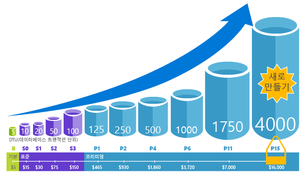
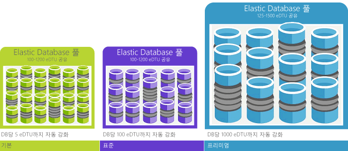

# Azure SQL Database 서비스란?What is the Azure SQL Database service? 

SQL Database는 관계형 데이터, 공간, JSON 및 XML과 같은 구조를 지원하는 Microsoft Azure의 범용 관계형 데이터베이스 서비스입니다.SQL Database is a general-purpose relational database service in Microsoft Azure that supports structures such as relational data, JSON, spatial, and XML. [동적으로 확장 가능한 성능](sql-database-service-tiers.md)을 제공하고 고도의 분석 및 보고를 위한 [columnstore 인덱스](https://docs.microsoft.com/sql/relational-databases/indexes/columnstore-indexes-overview) 및 고도의 트랜잭션 처리를 위한 [메모리 내 OLTP](sql-database-in-memory.md)와 같은 옵션을 제공합니다.It delivers [dynamically scalable performance](sql-database-service-tiers.md) and provides options such as [columnstore indexes](https://docs.microsoft.com/sql/relational-databases/indexes/columnstore-indexes-overview) for extreme analytic analysis and reporting, and [in-memory OLTP](sql-database-in-memory.md) for extreme transactional processing. Microsoft에서는 SQL 코드 베이스를 모두 원활하게 패치하고 업데이트하며 기본 인프라의 모든 관리를 추상화합니다.Microsoft handles all patching and updating of the SQL code base seamlessly and abstracts away all management of the underlying infrastructure. 

SQL Database는 [Microsoft SQL Server 데이터베이스 엔진](https://docs.microsoft.com/sql/sql-server/sql-server-technical-documentation)을 사용하여 코드 베이스를 공유합니다.SQL Database shares its code base with the [Microsoft SQL Server database engine](https://docs.microsoft.com/sql/sql-server/sql-server-technical-documentation). Microsoft의 클라우드 우선 전략을 사용하여 SQL Server의 최신 기능을 SQL Database에 먼저 릴리스한 다음 SQL Server 자체에 릴리스합니다.With Microsoft's cloud-first strategy, the newest capabilities of SQL Server are released first to SQL Database, and then to SQL Server itself. 이 방법은 패치 기능 또는 업그레이드에 대한 오버헤드 없이 수백만 개의 데이터베이스에 대해 테스트된 이러한 새로운 기능을 사용하여 최신 SQL Server 기능을 제공합니다.This approach provides you with the newest SQL Server capabilities with no overhead for patching or upgrading - and with these new features tested across millions of databases. 별도로 공지된 새로운 기능에 대한 내용은 다음을 참조하세요.For information about new capabilities as they are announced, see:

- **[SQL Database의 Azure 로드맵](https://azure.microsoft.com/roadmap/?category=databases)**: 새로운 기능과 향후 제공될 기능을 확인할 수 있습니다.**[Azure Roadmap for SQL Database](https://azure.microsoft.com/roadmap/?category=databases)**: A place to find out what’s new and what’s coming next. 
- **[Azure SQL Database 블로그](https://azure.microsoft.com/blog/topics/database)**: SQL Database 뉴스 및 기능에 대한 SQL Server 제품 팀 구성원 블로그를 확인할 수 있습니다.**[Azure SQL Database blog](https://azure.microsoft.com/blog/topics/database)**: A place where SQL Server product team members blog about SQL Database news and features. 

SQL Database는 가동 중지 시간 없이 기본 제공 지능형 최적화, 전역 확장성과 가용성 및 고급 보안 옵션을 포함하여 동적 확장성을 제공하는 여러 서비스 수준에서 별도로 관리하지 않고도 예측 가능한 성능을 제공합니다.SQL Database delivers predictable performance at multiple service levels that provides dynamic scalability with no downtime, built-in intelligent optimization, global scalability and availability, and advanced security options — all with near-zero administration. 이러한 기능을 사용하면 가상 컴퓨터와 인프라를 관리하는 데 귀중한 시간과 리소스를 할당하는 대신 빠른 앱 개발에 집중하고 시장 출시 시간을 단축할 수 있습니다.These capabilities allow you to focus on rapid app development and accelerating your time to market, rather than allocating precious time and resources to managing virtual machines and infrastructure. SQL Database는 현재 전 세계에서 38개의 데이터 센터에 제공되며, 주변의 데이터 센터에서 데이터베이스를 실행할 수 있도록 정기적으로 더 많은 데이터 센터가 온라인될 예정입니다.The SQL Database service is currently in 38 data centers around the world, with more data centers coming online regularly, which enables you to run your database in a data center near you.

> [!NOTE]
> Azure의 플랫폼 보안에 대한 자세한 내용을 보려면 [Azure 보안 센터](https://azure.microsoft.com/support/trust-center/security/)를 참조하세요.See [Azure Trust Center](https://azure.microsoft.com/support/trust-center/security/) for information about Azure's platform security.
>

## 확장 가능한 성능 및 풀Scalable performance and pools

SQL Database에서 각 데이터베이스는 보장된 성능 수준에서 고유한 [서비스 계층](sql-database-service-tiers.md)으로 서로 격리되고 이식 가능합니다.With SQL Database, each database is isolated from each other and portable, each with its own [service tier](sql-database-service-tiers.md) with a guaranteed performance level. SQL Database는 다른 요구 사항에 대해 다른 성능 수준을 제공하며 데이터베이스가 리소스 사용을 최대화하고 비용을 절감하도록 풀링할 수 있습니다.SQL Database provides different performance levels for different needs, and enables databases to be pooled to maximize the use of resources and save money.

### 가동 중지 시간 없이 성능 및 규모 조정Adjust performance and scale without downtime

SQL Database는 경량부터 중량까지의 데이터베이스 워크로드를 지원하도록 Basic, Standard, Premium 및 Premium RS라는 4개의 서비스 계층을 제공합니다.SQL Database offers four service tiers to support lightweight to heavyweight database workloads: Basic, Standard, Premium, and Premium RS. 매달 적은 비용으로 작은 단일 데이터베이스에 첫 번째 앱을 빌드한 다음 언제든지 수동 또는 프로그래밍 방식으로 서비스 계층을 변경하여 솔루션의 요구 사항을 충족시킬 수 있습니다.You can build your first app on a small, single database at a low cost per month and then change its service tier manually or programmatically at any time to meet the needs of your solution. 앱이나 고객에게 가동 중지 시간 없이 성능을 조정할 수 있습니다.You can adjust performance without downtime to your app or to your customers. 동적 확장성을 통해 데이터베이스는 급변하는 리소스 요구 사항에 투명하게 대응할 수 있으며, 필요할 때 필요한 리소스에 대해서만 비용을 지불할 수 있습니다.Dynamic scalability enables your database to transparently respond to rapidly changing resource requirements and enables you to only pay for the resources that you need when you need them.

   

### 리소스 사용률 극대화를 위한 탄력적 풀Elastic pools to maximize resource utilization

특히 사용 패턴이 비교적 예측 가능한 경우 많은 비즈니스 및 응용 프로그램에서 단일 데이터베이스를 만들고 필요에 따라 충분히 성능을 확장하거나 축소할 수 있습니다.For many businesses and applications, being able to create single databases and dial performance up or down on demand is enough, especially if usage patterns are relatively predictable. 하지만 사용 패턴을 예측할 수 없는 경우 비용과 비즈니스 모델을 관리하기 어려워질 수 있습니다.But if you have unpredictable usage patterns, it can make it hard to manage costs and your business model. [탄력적 풀](sql-database-elastic-pool.md)은 이 문제를 해결하도록 설계되었습니다.[Elastic pools](sql-database-elastic-pool.md) are designed to solve this problem. 개념은 간단합니다.The concept is simple. 개별 데이터베이스가 아니라 풀에 성능 리소스를 할당하고 단일 데이터베이스 성능이 아니라 풀의 집합적 성능 리소스에 대해 요금을 지불합니다.You allocate performance resources to a pool rather than an individual database, and pay for the collective performance resources of the pool rather than for single database performance. 

   

탄력적 풀을 사용하면 리소스에 대한 요구가 변동함에 따라 데이터베이스 성능을 높이거나 낮추는 데 집중할 필요가 없습니다.With elastic pools, you don’t need to focus on dialing database performance up and down as demand for resources fluctuates. 풀링된 데이터베이스는 필요에 따라 탄력적 풀의 성능 리소스를 사용합니다.The pooled databases consume the performance resources of the elastic pool as needed. 풀링된 데이터베이스는 풀의 한도를 사용하지만 초과하지 않으므로 개별 데이터베이스 사용량을 예측할 수 없는 경우에도 비용을 계속 예측할 수 있습니다.Pooled databases consume but don’t exceed the limits of the pool, so your cost remains predictable even if individual database usage doesn’t. 뿐만 아니라 [풀에 데이터베이스를 추가 및 제거](sql-database-elastic-pool-manage-portal.md)하여 소수의 데이터베이스에서 수천 개의 데이터베이스까지 자신이 관리하는 예산 범위 내에서 앱의 규모를 조정할 수 있습니다.What’s more, you can [add and remove databases to the pool](sql-database-elastic-pool-manage-portal.md), scaling your app from a handful of databases to thousands, all within a budget that you control. 풀의 데이터베이스에서 사용할 수 있는 최소 및 최대 리소스를 제어하여 풀의 어떤 데이터베이스도 풀 리소스 전체를 사용하지 못하도록 하고 풀링된 모든 데이터베이스에 최소한의 리소스를 보장할 수 있습니다.You can also control the minimum and maximum resources available to databases in the pool to ensure that no database in the pool uses all the pool resources and that every pooled database has a guaranteed minimum amount of resources. 탄력적 풀을 사용한 SaaS 응용 프로그램의 디자인 패턴에 대해 자세히 알아보려면 [SQL Database를 사용한 다중 테넌트 SaaS 응용 프로그램 디자인 패턴](sql-database-design-patterns-multi-tenancy-saas-applications.md)을 참조하세요.To learn more about design patterns for SaaS applications using elastic pools, see [Design Patterns for Multi-tenant SaaS Applications with SQL Database](sql-database-design-patterns-multi-tenancy-saas-applications.md).

### 단일 데이터베이스와 풀링된 데이터베이스의 혼합Blend single databases with pooled databases

사용자는 단일 데이터베이스와 탄력적 풀 중 어느 한 쪽으로만 한정되지는 않습니다.Either way you go — single databases or elastic pools — you are not locked in. 즉 단일 데이터베이스와 탄력적 풀을 혼합하고, 단일 데이터베이스와 탄력적 풀의 서비스 계층을 상황에 맞게 빠르고 쉽게 변경할 수 있습니다.You can blend single databases with elastic pools, and change the service tiers of single databases and elastic pools quickly and easily to adapt to your situation. Azure의 성능 및 도달 범위를 바탕으로 다른 Azure 서비스를 SQL Database와 조합하여 사용하면 고유한 앱 설계 요구를 충족시키고, 비용 및 리소스를 효율적으로 운용하고, 새로운 비즈니스 기회를 만들 수 있습니다.With the power and reach of Azure, you can mix-and-match other Azure services with SQL Database to meet your unique app design needs, drive cost and resource efficiencies, and unlock new business opportunities.

### 광범위한 모니터링 및 경고 기능Extensive monitoring and alerting capabilities

그러나 단일 데이터베이스와 탄력적 풀의 상대적 성능을 비교하려면 어떻게 해야 합니까?But how can you compare the relative performance of single databases and elastic pools? 확장 및 축소할 때 마우스 오른쪽 단추 클릭이 정지하는 것을 어떻게 알 수 있습니까?How do you know the right click-stop when you dial up and down? [단일 데이터베이스의 DTU(데이터베이스 트랜잭션 단위) 및 탄력적 풀의 eDTU(탄력적 DTU)](sql-database-what-is-a-dtu.md)에 기반한 성능 등급과 결합된 [기본 제공 성능 모니터링](sql-database-performance.md) 및 [경고](sql-database-insights-alerts-portal.md) 도구를 사용합니다.You use the [built-in performance monitoring](sql-database-performance.md) and [alerting](sql-database-insights-alerts-portal.md) tools, combined with the performance ratings based on [Database Transaction Units (DTUs) for single databases and elastic DTUs (eDTUs) for elastic pools](sql-database-what-is-a-dtu.md). 이 도구를 사용하면 현재 또는 프로젝트의 성능 요구에 기반하여 확장 또는 축소의 영향을 신속하게 평가할 수 있습니다.Using these tools, you can quickly assess the impact of scaling up or down based on your current or project performance needs. 자세한 내용은 [SQL 데이터베이스 옵션 및 성능: 각 서비스 계층에서 사용할 수 있는 것 이해](sql-database-service-tiers.md) 를 참조하세요.See [SQL Database options and performance: Understand what's available in each service tier](sql-database-service-tiers.md) for details.

또한 SQL Database는 쉬운 모니터링을 위해 [메트릭 및 진단 로그를 내보낼](sql-database-metrics-diag-logging.md) 수 있습니다.Additionally, SQL Database can [emit metrics and diagnostic logs](sql-database-metrics-diag-logging.md) for easier monitoring. 리소스 사용량, 작업자와 세션 및 연결을 이러한 Azure 리소스 중 하나에 저장하도록 SQL Database를 구성할 수 있습니다.You can configure SQL Database to store resource usage, workers and sessions, and connectivity into one of these Azure resources:

- **Azure Storage**: 작은 가격으로 방대한 양의 원격 분석을 보관하는 경우**Azure Storage**: For archiving vast amounts of telemetry for a small price
- **Azure Event Hub**: 사용자 지정 모니터링 솔루션 또는 핫 파이프라인과 SQL Database 원격 분석을 통합하는 경우**Azure Event Hub**: For integrating SQL Database telemetry with your custom monitoring solution or hot pipelines
- **Azure Log Analytics**: 보고, 경고 및 완화 기능을 사용하는 기본 제공 모니터링 솔루션의 경우**Azure Log Analytics**: For built-in monitoring solution with reporting, alerting, and mitigating capabilities

    

## 가용성 기능Availability capabilities

Azure의 업계 선도적인 99.99% 가용성 [SLA](http://azure.microsoft.com/support/legal/sla/)(서비스 수준 계약)를 Microsoft에서 관리되는 전 세계 데이터 센터 네트워크의 지원을 받아 앱을 연중 무휴(24/7)로 실행할 수 있습니다.Azure's industry leading 99.99% availability service level agreement [(SLA)](http://azure.microsoft.com/support/legal/sla/), powered by a global network of Microsoft-managed datacenters, helps keep your app running 24/7. 또한 SQL Database는 다음을 포함하여 기본 제공 [비즈니스 연속성 및 글로벌 확장성](sql-database-business-continuity.md) 기능을 제공합니다.In addition, SQL Database provides built-in [business continuity and global scalability](sql-database-business-continuity.md) features, including:

- **[자동 백업](sql-database-automated-backups.md)**: SQL Database는 전체, 차등 및 트랜잭션 로그 백업을 자동으로 수행합니다.**[Automatic backups](sql-database-automated-backups.md)**: SQL Database automatically performs full, differential, and transaction log backups.
- **[지정 시간 복구](sql-database-recovery-using-backups.md)**: SQL Database는 자동 백업 보존 기간 내에 모든 시점으로 복구하도록 지원합니다.**[Point-in-time restores](sql-database-recovery-using-backups.md)**: SQL Database supports recovery to any point in time within the automatic backup retention period.
- **[활성 지역 복제](sql-database-geo-replication-overview.md)**: SQL Database를 사용하면 세계적으로 분산된 Azure 데이터 센터 중 하나에서 최대 4개의 읽기 가능한 보조 데이터베이스를 구성할 수 있습니다.**[Active geo-replication](sql-database-geo-replication-overview.md)**: SQL Database allows you to configure up to four readable secondary databases in either the same or globally distributed Azure data centers.  예를 들어 읽기 전용 동시 트랜잭션 양이 많은 카탈로그 데이터베이스와 SaaS 응용 프로그램이 있는 경우 활성 지역 복제를 사용하여 세계적인 읽기 규모를 사용하도록 설정하고 읽기 워크로드로 인한 주 서버의 병목 상태를 제거합니다.For example, if you have a SaaS application with a catalog database that has a high volume of concurrent read-only transactions, use active geo-replication to enable global read scale and remove bottlenecks on the primary that are due to read workloads. 
- **[장애 조치 그룹](sql-database-geo-replication-overview.md)**: SQL Database를 사용하면 큰 집합의 데이터베이스와 탄력적 풀에 대해 투명한 지역에서 복제 및 장애 조치를 포함하여 세계적인 규모로 고가용성 및 부하 분산을 사용할 수 있습니다.**[Failover groups](sql-database-geo-replication-overview.md)**: SQL Database allows you to enable high availability and load balancing at global scale, including transparent geo-replication and failover of large sets of databases and elastic pools. 장애 조치 그룹 및 활성 지역 복제를 사용하면 SQL Database에 대한 복잡한 모니터링, 라우팅 및 장애 조치 오케스트레이션 없이 최소한의 관리 오버헤드를 포함하여 전 세계적으로 분산된 SaaS 응용 프로그램을 만들 수 있습니다.Failover groups and active geo-replication enables creation of globally distributed SaaS applications with minimal administration overhead leaving all the complex monitoring, routing, and failover orchestration to SQL Database.

## 기본 제공 인텔리전스Built-in intelligence

SQL Database에서 기본 제공 인텔리전스를 통해 데이터베이스를 실행하고 관리하는 비용을 크게 줄이고 응용 프로그램의 성능과 보안을 모두 극대화할 수 있습니다.With SQL Database, you get built-in intelligence that helps you dramatically reduce the costs of running and managing databases and maximizes both performance and security of your application. SQL Database는 수백만 개의 고객 워크로드를 24시간 실행하여 많은 양의 원격 분석 데이터를 수집하고 처리하는 동시에 고객 개인 정보를 완벽하게 관리합니다.Running millions of customer workloads around-the-clock, SQL Database collects and processes a massive amount of telemetry data, while also fully respecting customer privacy behind the scenes. 다양한 알고리즘은 서비스가 응용 프로그램에 적용될 수 있도록 지속적으로 원격 분석 데이터를 평가합니다.Various algorithms are continuously evaluating the telemetry data so that the service can learn and adapt with your application. 이 분석을 기반으로 서비스에서는 특정 워크로드에 맞게 성능 개선 권장 사항을 제공합니다.Based on this analysis, the service comes up with performance improving recommendations tailored to your specific workload. 

### 자동 성능 튜닝Automatic performance tuning

SQL Database는 모니터링해야 하는 쿼리에 대한 자세한 정보를 제공합니다.SQL Database provides detailed insight into the queries that you need to monitor. SQL Database는 데이터베이스 패턴을 인식하고 워크로드에 맞게 데이터베이스 스키마를 적용할 수 있습니다.SQL Database's learns about your database patterns and enables you to adapt your database schema to your workload. SQL Database는 [SQL Database Advisor](sql-database-advisor.md)를 사용하여 성능 튜닝 권장 구성을 제공하고 튜닝 작업을 검토하고 적용할 수 있습니다.SQL Database provides performance tuning recommendations using  [SQL Database Advisor](sql-database-advisor.md), where you can review tuning actions and apply them. 그러나 지속적으로 데이터베이스를 모니터링하는 것은 특히 많은 데이터베이스를 처리할 때 힘들고 지루한 작업입니다.However, constantly monitoring database is a hard and tedious task, especially when dealing with many databases. SQL Database 및 Azure Portal에서 제공하는 모든 사용 가능한 도구 및 보고서를 사용하더라도 상당히 많은 데이터베이스를 효율적으로 관리하기 어려울 수 있습니다.Managing a huge number of databases might be impossible to do efficiently even with all available tools and reports that SQL Database and Azure portal provide. 수동으로 데이터베이스를 모니터링하고 튜닝하는 대신 자동 튜닝 기능을 사용하여 SQL Database에 대한 모니터링 및 튜닝 작업을 위임하도록 고려할 수 있습니다.Instead of monitoring and tuning your database manually, you might consider delegating some of the monitoring and tuning actions to SQL Database using automatic tuning feature. SQL Database는 권장 사항, 테스트를 자동으로 적용하고 해당 튜닝 작업을 확인하여 성능이 계속 향상되도록 합니다.SQL Database automatically apply recommendations, tests, and verifies each of its tuning actions to ensure the performance keeps improving. 이러한 방식으로 SQL Database는 자동으로 안전하게 제어된 방법으로 워크로드에 적용됩니다.This way, SQL Database automatically adapts to your workload in controlled and safe way. 자동 튜닝은 데이터베이스 성능을 신중하게 모니터링하고 모든 튜닝 작업 전후와 비교함을 의미합니다. 성능이 개선되지 않는 경우 튜닝 작업은 되돌려집니다.Automatic tuning means that the performance of your database is carefully monitored and compared before and after every tuning action, and if the performance doesn’t improve, the tuning action is reverted.

현재 SQL Database를 기반으로 [SaaS 다중 테넌트 앱](sql-database-design-patterns-multi-tenancy-saas-applications.md)을 실행하는 파트너는 대부분 자동 성능 튜닝을 사용하여 응용 프로그램이 항상 안정적이고 예측 가능한 성능을 제공하도록 합니다.Today, many of our partners running [SaaS multi-tenant apps](sql-database-design-patterns-multi-tenancy-saas-applications.md) on top of SQL Database are relying on automatic performance tuning to make sure their applications always have stable and predictable performance. 이 기능은 갑자기 성능 인시던트가 발생하는 위험을 크게 줄여 줍니다.For them, this feature tremendously reduces the risk of having a performance incident in the middle of the night. 또한 일부 해당 고객이 SQL Server를 사용하기 때문에 SQL Database에서 제공하는 동일한 인덱싱 권장 사항을 사용하여 SQL Server 고객을 도울 수 있습니다.In addition, since part of their customer base also uses SQL Server, they are using the same indexing recommendations provided by SQL Database to help their SQL Server customers.

SQL Database에서 사용할 수 있는 두 가지 자동 튜닝 측면이 있습니다.There are two automatic tuning aspects that are available in SQL Database:

- **[자동 인덱스 관리](sql-database-automatic-tuning.md#automatic-index-management)**: 데이터베이스에 추가되어야 하는 인덱스 및 제거되어야 하는 인덱스를 식별합니다.**[Automatic index management](sql-database-automatic-tuning.md#automatic-index-management)**: Identifies indexes that should be added in your database, and indexes that should be removed.
- **[자동 계획 수정](sql-database-automatic-tuning.md#automatic-plan-choice-correction)**: 문제가 있는 계획을 식별하고 SQL 계획 성능 문제를 해결합니다(출시 예정, SQL Server 2017에서 이미 사용 가능).**[Automatic plan correction](sql-database-automatic-tuning.md#automatic-plan-choice-correction)**: Identifies problematic plans and fixes SQL plan performance problems (coming soon, already available in SQL Server 2017).

### 적응 쿼리 처리Adaptive query processing

또한 다중 문 테이블 반환 함수, 일괄 처리 모드 메모리 부여 피드백 및 일괄 처리 모드 적응 조인에 대해 인터리브된 실행을 포함하여 [적응 쿼리 처리](/sql/relational-databases/performance/adaptive-query-processing) 기능 모음을 SQL Database에 추가하려고 합니다.We are also adding the [adaptive query processing](/sql/relational-databases/performance/adaptive-query-processing) family of features to SQL Database, including interleaved execution for multi-statement table-valued functions, batch mode memory grant feedback, and batch mode adaptive joins. 이러한 적응 쿼리 처리 기능은 각각 유사한 "알아보기 및 적용" 방법을 적용하고 지금까지 다루기 힘든 쿼리 최적화 문제와 관련된 성능 문제를 추가로 해결할 수 있도록 합니다.Each of these adaptive query processing features applies similar “learn and adapt” techniques, helping further address performance issues related to historically intractable query optimization problems.

### 지능형 위협 검색Intelligent threat detection

 [SQL 위협 요소 감지](sql-database-threat-detection.md)는 [SQL Database 감사](sql-database-auditing.md)를 활용하여 중요한 데이터에 액세스하는 잠재적으로 위험한 시도에 대해 Azure SQL Database를 지속적으로 모니터링합니다.[SQL Threat Detection](sql-database-threat-detection.md) leverages [SQL Database auditing](sql-database-auditing.md) to continuously monitor Azure SQL databases for potentially harmful attempts to access sensitive data. SQL 위협 감지는 비정상적인 활동에 대한 보안 경고를 제공하여 잠재적인 위협이 발생하면 고객이 이를 감지하고 대응할 수 있도록 하는 새로운 차원의 보안을 제공합니다.SQL threat detection provides a new layer of security, which enables customers to detect and respond to potential threats as they occur by providing security alerts on anomalous activities. 사용자는 의심스러운 데이터베이스 활동, 잠재적 취약성 및 SQL 삽입 공격은 물론 비정상적인 데이터베이스 액세스 패턴에 대한 경고를 받게 됩니다.Users receive alerts upon suspicious database activities, potential vulnerabilities, and SQL injection attacks, and anomalous database access patterns. SQL 위협 감지 경고는 의심스러운 활동에 대한 세부 정보 제공하고 위협을 조사하고 완화하는 방법에 대한 조치를 권장합니다.SQL threat detection alerts provide details of suspicious activity and recommend action on how to investigate and mitigate the threat. 사용자는 데이터베이스의 데이터에 액세스, 침범 또는 악용하려는 시도로 이벤트가 발생했는지를 결정하기 위해서 의심스러운 이벤트를 탐색할 수 있습니다.Users can explore the suspicious events to determine if the event results from an attempt to access, breach, or exploit data in the database. 위협 감지는 보안 전문가가 되거나 고급 보안 모니터링 시스템을 관리할 필요 없이 데이터베이스에 대한 잠재적인 위협에 간단하게 대처할 수 있도록 합니다.Threat detection makes it simple to address potential threats to the database without the need to be a security expert or manage advanced security monitoring systems.

## 고급 보안 및 규정 준수Advanced security and compliance

SQL Database는 다양한 [기본 제공 보안 및 규정 준수 기능](sql-database-security-overview.md)을 제공하여 응용 프로그램이 다양한 보안 및 규정 준수 요구 사항을 충족할 수 있도록 합니다.SQL Database provides a range of [built-in security and compliance features](sql-database-security-overview.md) to help your application meet various security and compliance requirements. 

### 규정 준수 및 보안에 대한 감사Auditing for compliance and security

[SQL Database 감사](sql-database-auditing.md)는 데이터베이스 이벤트를 추적하고 Azure 저장소 계정의 감사 로그에 이벤트를 기록합니다.[SQL Database Auditing](sql-database-auditing.md) tracks database events and writes them to an audit log in your Azure storage account. 감사는 규정 준수를 유지 관리하고, 데이터베이스 작업을 이해하고, 비즈니스 문제나 의심스러운 보안 위반을 나타낼 수 있는 불일치 및 이상 활동을 파악하는 데 도움이 될 수 있습니다.Auditing can help you maintain regulatory compliance, understand database activity, and gain insight into discrepancies and anomalies that could indicate business concerns or suspected security violations.

### 휴지 상태의 암호화Data encryption at rest

SQL Database [투명한 데이터 암호화](https://docs.microsoft.com/sql/relational-databases/security/encryption/transparent-data-encryption-with-azure-sql-database)는 응용 프로그램에 대한 변경 요구 없이 데이터베이스, 연결된 백업 및 저장된 트랜잭션 로그 파일에 대한 실시간 암호화 및 암호 해독을 수행하여 악의적인 활동의 위협으로부터 보호합니다.SQL Database [transparent data encryption](https://docs.microsoft.com/sql/relational-databases/security/encryption/transparent-data-encryption-with-azure-sql-database) helps protect against the threat of malicious activity by performing real-time encryption and decryption of the database, associated backups, and transaction log files at rest without requiring changes to the application. 2017년 5월부터 시작하여 새로 만든 모든 Azure SQL Database는 TDE(투명한 데이터 암호화)를 사용하여 자동으로 보호됩니다.Starting in May 2017, all newly created Azure SQL databases are automatically protected with transparent data encryption (TDE). TDE는 저장소 미디어의 도용으로부터 보호하기 위해 많은 규정 준수 표준에 필요한 정지된 암호화 기술로써 SQL에서 입증되었습니다.TDE is SQL’s proven encryption-at-rest technology that is required by many compliance standards to protect against theft of storage media. 고객은 Azure Key Vault를 사용하여 TDE 암호화 키 및 다른 비밀을 안전한 규격 방식으로 관리할 수 있습니다.Customers can manage the TDE encryption keys and other secrets in a secure and compliant manner using Azure Key Vault.

### 진행 중인 데이터 암호화Data encryption in motion

SQL Database는 [Always Encrypted](https://docs.microsoft.com/sql/relational-databases/security/encryption/always-encrypted-database-engine)를 사용하여 쿼리를 처리하는 동안 전송 중인 중요한 미사용 데이터의 보호를 제공하는 유일한 데이터베이스 시스템입니다.SQL Database is the only database system to offer protection of sensitive data in flight, at rest and during query processing with [Always Encrypted](https://docs.microsoft.com/sql/relational-databases/security/encryption/always-encrypted-database-engine). Always Encrypted는 중요한 데이터의 도용을 비롯한 위반에 대해 최상의 데이터 보안을 제공하는 업계 최고의 기능입니다.Always Encrypted is an industry-first that offers unparalleled data security against breaches involving the theft of critical data. 예를 들어 Always Encrypted를 사용하여 쿼리를 처리하는 동안에도 고객의 신용 카드 번호가 데이터베이스에 암호화되어 저장됩니다. 또한 해당 데이터를 처리해야 하는 권한이 부여된 직원 또는 응용 프로그램에 의해 사용 시점에 암호를 해독할 수 있습니다.For example, with Always Encrypted, customers’ credit card numbers are stored encrypted in the database always, even during query processing, allowing decryption at the point of use by authorized staff or applications that need to process that data.

### 동적 데이터 마스킹Dynamic data masking

[SQL Database 동적 데이터 마스킹](sql-database-dynamic-data-masking-get-started.md)에서는 권한이 없는 사용자에 대해 중요한 데이터를 마스킹해 표시함으로써 데이터 노출을 제한합니다.[SQL Database dynamic data masking](sql-database-dynamic-data-masking-get-started.md) limits sensitive data exposure by masking it to non-privileged users. 동적 데이터 마스킹을 수행하면 고객이 응용 프로그램 레이어에 대한 영향을 최소화하면서 표시할 중요한 데이터의 양을 지정할 수 있도록 하여 중요한 데이터에 대한 무단 액세스를 방지할 수 있습니다.Dynamic data masking helps prevent unauthorized access to sensitive data by enabling customers to designate how much of the sensitive data to reveal with minimal impact on the application layer. 동적 데이터 마스킹은 지정된 데이터베이스 필드에 대한 쿼리의 결과 집합에서 중요한 데이터를 숨기는 정책 기반 보안 기능입니다. 이때 데이터베이스의 데이터 자체는 변경되지 않습니다.It’s a policy-based security feature that hides the sensitive data in the result set of a query over designated database fields, while the data in the database is not changed.

### 행 수준 보안Row-level security

[행 수준 보안](https://docs.microsoft.com/sql/relational-databases/security/row-level-security)을 통해 고객은 쿼리를 실행하는 사용자의 특성(예: 그룹 멤버 자격 또는 실행 컨텍스트)을 기반으로 하여 데이터베이스 테이블의 행에 대한 액세스를 제어할 수 있습니다.[Row-level security](https://docs.microsoft.com/sql/relational-databases/security/row-level-security) enables customers to control access to rows in a database table based on the characteristics of the user executing a query (such as by group membership or execution context). RLS(행 수준 보안)는 응용 프로그램의 보안 설계 및 코딩을 간소화합니다.Row-level security (RLS) simplifies the design and coding of security in your application. RLS를 사용하면 데이터 행 액세스에 대한 제한을 구현할 수 있습니다.RLS enables you to implement restrictions on data row access. 예를 들어 작업자가 자신의 부서와 관련된 데이터 행에만 액세스하거나 고객의 데이터 액세스를 회사와 관련된 데이터만으로 제한할 수 있습니다.For example ensuring that workers can access only those data rows that are pertinent to their department, or restricting a customer's data access to only the data relevant to their company.

### Azure Active Directory 통합 및 Multi-Factor AuthenticationAzure Active Directory integration and multi-factor authentication

SQL Database를 사용하면 [Azure Active Directory 통합](sql-database-aad-authentication.md)에서 데이터베이스 사용자 및 다른 Microsoft 서비스의 ID를 중앙 집중식으로 관리할 수 있습니다.SQL Database enables you to centrally manage identities of database user and other Microsoft services with [Azure Active Directory integration](sql-database-aad-authentication.md). 이 기능은 사용 권한 관리를 간소화하고 보안을 향상시킵니다.This capability simplified permission management and enhances security. Azure Active Directory는 MFA([Multi-Factor Authentication](sql-database-ssms-mfa-authentication.md))을 제공하여 단일 로그인 프로세스를 지원하는 동시에 데이터 및 응용 프로그램 보안을 향상시킵니다.Azure Active Directory supports [multi-factor authentication](sql-database-ssms-mfa-authentication.md) (MFA) to increase data and application security while supporting a single sing-in process.

### 규정 준수 인증Compliance certification

SQL Database는 일반 감사에 참여하고 몇 가지 준수 표준에 대해 인증됩니다.SQL Database participates in regular audits and has been certified against several compliance standards. 자세한 내용은 [Microsoft Azure 보안 센터](https://azure.microsoft.com/support/trust-center/)를 참조하세요. 여기서 최신 [SQL Database 규정 준수 인증서](https://azure.microsoft.com/support/trust-center/services/) 목록을 찾을 수 있습니다.For more information, see the [Microsoft Azure Trust Center](https://azure.microsoft.com/support/trust-center/), where you can find the most current list of [SQL Database compliance certifications](https://azure.microsoft.com/support/trust-center/services/).

## 사용하기 쉬운 도구Easy-to-use tools

SQL Database로 응용 프로그램을 빌드하고 관리하는 작업의 편의성과 생산성을 높이세요.SQL Database makes building and maintaining applications easier and more productive. SQL Database를 사용하면 멋진 앱을 만드는 데만 집중할 수 있습니다.SQL Database allows you to focus on what you do best: building great apps. 이미 설치된 도구와 기술을 사용하여 SQL Database에서 관리하고 개발할 수 있습니다.You can manage and develop in SQL Database using tools and skills you already have.

- **[Azure Portal](https://portal.azure.com/)**: 모든 Azure 서비스를 관리하는 웹 기반 응용 프로그램**[The Azure portal](https://portal.azure.com/)**: A web-based application for managing all Azure services 
- **[SQL Server Management Studio](https://docs.microsoft.com/sql/ssms/download-sql-server-management-studio-ssms)**: SQL Server에서 SQL Database에 이르는 모든 SQL 인프라를 관리하는 체험 다운로드 가능한 클라이언트 응용 프로그램**[SQL Server Management Studio](https://docs.microsoft.com/sql/ssms/download-sql-server-management-studio-ssms)**: A free, downloadable client application for managing any SQL infrastructure, from SQL Server to SQL Database
- **[Visual Studio의 SQL Server Data Tools](https://docs.microsoft.com/sql/ssdt/download-sql-server-data-tools-ssdt)**: SQL Server 관계형 데이터베이스, Azure SQL Database, Integration Services 패키지, Analysis Services 데이터 모델 및 Reporting Services 보고서를 개발하는 체험 다운로드 가능한 클라이언트 응용 프로그램**[SQL Server Data Tools in Visual Studio](https://docs.microsoft.com/sql/ssdt/download-sql-server-data-tools-ssdt)**: A free, downloadable client application for developing SQL Server relational databases, Azure SQL databases, Integration Services packages, Analysis Services data models, and Reporting Services reports.
- **[Visual Studio Code](https://code.visualstudio.com/docs)**: Microsoft SQL Server, Azure SQL Database 및 SQL Data Warehouse를 쿼리하는 [mssql 확장](https://aka.ms/mssql-marketplace)을 비롯한 여러 확장을 지원하는 Windows, macOS 및 Linux용 체험 다운로드 가능한 오픈 소스 코드 편집기**[Visual Studio Code](https://code.visualstudio.com/docs)**: a free, downloadable, open source, code editor for Windows, macOS, and Linux that supports extensions, including the [mssql extension](https://aka.ms/mssql-marketplace) for querying Microsoft SQL Server, Azure SQL Database, and SQL Data Warehouse.

SQL Database는 MacOS, Linux 및 Windows에서 Python, Java, Node.js, PHP, Ruby 및 .NET을 사용하여 응용 프로그램을 빌드하도록 지원합니다.SQL Database supports building applications with Python, Java, Node.js, PHP, Ruby, and .NET on the MacOS, Linux, and Windows. SQL Database는 동일한 [연결 라이브러리](sql-database-libraries.md)를 SQL Server로 지원합니다.SQL Database supports the same [connection libraries](sql-database-libraries.md) as SQL Server.

## SQL Server 엔지니어링 팀에 문의Engage with the SQL Server engineering team

- [DBA 스택 교환(영문)](https://dba.stackexchange.com/questions/tagged/sql-server): 데이터베이스 관리 관련 질문[DBA Stack Exchange](https://dba.stackexchange.com/questions/tagged/sql-server): Ask database administration questions
- [Stack Overflow(영문)](http://stackoverflow.com/questions/tagged/sql-server): 개발 관련 질문[Stack Overflow](http://stackoverflow.com/questions/tagged/sql-server): Ask development questions
- [MSDN 포럼](https://social.msdn.microsoft.com/Forums/en-US/home?category=sqlserver): 기술 관련 질문[MSDN Forums](https://social.msdn.microsoft.com/Forums/en-US/home?category=sqlserver): Ask technical questions
- [Microsoft Connect](https://connect.microsoft.com/SQLServer/Feedback): 버그 및 요청 기능 보고[Microsoft Connect](https://connect.microsoft.com/SQLServer/Feedback): Report bugs and request feature
- [Reddit](https://www.reddit.com/r/SQLServer/): SQL Server 관련 토론[Reddit](https://www.reddit.com/r/SQLServer/): Discuss SQL Server

## 다음 단계Next steps

- 단일 데이터베이스 및 탄력적 풀의 비용 비교 및 계산기는 [가격 책정 페이지](https://azure.microsoft.com/pricing/details/sql-database/)를 참조하세요.See the [pricing page](https://azure.microsoft.com/pricing/details/sql-database/) for single database and elastic pools cost comparisons and calculators.

- 이러한 빠른 시작을 참조하여 다음 항목을 시작하세요.See these quick starts to get you started:

  - [Azure Portal에서 SQL Database 만들기Create a SQL database in the Azure portal](sql-database-get-started-portal.md)  
  - [Azure CLI를 사용하여 SQL Database 만들기Create a SQL database with the Azure CLI](sql-database-get-started-cli.md)
  - [PowerShell을 사용하여 SQL Database 만들기Create a SQL database using PowerShell](sql-database-get-started-powershell.md)

- 일련의 Azure CLI 및 PowerShell 샘플은 다음을 참조하세요.For a set of Azure CLI and PowerShell samples, see:
  - [SQL Database에 대한 Azure CLI 샘플Azure CLI samples for SQL Database](sql-database-cli-samples.md)
  - [SQL Database에 대한 Azure PowerShell 샘플Azure PowerShell samples for SQL Database](sql-database-powershell-samples.md)
