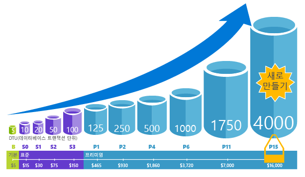
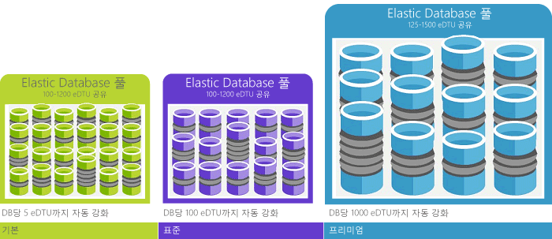

# DTU(데이터베이스 트랜잭션 단위) 및 eDTU(탄력적 데이터베이스 트랜잭션 단위) 설명Explaining Database Transaction Units (DTUs) and elastic Database Transaction Units (eDTUs)
이 문서에서는 DTU(데이터베이스 트랜잭션 단위) 및 eDTU(탄력적 데이터베이스 트랜잭션 단위)와 최대 DTU 또는 eDTU를 적중하는 경우 발생하는 상황에 대해 설명합니다.This article explains Database Transaction Units (DTUs) and elastic Database Transaction Units (eDTUs) and what happens when you hit the maximum DTUs or eDTUs.  

## DTU(데이터베이스 트랜잭션 단위)란?What are Database Transaction Units (DTUs)
[서비스 계층](sql-database-service-tiers.md#single-database-service-tiers-and-performance-levels) 내 특정 성능 수준에서 단일 Azure SQL Database의 경우 Microsoft는 해당 데이터베이스(Azure 클라우드의 다른 데이터베이스와는 무관)에 대해 특정 수준의 리소스를 보장하며 예측 가능한 성능 수준을 제공합니다.For a single Azure SQL database at a specific performance level within a [service tier](sql-database-service-tiers.md#single-database-service-tiers-and-performance-levels), Microsoft guarantees a certain level of resources for that database (independent of any other database in the Azure cloud) and providing a predictable level of performance. 이 리소스 양은 DTU(데이터베이스 트랜잭션 단위) 수로 계산되며 CPU, 메모리, I/O(데이터 및 트랜잭션 로그 I/O)의 혼합된 측정치입니다.This amount of resources is calculated as a number of Database Transaction Units or DTUs, and is a blended measure of CPU, memory, I/O (data and transaction log I/O). 이러한 리소스 간의 비율은 원래 실제 OLTP 워크로드에 맞게 디자인된 [OLTP 벤치마크 워크로드](sql-database-benchmark-overview.md)에 따라 결정됩니다.The ratio amongst these resources was originally determined by an [OLTP benchmark workload](sql-database-benchmark-overview.md) designed to be typical of real-world OLTP workloads. 워크로드가 이러한 리소스의 양을 초과하면 처리량이 제한되어 성능이 느려지고 시간이 초과됩니다.When your workload exceeds the amount of any of these resources, your throughput is throttled - resulting in slower performance and timeouts. 워크로드에서 사용되는 리소스는 Azure 클라우드의 다른 SQL Database에 사용할 수 있는 리소스에 영향을 주지 않고, 다른 워크로드에서 사용되는 리소스는 사용자의 SQL Database에 사용할 수 있는 리소스에 영향을 주지 않습니다.The resources used by your workload do not impact the resources available to other SQL databases in the Azure cloud, and the resource used by other workloads do not impact the resources available to your SQL database.

DTU는 다른 성능 수준 및 서비스 계층에서 Azure SQL Database 간의 리소스의 상대 크기를 이해하는 데 가장 유용합니다.DTUs are most useful for understanding the relative amount of resources between Azure SQL Databases at different performance levels and service tiers. 예를 들어 데이터베이스의 성능 수준을 증가시켜 DTU를 두 배로 높일 경우 해당 데이터베이스에 사용할 수 있는 리소스 집합이 동일하게 두 배로 높아집니다.For example, doubling the DTUs by increasing the performance level of a database equates to doubling the set of resource available to that database. 예를 들어 1750 DTU를 사용하는 프리미엄 P11 데이터베이스는 5개의 DTU를 사용하는 기본 데이터베이스보다 350배 더 많은 DTU 계산 기능을 제공합니다.For example, a Premium P11 database with 1750 DTUs provides 350x more DTU compute power than a Basic database with 5 DTUs.  

워크로드의 리소스(DTU) 소비에 대해 더 자세히 이해하려면 [Azure SQL Database Query Performance Insight](sql-database-query-performance.md)를 사용하여 다음을 수행합니다.To gain deeper insight into the resource (DTU) consumption of your workload, use [Azure SQL Database Query Performance Insight](sql-database-query-performance.md) to:

- 향상된 성능을 위해 잠재적으로 조정될 수 있는 CPU/기간/실행 횟수별 최상위 쿼리를 식별합니다.Identify the top queries by CPU/Duration/Execution count that can potentially be tuned for improved performance. 예를 들어 I/O 집약적인 쿼리는 [메모리 내 최적화 기술](sql-database-in-memory.md)을 사용하여 특정 서비스 계층 및 성능 수준에서 사용 가능한 메모리를 보다 효율적으로 사용할 수 있는 이점이 있습니다.For example, an I/O intensive query might benefit from the use of [in-memory optimization techniques](sql-database-in-memory.md) to make better use of the available memory at a certain service tier and performance level.
- 쿼리에 대한 세부 정보로 드릴다운하고, 해당 텍스트 및 리소스 사용률에 대한 기록을 확인합니다.Drill down into the details of a query, view its text and history of resource utilization.
- [SQL Database Advisor](sql-database-advisor.md)에서 수행한 작업을 표시하는 성능 조정 권장 사항에 액세스합니다.Access performance tuning recommendations that show actions performed by [SQL Database Advisor](sql-database-advisor.md).

응용 프로그램의 작동 중지를 최소로 하여 언제든지 [서비스 계층을 변경](sql-database-service-tiers.md) 할 수 있습니다(일반적으로 4초 이하 평균임).You can [change service tiers](sql-database-service-tiers.md) at any time with minimal downtime to your application (generally averaging under four seconds). 많은 업무와 앱에서, 특히 사용 패턴이 비교적 예측 가능한 경우 데이터베이스를 만들고 성능을 확장하거나 축소할 수 있으면 충분합니다.For many businesses and apps, being able to create databases and dial performance up or down on demand is enough, especially if usage patterns are relatively predictable. 하지만 사용 패턴을 예측할 수 없는 경우 비용과 비즈니스 모델을 관리하기 어려워질 수 있습니다.But if you have unpredictable usage patterns, it can make it hard to manage costs and your business model. 이 시나리오에서는 풀의 여러 데이터베이스 간에 공유되는 특정 수의 eDTU로 탄력적 풀을 사용합니다.For this scenario, you use an elastic pool with a certain number of eDTUs that are shared among multiple database in the pool.

## eDTU(탄력적 데이터베이스 트랜잭션 단위)란?What are elastic Database Transaction Units (eDTUs)
필요 여부에 관계없이 항상 사용할 수 있는 전용 리소스(DTU) 집합을 SQL Database에 제공하는 대신 해당 데이터베이스 간의 리소스 풀을 공유하는 SQL Database 서버의 [탄력적 풀](sql-database-elastic-pool.md)에 데이터베이스를 배치할 수 있습니다.Rather than provide a dedicated set of resources (DTUs) to a SQL Database that is always available regardless of whether needed not, you can place databases into an [elastic pool](sql-database-elastic-pool.md) on a SQL Database server that shares a pool of resources among those database. eDTU(Elastic Database 트랜잭션 단위)로 측정되는 탄력적 풀의 공유 리소스입니다.The shared resources in an elastic pool measured by elastic Database Transaction Units or eDTUs. 탄력적 풀은 매우 다양하고 예측할 수 없는 사용 패턴을 지닌 여러 데이터베이스에 대한 성능 목표를 관리하기 위한 간단하고 비용 효율적인 솔루션을 제공합니다.Elastic pools provide a simple cost effective solution to manage the performance goals for multiple databases that have widely varying and unpredictable usage patterns. 탄력적 풀에서 풀의 모든 리소스를 사용하는 데이터베이스는 없으며 또한 탄력적 풀의 데이터베이스에 언제나 최소한의 리소스는 사용할 수 있음을 보장할 수 있습니다.In an elastic pool, you can guarantee that no one database uses all of the resources in the pool and also that a minimum amount of resources is always available to a database in an elastic pool. 자세한 내용은 [탄력적 풀](sql-database-elastic-pool.md)을 참조하세요.See  [elastic pools](sql-database-elastic-pool.md) for more information.

풀은 집합 가격에 대한 eDTU 수 집합이 제공됩니다.A pool is given a set number of eDTUs, for a set price. 탄력적 풀에 속한 개별 데이터베이스는 구성된 경계 내에서 자동 크기 조정할 수 있습니다.Within the elastic pool, individual databases are given the flexibility to auto-scale within the configured boundaries. 부하가 높은 경우 데이터베이스에서 eDTU를 더 많이 사용하여 수요를 충족시킬 수 있지만, 부하가 낮은 경우에는 부하가 없어 eDTU를 전혀 사용하지 않을 때까지 데이터베이스에서 eDTU를 더 적게 사용합니다.Under heavy load, a database can consume more eDTUs to meet demand while databases under light loads consume less, up to the point that databases under no load consume no eDTUs. 데이터베이스가 아니라 전체 풀에 리소스를 프로비전하면 관리 작업을 간소화하고 예측 가능한 풀 예산을 확보할 수 있습니다.By provisioning resources for the entire pool, rather than per database, management tasks are simplified and you have a predictable budget for the pool.

추가 eDTU는 데이터베이스 가동 중지 시간 없이 풀의 데이터베이스에 영향을 주지 않은 채 기존 풀에 추가할 수 있습니다.Additional eDTUs can be added to an existing pool with no database downtime and with no impact on the databases in the pool. 마찬가지로 더 이상 필요하지 않은 추가 eDTU는 언제든지 기존 풀에서 제거할 수 있습니다.Similarly, if extra eDTUs are no longer needed, they can be removed from an existing pool at any point in time. 풀에서 데이터베이스를 추가하거나 제거하거나 다른 데이터베이스의 eDTU를 확보할 수 있도록 높은 부하에서 데이터베이스가 사용할 수 있는 eDTU 양을 제한할 수 있습니다.You can add or subtract databases to the pool, or limit the amount of eDTUs a database can use under heavy load to reserve eDTUs for other databases. 데이터베이스에서 예측 가능한 방식으로 리소스를 사용하는 경우 풀에서 이동할 수 있으며 예측 가능한 양의 리소스가 필요한 단일 데이터베이스로 구성할 수 있습니다.If a database is predictably under-utilizing resources, you can move it out of the pool and configure it as a single database with predictable amount of resources it requires.

## 내 워크로드에 필요한 DTU의 수를 결정하려면 어떻게 해야 하나요?How can I determine the number of DTUs needed by my workload?
기존 온-프레미스 또는 SQL Server 가상 컴퓨터 워크로드를 Azure SQL Database에 마이그레이션하려는 경우 [DTU 계산기](http://dtucalculator.azurewebsites.net/) 를 사용하여 필요한 DTU의 수를 대략적으로 계산할 수 있습니다.If you are looking to migrate an existing on-premises or SQL Server virtual machine workload to Azure SQL Database, you can use the [DTU Calculator](http://dtucalculator.azurewebsites.net/) to approximate the number of DTUs needed. 기존 Azure SQL Database 워크로드의 경우 워크로드를 최적화하는 방법에 대해 깊이 이해하기 위해 [SQL Database Query Performance Insight](sql-database-query-performance.md) 를 사용하여 데이터베이스 리소스 사용(DTU)을 이해할 수 있습니다.For an existing Azure SQL Database workload, you can use [SQL Database Query Performance Insight](sql-database-query-performance.md) to understand your database resource consumption (DTUs) to get deeper insight into how to optimize your workload. [sys.dm_db_ resource_stats](https://msdn.microsoft.com/library/dn800981.aspx) DMV를 사용하여 지난 1시간 동안 리소스 소비 정보를 얻을 수 있습니다.You can also use the [sys.dm_db_ resource_stats](https://msdn.microsoft.com/library/dn800981.aspx) DMV to get the resource consumption information for the last one hour. 또는 카탈로그 뷰 [sys.resource_stats](http://msdn.microsoft.com/library/dn269979.aspx)는 충실도가 평균 5분으로 더 낮지만 지난 14일 동안 동일한 데이터를 가져오도록 쿼리할 수 있습니다.Alternatively, the catalog view [sys.resource_stats](http://msdn.microsoft.com/library/dn269979.aspx) can also be queried to get the same data for the last 14 days, although at a lower fidelity of five-minute averages.

## 리소스의 탄력적 풀의 이점이 있다면 어떻게 알 수 있나요?How do I know if I could benefit from an elastic pool of resources?
풀은 특정 사용 패턴을 가진 많은 데이터베이스에 적합합니다.Pools are suited for a large number of databases with specific utilization patterns. 주어진 데이터 베이스에 대해, 이 패턴은 상대적으로 사용률 급증이 드물고 평균 사용률이 낮음으로 규정됩니다.For a given database, this pattern is characterized by low average utilization with relatively infrequent utilization spikes. SQL 데이터베이스는 기존 SQL 데이터베이스 서버에서 데이터베이스의 기록 리소스 사용률을 자동으로 평가하고 Azure 포털의 적절한 풀 구성을 권장합니다.SQL Database automatically evaluates the historical resource usage of databases in an existing SQL Database server and recommends the appropriate pool configuration in the Azure portal. 자세한 내용은 [탄력적 풀을 사용해야 하는 경우](sql-database-elastic-pool.md)를 참조하세요.For more information, see [when should an elastic pool be used?](sql-database-elastic-pool.md)

## 내 최대 DTU에 도달한 경우 어떻게 되나요?What happens when I hit my maximum DTUs
선택한 서비스 계층/성능 수준에 허용되는 최대 한도까지 데이터베이스 워크로드를 실행하는 데 필요한 리소스를 제공하도록 성능 수준이 보정 및 제어됩니다.Performance levels are calibrated and governed to provide the needed resources to run your database workload up to the max limits allowed for your selected service tier/performance level. 워크로드가 CPU/데이터 IO/로그 IO 한도 중 하나에서 한도에 도달할 경우 최대 허용 수준에서 계속 리소스를 수신하지만 쿼리의 대기 시간이 증가할 가능성이 큽니다.If your workload is hitting the limits in one of CPU/Data IO/Log IO limits, you continue to receive the resources at the maximum allowed level, but you are likely to see increased latencies for your queries. 속도 저하가 너무 심해서 쿼리 시간 초과가 시작되지 않으면 이러한 한도에 오류가 발생하지는 않지만 워크로드에서 작업 속도가 느려집니다.These limits do not result in any errors, but rather a slowdown in the workload, unless the slowdown becomes so severe that queries start timing out. 허용되는 최대 동시 사용자 세션/요청(작업자 스레드) 제한에 도달하면 명시적 오류가 표시됩니다.If you are hitting limits of maximum allowed concurrent user sessions/requests (worker threads), you see explicit errors. 메모리, 데이터 I/O 및 트랜잭션 로그 I/O가 아닌 CPU 리소스의 제한 사항에 대한 자세한 내용은 [Azure SQL Database 리소스 제한](sql-database-resource-limits.md) 을 참조하세요.See [Azure SQL Database resource limits](sql-database-resource-limits.md) for information on limit on resources other than CPU, memory, data I/O, and transaction log I/O.

## 다음 단계Next steps
* 단일 데이터베이스 및 탄력적 풀에 사용할 수 있는 DTU 및 eDTU에 대한 내용은 [서비스 계층](sql-database-service-tiers.md)을 참조하세요.See [Service tier](sql-database-service-tiers.md) for information on the DTUs and eDTUs available for single databases and for elastic pools.
* 메모리, 데이터 I/O 및 트랜잭션 로그 I/O가 아닌 CPU 리소스의 제한 사항에 대한 자세한 내용은 [Azure SQL Database 리소스 제한](sql-database-resource-limits.md) 을 참조하세요.See [Azure SQL Database resource limits](sql-database-resource-limits.md) for information on limit on resources other than CPU, memory, data I/O, and transaction log I/O.
* [SQL Database Query Performance Insight](sql-database-query-performance.md) 를 참조하여 DTU 소비를 이해합니다.See [SQL Database Query Performance Insight](sql-database-query-performance.md) to understand your (DTUs) consumption.
* DTU 혼합을 결정하는 데 사용되는 OLTP 벤치마크 워크로드의 방법론을 이해하려면 [SQL Database 벤치마크 개요](sql-database-benchmark-overview.md) 를 참조하세요.See [SQL Database benchmark overview](sql-database-benchmark-overview.md) to understand the methodology behind the OLTP benchmark workload used to determine the DTU blend.
