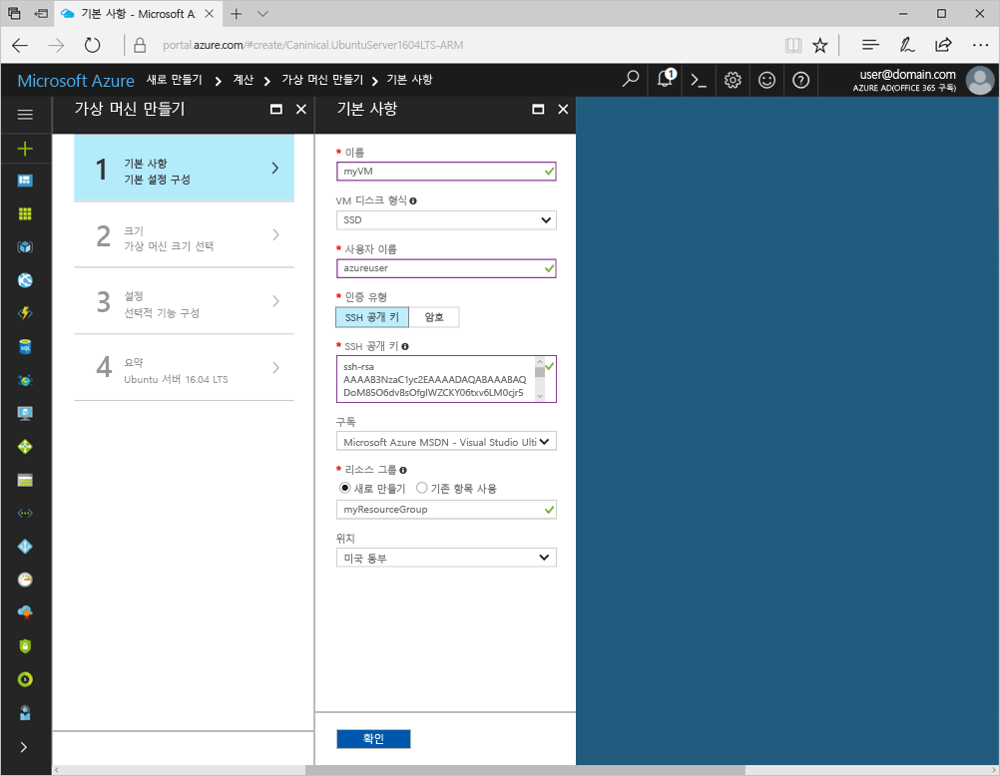
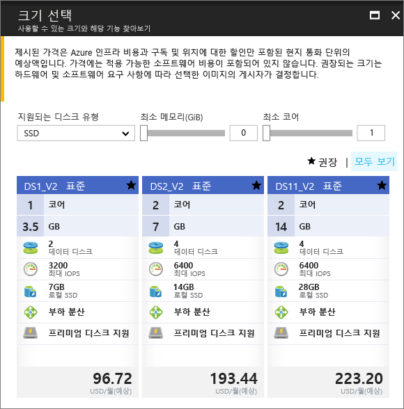
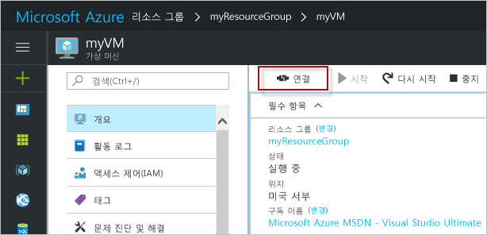

# <a name="create-a-linux-virtual-machine-with-the-azure-portal"></a><span data-ttu-id="dd575-103">Azure Portal을 사용하여 Linux 가상 컴퓨터 만들기</span><span class="sxs-lookup"><span data-stu-id="dd575-103">Create a Linux virtual machine with the Azure portal</span></span>

<span data-ttu-id="dd575-104">Azure Portal을 통해 Azure Virtual Machines를 만들 수 있습니다.</span><span class="sxs-lookup"><span data-stu-id="dd575-104">Azure virtual machines can be created through the Azure portal.</span></span> <span data-ttu-id="dd575-105">이 메서드는 가상 컴퓨터 및 관련된 모든 리소스를 만들고 구성하기 위한 브라우저 기반 사용자 인터페이스를 제공합니다.</span><span class="sxs-lookup"><span data-stu-id="dd575-105">This method provides a browser-based user interface for creating and configuring virtual machines and all related resources.</span></span> <span data-ttu-id="dd575-106">이 빠른 시작은 가상 컴퓨터를 만들고 VM에 웹 서버를 설치하는 과정을 설명합니다.</span><span class="sxs-lookup"><span data-stu-id="dd575-106">This Quickstart steps through creating a virtual machine and installing a webserver on the VM.</span></span>

<span data-ttu-id="dd575-107">Azure 구독이 아직 없는 경우 시작하기 전에 [무료 계정](https://azure.microsoft.com/free/?WT.mc_id=A261C142F) 을 만듭니다.</span><span class="sxs-lookup"><span data-stu-id="dd575-107">If you don't have an Azure subscription, create a [free account](https://azure.microsoft.com/free/?WT.mc_id=A261C142F) before you begin.</span></span>

## <a name="create-ssh-key-pair"></a><span data-ttu-id="dd575-108">SSH 키 쌍 만들기</span><span class="sxs-lookup"><span data-stu-id="dd575-108">Create SSH key pair</span></span>

<span data-ttu-id="dd575-109">이 빠른 시작을 완료하려면 SSH 키 쌍이 필요합니다.</span><span class="sxs-lookup"><span data-stu-id="dd575-109">You need an SSH key pair to complete this quick start.</span></span> <span data-ttu-id="dd575-110">기존 SSH 키 쌍을 사용하는 경우 이 단계를 건너뛸 수 있습니다.</span><span class="sxs-lookup"><span data-stu-id="dd575-110">If you have an existing SSH key pair, this step can be skipped.</span></span>

<span data-ttu-id="dd575-111">Bash 셸에서 이 명령을 실행하고 화면에 나타나는 지시를 따릅니다.</span><span class="sxs-lookup"><span data-stu-id="dd575-111">From a Bash shell, run this command and follow the on-screen directions.</span></span> <span data-ttu-id="dd575-112">명령 출력은 공개 키 파일의 파일 이름을 포함합니다.</span><span class="sxs-lookup"><span data-stu-id="dd575-112">The command output includes the file name of the public key file.</span></span> <span data-ttu-id="dd575-113">공개 키 파일의 내용을 클립보드에 복사합니다.</span><span class="sxs-lookup"><span data-stu-id="dd575-113">Copy the contents of the public key file to the clipboard.</span></span>

```bash
ssh-keygen -t rsa -b 2048
```

## <a name="log-in-to-azure"></a><span data-ttu-id="dd575-114">Azure에 로그인</span><span class="sxs-lookup"><span data-stu-id="dd575-114">Log in to Azure</span></span> 

<span data-ttu-id="dd575-115">Azure Portal( http://portal.azure.com )에 로그인합니다.</span><span class="sxs-lookup"><span data-stu-id="dd575-115">Log in to the Azure portal at http://portal.azure.com.</span></span>

## <a name="create-virtual-machine"></a><span data-ttu-id="dd575-116">가상 컴퓨터 만들기</span><span class="sxs-lookup"><span data-stu-id="dd575-116">Create virtual machine</span></span>

1. <span data-ttu-id="dd575-117">Azure Portal의 왼쪽 위에 있는 **새로 만들기** 단추를 클릭합니다.</span><span class="sxs-lookup"><span data-stu-id="dd575-117">Click the **New** button found on the upper left-hand corner of the Azure portal.</span></span>

2. <span data-ttu-id="dd575-118">**계산**을 선택한 후 **Ubuntu Server 16.04 LTS**를 선택합니다.</span><span class="sxs-lookup"><span data-stu-id="dd575-118">Select **Compute**, and then select **Ubuntu Server 16.04 LTS**.</span></span> 

3. <span data-ttu-id="dd575-119">가상 컴퓨터 정보를 입력합니다.</span><span class="sxs-lookup"><span data-stu-id="dd575-119">Enter the virtual machine information.</span></span> <span data-ttu-id="dd575-120">**인증 유형**으로 **SSH 공용 키**를 선택합니다.</span><span class="sxs-lookup"><span data-stu-id="dd575-120">For **Authentication type**, select **SSH public key**.</span></span> <span data-ttu-id="dd575-121">SSH 공용 키를 붙여 넣을 때 선행 또는 후행 공백을 모두 제거해야 합니다.</span><span class="sxs-lookup"><span data-stu-id="dd575-121">When pasting in your SSH public key, take care to remove any leading or trailing white space.</span></span> <span data-ttu-id="dd575-122">완료되면 **확인**을 클릭합니다.</span><span class="sxs-lookup"><span data-stu-id="dd575-122">When complete, click **OK**.</span></span>

    

4. <span data-ttu-id="dd575-124">VM의 크기를 선택합니다.</span><span class="sxs-lookup"><span data-stu-id="dd575-124">Select a size for the VM.</span></span> <span data-ttu-id="dd575-125">더 많은 크기를 보려면 **모두 보기**를 선택하거나 **지원되는 디스크 형식** 필터를 변경합니다.</span><span class="sxs-lookup"><span data-stu-id="dd575-125">To see more sizes, select **View all** or change the **Supported disk type** filter.</span></span> 

      

5. <span data-ttu-id="dd575-127">설정 블레이드에서 기본값을 그대로 유지하고 **확인**을 클릭합니다.</span><span class="sxs-lookup"><span data-stu-id="dd575-127">On the settings blade, keep the defaults and click **OK**.</span></span>

6. <span data-ttu-id="dd575-128">요약 페이지에서 **확인**을 클릭하여 가상 컴퓨터 배포를 시작합니다.</span><span class="sxs-lookup"><span data-stu-id="dd575-128">On the summary page, click **Ok** to start the virtual machine deployment.</span></span>

7. <span data-ttu-id="dd575-129">Azure Portal 대시보드에 VM을 고정합니다.</span><span class="sxs-lookup"><span data-stu-id="dd575-129">The VM will be pinned to the Azure portal dashboard.</span></span> <span data-ttu-id="dd575-130">배포가 완료되면 VM 요약 블레이드가 자동으로 열립니다.</span><span class="sxs-lookup"><span data-stu-id="dd575-130">Once the deployment has completed, the VM summary blade automatically opens.</span></span>


## <a name="connect-to-virtual-machine"></a><span data-ttu-id="dd575-131">가상 컴퓨터에 연결</span><span class="sxs-lookup"><span data-stu-id="dd575-131">Connect to virtual machine</span></span>

<span data-ttu-id="dd575-132">가상 컴퓨터와 SSH 연결 만들기</span><span class="sxs-lookup"><span data-stu-id="dd575-132">Create an SSH connection with the virtual machine.</span></span>

1. <span data-ttu-id="dd575-133">가상 컴퓨터 블레이드에서 **연결** 단추를 클릭합니다.</span><span class="sxs-lookup"><span data-stu-id="dd575-133">Click the **Connect** button on the virtual machine blade.</span></span> <span data-ttu-id="dd575-134">연결 단추를 클릭하면 가상 컴퓨터에 연결하는 데 사용할 수 있는 SSH 연결 문자열이 표시됩니다.</span><span class="sxs-lookup"><span data-stu-id="dd575-134">The connect button displays an SSH connection string that can be used to connect to the virtual machine.</span></span>

     

2. <span data-ttu-id="dd575-136">다음 명령을 실행하여 SSH 세션을 만듭니다.</span><span class="sxs-lookup"><span data-stu-id="dd575-136">Run the following command to create an SSH session.</span></span> <span data-ttu-id="dd575-137">이 연결 문자열을 Azure Portal에서 복사한 것으로 바꿉니다.</span><span class="sxs-lookup"><span data-stu-id="dd575-137">Replace the connection string with the one you copied from the Azure portal.</span></span>

```bash 
ssh azureuser@40.112.21.50
```

## <a name="install-nginx"></a><span data-ttu-id="dd575-138">NGINX 설치</span><span class="sxs-lookup"><span data-stu-id="dd575-138">Install NGINX</span></span>

<span data-ttu-id="dd575-139">다음 bash 스크립트를 사용하여 패키지 원본을 업데이트하고 최신 NGINX 패키지를 설치합니다.</span><span class="sxs-lookup"><span data-stu-id="dd575-139">Use the following bash script to update package sources and install the latest NGINX package.</span></span> 

```bash 
#!/bin/bash

# update package source
sudo apt-get -y update

# install NGINX
sudo apt-get -y install nginx
```

<span data-ttu-id="dd575-140">작업이 완료되면 SSH 세션을 종료하고 Azure Portal에서 VM 속성을 반환합니다.</span><span class="sxs-lookup"><span data-stu-id="dd575-140">When done, exit the SSH session and return the VM properties in the Azure portal.</span></span>


## <a name="open-port-80-for-web-traffic"></a><span data-ttu-id="dd575-141">웹 트래픽에 대해 포트 80 열기</span><span class="sxs-lookup"><span data-stu-id="dd575-141">Open port 80 for web traffic</span></span> 

<span data-ttu-id="dd575-142">NSG(네트워크 보안 그룹)는 인바운드 및 아웃바운드 트래픽의 보안을 유지합니다.</span><span class="sxs-lookup"><span data-stu-id="dd575-142">A Network security group (NSG) secures inbound and outbound traffic.</span></span> <span data-ttu-id="dd575-143">Azure Portal에서 VM이 만들어지면 SSH 연결의 포트 22 인바운드 규칙이 만들어집니다.</span><span class="sxs-lookup"><span data-stu-id="dd575-143">When a VM is created from the Azure portal, an inbound rule is created on port 22 for SSH connections.</span></span> <span data-ttu-id="dd575-144">이 VM이 웹 서버를 호스트하기 때문에 포트 80에 NSG 규칙을 만들어야 합니다.</span><span class="sxs-lookup"><span data-stu-id="dd575-144">Because this VM hosts a webserver, an NSG rule needs to be created for port 80.</span></span>

1. <span data-ttu-id="dd575-145">가상 컴퓨터에서 **리소스 그룹**의 이름을 클릭합니다.</span><span class="sxs-lookup"><span data-stu-id="dd575-145">On the virtual machine, click the name of the **Resource group**.</span></span>
2. <span data-ttu-id="dd575-146">**네트워크 보안 그룹**을 선택합니다.</span><span class="sxs-lookup"><span data-stu-id="dd575-146">Select the **network security group**.</span></span> <span data-ttu-id="dd575-147">NSG는 **형식** 열을 사용하여 식별할 수 있습니다.</span><span class="sxs-lookup"><span data-stu-id="dd575-147">The NSG can be identified using the **Type** column.</span></span> 
3. <span data-ttu-id="dd575-148">왼쪽 메뉴의 설정에서 **인바운드 보안 규칙**을 클릭합니다.</span><span class="sxs-lookup"><span data-stu-id="dd575-148">On the left-hand menu, under settings, click **Inbound security rules**.</span></span>
4. <span data-ttu-id="dd575-149">**추가**를 클릭합니다.</span><span class="sxs-lookup"><span data-stu-id="dd575-149">Click on **Add**.</span></span>
5. <span data-ttu-id="dd575-150">**이름**에서 **http**를 입력합니다.</span><span class="sxs-lookup"><span data-stu-id="dd575-150">In **Name**, type **http**.</span></span> <span data-ttu-id="dd575-151">**포트 범위**를 80으로 설정하고 **작업**을 **허용**으로 설정해야 합니다.</span><span class="sxs-lookup"><span data-stu-id="dd575-151">Make sure **Port range** is set to 80 and **Action** is set to **Allow**.</span></span> 
6. <span data-ttu-id="dd575-152">**확인**을 클릭합니다.</span><span class="sxs-lookup"><span data-stu-id="dd575-152">Click **OK**.</span></span>


## <a name="view-the-nginx-welcome-page"></a><span data-ttu-id="dd575-153">NGINX 시작 페이지 보기</span><span class="sxs-lookup"><span data-stu-id="dd575-153">View the NGINX welcome page</span></span>

<span data-ttu-id="dd575-154">NGINX를 설치하고 VM에 포트 80을 열어서 인터넷에서 웹 서버에 액세스할 수 있습니다.</span><span class="sxs-lookup"><span data-stu-id="dd575-154">With NGINX installed, and port 80 open to your VM, the webserver can now be accessed from the internet.</span></span> <span data-ttu-id="dd575-155">웹 브라우저를 열고 VM의 공용 IP 주소를 입력합니다.</span><span class="sxs-lookup"><span data-stu-id="dd575-155">Open a web browser, and enter the public IP address of the VM.</span></span> <span data-ttu-id="dd575-156">공용 IP 주소는 Azure Portal의 VM 블레이드에서 찾을 수 있습니다.</span><span class="sxs-lookup"><span data-stu-id="dd575-156">The public IP address can be found on the VM blade in the Azure portal.</span></span>

 

## <a name="clean-up-resources"></a><span data-ttu-id="dd575-158">리소스 정리</span><span class="sxs-lookup"><span data-stu-id="dd575-158">Clean up resources</span></span>

<span data-ttu-id="dd575-159">더 이상 필요하지 않을 때 리소스 그룹, 가상 컴퓨터 및 모든 관련 리소스를 삭제합니다.</span><span class="sxs-lookup"><span data-stu-id="dd575-159">When no longer needed, delete the resource group, virtual machine, and all related resources.</span></span> <span data-ttu-id="dd575-160">이렇게 하려면 가상 컴퓨터 블레이드에서 해당 리소스 그룹을 선택하고 **삭제**를 클릭합니다.</span><span class="sxs-lookup"><span data-stu-id="dd575-160">To do so, select the resource group from the virtual machine blade and click **Delete**.</span></span>

## <a name="next-steps"></a><span data-ttu-id="dd575-161">다음 단계</span><span class="sxs-lookup"><span data-stu-id="dd575-161">Next steps</span></span>

<span data-ttu-id="dd575-162">이 빠른 시작에서 간단한 가상 컴퓨터, 네트워크 보안 그룹 규칙을 배포했으며 웹 서버를 설치했습니다.</span><span class="sxs-lookup"><span data-stu-id="dd575-162">In this quick start, you’ve deployed a simple virtual machine, a network security group rule, and installed a web server.</span></span> <span data-ttu-id="dd575-163">Azure 가상 컴퓨터에 대한 자세한 내용을 알아보려면 Linux VM의 자습서를 계속 진행합니다.</span><span class="sxs-lookup"><span data-stu-id="dd575-163">To learn more about Azure virtual machines, continue to the tutorial for Linux VMs.</span></span>

> [!div class="nextstepaction"]
> [<span data-ttu-id="dd575-164">Azure Linux 가상 컴퓨터 자습서</span><span class="sxs-lookup"><span data-stu-id="dd575-164">Azure Linux virtual machine tutorials</span></span>](./tutorial-manage-vm.md)
