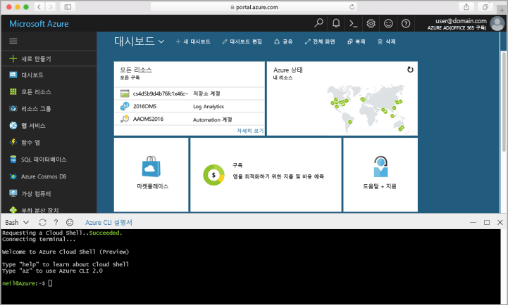

## Azure Cloud Shell 시작

Azure 클라우드 셸 hello hello Azure 포털 내에서 직접 실행할 수 있는 무료 Bash 셸의입니다. Hello Azure CLI 사전 설치 및 toouse 사용자 계정으로 구성 된이 있습니다. Hello 클릭 **클라우드 셸** hello 메뉴 hello의 오른쪽 위에서 hello에에서 단추 [Azure 포털](https://portal.azure.com)합니다.

hello 단추에는이 항목의 단계를 모두 hello toorun를 사용할 수 있는 대화형 셸은 시작:

