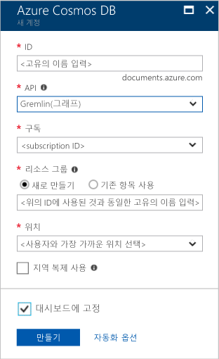

1. 새 창에서 toohello에 로그인 [Azure 포털](https://portal.azure.com/)합니다.In a new window, sign in toohello [Azure portal](https://portal.azure.com/).
2. Hello 왼쪽된 창에서 클릭 **새로**, 클릭 **데이터베이스**, 그 다음 **Azure Cosmos DB**, 클릭 **만들기**합니다.In hello left pane, click **New**, click **Databases**, and then under **Azure Cosmos DB**, click **Create**.
   
   

3. Hello에 **새 계정** 블레이드에서이 Azure Cosmos DB 계정에 대해 원하는 hello 구성을 지정 합니다.In hello **New account** blade, specify hello configuration that you want for this Azure Cosmos DB account. 

    Azure Cosmos DB를 사용하면 Gremlin(그래프), MongoDB, SQL(DocumentDB) 및 테이블(키-값)의 4가지 프로그래밍 모델 중 하나를 선택할 수 있으며, 지금은 별도의 계정이 필요합니다.With Azure Cosmos DB, you can choose one of four programming models: Gremlin (graph), MongoDB, SQL (DocumentDB), and Table (key-value), each which currently require a separate account.
       
    Hello Graph API에 대 한 프로그램에서는이 빠른 시작 문서의 되므로 **Gremlin (그래프)** hello 양식을 작성할 때.In this quick-start article, we program against hello Graph API, so choose **Gremlin (graph)** as you fill out hello form. 카탈로그 앱의 문서 데이터, 키/값(테이블) 데이터 또는 MongoDB 앱에서 마이그레이션한 데이터가 있는 경우, Azure Cosmos DB에서는 모든 중요 업무용 응용 프로그램에 대해 전 세계 분산형 고가용성 데이터베이스 서비스 플랫폼을 제공할 수 있습니다.If you have document data from a catalog app, key/value (table) data, or data that's migrated from a MongoDB app, realize that Azure Cosmos DB can provide a highly available, globally distributed database service platform for all your mission-critical applications.

    Hello에 hello 필드에 내용을 입력 **새 계정** hello 정보를 사용 하 여 hello에 블레이드 스크린 샷을 가이드로 다음 값 hello 스크린 샷의 hello 값 보다 다 수 있습니다.Complete hello fields on hello **New account** blade, using hello information in hello following screenshot as a guide - your values may be different than hello values in hello screenshot.
 
    

    설정Setting|제안 값Suggested value|설명Description
    ---|---|---
    IDID|*고유 값**Unique value*|이 Azure Cosmos DB 계정을 식별하는 고유한 이름입니다.A unique name that identifies this Azure Cosmos DB account. 때문에 *documents.azure.com* 가 추가 된 toohello ID를 제공 하는 toocreate URI를 사용 하 여 식별할 수 있지만 고유 id입니다.Because *documents.azure.com* is appended toohello ID that you provide toocreate your URI, use a unique but identifiable ID. hello ID는 소문자, 숫자 및 hello 하이픈 (-) 문자를 포함 해야 하며 3 too50 문자로 포함 되어야 합니다.hello ID must contain only lowercase letters, numbers, and hello hyphen (-) character, and it must contain from 3 too50 characters.
    APIAPI|Gremlin(그래프)Gremlin (graph)|Hello에 대 한 프로그램 우리 [Graph API](../articles/cosmos-db/graph-introduction.md) 이 문서의 뒷부분에 나오는 합니다.We program against hello [Graph API](../articles/cosmos-db/graph-introduction.md) later in this article.|
    구독Subscription|*사용자의 구독**Your subscription*|hello이 Azure Cosmos DB 계정의 toouse 되도록 Azure 구독.hello Azure subscription that you want toouse for this Azure Cosmos DB account. 
    리소스 그룹Resource Group|*hello 동일한 ID 값**hello same value as ID*|hello 새 리소스 그룹 이름을 사용자 계정에 대 한 합니다.hello new resource group name for your account. 간단한 설명을 위해 hello 이름과 같은 이름을 사용자 id입니다.로 사용할 수 있습니다.For simplicity, you can use hello same name as your ID. 
    위치Location|*hello 지역 가장 가까운 tooyour 사용자**hello region closest tooyour users*|지리적 위치에 있는 toohost Azure Cosmos DB 계정을 hello 합니다.hello geographic location in which toohost your Azure Cosmos DB account. Hello 위치를 가장 가까운 tooyour 사용자 선택 toogive toohello 데이터의 가장 빠른 액세스를 hello에 있습니다.Choose hello location closest tooyour users toogive them hello fastest access toohello data.

4. 클릭 **만들기** toocreate hello 계정.Click **Create** toocreate hello account.
5. Hello 맨 위의 도구 모음에서 클릭 hello **알림** 아이콘  toomonitor hello 배포 프로세스입니다.On hello top toolbar, click hello **Notifications** icon  toomonitor hello deployment process.

    

6.  Hello 알림 창 hello 배포 성공, 닫기 hello 알림 창을 나타내며 hello open hello 새 계정을 때 **모든 리소스** hello 대시보드 타일입니다.When hello Notifications window indicates hello deployment succeeded, close hello notification window and open hello new account from hello **All Resources** tile on hello Dashboard. 

    
