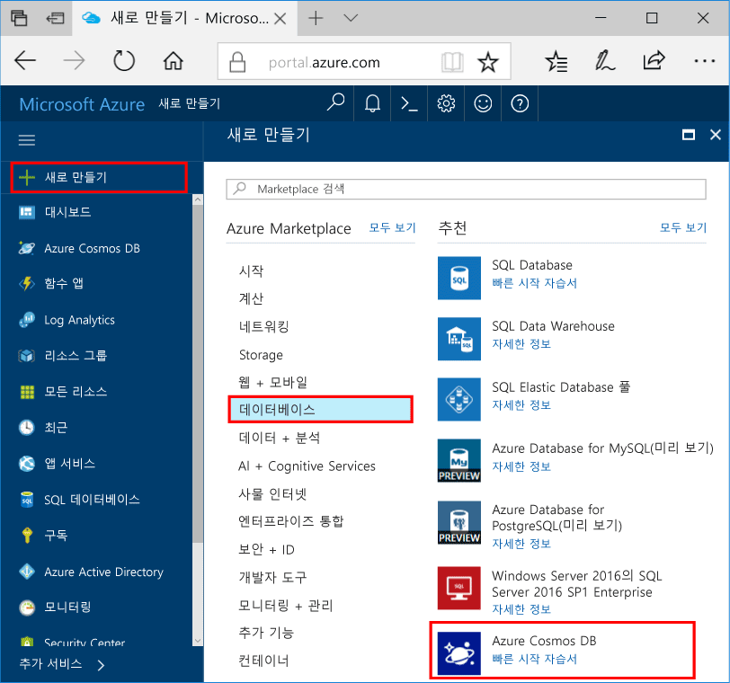

1. 새 창에서 [Azure Portal](https://portal.azure.com/)에 로그인합니다.In a new window, sign in to the [Azure portal](https://portal.azure.com/).
2. 왼쪽 창에서 **새로 만들기**, **데이터베이스**를 차례로 클릭한 다음 **Azure Cosmos DB**에서 **만들기**를 클릭합니다.In the left pane, click **New**, click **Databases**, and then under **Azure Cosmos DB**, click **Create**.
   
   

3. **새 계정** 블레이드에서 이 Azure Cosmos DB 계정에 원하는 구성을 지정합니다.In the **New account** blade, specify the configuration that you want for this Azure Cosmos DB account. 

    Azure Cosmos DB를 사용하면 Gremlin(그래프), MongoDB, SQL(DocumentDB) 및 테이블(키-값)의 4가지 프로그래밍 모델 중 하나를 선택할 수 있으며, 지금은 별도의 계정이 필요합니다.With Azure Cosmos DB, you can choose one of four programming models: Gremlin (graph), MongoDB, SQL (DocumentDB), and Table (key-value), each which currently require a separate account.
       
    이 빠른 시작 문서에서는 Graph API를 프로그래밍하므로 양식을 작성할 때 **Gremlin(그래프)**를 선택합니다.In this quick-start article, we program against the Graph API, so choose **Gremlin (graph)** as you fill out the form. 카탈로그 앱의 문서 데이터, 키/값(테이블) 데이터 또는 MongoDB 앱에서 마이그레이션한 데이터가 있는 경우, Azure Cosmos DB에서는 모든 중요 업무용 응용 프로그램에 대해 전 세계 분산형 고가용성 데이터베이스 서비스 플랫폼을 제공할 수 있습니다.If you have document data from a catalog app, key/value (table) data, or data that's migrated from a MongoDB app, realize that Azure Cosmos DB can provide a highly available, globally distributed database service platform for all your mission-critical applications.

    다음 스크린샷의 정보를 지침으로 사용하여 **새 계정** 블레이드의 필드를 완성합니다. 입력한 값은 스크린샷의 값과 다를 수 있습니다.Complete the fields on the **New account** blade, using the information in the following screenshot as a guide - your values may be different than the values in the screenshot.
 
    

    설정Setting|제안 값Suggested value|설명Description
    ---|---|---
    IDID|*고유 값**Unique value*|이 Azure Cosmos DB 계정을 식별하는 고유한 이름입니다.A unique name that identifies this Azure Cosmos DB account. URI를 만들기 위해 제공하는 ID에 *documents.azure.com*이 추가되므로 식별할 수 있는 고유한 ID를 사용합니다.Because *documents.azure.com* is appended to the ID that you provide to create your URI, use a unique but identifiable ID. ID는 소문자, 숫자 및 하이픈(-) 문자만 포함해야 하며, 3-50자여야 합니다.The ID must contain only lowercase letters, numbers, and the hyphen (-) character, and it must contain from 3 to 50 characters.
    APIAPI|Gremlin(그래프)Gremlin (graph)|이 문서의 뒷부분에서 [Graph API](../articles/cosmos-db/graph-introduction.md)를 프로그래밍합니다.We program against the [Graph API](../articles/cosmos-db/graph-introduction.md) later in this article.|
    구독Subscription|*사용자의 구독**Your subscription*|이 Azure Cosmos DB 계정에 사용할 Azure 구독입니다.The Azure subscription that you want to use for this Azure Cosmos DB account. 
    리소스 그룹Resource Group|*ID와 동일한 값**The same value as ID*|계정의 새 리소스 그룹 이름입니다.The new resource group name for your account. 간단히 하기 위해 ID와 동일한 이름을 사용할 수 있습니다.For simplicity, you can use the same name as your ID. 
    위치Location|*사용자와 가장 가까운 지역**The region closest to your users*|Azure Cosmos DB 계정을 호스트할 지리적 위치입니다.The geographic location in which to host your Azure Cosmos DB account. 데이터에 빠르게 액세스할 수 있도록 사용자와 가장 가까운 위치를 선택합니다.Choose the location closest to your users to give them the fastest access to the data.

4. **만들기**를 클릭하여 계정을 만듭니다.Click **Create** to create the account.
5. 맨 위 도구 모음에서 **알림** 아이콘 을 클릭하여 배포 프로세스를 모니터링합니다.On the top toolbar, click the **Notifications** icon  to monitor the deployment process.

    

6.  알림 창에 배포 성공이 나타날 경우 알림 창을 닫고 대시보드의 **모든 리소스** 타일에서 새 계정을 엽니다.When the Notifications window indicates the deployment succeeded, close the notification window and open the new account from the **All Resources** tile on the Dashboard. 

    